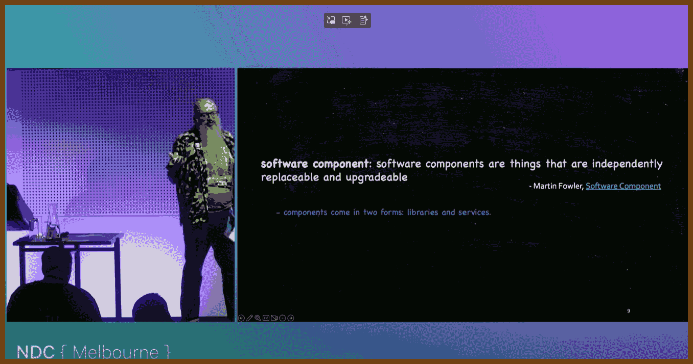

## ⌚ Nice watch!

2025-07-06 [Effective Ranges: A Tutorial for Using C++2x Ranges - Jeff Garland - CppCon 2023 - YouTube](https://www.youtube.com/watch?v=QoaVRQvA6hI) { www.youtube.com }

> 
>
> 1. **Ranges Abstract Iteration and Enable Composable Pipelines:**
>    - Ranges allow working with sequences in a more expressive and declarative way.
>    - The move from manual `begin` and `end` iterator management to range-based algorithms improves safety and readability.
> 2. **Views Provide Lazy, Non-Owning Computation:**
>    - Views are lightweight wrappers that delay computation until necessary.
>    - Useful for building efficient pipelines where intermediate results are not stored in memory.
> 3. **Pipe Syntax Enhances Readability and Function Composition:**
>    - Using `|` operator with view adapters enables cleaner syntax resembling Unix pipes.
>    - Improves clarity by expressing transformations step-by-step.
> 4. **C++23 Introduces New Views and Algorithms:**
>    - Includes `find_last`, `fold_left`, `chunk_by`, `join`, `zip`, and more.
>    - `find_last` simplifies reverse iteration compared to STL's reverse iterators.
> 5. **Views Must Be Passed Carefully in Functions:**
>    - Do not pass views as const references due to internal caching behaviors.
>    - Prefer forwarding references (`T&&`) to preserve intended behavior.
> 6. **Projections Simplify Algorithm Customization:**
>    - Range algorithms allow projections, enabling operations on subfields without writing custom comparators.
>    - E.g., `ranges::sort(data, {}, &Data::field)`.
> 7. **Improved Return Values Preserve Computation Context:**
>    - Algorithms like `find_last` return subranges, not just iterators.
>    - Encourages better code by retaining useful information.
> 8. **Range-based Construction in Containers (C++23):**
>    - STL containers now support constructing and assigning from ranges.
>    - Enables direct pipeline-to-container conversions (e.g., `to<std::deque>`).
> 9. **You Can Write Your Own Views in C++23:**
>    - C++20 lacked a standard mechanism for user-defined views; C++23 adds it.
>    - Writing custom views is complex due to required iterator machinery, but tools like Boost's `stdx::interfaces` can help.
> 10. **Use Range Algorithms First When Possible:**
>     - They offer better constraints, return types, and support for projections.
>     - Cleaner syntax and fewer error-prone constructs compared to raw STL iterator use.
>
> 2025-07-06 [ericniebler/range-v3: Range library for C++14/17/20, basis for C++20's std::ranges](https://github.com/ericniebler/range-v3) { github.com }
>
> > **range-v3**
> >
> > Range library for C++14/17/20. This code was the basis of [a formal proposal](https://ericniebler.github.io/std/wg21/D4128.html) to add range support to the C++ standard library. That proposal evolved through a Technical Specification, and finally into [P0896R4 "The One Ranges Proposal"](https://wg21.link/p0896r4) which was merged into the C++20 working drafts in November 2018.
> >
> > **About**
> >
> > Ranges are an extension of the Standard Template Library that makes its iterators and algorithms more powerful by making them *composable*. Unlike other range-like solutions which seek to do away with iterators, in range-v3 ranges are an abstraction layer *on top* of iterators.
> >
> > Range-v3 is built on three pillars: Views, Actions, and Algorithms. The algorithms are the same as those with which you are already familiar in the STL, except that in range-v3 all the algorithms have overloads that take ranges in addition to the overloads that take iterators. Views are composable adaptations of ranges where the adaptation happens lazily as the view is iterated. And an action is an eager application of an algorithm to a container that mutates the container in-place and returns it for further processing.
> >
> > Views and actions use the pipe syntax (e.g., `rng | adapt1 | adapt2 | ...`) so your code is terse and readable from left to right.

2025-07-06 [Resilient by Design - Chris Ayers - NDC Oslo 2025 - YouTube](https://www.youtube.com/watch?v=Vn-vcl4rQX0) { www.youtube.com }

> 

> 2025-07-06 [Aspiring .NET & Resilience @ NDC Oslo 2025 - Chris’s Tech ADHD](https://chris-ayers.com/2025/05/24/ndc-oslo-2025-wrapup/) { chris-ayers.com }
>
> 2025-07-06 [Azure/Azure-Proactive-Resiliency-Library-v2: Azure Proactive Resiliency Library v2 (APRL) - Source for Azure WAF reliability guidance and associated ARG queries](https://github.com/Azure/Azure-Proactive-Resiliency-Library-v2) { github.com }
>
> - 2025-07-06 [Azure/Azure-Proactive-Resiliency-Library-v2: Azure Proactive Resiliency Library v2 (APRL) - Source for Azure WAF reliability guidance and associated ARG queries](https://github.com/Azure/Azure-Proactive-Resiliency-Library-v2) { github.com }
>
> 2025-07-06 [Azure Well-Architected Framework - Microsoft Azure Well-Architected Framework | Microsoft Learn](https://learn.microsoft.com/en-us/azure/well-architected/) { learn.microsoft.com }

2025-07-05 [Let’s catch up with C#! Exciting new features in C# 9, 10, 11, 12 and 13! - Filip Ekberg - NDC Oslo - YouTube](https://www.youtube.com/watch?v=YVc35sv52d4) { www.youtube.com }

> 
>
> The following examples are GPT4o generated, inspired by the talk transcript:

Here’s an enhanced and polished Markdown list of C# language features, each with a clearer code example and concise description:

------

**Nullable Reference Types** *(C# 8)*

Compiler warns on nullable usage to avoid `NullReferenceException`.

```csharp
string? name = null;
Console.WriteLine(name?.Length); // Safe check
```

------

**Required Keyword** *(C# 11)*

Forces initialization of essential properties via object initializers.

```csharp
public class Person {
  public required string Name { get; init; }
}
```

------

**Init‑only Setters** *(C# 9)*

Allows setting properties only during instantiation, promoting immutability.

```csharp
public class User {
  public string Username { get; init; }
}
```

------

**Target‑Typed `new` Expressions** *(C# 9)*

Omits redundant type when it can be inferred.

```csharp
Person p = new();
```

------

**Treat Warnings as Errors** *(Compiler Option)*

Fails build on warnings to enforce high code quality.

```xml
<PropertyGroup>
  <TreatWarningsAsErrors>true</TreatWarningsAsErrors>
</PropertyGroup>
```

------

**Top‑level Statements** *(C# 9)*

Removes boilerplate `Main` method for quick scripting or minimal APIs.

```csharp
Console.WriteLine("Hello, World!");
```

------

**Pattern Matching Enhancements & List Patterns** *(C# 8–11)*

Supports rich `switch`/`is` patterns including lists and tuples.

```csharp
if (numbers is [1, 2, .., 99]) {
  Console.WriteLine("Starts with 1,2 ends with 99");
}
```

------

**Switch Expressions** *(C# 8)*

Simplifies `switch` statements into expressions.

```csharp
string result = x switch {
  1 => "One",
  2 => "Two",
  _ => "Other"
};
```

------

**Record Types** *(C# 9)*

Immutable reference types with built‑in equality and concise syntax.

```csharp
public record Person(string Name, int Age);
```

------

**File‑scoped Namespaces** *(C# 10)*

Flattens indentation and streamlines namespace declaration.

```csharp
namespace MyApp;

class Program { }
```

------

**Global Using Directives** *(C# 10)*

Applies `using` directives across the project from a single file.

```csharp
global using System.Text;
```

------

**Raw String Literals** *(C# 11)*

Simplifies multiline or escaped strings.

```csharp
var json = """
{
  "name": "John",
  "age": 30
}
""";
```

------

**UTF‑8 String Literals** *(C# 11)*

Creates UTF‑8 encoded string spans to improve performance.

```csharp
ReadOnlySpan<byte> utf8 = "hello"u8;
```

------

**Readonly Span Usage** *(C# 7.2+)*

Enables memory-safe, high-performance access to underlying data.

```csharp
ReadOnlySpan<char> span = "example";
Console.WriteLine(span.Slice(0,3).ToString()); // "exa"
```

------

**Zero‑allocation String Manipulation** *(C# 11)*

Slices strings without creating new copies.

```csharp
ReadOnlySpan<char> name = "John Doe".AsSpan();
ReadOnlySpan<char> first = name[..4]; // "John"
```

------

**Static Abstract Members in Interfaces** *(C# 11)*

Supports generic math by allowing static operations in interfaces.

```csharp
interface IAdd<T> {
  static abstract T Add(T x, T y);
}
```

------

**Delegate Caching Optimization** *(C# 11)*

Improves performance by caching method group delegates.

```csharp
Action a = MyStaticMethod;
```

------

**Generic Math Support** *(C# 11)*

Uses arithmetic operators in generic constraints.

```csharp
T Sum<T>(T a, T b) where T : INumber<T> => a + b;
```

------

**Generic Attributes** *(C# 11)*

Enables attributes with generic parameters.

```csharp
[MyAttribute<string>]
public class MyClass { }
```

------

**Primary Constructors** *(C# 12)*

Declares constructor parameters directly in the class header.

```csharp
class Widget(string id) {
  public void Print() => Console.WriteLine(id);
}
```

------

**Collection Expressions** *(C# 12)*

Simplifies array, list, or span creation.

```csharp
int[] numbers = [1, 2, 3];
```

------

**Spread Element in Collection Expressions** *(C# 12)*

Flattens multiple collections into one.

```csharp
int[] merged = [..arr1, ..arr2];
```

------

**Optional Parameters in Lambdas** *(C# 12)*

Adds default values to lambda parameters.

```csharp
Func<int, int, int> sum = (int x = 1, int y = 2) => x + y;
```

------

**Implicit Lambda Parameter Types** *(C# 10)*

Type inference for lambda parameters using `var`.

```csharp
var toInt = (var s) => int.Parse(s);
```

------

**Alias Any Type** *(C# 12)*

Creates type aliases for readability.

```csharp
using Size = (int Width, int Height);
Size dims = (800, 600);
```

------

**Interceptors for Source Generation** *(C# 12)*

Enables compile-time method interception for code injection.

```csharp
[InterceptsLocation]
void Log(string msg) => Console.WriteLine(msg);
```

------

**Minimal APIs** *(C# 9+)*

Lightweight, endpoint-focused API creation.

```csharp
app.MapGet("/", () => "Hello World");
```

------

**Lock Object (New Synchronization Primitive)** *(C# 13/.NET 9)*

Offers optimized thread synchronization via `Lock`.

```csharp
private static Lock _lock = new();
```

------

**Field Keyword** *(C# 14)*

Accesses auto-property backing field inside the accessor.

```csharp
public string Name {
  get => field.ToUpper();
  set => field = value;
}
```

------

**Implicit Index Access (`^`)** *(C# 8)*

Enables accessing from end of collections.

```csharp
int last = numbers[^1];
```

------

**Overload Resolution Priority Attribute** *(C# 13)*

Controls which overload is chosen when ambiguous.

```csharp
[OverloadResolutionPriority(1)]
void M(List<int> list) { }
```

------

**Partial Members Enhancements** *(C# 13)*

Makes constructors, methods, or properties partial for source generators.

```csharp
partial class Person {
  partial void OnNameChanged();
}
```

------

**Implicit Span Conversions** *(C# 14)*

Allows seamless `Span<T>` allocation without casting.

```csharp
Span<char> buffer = stackalloc char[10];
```

------

**Extension Everything** *(C# 14 Planned)*

Declares instance-like extension members via static classes.

```csharp
extension class UserExt : User {
  string Display => $"{Name} ({Email})";
}
```

------

**Null‑Conditional Assignment** *(C# 14)*

Assigns a value only if the target is null.

```csharp
user?.Name ??= "Default Name";
```

------

2025-06-24 [Building Rock-Solid Encrypted Applications - Ben Dechrai - NDC Melbourne 2025 - YouTube](https://www.youtube.com/watch?v=QirIcv4HgrU) { www.youtube.com }

> 
>
> Summary: Building Rock-Solid Encrypted Applications – Ben Dechrai
>
> Ben Dechrai walks through building a secure chat application, starting with plain-text messages and evolving to an end-to-end encrypted, multi-device system. He explains how to apply AES symmetric encryption, Curve25519 key pairs, and Diffie-Hellman key exchange. The talk covers how to do secure key rotation, share keys across devices without leaks, scale encrypted messaging systems without data bloat, and defend against metadata analysis.
>
> Key Insights
>
> 1. **Encryption is mandatory**  
>    Regulatory frameworks like GDPR allow fines up to €20 million or 4% of annual global revenue.  
>    [See GDPR Summary – EU Commission](https://commission.europa.eu/law/law-topic/data-protection/reform/rules-business-and-organisations_en)
>
> 2. **Use AES-256-GCM for payload encryption**  
>    This is a well-audited symmetric cipher standardized in FIPS 197.  
>    [See NIST FIPS 197: AES Specification](https://nvlpubs.nist.gov/nistpubs/FIPS/NIST.FIPS.197-upd1.pdf)
>
> 3. **Use Curve25519 key pairs per device**  
>    Each device generates its own key pair; public key is shared, private key is never uploaded.  
>    [See RFC 7748: Elliptic Curves for DH Key Agreement](https://datatracker.ietf.org/doc/html/rfc7748)
>
> 4. **Encrypt the symmetric key for each participant**  
>    Encrypt the actual message once with AES, then encrypt the AES key for each recipient using their public key. This avoids the large ciphertext problem seen in naive PGP-style encryption.
>
> 5. **Rotate ephemeral keys regularly for forward secrecy**  
>    Generate a new key pair for each chat session and rotate keys on time or message count to ensure Perfect Forward Secrecy.  
>    [See Cloudflare on Perfect Forward Secrecy](https://www.cloudflare.com/learning/ssl/keyless-ssl/)
>
> 6. **Use Diffie-Hellman to agree on session keys securely**  
>    Clients can agree on a shared secret without sending it over the wire. This makes it possible to use symmetric encryption without needing to exchange the key.  
>    [See Wikipedia: Diffie–Hellman Key Exchange](https://en.wikipedia.org/wiki/Diffie%E2%80%93Hellman_key_exchange)
>
> 7. **Use QR codes to securely pair devices**  
>    When onboarding a second device (e.g. laptop + phone), generate keys locally and transfer only a temporary public key via QR. Use it to establish identity without a central login.
>
> 8. **Mask metadata to avoid traffic analysis**  
>    Even encrypted messages can leak patterns through metadata. Pad messages to fixed sizes, send decoy traffic, and let all clients pull all messages to make inference harder.
>
> 9. **Adopt battle-tested protocols like Signal**  
>    Don’t invent your own protocol if you're building secure messaging. The Signal Protocol already solves identity, authentication, and key ratcheting securely.  
>    [See Signal Protocol Specification](https://signal.org/docs/specifications/doubleratchet/)
>
> 10. **Store only ciphertext and public keys on servers**  
>       All decryption happens on the device. Retaining private keys or decrypted messages is risky unless legally required. Private key loss or compromise must only affect a small slice of messages, not entire histories.

2025-06-23 [I locked 1000 architects in a room until they all agreed on the best solution - Bronwen Zande - YouTube](https://www.youtube.com/watch?v=HEhTUJBXYbk) { www.youtube.com }

> **I built 1,000 architects using AI—each with a name, country, skillset, and headshot**
> I asked a language model to make me architect profiles. I told it their gender, country, and years of experience. Then I got it to generate a photo too. I used tools like DALL-E and ChatGPT to get realistic images.
>
> **They all designed the same web app—based on a spec for a startup called Loom Ventures**
> I created a pretend company and asked for a functional spec (nothing too crazy—blogs, search, logins, some CMS). Then I gave that spec to every AI architect and asked each to give me a full software design in Markdown.
>
> **I made them battle it out, tournament style, until we found “the best” design**
> At first, designs were grouped and reviewed by four other architects (randomly picked). The best ones moved on to knockout rounds. In the final round, the last two designs were judged by all remaining architects.
>
> **The reviews weren’t just random—they had reasons and scores**
> Each reviewer gave a score out of 100 and explained why. I asked them to be clear, compare trade-offs, and explain how well the design met the client's needs. The reviews came out in JSON so I could process them easily.
>
> **Experience and job titles really affected scores**
> If a design said it was written by a “junior” architect, it got lower marks—even if the content was decent. When I removed the titles and re-ran reviews, scores jumped by 15%. So even the AIs showed bias.
>
> **Early mistakes in the prompt skewed my data badly**
> My first example profile included cybersecurity, and the AI just kept making cyber-focused architects. Nearly all designs were security-heavy. I had to redo everything with simpler prompts and let the model be more creative.
>
> **The best designs added diagrams, workflows, and Markdown structure**
> The winning entries used flowcharts (Mermaid), ASCII diagrams, and detailed explanations. They felt almost like something you’d see in a real architecture doc. A lot better than a wall of plain text.
>
> **Personas from different countries mentioned local laws**
> That was cool. The architects from Australia talked about the APP (privacy laws). The ones from Poland mentioned GDPR. That means the AI was paying attention to the persona’s background.

2025-06-19 [Andrej Karpathy: Software Is Changing (Again) - YouTube](https://www.youtube.com/watch?v=LCEmiRjPEtQ) { www.youtube.com }

> 
>
> **Software 3.0 builds on earlier paradigms:** It extends Software 1.0 (explicit code) and Software 2.0 (learned neural networks) by allowing developers to program using prompts in natural language.
>
> **Prompts are the new source code:** In Software 3.0, well-crafted prompts function like programs and are central to instructing LLMs on what to do, replacing large parts of traditional code.
>
> **LLMs act as computing platforms:** Language models serve as runtime engines, available on demand, capable of executing complex tasks, and forming a new computational substrate.
>
> **Feedback loops are essential:** Effective use of LLMs involves iterative cycles—prompt, generate, review, and refine—to maintain control and quality over generated outputs.
>
> **Jagged intelligence introduces unpredictability:** LLMs can solve complex problems but often fail on simple tasks, requiring human validation and cautious deployment.
>
> **LLMs lack persistent memory:** Since models don’t retain long-term state, developers must handle context management and continuity externally.
>
> **“Vibe coding” accelerates prototyping:** Rapid generation of code structures via conversational prompts can quickly build scaffolds but should be used cautiously for production-grade code.
>
> **Security and maintainability remain concerns:** Generated code may be brittle, insecure, or poorly understood, necessitating rigorous testing and oversight.
>
> **Multiple paradigms must coexist:** Developers should blend Software 1.0, 2.0, and 3.0 techniques based on task complexity, clarity of logic, and risk tolerance.
>
> **Infrastructure reliability is critical:** As LLMs become central to development workflows, outages or latency can cause significant disruption, underscoring dependency risks.
>
> Movies from the talk:
>
> - [Rain Man (1988) - IMDb](https://www.imdb.com/title/tt0095953/) { www.imdb.com }
>
>   > When self-centered car dealer Charlie Babbitt learns that his estranged father's fortune has been left to an institutionalized older brother he never knew, Raymond, he kidnaps him in hopes of securing the inheritance. What follows is a transformative cross-country journey where Charlie discovers Raymond is an autistic savant with extraordinary memory and numerical skills. The film’s uniqueness lies in its sensitive portrayal of autism and the emotional evolution of a man reconnecting with family through empathy and acceptance.
>
> - [Memento (2000) - IMDb](https://www.imdb.com/title/tt0209144/) { www.imdb.com }
>
>   > Leonard Shelby suffers from short-term memory loss, unable to form new memories after a traumatic event. He relies on Polaroid photos and tattoos to track clues in his obsessive search for his wife's killer. Told in a non-linear, reverse chronology that mirrors Leonard’s disoriented mental state, the film uniquely immerses the viewer in the protagonist’s fractured perception, making the mystery unravel in a mind-bending and emotionally charged fashion.
>
> - [50 First Dates (2004) - IMDb](https://www.imdb.com/title/tt0343660/) { www.imdb.com }
>
>   > Henry Roth, a commitment-phobic marine veterinarian in Hawaii, falls for Lucy Whitmore, a woman with anterograde amnesia who forgets each day anew after a car accident. To win her love, he must make her fall for him again every day. The film blends romantic comedy with neurological drama, and its charm comes from turning a memory disorder into a heartfelt and humorous exploration of persistence, love, and hope.
>
> 
>
> **Tools:**
>
> - gitingest.com: change repository url from github to gitingest, like https://gitingest.com/dzharii/awwlib-cpp and it will create giant md file for LLM
>   
>
> 
>
> 2025-06-19 [Andrej Karpathy on Software 3.0: Software in the Age of AI](https://www.latent.space/p/s3) { www.latent.space }
>
> > 

2025-06-16 [Common Software Architectures and How they Fail - YouTube](https://www.youtube.com/watch?v=m4TPSeTWmeo) { www.youtube.com }

> 
>
> **Key Takeaways:**
>
> - Modern deployment models (cloud, containers, serverless) simplify infrastructure maintenance, enhancing scalability and agility.
> - Horizontal scalability (using multiple servers) improves fault tolerance but introduces stateless application constraints.
> - Database performance optimization includes caching, read replicas, and CQRS but involves complexity and eventual consistency trade-offs.
> - Microservices address team and scalability issues but require careful handling of inter-service communication, fault tolerance, and increased operational complexity.
> - Modular monoliths, feature flags, blue-green deployments, and experimentation libraries like Scientist effectively mitigate deployment risks and complexity.

2025-06-09 [Microservices, Where Did It All Go Wrong? - Ian Cooper - NDC Melbourne 2025 - YouTube](https://www.youtube.com/watch?v=O-lNh-_rnLM) { www.youtube.com }

> 
>
> 
>
> This talk peels back the hype around microservices and asks why our bold leap into dozens—or even hundreds—of tiny, replaceable services has sometimes left us tangled in latency, brittle tests and orchestration nightmares. Drawing on the 1975 Fundamental Theory of Software Engineering, the speaker reminds us that splitting a problem into “manageably small” pieces only pays off if those pieces map to real business domains and stay on the right side of the intramodule vs intermodule cost curve. Through vivid “death star” diagrams and anecdotes of vestigial “restaurant hours” APIs, we see how team availability, misunderstood terminology and the lure of containers have driven us toward the anti-pattern of nano-services.
>
> The remedy is framed via the 4+1 architectural views and a return to purpose-first design: start with a modular monolith until your domain boundaries—and team size—demand independent services; adopt classic microservices for clear subdomains owned by two-pizza teams; or embrace macroservices when fine-grained services impose too much overhead. By aligning services to business capabilities, designing for failure, and choosing process types per the 12-factor model, we strike the balance where cognitive load is low, deployments stay smooth and each component remains genuinely replaceable.
>
> Tags: microservices, modular monolith, macroservices, bounded context, domain storytelling, 4+1 architecture, service granularity, team topologies

2025-06-04 [The CIA method for making quick decisions under stress | Andrew Bustamante - YouTube](https://www.youtube.com/watch?v=h5sCj8ic1rM) { www.youtube.com }

> 
>
> Understand that **time is your most valuable asset** because, unlike energy and money, you cannot create more of it; recognizing time’s finite nature shifts your mindset to treat each moment as critical.
>
> When the number of tasks exceeds your capacity, you experience task saturation, which leads to decreased cognitive ability and increased stress; acknowledging this helps you avoid inefficiency and negative self-perception.
>
> Apply the **“subtract two” rule** by carrying out two fewer tasks than you believe you can handle simultaneously; reducing your focus allows you to allocate more resources to each task and increases overall productivity.
>
> Use operational prioritization by asking, **“What is the next task I can complete in the shortest amount of time?”**; this elementary approach leverages time’s objectivity to build momentum and confidence as you rapidly reduce your task load.
>
> In high-pressure or dangerous situations, focus on executing the **next fastest action**—such as seeking cover—because immediate, simple decisions create space and momentum for subsequent choices that enhance survival.
>
> Combat **“head trash,” the negative self-talk that arises when you’re overwhelmed**, by centering on the next simplest task; staying grounded in rational, achievable actions prevents emotional derailment and keeps you moving forward.
>
> Practice operational prioritization consistently at home and work so that when you reach task saturation, doing the next simplest thing becomes an automatic response; repeated drilling transforms this method into a reliable tool that fosters resilience and peak performance.
>
> Tags: time management, task saturation, operational prioritization, productivity, decision making, CIA methods, cognitive load, stress management, momentum, next-task focus, head trash, high-pressure situations, survival mindset, resource allocation, time as asset

2025-06-03 [What You Should Know About FUTO Keyboard - YouTube](https://www.youtube.com/watch?v=cFP5bp3JvaU) { www.youtube.com }

> 
>
> “with a PC keyboard. it bridges an electrical circuit to send a signal to your computer.” As typing evolved from mechanical typewriters to touchscreen apps, “software has become increasingly developed to serve its creators more than the users.” In many popular keyboards, “it sends everything you typed in that text field to somebody else's computer,” and “they say they may then go and train AI models on your data.” Even disabling obvious data-sharing options doesn’t fully stop collection—“in swift key there's a setting to share data for ads personalization and it's enabled by default.”
>
> FUTO Keyboard addresses this by offering a fully offline experience: “it's this modern keyboard that has a more advanced auto correct,” and “the app never connects to the internet.” It provides “Swipe to Type,” “Smart Autocorrect,” “Predictive Text,” and “Offline Voice Input.” Its source code is under the “FUTO Source First License 1.1,” and it guarantees “no data collected” and “no data shared with third parties.”
>
> *privacy, offline, swipe typing, voice input, open source*

2025-06-02 [The internet shouldn't consume your life - YouTube](https://www.youtube.com/watch?v=C8MJCCbxAvg) { www.youtube.com }

> 
>
> Dude, I’ve just been thinking a lot about how much we rely on the internet — like, way too much. Social media, video games, just endless scrolling — it’s all starting to feel like we’re letting the internet run our lives, you know? And yeah, I’m not saying we need to go full Amish or anything — there’s definitely real meaning you can find online, I’ve made some of my closest friends here. But we can’t keep letting it eat up all our time and attention. I’ve been lucky, my parents didn’t let me get video games as a kid, so I learned early on to find value outside of screens. But even now, it’s so easy to get sucked into that doom-scrolling hole — like, one minute you’re checking YouTube, and suddenly three hours are gone. We’ve gotta train ourselves, catch those moments, and build real focus again. It's not about quitting everything cold turkey, unless that works for you — it’s about moderation and making sure you’ve got stuff in your life that isn’t just online.
>
> *internet dependence, social media, balance, personal growth, generational habits*

2025-06-02 [Why good engineers keep burning out - YouTube](https://www.youtube.com/watch?v=EBHiis5F2JY) { www.youtube.com }

> I’ve been thinking a lot about something I call *change energy*. Everyone’s got a different threshold for how much change they can handle — their living situation, work, even what they eat. Too much stability feels boring, but too much change feels overwhelming. It’s all about where you sit on that spectrum.
>
> For me, I don’t love moving, I burn out fast while traveling, but when it comes to my work, I need some change to stay engaged — not so much that everything’s new every day, but not so little that it gets stale. Developers usually sit on the lower end of that spectrum at work: stuck in old codebases, hungry for something fresh, constantly exploring new frameworks and tools because they’re not hitting their change threshold on the job.
>
> Creators, though? It’s the opposite. We’re maxed out every single day. Every video has to be new, every thumbnail, every format — constant change. So any extra change outside of the content feels like too much. That’s why I didn’t adopt Frame.io for over a year, even though I *knew* it would help — I simply didn’t have the change energy to spare.
>
> This difference is why creator tools are hard to sell to great creators: they're already burning all their change energy on making content. Meanwhile, great developers still have room to try new tools and get excited about them. That realization made us shift from creator tools to dev tools — because that’s where the most excited, curious people are.
>
> ------
>
> **meaningful quotes:**
>
> 1. *"Humans need some level of stability in their lives or they feel like they’re going insane."*
> 2. *"Most great developers are looking for more change. Most great creators are looking for less change."*
> 3. *"Good creators are constantly trying new things with their content, so they’re unwilling to try new things anywhere else."*
> 4. *"We need to feel this mutual excitement. We need to be excited about what we're building and the people that we're showing it to need to be excited as well."*
>
> 

2025-05-30 [Reflections on 25 years of writing secure code | BRK235 - YouTube](https://www.youtube.com/watch?v=pd9SiUv0Tas) { www.youtube.com }

> 
>
> Michael Howard reflects on 25 years of writing *Writing Secure Code*, sharing insights from his career at Microsoft and the evolution of software security. He emphasizes that while security features do not equate to secure systems, the industry has made significant progress in eliminating many simple vulnerabilities, such as basic memory corruption bugs. However, new threats like server-side request forgery (SSRF) have emerged, highlighting that security challenges continue to evolve. Howard stresses the enduring importance of input validation, noting it remains the root cause of most security flaws even after two decades.
>
> He advocates for a shift away from C and C++ towards memory-safe languages like Rust, C#, Java, and Go, citing their advantages in eliminating classes of vulnerabilities tied to undefined behavior and memory safety issues. Tools like fuzzing, static analysis (e.g., CodeQL), and GitHub's advanced security features play critical roles in identifying vulnerabilities early. Ultimately, Howard underscores that secure code alone isn’t sufficient; compensating controls, layered defenses, threat modeling, and continuous learning are essential. Security storytelling, he notes, remains a powerful tool for driving cultural change within organizations.
>
> Quotes:
>
> “Um, I hate JavaScript. God, I hate JavaScript. There are no words to describe how much I hate JavaScript.”
> Context: Michael Howard expressing his frustration with JavaScript during a live fuzzing demo.
>
> “This thing is dumber than a bucket of rocks.”
> Context: Describing the simplicity of a custom fuzzer that nonetheless found serious bugs in seconds.
>
> “If you don’t ask, it’s like being told no.”
> Context: The life lesson Michael learned when he decided to invite Bill Gates to write the foreword for his book.
>
> “Security features does not equal secure features.”
> Context: Highlighting the gap between adding security controls and truly building secure systems.
>
> “All input is evil until proven otherwise.”
> Context: A core principle from Writing Secure Code on why rigorous input validation remains critical.
>
> “It’s better to crash an app than to run malicious code. They both suck, but one sucks a heck of a lot less.”
> Context: Advocating for secure-by-default defenses that fail safely rather than enable exploits.
>
> “45 minutes later, he emailed back with one word, ‘absolutely.’”
> Context: Bill Gates’s rapid, enthusiastic response to writing the second-edition foreword.
>
> “I often joke that I actually know nothing about security. I just know a lot of stories.”
> Context: Emphasizing the power of storytelling to make security lessons memorable and drive action.
>
> *software security, input validation, memory safety, secure coding, fuzzing, CodeQL, Rust, C/C++, SSRF, compensating controls, Microsoft, Secure Future Initiative*

2025-05-27 [Oddly useful Linux tools you probably haven't seen before - YouTube](https://www.youtube.com/watch?v=32O0a6qCQaQ) { www.youtube.com }

> 
> Caught in a heavy downpour but grateful to be warm and dry inside, the speaker dives into a list of surprisingly useful tools. First is *Webcam Eyes*, a 200-line shell script that effortlessly mounts most modern cameras as webcams—especially useful for recording with tools like `ffmpeg`. After testing on multiple Canon and Sony cameras, it proved flawless. Next up is *Disk*, a colorful, graph-based alternative to `df`, offering cleaner output and useful export options like JSON and CSV, written in Rust and only marginally slower.
>
> The *Pure Bash Bible* follows—a compendium of bash-only alternatives to common scripting tasks typically handled by external tools. It emphasizes performance and optimization for shell scripts. Then comes *Zephyr*, a nested X server useful for window manager development, poorly-behaved applications, or sandboxing within X11. Finally, a patch for `cp` and `mv` brings progress bars to these core utilities—helpful when `rsync` isn’t an option, even if coreutils maintainers deemed these tools “feature complete.”
>
> *tools, shell scripting, webcams, disk utilities, bash, X11, developer tools*

2025-05-18 [I changed databases again (please learn from my mistakes) - YouTube](https://www.youtube.com/watch?v=xFVh9beupwo) { www.youtube.com }

> tags: database migration, Convex, IndexedDB, Dexi, sync engine, T3 Chat, optimistic updates, live queries, SSE streaming, resumable streams, PlanetScale, Drizzle ORM, Replicache Zero, feature flags, WebSocket authentication, TypeScript, JWT, session management, migration debugging, client-server architecture
>
> 
>
> 1. **Overview**
>    The speaker has completed yet another database migration—this time to Convex—and hopes it’s the last. After five grueling years of building and maintaining a custom sync engine and debugging for days on end, they finally reached a setup they trust for their T3 Chat application.
> 2. **Original Local-First Architecture**
>    - **IndexedDB + Dexi**: Entire client state (threads, messages) was serialized with SuperJSON, gzipped, and stored as one blob. Syncing required blobs to be re-zipped and uploaded whole, leading to race conditions (only one tab at a time), performance bottlenecks, and edge-case bugs in Safari.
>    - **Upstash Redis**: Moved to Upstash with key patterns like `message:userId:uuid`, but querying thousands of keys on load proved unsustainable.
>    - **PlanetScale + Drizzle**: Spun up a traditional SQL schema in two days. Unfortunately, the schema stored only a single SuperJSON field, bloating data and preventing efficient relational queries.
> 3. **Required Capabilities**
>    - Eliminate IndexedDB’s quirks.
>    - One source of truth (no split brain between client and server).
>    - Instant optimistic UI updates for renames, deletions, and new messages.
>    - Resumable AI-generation streams.
>    - Strong signed-out experience.
>    - Unblock the engineering team by offloading sync complexity.
> 4. **Rejected Alternatives**
>    - **Zero (Replicache)**: Required Postgres + custom WebSocket infra and separate schema definitions in SQL, client, and server permissions layers.
>    - **Other SDKs/ORMs**: All suffered from duplicate definitions and didn’t fully solve client-as-source issues or resumable streams.
> 5. **Why Convex Won**
>    - **TypeScript-first application database**: Single schema file, no migrations for shape changes.
>    - **Built-in sync engine**: WebSocket transactions automatically push updates to subscribed queries.
>    - **Permissions in code**: Easily enforce row-level security in TS handlers.
>    - **Live queries**: Any mutation (e.g. updating a message’s title) immediately updates all listeners without manual cache management.
> 6. **Refactored Message Flow**
>    1. **Create mutations** in Convex for new user and assistant messages before calling the AI.
>    2. **Stream SSE** from `/api/chat` to the client for optimistic token-by-token rendering.
>    3. **Chunked writes**: Instead of re-writing the entire message on every token, batch updates to Convex every 500 ms (future improvement: use a `streamId` field and Vercel’s resumable-stream helper).
>    4. **Title generation** moved from brittle SSE event parsing & IndexedDB writes to a simple `convex.client.mutation('chat/updateTitle', { threadId, title })`. The client auto-refreshes via live query.
> 7. **Migration Path**
>    - **Feature flag**: Users opt into the Convex beta via a settings toggle.
>    - **Chunked data import**: Server-side Convex mutations ingest threads (500 per chunk), messages (100 per chunk), and attachments from PlanetScale.
>    - **Cookie & auth handling**: Adjusted `HttpOnly`, `Expires`, and JWT parsing (switched from a custom-sliced ID to the token’s `subject` field) to ensure WebSocket authentication and avoid Brave-specific bugs.
> 8. **Major Debugging Saga**
>    A rare Open-Auth library change caused early users’ tokens to carry `user:…` identifiers instead of numeric Google IDs. Only by logging raw JWT fields and collaborating with an early adopter could this be traced—and fixed by reading the `subject` claim directly.
> 9. **Outcomes & Benefits**
>    - Eliminated IndexedDB’s instability and custom sync engine maintenance.
>    - Unified schema and storage in Convex for all client and server state.
>    - Robust optimistic updates and live data subscriptions.
>    - Resumable AI streams via planned `streamId` support.
>    - Improved signed-out flow using Convex sessions.
>    - Team now free to focus on product features rather than sync orchestration.
> 10. **Next Steps**
>     - Migrate full user base.
>     - Integrate resumable-stream IDs into messages for fault-tolerant AI responses.
>     - Monitor Convex search indexing improvements under high write load.
>     - Celebrate the end of database migrations—at least until the next big feature!

2025-04-25 [The Inside Story of the Windows Start Menu - YouTube](https://www.youtube.com/watch?v=INLSnd2p8uQ) { www.youtube.com }

>

> The Windows Start Menu has a deep history that mirrors the evolution of Microsoft's operating systems. Beginning with the command-line MS-DOS interface in 1981 and the basic graphical MS-DOS Executive in Windows 1.0, Microsoft gradually developed more user-friendly navigation systems. Windows 3.1's Program Manager introduced grouped icons for application access, but the major breakthrough came with Windows 95, which debuted the hierarchical Start Menu. Inspired by the Cairo project, this menu featured structured sections like Programs, Documents, and Settings, designed for easy navigation on limited consumer hardware.
>
> Subsequent versions saw both visual and technical advancements: NT4 brought Unicode support and multithreading; XP introduced the iconic two-column layout with pinned and recent apps; Vista added search integration and the Aero glass aesthetic; and Windows 7 refined usability with taskbar pinning. Windows 8's touch-focused Start Screen alienated many users, leading to a partial rollback in 8.1 and a full restoration in Windows 10, which blended traditional menus with live tiles. Windows 11 centered the Start Menu, removing live tiles and focusing on simplicity.
>
> Technically, the Start Menu operates as a shell namespace extension managed by Explorer.exe, using Win32 APIs and COM interfaces. It dynamically enumerates shortcuts and folders via Shell Folder interfaces, rendering content through Windows' menu systems. A personal anecdote from developer Dave Plamer highlights an attempted upgrade to the NT Start Menu's sidebar using programmatic text rendering, which was ultimately abandoned in favor of simpler bitmap graphics due to localization complexities. This story underscores the blend of technical ambition and practical constraints that have shaped the Start Menu's legacy.
>
> *windows history, start menu, user interface design, microsoft development, operating systems, windows architecture, software engineering lessons*

2025-03-24 [Keynote: The past, present, and future of AI for application developers - Steve Sanderson - YouTube](https://www.youtube.com/watch?v=awztkr8n0AA) { www.youtube.com }

> **Tags:** AI, application development, history, chatbots, neural networks, Markov models, GPT, large language models, small language models, business automation, agents, speech recognition, API integration.
>
> 
>
> 
>
> - 2025-03-24 [NuGet Gallery | Microsoft.Extensions.AI 9.3.0-preview.1.25161.3](https://www.nuget.org/packages/Microsoft.Extensions.AI/) { www.nuget.org }

2025-03-16 [The Definition Of Insanity - Sam Newman - NDC London 2025 - YouTube](https://www.youtube.com/watch?v=I6SvnCYRm50) { www.youtube.com }

> **Tags:** Distributed Systems, Timeouts, Retries, Idempotency, Resilience, Reliability, Fault Tolerance, Network Communication, System Design, Exponential Backoff, Unique Request IDs, Request Fingerprinting, Latency Management, Resource Management, System Robustness, Software Engineering, Architecture Best Practices
>
> 
>
> **Timeouts:**
> In distributed systems, waiting indefinitely leads to resource exhaustion, degraded performance, and cascading failures. **Timeouts** establish explicit limits on how long your system waits for responses, preventing unnecessary resource consumption (e.g., tied-up threads, blocked connections) and ensuring the system remains responsive under load.
>
> **Purpose:** Timeouts help maintain system stability, resource efficiency, and predictable performance by immediately freeing resources from stalled or unresponsive requests.
>
> **Implementation:** Clearly define timeout thresholds aligned with realistic user expectations, network conditions, and system capabilities. Even asynchronous or non-blocking architectures require explicit timeout enforcement to prevent resource saturation.
>
> **Challenges:** Selecting appropriate timeout durations is complex—timeouts that are too short risk prematurely dropping legitimate operations, while excessively long durations cause resource waste and poor user experience. Dynamically adjusting timeouts based on system conditions adds complexity but improves responsiveness.
>
> **Tips:**
>
> - Regularly monitor and adjust timeout values based on actual system performance metrics.
> - Clearly document timeout settings and rationale to facilitate maintenance and future adjustments.
> - Avoid overly aggressive or overly conservative timeouts; aim for a balance informed by real usage patterns.
>
> ------
>
> **Retries:**
>  Transient failures in distributed systems are inevitable, but effective **retries** allow your application to gracefully recover from temporary issues like network glitches or brief service disruptions without manual intervention.
>
> **Purpose:** Retries improve reliability and user experience by automatically overcoming short-lived errors, reducing downtime, and enhancing system resilience.
>
> **Implementation:** Implement retries using explicit retry limits to prevent repeated attempts from overwhelming system resources. Employ exponential backoff techniques to progressively delay retries, minimizing retry storms. Introducing jitter (randomized delays) can further reduce the risk of synchronized retries.
>
> **Challenges:** Differentiating between transient errors (which justify retries) and systemic problems (which do not) can be difficult. Excessive retries can compound problems, causing resource contention, performance degradation, and potential system-wide failures. Retries also introduce latency, potentially affecting user experience.
>
> **Tips:**
>
> - Set clear maximum retry limits to prevent endless retry loops.
> - Closely monitor retry attempts and outcomes to identify patterns that signal deeper system issues.
> - Use exponential backoff and jitter to smooth retry load, avoiding spikes and cascades in resource use.
>
> ------
>
> **Idempotency:**
>  Safely retrying operations depends heavily on **idempotency**—the principle that repeating the same operation multiple times yields the exact same outcome without unintended side effects. This is similar to repeatedly pressing an elevator button; multiple presses don't summon additional elevators, they simply confirm your original request.
>
> **Purpose:** Idempotency guarantees safe and predictable retries, preventing duplicated transactions, unintended state changes, and inconsistent data outcomes.
>
> **Implementation Approaches:**
>
> - **Unique Request IDs:** Assign each request a unique identifier, allowing the system to recognize and manage duplicate requests effectively.
> - **Request Fingerprinting:** Generate unique "fingerprints" (hashes) for requests based on key attributes (user ID, timestamp, request content) to detect and safely handle duplicates. Fingerprints help differentiate legitimate retries from genuinely new operations, mitigating risks of duplication.
> - **Naturally Idempotent Operations:** Architect operations to inherently produce identical outcomes upon repeated execution, using methods such as stateless operations or RESTful idempotent verbs (e.g., PUT instead of POST).
>
> **Challenges:** Achieving true idempotency is complex when operations involve external resources, mutable states, or multiple integrated services. Fingerprinting accurately without false positives is challenging, and maintaining idempotency alongside rate-limiting or throttling mechanisms requires careful system design.
>
> **Tips:**
>
> - Clearly mark operations as idempotent or non-idempotent in API documentation, helping developers and maintainers understand system behaviors.
> - Combine multiple idempotency strategies (unique IDs and fingerprints) for higher reliability.
> - Regularly validate and review idempotency mechanisms in real-world production conditions.
> - Ensure robust logging and tracing to monitor idempotency effectiveness, catching issues early.

2025-03-30 [Using GenAI on your code, what could possibly go wrong? - - YouTube](https://www.youtube.com/watch?v=krDJlrw5mM0) { www.youtube.com }

> Tags: AI security, code generation, prompt injection
>
> - Generative AI tools like Copilot and ChatGPT often create insecure code—up to 40% has flaws.
> - Developers tend to trust AI output too much without proper validation.
> - Security debt is rising; most teams can’t fix issues faster than they appear.
> - AI risks fall into three layers: usage (how it’s used), application (how it’s integrated), and platform (how the models are built).
> - Plugins and prompt injection can give attackers unintended access and control.
> - LLM output is only as safe as its most sensitive input—plugins must be tightly controlled.
> - Backdoored models and poisoned training data are real threats.
> - Better prompts, human review, and secure defaults are essential.
> - Tools like PentestGPT and Oxbo show potential for AI to help find and fix security flaws.
>
> Educational resources mentioned:
>
> - AI Security Fundamentals (Microsoft Learn)
> - Generative AI with Large Language Models (Coursera)
> - 3Blue1Brown (YouTube)
> - BlueHat talk on prompt injection
> - Microsoft Build/Ignite AI security talks
> - OpenFuse (model supply chain security)
> - AWS Bedrock Guardrails
> - Josh Brown-White talk on secure code fixing with AI
>
> 
> 


