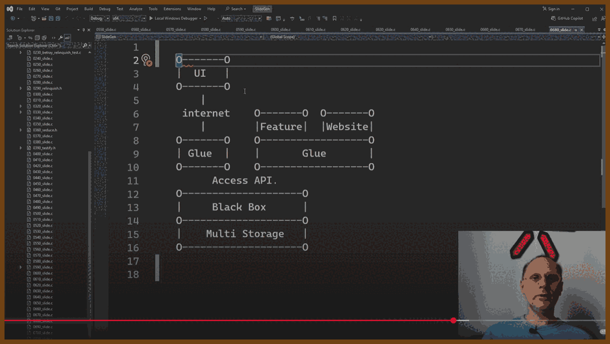
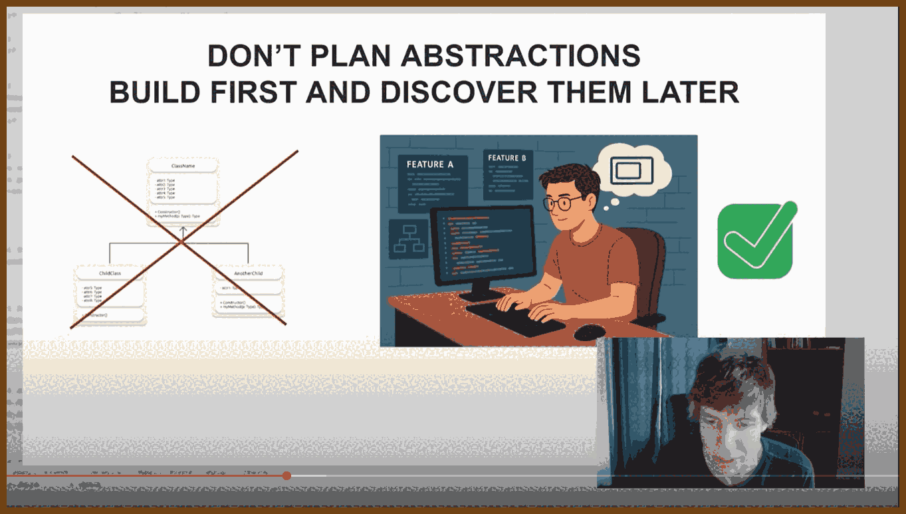
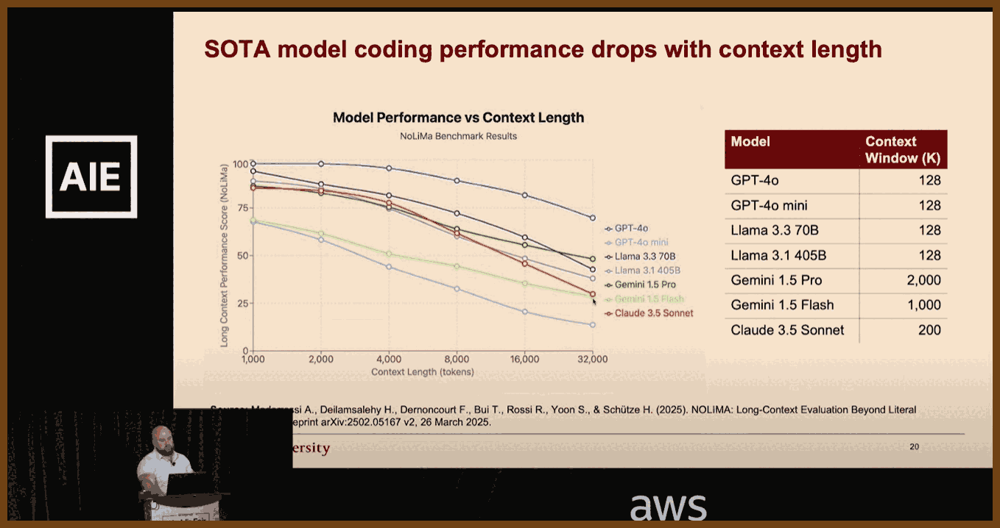
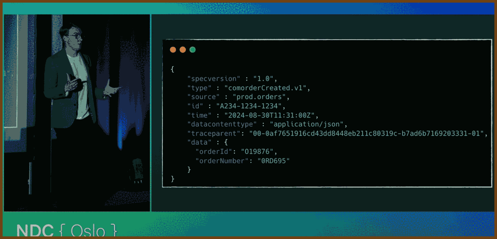
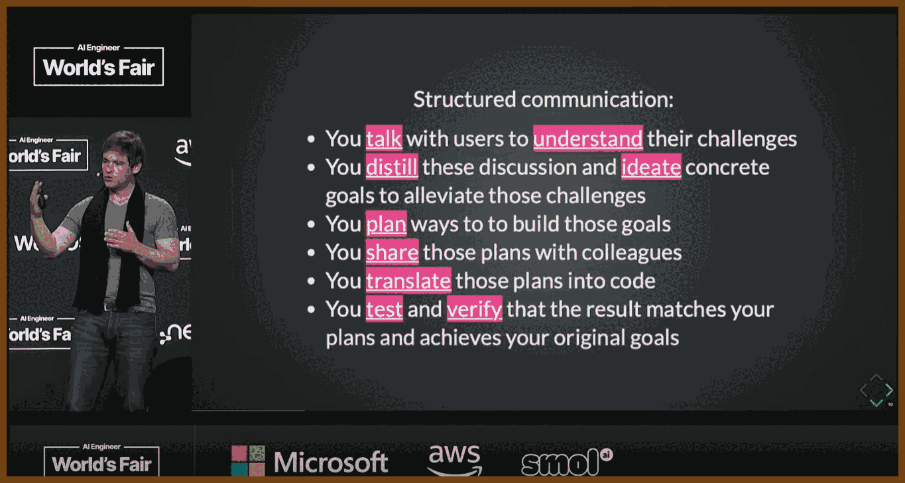
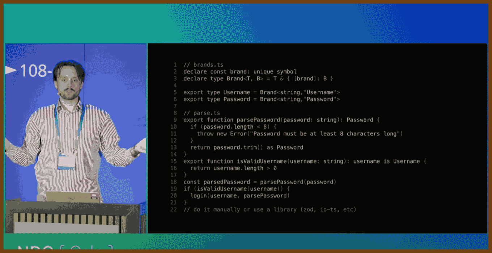

---
layout: post
title:  "Links from my inbox 2025-08-04"
date:   2025-08-04T20:50:00-07:00
categories: links
---

## ⌚ Nice watch!

2025-08-05 [ Architecting LARGE software projects. - YouTube](https://www.youtube.com/watch?v=sSpULGNHyoI) { www.youtube.com }

> 
>
> Define clear, long-term project goals: dependability, extendability, team scalability, and sustained velocity before writing any code, so every subsequent decision aligns with these objectives. Dependability keeps software running for decades; extendability welcomes new features without rewrites; team scalability lets one person own each module instead of forcing many into one file; sustained velocity prevents the slowdown that occurs when fixes trigger more breakage. Listing likely changes such as platform APIs, language toolchains, hardware, shifting priorities, and staff turnover guides risk mitigation and keeps the plan realistic.
>
> Encapsulate change inside small black-box modules that expose only a stable API, allowing one engineer to own, test, and later replace each module without disturbing others. Header-level boundaries cut meeting load, permit isolated rewrites, and match task difficulty to developer experience by giving complex boxes to seniors and simpler ones to juniors.
>
> Write code completely and explicitly the first time, choosing clarity over brevity to prevent costly future rework. Five straightforward lines now are cheaper than one clever shortcut that demands archaeology years later.
>
> Shield software from platform volatility by funnelling all OS and third-party calls through a thin, portable wrapper that you can port once and reuse everywhere. A tiny demo app exercises every call, proving a new backend before millions of downstream lines even compile.
>
> Build reusable helper libraries for common concerns such as rendering, UI, text, and networking, starting with the simplest working implementation but designing APIs for eventual full features so callers never refactor. A bitmap font renderer, for example, already accepts UTF-8, kerning, and color so a future anti-aliased engine drops in invisibly.
>
> Keep domain logic in a UI-agnostic core layer and let GUIs or headless tools interact with that core solely through its published API. A timeline core powers both a desktop video editor and a command-line renderer without duplicating logic.
>
> Use plugin architectures for both user features and platform integrations, loading optional capabilities from separate binaries to keep the main build lean and flexible. In the Stellar lighting tool, every effect and even controller input ships as an external module, so missing a plugin merely disables one function, not the whole app.
>
> Migrate legacy systems by synchronizing them through adapters to a new core store, enabling gradual cut-over while exposing modern bindings such as C, Python, and REST. Healthcare events recorded in the new engine echo to the old database until clinics finish the transition.
>
> Model real-time embedded systems as a shared authoritative world state that edge devices subscribe to, enabling redundancy, simulation, and testing without altering subscriber code. Sensors push contacts, fuel, and confidence scores into the core; wing computers request only the fields they need, redundant cores vote for fault tolerance, and the same channel feeds record-and-replay tools for contractors.
>
> Design every interface, file format, and protocol to be minimal yet expressive, separating structure from semantics so implementations stay simple and evolvable. Choosing one primitive such as polygons, voxels, or text avoids dual support, keeps loaders small, and lets any backend change without touching callers.
>
> Prefer architectures where external components plug into your stable core rather than embedding your code inside their ecosystems, preserving control over versioning and direction. Hosting the plugin point secures compatibility rules and leaves internals free to evolve.

2025-07-26 [Ted Bendixson – Most of your projects are stupid. Please make some actual games. – BSC 2025 - YouTube](https://www.youtube.com/watch?v=Ca53JTohdN4) { www.youtube.com }

> 

> 1. Focus on making actual games and software people use, not tech demos of rotating cubes; he observes most showcases are rendering stress tests instead of finished games.
> 2. Prioritize design because top-selling Steam games succeed on gameplay design, not just graphics; he cites "Balatro" competing with "Civilization 7".
> 3. Always ask "What do we do that they don't?" to define your product’s unique hook; he references the Sega Genesis ad campaign as an example of aspirational marketing.
> 4. Start from a concrete player action or interaction (e.g., connecting planets in "Slipways", rewinding time in "Braid") rather than from story or vibe.
> 5. Use genres as starting templates to get an initial action set, then diverge as you discover your own twist; he compares "Into the Breach" evolving from "Advance Wars".
> 6. Skip paper prototyping for video games; rely on the computer to run simulations and build low-friction playable prototypes instead.
> 7. Prototype with extremely low-fidelity art and UI; examples include his own early "Moose Solutions" and the first "Balatro" mockups.
> 8. Beat blank-page paralysis by immediately putting the first bad version of a feature into the game without overthinking interactions; iterate afterward.
> 9. Let the running game (the simulation) reveal what works; you are not Paul Atreides, you cannot foresee every system interaction.
> 10. Move fast in code: early entities can just be one big struct; do not over-engineer ECS or architecture in prototypes.
> 11. Use simple bit flags (e.g., a u32) for many booleans to get minor performance without heavy systems.
> 12. Combine editor and game into one executable so you can drop entities and test instantly; he shows his Cave Factory editor mode.
> 13. Do not obsess over memory early; statically allocate big arenas, use scratch and lifetime-specific arenas, and worry about optimization later.
> 14. Never design abstractions up front; implement features, notice repetition, and then compress into functions/structs (Casey Muratori’s semantic compression).
> 15. Avoid high-friction languages/processes (Rust borrow checking, strict TDD) during exploration; add safety and tests only after proving people want the product.
> 16. Do not hire expensive artists during prototyping; you will throw work away. Bring art in later, like Jonathan Blow did with "Braid".
> 17. Spend real money on capsule/storefront art when you are shipping because that is your storefront on Steam.
> 18. Keep the team tiny early; people consume time and meetings. If you collaborate, give each person a clear lane.
> 19. Build a custom engine only when the gameplay itself demands engine-level control (examples: "Fez" rotation mechanic, "Noita" per-pixel simulation).
> 20. If you are tinkering with tech (cellular automata, voxel sims), consciously pivot it toward a real game concept as the Noita team did.
> 21. Cut distractions; social media is a time sink. Optimize for the Steam algorithm, not Twitter likes.
> 22. Let streamers and influencers announce and showcase your game instead of doing it yourself to avoid social media toxicity.
> 23. Do not polish and ship if players are not finishing or engaging deeply; scrap or rework instead of spending on shine.
> 24. Tie polish and art budget to gameplay hours and depth; 1,000-hour games like Factorio justify heavy investment.
> 25. Shipping a game hardens your tech; the leftover code base becomes your engine for future projects.
> 26. Low-level programming is power, but it must be aimed at a marketable design, not just technical feats.
> 27. Play many successful indie games as market research; find overlap between what you love and what the market buys.
> 28. When you play for research, identify the hook and why people like it; you do not need to finish every game.
> 29. Treat hardcore design like weight training; alternate intense design days with lighter tasks (art, sound) to recover mentally.
> 30. Prototype while still employed; build skills and a near-complete prototype before quitting.
> 31. Know your annual spending before leaving your job; runway is meaningless without that number.
> 32. Aim for a long runway (around two years or more) to avoid the high cost of reentering the workforce mid-project.
> 33. Do not bounce in and out of jobs; it drains momentum.
> 34. Save and invest to create a financial buffer (FIRE-style) so you can focus on games full time.
> 35. Maintain full control and ownership of your tech to mitigate platform risk (Unity’s policy changes are cited as a cautionary tale).

2025-07-25 [Does AI Actually Boost Developer Productivity? (100k Devs Study) - Yegor Denisov-Blanch, Stanford - YouTube](https://www.youtube.com/watch?v=tbDDYKRFjhk) { www.youtube.com }

> 
>
> Stanford research group has conducted a multi‑year time‑series and cross‑sectional study on software‑engineering productivity involving more than 600 companies
>
> Current dataset: over 100,000 software engineers, dozens of millions of commits, billions of lines of code, predominantly from private repositories
>
> Late last year analysis of about 50,000 engineers identified roughly 10 percent as ghost engineers who collect paychecks but contribute almost no work
>
> Study team members include Simon (former CTO of a 700‑developer unicorn), a Stanford researcher active since 2022 on data‑driven decision‑making, and Professor Kasinski (Cambridge Analytica whistleblower)
>
> A 43‑developer experiment showed self‑assessment of productivity was off by about 30 percentile points on average; only one in three developers ranked themselves within their correct quartile
>
> The research built a model that evaluates every commit’s functional change via git metadata, correlates with expert judgments, and scales faster and cheaper than manual panels
>
> At one enterprise with 120 developers, introducing AI in September produced an overall productivity boost of about 15–20 percent and a marked rise in rework
>
> Across industries gross AI coding output rises roughly 30–40 percent, but net average productivity gain after rework is about 15–20 percent
>
> Median productivity gains by task and project type: low‑complexity greenfield 30–40 percent; high‑complexity greenfield 10–15 percent; low‑complexity brownfield 15–20 percent; high‑complexity brownfield 0–10 percent (sample 136 teams across 27 companies)
>
> AI benefits low‑complexity tasks more than high‑complexity tasks and can lower productivity on some high‑complexity work
>
> For high‑popularity languages (Python, Java, JavaScript, TypeScript) gains average about 20 percent on low‑complexity tasks and 10–15 percent on high‑complexity tasks; for low‑popularity languages (Cobol, Haskell, Elixir) assistance is marginal and can be negative on complex tasks
>
> Productivity gains decline sharply as codebase size grows from tens of thousands to millions of lines
>
> LLM coding accuracy drops as context length rises: performance falls from about 90 percent at 1 k tokens to roughly 50 percent at 32 k tokens (NoLIMA paper)
>
> Key factors affecting AI effectiveness: task complexity, project maturity, language popularity, codebase size, and context window length

2025-07-23 [So You Want to Maintain a Reliable Event Driven System - James Eastham - NDC Oslo 2025 - YouTube](https://www.youtube.com/watch?v=45s_vybVr8k) { www.youtube.com }

> 
>
> James Eastham shares hard‑won lessons on maintaining and evolving event‑driven systems after the initial excitement fades. Using a plant‑based pizza app as a running example (order → kitchen → delivery), he covers how to version events, test asynchronous flows, ensure idempotency, apply the outbox pattern, build a generic test harness, and instrument rich observability (traces, logs, metrics). The core message: your events are your API, change is inevitable, and reliability comes from deliberate versioning, requirements‑driven testing, and context‑rich telemetry.
>
> **Key Takeaways (9 items)**
>
> - Treat events as first‑class APIs; version them explicitly (e.g. `type: order.confirmed.v1`) and publish deprecation dates so you never juggle endless parallel versions.
> - Adopt a standard event schema (e.g. CloudEvents) with fields for `id`, `time`, `type`, `source`, `data`, and `data_content_type`; this enables compatibility checks, idempotency, and richer telemetry. https://cloudevents.io
> - Use the outbox pattern to atomically persist state changes and events, then have a worker publish from the outbox; test that both the state row and the outbox row exist, not just your business logic.
> - Build a reusable test harness subscriber: spin up infra locally (Docker, Aspire, etc.), inject commands/events, and assert that expected events actually appear on the bus; poll with SLO‑aligned timeouts to avoid flaky tests.
> - Validate event structure at publish time with schema checks (JSON Schema, System.Text.Json contract validation) to catch breaking changes before they hit the wire.
> - Test unhappy paths: duplicate deliveries (at‑least‑once semantics), malformed payloads, upstream schema shifts, and downstream outages; verify DLQs and idempotent handlers behave correctly.
> - Instrument distributed tracing plus rich context: technical (operation=send/receive/process, system=kafka/sqs, destination name, event version) and business (order_id, customer_id) so you can answer unknown questions later. See OpenTelemetry messaging semantic conventions: https://opentelemetry.io/docs/specs/semconv/messaging
> - Decide when to propagate trace context vs use span links: propagate within a domain boundary, link across domains to avoid 15‑hour monster traces from batch jobs.
> - Monitor the macro picture too: queue depth, message age, in‑flight latency, payload size shifts, error counts, and success rates; alert on absence of success as well as presence of failure.

2025-07-13 [The New Code — Sean Grove, OpenAI - YouTube](https://www.youtube.com/watch?v=8rABwKRsec4) { www.youtube.com }

> This talk by Sean from OpenAI explores the paradigm shift from code-centric software development to intent-driven specification writing. He argues that as AI models become more capable, the bottleneck in software creation will no longer be code implementation but the clarity and precision with which humans communicate their intentions. Sean advocates for a future where structured, executable specifications—not code—serve as the core professional artifact. Drawing on OpenAI’s model specification (Model Spec), he illustrates how specifications can guide both human alignment and model behavior, serving as trust anchors, training data, and test suites. The talk concludes by equating specification writing with modern programming and calls for new tooling—like thought-clarifying IDEs—to support this transition.
>
> **Code is Secondary; Communication is Primary**
>
> - Only 10–20% of a developer's value lies in the code they write; the remaining 80–90% comes from structured communication—understanding requirements, planning, testing, and translating intentions.
> - Effective communication will define the most valuable programmers of the future.
>
> **Vibe Coding Highlights a Shift in Workflow**
>
> - “Vibe coding” with AI models focuses on expressing intent and outcomes first, letting the model generate code.
> - Yet, developers discard the prompt (intent) and keep only the generated code—akin to version-controlling a binary but shredding the source.
>
> **Specifications Align Humans and Models**
>
> - Written specs clarify, codify, and align intentions across teams—engineering, product, legal, and policy.
> - OpenAI’s Model Spec (available on GitHub) exemplifies this, using human-readable Markdown that is versioned, testable, and extensible.
>
> **Specifications Outperform Code in Expressing Intent**
>
> - Code is a lossy projection of intention; reverse engineering code does not reliably recover the original goals or values.
> - A robust specification can generate many artifacts: TypeScript, Rust, clients, servers, docs, even podcasts—whereas code alone cannot.
>
> **Specs Enable Deliberative Alignment**
>
> - Using techniques like deliberative alignment, models are evaluated and trained using challenging prompts linked to spec clauses.
> - This transforms specs into both training and evaluation material, reinforcing model alignment with intended values.
>
> 
>
> 💡 **Integrated Thought Clarifier!** 💡
> *(I need one!)*
>
> 

2025-07-17 [Brand your types - Join me in the fight against weakly typed codebases! - Theodor René Carlsen - YouTube](https://www.youtube.com/watch?v=yahbJV16GmE) { www.youtube.com }

> 
>
> This talk, titled *"Branding Your Types"*, is delivered by Theo from the Danish Broadcasting Corporation. It explores the concept of **branded types** in TypeScript—a compile-time technique to semantically differentiate values of the same base type (e.g., different kinds of `string` or `number`) without runtime overhead.
>
> Theo illustrates how weak typing with generic primitives like `string` can introduce subtle and costly bugs, especially in complex codebases where similar-looking data (e.g., URLs, usernames, passwords) are handled inconsistently.
>
> The talk promotes a mindset of *parsing, not validating*—emphasizing data cleaning and refinement at the edges of systems, ensuring internal business logic can remain clean, type-safe, and predictable.
>
> **Generic Primitives Are Dangerous**
>
> - Treating all strings or numbers the same can lead to bugs (e.g., swapped username and password). Using `string` to represent IDs, dates, booleans, or URLs adds ambiguity and increases cognitive load.
>
> **Use Branded Types for Clarity and Safety**
>
> - TypeScript allows developers to brand primitive types with compile-time tags (e.g., `Username`, `Password`, `RelativeURL`) to distinguish otherwise identical types. This prevents bugs by catching misused values during compilation.
>
> **No Runtime Cost, Full Type Safety**
>
> - Branded types are purely a TypeScript feature; they vanish during transpilation. You get stronger type guarantees without impacting performance or runtime behavior.
>
> **Protect Your Business Logic with Early Parsing**
>
> - Don’t validate deep within your core logic. Instead, parse data from APIs or forms as early as possible. Converting "dirty" input into refined types early allows the rest of the code to assume correctness.
>
> **Parsing vs. Validation**
>
> - Inspired by Alexis King’s blog post *“Parse, Don’t Validate”*, Theo stresses that parsing should transform unstructured input into structured, meaningful types. Validations check, but parsing commits and transforms.
>
> 📝 Original article: *Parse, Don’t Validate* by Alexis King — https://lexi-lambda.github.io/blog/2019/11/05/parse-don-t-validate/
>
> **Use types to encode guarantees**
>  Replace `validate(x): boolean` with `parse(x): Result<T, Error>`. This enforces correctness via types, ensuring only valid data proceeds through the system.
>
> **Parse at the boundaries**
>  Parse incoming data at the system’s edges (e.g. API handlers), and keep the rest of the application logic free from unverified values.
>
> **Avoid repeated validation logic**
>  Parsing once eliminates the need for multiple validations in different places, reducing complexity and inconsistency.
>
> **Preserve knowledge through types**
>  Using types like `Maybe` or `Result` lets you carry the status of values through your code rather than flattening them prematurely.
>
> **Demand strong input, return flexible output**
>  Functions should accept well-formed types (e.g. `NonEmptyList<T>`) and return optional or error-aware outputs.
>
> **Capitalize on language features**
>  Statically typed languages (e.g. Haskell, Elm, TypeScript) support defining precise types that embed business rules—use them.
>
> **Structured data beats flags**
>  Avoid returning booleans to indicate validity. Instead, return parsed data or detailed errors to make failures explicit.
>
> **Better testing and fewer bugs**
>  Strong input types reduce the number of test cases needed and prevent entire categories of bugs from entering the system.
>
> **Design toward domain modeling**
>  Prefer domain-specific types like `Email`, `UUID`, or `URL` rather than generic strings—improves readability and safety.
>
> **Applicable across many languages**
>  Though examples come from functional programming, the strategy works in many ecosystems—Elm, Haskell, Kotlin, TypeScript, etc.
>
> ---
>
> **Parse, Don’t Validate**
>
> The *Parse, Don’t Validate* approach emphasizes transforming potentially untrusted or loosely-structured data into domain-safe types as early as possible in a system. This typically happens at the "edges"—where raw input enters from the outside world (e.g. HTTP requests, environment variables, or file I/O). Instead of validating that the data meets certain criteria and continuing to use it in its original form (e.g. raw `string` or `any`), this pattern calls for parsing: producing a new, enriched type that encodes the constraints and guarantees. For example, given a JSON payload containing an email field, you wouldn’t just check whether the email is non-empty or contains “@”; you'd *parse* it into a specific `Email` type that can only be constructed from valid input. This guarantees that any part of the system which receives an `Email` value doesn’t need to perform checks—it can assume the input is safe by construction.
>
> The goal of parsing is to front-load correctness and allow business logic to operate under safe assumptions. This leads to simpler, more expressive, and bug-resistant code, especially in strongly-typed languages. Parsing typically returns a result type (like `Result<T, Error>` or `Option<T>`) to indicate success or failure. If parsing fails, the error is handled at the boundary. Internally, the program deals only with parsed, safe values. This eliminates duplication of validation logic and prevents errors caused by invalid data slipping past checks. It also improves the readability and maintainability of code, as type declarations themselves serve as documentation for business rules. This approach does not inherently enforce encapsulation or behavior within types—it’s more about asserting the *shape and constraints* of data as early and clearly as possible. Parsing can be implemented manually (e.g. via custom functions and type guards) or with libraries (like `zod`, `io-ts`, or Elm’s JSON decoders).
>
> **Value Objects**
>
> The *Value Object* pattern, originating from Domain-Driven Design (DDD), is focused on modeling business concepts explicitly in the domain layer. A value object is an immutable, self-contained type that represents a concept such as `Money`, `Email`, `PhoneNumber`, or `Temperature`. Unlike simple primitives (`string`, `number`), value objects embed both *data and behavior*, enforcing invariants at construction and encapsulating domain logic relevant to the value. For instance, a `Money` value object might validate that the currency code is valid, store amount and currency together, and expose operations like `add` or `convert`. Value objects are compared by value (not identity), and immutability ensures they are predictable and side-effect free.
>
> The key distinction in value objects is that *correctness is enforced through encapsulation*. You can't create an invalid `Email` object unless you bypass the constructor or factory method (which should be avoided by design). This encapsulated validation is often combined with private constructors and public factory methods (`tryCreate`, `from`, etc.) to ensure that the only way to instantiate a value object is through validated input. This centralizes responsibility for maintaining business rules. Compared to *Parse, Don’t Validate*, value objects focus more on *modeling* than on data conversion. While parsing is concerned with creating safe types from raw data, value objects are concerned with expressing the domain in a way that’s aligned with business intent and constraints.
>
> In practice, value objects may internally use a parsing step during construction, but they emphasize type richness and encapsulated logic. Where *Parse, Don’t Validate* advocates that you return structured types early for safety, *Value Objects* argue that you return behavior-rich types for expressiveness and robustness. The two can—and often should—be used together: parse incoming data into value objects, and rely on their methods and invariants throughout your core domain logic. Parsing is about moving from unsafe to safe. Value objects are about enriching the safe values with meaning, rules, and operations.
