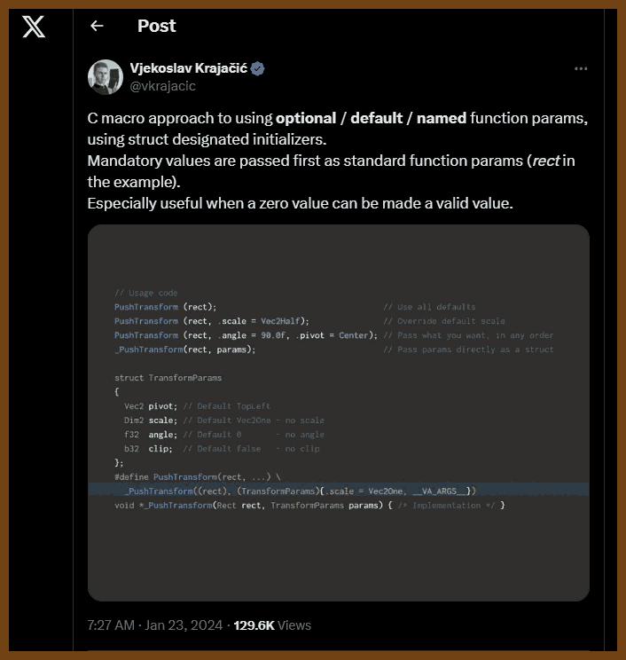
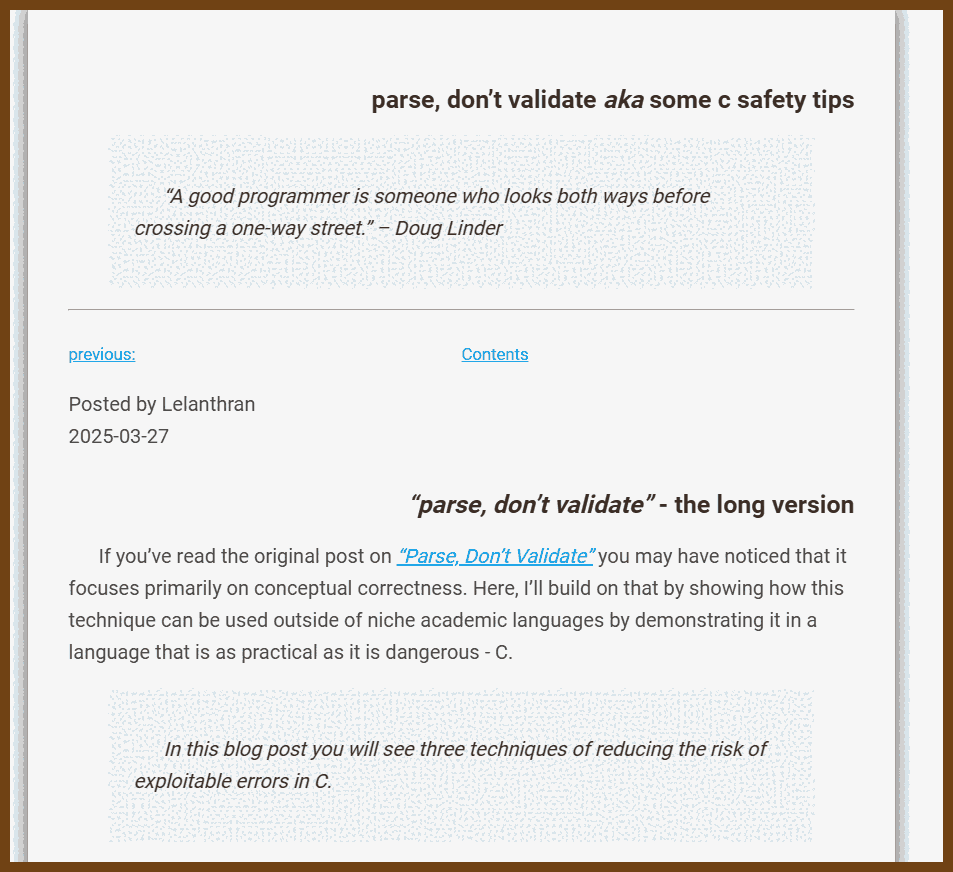

## Good Reads

2025-08-24 [The Management Skill Nobody Talks About – Terrible Software](https://terriblesoftware.org/2025/08/22/the-management-skill-nobody-talks-about/) { terriblesoftware.org }

> 
>
> The real question isn’t whether you’ll make mistakes; it’s what you do *after*.
>
> I recently read *[“Good Inside”](https://www.amazon.com/Good-Inside-Guide-Becoming-Parent/dp/B09PGMSBBN)* by Dr. Becky Kennedy, a parenting book that completely changed how I think about this. She talks about how the most important parenting skill isn’t being perfect — it’s **repair**. When you inevitably lose your patience with your kid or handle something poorly, what matters most is going back and fixing it. **Acknowledging what happened, taking responsibility, and reconnecting.**
>
> Sound familiar? Because that’s what good management is about too.
>
> Think about the worst manager you ever had. I bet they weren’t necessarily the ones who made the most mistakes. But they were probably the ones who never acknowledged them. Who doubled down when they were wrong. Who let their ego prevent them from admitting they didn’t have all the answers.

2025-07-30 [How to increase your surface area for luck - by Cate Hall](https://usefulfictions.substack.com/p/how-to-increase-your-surface-area) { usefulfictions.substack.com }

> 
>
> Cate Hall explains how increasing your “surface area”―the combination of doing meaningful work and making it visible―invites more serendipity. By writing, attending events, joining curated communities, and reaching out directly, you raise the probability that unexpected opportunities will find you.
>
> **Key Takeaways**
>
> - Luck is not random; it grows when valuable work is paired with consistent public sharing.
> - Publishing ideas extends your reach indefinitely; a single post can keep generating inquiries for years.
> - Showing up at meetups, conferences, or gatherings multiplies chance encounters that can turn into collaborations.
> - Curated communities act as quality filters, putting you in front of people who already share your interests and standards.
> - Thoughtful, high‑volume cold outreach broadens your network and seeds future partnerships.
> - Deep expertise built on genuine passion attracts attention and referrals more naturally than broad generalism.
> - Balance is critical: “doing” without “telling” hides impact, while “telling” without substance destroys credibility.
> - Serendipity compounds over time; treat visibility efforts as long‑term investments, not quick wins.
> - Track views, replies, and introductions to identify which activities generate the most valuable contacts.
>
> 
>
> 2025-07-30 [The actual reason you can't get a job - YouTube](https://www.youtube.com/watch?v=SPwPpsXpZfg) { www.youtube.com }
> 

2025-07-19 [Why Most Feedback Shouldn’t Exist – Terrible Software](https://terriblesoftware.org/2025/07/18/why-most-feedback-shouldnt-exist/) { terriblesoftware.org }

> 
> **when everything is “an opportunity for growth,” nothing is.**

2025-06-25 [Why Engineers Hate Their Managers (And What to Do About It) – Terrible Software](https://terriblesoftware.org/2025/06/24/why-engineers-hate-their-managers-and-what-to-do-about-it/) { terriblesoftware.org }

> 
>
> Most engineers have a complicated relationship with their managers. And by “complicated,” I mean somewhere between mild annoyance and seething resentment. Having been on both sides of this — more than a decade as an engineer before [switching to management](https://terriblesoftware.org/the-one-good-reason-to-become-a-manager-and-all-the-bad-ones) — I’ve experienced this tension from every angle.
>
> Here’s the uncomfortable truth: **engineers often have good reasons to be frustrated with their managers**. But understanding why this happens is the first step toward fixing (*or just coping with?*) it.
>
> ------
>
> Let me walk you through the most common management anti-patterns that make engineers want to flip tables — and stick around, because I’ll also share what the best managers do differently to actually earn their engineers’ respect.
>
> If you’re an engineer, you’ll probably nod along thinking *“finally, someone gets it.”* If you’re a manager, well… you might recognize yourself in here. And that’s okay — awareness is the first step.

2025-06-15 [Good Engineer/Bad Engineer – Terrible Software](https://terriblesoftware.org/2025/06/13/good-engineer-bad-engineer/) { terriblesoftware.org }

> *(I've tried to summarize, but it is too good for summarizing, I can't! )*

> By **Matheus Lima** on June 13, 2025
>
> *This is inspired by Ben Horowitz’s [“Good Product Manager/Bad Product Manager.”](https://a16z.com/good-product-manager-bad-product-manager/) We all exhibit both behaviors — what matters is which ones we choose to reinforce.*
>
> ------
>
> Bad engineers think their job is to write code. Good engineers know their job is to **ship working software that adds real value to users**.
>
> Bad engineers dive straight into implementation. Good engineers first ask *“why?”*. They know that perfectly executed solutions to the wrong problems are worthless. They’ll push back — not to be difficult, but to find the simplest path to real value. *“Can we ship this in three parts instead of one big release?” “What if we tested the riskiest assumption first?”*
>
> Bad engineers work in isolation, perfecting their code in darkness. Good engineers share early and often. They’ll throw up a draft PR after a few hours with *“WIP – thoughts on this approach?”* They understand that course corrections at 20% are cheap; but at 80% are expensive.
>
> Bad engineers measure their worth by the complexity of their solutions. They build elaborate architectures for simple problems, write clever code that requires a PhD to understand, and mistake motion for progress. Good engineers reach for simple solutions first, write code their junior colleagues can maintain, and have the confidence to choose “boring” technology that just works.
>
> Bad engineers treat code reviews as battles to be won. They defend every line like it’s their firstborn child, taking feedback as personal attacks. Good engineers see code reviews differently — they’re **opportunities to teach and learn**, not contests. They’ll often review their own PR first, leaving comments like *“This feels hacky, any better ideas?”* They know that [your strengths are your weaknesses](https://terriblesoftware.org/2025/03/31/your-strengths-are-your-weaknesses/), and they want their teammates to catch their blind spots.
>
> Bad engineers say yes to everything, drowning in a sea of commitments they can’t keep. Good engineers have learned the art of the strategic no. *“I could do that, but it means X won’t ship this sprint. Which is more important?”*.
>
> Bad engineers guard knowledge like treasure, making themselves indispensable through obscurity. Good engineers document as they go, pair with juniors, and celebrate when someone else can maintain their code. They know job security comes from impact, not from being a single point of failure.
>
> Bad engineers chase the newest framework, the hottest language, the latest trend. They’ve rewritten the same app four times in four different frameworks. Good engineers are pragmatists. They’ll choose the tech that the team knows, the solution that can be hired for, the approach that lets them focus on the actual problem.
>
> Bad engineers think in absolutes — [always DRY](https://terriblesoftware.org/2025/05/28/duplication-is-not-the-enemy/), never compromise, perfect or nothing. Good engineers know when to break their own rules, when good enough truly is good enough, and when to ship the 80% solution today rather than the 100% solution never.
>
> Bad engineers write code. Good engineers solve problems. Bad engineers focus on themselves. Good engineers focus on their team. Bad engineers optimize for looking smart. Good engineers optimize for being useful.
>
> The best engineers I’ve worked with weren’t necessarily the smartest — they were simply the most effective. And effectiveness isn’t about perfection. It’s about progress.

2025-07-10 [Mellow Drama: Turning Browsers Into Request Brokers | Secure Annex](https://secureannex.com/blog/mellow-drama/) { secureannex.com }

> 
>
> The SecureAnnex blog post “Mellow Drama: Turning Browsers Into Request Brokers” investigates a JavaScript library called **Mellowtel**, which is embedded in hundreds of browser extensions. This library covertly leverages user browsers to load hidden iframes for web scraping, effectively creating a distributed scraping network. The behavior weakens security protections like `Content-Security-Policy`, and participants include Chrome, Edge, and Firefox users—nearly one million installations in total. SecureAnnex traces this operation to Olostep, a web scraping API provider.
>
> Takeaways:
>
> **Widespread involuntary participation**
> Mellowtel is embedded in 245 browser extensions across Chrome, Edge, and Firefox, with around 1 million active installations as of July 2025.
>
> **Library functionality explained**
> The script activates during user inactivity, strips critical security headers, injects hidden iframes, parses content via service workers, and exfiltrates data to AWS Lambda endpoints.
>
> **Monetization-driven inclusion**
> Developers integrated Mellowtel to monetize unused bandwidth. The library operates silently using existing web access permissions.
>
> **Olostep’s connection**
> Olostep, run by Arslan Ali and Hamza Ali, appears to be behind Mellowtel and uses it to power their scraping API for bypassing anti-bot defenses.
>
> **Security implications**
> Removing headers like `Content-Security-Policy` and `X-Frame-Options` increases risk of XSS, phishing, and internal data leaks, especially in corporate settings.
>
> **Partial takedown by browser vendors**
> Chrome, Edge, and Firefox have begun removing some affected extensions, but most remain available and active.
>
> **Shady transparency practices**
> Some extensions vaguely mention monetization or offer small payments, but disclosures are often misleading or obscured.
>
> **Mitigation and detection guidance**
> Users should audit installed extensions, block traffic to `request.mellow.tel`, and restrict iframe injection and webRequest permissions.
>
> **Community-driven defense**
> Researchers like John Tuckner are sharing IOCs and YARA rules to detect compromised extensions and raise awareness.
>
> **Broader security trend**
> This incident exemplifies a growing class of browser-based supply chain attacks using benign-looking extensions as distributed scraping nodes.

2025-07-27 [Reading QR codes without a computer!](https://qr.blinry.org/) {qr.blinry.org}

> Did you ever wonder how QR codes work? You've come to the right place! This is an interactive explanation that we've written for a workshop at [37C3](https://events.ccc.de/congress/2023/), but you can also use it on your own. You will learn:
>
> - The anatomy of QR codes
> - How to decode QR codes by hand (using our [cheat sheet](https://qr.blinry.org/qr-cheat-sheet.pdf))
>
> 

2025-08-31 [Notes on Managing ADHD](https://borretti.me/article/notes-on-managing-adhd) { borretti.me }


> I build external scaffolding so my brain has fewer places to drop things: **memory** lives in a single todo list, and the one meta habit is to open it every morning; projects get their own entries so half-read books and half-built ideas do not evaporate; I keep the list pinned on the left third of the screen so it is always in my **visual field**. I manage **energy** like voltage: early morning is for the thing I dread, mid-day is for creative work, later is for chores; when I feel avoidance, I treat **procrastination** by type—do it scared for anxiety, ask a human to sit with me for accountability, and write to think when choice paralysis hits; **timers** manufacture urgency to start and, importantly, to stop so one project does not eat the day. I practice **journaling** across daily, weekly, monthly, yearly reviews to surface patterns and measure progress; for **time**, I keep a light calendar for social and gym blocks and add explicit **travel time** so I actually leave; the todo list holds the fine-grained work, the calendar holds the big rocks.
>
> On the ground I favor **task selection** by shortest-first, with exceptions for anything old and for staying within the active project; I do **project check-ins**—even 15 minutes of reading the code or draft—to refresh caches so momentum is cheap; I **centralize inboxes** by sweeping mail, chats, downloads, and bookmarks into the list, run **Inbox Zero** so nothing camouflages, and declare **bankruptcy** once to reset a swampy backlog. I **plan first, do later** so mid-task derailments do not erase intent—walk the apartment, list every fix, then execute; I **replace interrupts with polling** by turning on DND and scheduling comms passes; I **do it on my own terms** by drafting scary emails in a text editor or mocking forms in a spreadsheet before pasting; I watch **derailers** like morning lifting, pacing, or music and design around them; I avoid becoming the **master of drudgery** who optimizes the system but ships nothing; when one task blocks everything, I curb **thrashing** by timeboxing it daily and moving other pieces forward; and I pick **tools** I like and stick to one, because one app is better than two and building my own is just artisan procrastination.
>
> *ADHD, productivity, todo list, journaling, energy management, procrastination, timers, inbox zero, task selection, planning, timeboxing, focus, tools*

## Inspiration!

2025-08-01 [Cry Once a Week](https://www.cryonceaweek.com/) { www.cryonceaweek.com }

> 
>
> 

2025-09-01 [Eternal Struggle](https://yoavg.github.io/eternal/) { yoavg.github.io }

> 


## 👂 The Ear of AI (LLMs)

2025-08-18 [tokens are getting more expensive - by Ethan Ding](https://ethanding.substack.com/p/ai-subscriptions-get-short-squeezed) { ethanding.substack.com }

> 
>
> **Flat subscriptions cannot scale**
> The assumption that margins would expand as LLMs became cheaper is flawed. Users always want the best model, which keeps a constant price floor.
> [AI Subscriptions Get Short Squeezed](https://ethanding.substack.com/p/ai-subscriptions-get-short-squeezed)
>
> **Token usage per task is exploding**
> Tasks that used ~1k tokens now often consume 100k or more due to long reasoning chains, browsing, and planning.
>
> **Unlimited plans are collapsing**
> Anthropic announced **weekly rate limits** for Claude subscribers starting August 28, 2025.
> Anthropic news update
>
> **Heavy users (“inference whales”) break economics**
> Some Claude Code customers consumed tens of thousands of dollars in compute while only paying $200/month.
> The Register reporting
>
> **Shift toward usage credits**
> Cursor restructured pricing: Pro plans now include credits with at-cost overages, plus a new $200 Ultra tier.
> Cursor pricing page

2025-06-15 [Field Notes From Shipping Real Code With Claude - diwank's space](https://diwank.space/field-notes-from-shipping-real-code-with-claude/) { diwank.space }

> Tags: AI‑assisted coding, vibe coding, CLAUDE.md, anchor comments, testing discipline, token management, git workflows, session isolation, developer efficiency
>
> 
>
> Here’s What You’re Going to Learn
> First, we’ll explore how to genuinely achieve a 10x productivity boost—not through magic, but through deliberate practices that amplify AI’s strengths while compensating for its weaknesses.
>
> Next, I’ll walk you through the infrastructure we use at Julep to ship production code daily with Claude’s help. You’ll see our CLAUDE.md templates, our commit strategies, and guardrails.
>
> Most importantly, you’ll understand why writing your own tests remains absolutely sacred, even (especially) in the age of AI. This single principle will save you from many a midnight debugging sessions.
>
> *Steve Yegge* brilliantly coined the term *CHOP*—Chat-Oriented Programming in a slightly-dramatic-titled post [“The death of the junior developer”](https://sourcegraph.com/blog/the-death-of-the-junior-developer). It’s a perfect, and no-bs description of what it’s like to code with Claude.
>
> There are three distinct postures you can take when vibe-coding, each suited to different phases in the development cycle:
>
> 1. **AI as First-Drafter**: Here, AI generates initial implementations while you focus on architecture and design. It’s like having a junior developer who can type at the speed of thought but needs constant guidance. Perfect for boilerplate, CRUD operations, and standard patterns.
> 2. **AI as Pair-Programmer**: This is the sweet spot for most development. You’re actively collaborating, bouncing ideas back and forth. The AI suggests approaches, you refine them. You sketch the outline, AI fills in details. It’s like pair programming with someone who has read every programming book ever written but has never actually shipped code.
> 3. **AI as Validator**: Sometimes you write code and want a sanity check. AI reviews for bugs, suggests improvements, spots patterns you might have missed. Think of it as an incredibly well-read code reviewer who never gets tired or cranky.
>
> > Instead of crafting every line, you’re reviewing, refining, directing. But—and this cannot be overstated—you remain the architect. Claude is your intern with encyclopedic knowledge but zero context about your specific system, your users, your business logic.

2025-06-02 [MCP explained without hype or fluff - nilenso blog](https://blog.nilenso.com/blog/2025/05/12/mcp-explained-without-hype-or-fluff/) { blog.nilenso.com }

> 
>
> Model Context Protocol (MCP) helps AI apps connect with different tools and data sources more easily. Usually, if many apps need to work with many tools, each app would have to build a custom connection for every tool, which becomes complicated very quickly. MCP fixes this by creating one common way for apps and tools to talk. Now, each app only needs to understand MCP, and each tool only needs to support MCP.
>
> An AI app that uses MCP doesn't need to know how each platform works. Instead, MCP servers handle the details. They offer tools the AI can use, like searching for files or sending emails, as well as prompts, data resources, and ways to request help from the AI model itself. In most cases, it's easier to build servers than clients.
>
> The author shares a simple example: building an MCP server for CKAN, a platform that hosts public datasets. This server allows AI models like Claude to search and analyze data on CKAN without any special code for CKAN itself. The AI can then show summaries, lists of datasets, and even create dashboards based on the data.
>
> MCP has become popular because it gives a clear and stable way for AI apps to work with many different systems. But it also adds some extra work. Setting up MCP takes time, and using too many tools can slow down AI responses or lower quality. MCP works best when you need to integrate many systems, but may not be necessary for smaller, controlled projects where fine-tuned AI models already perform well.
>
> *ai integration, model context protocol, simple architecture, ckan, open data, ai tools, tradeoffs, protocol design*

2025-07-19 [Nobody Knows How To Build With AI Yet - by Scott Werner](https://worksonmymachine.substack.com/p/nobody-knows-how-to-build-with-ai) { worksonmymachine.substack.com }

> 
>
> **The Architecture Overview** - Started as a README. "Here's what this thing probably does, I think."
>
> **The Technical Considerations** - My accumulated frustrations turned into documentation. Every time Claude had trouble, we added more details.
>
> **The Workflow Process** - I noticed I kept doing the same dance. So I had Claude write down the steps. Now I follow my own instructions like they're sacred text. They're not. They're just what happened to work this time.
>
> **The Story Breakdown** - Everything in 15-30 minute chunks. Why? Because that's roughly how long before Claude starts forgetting what we discussed ten minutes ago. Like a goldfish with a PhD.
>
> ---
>
> It's like being a professional surfer on an ocean that keeps changing its physics. Just when you think you understand waves, they start moving sideways. Or backwards. Or turning into birds.
>
> This is either terrifying or liberating, depending on your relationship with control.


## C || C++

2025-08-16 [Vjekoslav Krajačić on X: "C macro approach to using optional / default / named function params, using struct designated initializers. ](https://x.com/vkrajacic/status/1749816169736073295/) {x.com}

> 
>
> 
>
> This approach uses **C macros** combined with **struct designated initializers** to mimic *optional*, *default*, and *named* parameters in C, something the language does not natively support.
>
> **Core Idea**
>
> 1. **Separate mandatory and optional parameters**
>    - Mandatory arguments are given as normal function parameters.
>    - Optional parameters are bundled into a `struct` with sensible defaults.
> 2. **Designated initializers** for named parameter-like syntax
>    - You can specify only the fields you want to override, in any order.
>    - Unspecified fields automatically keep the default values.
> 3. **Macro wrapper** to simplify usage
>    - The macro accepts the mandatory arguments and any number of struct field assignments for optional parameters.
>    - Inside the macro, a default `struct` is created and then overridden with user-provided values.
>
> From the screenshot:
>
> ```c
> struct TransformParams {
>     Vec2 pivot;  // Default TopLeft
>     Dim2 scale;  // Default One (1,1)
>     f32  angle;  // Default 0
>     b32  clip;   // Default false
> };
> 
> #define PushTransform(rect, ...) \
>     _PushTransform((rect), (TransformParams){ .scale = Vec2One, __VA_ARGS__ })
> 
> void _PushTransform(Rect rect, TransformParams params) {
>     // Implementation here
> }
> ```
>
> **How it works**
>
> - **Default values**: `.scale = Vec2One` is set in the macro. Other defaults could be set directly in the struct or in `_PushTransform`.
> - **Optional override**: When calling `PushTransform`, you can pass only the fields you care about:
>
> ```c
> PushTransform(rect);                               // all defaults
> PushTransform(rect, .scale = Vec2Half);            // override scale
> PushTransform(rect, .angle = 90.0f, .pivot = Center); // override multiple
> ```
>
> ------
>
> **Advantages**
>
> - **Named parameter feel** in plain C.
> - **Optional arguments** without multiple overloaded functions.
> - **Defaults** are enforced at the call site or macro expansion.
> - **Zero-cost at runtime** since it’s all resolved at compile time.
>
> ------
>
> **Limitations**
>
> - Only works cleanly if the optional parameters are grouped in a single struct.
> - Macro syntax can be tricky if parameters require expressions with commas (needs parentheses or extra care).
> - Debugging through macro expansions is sometimes less clear.
>
> Watch it also here: **https://www.youtube.com/watch?v=VdmeoMZjIgs**

2025-08-01 [How I program C - YouTube](https://www.youtube.com/watch?v=443UNeGrFoM) { www.youtube.com }

> 
> **Speaker** Eskil Steenberg – game-engine and tools developer (Quel Solaar)
> **Recording** Seattle, Oct 2016 (2 h 11 m)
>
> Key themes
>
> - Results first, control later – why explicit memory management, crashes, and compiler errors are desirable.
> - Minimise technology footprint – target C89/C90, wrap every dependency, zero un-wrapped libraries.
> - Code is for humans – long descriptive names, uniform naming schemes, wide functions, avoid cleverness (e.g. operator overloading).
> - Favour simple languages plus strong tooling – write parsers, debuggers, doc generators yourself.
> - Memory mastery – pointers as arrays, alignment and padding, struct packing, cache-friendly dynamic arrays + `realloc`, dangers of linked lists.
> - API design – opaque handles (void *), start with public interface, isolate implementation, macro-assisted debug wrappers (`__FILE__`, `__LINE__`).
> - Build a mountain – own your stack, keep technical debt near zero, rewrite early.
> - UI toolkit pattern – single pass, stateless widgets keyed by pointer IDs; layout and hit-testing resolved internally.
> - Tools and snippets – Carmack inverse-sqrt; xorshift32 PRNG; GFlags page-guarding for memory bugs; Seduce UI; Testify binary packer; Ministry of Flat un-wrapper.
>
> **Talk structure in order of appearance**
>
> - Motivation and philosophy
> - Results vs control; garbage collection vs manual `free`
> - Small footprint and dependency wrapping
> - Naming conventions and formatting policies
> - Crashes and compiler errors as friends
> - Macros: when to use, when to avoid
> - Deep dive: pointers, arrays, structs, alignment, packed allocations
> - Cache-aware data structures; `realloc` growth patterns; backwards remove
> - API style with opaque handles; object orientation in C
> - Memory-debug and binary-packing helpers using `__FILE__` `__LINE__`
> - UI toolkit design example (Seduce)
> - Build-your-own-tools mindset; “build a mountain” analogy
> - Closing resources and project links

2025-08-01 [C Programming Full Course for free ⚙️ (2025) - YouTube](https://www.youtube.com/watch?v=xND0t1pr3KY) {www.youtube.com}

> 

2025-08-02 [Go from mid-level to advanced C programmer in two hours - YouTube](https://www.youtube.com/watch?v=eh8zBTTgRn4) {www.youtube.com}

> 

2025-08-02 [C Programming and Memory Management - Full Course - YouTube](https://www.youtube.com/watch?v=rJrd2QMVbGM) {www.youtube.com}

> Interesting, "Boot Dev", known for very annoying ads, also have some quality content
>
> 

2025-08-02 [I'm Building C with C without CMake - YouTube](https://www.youtube.com/watch?v=D1bsg8wkZzo) {www.youtube.com}

> 

2025-08-02 [Tips for C Programming - YouTube](https://www.youtube.com/watch?v=9UIIMBqq1D4) {www.youtube.com}

> 

2025-07-13 [Parse, Don’t Validate AKA Some C Safety Tips](https://www.lelanthran.com/chap13/content.html) { www.lelanthran.com }

> The article "Parse, Don’t Validate AKA Some C Safety Tips" by Lelanthran expands on the concept of converting input into strong types rather than merely validating it as plain strings. It demonstrates how this approach, when applied in C, reduces error-prone code and security risks. The post outlines three practical benefits: boundary handling with opaque types, safer memory cleanup via pointer‑setting destructors, and compile‑time type safety that prevents misuse deeper in the codebase.
>
> **Key Takeaways:**
>
> 1. **Use Strong, Opaque Types for Input**
>    - Instead of handling raw `char *`, parse untrusted input into dedicated types like `email_t` or `name_t`.
>    - This restricts raw input to the system boundary and ensures all later code works with validated, structured data.
> 2. **Reduce Attack Surface**
>    - Only boundary functions see untrusted strings; internal functions operate on safe, strongly typed data.
>    - This prevents deeper code from encountering malformed or malicious input.
> 3. **Enforce Correctness at Compile Time**
>    - With distinct types, the compiler prohibits misuse, such as passing an `email_t*` to a function expecting a `name_t*`.
>    - What would be a runtime bug becomes a compiler error.
> 4. **Implement Defensive Destructors**
>    - Design destructor functions to take a double pointer (`T **`) so they can free and then set the pointer to `NULL`.
>    - This prevents double‑free errors and related memory safety issues.
> 5. **Eliminate Internal String Handling**
>    - By centralizing parsing near the system entry and eliminating `char *` downstream, code becomes safer and clearer.
>    - Once input is parsed, the rest of the system works with well-typed data only.
>
> 

## Emacs

2025-04-12 [Emacs Lisp Elements | Protesilaos Stavrou](https://protesilaos.com/emacs/emacs-lisp-elements) { protesilaos.com }

> Tags: Emacs, Emacs Lisp, Elisp, Programming, Text Editor, Customization, Macros, Buffers, Control Flow, Pattern Matching
>
> A comprehensive guide offering a conceptual overview of Emacs Lisp to help users effectively customize and extend Emacs.
>
> - Emphasizes the importance of understanding Emacs Lisp for enhancing productivity and personalizing the Emacs environment.
> - Covers foundational topics such as evaluation, side effects, and return values.
> - Explores advanced concepts including macros, pattern matching with `pcase`, and control flow constructs like `if-let*`.
> - Discusses practical applications like buffer manipulation, text properties, and function definitions.
> - Includes indices for functions, variables, and concepts to facilitate navigation.
>
> This resource is valuable for both beginners and experienced users aiming to deepen their understanding of Emacs Lisp and leverage it to tailor Emacs to their specific workflows.
>
> 

2025-01-11 [ewantown/nice-org-html: Modern Org to HTML pipeline with CSS injection from Emacs themes](https://github.com/ewantown/nice-org-html) { github.com }

> This package generates pretty, responsive, websites from .org files and your choice of Emacs themes. You can optionally specify a header, footer, and additional CSS and JS to be included. To see the default output, for my chosen themes and with no header, footer or extras, view this README in your browser [here](https://etown.dev/nice-org-html/). If you’re already there, you can find the GitHub repo [here](https://github.com/ewantown/nice-org-html).

