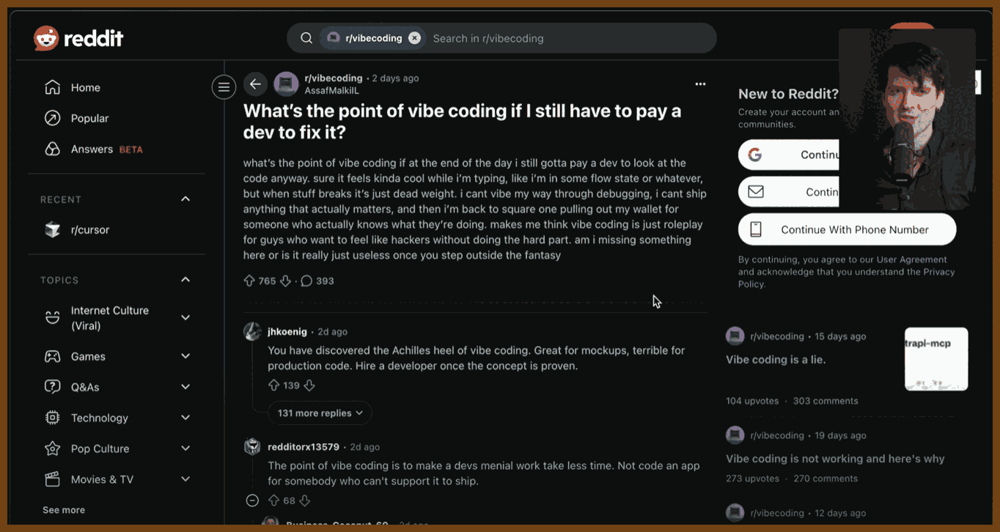
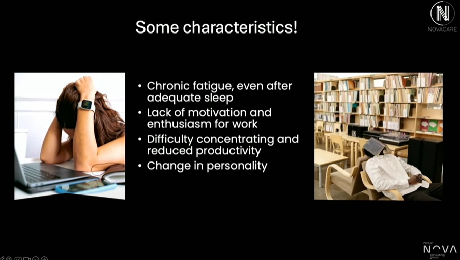
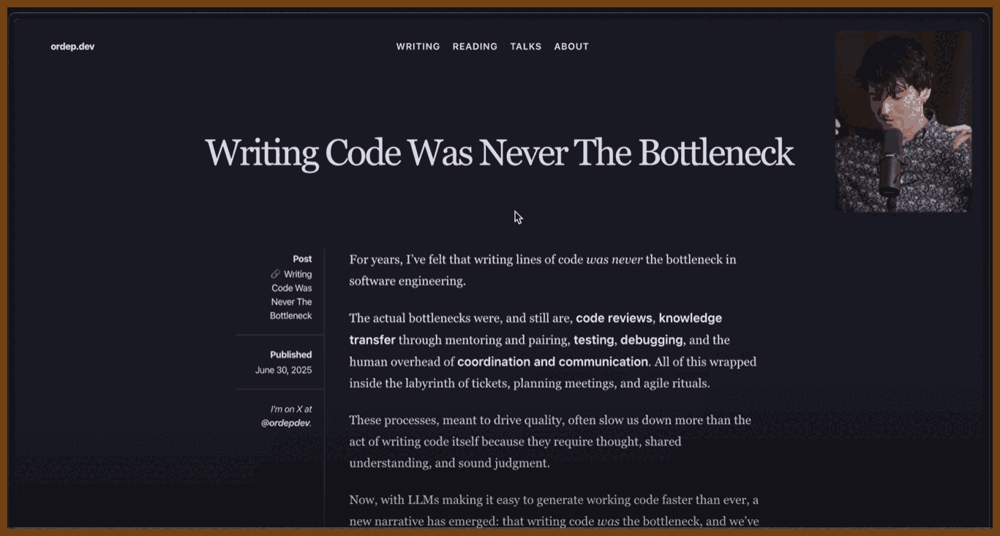
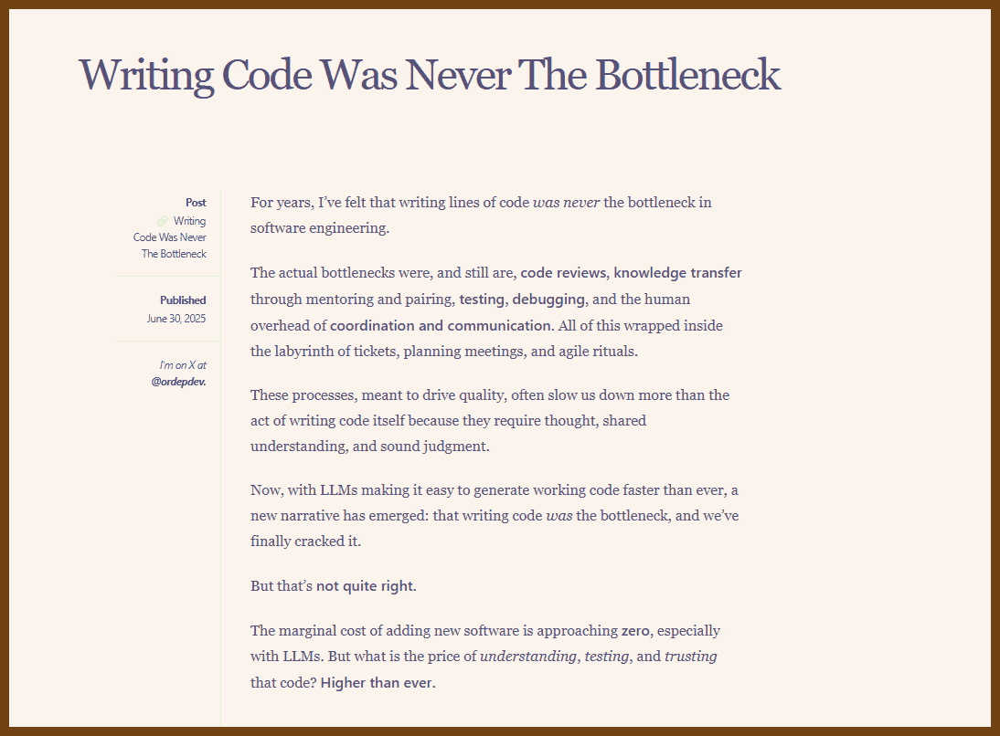
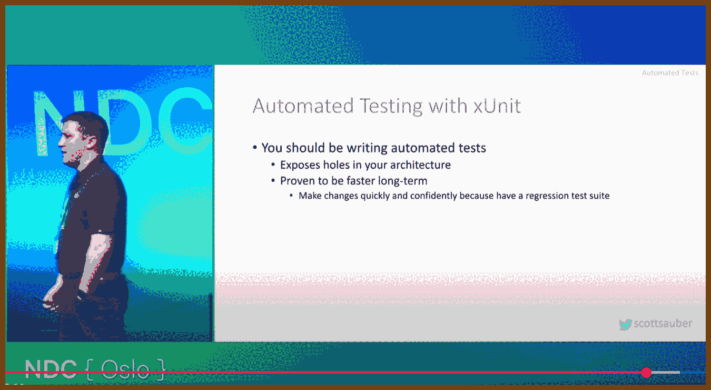
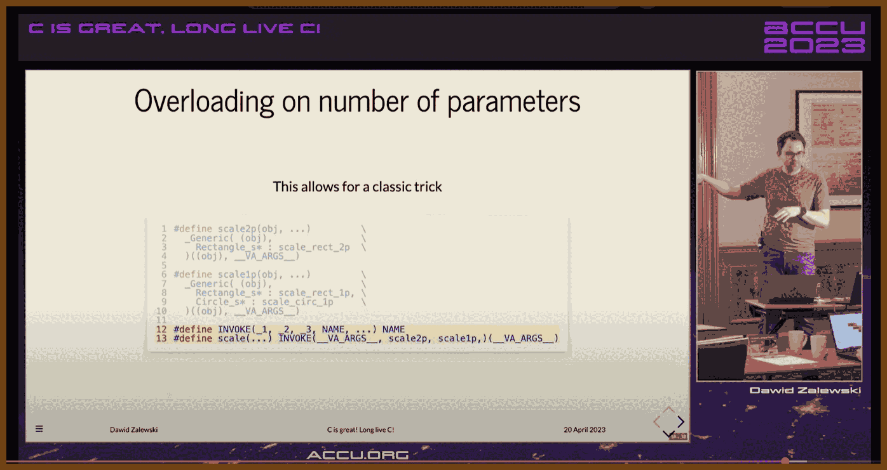
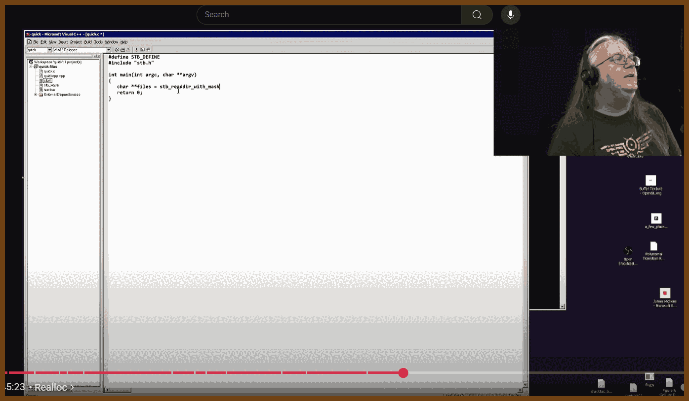

---
layout: post
title:  "Links from my inbox 2025-09-29"
date:   2025-09-29T12:42:00-07:00
categories: links
---

## ⌚ Nice watch!

2025-09-17 [Sam H. Smith – Parsing without ASTs and Optimizing with Sea of Nodes – BSC 2025 - YouTube](https://www.youtube.com/watch?v=NxiKlnUtyio) { www.youtube.com }

> 

**Summary**

- Prefer simple, fast tokenization with a cached peek and a rewindable savepoint instead of building token arrays or trees. See Tiny C Compiler’s one-pass design for inspiration: [Tiny C Compiler documentation](https://bellard.org/tcc/tcc-doc.html).
- Parse expressions without an AST using a right-recursive, precedence-aware function that sometimes returns early when the parent operator has higher precedence. This is equivalent in spirit to Pratt or precedence-climbing parsing. A clear tutorial: [Simple but Powerful Pratt Parsing](https://matklad.github.io/2020/04/13/simple-but-powerful-pratt-parsing.html).
- When a later token retroactively changes meaning, rewind to a saved scanner position and re-parse with the new mode rather than maintaining an AST.
- Start with a trivial linear IR using value numbers and stack slots so you can get codegen working early.
- Treat variables as stack addresses in the naive IR, but in the optimized pipeline treat variables as names bound to prior computations, not places in memory.
- Generate control flow with simple labels and conditional branches, then add else, while, and defer by re-parsing the relevant scopes from savepoints to emit the missing pieces.
- Inline small functions by jumping to the callee’s source, parsing it as a scope, and treating a return as a jump to the end of the inlined region.
- Move to a Sea-of-Nodes SSA graph as the optimization IR so that constant folding, CSE, and reordering fall out of local rewrites. Overview and history: [Sea of nodes on Wikipedia](https://en.wikipedia.org/wiki/Sea_of_nodes) and Cliff Click’s slide deck: [The Sea of Nodes and the HotSpot JIT](https://assets.ctfassets.net/oxjq45e8ilak/12JQgkvXnnXcPoAGoxB6le/5481932e755600401d607e20345d81d4/100752_1543361625_Cliff_Click_The_Sea_of_Nodes_and_the_HotSpot_JIT.pdf).
- Hash-cons nodes to deduplicate identical subgraphs and attach temporary keep-alive pins while constructing; remove pins to let unused nodes free. A hands-on reference implementation: [SeaOfNodes/Simple](https://github.com/SeaOfNodes/Simple).
- Represent control with If nodes that produce projections, merge with Region nodes, and merge values with Phi nodes. A compact SSA primer: [Static single-assignment form](https://en.wikipedia.org/wiki/Static_single-assignment_form) and LLVM PHI example: [SSA and PHI in LLVM IR](https://mapping-high-level-constructs-to-llvm-ir.readthedocs.io/en/latest/control-structures/ssa-phi.html).
- Convert the Sea-of-Nodes graph back to a CFG using Global Code Motion; then eliminate Phi by inserting edge moves. Foundational paper: [Global Code Motion / Global Value Numbering](https://courses.cs.washington.edu/courses/cse501/06wi/reading/click-pldi95.pdf).
- Build a dominator tree and schedule late to avoid hoisting constants and work into hot blocks. A modern overview of SSA placement and related algorithms: [A catalog of ways to generate SSA](https://bernsteinbear.com/blog/ssa/).
- Prefer local peephole rewrites applied continuously as you build the graph; ensure the rewrite set is confluent enough to terminate. A readable walkthrough with code and GCM illustrations: [Sea of Nodes by Fedor Indutny](https://darksi.de/d.sea-of-nodes/).
- Keep memory effects simple at first by modeling loads, stores, and calls on a single control chain; only add memory dependence graphs once everything else is stable.
- For debug info, insert special debug nodes that capture in-scope values at control points so later scheduling and register allocation can still recover variable locations.
- Expect tokenizer speed to matter when you rely on rewinds; invest in fast scanning and cached peek results.
- In language design, favor unique top-level keywords so you can pre-scan files, discover declarations, and compile procedure bodies in parallel.
- Recognize limits and tradeoffs. One-pass compilers are fast but produce naive code without a strong optimizing IR; see the discussion and TCC’s own docs: [Do one-pass compilers still exist](https://stackoverflow.com/questions/7951854/do-one-pass-compilers-still-exist) and [Tiny C Compiler documentation](https://bellard.org/tcc/tcc-doc.html).
- Know the current landscape. Sea-of-Nodes is widely used, but some engines have moved away for language-specific reasons; see V8’s 2025 write-up: [Land ahoy: leaving the Sea of Nodes](https://v8.dev/blog/leaving-the-sea-of-nodes).

**Minimal tokenizer with peek, consume, and rewind**

```c
typedef struct {
  const char* src;     // start of file
  const char* cur;     // current byte
  Token cached;        // last peeked token
  bool has_cached;
} Scanner;

typedef struct { const char* cur; bool has_cached; Token cached; } Savepoint;

Token peek(Scanner* S) {
  if (S->has_cached) return S->cached;
  S->cached = scan_one_token(S->cur);   // returns enum + slice/span
  S->has_cached = true;
  return S->cached;
}

Token consume(Scanner* S) {
  Token t = peek(S);
  S->cur = t.end;       // advance by span
  S->has_cached = false;
  return t;
}

Savepoint mark(Scanner* S) { return (Savepoint){ S->cur, S->has_cached, S->cached }; }
void rewind(Scanner* S, Savepoint sp) { S->cur = sp.cur; S->has_cached = sp.has_cached; S->cached = sp.cached; }
```

**Expression parsing without an AST, with early return on higher-precedence parent**

```c
// precedence: larger = binds tighter. e.g., '*' > '+'
int prec(TokenKind op);

bool parse_expr(Scanner* S, int parent_prec, Value* out);

// parse a primary or unary, then loop binary ops of >= parent_prec
bool parse_expr(Scanner* S, int parent_prec, Value* out) {
  Value lhs;
  if (!parse_unary_or_primary(S, &lhs)) return false;

  for (;;) {
    Token op = peek(S);
    if (!is_binary(op.kind)) break;
    int myp = prec(op.kind);
    if (myp <= parent_prec) break;     // go-left-sometimes: return to parent
    consume(S);                        // eat operator
    Value rhs;
    if (!parse_expr(S, myp, &rhs)) return false;
    lhs = emit_binop(op.kind, lhs, rhs);   // compute or build IR
  }

  *out = lhs;
  return true;
}
```

**Rewind on forward knowledge**

```c
Savepoint sp = mark(&scanner);
Value v;
bool ok = parse_expr(&scanner, -1, &v);

if (ok && peek(&scanner).kind == TOK_DOLLAR) {
  consume(&scanner);
  rewind(&scanner, sp);
  set_mode(EXPR_MODE_DOLLAR_PLUS);     // switch semantics
  ok = parse_expr(&scanner, -1, &v);   // re-parse
}
```

**Toy linear IR with value numbers and stack slots**

```c
// vN are SSA-like value numbers, but we spill everything initially.
int v_lit(int64_t k);                      // emit literal -> v#
int v_addr(StackSlot s);                   // address-of a local -> v#
int v_load(int v_addr);                    // load [v_addr] -> v#
void v_store(int v_addr, int v_val);       // store v_val -> [v_addr]
void br_eqz(int v_cond, Label target);
```

**Phi and region construction at a merge**

```c
int then_x = build_then(...);   // returns value number
int else_x = build_else(...);

Region r = new_region();
int phi_x = new_phi(r, then_x, else_x);    // SSA merge point
bind_var(env, "x", phi_x);
```

**Global code motion back to a CFG and Phi removal**

```c
// For each block that flows into region R with phi v = phi(a from B1, b from B2):
// insert edge moves at end of predecessors, then kill phi.
emit_in(B1, "mov v <- a");
emit_in(B2, "mov v <- b");
remove_phi(R, v);
```

**Local peephole rules to run during graph build**

```c
// Commutativity and constant folding
rule add(x, y) -> add(y, x) if is_const(y) && !is_const(x);
rule add(k1, k2) -> lit(k1+k2);
rule mul(k1, k2) -> lit(k1*k2);

// Strength reductions
rule mul(x, lit(1)) -> x;
rule mul(x, lit(0)) -> lit(0);
```

**What to watch out for**

- Tokenizer performance matters because you will peek and rewind frequently.
- Ensure your rewrite set terminates; run to a fixed point in release builds and assert progress stops.
- Keep memory ordering strict at first by threading loads, stores, and calls on the control chain; only then add memory dependence edges.
- Dominance and latest safe placement are key for late scheduling; compute the dominator tree over the finalized CFG and sink work accordingly. Background: [Code motion](https://en.wikipedia.org/wiki/Code_motion).
- Sea-of-Nodes is powerful but not universal; language and runtime constraints may push you toward different IRs, as V8 discusses here: [Land ahoy: leaving the Sea of Nodes](https://v8.dev/blog/leaving-the-sea-of-nodes).

**Further references the talk alluded to**

- Cliff Click’s original papers and tutorial repos: [SeaOfNodes GitHub organization](https://github.com/SeaOfNodes) and his PLDI paper: [Global Code Motion / GVN](https://courses.cs.washington.edu/courses/cse501/06wi/reading/click-pldi95.pdf).
- Background on operator-precedence and Pratt parsing families: [Operator-precedence parser](https://en.wikipedia.org/wiki/Operator-precedence_parser).
- Short SSA and PHI refreshers: [Static single-assignment form](https://en.wikipedia.org/wiki/Static_single-assignment_form) and [SSA and PHI in LLVM IR](https://mapping-high-level-constructs-to-llvm-ir.readthedocs.io/en/latest/control-structures/ssa-phi.html).
- Context on one-pass compilers and tradeoffs: [Tiny C Compiler documentation](https://bellard.org/tcc/tcc-doc.html) and discussion: [Do one-pass compilers still exist](https://stackoverflow.com/questions/7951854/do-one-pass-compilers-still-exist).

**Bottom line**

- Parse without trees using a fast scanner, precedence-aware recursion, and savepoints.
- Get a simple linear IR running, then switch to a Sea-of-Nodes SSA graph with hash-consing and continuous peephole rewrites.
- Reconstruct a CFG via Global Code Motion, eliminate Phi with edge moves, and schedule late using a dominator tree.
- Keep memory simple first; add sophistication only when the rest is solid.
- Prefer local, incremental rewrites and measure.

2025-09-03 [Please stop vibe coding like this - YouTube](https://www.youtube.com/watch?v=6TMPWvPG5GA) { www.youtube.com }

> 
>
> 1. **Know the craft; do not let tools outrun skill.**
> 2. **Use vibe coding for throwaway and legacy work, not for core craftsmanship.**
> 3. **Name the mode: agentic coding vs vibe coding, and pick deliberately.**
> 4. **Prefer small local code over extra dependencies when the task is tiny.**
> 5. **Use AI to replace low-value engineering, not engineers.**
>
> ***"You still need to know how code works if you want to be a coder."***
> I keep the **skill floor** high. If I feel the tool exceeding my understanding, I stop, turn off the agent, and read. I ask chat to teach, not to substitute thinking. I refuse the comfort of not knowing because **comfort in ignorance** is corrosive. If the tool is better than me at the task, I train until that is no longer true, then use the tool as a multiplier rather than a crutch.
>
> ***"The majority of code we write is throwaway code."***
> I point vibe coding at **disposable work**: scripts, scaffolding, glue, UI boilerplate, exploratory benchmarks. I optimize for speed, learning, and deletion, not polish. Good code solves the right problem and does not suck to read; here I bias the first trait and accept that readability is optional when the artifact is destined to be forgotten. I ship, test the idea, and freely discard because **throwing it away never hurts**.
>
> ***"Agentic coding is using prompts that use tools to then generate code. Vibe coding is when you don't read the code after."***
> I **name the mode** so I do not confuse capabilities with habits. Agentic flows can plan edits across a repo; vibe coding is a behavior choice to stop reading and just prompt. If I neither know nor read the code, I am stuck. If I know the code and sometimes choose not to read it for low-stakes tasks, I am fast. Clear terms prevent hype and let me pick the right tool for the job.
>
> ***"You cant be mad at vibe coding and be mad at left-pad."***
> For tiny problems, I keep **ownership** by generating a few lines locally instead of importing yet another dependency with alien opinions. When a package bites, patching generated local code is easier than vendoring the world. Vibe coding solves the same pain that excessive deps create, but without surrendering control of the codebase.
>
> ***"Vibe coding isn't about replacing engineers. Its about replacing engineering."***
>  I aim AI at the **low-value engineering** I never wanted to do: a quick SVG->PNG converter in the browser, a square image maker for YouTube previews, lightweight benchmarking harnesses. These are small, tailor-made tools that unlock output with near-zero ceremony. Experts remain essential for the hard parts; AI just clears the gravel so we can climb.

2025-08-30 [Burnout from the Top – A Story of Falling, Learning, and Rising Again - Tom Erik Rozmara Frydenlund - YouTube](https://www.youtube.com/watch?v=i2juiR8Xvk0) { www.youtube.com }

> burnout, leadership, mental health, recovery, resilience, psychological safety, work culture, boundaries, calendar management
>
> 
>
> I used to treat leadership like armor. Stand in front. Be strong. Say yes. Keep moving. Then my own body called time. One night my heart raced past 220. The doctor said drive in. The nurse called an ambulance. It was not a heart attack, but it was close enough to stop me. That was the day I learned burnout is an invisible injury. You look fine. You are not.
>
> The signs were there for weeks. I stopped sleeping. I lost motivation. My focus frayed. I snapped at home. I withdrew. My personality shifted. People saw the change before I did. If you notice this in yourself or in a colleague, ask the simple question: are you OK. That question can be the lifeline.
>
> The causes were obvious in hindsight. Too much work, all channels open, phone always on. Unclear expectations I filled with extra effort. A culture that prized speed over quality. Isolation. Perfectionism. I tried to deliver 100 percent on everything. That is expensive in hours and in health. Ask what is good enough. Leave room to breathe.
>
> Recovery was not heroic. It was slow and dull and necessary. I accepted that I was sick even if no one could see it. I told people. That made everyday life less awkward and it cut the shame. My days became simple: wake, breakfast, long walk, read, sleep, repeat. Minus 20 or pouring rain, I walked. Some days I felt strong and tried to do too much. The next day I crashed. I learned to pace. Think Amundsen, not Scott. Prepare. March the same distance in bad weather and good. Quality every day beats bursts and collapses.
>
> Talking helped. Family, colleagues, a professional if you need it. Do not keep it inside. Burnout is now a described syndrome of unmanaged work stress. You are not unique in this, and that is a relief. The earlier you talk, the earlier you can turn. There are stages. I hit the last one. You do not need to.
>
> Returning to work took time. Six months from ambulance to office. Do not sprint back. Start part time. Expect bumps. Leaders must make space for this. Do not load the diesel engine on a frozen morning. Warm it first. If you lead, build a ramp, not a wall.
>
> I changed how I use time. I own my calendar. I block focus time before other people fill my week. I add buffers between meetings. I add travel time. I prepare on purpose. I ask why I am needed. I ask what is expected. If there is no answer, I decline. I say no when I am tired or when I will not add value. I reschedule when urgency is fake. Many meetings become an email or a short call when you ask the right question.
>
> I changed how I care for the basics. I set realistic goals. I move every day. Long walks feed the brain. I go to bed on time. I protect rest. I learned to say no and to hold the line. I built places to recharge. For me it is a cabin and a fire. Quiet. Books. Music. You find your own battery and you guard it.
>
> I changed how I lead. Psychological safety is not a slide. It is daily behavior. We build trust. We keep confidences. We invite dissent and keep respect. We cheer good work and we say the missing word: thank you. Recognition costs little and pays back a culture where people speak up before they break. I aim for long term quality over quick gains. The 20 mile march beats the sprint for the next quarter. Greatness is choice and discipline, not luck.
>
> I dropped the mask. Pretending to be superhuman drains energy you need for the real work. I am the same person at home and at work. I can be personal. I can admit fear. I can cry. That honesty gives others permission to be human too. It also prevents the slow leak of acting all day.
>
> On motivation, I look small and near. You do not need fireworks every morning. You need a reason. Clean dishes. A solved bug. A customer who can sleep because the system is stable. Ask why. Ask it again. Clear purpose turns effort into progress. When the honeymoon buzz fades, purpose stays.
>
> If you are early on this path, take these moves now. Notice the signs. Talk sooner. Cut the always-on loop. Define good enough. Pace like Amundsen. If you are coming back, ramp slowly and let others help. If you lead, design conditions for health: time to think, time to rest, time to do quality work. Own the calendar. Guard the buffers. Reward preparation. Thank people. And remember the simplest goal. Wake up. You are here. Build from there.

2025-08-10 [You're using AI coding tools wrong - YouTube](https://www.youtube.com/watch?v=i44jQvcDARo) { www.youtube.com }

> 
> **Key Takeaways – The Real Bottleneck in Software Development (and How AI Should Actually Help)**
>
> - **Writing code was never the bottleneck** – Shipping slow isn’t because typing is slow. Code reviews, testing, debugging, knowledge transfer, coordination, and decision-making are the real pace-setters.
> - **Processes kill speed when misused** – Long specs, excessive meetings, and rigid “research → design → spec → build → ship” flows often lock in bad assumptions before real user feedback happens.
> - **Prototype early, prototype often** – Fast, rough builds are a cheap way to learn if an idea is worth pursuing. The goal is insight, not production-grade quality at first.
> - **Optimize for “time to next realization”** – The fastest path from assumption to new learning wins. Use prototypes to expose wrong assumptions before investing heavily.
> - **Throwaway code vs. production code** – Treat them differently. Throwaway code is for learning, experiments, and iteration; production code is for maintainability and scale. Confusing the two makes AI tools look worse than they are.
> - **AI’s best use is speeding up iteration, not replacing devs** – Let AI help create quick prototypes, test tech approaches, and refine concepts. Don’t just use it to auto-generate bloated specs or production code you don’t understand.
> - **Bad specs cost more than slow typing** – If research and design start from faulty assumptions, all the downstream work is wasted. Prototypes fix this by providing a working reference early.
> - **Smaller teams + working prototypes = better communication** – Three people iterating on a small demo is more effective than 20 people debating a massive spec.
> - **Culture shift needed** – Many engineers and PMs resist prototypes, clinging to big upfront design. This causes conflict when AI makes rapid prototyping possible.
> - **Fun matters** – Iterating on ideas with quick feedback loops is engaging. Endless Jira tickets and reviewing AI-generated slop are not.
> - **Main warning** – If AI tools only make it easier to produce large amounts of code without improving understanding, you slow down the real bottleneck: team alignment and decision-making.
>
> **Source article:**
>
> 2025-08-10 [Writing Code Was Never The Bottleneck - ordep.dev](https://ordep.dev/posts/writing-code-was-never-the-bottleneck) { ordep.dev }
>
> > The actual bottlenecks were, and still are, 
> >
> > - **🖥️🔍 code reviews**, 
> > - **📚🤝 knowledge transfer** through mentoring and pairing, 
> > - **🧪✅ testing**, 
> > - **🔎🐛 debugging**, and 
> > - the human overhead of **📅🗣️🤝 coordination and communication**. 
> >
> > All of this wrapped inside the labyrinth of tickets, planning meetings, and agile rituals.
>
> 

2025-09-17 [10 Things I Do On Every .NET App - Scott Sauber - NDC Oslo 2025 - YouTube](https://www.youtube.com/watch?v=SvcRvolP2NE) { www.youtube.com }

> 

**1. Organize by feature folders, not by technical layer**
 Group controllers, views, view models, client assets, and tests by feature to increase cohesion and make adding or removing a feature localized. This applies equally to MVC, Razor Pages, Blazor, and React front ends.

Code sketch:

```text
/Features
  /MyProfile
    MyProfileController.cs
    MyProfileViewModel.cs
    Index.cshtml
    index.css
    index.tsx  // if co-locating SPA bits
    MyProfile.tests.cs
```

Reference: [Feature Slices for ASP.NET Core](https://learn.microsoft.com/en-us/aspnet/core/fundamentals/minimal-apis/slice-your-app?view=aspnetcore-9.0)

------

**2. Treat warnings as errors**
 Fail the build on warnings to keep the codebase clean from day 1. Prefer project-wide MSBuild setting. For full coverage across tasks, also use the CLI switch.

Code:

```xml
<!-- .csproj -->
<PropertyGroup>
  <TreatWarningsAsErrors>true</TreatWarningsAsErrors>
</PropertyGroup>
```

CLI:

```bash
dotnet build -warnaserror
```

Reference: [MSBuild TreatWarningsAsErrors property](https://learn.microsoft.com/en-us/visualstudio/msbuild/warnings-as-errors?view=vs-2022)

------

**3. Prefer structured logging with Serilog via ILogger, enrich with context**
 Use structured properties rather than string concatenation, enrich logs with correlation id, user id, request url, version, etc. Always program against ILogger and configure Serilog only in bootstrap.

Code:

```csharp
// Program.cs
Log.Logger = new LoggerConfiguration()
    .Enrich.FromLogContext()
    .WriteTo.Console()
    .CreateLogger();

builder.Host.UseSerilog((ctx, lc) => lc
    .ReadFrom.Configuration(ctx.Configuration));

// In a handler/service
public Task Handle(Guid userId) {
    _logger.LogInformation("Retrieving user {@UserId}", userId);
    return Task.CompletedTask;
}
```

Reference: [Serilog Documentation](https://serilog.net/)

------

**4. Distinguish logs vs metrics vs audits; store audits in your primary data store**
 Keep developer-focused logs separate from business metrics; store audit trails where loss is unacceptable in your transactional store, not only in logs. Security and compliance often require retention beyond default log windows.

------

**5. Secure by default with a global fallback authorization policy**
 Make endpoints require authentication unless explicitly opted out by AllowAnonymous or a policy override.

Code:

```csharp
// Program.cs
builder.Services.AddAuthorization(options =>
{
    options.FallbackPolicy = new AuthorizationPolicyBuilder()
        .RequireAuthenticatedUser()
        .Build();
});
```

Reference: [ASP.NET Core Authorization Policies](https://learn.microsoft.com/en-us/aspnet/core/security/authorization/policies?view=aspnetcore-9.0)

------

**6. Prefer FluentValidation over data annotations for complex rules**
 FluentValidation offers readable, testable rules and rich composition.

Code:

```csharp
public sealed class RegisterModelValidator : AbstractValidator<RegisterModel>
{
    public RegisterModelValidator()
    {
        RuleFor(x => x.Email).NotEmpty().EmailAddress();
        RuleFor(x => x.Password).NotEmpty().MinimumLength(12);
        RuleFor(x => x.BirthDate)
            .Must(d => d <= DateOnly.FromDateTime(DateTime.UtcNow).AddYears(-18))
            .WithMessage("Must be 18+");
    }
}
```

Reference: [FluentValidation for .NET](https://docs.fluentvalidation.net/en/latest/)

------

**7. Remove the Server header from Kestrel**
 Avoid advertising your stack to scanners by disabling the Kestrel Server response header.

Code:

```csharp
// Program.cs
builder.WebHost.ConfigureKestrel(o => o.AddServerHeader = false);
```

Reference: [Kestrel Web Server in ASP.NET Core](https://learn.microsoft.com/en-us/aspnet/core/fundamentals/servers/kestrel/options?view=aspnetcore-9.0)

------

**8. Inject options as a POCO by registering the Value**
 Keep Options pattern at the edges and inject your settings class directly to consumers by registering the bound value; use IOptionsSnapshot when settings can change per request.

Code:

```csharp
// Program.cs
builder.Services.Configure<MyAppSettings>(builder.Configuration.GetSection("MyApp"));
builder.Services.AddSingleton(sp => sp.GetRequiredService<IOptions<MyAppSettings>>().Value);

// Consumer
public sealed class WidgetService(MyAppSettings settings) { ... }
```

Reference: [Options pattern in ASP.NET Core](https://learn.microsoft.com/en-us/aspnet/core/fundamentals/configuration/options?view=aspnetcore-9.0)

------

**9. Favor early returns and keep the happy path at the end**
 Minimize nesting, return early for error and guard cases, and let the successful flow be visible at the bottom of a method for readability.

------

**10. Adopt the new XML solution format .slnx**
 The new .slnx format is human-readable XML, reduces merge conflicts, and is supported by the dotnet CLI and Visual Studio.

CLI:

```bash
dotnet sln migrate MySolution.sln
# produces MySolution.slnx
```

Reference: [Modern .slnx solution format](https://devblogs.microsoft.com/dotnet/solution-file-modernization/)

------

**11. Add HTTP security headers**
 Enable CSP, X-Frame-Options, Referrer-Policy, Permissions-Policy, etc., or use a helper package with sane defaults. Test with [securityheaders.com](https://securityheaders.com/).

Code:

```csharp
// Using NetEscapades.AspNetCore.SecurityHeaders
app.UseSecurityHeaders(policies =>
    policies.AddDefaultSecurityHeaders()
            .AddContentSecurityPolicy(b => b.BlockAllMixedContent()));
```

Reference: [NetEscapades.AspNetCore.SecurityHeaders](https://github.com/andrewlock/NetEscapades.AspNetCore.SecurityHeaders)

------

**12. Build once, deploy many; prefer trunk-based development**
 Use a single long-lived main branch, short-lived feature branches, and promote the same build artifact through environments.

Reference: [Atlassian Gitflow vs Trunk-based development](https://www.atlassian.com/continuous-delivery/continuous-integration/trunk-based-development)

------

**13. Validate your DI container on startup**
 Enable ValidateOnBuild and ValidateScopes to catch captive dependencies and lifetime errors during startup.

Code:

```csharp
builder.Host.UseDefaultServiceProvider(o =>
{
    o.ValidateScopes = true;
    o.ValidateOnBuild = true;
});
```

Reference: [.NET Generic Host Service Provider](https://learn.microsoft.com/en-us/dotnet/core/extensions/dependency-injection#default-service-provider)

------

**14. Write automated tests; prefer xUnit, upgrade to v3**
 Automated tests improve speed and reliability. xUnit v3 is current and supports the new Microsoft testing platform.

Code:

```xml
<!-- Test.csproj -->
<ItemGroup>
  <PackageReference Include="xunit.v3" Version="1.0.1" />
  <PackageReference Include="xunit.runner.visualstudio" Version="3.*" />
</ItemGroup>
<PropertyGroup>
  <UseMicrosoftTestingPlatformRunner>true</UseMicrosoftTestingPlatformRunner>
</PropertyGroup>
```

Reference: [xUnit.net v3](https://xunit.net/)

------

**15. Use Central Package Management**
 Keep package versions in Directory.Packages.props to synchronize versions across projects.

Code:

```xml
<!-- Directory.Packages.props -->
<Project>
  <ItemGroup>
    <PackageVersion Include="xunit.v3" Version="1.0.1" />
    <PackageVersion Include="Serilog.AspNetCore" Version="8.0.0" />
  </ItemGroup>
</Project>

<!-- In .csproj files -->
<ItemGroup>
  <PackageReference Include="xunit.v3" />
  <PackageReference Include="Serilog.AspNetCore" />
</ItemGroup>
```

Reference: [Central Package Management in .NET](https://learn.microsoft.com/en-us/nuget/consume-packages/Central-Package-Management)

------

**16. Log EF Core SQL locally by raising the EF category to Information**
 Enable Microsoft.EntityFrameworkCore.Database.Command at Information to see executed SQL. Use only for development.

Code:

```json
// appsettings.Development.json
{
  "Logging": {
    "LogLevel": {
      "Microsoft.EntityFrameworkCore.Database.Command": "Information"
    }
  }
}
```

Reference: [EF Core Logging and Events](https://learn.microsoft.com/en-us/ef/core/logging-events-diagnostics/simple-logging)

------

**17. CI/CD and continuous deployment with feature toggles; ship in small batches**
 Aim for pipelines that deploy green builds to production; replace manual checks with automated tests; use feature flags to keep unfinished work dark.

Reference: [DORA: Trunk-Based Development](https://dora.dev/capabilities/trunk-based-development/)

2025-09-28 [Programming in Modern C with a Sneak Peek into C23 - Dawid Zalewski - ACCU 2023 - YouTube](https://www.youtube.com/watch?v=lLv1s7rKeCM) { www.youtube.com }

> 
>
> ------
>
> A high-level tour of *Programming in Modern C with a Sneak Peek into C23*  (by Dawid Zalewski) shows how C remains alive and evolving. The talk focuses on practical, post-C99 techniques, especially useful in systems and embedded work. It demonstrates idioms that improve clarity, safety, and ergonomics without giving up low-level control.
>
> **Topics covered**
>
> **Modern initialization**
> Brace and designated initializers, empty initialization `{}` in C23, and mixed positional and designated forms.
>
> **Arrays**
> Array designators, rules for inferred array size, and guidance on when to avoid variable-length arrays as storage while still using VLA syntax to declare function parameter bounds.
>
> **Pointer and API contracts**
> Sized array parameters `T a[n]`, `static` qualifiers like `T a[static 3]` to require valid elements, and `const char *static 1` to enforce non-null strings.
>
> **Multidimensional data**
> Strongly typed pointers to VLA-shaped arrays for natural `a[i][j]` indexing and safer `sizeof` expressions.
>
> **Compound literals**
> Creating unnamed lvalues to reassign structs, pass inline structs to functions, and zero objects succinctly.
>
> **Macro patterns**
> Named-argument style wrappers around compound literals, simple defaults, `_Generic` for ad-hoc overloading by type, and a macro trick for argument-count dispatch.
>
> **Memory layout**
> Flexible array members for allocating a header plus payload in one contiguous block, reducing double-allocation pitfalls.
>
> **C23 highlights**
> New keywords for `bool`, `true`, and `false`, the `nullptr` constant, `auto` type inference in specific contexts, a note on `constexpr`, and current compiler support caveats.

2025-09-27 [Advice for Writing Small Programs in C - YouTube](https://www.youtube.com/watch?v=eAhWIO1Ra6M) { www.youtube.com }

> Main point
>
> - I spend my time writing code that gets real work done, and I rely on aggressive code reuse. In C that means I bring a better replacement for the C standard library to the party.
>
> Key advice for writing C
>
> - Build your own reusable toolkit. My answer was stb: single-file, public-domain utilities that replace weak parts of libc.
> - Use dynamic arrays and treat them like vectors. I use macros so that arr[i] works and capacity/length live in bytes before the pointer.
> - Prefer hash tables and dynamic arrays by default. They make small programs both simpler and usually faster.
> - Be pragmatic with the C standard library. Use printf, malloc, free, qsort; avoid footguns like gets and be careful with strncpy and realloc.
> - Handle realloc safely. Assign to a temp pointer first, then swap it back if allocation succeeds.
> - Do not cache dynamic array lengths. It is a source of bugs when the array grows or shrinks.
> - Accept small inefficiencies if they improve iteration speed. Optimize only when it affects the edit-run loop or output.
>
> Workflow and productivity
>
> - Remove setup friction. I keep a single quick.c workspace I can open, type, build, and run immediately.
> - Automate the boring steps. I have a one-command install that copies today’s build into my bin directory.
> - Write tiny, disposable tools. 5 to 120 minute utilities solve real problems now and often get reused later.
> - Favor tools that make easy things easy. Avoid frameworks that only make complicated things possible but make simple things tedious.
> - Keep programs single-file when you can. Deployment matters for speed and reuse.
>
> Code reuse and licensing philosophy
>
> - Make reuse non-negotiable. I do not want to rewrite the same helper twice.
> - Ship as single-header libraries and make them easy to drop in. Easy to deploy, easy to use, easy to license.
> - Public domain licensing removes friction for future me and everyone else.
>
> Language and ecosystem perspective
>
> - C can be great for small programs if you fix the library problem and streamline your workflow.
> - Conciseness matters. Shorter code usually means faster writing and iteration.
> - I choose C over dynamic languages for these tasks because my toolkit gives me comparable concision with better control.
>
> API and library design principles
>
> - Simple, focused APIs with minimal surface area.
> - Make the common path trivial. Optional flexibility is fine, but do not tax the simple case.
> - Prefer data and functions over deep hierarchies or heavy abstractions.
