---
layout: post
title:  "Links from my inbox 2025-10-26"
date:   2025-10-26T22:52:00-07:00
categories: links
---

## Good Reads

2025-10-27 [Seeing like a software company](https://www.seangoedecke.com/seeing-like-a-software-company/) { www.seangoedecke.com }

> Legibility is the product large software companies sell. Legible work is estimable, plannable, and explainable, even if it’s less efficient. Illegible work—fast patches, favors, side channels—gets things done but is invisible to executive oversight. Companies value legibility because it enables planning, compliance, and customer trust.
>
> Small teams move faster because they remain illegible. They skip coordination rituals, roadmap alignment, and approval processes. As companies grow, this speed is sacrificed in favor of legibility. Large orgs trade efficiency for predictability.
>
>
> Enterprise revenue drives the need for legibility. Large customers demand multi-quarter delivery guarantees, clear escalation paths, and process visibility. To win and retain these deals, companies adopt layers of coordination, planning, and status reporting.
>
>
> Urgent problems bypass process through sanctioned illegibility. Companies create strike teams or tiger teams that skip approvals, break rules, and act fast. These teams rely on senior engineers, social capital, and informal coordination. Their existence confirms that normal processes are too slow for real emergencies.
>
> 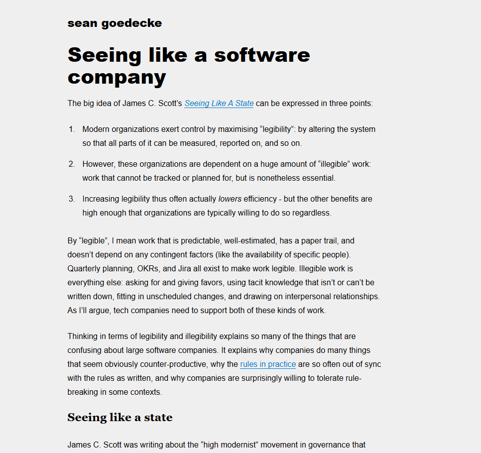

2025-10-27 [Abstraction, not syntax](https://ruudvanasseldonk.com/2025/abstraction-not-syntax) { ruudvanasseldonk.com }

> 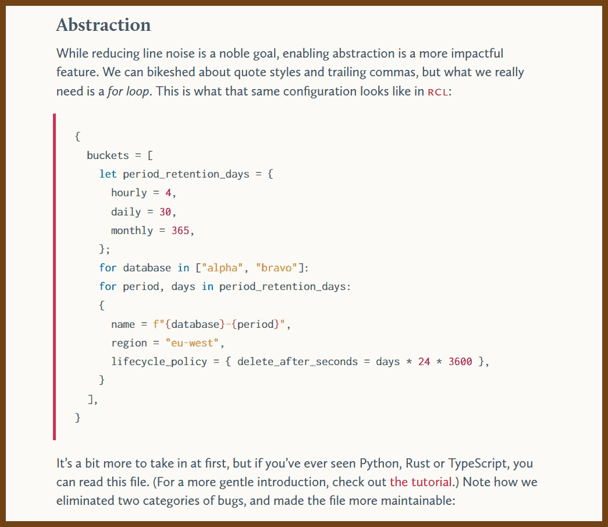

2025-10-10 [My Approach to Building Large Technical Projects – Mitchell Hashimoto](https://mitchellh.com/writing/building-large-technical-projects) { mitchellh.com }

> 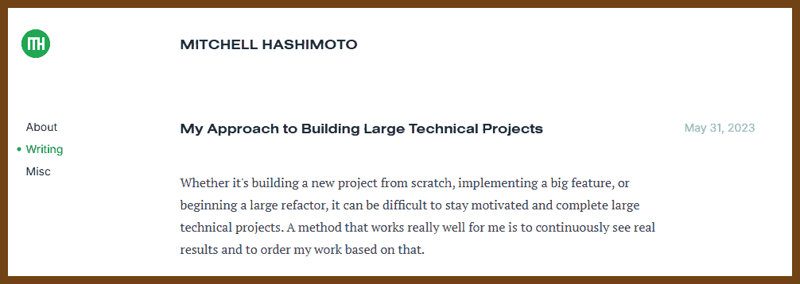
>
> I stay motivated on big projects by chasing visible progress. I break the work into small pieces I can see or test now, not later. I start with backends that are easy to unit test, then sprint to scrappy demos. I aim for good enough, not perfect, so I can move to the next demo. I build only what I need to use the thing myself, then iterate as real use reveals gaps.
>
> Five takeaways: decompose into demoable chunks; write tests to create early wins; build quick demos regularly; adopt your own tool fast; loop back to improve once it works for you. Main advice: **always give myself a good demo**, **do not let perfection block progress**, **optimize for momentum**, **build only what I need now**, **iterate later with purpose**.

2025-10-01 [Stop Avoiding Politics – Terrible Software](https://terriblesoftware.org/2025/10/01/stop-avoiding-politics/) { terriblesoftware.org }

> 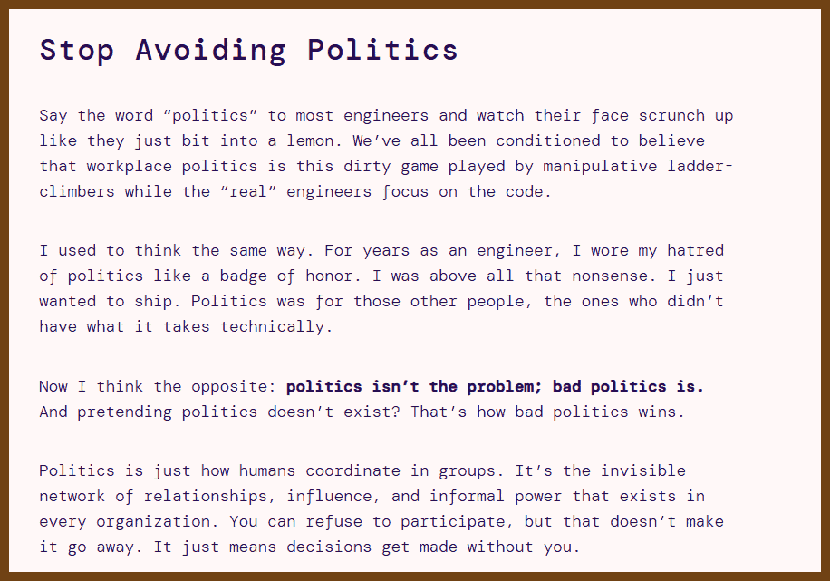
>
> Here’s what good politics looks like in practice:
>
> 1. **Building relationships before you need them.** That random coffee with someone from the data team? Six months later, they’re your biggest advocate for getting engineering resources for your data pipeline project.
> 2. **Understanding the real incentives.** Your VP doesn’t care about your beautiful microservices architecture. They care about shipping features faster. Frame your technical proposals in terms of what they actually care about.
> 3. **Managing up effectively.** Your manager is juggling competing priorities you don’t see. Keep them informed about what matters, flag problems early with potential solutions, and help them make good decisions. When they trust you to handle things, they’ll fight for you when it matters
> 4. **Creating win-win situations.** Instead of fighting for resources, find ways to help other teams while getting what you need. It doesn’t have to be a zero-sum game.
> 5. **Being visible.** If you do great work but nobody knows about it, did it really happen? Share your wins, present at all-hands, write those design docs that everyone will reference later.

2025-09-29 [Taking a Look at Compression Algorithms | Moncef Abboud](https://cefboud.com/posts/compression/) { cefboud.com }

> 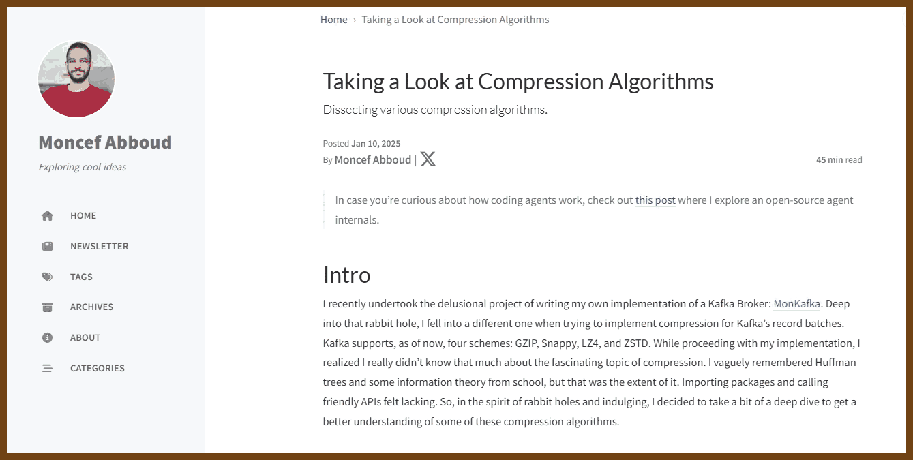
> The article is a practical tour of lossless compression, focusing on how common schemes balance three levers: compression ratio, compression speed, and decompression speed. It explains core building blocks like LZ77 and Huffman coding, then dives into DEFLATE as used by gzip, before comparing speed and ratio tradeoffs across Snappy, LZ4, Brotli, and Zstandard. It also highlights implementation details from Go’s DEFLATE, and calls out features like dictionary compression in zstd.

💖 2025-09-29 [Keeping Secrets Out of Logs - allan.reyes.sh](https://allan.reyes.sh/posts/keeping-secrets-out-of-logs/#-log-pre-processors) { allan.reyes.sh }

> 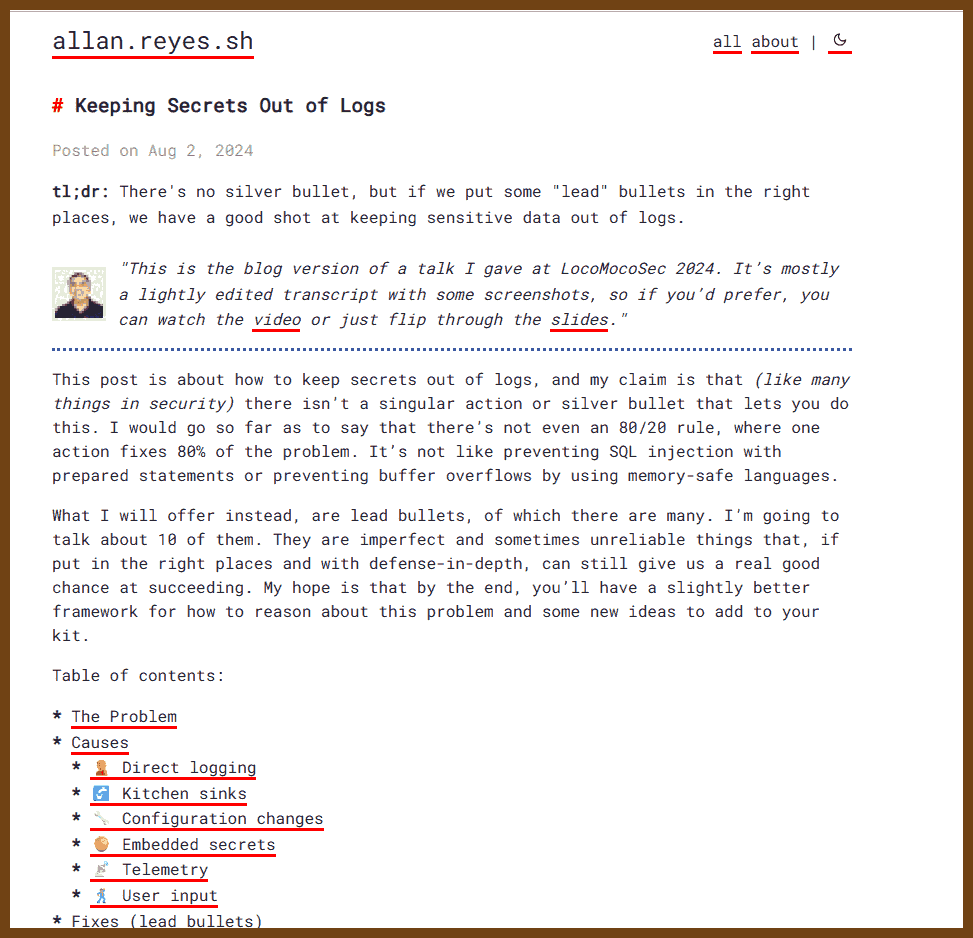
>
> Treat it as a data-flow problem. Centralize logging through one pipeline and one library. Make it the only way to emit logs and the only way to view them.
>
> Transform data early. Favor minimization, then redaction; consider tokenization or hashing; treat masking as last resort. Apply before crossing trust boundaries or logger calls.
>
> Introduce domain primitives for secrets. Stop passing raw strings. Give secrets types/objects that default to safe serialization and require explicit unwraps.
>
> Use read-once wrappers. Allow a single, intentional read; any second read throws. This turns accidental logging into a loud failure in tests and staging.
>
> Own the log formatter. Enforce structured JSON. Traverse objects, drop risky paths (e.g., `headers`, `request`, `response.body`), redact known fields, and block generic `.toString()`.
>
> Add taint checking. Mark sources (decrypt, DB reads, request bodies). Forbid sinks (logger). Whitelist sanitizers (tokenize). Run in CI and on large diffs; expect rules to evolve.
>
> Test like a pessimist. Capture stdout/stderr; fail tests on unredacted secrets. In prod, redact; in tests, error. Cover hot paths that produce “kitchen sinks.”
>
> Scan on the pipeline. Use secret scanners in CI and at the log ingress. Prefer sampling per-log-type over a flat global rate so low-volume types still get scanned.
>
> Insert a pre-processor hop. Put Vector/Fluent Bit between emitters and storage to redact, drop, tokenize, and sample for heavy scanners before persistence.
>
> Invest in people. Teach “secret vs sensitive,” publish paved paths, and make it safe and fast to report leaks.
>
> Lay the foundation. Align on a definition of “secret,” move to structured logs, and consolidate emit/view into one pipeline. Expect to find more issues at first; that’s progress.
>
> Map the data flow. Draw sources, sinks, and side channels. Include front-end analytics, ALB/NGINX access logs, error trackers, and any bypasses of your main path.
>
> Fortify chokepoints. Put most controls where all logs must pass: the library, formatter, CI taint rules, scanners, and the pre-processor. Pull teams onto the paved path.
>
> Apply defense-in-depth. Pair every preventative with a detective one step downstream. If formatter redacts, scanners verify. If types prevent, tests break on regressions.
>
> Plan response and recovery. When a leak happens: scope, restrict access, stop the source, clean stores and indexes, restore access, run a post-mortem, and harden to prevent recurrence.

2025-09-29 [The yaml document from hell](https://ruudvanasseldonk.com/2023/01/11/the-yaml-document-from-hell) { ruudvanasseldonk.com }

> 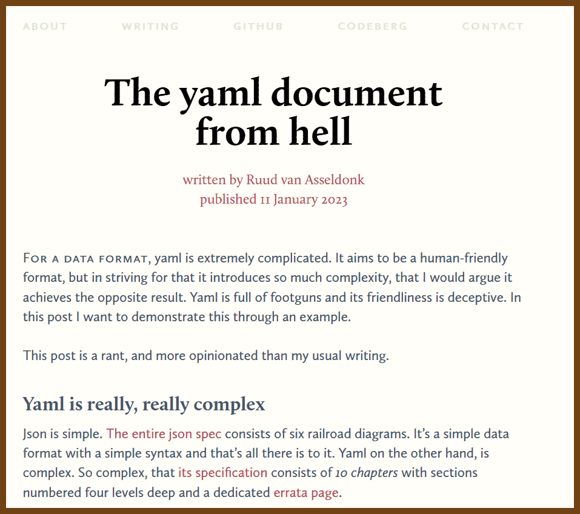Ruud van Asseldonk’s article *The YAML Document from Hell* critiques YAML as overly complex and error-prone compared to JSON. Through detailed examples, he shows how YAML’s hidden features, ambiguous syntax, and inconsistent versioning can produce confusing or dangerous outcomes, making it risky for configuration files.
>
> **Key Takeaways**
>
> 1. YAML’s complexity stems from numerous features and a large specification, unlike JSON’s simplicity and stability.
> 2. Ambiguous syntax such as `22:22` may be parsed as a sexagesimal number in YAML 1.1 but as a string in YAML 1.2.
> 3. Tags (`!`) and aliases (`*`) can lead to invalid documents or even security risks, since untrusted YAML can trigger arbitrary code execution.
> 4. The “Norway problem” highlights how literals like `no` or `off` become `false` in YAML 1.1, leading to unexpected values.
> 5. Non-string keys (e.g., `on`) may be parsed as booleans, creating inconsistent mappings across parsers and languages.
> 6. Unquoted strings resembling numbers (e.g., `10.23`) are often misinterpreted as numeric values, corrupting intended data.
> 7. YAML version differences (1.1 vs 1.2) mean the same file may parse differently across tools, causing portability issues.
> 8. Popular libraries like PyYAML or Go’s yaml use hybrid or outdated interpretations, making reliable parsing difficult.
> 9. The abundance of edge cases (63+ string syntaxes) makes YAML unpredictable and fragile in real-world use.
> 10. Author’s recommendation: avoid YAML when correctness and predictability are critical, and prefer simpler formats like JSON.

## 🛠️ How the things work

2025-10-27 [Build Your Own Database](https://www.nan.fyi/database) { www.nan.fyi }

> If you were to build your own database today, not knowing that databases exist already, how would you do it? In this post, we'll explore how to build a **key-value database** from the ground up.
> 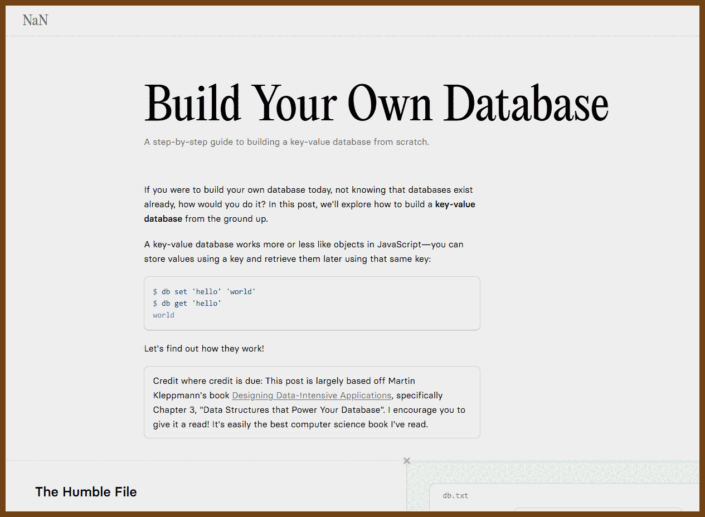

2025-10-27 [An Illustrated Introduction to Linear Algebra](https://www.ducktyped.org/p/an-illustrated-introduction-to-linear) { www.ducktyped.org }

> 

## Activity tracking

2025-10-06 [GitHub - ActivityWatch/activitywatch: The best free and open-source automated time tracker. Cross-platform, extensible, privacy-focused.](https://github.com/ActivityWatch/activitywatch) {github.com}

> 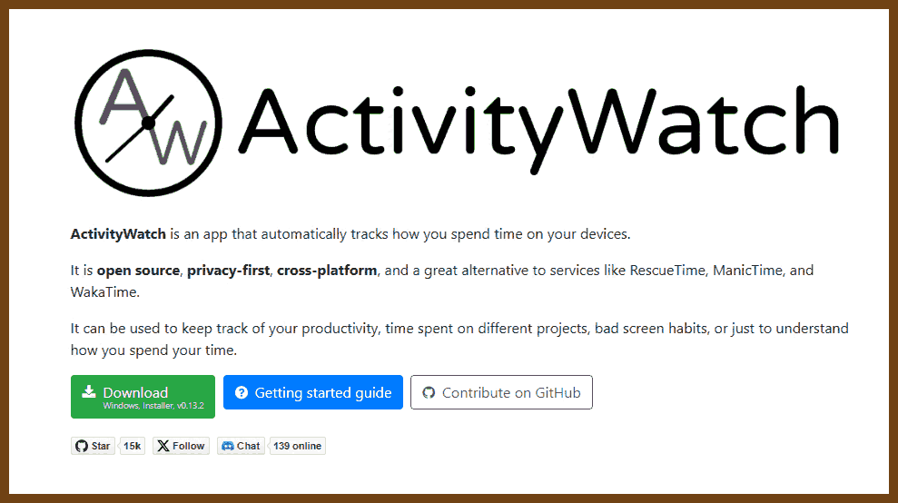
>
> Cross-platform automated activity tracker with watchers for active window titles and AFK detection. Data stored locally; JSONL and SQLite via modules. Add aw-watcher-input to count keypresses and mouse movement without recording the actual keys.
>
> 🐙🐈 [GitHub - ActivityWatch/activitywatch: The best free and open-source automated time tracker. Cross-platform, extensible, privacy-focused.](https://github.com/ActivityWatch/activitywatch) {github.com}

2025-10-06 [arbtt: the automatic, rule-based time tracker](https://arbtt.nomeata.de/) {arbtt.nomeata.de}

> 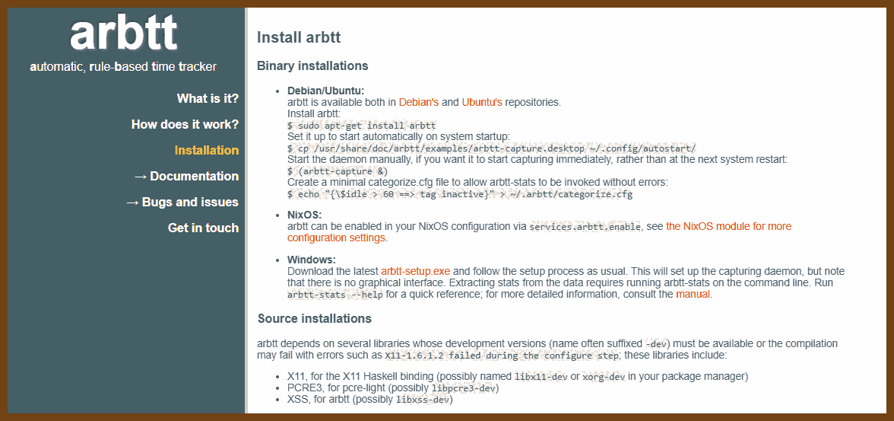
>
> 🐙🐈 [GitHub - nomeata/arbtt: arbtt, the automatic rule-based time-tracker](https://github.com/nomeata/arbtt) {github.com}

2025-10-06 [GitHub - MayGo/tockler: An application that tracks your time by monitoring your active window title and idle time.](https://github.com/MayGo/tockler/) {github.com}

> 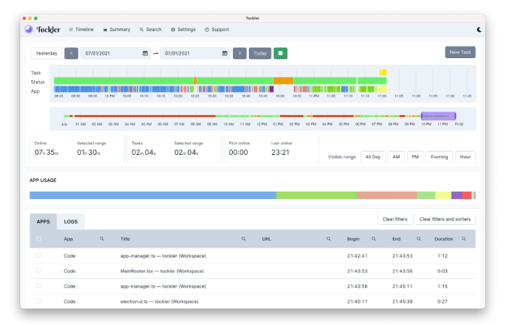
>
> Tockler is a free application that automatically tracks your computer usage and working time. It provides detailed insights into:
>
> - Application usage and window titles
> - Computer state (idle, offline, online)
> - Interactive timeline visualization
> - Daily, weekly, and monthly usage statistics
> - Calendar views and charts
>
> Features
>
> - **Time Tracking**: Go back in time and see what you were working on
> - **Application Monitoring**: Track which apps were used and their window titles
> - **Usage Analytics**: View total online time, application usage patterns, and trends
> - **Interactive Timeline**: Visualize your computer usage with an interactive chart
> - **Cross-Platform**: Available for Windows, macOS, and Linux

2025-10-06 [Welcome to Workrave · Workrave](https://workrave.org/) {workrave.org}

> Take a break and relax
> Workrave is a free program that assists in the recovery and prevention of Repetitive Strain Injury (RSI). It monitors your keyboard and mouse usage and using this information, it frequently alerts you to take microbreaks, rest breaks and restricts you to your daily computer usage.
>
> 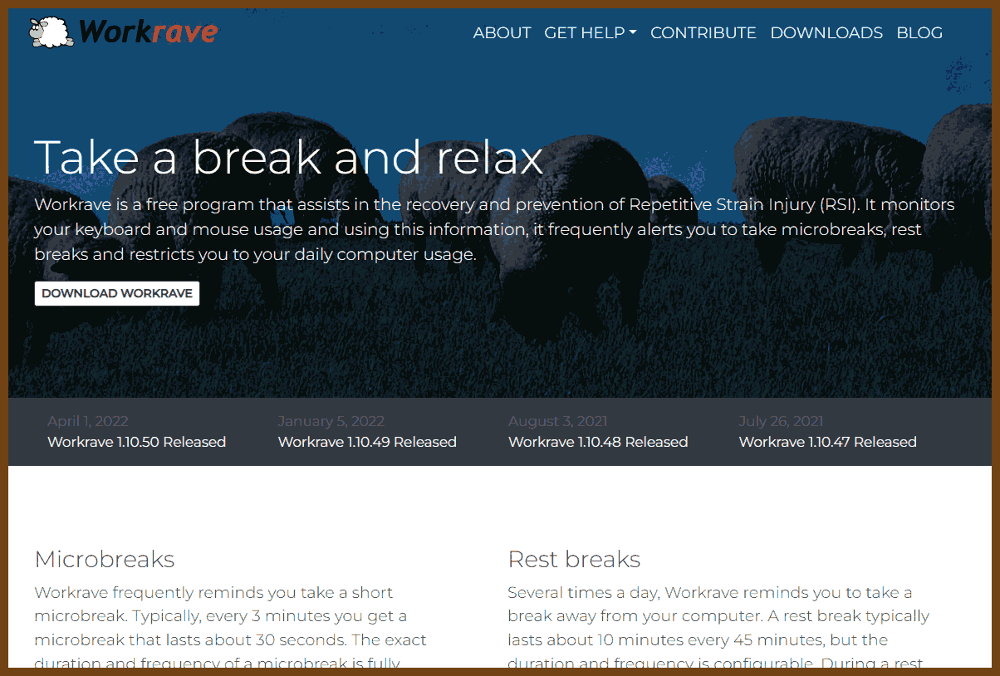
>
> 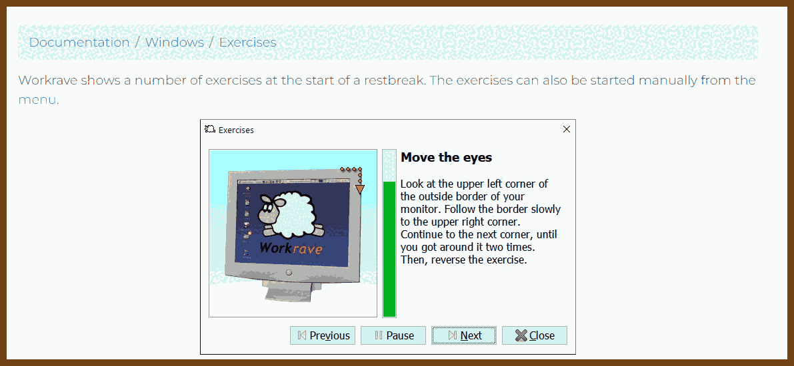
>
> 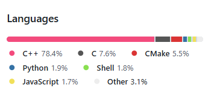
>
> 🐙🐈 2025-10-06 [GitHub - rcaelers/workrave: ](https://github.com/rcaelers/workrave) {github.com}

## ADHD

2025-10-01 [ADHD wiki — Explaining ADHD with memes](https://romankogan.net/adhd/) { romankogan.net }

> It’s a personal “ADHD wiki” by Roman Kogan: short, plain-language pages that explain common adult ADHD patterns (e.g., procrastination, perfectionism, prioritizing, planning), with concrete coping tips and meme-style illustrations; sections include ideas like “Body Double” and “False Dependency Chain.”
>
> See also: 2025-10-01 [Show HN: Autism Simulator | Hacker News](https://news.ycombinator.com/item?id=45438346) { news.ycombinator.com }

> 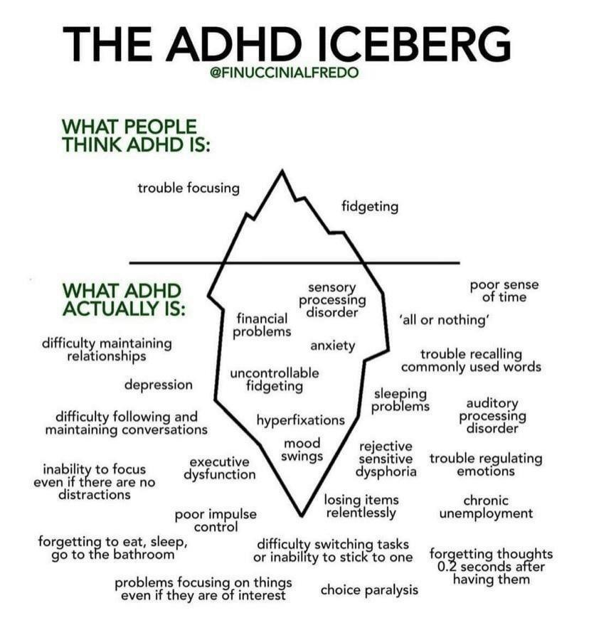

> 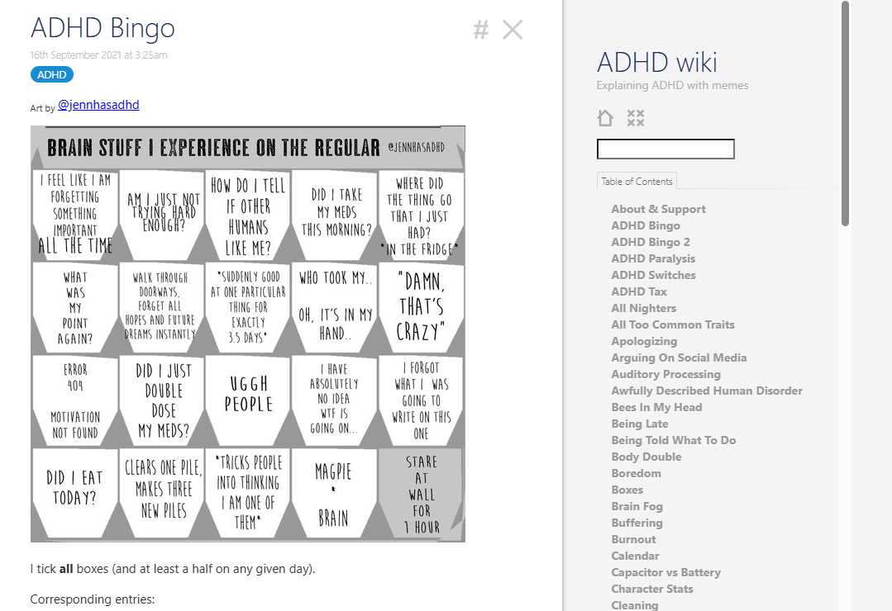

## 👂 The Ear of AI (LLMs)

2025-10-27 [LLMs Can Get "Brain Rot"!](https://llm-brain-rot.github.io/) { llm-brain-rot.github.io }

> Low quality data causes measurable cognitive decline in LLMs
> The authors report that continually pretraining on junk data leads to statistically meaningful performance drops, with Hedges' g > 0.3 across reasoning, long context understanding, and safety.
> This suggests that data quality alone, holding training scale constant, can materially degrade core capabilities of a model. Actionable insight: data going into continual pretraining is not neutral, and "more data" is not automatically better.
>
> 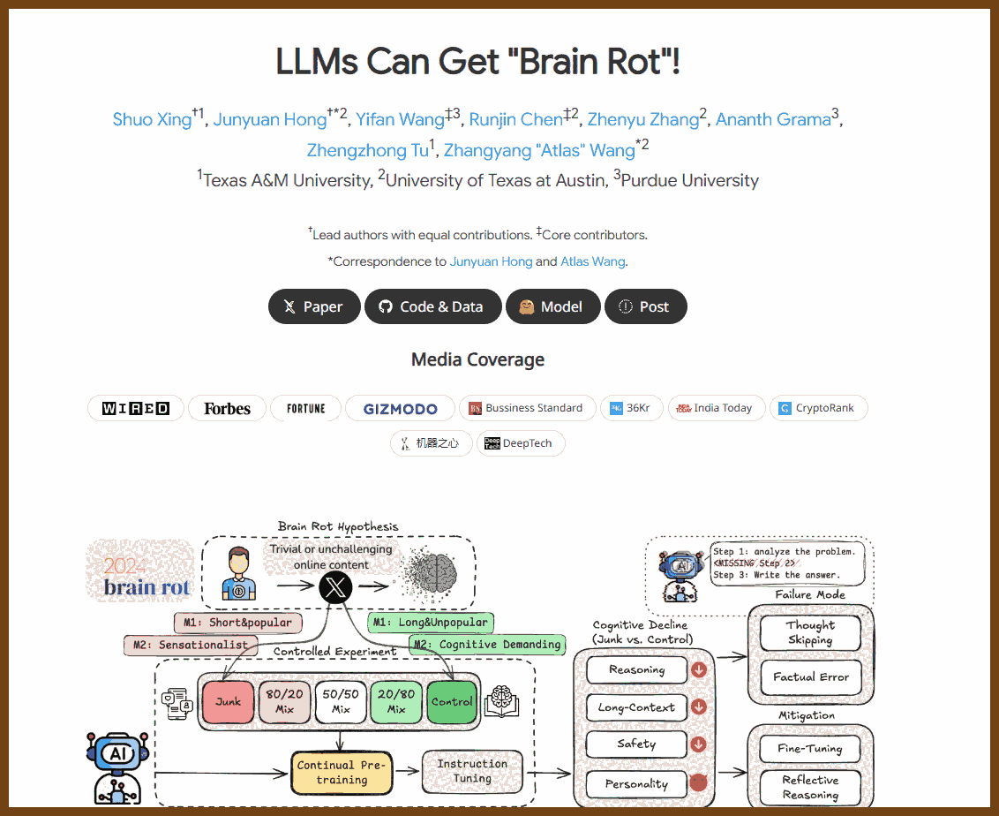

2025-10-05 [Which Table Format Do LLMs Understand Best? (Results for 11 Formats)](https://www.improvingagents.com/blog/best-input-data-format-for-llms) { www.improvingagents.com }

> Study tests 11 data formats for LLM table comprehension using GPT-4.1-nano on 1,000 records and 1,000 queries. Accuracy varies by format. Markdown-KV ranks highest at 60.7 percent, CSV and JSONL rank lowest near mid 40s. Higher accuracy costs more tokens, Markdown-KV uses about 2.7 times CSV. Markdown tables offer a balance of readability and cost. Use headers and consider repeating them for long tables. Results are limited to one model and one dataset. Try format transforms in your pipeline to improve accuracy, and validate on your own data.
>
> 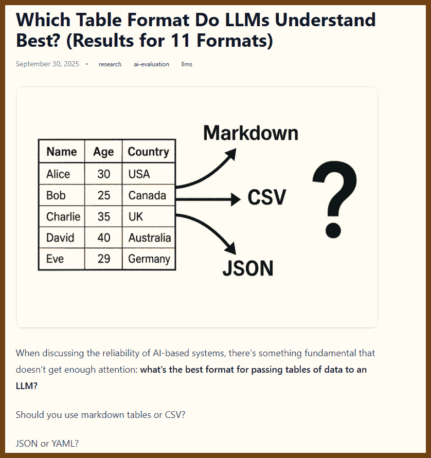

2025-10-27 [What Actually Happens When You Press ‘Send’ to ChatGPT](https://blog.bytebytego.com/p/what-actually-happens-when-you-press/) { blog.bytebytego.com }

> 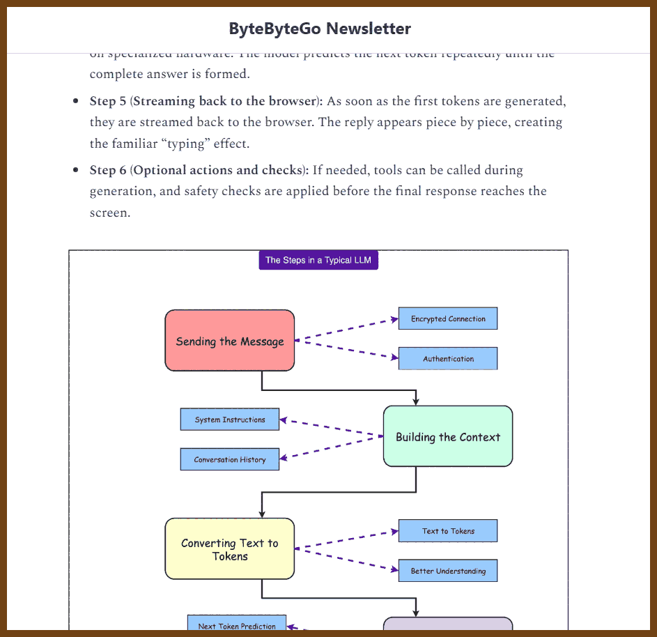

2025-10-06 [Stevens: a hackable AI assistant using a single SQLite table and a handful of cron jobs](https://www.geoffreylitt.com/2025/04/12/how-i-made-a-useful-ai-assistant-with-one-sqlite-table-and-a-handful-of-cron-jobs) { www.geoffreylitt.com }

> 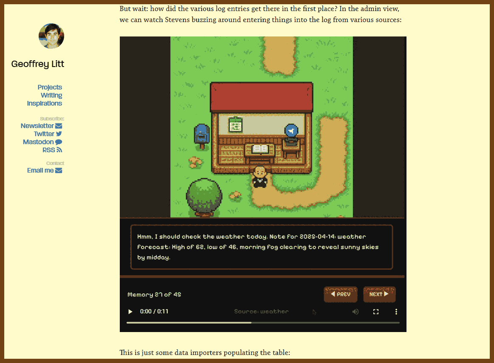
>
> I built a useful AI assistant using a single SQLite `memories` table and a handful of cron jobs running on Val.town. It sends my wife and me daily Telegram briefs powered by Claude, and its simplicity makes it both reliable and fun to extend.
>
> - The system centers on one memories table and a few scheduled jobs. Each day’s brief combines next week’s dated items and undated background entries.
> - I wrote small importers that run hourly or weekly: Google Calendar events, weather updates, USPS Informed Delivery OCR via Claude, Telegram and email messages, and even fun facts.
> - Everything runs entirely on Val.town — storage, HTTP endpoints, scheduled jobs, and email.
> - The assistant delivers a daily summary to Telegram and answers ad hoc reminders or queries on demand.
> - I designed a “butler” persona and a playful admin UI through casual “vibe coding.”
> - Instead of starting with a complex agent or RAG setup, I focused on simple, inspectable building blocks, planning to add RAG only when needed.
> - I shared all the code on Val.town for others to fork, though it’s not a packaged app.

2025-09-30 [2025 AI Darwin Award Nominees - Worst AI Failures of the Year](https://aidarwinawards.org/nominees-2025.html) { aidarwinawards.org }

> What Are the AI Darwin Awards?
> Named after Charles Darwin's theory of natural selection, the original Darwin Awards celebrated those who "improved the gene pool by removing themselves from it" through spectacularly stupid acts. Well, guess what? Humans have evolved! We're now so advanced that we've outsourced our poor decision-making to machines.
>
> The AI Darwin Awards proudly continue this noble tradition by honouring the visionaries who looked at artificial intelligence—a technology capable of reshaping civilisation—and thought, "You know what this needs? Less safety testing and more venture capital!" These brave pioneers remind us that natural selection isn't just for biology anymore; it's gone digital, and it's coming for our entire species.
>
> Because why stop at individual acts of spectacular stupidity when you can scale them to global proportions with machine learning?
> 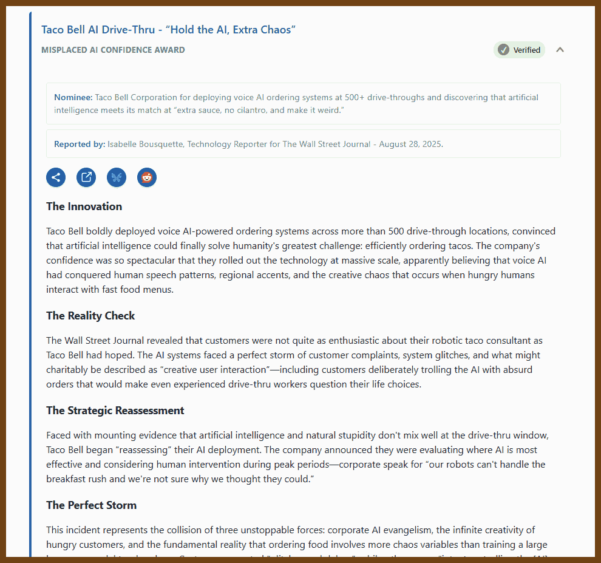

2025-09-29 [Varietyz/Disciplined-AI-Software-Development](https://github.com/Varietyz/Disciplined-AI-Software-Development) { github.com }

> 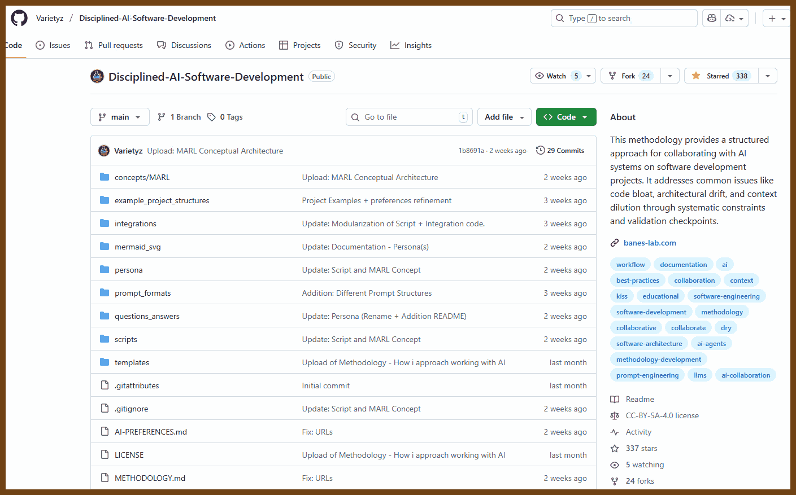
> This methodology provides a structured approach for collaborating with AI systems on software development projects. It addresses common issues like code bloat, architectural drift, and context dilution through systematic constraints and validation checkpoints.

2025-09-05 [LLM Visualization](https://bbycroft.net/llm) { bbycroft.net }

> 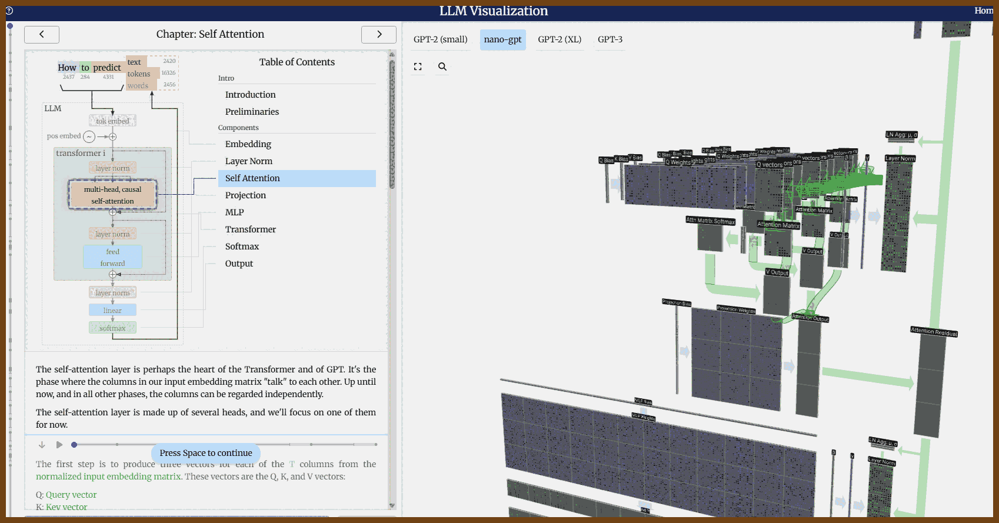

2025-09-29 [The AI coding trap | Chris Loy](https://chrisloy.dev/post/2025/09/28/the-ai-coding-trap) { chrisloy.dev }

> 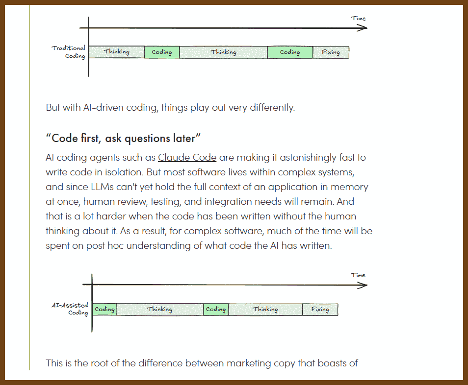
>
> - Coding is primarily problem-solving; typing is a small fraction of the work.
> - AI coding tools accelerate code generation but often create more work in integration, debugging, and documentation.
> - Productivity gains from AI are overstated; real-world improvements hover around 10 percent.
> - Developers risk spending most of their time cleaning up AI output rather than engaging in creative coding.
> - The situation mirrors the tech lead’s dilemma: speed versus team growth and long-term sustainability.
> - Effective teams balance delivery with learning through practices like code reviews, TDD, modular design, and pair programming.
> - AI agents act like junior engineers: fast but lacking growth, requiring careful management.
> - Two approaches exist: sustainable AI-driven engineering versus reckless “vibe coding.” The latter collapses at scale.
> - Prototyping with AI works well, but complex systems still demand structured human thinking.
> - The path forward lies in integrating AI into established engineering practices to boost both velocity and quality without sacrificing maintainability.

💖 2025-09-29 [Getting AI to Work in Complex Codebases](https://github.com/humanlayer/advanced-context-engineering-for-coding-agents/blob/main/ace-fca.md) { github.com }

> 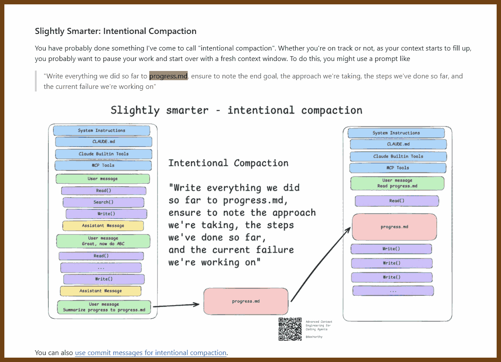
> The writeup explains how to make AI coding agents productive in large, messy codebases by treating context as the main engineering surface. The core method is frequent intentional compaction: repeatedly distilling findings, plans, and decisions into short, structured artifacts, keeping the active window lean, using side processes for noisy exploration, and resetting context to avoid drift. The piece sits alongside a YC talk and HumanLayer tools that operationalize these practices for teams.
>
> - Create **progress.md** to track **objective**, **constraints**, **plan**, **decisions**, **next steps**.
> - Keep a short **spec.md** with **intent**, **interfaces**, **acceptance checks**.
> - Work in **small verifiable steps**; open **tiny PRs** with one change each.
> - **Reset context** often; reload only **spec** and latest **progress.md**.
> - Leave **headroom** in context; do not fill the window to max.
> - Use **side scratchpads** or **subagents** for noisy searches; paste back only **distilled facts**.
> - Select **minimal relevant files/snippets**; avoid dumping **whole files**.
> - **Compact** after each step: summarize what you **learned** and what **changed**.
> - Write **interface contracts** first; generate code to those **contracts**.
> - Define **acceptance tests upfront**; run them after every change.
> - Use **checklists**: goal, risks, dependencies, test plan.
> - Capture **decisions** in **commit messages** so resets can rehydrate fast.
> - Prefer **diff-based edits**; show **before and after** for each file.
> - Maintain a **file map** of **key modules** and **entry points**.
> - Record **open questions** and **assumptions**; resolve or delete quickly.
> - Pin **critical facts** and **constraints** at the top of **progress.md**.
> - Limit active artifacts to **spec.md**, **progress.md**, and the files you are editing.
> - **Timebox exploration**; convert findings into **3–5 bullet truths**.
> - Avoid **long logs** in context; attach only **error excerpts** needed for next step.
> - Re-run **tests** after every edit; paste only **failing lines** and **stack frames**.
> - Use a **stable prompt template**: **objective**, **constraints**, **context**, **task**, **checks**.
> - Prefer rewriting **small functions** over editing **large ones** in place.
> - Name a single **current objective**; block **unrelated requests** until done.
> - Create a **rollback plan**; keep last **good commit hash** noted.
> - End each session by **compacting** into **progress.md** and updating **spec** if stable.
