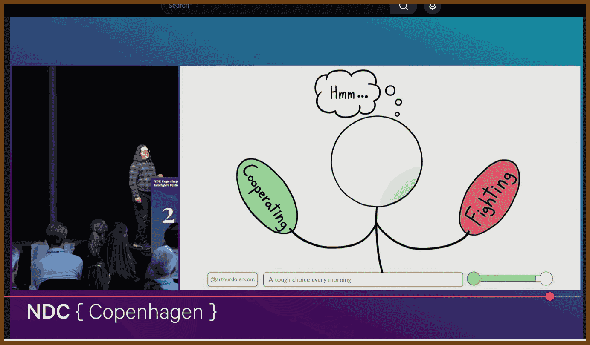

---
layout: post
title:  "Links from my inbox 2025-11-02"
date:   2025-11-02T00:53:00-07:00
categories: links
---

## ⌚ Nice watch!

2025-11-02 [How To Not Strangle Your Coworkers: Resolving Conflict with Collaboration - Arthur Doler - YouTube](https://www.youtube.com/watch?v=Te7kE8WfGzc&t=2544s) { www.youtube.com }

> 
>
> ---
>
> **What counts as conflict, and why it matters.** Disagreement becomes conflict when the issue feels important, you are interdependent, and both sides think the evidence favors them.
>
> **Three kinds of conflict.**
>
> - *Task conflict* (what to do, how to build) is good fuel for better solutions.
> - *Process conflict* (who decides, how we work) helps early, turns toxic if it persists.
> - *Relationship conflict* (who we work with, power plays) is corrosive and should be minimized.
>
> **Where conflict lives.** It appears inside teams and between teams, especially with fuzzy ownership or misaligned priorities.
>
> **Two conflict mindsets (and the traps)**
>
> - **Model 1 (win-lose).** Tries to control others’ emotions and “win” the exchange. Produces:
>   - *Self-fulfilling prophecies:* your beliefs provoke the behavior you expected.
>   - *Self-sealing processes:* your beliefs block the very conversation that could change them.
> - **Model 2 (win-win).** Aims for outcomes both sides can accept, accepts emotions as data, avoids self-sealing by talking openly.
> - **Avoid Model 1 moves.** Don’t swat opinions or moralize (“you’re wrong/bad”); it escalates and locks the trap.
>
> **Sound receptive on purpose: the HEAR method**
>
> - **Hedging.** Use softeners like “perhaps,” “sometimes,” “maybe” to keep doors open.
> - **Emphasize agreement.** State shared premises before you differ.
> - **Acknowledge.** Paraphrase their point so they feel understood.
> - **Reframe to the positive.** Prefer “It helps me when I can complete my point.” over “I hate being interrupted.”
>
> **Confrontational styles**
>
> - **Avoiding, yielding, fighting, cooperating, conciliating.**
>   - Styles shift with context, status, and emotion.
>   - Cooperating aligns with Model 2.
>   - Conciliating mixes styles and can look like mid-conversation switching.
> - **Use this awareness.** Infer goals, adjust your approach, and decide when to continue, pause, or withdraw.
>
> [Conflict-handling Avoiding Competing Accommodating Compromising Collaborating](https://dmytro.zharii.com/thoughts/Conflict-handling%20Avoiding%20Competing%20Accommodating%20Compromising%20Collaborating.html) { dmytro.zharii.com }
>
> > In conflict situations, individuals often exhibit different **behavioral strategies** based on their approach to managing disagreements. Avoiding is one strategy, and here are four others, alongside avoiding, commonly identified within conflict management models like the **Thomas-Kilmann Conflict Mode Instrument (TKI):**
> >
> > **Avoiding**
> >
> > - **Behavior:** The individual sidesteps or withdraws from the conflict, neither pursuing their own concerns nor those of the other party.
> > - **When it's useful:** When the conflict is trivial, emotions are too high for constructive dialogue, or more time is needed to gather information.
> > - **Risk:** Prolonging the issue may lead to unresolved tensions or escalation.
> >
> > **Competing**
> >
> > - **Behavior:** The individual seeks to win the conflict by asserting their own position, often at the expense of the other party.
> > - **When it's useful:** When quick, decisive action is needed (e.g., in emergencies) or in matters of principle.
> > - **Risk:** Can damage relationships and lead to resentment if overused or applied inappropriately.
> >
> > **Accommodating**
> >
> > - **Behavior:** The individual prioritizes the concerns of the other party over their own, often sacrificing their own needs to maintain harmony.
> > - **When it's useful:** To preserve relationships, resolve minor issues quickly, or demonstrate goodwill.
> > - **Risk:** May lead to feelings of frustration or being undervalued if used excessively.
> >
> > **Compromising**
> >
> > - **Behavior:** Both parties make concessions to reach a mutually acceptable solution, often splitting the difference.
> > - **When it's useful:** When a quick resolution is needed and both parties are willing to make sacrifices.
> > - **Risk:** May result in a suboptimal solution where neither party is fully satisfied.
> >
> > **Collaborating**
> >
> > - **Behavior:** The individual works with the other party to find a win-win solution that fully satisfies the needs of both.
> > - **When it's useful:** When the issue is important to both parties and requires creative problem-solving to achieve the best outcome.
> > - **Risk:** Requires time and effort, which may not always be feasible in time-sensitive situations.
>
> **Self-fulfilling prophecies and Self-sealing processes**
>
> **Self-fulfilling prophecies** start as hunches and end as evidence. You label a teammate “unreliable,” so you stop looping them in early and keep updates tight to your chest. They hear about changes late, respond late, and your label hardens. You brace for a “hostile” stakeholder, arrive with a defensive deck and no questions, and they bristle at being steamrolled. You decide your junior “isn’t ready,” so you never give them stretch work; months later they still lack reps and look, to your eye, not ready. In each case the belief choreographs micro-moves -- who you cc, when you invite, how you ask -- that nudge the other person toward the very behavior you expected.
>
> Breaking the spell is less grand than it sounds. Treat the belief as a hypothesis, not a verdict. Make one small change that would disconfirm it: add the “unreliable” teammate to the kickoff and define a clear, narrow success; open the “hostile” meeting with a shared goal and one genuine question; give the junior a contained, visible challenge with support and a check-in. When new behavior shows up, write it down. If you do not capture counter-evidence, your story erases it.
>
> **Self-sealing processes** are trickier. Here the belief blocks the only conversation that could revise the belief. A manager thinks, “If I give direct feedback, they’ll blow up,” so they route around the issue with busywork and praise. The developer senses the dodge, digs in, and the manager sighs, “See? Impossible.” Engineering mutters, “Design never listens,” so they bring finished solutions, not problems. Design, excluded from shaping the brief, critiques what it can, the surface, and everyone leaves resentful, certain they were right. Product insists “Ops will block this,” skips early review, then hits a late veto. The loop seals itself because the corrective talk never happens.
>
> Unsealing it means naming the cost of avoidance and asking for a bounded, specific conversation with a shared purpose. “We keep learning about scope changes after handoff. It’s creating rework. Can we spend ten minutes on a pre-handoff check so we catch this earlier?” Keep the frame neutral: what happened, the impact, the request, and invite correction: “What am I missing?” If they can edit your story, the seal is already cracking.
>
> The difference is simple: prophecies **steer** people into your expectation; sealing **blocks** the talk that could change it. In both cases, curiosity plus one small, testable change is usually enough to bend the plot.

2025-10-18 [5 Office Politics Rules That Get Managers Promoted - YouTube](https://www.youtube.com/watch?v=uqgEruWF-fU) { www.youtube.com }

> 
>
> You do the work, you hit your numbers, yet the promotion goes to someone who smiles wider and says less. I learned the hard way, twice passed over, until I stopped assuming merit speaks and started speaking the language of power. Here is the short version, straight and useful.
>
> At the office, never outshine the bride at her own wedding. Translation: **Never outshine the master.** If your excellence makes your boss feel replaceable, your growth stalls. A Harvard study found that managers who align with their boss’s goals are **31% more promotable** than peers who focus only on their own performance. Use the **3S Formula**: **Spotlight up** (frame updates in your boss’s KPIs), **Share credit** (“This direction came from my manager”), and **Strategic support** (ask, “What is one thing I can take off your plate this month?”). This is not brown-nosing, it is showing you are on the same team.
>
> Ambition is flammable. **Conceal your intentions.** Use the **Ambition Pyramid**: the bottom layer, most people, gets nothing but results; the middle, your boss and peers, gets today’s impact, not tomorrow’s titles; the tip, mentors, sponsors, and decision makers, gets the real plan because they can pull you up, not push you out. Remember Eduardo Saverin at early Facebook: oversharing ambitions created a rival power center, then his shares were diluted and he was pushed aside.
>
> Your work is what you do; your **reputation** is what they remember. **Guard it with your life.** Define **one line** you want to shrink to, keep your word by under-promising and over-delivering, and stay out of gossip. Invest that energy in one ally who will defend you when you are not in the room.
>
> Impact invisible is impact ignored. **Court attention at all costs.** Run the **10x Funnel**: cut or delegate **–10x busywork** (inboxes, admin, overhelping), downplay **2x tweaks** (necessary, forgettable), and **spotlight 10x wins** (new clients, major savings, strategic projects). This week: list and cut a –10x task, drop one 2x item from your update, and make sure the people responsible for promotions see one 10x result.
>
> People promote the person who already feels like the job. **Act like a king to be treated like one.** Build presence with the **3Ps**: **Presence** (sit tall, project your voice, cut filler, record yourself once), **Point** (enter each meeting with one clear strategic point, say it, then stop), **Positioning** (speak in outcomes, not tasks: “We drove 8% growth,” not “We finished the project”). Confidence, clarity, and composure signal readiness.
>
> Play fair if you like; play smart if you want the title. Quick checklist for this week: spotlight up, share credit, take something off your boss’s plate, share plans only upward, define your one-line, keep one promise small and solid, avoid gossip and build one ally, cut a –10x task, drop one 2x, broadcast one 10x, and bring one sharp point and outcome language to every room. And one last trap the transcript flags: protecting your employees can backfire if it hides your results. Do not hide behind the team, scale them and make the impact visible.

> 2025-10-08 [Answering behavioral interview questions is shockingly uncomplicated - YouTube](https://www.youtube.com/watch?v=WdyiUe7_3cA) { www.youtube.com }
>
> 
> ---
>
> **Big idea**
> Every behavioral question is a proxy test for a small set of core qualities. Map the question to the quality, tell a tight story using STAR, and land a crisp takeaway you learned.
>
> **The 5 qualities employers keep probing**
>
> 1. Leadership or Initiative. Not just titles. Do you take the lead without being asked.
> 2. Resilience. How you respond to setbacks and failure.
> 3. Teamwork. How you operate with and across people.
> 4. Influence. How you persuade peers and leaders, especially senior to you.
> 5. Integrity. What you do when the right choice is hard or awkward.
>
> **How the questions get asked, with quick answer hints**
>
> 1. Leadership or Initiative:
>    - Phrasings: Tell me about a time you led. Tell me about a time you took initiative. Tell me about taking the lead without formal authority.
>    - Hint: Show a moment you noticed a gap, acted without waiting, rallied others, and created a result.
> 2. Resilience:
>    - Phrasings: Tell me about a failure. Tell me about a tough challenge. Tell me about your proudest accomplishment and what it took.
>    - Hint: Spend more time on the climb than the summit. What went wrong, what you changed, how you bounced back.
> 3. Teamwork:
>    - Phrasings: Tell me about working in a team. Tell me about bringing together people you did not know or with different backgrounds.
>    - Hint: Name the goal, the mix of people, the friction points, and how you enabled collaboration.
> 4. Influence:
>    - Phrasings: Tell me about persuading someone. Tell me about convincing someone more senior who disagreed.
>    - Hint: Show your evidence, empathy, and escalation path. Data plus listening beats volume.
> 5. Integrity:
>    - Phrasings: Tell me about an ethical dilemma. Tell me about seeing something off at work.
>    - Hint: Show judgment, discretion, and action. Neither tattletale nor blind eye.
>
> **Prep system the author uses**
>
> 1. Brain dump:
>    - Open a doc and list every personal and professional experience that could reflect the 5 qualities. Small stories count. Do not filter yet.
> 2. Craft your arsenal with STAR:
>    - Situation in 1 to 2 lines. Task in 1 line. Action in crisp verbs. Result in facts. Then add one line: What I learned was X.
> 3. Practice delivery the right way:
>    - Use bullets, not scripts. Force fluid speech.
>    - Record yourself on video. Watch for filler words, eye contact, pacing.
>    - Prefer pauses over fillers. Pauses feel longer to you than to them.
>
> **Storytelling rules that separate you**
>
> 1. Show, do not tell. Replace "I felt upset" with the visceral beat: "My first thought was, boy am I screwed."
> 2. Build a single flowing narrative. No blocky transitions. Make STAR feel like a story, not sections.
> 3. Have at least 2 stories per quality. Many stories cover multiple qualities, but do not burn your only one twice.
>
> **Example snapshots you can mirror**
>
> 1. Influence senior leader, data first:
>    - S: Team used PitchBook, MD wanted to cancel due to cost.
>    - T: Prove value.
>    - A: Surveyed analysts, aggregated time saved and workflows unblocked, presented results.
>    - R: Subscription renewed. Learned: bring data and do your own digging before making the case.
> 2. Resilience via instrument switch:
>    - S: Missed top orchestra on violin senior year.
>    - T: Earn a second shot.
>    - A: Took viola offer, hired teacher, practiced hard all summer.
>    - R: Made the tour, 5 cities in Norway. Learned: treat setbacks as pivots, keep an open mind for serendipity.
> 3. Integrity on the floor:
>    - S: UPS coworker gaming punch times.
>    - T: Decide whether to raise it.
>    - A: Sought advice, raised discreetly, asked for no punitive outcome.
>    - R: System improved, no one fired. Learned: character shows in small, unseen choices.
>
> **Fast checklist before your next interview**
>
> 1. For each quality, pick 2 stories, bullet them with 4 to 6 beats.
> 2. Rehearse out loud from bullets only. Record and review twice.
> 3. In the room, map the question to the quality before speaking.
> 4. Tell the story, then say the line: What I learned from that experience was X.
> 5. Keep it tight. 60 to 120 seconds per answer unless probed.

2025-10-14 [Never Send These 4 Emails at Work (Lawyer's Warning) - YouTube](https://www.youtube.com/watch?v=OMxECUy2IZ8) { www.youtube.com }

> 
>
> Ed Hones, an employment lawyer explains four common email mistakes that cost people their jobs and what to do instead. The talk focuses on how routine workplace emails can create legal exposure when they seem harmless.
>
> **Key points:**
>
> - **Complaining about your boss**: Unless you connect your complaint to a *protected activity* like discrimination or harassment, your email gives you no legal protection.
> - **Emotional replies to performance reviews**: Don’t argue or vent. Acknowledge any fair criticism and calmly correct inaccuracies with evidence.
> - **Vague health updates**: Saying “I’m dealing with anxiety” or “not feeling well” gives no legal notice. State that it’s a diagnosed medical condition to trigger legal protections.
> - **Personal or job-search emails from work**: Your employer owns the system and can read everything. Using it for personal messages or job hunting gives them cause to fire you legally.
>
> **Bottom line:**
>  Stay factual, calm, and specific. Make protected complaints in writing, and never assume work email is private.
