---
layout: post
title:  "Links from my inbox 2025-11-24"
date:   2025-11-24T23:10:00-08:00
categories: links
---


## SQLite

2025-10-06 [SQLite File Format Viewer](https://sqlite-internal.pages.dev/#) { sqlite-internal.pages.dev }

> SQLite File Format Viewer
> This tool helps you explore the SQLite file format internals according to the official specification. It's designed for developers and database enthusiasts who want to understand the internal structure of SQLite database files.
>
> [invisal/sqlite-internal: Playaround with SQLite internal](https://github.com/invisal/sqlite-internal) { github.com }
>
> 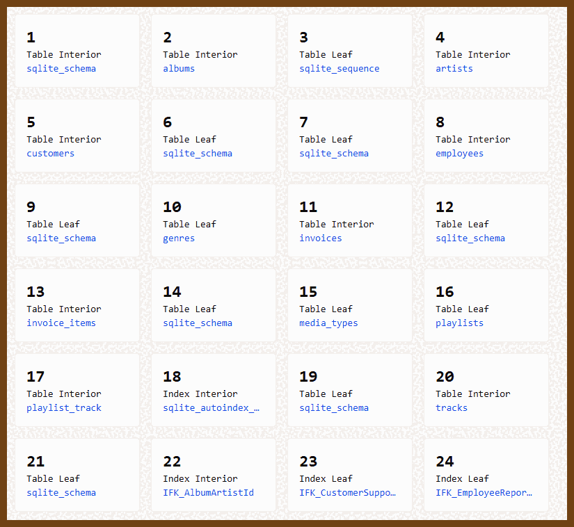
> 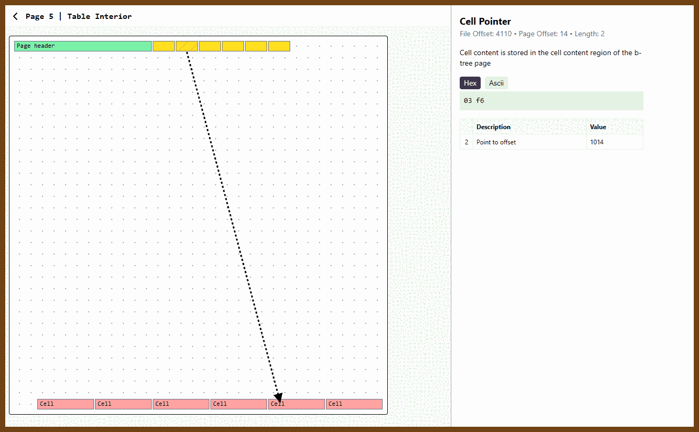

2025-10-06 [Download HeidiSQL](https://www.heidisql.com/download.php) { www.heidisql.com }

> 

2025-10-06 [How bloom filters made SQLite 10x faster - blag](https://avi.im/blag/2024/sqlite-past-present-future/) { avi.im }

> That’s what the researchers did! They used a Bloom filter, which is very space efficient and fits in a CPU cache line. It was also easy to implement.
>
> They added two opcodes: `Filter` and `FilterAdd`. At the start of the join operation, we go over all the rows of dimension tables and set the bits in the Bloom filter which match the query predicate. The opcode is `FilterAdd`.
>
> During the join operation, we first check if the row exists in the Bloom filter at each stage. If it does, then we do the B-tree probe. This is the `Filter` opcode.

2025-10-06 [SQLiteStudio](https://sqlitestudio.pl/) { sqlitestudio.pl }

> 

## .NET

2025-07-14 [Rejigs: Making Regular Expressions Human-Readable | by Omar | Jul, 2025 | Medium](https://medium.com/@omarzawahry/rejigs-making-regular-expressions-human-readable-1fad37cb3eae) { medium.com }

```
^[a-zA-Z0-9._%+-]+@[a-zA-Z0-9.-]+\.[a-zA-Z]{2,}$
```

```csharp
var emailRegex = 
    Rejigs.Create()
          .AtStart()
          .OneOrMore(r => r.AnyLetterOrDigit().Or().AnyOf("._%+-"))
          .Text("@")
          .OneOrMore(r => r.AnyLetterOrDigit().Or().AnyOf(".-"))
          .Text(".")
          .AnyLetterOrDigit().AtLeast(2)
          .AtEnd()
          .Build();
```

Nice! The improved version at the top looks very concise and clean! 💖 :D


## C || C++

2025-11-15 [Reallocate memory | Field Guide](https://programmers.guide/book/part-2-organised-code/6-deep-dive-memory/2-trailside/03-4-realloc/) { programmers.guide }

> 
>
> 

2025-11-05 [zserge/grayskull: A tiny, dependency-free computer vision library in C for embedded systems, drones, and robotics.](https://github.com/zserge/grayskull) { github.com }

> **🏰 Grayskull**
>
> Grayskull is a minimalist, dependency-free computer vision library designed for microcontrollers and other resource-constrained devices. It focuses on **grayscale** images and provides modern, practical algorithms that fit in a few kilobytes of code. Single-header design, integer-based operations, pure C99.
>
> **Features**
>
> - Image operations: copy, crop, resize (bilinear), downsample
> - Filtering: blur, Sobel edges, thresholding (global, Otsu, adaptive)
> - Morphology: erosion, dilation
> - Geometry: connected components, perspective warp
> - Features: FAST/ORB keypoints and descriptors (object tracking)
> - Local binary patterns: LBP cascades to detect faces, vehicles etc
> - Utilities: PGM read/write

2025-11-05 [By the power of grayscale!](https://zserge.com/posts/grayskull/) { zserge.com }

> When people talk about computer vision, they usually think of OpenCV or deep neural networks like YOLO. But in most cases, doing computer vision implies understanding of the core algorithms, so you can use or adapt them for your own needs.
>
> I wanted to see how far I could go by stripping computer vision down to the bare minimum: only grayscale 8-bit images, no fancy data structures, plain old C, some byte arrays and a single header file. After all, an image is just a rectangle of numbers, right?
>
> This post is a guided tour through the algorithms behind Grayskull – a minimal computer vision library designed for resource-constrained devices.
>
> 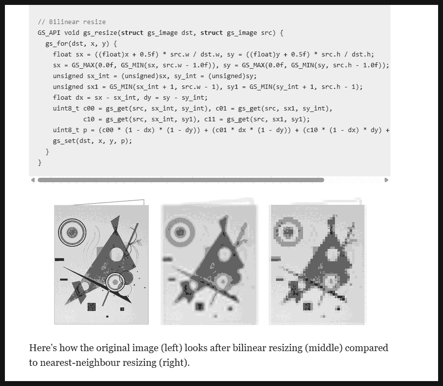

2025-11-02 [Notes by djb on using Fil-C (2025)](https://cr.yp.to/2025/fil-c.html) { cr.yp.to }

> I'm impressed with the level of compatibility of the new memory-safe C/C++ compiler [Fil-C](https://fil-c.org/) (filcc, fil++). Many libraries and applications that I've tried work under Fil-C without changes, and the exceptions haven't been hard to get working.
>
> I've started accumulating miscellaneous notes on this page regarding usage of Fil-C. My selfish objective here is to protect various machines that I manage by switching them over to code compiled with Fil-C, but maybe you'll find something useful here too.
>
> Timings below are from a mini-PC named `phoenix` except where otherwise mentioned. This mini-PC has a 6-core (12-thread) AMD Ryzen 5 7640HS (Zen 4) CPU, 12GB RAM, and 36GB swap. The OS is Debian 13. (I normally run LTS software, periodically upgrading from software that's 4–5 years old such as Debian 11 today to software that's 2–3 years old such as Debian 12 today; but some of the packages included in Fil-C expect newer utilities to be available.)
>
> Related:
>
> - I've posted a [script](https://cr.yp.to/2025/filc-diffs-20251027.sh) to help auditors see how Fil-C differs from upstream sources (clang, glibc, ...).
> - I've posted a self-contained [`filian-install-compiler`](https://cr.yp.to/2025/20251030-filian-install-compiler.sh) script (replacing the [20251029 version](https://cr.yp.to/2025/20251029-filian-install-compiler.sh)) to download+compile+install Fil-C on Debian 13 in what I think are Debian-appropriate locations, along with glibc and binutils compiled with Fil-C. A run took 86 minutes real time (for 477 minutes user time and 52 minutes system time).
> - I've posted the start of a [`filian-install-packages`](https://cr.yp.to/2025/20251030-filian-install-packages.sh) script to download+compile+install Debian source packages, using Fil-C as the compiler (after `filian-install-compiler` has finished). This script has various limitations that need fixing, but it does work for a few packages already (e.g., `./filian-install-packages bzip2`), after the installation of `dh-exec` etc. described below.
> - I've posted a [graph](https://cr.yp.to/2025/20251028-filcc-vs-clang.html) showing nearly 9000 microbenchmarks of Fil-C vs. clang on cryptographic software (each run pinned to 1 core on the same Zen 4). Typically code compiled with Fil-C takes between 1x and 4x as many cycles as the same code compiled with clang.

2025-11-02 [FreeDOS Books](https://www.freedos.org/books/cprogramming/) { www.freedos.org }

> 
>
> Teach yourself how to write programs with the C programming language. We'll start with simple command line programs, and work our way up to writing a turn-based game.
>
> - [Part 1. Let’s Learn Coding](https://www.freedos.org/books/cprogramming/part1/) (general overview)
> - [Part 2. Introduction to C Programming](https://www.freedos.org/books/cprogramming/part2/) (`#include`, `#define`, `main()`, data types, operators, … and more)
> - [Part 3. Flow Control](https://www.freedos.org/books/cprogramming/part3/) (flow control and loops)
> - [Part 4. Functions](https://www.freedos.org/books/cprogramming/part4/) (user-defined, standard library, and recursion)
> - [Part 5. Arrays](https://www.freedos.org/books/cprogramming/part5/) (fixed-size arrays, pointers, variable-sized arrays)
> - [Part 6. Files](https://www.freedos.org/books/cprogramming/part6/) (reading and writing files)
> - [Part 7. Advanced Programming](https://www.freedos.org/books/cprogramming/part7/) (realloc and getline)
> - [Part 7½. Advanced Programming](https://www.freedos.org/books/cprogramming/part7.5/) (binary, iteration shorthands, …)
> - [Part 8. Console Programming](https://www.freedos.org/books/cprogramming/part8/) (conio)
> - [Part 9. Putting it Together](https://www.freedos.org/books/cprogramming/part9/) (writing a turn-based game)
> - [Bonus Programming Videos](https://www.freedos.org/books/cprogramming/bonus/)

2025-10-18 [EbookFoundation/free-programming-books: :books: Freely available programming books](https://github.com/EbookFoundation/free-programming-books/tree/main) { github.com }

> https://ebookfoundation.github.io/free-programming-books/
>
> 
>
> ### C
>
> - [256-Color VGA Programming in C](http://www.brackeen.com/vga/) - David Brackeen
> - [A Tutorial on Pointers and Arrays in C](https://web.archive.org/web/20180827131006/http://home.earthlink.net/~momotuk/pointers.pdf) - Ted Jensen (PDF) *( 🗃️ archived)*
> - [Algorithms Design (in C)](https://www.ime.usp.br/~pf/algorithms/) - Paulo Feofiloff (HTML)
> - [Bare-metal programming for ARM](https://github.com/umanovskis/baremetal-arm) - Daniels Umanovskis [(PDF)](http://umanovskis.se/files/arm-baremetal-ebook.pdf)
> - [Beej's Guide to C Programming](http://beej.us/guide/bgc/) - Brian "Beej Jorgensen" Hall (HTML, PDF) (CC BY-NC-ND)
> - [Beej's Guide to the GNU Debugger (GDB)](http://beej.us/guide/bggdb/) - Brian "Beej Jorgensen" Hall (HTML) (CC BY-NC-ND)
> - [Build Your Own Lisp](http://www.buildyourownlisp.com/) - Daniel Holden
> - [Build Your Own Redis with C/C++](https://build-your-own.org/) - build-your-own.org (HTML) ( 🚧 *in process*)
> - [C Elements of Style](http://www.oualline.com/books.free/style/) - Steve Oualline
> - [C for Python Programmers](http://www.cburch.com/books/cpy/) - Carl Burch
> - [C Handbook](https://thevalleyofcode.com/c/) - Flavio Copes (HTML, PDF)
> - [C Internals](https://www.avabodh.com/cin/cin.html) - Rajeev Kumar (HTML)
> - [C Notes for Professionals](https://goalkicker.com/CBook) - Compiled from StackOverflow Documentation (PDF)
> - [C Programming](https://en.wikibooks.org/wiki/Programming%3AC) - Wikibooks
> - [C Programming Boot Camp - Paul Gribble](https://gribblelab.org/teaching/CBootCamp/)
> - [C Programming Tutorial](https://www.tutorialspoint.com/cprogramming/) - Tutorials Point (HTML, PDF)
> - [Coursebook](https://github.com/illinois-cs241/coursebook) - B. Venkatesh, L. Angrave, et al.
> - [Deep C](http://www.slideshare.net/olvemaudal/deep-c)
> - [Essential C](http://cslibrary.stanford.edu/101/EssentialC.pdf) - Nick Parlante (PDF)
> - [Essential C](https://www.programming-books.io/essential/c/) - Krzysztof Kowalczyk, StackOverflow Contributors
> - [Everything you need to know about pointers in C - Peter Hosey](http://boredzo.org/pointers/)
> - [Functional C (1997)](https://research.utwente.nl/files/5128727/book.pdf) - Pieter H. Hartel, Henk Muller (PDF)
> - [Hashing](https://www.smashwords.com/books/view/737188) - Prakash Hegade
> - [Introduction to Programming and Data Structures in C](https://codeahoy.com/learn/cprogramming/toc/) - CodeAhoy (HTML)
> - [Learn to Code With C - The MagPi Essentials](https://magpi.raspberrypi.com/books/essentials-c-v1) (PDF)
> - [Learning GNU C](https://download-mirror.savannah.gnu.org/releases/c-prog-book/learning_gnu_c.pdf) - Ciaran O’Riordan (PDF)
> - [Let us C](https://books.google.co.in/books?id=Ce6gAAAACAAJ&printsec=frontcover#v=onepage&q&f=false) - Yashavant Kanetkar (PDF)
> - [Modeling with Data](https://ben.klemens.org/pdfs/gsl_stats.pdf) - Ben Klemens (PDF)
> - [Modern C](https://gustedt.gitlabpages.inria.fr/modern-c/) - Jens Gustedt (PDF) (CC BY-NC-ND)
> - [Object-Oriented Programming With ANSI-C](https://www.cs.rit.edu/~ats/books/ooc.pdf) - Axel-Tobias Schreiner (PDF)
> - [Programming in C](http://ee.hawaii.edu/~tep/EE160/Book/PDF/) - Bharat Kinariwala & Tep Dobry
> - [Programming in C](https://www.freetechbooks.com/programming-in-c-t1337.html) - Kishori Mundargi
> - [Structures and C](https://www.smashwords.com/books/view/644937) - Prakash Hegade
> - [The Basics of C Programming](https://www.phys.uconn.edu/~rozman/Courses/P2200_13F/downloads/TheBasicsofCProgramming-draft-20131030.pdf) - Marshall Brain (PDF)
> - [The C book](http://publications.gbdirect.co.uk/c_book/) - Mike Banahan, Declan Brady, Mark Doran (PDF, HTML)
> - [The C Programming Language Handbook](https://flaviocopes.com/page/c-handbook/) - Flavio Copes (PDF, EPUB, Kindle) *(email address requested)*
> - [The Current C Programming Language Standard – ISO/IEC 9899:2018 (C17/C18), Draft](https://web.archive.org/web/20181230041359/http://www.open-std.org/jtc1/sc22/wg14/www/abq/c17_updated_proposed_fdis.pdf) - Open Standards Org - [www.open-std.org](http://www.open-std.org/) (PDF) *( 🗃️ archived)*
> - [The GNU C Programming Tutorial](http://www.crasseux.com/books/ctut.pdf) - Mark Burgess, Ron Hale-Evans (PDF)
> - [The GNU C Reference Manual](https://www.gnu.org/software/gnu-c-manual/gnu-c-manual.html) - Trevis Rothwell, James Youngman (HTML) [(PDF)](https://www.gnu.org/software/gnu-c-manual/gnu-c-manual.pdf)
> - [The little book about OS development](http://littleosbook.github.io/) - Erik Helin, Adam Renberg
> - [The New C Standard - An Economic and Cultural commentary (2009)](http://www.knosof.co.uk/cbook/cbook.html) - Derek M. Jones (PDF)
> - [TONC GBA Programming - Game Boy Advance Development](http://www.coranac.com/tonc/text/toc.htm)
>
> ### C++
>
> - [A Complete Guide to Standard C++ Algorithms](https://github.com/HappyCerberus/book-cpp-algorithms) - Šimon Tóth (PDF, LaTeX) (CC BY-NC-SA) *( 🚧 in process)*
> - [A Modular Structured Approach using C++](https://open.umn.edu/opentextbooks/textbooks/144) - Kenneth Leroy Busbee (PDF) (CC BY)
> - [An Introduction to the USA Computing Olympiad, C++ Edition](https://darrenyao.com/usacobook/cpp.pdf) - Darren Yao (PDF)
> - [C++ Annotations](https://fbb-git.gitlab.io/cppannotations/) - Frank B. Brokken (HTML, PDF)
> - [C++ Coding Standard](https://possibility.com/Cpp/CppCodingStandard.html) - Todd Hoff (HTML, PDF)
> - [C++ Core Guidelines](https://github.com/isocpp/CppCoreGuidelines/blob/master/CppCoreGuidelines.md) - `edt.:` Bjarne Stroustrup, Herb Sutter
> - [C++ For Programmers](https://tfetimes.com/wp-content/uploads/2015/04/c-for-c-programmers.pdf) - JT Kalnay (PDF)
> - [C++ GUI Programming With Qt 3](https://ptgmedia.pearsoncmg.com/images/0131240722/downloads/blanchette_book.pdf) - Jasmin Blanchette, Mark Summerfield (PDF)
> - [C++ Language](http://www.cplusplus.com/doc/tutorial/) (HTML)
> - [C++ Notes for Professionals](https://goalkicker.com/CPlusPlusBook) - Compiled from StackOverflow Documentation (PDF) (CC BY-SA)
> - [C++ Programming](https://en.wikibooks.org/wiki/C%2B%2B_Programming) - Panic, et al.
> - [C++ Programming: Code patterns design](https://en.wikibooks.org/wiki/C%2B%2B_Programming/Code/Design_Patterns) - WikiBooks (HTML)
> - [C++ Succinctly, Syncfusion](https://www.syncfusion.com/resources/techportal/ebooks/cplusplus) (PDF, Kindle) (email address *requested*, not required)
> - [C++ Tricks](http://www.bordoon.com/cplusplus/book_wrapper.html)
> - [C++ Tutorial](https://www.cprogramming.com/tutorial/c++-tutorial.html) - Alex Allain
> - [CS106X Programming Abstractions in C++](http://web.stanford.edu/class/cs106x/)
> - [Elements of Programming](http://elementsofprogramming.com/) - Alexander Stepanov, Paul McJones (PDF)
> - [Essential C++](https://www.programming-books.io/essential/cpp/) - Krzysztof Kowalczyk, StackOverflow Contributors (CC BY-SA)
> - [Financial Numerical Recipes in C++](https://ba-odegaard.no/gcc_prog/recipes/) - Bernt Arne Ødegaard (PDF)
> - [Fundamentals of C++ Programming](https://web.archive.org/web/20191005170118/https://python.cs.southern.edu/cppbook/progcpp.pdf) - Richard L. Halterman (PDF) *( 🗃️ archived)*
> - [Game Programming Patterns](http://gameprogrammingpatterns.com/contents.html) (HTML)
> - [Google's C++ Style Guide](https://google.github.io/styleguide/cppguide.html)
> - [Hands-On System Programming with C++](https://www.packtpub.com/free-ebook/hands-on-system-programming-with-c/9781789137880) - Rian Quinn (Packt account *required*)
> - [How to make an Operating System](https://samypesse.gitbook.io/how-to-create-an-operating-system/) - Samy Pesse
> - [How To Think Like a Computer Scientist: C++ Version](http://greenteapress.com/thinkcpp/index.html) - Allen B. Downey
> - [Introduction to Design Patterns in C++ with Qt 4](http://ptgmedia.pearsoncmg.com/images/9780131879058/downloads/0131879057_Ezust_book.pdf) - Alan Ezust, Paul Ezust (PDF)
> - [Joint Strike Fighter, C++ Coding Standards](http://www.stroustrup.com/JSF-AV-rules.pdf) - Bjarne Stroustrup (PDF)
> - [Learn C++ Programming Language](http://www.tutorialspoint.com/cplusplus/cpp_tutorial.pdf) - Tutorials Point (PDF)
> - [LearnCpp.com](https://www.learncpp.com/) (HTML)
> - [Learning C++ eBook](https://riptutorial.com/Download/cplusplus.pdf) - Compiled from StackOverflow Documentation (PDF) (CC BY-SA)
> - [Matters Computational: Ideas, Algorithms, Source Code](http://www.jjj.de/fxt/fxtbook.pdf) - Jorg Arndt (PDF)
> - [Modern C++ Tutorial: C++11/14/17/20 On the Fly](https://www.changkun.de/modern-cpp/pdf/modern-cpp-tutorial-en-us.pdf) - Changkun Ou (PDF) (CC BY-NC-ND)
> - [More C++ Idioms](https://en.wikibooks.org/wiki/More_C%2B%2B_Idioms) - Sumant Tambe, et al. (WikiBooks)
> - [Open Data Structures (In C++)](http://opendatastructures.org/ods-cpp.pdf) - Pat Morin (PDF) (CC BY)
> - [Programming Fundamentals - A Modular Structured Approach using C++](https://archive.org/details/cnx-org-col10621/mode/1up) - Kenneth Leroy Busbee (PDF)
> - [Software Design Using C++](http://cis.stvincent.edu/html/tutorials/swd/) - Br. David Carlson, Br. Isidore Minerd
> - [Software optimization resources](http://www.agner.org/optimize/) - Agner Fog
> - [The Boost C++ libraries](http://theboostcpplibraries.com/) - Boris Schäling (HTML) (CC BY-NC-ND)
> - [The Rook's Guide to C++](http://rooksguide.org/2013/11/26/version-1-0-is-out/) - Jeremy Hansen (PDF)
> - [The Ultimate Question of Programming, Refactoring, and Everything](https://www.gitbook.com/book/alexastva/the-ultimate-question-of-programming-refactoring-/details)
> - [Think C++: How To Think Like a Computer Scientist](https://greenteapress.com/wp/think-c/) - Allen B. Downey (PDF)
> - [Thinking in C++, Second Edition, Vol. 1.](https://archive.org/details/TICPP2ndEdVolOne) - Bruce Eckel [(Vol. 2)](https://archive.org/details/TICPP2ndEdVolTwo)
> - [Working Draft, Standard for Programming Language C++, 2021 Revision](http://www.open-std.org/jtc1/sc22/wg21/docs/papers/2021/n4885.pdf) - Thomas Köppe (PDF) *( 🚧 in process)*

2025-10-07 [Heap based scheme machine. · GitHub](https://gist.github.com/swatson555/8cc36d8d022d7e5cc44a5edb2c4f7d0b) { gist.github.com }

> as a single C file 
>
> 

2025-09-27 [Jacob Sorber - YouTube](https://www.youtube.com/@JacobSorber/videos) { www.youtube.com }

> 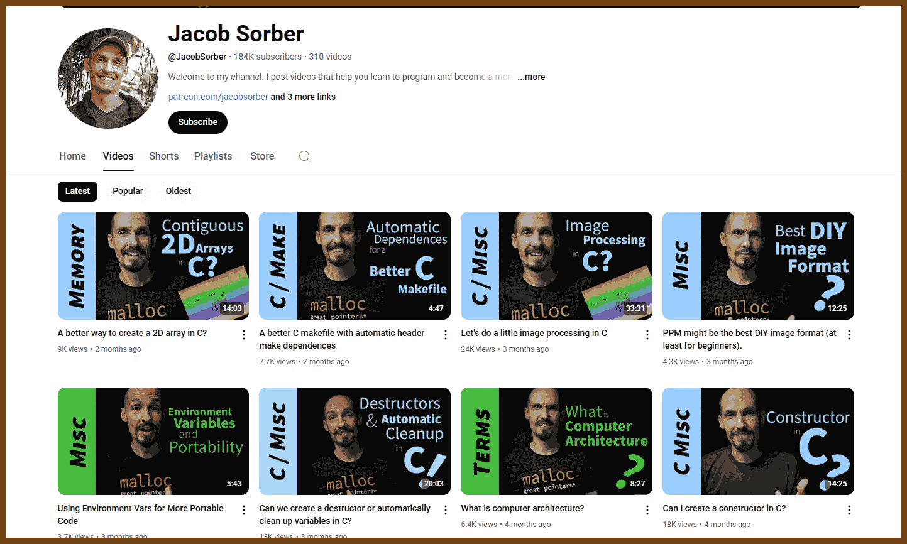

2025-09-27 [Sean Barrett - YouTube](https://www.youtube.com/@SeanTBarrett/videos) { www.youtube.com }

> 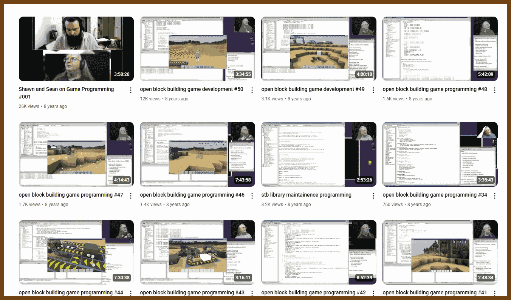

2025-09-05 [Memory is slow, Disk is fast - Part 2](https://www.bitflux.ai/blog/memory-is-slow-part2/) { www.bitflux.ai }

> Sourcing data directly from disk *IS* faster than caching in memory. I brought receipts. Because hardware got wider but not faster, the old methods don't get you there. You need new tools to use what is scaling and avoid what isn't.
>
> The article benchmarks different ways of scanning a 50 GB dataset and shows that a carefully pipelined disk I/O path can outperform naive in-memory access when using mmap and the page cache. It highlights how modern hardware favors bandwidth scaling over latency improvements, making streaming, batching, and overlapping computation with I/O essential for high throughput.
>
> Key Takeaways:
>
> - In tests, mmap with page cache delivered 3.71 GB/s, SIMD unrolled loops on cached data 5.51 GB/s, disk I/O with io_uring 5.81 GB/s, and preallocated in-RAM reads 7.90 GB/s. Disk streaming with io_uring outperformed naive cached-RAM paths.
> - mmap overhead from page faults makes it slower than reading into preallocated buffers, even when data is in RAM.
> - io_uring enables deep queues, batched async I/O, and overlap of compute and fetch, making it ideal for streaming workloads.
> - Modern hardware has flat latency but rapidly increasing bandwidth, so performance comes from streaming and batching, not random fine-grained access.
> - Proper tuning matters: high queue depth, multiple workers, 16 KB aligned buffers, NUMA pinning, and RAID0 across SSDs all improved throughput.
> - Profiling showed that cached-RAM scans were compute-limited until vectorization was optimized; memory was not the bottleneck.
> - With multiple SSDs and DMA-to-cache features, disk throughput can approach or exceed naive in-memory scans, making out-of-core processing viable.
> - Best practices: build async pipelines, profile compute loops, use aligned preallocated buffers, disable unnecessary FS features, and pin workloads to NUMA domains.
> - Key advice: do not assume RAM is always faster; measure, profile, and design for streaming pipelines.
>
> 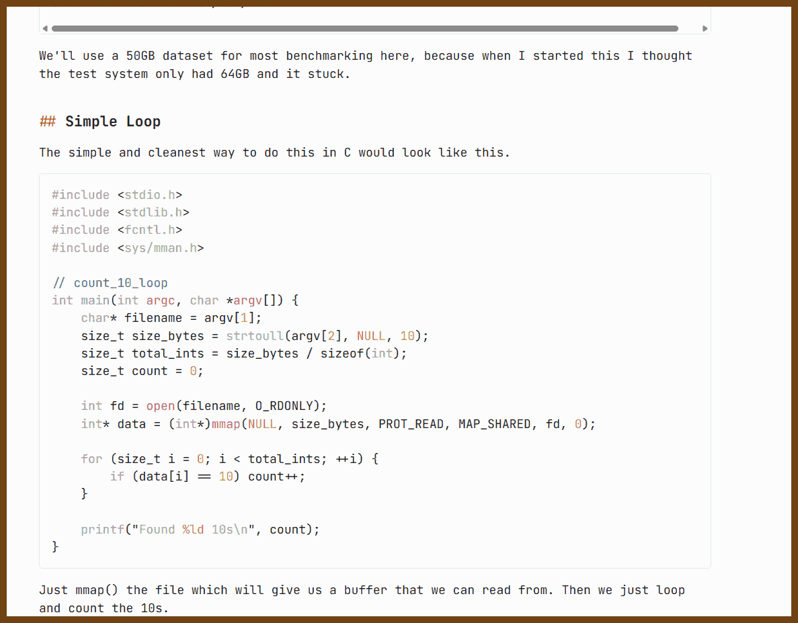

2025-10-10 [ashtonjamesd/lavandula: A fast, lightweight web framework in C for building modern web applications](https://github.com/ashtonjamesd/lavandula) { github.com }

> 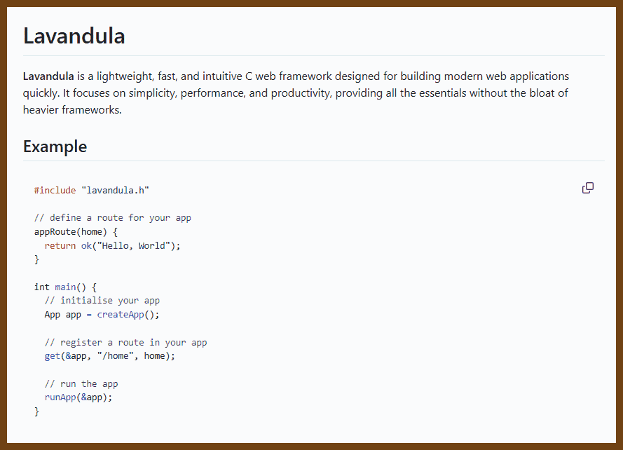

> 2025-10-10 [Show HN: I built a web framework in C | Hacker News](https://news.ycombinator.com/item?id=45526890) { news.ycombinator.com }
>
> [faxmeyourcode](https://news.ycombinator.com/user?id=faxmeyourcode) [14 hours ago](https://news.ycombinator.com/item?id=45527986) | [next](https://news.ycombinator.com/item?id=45526890#45528218) [[–\]](javascript:void(0))
>
> This is some of the cleanest, modern looking, beautiful C code I've seen in a while. I know it's not the kernel, and there's probably good reasons for lots of #ifdef conditionals, random underscored types, etc in bigger projects, but this is actually a great learning piece to teach folks the beauty of C.
>
> I've also never seen tests written this way in C. Great work.
>
> C was the first programming language I learned when I was still in middle/high school, raising the family PC out of the grave by installing free software - which I learned was mostly built in C. I never had many options for coursework in compsci until I was in college, where we did data structures and algorithms in C++, so I had a leg up as I'd already understood pointers. :-)
>
> Happy to see C appreciated for what it is, a very clean and nice/simple language if you stay away from some of the nuts and bolts. Of course, the accessibility of the underlying nuts and bolts is one of the reasons for using C, so there's a balance.

2025-10-10 [Love C, Hate C: Web Framework Memory Problems](https://alew.is/lava.html) { alew.is }

> 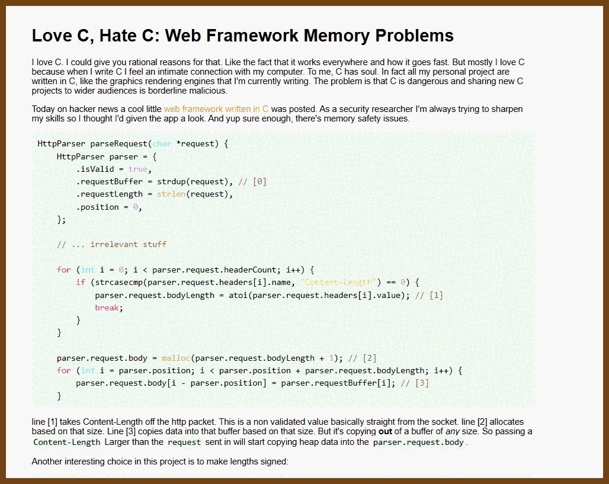
>
> line [1] takes Content-Length off the http packet. This is a non validated value basically straight from the socket. line [2] allocates based on that size. Line [3] copies data into that buffer based on that size. But it's copying **out** of a buffer of *any* size. So passing a `Content-Length` Larger than the `request` sent in will start copying heap data into the `parser.request.body`.
>
> Another interesting choice in this project is to make lengths signed:


## 😁 Fun / Retro

2025-11-15 [DOOMscroll — The Game](https://gisnep.com/doomscroll/) { gisnep.com }

> 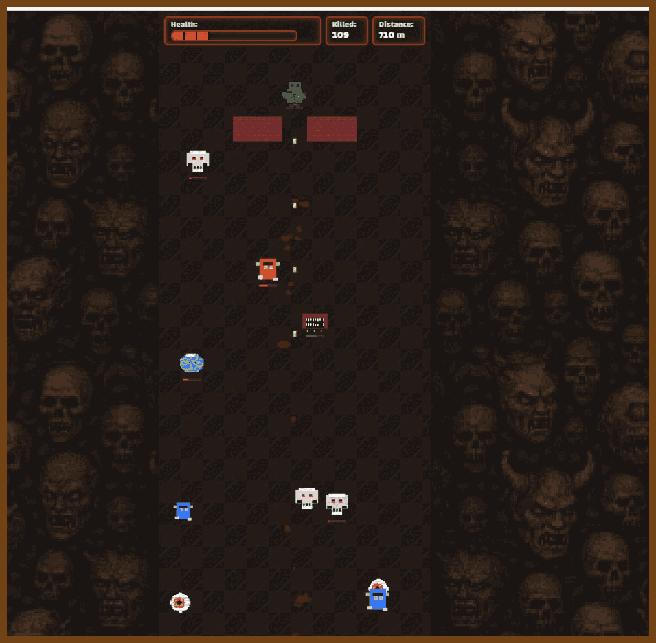

2025-11-04 [When Stick Figures Fought - by Animation Obsessive Staff](https://animationobsessive.substack.com/p/when-stick-figures-fought) { animationobsessive.substack.com }

> 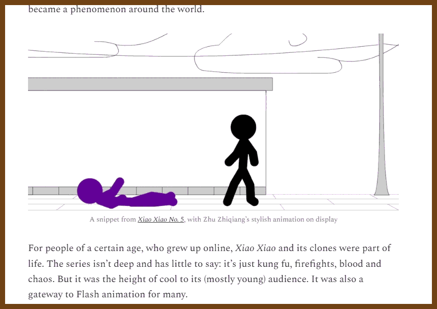

2025-10-27 [DOSBox SVN, CPU speed: 3000 cycles, Frameskip 0, Program: MARIO](https://www.myabandonware.com/game/mario-teaches-typing-1gl/play-1gl) { www.myabandonware.com }

> 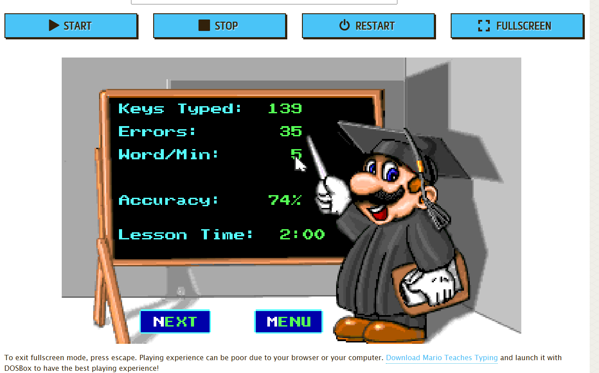

2025-09-29 [I'm Not a Robot](https://neal.fun/not-a-robot/) { neal.fun }

> This is a game!
> 

2025-09-29 [MitchIvin XP](https://mitchivin.com/) { mitchivin.com }

> 


## 💖 Inspiration!

2025-11-13 [Visual Types](https://types.kitlangton.com/) { types.kitlangton.com } **Typescript**

> 
>
> 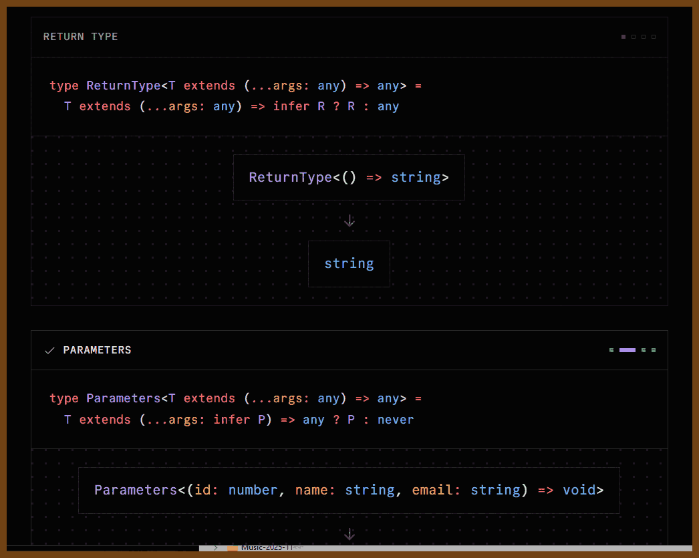
> Visual Types is an animated, semi-interactive TypeScript curriculum by Kit Langton that teaches the type system through strong visual metaphors and motion rather than walls of text. It presents itself as a "humble collection of semi-interactive TypeScript lessons", focusing on giving newcomers durable mental models for how types behave at compile time and how they relate to runtime values.

2025-11-02 [raine/anki-llm: A CLI toolkit for bulk-processing and generating Anki flashcards with LLMs.](https://github.com/raine/anki-llm) { github.com }

> A CLI toolkit for bulk-processing and generating Anki flashcards with LLMs.
> 

2025-10-27 [DeadStack / Technology](https://deadstack.net/recent) { deadstack.net }

> 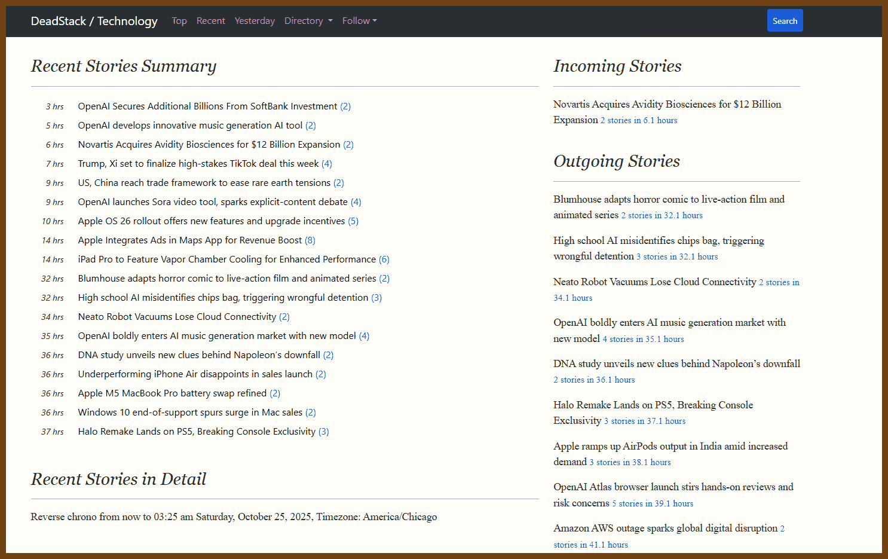

2025-10-26 [ZzFX - Zuper Zmall Zound Zynth](https://killedbyapixel.github.io/ZzFX/) {killedbyapixel.github.io}

> 

2025-10-19 [Notepad.exe - Native macOS Code Editor for Swift & Python](https://notepadexe.com/) { notepadexe.com }

> 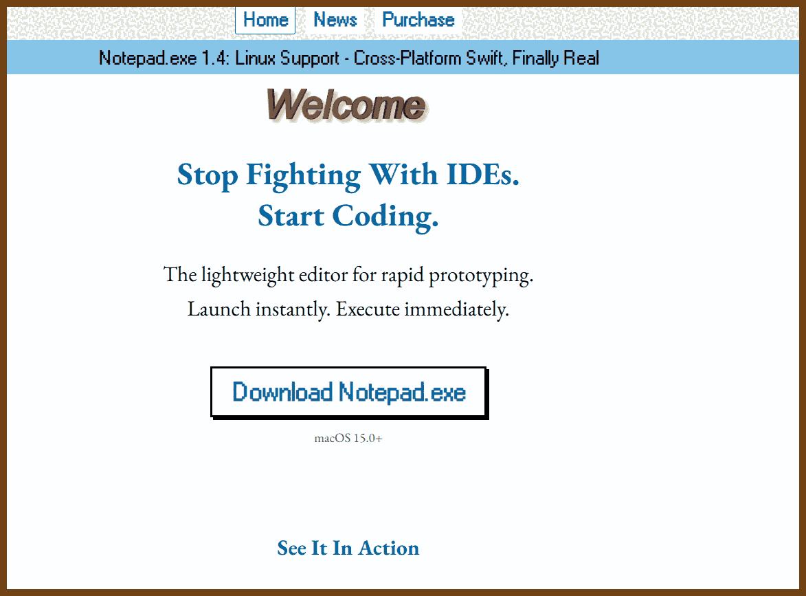
> 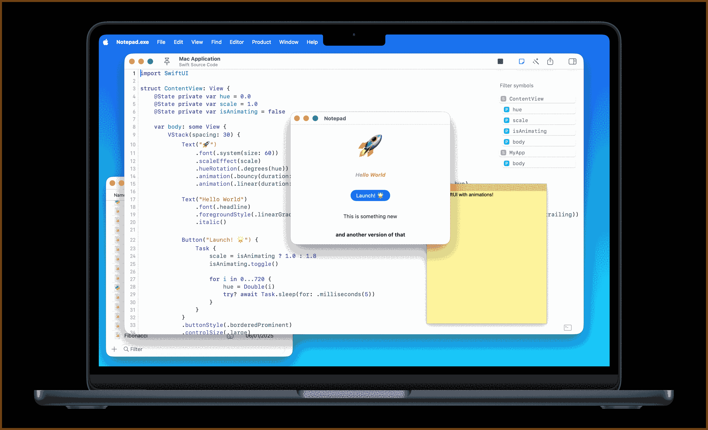

2025-10-11 [BreadOnPenguins/scripts: my scripts!](https://github.com/BreadOnPenguins/scripts) { github.com }

> 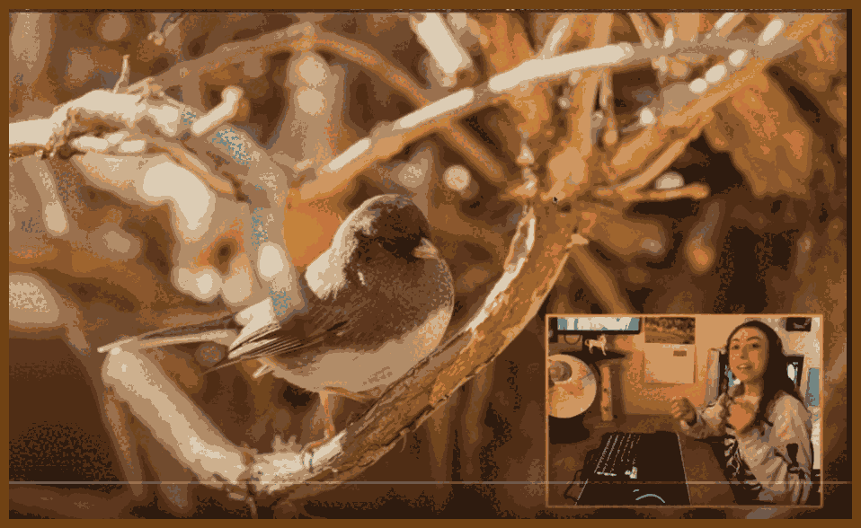
>
> 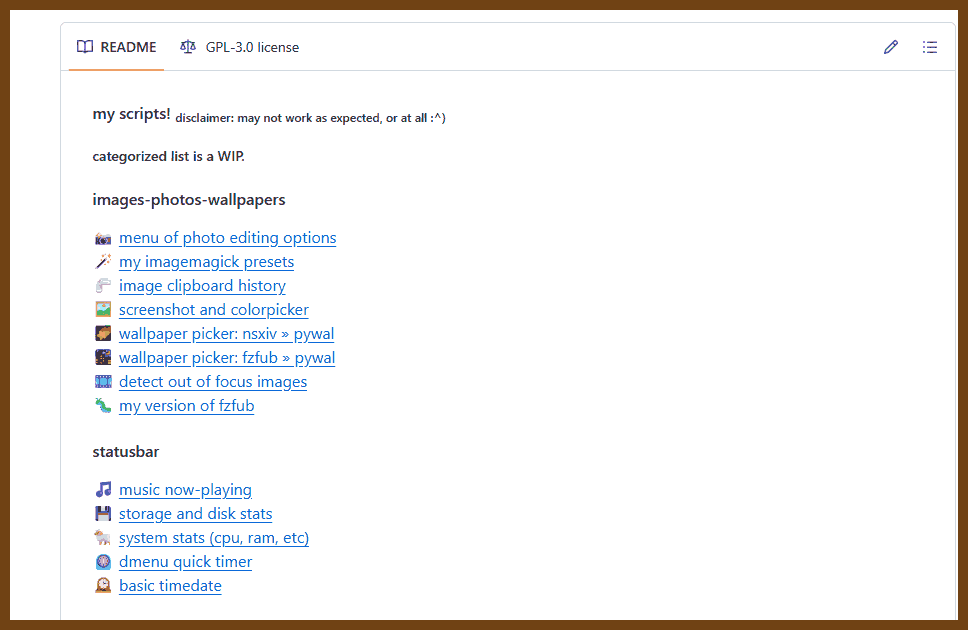

2025-10-10 [mafik/keyer: Firmware & goodies for making a KEYER (one-handed chorded keyboard).](https://github.com/mafik/keyer) { github.com }

> I've built a tiny hand-held keyboard 
> 

2025-10-04 [Fluid Glass](https://chiuhans111.github.io/fluidglass/) { chiuhans111.github.io }

> 

2025-09-29 [Handy](https://handy.computer/) { handy.computer }

> 
> Handy is a free, open-source speech-to-text application that runs locally on your computer. It allows users to speak into any text field by pressing a keyboard shortcut, with the app instantly transcribing speech into text. Designed for accessibility, privacy, and simplicity, Handy ensures that transcription happens on-device without sending data to the cloud.
>
> Handy is an **open-source speech-to-text app** that anyone can download, modify, and contribute to.
>
> It works via a **keyboard shortcut (push-to-talk)** that lets users dictate text directly into any text field.
>
> Users can **customize key bindings** and choose between push-to-hold or press-to-toggle transcription modes.
>
> All transcription is **processed locally**, ensuring privacy since no voice data is sent to external servers.
>
> The app emphasizes **accessibility**, making advanced speech tools available for free without a paywall.

2025-09-29 [consumed.today](https://consumed.today/) { consumed.today }

> 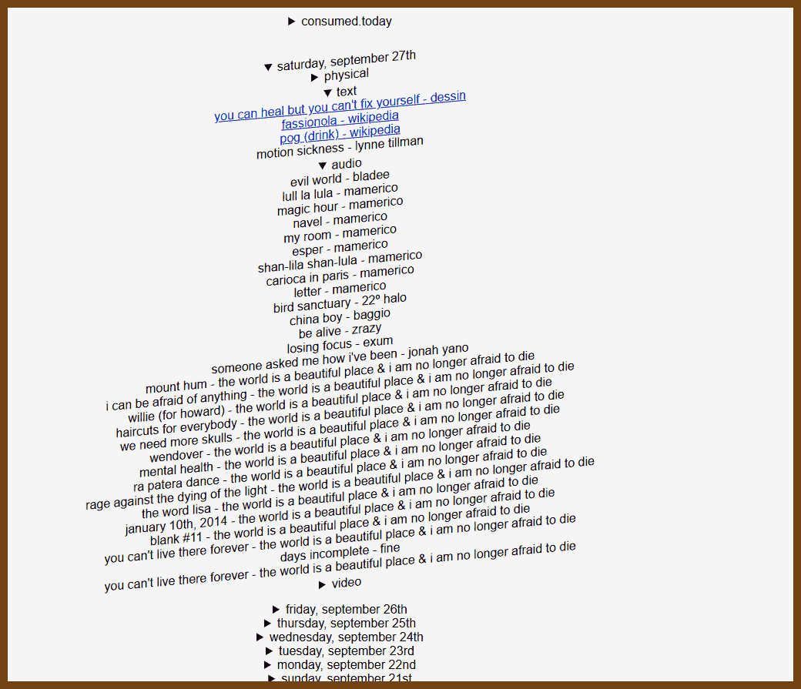

2025-09-29 [Learning Persian with Anki, ChatGPT and YouTube | Christian Jauvin](https://cjauvin.github.io/posts/learning-persian/) { cjauvin.github.io }

> 
> The article by Christian Jauvin describes his personal journey of learning Persian (Farsi) using a combination of tools and strategies: **Anki** for spaced repetition, **ChatGPT** for clarification and reinforcement, and **YouTube with browser extensions** for immersive listening practice. He emphasizes creating personalized flashcards, integrating visual aids, leveraging dual subtitles, and repeating structured listening exercises to deepen both reading and auditory comprehension.**Anki as the core tool**: Building a continuous deck with grammar-focused phrases, often sourced from YouTube lessons, helps reinforce memory more effectively than single words.
>
> **Card variety matters**: Using "basic" cards for reading practice and "basic and reversed" cards for translation fosters both recognition and recall skills.
>
> **Challenge of Persian script**: Despite knowing the alphabet, different letter forms and the absence of vowels make reading slow and difficult, requiring consistent practice.
>
> **ChatGPT as a tutor**: By pasting screenshots of flashcards into a ChatGPT project, Jauvin gets instant explanations and contextual clarifications, supporting faster knowledge consolidation.
>
> **Dual Subtitles extension**: Watching Persian YouTube videos with synchronized English and Farsi subtitles provides both learning material for new cards and contextual understanding.
>
> **Tweaks for YouTube extension**: Fine-grained playback control (1-second skips) aids focused listening and pronunciation practice.
>
> **Listening technique**: Steps include slowing playback to 75%, reading subtitles first in English, listening carefully to Farsi, cross-checking with Farsi script, and repeating out loud.
>
> **Iterative repetition**: Rewatching videos multiple times allows the learner to progress from partial recognition to real-time understanding, which feels both effective and motivating.
>
> **Immersion mindset**: Jauvin stresses the importance of “feeling” comprehension, even when not every word is known, by aligning meaning and sound during active listening.
>
> **Practical and replicable system**: The method combines accessible digital tools with structured repetition, offering a practical framework for self-directed language learners.

2025-09-29 [UTF-8 Playground](https://utf8-playground.netlify.app/1F44B) { utf8-playground.netlify.app }

> 

2025-09-29 [Why our website looks like an operating system - PostHog](https://posthog.com/blog/why-os) { posthog.com }

> 

2025-09-29 [Elements of Rust – Core Types and Traits](https://rustcurious.com/elements/) { rustcurious.com }

> 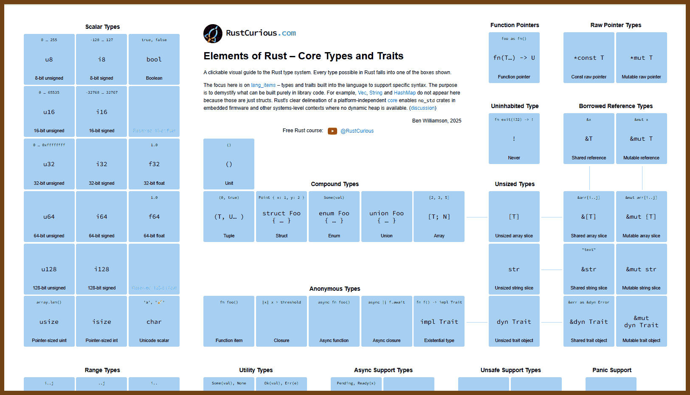

