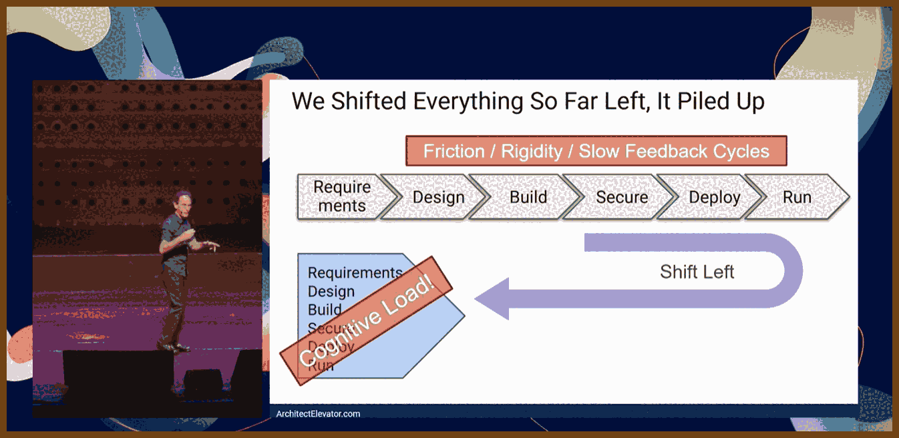
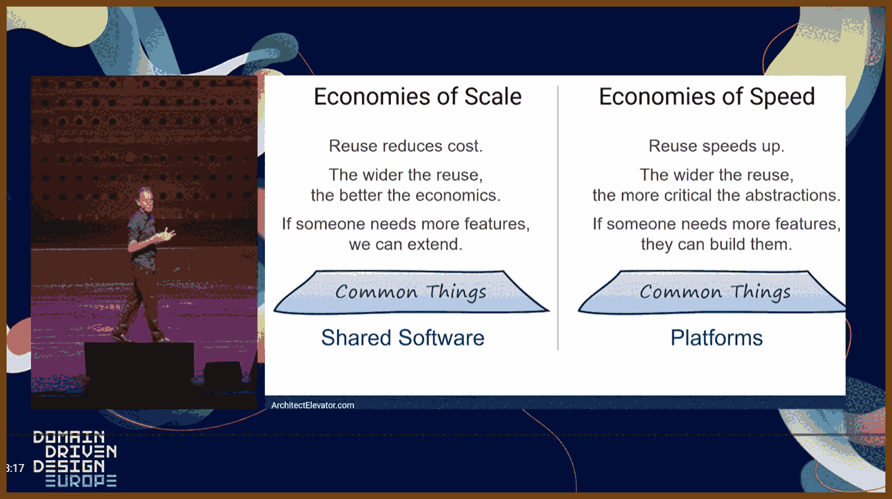
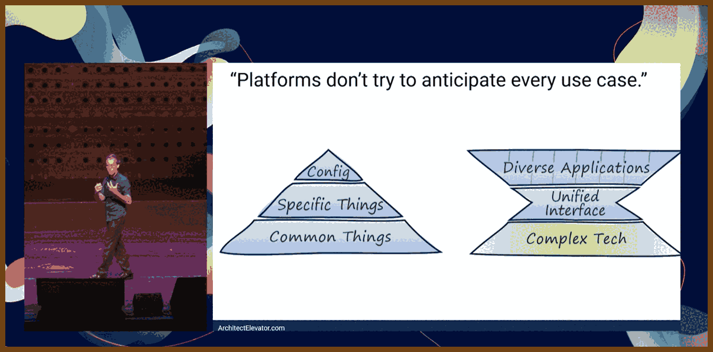
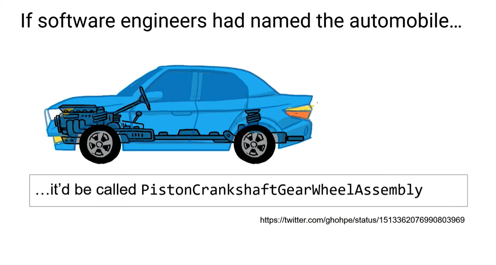
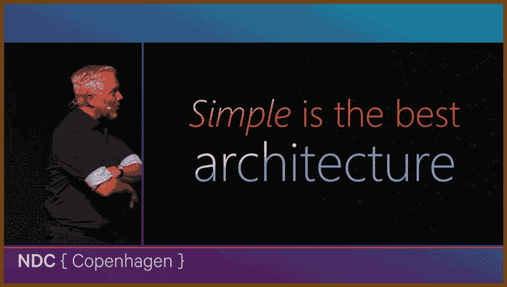
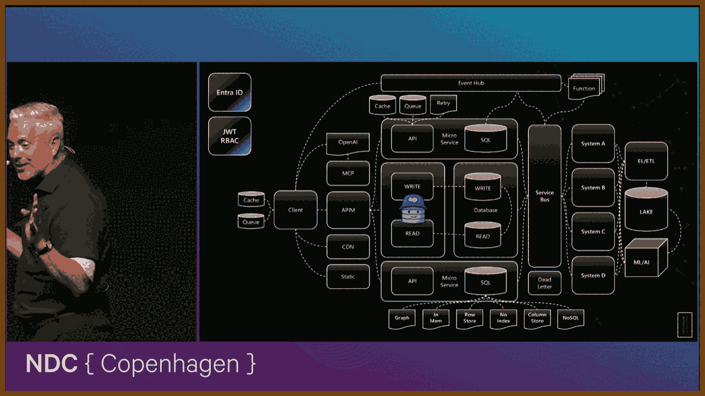
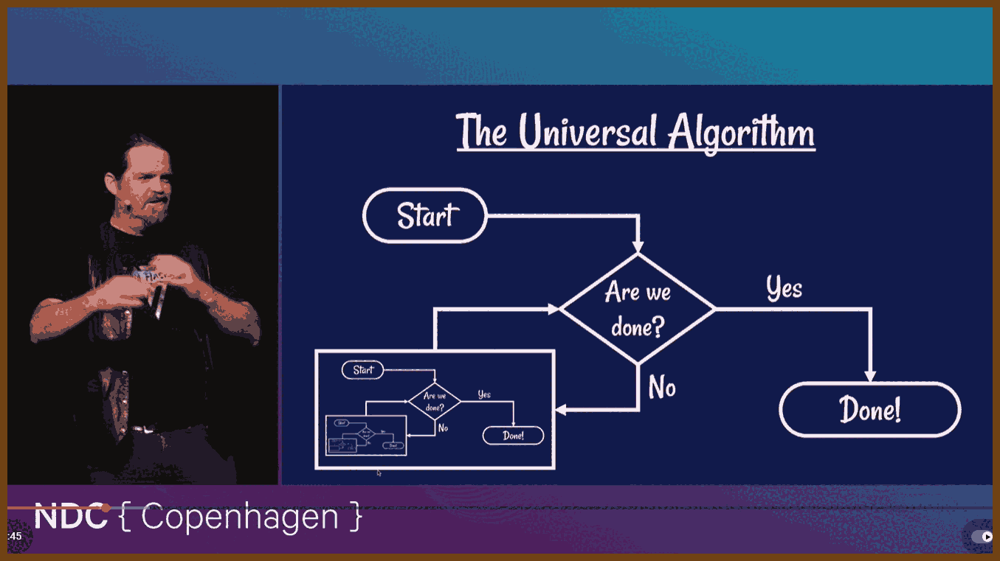
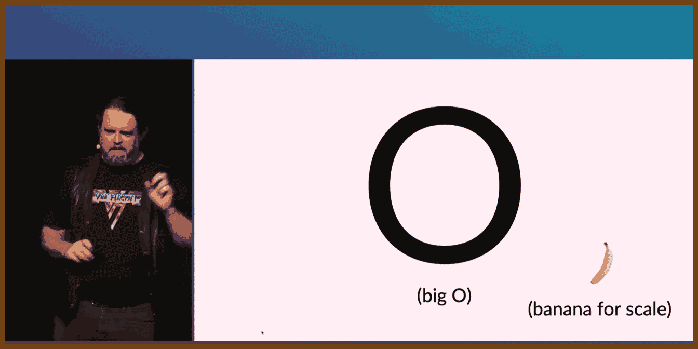
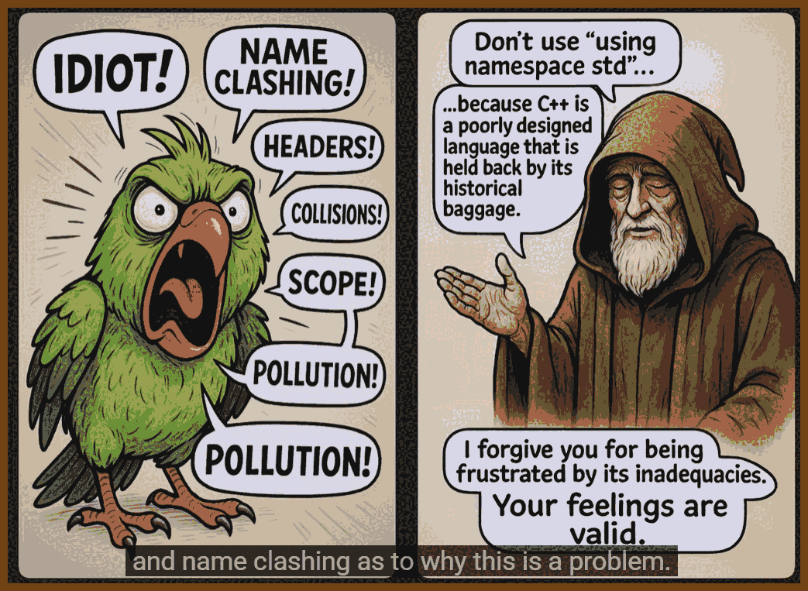

---
layout: post
title:  "Links from my inbox 2025-11-30"
date:   2025-11-30T11:02:00-08:00
categories: links
---

## ⌚ Nice watch!

2025-11-27 [Platform Engineering is Domain Driven Design - Gregor Hohpe - DDD Europe 2025 - YouTube](https://www.youtube.com/watch?v=5Ai8UGx7QvQ) { www.youtube.com }

> 
>
> We tend to see ourselves as the ones pushing technology forward, but once systems become more complex than our own ability to understand and safely operate them, we become the limiting factor, not the machinery.
>
> The attempt to "shift left" in software delivery has often turned into "pile left": a single developer is expected to own product, analysis, design, security, operations, and only then write code, which drives up mental load to an unsustainable level.
>
> > Cognitive load is the amount of mental effort required to understand and work with a system.
>
> In response to this overload, organizations promote platforms as a cure-all: a shared environment that promises abstractions, guardrails, and higher productivity, but people often treat the label as magic without understanding how such a thing actually needs to work.
>
> 
>
> The idea of building on a shared base layer is old, but historically it was justified by cost and reuse: if everyone uses the same foundation, the fixed investment is amortized and you save money compared to building everything from scratch.
>
> When the main driver shifts from cost to speed, the picture changes: what matters is how quickly teams can move, not how perfectly everything is standardized, and that leads to very different design choices for shared infrastructure.
>
> If a single, broad platform becomes a lowest common denominator that serves nobody particularly well, it reduces velocity; in a fast-changing environment, smaller, opinionated building blocks are often better for speed than one huge, generic base.
>
> The classic "pyramid" model of software delivery assumes a big shared base and tiny bespoke tops; it looks economically attractive on paper, but it only works if the people designing the base can anticipate almost everyone else’s needs in advance.
>
> That anticipation requirement is both unrealistic and undesirable, because it suppresses unexpected ideas: a system designed only around predicted use cases leaves little room for people to do things no one thought of, which is where real innovation tends to come from.
>
> > Innovation is the emergence of valuable new behavior that was not anticipated or centrally planned.
>
> A healthy shared environment should widen the playing field instead of narrowing it, improving the economics of experimentation so that you get more diverse solutions on top, not fewer.
>
> The tension in many organizations is that developers expect the "open" picture with lots of room to explore, while infrastructure or operations groups favor the tight pyramid for control and standardization, and trying to satisfy both with one design often fails.
>
> The car industry illustrates a better model: auto makers invest heavily in shared components like chassis, engines, and electronics, but use them to support a wide variety of models and trims, turning a deep common platform into dozens of differentiated products.
>
> Cloud providers work similarly: they use massive economies of scale to build data centers, networks, and complex services, yet expose them so that individual teams can move in "speed economics", renting small slices and iterating quickly without feeling the cost of the underlying machinery.
>
> > Economies of scale mean shared resources become cheaper per unit as you grow; economies of speed mean you optimize for fast learning and change, not unit cost.
>
> A good shared platform combines these two worlds: underneath, it leverages scale to justify big investments; on top, it preserves speed and diversity so teams can innovate rapidly without needing to build the heavy substrate themselves.
>
> 
>
> A simple test of whether an internal platform is real or just a renamed "common services layer" is whether teams have built something on it that **its creators did not foresee**; unanticipated but successful uses are a strong signal that the top of the pyramid is truly open.
>
> The Cadillac Cimarron story shows the danger of shrinking the "top" too much: when manufacturers tried to pass off a lightly modified mass-market car as a luxury model, customers rejected it because there was no genuine differentiation, mirroring what happens when a platform leaves no room for innovation above it.
>
> Organizational charts that show "applications" sitting on top of "platform" can be misleading, because they are static; speed, learning, and change are dynamic phenomena, so you need a model that shows iterative loops, not just boxes and layers.
>
> Viewed as a cycle, software delivery has an "inner loop" (build, run, adjust) and "outer loop" (observe business impact and refine), and if the platform team is inserted directly into that loop for every change, it becomes a bottleneck instead of an accelerator.
>
> A well-designed internal environment makes itself invisible in the day-to-day flow: teams deploy, operate, and learn without filing tickets or needing manual help from the platform group, which should provide the rails and instruments, not sit in the control loop.
>
> The metaphor of guardrails is often misused: guardrails are emergency safety devices, not steering mechanisms, and if developers constantly "bounce off" organizational guardrails, the system is high friction and fragile rather than smooth and safe.
>
> Instead of relying on hard boundaries, you want self-centering mechanisms like a train’s conical wheels or a car’s lane assist: low-friction feedback that keeps teams in a good path most of the time and only resorts to hard stops or blocks in real emergencies.
>
> Transparency is one of those self-centering mechanisms: if teams can see cost, reliability, and performance effects of their choices immediately, they can adjust their behavior without needing central enforcement to correct every mistake.
>
> Abstraction is central to platforms, but it is often misunderstood: hiding controls or renaming knobs is not enough; you must decide what concepts to emphasize, what to downplay, and how to express the underlying complexity without creating a false sense of simplicity.
>
> > An abstraction is a new way of describing a system that hides some details while emphasizing others that matter more for a given purpose.
>
> Naming is part of this: good names describe the essential property of the whole system (like "automobile", something that moves itself), not the list of internal parts, while bad names like "gas pedal" leak implementation details that may no longer be true.
>
> 
>
> Remote procedure call is a canonical example of a leaky abstraction: calling something "just like a local method" hides huge differences in latency, failure modes, and consistency, leading people to misuse the mechanism unless they understand what is really going on.
>
> Because of this, there is no formula for "perfect abstraction level": it is a calibration exercise where you use feedback from actual use to adjust what you expose, much like steering a car by continually correcting rather than calculating the perfect trajectory in advance.
>
> We often think that hiding details means people see less, but in practice careful omission can make important properties more visible; by removing noise you highlight structure, but this only works if you choose what to omit and what to emphasize wisely.
>
> The number of parameters or methods in an interface is not a reliable measure of mental burden; a single overloaded flag or magic string can encode a huge amount of hidden behavior, yielding high cognitive load under the appearance of simplicity.
>
> Overloaded parameters, "do everything" flags, and similar tricks repeat old mainframe-era patterns where fields were reused for multiple meanings because schemas were hard to change; they lower the visible surface but raise the mental work required to use them correctly.
>
> The goal is not to make inherently complex things "simple" at all costs, but to make them intuitive: the surface should reflect the real challenges of the domain in a way that aligns with how users think and work, without pretending those challenges do not exist.
>
> When teams build shared systems, the natural gravitational pull is toward more capability: adding more features, more knobs, more supported cases, because that is how products are typically evaluated and how internal stakeholders ask for enhancements.
>
> What actually matters for fast, safe change is composability: small, coherent building blocks that can be combined easily, consistently, and predictably, so teams can assemble new solutions without needing a giant one-size-fits-all service.
>
> > Composability is the ability to combine simple pieces into more complex behavior without unexpected side effects.
>
> A platform team must consciously push against the "more features" gravity by investing in coherence and composition, ensuring that services fit together cleanly rather than just accumulating independent capabilities at the bottom.
>
> Historical platforms like operating systems did not reduce cognitive load by pre-filling disk drive numbers; they introduced new concepts such as files, streams, and processes, building a fresh vocabulary that sits between raw hardware and application logic.
>
> For software teams, the sweet spot for internal platforms lies in the space between the business domain (customers, ledgers, policies) and the raw cloud services (databases, queues, functions) where you define concepts that encode both technical and organizational concerns.
>
> Examples include distinguishing a "customer-data database" from a "non-PII database", or creating a "ledger database" that embodies auditability and change tracking; these abstractions bake in compliance, risk, and governance assumptions in a way infrastructure providers cannot.
>
> To do this well, you must understand both sides: the technical constraints of services like managed databases and the specific business rules around data, regulation, and risk in your company, then reflect that understanding in the platform’s language and APIs.
>
> Abstraction should also be two-way: when a higher-level concept compiles down into multiple low-level resources, there must be a clear mapping back, like stack traces and line numbers, so that when something goes wrong you can see which high-level construct caused it.
>
> Physical properties such as latency, cost, quotas, and availability cannot be fully abstracted away; any attempt to pretend they are uniform across providers or environments creates leaky abstractions that eventually surprise and hurt the teams relying on them.
>
> Generative AI does not remove the need for good platforms and abstractions: large models can generate code, but they still need clear, well-designed APIs and domain concepts to target, and they do not replace the human work of shaping those conceptual structures.
>
> Finally, illusions in models and diagrams are like visual illusions in geometry: they can be surprisingly convincing, but physical reality eventually wins, so platform engineering has to respect the real constraints and behaviors of systems rather than relying on attractive but unrealistic pictures.

2025-11-23 [Modern Architecture 101 for New Engineers & Forgetful Experts - Jerry Nixon - NDC Copenhagen 2025 - YouTube](https://www.youtube.com/watch?v=WRg13Ze_UpY) { www.youtube.com }

> Author: Jerry Nixon {MSFT}
>
> 
> 
>
> In this talk I walk through how I think as an architect in a world that is absurdly noisy for developers, especially the newer ones. I start by pushing back on the idea of universal “best practices” and reframe architecture as a series of context-heavy tradeoffs: politics, budget, legacy tech, team skills and time all matter more than whatever some big company did on a podcast. From there I define my job as the person who makes the decisions that are the most expensive to change later and, even more importantly, the person who protects the system from unnecessary stuff. Rather than chasing every fad, I care about keeping things as simple as they can reasonably be, knowing that every new box I add to the diagram is one more thing I own when it breaks.
>
> Then I use the big architecture picture as a thinking model, not a prescription. I start with the simplest shape – a client, an API, a database – and show how I decide when to layer in new capabilities: separating reads from writes, adding replicas, splitting into services, introducing a service bus so systems can talk, hanging retries, caching and queues around the database so the user has a smooth experience even when the backend is struggling. I generalize patterns like event hubs and functions for reacting to changes, API gateways for versioning and protection, static hosting and CDNs at the edge, different storage patterns inside the database, data lakes and ML for analytics that feed back into the product, and identity with JWTs for access control. The point is to teach a way of reasoning: for each of these pieces, understand what it gives you, understand its caveats, and then deliberately choose what to leave out and what to postpone, because in the end simple, deferrable decisions usually make the strongest architecture.

2025-11-23 [Workflows of Highly Functional App & Data Engineering Teams - Jerry Nixon - YouTube](https://www.youtube.com/watch?v=4F3v1p6lc8E) { www.youtube.com }

> Author: Jerry Nixon {MSFT}
>
> 
>
> ---
>
> {2025-11-23 note: LLM transcript test on this talk }
>
> There is a common three-layer data model for analytics where data flows from a raw zone to a cleaned zone and finally to a curated zone; this structure helps separate ingestion, cleaning, and business-ready views of data.
>
> > Medallion strategy: A three-step way to organize data into raw, cleaned, and curated layers.
>
> The first tier is a raw zone where copies of data from systems such as HR, sales, or factory applications are dumped into a data lake with no transformation, typically through extract-and-load jobs scheduled nightly, weekly, or by other batch or event processes.
>
> > Bronze layer: A place where raw copies of data from source systems are stored without changes.
>
> The second tier is a cleaned zone where duplicates are removed, keys between different applications are aligned, value formats such as country codes are standardized, and fields are reshaped so that data from multiple systems can be reliably joined and queried together.
>
> > Silver layer: A cleaned area where data from different systems is deduplicated and made consistent.
>
> The top tier is a curated zone where experts design models that are easy to use, well documented, and enriched with pre-aggregations and external sources like weather, so that common business questions can be answered quickly with minimal extra logic.
>
> > Gold layer: A curated area where data is modeled, documented, enriched, and pre-aggregated for business use.
>
> In reality different applications inside the same company reach different tiers: one system might have fully curated data, another only cleaned data, and another just raw dumps, yet even the raw tier is valuable because it removes pressure from production systems and takes advantage of cheap storage, at the cost of large, messy data lakes.
>
> Every move from one tier to the next adds latency because teams must negotiate extract schedules with system owners and then run heavy transformations, so when managers ask for real-time dashboards they usually mean updates as fast as is practical without huge extra cost, not truly instantaneous streaming like stock tickers.
>
> > Near real time: Data that is updated frequently enough to be useful but not instantly as events happen.
>
> Modern pipelines often follow an extract-load-then-transform pattern in which data first lands in the lake and is transformed later once other sources arrive, and for this flow it is better to rely on a dedicated orchestration tool rather than hand-rolled notebooks with custom logging, auditing, and dashboards that become a maintenance burden for future developers.
>
> > ETL orchestration tool: A system that coordinates moving and transforming data between sources and targets in a repeatable way.
>
> The three tiers differ in quality and timing: raw dumps may still expose subtle bugs from source systems, cleaned data starts to encode business rules and becomes much more reliable, and curated data is the most trustworthy and enriched but also the furthest behind real time due to all the work needed to prepare it.
>
> Collaborative development on a database often degenerates into direct edits on a shared instance with scattered documentation about changes, which makes it hard to track differences between environments; a better approach is to capture the desired schema as declarative code under source control and let tools apply it to databases.
>
> > Declarative schema: A description of what the database should look like, stored as code, that tools use to create or update the actual database.
>
> SQL Server database projects in Visual Studio provide this declarative model by letting teams define tables, views, procedures, and options as files, target specific SQL Server versions, build the project like any other codebase, and catch issues such as views referencing missing tables during compilation instead of at runtime.
>
> Building such a project produces a schema package called a DACPAC that can be compared with a live database to generate upgrade scripts; within the project, all objects are defined with create statements, semantic renaming can safely update column names across all dependent objects, and pre- and post-deployment scripts plus publish profiles control behaviors such as blocking data-loss changes and recreating databases, enabling repeatable deployments and clean test-database resets.
>
> > DACPAC: A compiled package of a database schema that can be used to compare, deploy, or update databases consistently.
>
> Similar capabilities exist in tools like Liquibase, Flyway, and DbUp, and the essential practice is to treat database schema as code managed in source control rather than working only against a live instance, regardless of which product is chosen.
>
> A practical convenience for development environments is the Windows package manager winget, which can install tools such as SQL Server, SQL Server Management Studio, and Visual Studio through simple commands or scripts, making it easy to standardize and automate machine setup.
>
> A sensible continuous integration pipeline for database changes starts by linting SQL to enforce style and consistency, and a dedicated T-SQL linting tool can run both locally and in build agents to keep the codebase clean and uniform.
>
> After linting, regular MSBuild compiles the database project and produces the DACPAC, and a companion command-line tool can either apply the package directly to a target database or generate an incremental update script; the build agent that runs this often uses Windows, even in mostly cross-platform setups.
>
> In CI it is safer to deploy schema changes into ephemeral SQL Server instances running in Linux containers from the official registry image, first applying a snapshot of the current production schema and then applying the new version to confirm that the upgrade path is valid, and only then running automated tests before any human reviews and approves scripts for later environments.
>
> A modern cross-platform SQL command-line tool written in Go integrates with Docker to spin up and manage these containers, making it straightforward to create and tear down temporary test databases inside pipelines with single commands.
>
> Database code such as stored procedures and views deserves automated unit tests just as much as application code, because future changes can silently break behavior, and tests serve as a safety net that guards against mistakes by any team member.
>
> One effective pattern is to write tests as stored procedures that begin a transaction, prepare test data, call the code under test, and then use assertion helpers to check results before rolling back; these test procedures live in a separate database project that references the main project and an assertion schema, and an xUnit-based runner in application code can query for procedures that follow a naming convention and execute thousands of tests automatically in CI.
>
> A shared assertion library for T-SQL provides helpers like equals and contains, along with example runner code, so teams can plug in a ready-made framework for writing and executing database tests instead of building all the infrastructure from scratch.
>
> For the application-to-database boundary, a configurable data API engine can read a JSON description of the database and automatically expose REST and GraphQL endpoints with built-in security, telemetry, and resolvers, avoiding the need to hand-write CRUD APIs that repeat effort and require their own full testing and maintenance.
>
> > Data API engine: A configurable service that automatically exposes database tables as secure HTTP APIs without custom backend code.
>
> The impact of these practices is not only technical but financial; one example describes a beverage company where surfacing data into a cleaned layer and analyzing it led to an 8 percent sales increase, roughly 440 million dollars, showing how modest engineering work on data quality and access can unlock large business gains.
>
> A careful pattern for evolving schemas, such as splitting a full-name column into separate first- and last-name columns, starts by adding new columns while keeping the original, populating them via a trigger based on existing writes, holding back application changes behind configuration so production still writes only the old column, validating that downstream systems handle the new fields, and only then flipping the flag so the app writes directly to the new structure before eventually retiring the old one.
>
> > Feature flag: A configuration switch that turns a behavior in the application on or off without redeploying code.
>
> Even seemingly simple changes like splitting names become complex with real data containing middle names and multiword surnames, so schema evolution requires patience, defensive design, and clear communication about effort and risk to managers who may assume the change is trivial.

2025-11-23 [DORA Report 2024 explained for non-teching | DevOps Research & Assessment - YouTube](https://www.youtube.com/watch?v=Xaa5-s3lhz4) { www.youtube.com }

> 
>
> Elite teams in the DORA dataset deploy to production multiple times per day, have about a 5% change failure rate, can recover from failures within an hour, and can get a change from code to production in roughly a day.
>
> Low-performing teams deploy at most once a month, have about a 40% change failure rate, can take up to a month to recover from failures, and may need up to six months to get a change into production.
>
> Throughput and stability move together: teams that deploy less frequently tend to have higher failure rates; teams that deploy more often tend to have lower failure rates (correlation, not causation).
>
> DORA’s main recommendation is that “elite improvement” matters more than “elite performance”: teams that keep improving their delivery metrics over time are healthier than teams that just chase a target level.
>
> When a platform is present, developers report feeling about 8% more productive individually and teams about 10% more productive, with overall organizational performance up about 6% compared to teams without a platform.
>
> Those same platform setups also see about an 8% drop in throughput and a 14% drop in change stability, and these drops correlate with higher burnout, so the platform brings both benefits and pain.
>
> Developer independence (being able to do end-to-end work without waiting on an enabling team) is associated with about a 5% productivity improvement at both individual and team level.
>
> The report strongly links a user-centered mindset to better outcomes: when teams align what they build with real user needs and feedback, they see higher productivity, lower burnout, and higher product quality.
>
> Frequent priority churn hurts; stable priorities are associated with more productive teams and less burnout.
>
> Cross-functional collaboration and good documentation show up as clear positive factors for long-term product quality and team health; optimizing only for throughput increases the risk of building “shiny but unused” features.
>
> A 25% increase in transformational leadership (leaders who give purpose, context, and autonomy) is associated with about a 9% increase in employee productivity, plus lower burnout and higher job, team, product, and organizational performance.
>
> Across a decade of data, DORA’s conclusion is that continuous improvement is not optional: organizations that do not keep improving are effectively falling behind, while those that treat transformation as an ongoing practice achieve the best results.

2025-11-23 [Software Engineering at Google • Titus Winters & Matt Kulukundis • GOTO 2022 - YouTube](https://www.youtube.com/watch?v=NNMnbBf0Itw) { www.youtube.com }

> 
>
> > **Software Engineering at Google**
> >
> > **Book** [abseil / Software Engineering at Google](https://abseil.io/resources/swe-book) { abseil.io }
> >
> > In March, 2020, we published a book titled “Software Engineering at Google” curated by Titus Winters, Tom Manshreck and Hyrum Wright.
> >
> > The Software Engineering at Google book (“SWE Book”) is not about programming, per se, but about the engineering practices utilized at Google to make their codebase sustainable and healthy. (These practices are paramount for common infrastructural code such as Abseil.)
> >
> > We are happy to announce that we are providing a digital version of this book in HTML free of charge. Of course, we encourage you to get yourself a hard copy from O’Reilly if you wish.
>
> Most chapters in “Software Engineering at Google” were written by subject-matter experts across Google; Titus, Tom Manshreck, and Hyrum Wright chose topics, matched authors, and did heavy editing, but did not write most of the content themselves.
>
> A core rule of their build philosophy: if you ever need to run `make clean` (or the equivalent) to get a correct build, the build system is considered broken.
>
> Hermetic build: every dependency (including toolchains and libraries) must be tracked by the build and version control; relying on whatever headers or `.so` files happen to be installed on a developer’s OS is treated as a violation.
>
> Titus’s “heresy”: you should be able to update the OS on your dev machine without changing or breaking your build, because the build environment is controlled separately (containers, toolchains, etc).
>
> The same hermeticity idea is applied to tests: especially unit tests should not depend on shared, mutable state (like a shared DB), otherwise only a few people can run them and they do not scale.
>
> Testing is framed as “defense in depth”: cheap, fast unit tests; more expensive but higher-fidelity integration tests; and finally end-to-end tests and canary releases in production as the highest-fidelity checks.
>
> Canarying small releases in production, frequently and safely, is described as the strongest possible way to validate a release, because it runs in the real environment against real traffic with controlled risk.
>
> Dependency management is called out as Google’s biggest unsolved technical problem: they know many approaches that do not scale or are too high-toil, but do not yet have a dependency management model that is cheap, intuitive, and scales well.
>
> Titus would rather deal with “any number of version-control problems than one dependency-management problem,” because once you lose track of what depends on what version, coordination and iteration become extremely expensive.
>
> He leans heavily on DORA / “Accelerate”: trunk-based development, strong documentation, and especially continuous delivery correlate with better technical outcomes; his wish is for directors to set explicit CD and quality targets so teams have cover to fix flaky tests and infrastructure.
>
> Software engineering is described as “multi-person, multi-version” work; the way universities train students (solo assignments, code rarely seen by others, slow feedback) does not prepare them for real team environments.
>
> New hires are framed as “fresh eyes”: their confusion during onboarding is valuable signal about broken documentation, onboarding flows, and mental models, and they are expected to ask questions early instead of hiding until work is “perfect.”
>
> On task assignment, the rule of thumb is: give work to the most junior engineer who can do it with reasonable oversight, not to the “best” engineer; that grows the team and frees seniors to tackle harder problems.
>
> Leadership anti-pattern: “because I said so” or hard overruling is treated as a failure; you only override when the cost of a mistake is clearly higher than the learning value, and you should normally guide people to understand the tradeoff instead.
>
> Real delegation means actually letting go: if you leave a project but keep trying to control it from the sidelines, you block growth and ownership in the new leads.
>
> Design and evolution rule: always put version numbers on protocols and file formats; once data is on disk or “in the wild,” you accumulate permanent compatibility hacks if you can’t distinguish old from new.
>
> Example of irreversible complexity: a historical bug wrote a specific bad checksum pattern for several days; because they do not know if those records still exist, the code has to keep a “special case” branch forever to accept that pattern.
>
> Large-scale changes (LSCs) across Google’s codebase are only possible because of heavy investment in unified build systems, testing, and a monorepo; trying to do the same over today’s heterogeneous open-source ecosystem (inconsistent builds, many projects already broken) is seen as practically infeasible.

2025-11-20 [Algorithms Demystified - Dylan Beattie - NDC Copenhagen 2025 - YouTube](https://www.youtube.com/watch?v=QJJb7cC3CGs) { www.youtube.com }

> 
>
> 
>
> 
>
> ---
>
> Have you ever got stuck on a coding problem? Maybe you're implementing a feature on one of your projects, maybe you're solving puzzles for something like Advent of Code, and you get stuck. You just can't figure out how to get the result you need. So you head over to Stack Overflow, or Reddit, or ask a colleague for help, and you get an answer like "oh, that's easy, just use Dijkstra's algorithm"... and your brain crashes. Use what? So you go and look it up and discover it's for "finding the shortest paths between nodes in a weighted graph", and now you've got to look up what a "node" is, and what a "weighted graph" is... and then figure out how to turn all that into working code? Nightmare. Well, it doesn't have to be like that. Algorithms are the key to all kinds of features and systems, from networks to autocorrect, and understanding how they work will help you build better software, fix subtle bugs - and solve Advent of Code. In this talk, we'll meet some of his favourite algorithms, explain why they're important, and help you understand what they do, and how they do it.

2025-11-23 [Stoicism as a philosophy for an ordinary life | Massimo Pigliucci | TEDxAthens - YouTube](https://www.youtube.com/watch?v=Yhn1Fe8cT0Q) { www.youtube.com }

> 
>
>
> ---
>
> This approach to life started with **Zeno**, a merchant who **lost everything in a shipwreck**, went to Athens, studied with local thinkers, and then founded a school in the **public market** to help **ordinary people** live better lives.
>
> This school of thought became **one of the main currents** in the ancient world, shaping writers like **Seneca** and **Marcus Aurelius** and later influencing **Paul**, **Aquinas**, **Descartes**, and **Spinoza**.
>
> The teaching says we should **live “according to nature”**, meaning we take human nature seriously: we are **social** and we can **reason**, so a good life uses our mind to improve life in the **community**, not only our own comfort.
>
> > Living according to nature means using your mind and social side to make life better for yourself and others.
>
> This way of living rests on **four main virtues**: **practical wisdom** (knowing what truly helps or harms you), **courage** (especially moral courage), **justice** (treating others fairly), and **temperance** (doing things in the right measure, avoiding excess and lack).
>
> A key idea is the **“dichotomy of control”**: 
>
> - some things are **up to us** (our opinions, motives, and choices) 
> - others are **not** (our body, property, reputation and most outcomes), so we should focus only on what is really **in our power**.
>
> > The dichotomy of control means separating what you can change from what you cannot.
>
> We control our **intentions**, **effort**, and **preparation**, but we do not control final **results**; like an **archer**, we can train and aim well, but once the arrow leaves the bow, wind and movement can change what happens.
>
> Applied to work, this view says we should stop worrying about **“getting the promotion”**, which depends on **others and luck**, and instead care about **doing our best work**, preparing well, and truly **earning** that promotion.
>
> Applied to relationships, we cannot force someone to **love us** or **stay with us**; what we can control is being **kind**, **reliable**, and **loving**.
>
> Epictetus, a **former slave** who became a teacher, says that if we clearly see what **belongs to us** (our judgments and choices) and what **does not** (most external things), we stop **blaming others** and stop feeling **stuck** because of what we cannot change.
>
> He adds that **peace** comes from **internalizing goals**: judging ourselves by whether we **acted well** and **tried our best**, not by whether events turned out the way we wanted.
>
> Their ethics can be seen as **“role ethics”**: a good life means **playing our different roles well** and **balancing** them as wisely as we can.
>
> > Role ethics means judging your life by how well you carry out your different roles.
>
> We all have **three types of roles**: the basic role of **human being** and **world citizen**; roles given by **circumstance** (child, sibling, etc); and roles we **choose** (career, partner, parent, and so on).
>
> The role **“human being” comes first**; whenever we act, we should ask whether the action is **good for humanity**, and if it is not, we **should not do it**.
>
> Other roles must be **balanced**; we cannot be perfect in all roles at once, so this way of thinking helps us handle **tradeoffs** between being, for example, a good **parent**, **worker**, **friend**, and **citizen**.
>
> Integrity is central: Epictetus warns us not to **“sell” our integrity cheaply**; the aim is not to be flawless but to become a bit **better than yesterday** without betraying our **core values**.
>
> > Integrity means sticking to your values even when it costs you.
>
> We should not confuse **feelings** with **duties**: strong emotions like **fear**, **grief**, or **distress** arise on their own, but our **actions** in response remain our responsibility.
>
> In the story of the distraught father and sick daughter, feeling overwhelmed is **natural**, but leaving the child and the burden to the mother **fails his duty**; real **courage** and **justice** mean staying and caring for his daughter **despite the pain**.
>
> The virtues guide how we handle **roles** and **role conflicts**: **practical wisdom** to see what is truly good, **courage** to do it, **justice** to treat others rightly, and **temperance** to spread our time and energy in a **balanced** way.
>
> These thinkers suggest seeing yourself as an **actor**: life hands you a **role** and a rough **script**, but **how you play that role** is up to you.
>
> We learn to play our roles better by using **role models**, real or fictional, as **patterns to imitate** in our own choices.
>
> Ancient writers admired figures like **Cato the Younger** for his **honesty** and **Odysseus** for his steady effort to **return home to his family**, even when faced with **comfort** or **immortality**.
>
> Modern examples include **Nelson Mandela**, who used ideas from **Marcus Aurelius** to move from **anger to reconciliation**, and **Susan Fowler**, who risked her **career** to expose wrongdoing at her company out of a sense of **duty**.
>
> Even fictional characters can help: **Spider-Man’s** line **“with great power comes great responsibility”** sums up the idea that any real **power** or **choice** we have always comes with **moral responsibility**.
>
> Overall, the picture is that we wear many **“masks” or roles** in life and switch among them as things change, and a good life is one where we play all these roles with **skill**, **balance**, **honesty**, and focus on what is truly **under our control**.

2025-11-29 [C++ The worst programming language of all time - YouTube](https://www.youtube.com/watch?v=7fGB-hjc2Gc) { www.youtube.com }

> 
>
> 
>
> C++ uses many different syntaxes and rules for simple tasks such as initialization, printing, random numbers, casting, globals, and inheritance, so code often becomes verbose, irregular, and hard to recall from memory.
>
> Language constructs for casting are split across `static_cast`, `reinterpret_cast`, `const_cast`, `dynamic_cast`, and `bit_cast`, and the correct choice depends on subtle context; hiding these behind user-defined aliases is discouraged because it makes code harder for others to read.
>
> Keywords such as `static`, `extern`, `inline`, `const`, and `constexpr` have multiple meanings depending on where they appear, including effects on storage duration, linkage, visibility, optimization hints, and One Definition Rule handling, and these meanings must be memorized rather than inferred from their names.
>
> The keyword `static` is reused for several unrelated purposes, including persisting local variables between function calls, sharing class variables and functions between instances, and limiting visibility of functions and variables to a translation unit.
>
> The keyword `inline` historically requested inlining of functions but now mostly manages One Definition Rule issues; using it on functions and variables affects how many instances can appear across a program, and `inline` on namespaces is used for library versioning.
>
> The keyword `constexpr` enables compile-time evaluation for expressions, functions, and variables, but each standard version changes which constructs are allowed, and `constexpr` functions are implicitly `inline` while `constexpr` variables are not.
>
> > constexpr: A specifier that allows certain expressions and functions to be evaluated at compile time if they satisfy strict rules.
>
> C++ builds interfaces by combining `virtual` functions and pure virtual members written as `= 0` instead of a dedicated `interface` keyword, and the `override` specifier is optional, so incorrect overrides can compile without warning if `override` is omitted.
>
> The integer type system is large and implementation-dependent; sizes for `short`, `int`, `long`, `long long`, and `size_t` vary by platform and compiler, and only constraints like `sizeof(short) <= sizeof(int) <= sizeof(long)` are guaranteed.
>
> Character and string handling uses multiple types, including `char`, `signed char`, `unsigned char`, `wchar_t`, `char16_t`, `char32_t`, `std::string`, and `std::wstring`, and developers must know which types represent text, bytes, or wide encodings and how they interact.
>
> Many tasks can be expressed with several different syntaxes: functions can use traditional declarations or trailing return types; callables can be implemented as functions, `struct` function objects, or lambdas; and `const` can appear on either side of the type, or on pointers, references, and member functions.
>
> The `const` keyword serves multiple purposes: it can make variables read-only, mark member functions that do not modify logical state, apply to pointers versus pointed-to values, and be combined with `mutable` to allow specific fields to change even in `const` objects, and `const_cast` can remove constness where allowed.
>
> The same type can be written as `const int` or `int const` with no semantic difference, and both pointers and pointees can be `const`, so developers must learn rules such as reading declarations right-to-left or using patterns like “east const” versus “west const” to understand them.
>
> Code style varies widely between projects; conventions for naming, brace placement, order of `public` and `private` sections, pointer and reference binding (`int* p` vs `int *p`), `snake_case` versus `camelCase`, and `east const` versus `west const` differ, making each codebase feel like a separate dialect.
>
> Guides such as large corporate style guides and the C++ Core Guidelines exist but are incomplete, opinionated, or not widely followed, so there is no single canonical style or “modern” subset that all projects share.
>
> Standard library names are often terse or misleading; `std::vector` is a dynamic array rather than a mathematical vector, `std::set` and `std::map` are tree-based containers with logarithmic lookups, and hash-based containers are named `std::unordered_set` and `std::unordered_map`.
>
> Important idioms use non-obvious acronyms, such as RAII and CRTP, and their names do not describe their behavior; understanding them requires learning an additional vocabulary beyond the core language.
>
> > RAII: A pattern where creating an object acquires a resource and destroying the object releases it automatically.
>
> Many newer types such as `std::scoped_lock`, `std::jthread`, and `std::copyable_function` are improved forms of earlier `std::lock_guard`, `std::thread`, and `std::function`, but their names do not clearly indicate that they supersede older versions, so developers must remember which ones to prefer.
>
> The header system requires splitting declarations into header files and definitions into source files and keeping them synchronized; changing a function signature, parameter order, or constructor often means editing both files and can introduce mismatches that still compile.
>
> The `#include` mechanism is textual; including a header effectively copies its content into each translation unit, so any widely used header such as `<string>` or `<vector>` may be parsed and compiled hundreds or thousands of times per build.
>
> Header guards implemented with `#ifndef`, `#define`, and `#endif`, or `#pragma once`, are required in every header to prevent multiple definition errors; they add boilerplate and depend on conventionally unique macro names that must be maintained when files are renamed.
>
> Private implementation details appear in headers for classes, including private members and helper functions, which leaks internal structure, forces dependents to recompile when private fields change, and complicates attempts to treat headers as pure interfaces.
>
> Patterns such as PIMPL move private data into an opaque implementation type defined in a `.cpp` file to reduce recompilation and hide details but require extra allocation, indirection, and hand-written forwarding code.
>
> Header inclusion chains bring many transitive declarations and macros into a translation unit, which pollutes autocompletion with irrelevant symbols and increases the risk of name collisions and accidental dependency on internal details of other libraries.
>
> Macros defined with `#define` perform raw text substitution before compilation without respect for types, scopes, or namespaces, so they can override function names, change access control (for example, redefining `private` as `public`), or interfere with later includes.
>
> > macro: A preprocessor construct that replaces text based on simple rules before the compiler parses the code.
>
> Including large system headers such as `windows.h` can inject many macros and type aliases, including names like `SendMessage`, that may silently override user code or require careful include ordering with other headers.
>
> Namespaces are used to prevent name clashes by grouping related identifiers into scopes such as `std::`, but avoiding `using namespace` in headers leads to verbose code with frequent short, cryptic qualifiers like `ab::cd::ef::Type`.
>
> Unqualified name lookup searches local scope, then enclosing namespaces, then global scope, so adding a new function into an inner namespace can silently change which overload is chosen for an existing unqualified call in nested namespaces.
>
> Deep namespace hierarchies increase the chance that new symbols overshadow existing ones through lookup rules, so many projects constrain themselves to a single top-level namespace or shallow hierarchies to reduce accidental coupling.
>
> Macros do not respect namespaces at all, so even with carefully designed namespaces, a macro from an included header can alter identifiers anywhere downstream in the translation unit.
>
> Repeated parsing and instantiation of templates and includes across translation units leads to long compile times for large projects, and small changes can trigger large rebuilds due to header dependencies.
>
> Precompiled headers collect commonly used includes into a single compiled artifact to reduce parse times, but they introduce extra configuration, may differ across compilers, and can confuse newcomers who do not understand why certain symbols “magically” exist.
>
> Modules are intended to replace headers with compiled interface units and `import` statements, but partial toolchain support, bugs, and the large installed base of header-only libraries mean that headers and modules will coexist for a long time.
>
> The phrase “modern C++” has no precise definition; resources labeled as modern may target `C++11`, `C++14`, `C++17`, or later, and many tutorials teach mixtures of newer and older practices without clearly identifying their assumptions.
>
> Introductory material often explains syntax for raw pointers, `new` / `delete`, and basic templates but omits ownership semantics, lifetimes, and practical rules such as preferring `std::unique_ptr` over `std::shared_ptr` in most designs.
>
> In practice, `std::shared_ptr` is appropriate only in relatively rare scenarios where ownership is genuinely shared and lifetimes cannot be expressed through simpler ownership relationships, but it is frequently used by beginners as a default pointer type.
>
> Because many production codebases are stuck on older standards such as `C++14` or `C++17`, developers must understand both old idioms like the Rule of Three and manual memory management and newer idioms like the Rule of Zero and move semantics.
>
> The ecosystem has no single standard compiler, build system, package manager, or ABI; major compilers such as MSVC, GCC, and Clang differ in extensions, warning flags, optimization behavior, and pace of implementing new language features.
>
> > ABI: An agreement at the binary level that defines how functions are called, how data is laid out, and how different compiled units interoperate.
>
> Each compiler exposes many flags controlling warnings, optimizations, security hardening, and language modes; the same intent may require different flags on each compiler, and some flags such as “warn all” do not actually enable all warnings.
>
> Build systems vary widely; many projects use platform-specific systems such as MSBuild, Xcode projects, or Makefiles, while cross-platform projects often rely on meta-build tools like CMake, Meson, or others, each with its own language and conventions.
>
> CMake has become the de facto cross-platform meta-build system, but it uses a custom scripting language with unusual scoping and variable rules; its API has evolved over time, leading to several coexisting styles and many outdated tutorials.
>
> Package managers such as `vcpkg`, `Conan`, and others exist but are not universally adopted; some libraries are distributed only as source or prebuilt binaries, and integrating them still requires configuring include paths, library paths, and specific link directives.
>
> Because there is no standard ABI, precompiled C++ libraries typically must match the consumer’s compiler, version, architecture, and key flags; mismatches can cause link-time symbol errors or runtime crashes due to layout or calling convention differences.
>
> Integrating a precompiled library often involves choosing between static (`.lib`, `.a`) and dynamic (`.dll`, `.so`) variants, placing headers and binaries in structured directories, and wiring build system or IDE settings to find them correctly on each platform.
>
> If a suitable binary is not available, developers must build third-party libraries from source using the library’s chosen build system, which may differ from the application’s build system and may introduce further dependencies.
>
> Header-only libraries eliminate linking steps by placing all code in headers, simplifying distribution, but they create huge single headers or header sets, which increase compile times because every translation unit recompiles the same template-heavy code.
>
> Low-level system APIs, such as the Win32 API, use older naming schemes, macros, and verbose struct initialization with many flags and pointer parameters; accomplishing simple tasks like opening a file dialog or reading the registry requires dozens of lines of boilerplate.
>
> The C++ standard library does not include built-in facilities for networking, HTTP, JSON, or comprehensive Unicode text handling, so developers commonly rely on third-party libraries for tasks that other languages provide in their standard libraries.
>
> `std::string` stores bytes rather than Unicode characters, has historically lacked many convenience functions (such as `split`, `join`, and `trim` until recent standards added some methods), and cannot natively handle complex Unicode text segmentation.
>
> `std::vector` and other containers expose only basic methods; higher-level operations such as mapping, filtering, reduction, and slicing are implemented as free algorithms like `std::transform` and `std::find_if`, which require verbose iterator-based calls.
>
> Many algorithms require passing `container.begin()` and `container.end()` explicitly, even when the full container is the intended range, and mixing iterators from different containers can compile but produce undefined behavior.
>
> The iterator returned by `vector.end()` refers to a position past the last element rather than the last element itself, while `vector.back()` returns the last element value, so “end” in the iterator sense differs from the last valid index.
>
> The specialization `std::vector<bool>` packs bits instead of storing real `bool` values, returns proxy objects rather than standard references, and introduces performance and semantic differences that do not exist for other `std::vector<T>` instantiations.
>
> Associative containers such as `std::unordered_map` expose `operator[]` that inserts a default-constructed value when a key is missing, so using `[]` to test for existence can silently mutate the map instead of acting as a pure query.
>
> Inserting key-value pairs into `std::map` or `std::unordered_map` with `insert` or `emplace` does nothing if the key already exists, so updates require explicit logic using `insert_or_assign` or checking the result of `insert`.
>
> Map entries are stored as `std::pair<const Key, T>` with members `.first` and `.second` instead of more descriptive names like `key` and `value`, reducing readability in code that manipulates entries.
>
> New abstractions such as `std::optional`, `std::expected`, `std::span`, `std::string_view`, and `std::variant` add useful semantics but have limitations like difficulties with references, and many existing APIs do not use them, relying on older patterns instead.
>
> The standard library offers functions that are technically available but discouraged, such as some character conversion routines that do not handle Unicode correctly and old random number facilities with poor statistical properties.
>
> Large production projects often build custom utility layers or wrapper libraries on top of the standard library to provide safer defaults, better naming, or richer operations, but these layers themselves require advanced template and generic programming skills.
>
> Mainstream IDEs and editors expose complex project templates and settings; initial configurations may default to older C++ language versions, suboptimal optimization levels, or confusing folder layouts that many developers immediately adjust.
>
> Refactoring operations such as renaming header files or changing extensions can break underlying project files such as `.vcxproj` files in Visual Studio, forcing developers to manually edit generated XML or rebuild projects.
>
> IntelliSense and code navigation tools often struggle with large projects, heavy template usage, macros, and nontrivial build configurations; as codebases grow, features like “go to definition” and autocompletion can become unreliable or slow.
>
> C++ requires that functions be declared before they are used, so function ordering and forward declarations matter, unlike languages with module or script semantics where declarations can appear in any order.
>
> Aggregate initialization and `std::initializer_list` both use brace syntax, and adding or removing an `=` in an initialization expression can change which initialization form is selected, so the same-looking code may produce different types or behaviors across language versions.
>
> Member initializer lists use a distinct syntax between the constructor parameter list and body; members are initialized in the order of declaration in the class, not in the order listed in the initializer list, so relying on the written order can cause bugs.
>
> Struct and class layout is affected by member ordering; padding inserted to satisfy alignment requirements can increase object size, so placing larger types first can reduce memory footprint and improve cache behavior.
>
> Static object initialization order across different translation units is unspecified, so static objects that depend on one another across `.cpp` files can access uninitialized values, leading to the “static initialization order fiasco.”
>
> Copying and implicit conversions can hide expensive operations; a simple `=` assignment may perform deep copies, heap allocations, or other costly work, and function calls may create multiple temporary objects whose lifetimes are not obvious from syntax.
>
> Implicit conversions allow surprising behaviors such as converting string literals to `const char*`, then to `bool`, and selecting overloads based on that `bool`, or returning integers where strings are expected, relying on converting constructors.
>
> Operator overloading lets developers redefine the behavior of symbols like `+`, `-`, `*`, `/`, `&`, and `[]` for user-defined types; overloaded operators can deviate from arithmetic meaning and assign domain-specific semantics, which may be confusing to readers.
>
> The address-of operator `&` can be overloaded, so writing `&obj` can call a user-defined function instead of yielding the real memory address; `std::addressof` exists to obtain the actual address even when `operator&` is overloaded.
>
> Constructors without the `explicit` keyword allow implicit conversions; passing an `int` where an `Animal` is expected can cause automatic construction, so many constructors should be marked `explicit` to avoid accidental conversions.
>
> > undefined behavior: A condition where the language standard does not prescribe any result, allowing the compiler to assume the situation never happens and enabling optimizations that can produce arbitrary outcomes if it does.
>
> Variables are mutable by default and may be left uninitialized, so reading from an uninitialized `int` or using an uninitialized pointer can yield arbitrary values and cause subtle data corruption or crashes.
>
> Numeric types do not automatically initialize to zero and pointers do not default to `nullptr`, so safe initialization must be performed explicitly in constructors or variable declarations.
>
> Destructors are non-virtual by default; deleting a derived object through a base class pointer without a `virtual` destructor yields undefined behavior and often leaks resources, so base classes intended for polymorphism must declare virtual destructors.
>
> Inheritance using `class` defaults to private inheritance, which hides base public members, while inheritance using `struct` defaults to public; this asymmetry differs from many other languages and must be remembered.
>
> `switch` statements fall through between `case` labels unless a `break` is added; missing `break` is a common source of bugs, and only newer attributes provide explicit `[[fallthrough]]` markers to document intentional fallthrough.
>
> For containers such as `std::vector`, `operator[]` performs unchecked access and can produce undefined behavior on out-of-range indices, while `.at()` performs a bounds check and throws `std::out_of_range`, but it is less frequently used in performance-critical code.
>
> Attributes such as `[[nodiscard]]` can mark functions whose return values should not be ignored, but they must be added manually; many functions that conceptually should be checked, including error-returning ones, lack this attribute in older code.
>
> > memory safety: A property where a program prevents invalid memory accesses, such as use-after-free, out-of-bounds reads or writes, and use of uninitialized storage.
>
> C++ allows low-level memory errors such as dangling pointers, use-after-free, double-free, buffer overflows, uninitialized reads, null pointer dereferences, iterator invalidation, and lifetime issues with references, all of which can corrupt state or create security vulnerabilities.
>
> Undefined behavior is left intentionally unspecified to enable aggressive optimizations; out-of-bounds access, signed integer overflow, and many other operations permit the compiler to assume they never happen, which can transform the program in unpredictable ways when they do occur.
>
> Error handling strategies vary by project; some use exceptions, some return error codes, and others adopt newer types like `std::expected`, each with different tradeoffs in readability, performance, ABI stability, and control flow clarity.
>
> Exceptions can introduce runtime cost, larger binaries, and difficulties when thrown across shared library boundaries; mismatched compilers or standard libraries can make cross-module exception handling unsafe.
>
> `std::expected` and similar result types enforce explicit handling at call sites, making control flow visible in the source, but they introduce syntactic overhead and are not yet pervasive in existing APIs.
>
> Testing frameworks such as GoogleTest, Catch2, and Boost.Test are not standardized; projects pick their own frameworks and test structures, often organizing core code as static libraries that are linked both into the main executable and into test binaries.
>
> Accessing private or internal functions for tests has no single standard approach; practices include using `friend` declarations, changing `private` to `protected` for subclassing in tests, macros to modify access specifiers, or refactoring logic into free functions.
>
> C++ presents itself as offering “zero-cost abstractions,” but practical use reveals cases where abstractions like `std::unique_ptr`, `std::span`, and move semantics introduce measurable costs compared to equivalent raw C code, especially due to calling conventions and non-destructive moves.
>
> Because move constructors must still run destructors on moved-from objects and may throw exceptions, move semantics are not always zero cost, and some ideal optimizations such as destructive moves were not adopted due to backward compatibility.
>
> Some standard components are known to be underperforming, such as `std::regex` implementations that are much slower than alternative regex libraries and `std::unordered_map` and `std::unordered_set` implementations that use cache-unfriendly chained buckets.
>
> Faster hash map and hash set implementations exist in third-party libraries, such as flat hash table variants, but they cannot replace standard containers in the core library due to compatibility and ABI concerns.
>
> The language’s semantics encourage value copying in many places, and optimizations such as copy elision, return value optimization, and move elision are relied upon to keep code fast; without these optimizations, naive code would copy objects many more times.
>
> > copy elision: A compiler optimization that removes temporary copies implied by the language’s value semantics, especially when returning objects from functions.
>
> Developers cannot easily see or guarantee optimizations like tail-call elimination or specific inlining decisions from the source code alone and may need to inspect assembly to verify performance-critical behavior.
>
> Debug builds and release builds often differ drastically in performance and behavior due to optimization settings, so teams sometimes introduce intermediate configurations to balance debuggability and runtime speed.
>
> C++ projects span many domains such as operating systems, browsers, game engines, embedded systems, high-frequency trading, simulations, robotics, and infrastructure libraries, so knowledge of the language often must be combined with deep domain expertise.
>
> Job opportunities in these domains can pay well, especially in finance or specialized infrastructure, but they may demand long hours, high stress, and strong mathematical or algorithmic background, while game development roles often pay less despite technical difficulty.
>
> Skills built in one domain, such as graphics programming, may not transfer directly to another, such as quant finance, so developers can become tied to narrow niches based on their early career choices.
>
> Learning C++ to effective professional proficiency generally takes longer than for simpler languages, because developers must absorb a large amount of language detail, legacy knowledge, tooling, idioms, and domain-specific patterns.
>
> Rust offers a contrasting design, with a standard compiler `rustc`, a unified build and package tool `cargo`, a built-in test harness, and modules instead of headers, so starting projects and integrating dependencies is more uniform.
>
> Rust enforces memory safety without a garbage collector by using ownership and borrowing rules checked by the compiler; this design prevents many categories of memory errors that are common in C++.
>
> > borrow checker: The part of the Rust compiler that enforces ownership and lifetime rules to guarantee safe memory access.
>
> Rust provides expressive `enum` types with data payloads, pattern matching with exhaustive checks, and high-level standard types like `Option` and `Result` that are tightly integrated with the language and tooling.
>
> Rust includes UTF-8 string handling, strong hash map implementations in the standard library, and convenient JSON serialization through libraries like Serde, with clear and human-readable type and function names.
>
> Rust error messages are detailed and explanatory and often contain suggestions, which makes it easier to understand compilation failures compared to many C++ diagnostics.
>
> Rust still has limitations; its ecosystem for certain domains such as GPU programming, some game engines, or legacy APIs is younger and sometimes thinner than C++’s, and compile times can also be substantial.
>
> Rust’s `unsafe` block allows low-level operations but is more constrained than raw pointer work in C or C++; some patterns used in existing C++ code are harder to express or port directly.
>
> As a newer language, Rust has fewer job openings than C++ in traditional systems domains, although cloud infrastructure and some new systems projects are adopting it rapidly.
>
> Despite Rust’s advantages and the existence of many alternative languages, C++ remains deeply embedded in critical software and infrastructure, and its installed base and ecosystem make it likely to remain important for many years.
>
> C++ combines high runtime performance, wide deployment, powerful abstractions such as RAII and templates, and a vast ecosystem with substantial complexity, many pitfalls, heavy boilerplate, weak defaults, and unresolved safety issues, so effective use requires significant time, care, and focused motivation.
