---
layout: post
title:  "Links from my inbox 2025-12-27"
date:   2025-12-27T00:03:00-08:00
categories: links
---


**Scheduled post: Put it off and read it on Dec 31!**


## Good Reads

2025-12-24 [Nobody knows how large software products work](https://www.seangoedecke.com/nobody-knows-how-software-products-work/) { www.seangoedecke.com }

> 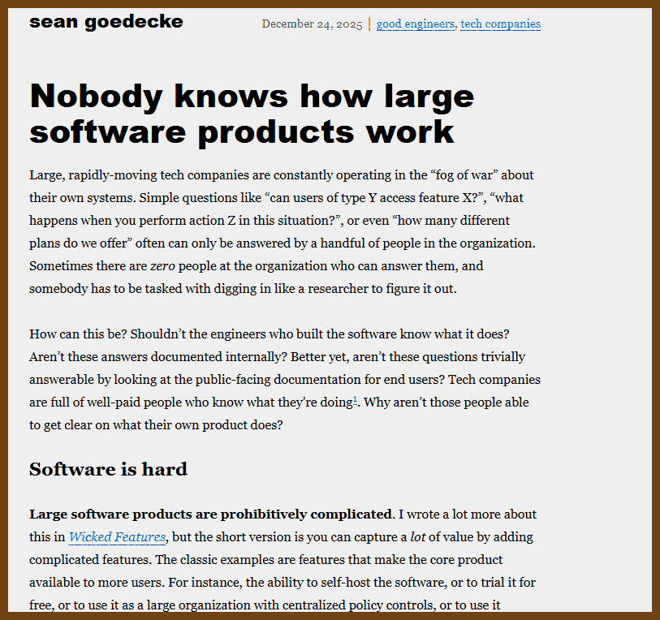
>
> Big software products become hard to understand because growth usually means adding options that widen the audience: enterprise controls, compliance, localization, billing variants, trials, and many special cases.
>
> Each new option changes the meaning of existing features, so the overall behavior becomes a mesh of conditions and exceptions rather than a single clear rule set.
>
> At that scale, many questions cannot be answered from memory or docs; the practical source of truth is often the code, plus experiments to see what happens in real environments.
>
> Keeping complete, accurate documentation is usually infeasible because the system changes faster than teams can write, review, and maintain descriptions of every interaction.
>
> A lot of behavior is not explicitly designed in one place; it emerges from many local decisions and defaults interacting, so "documenting it" often means discovering it.
>
> Because understanding decays when ownership changes or people leave, organizations repeatedly pay the cost of re-investigation, and engineers who can reliably trace and explain behavior become disproportionately valuable.
>
> *~~ GPT 5.2 brainstorming ~~* 
>
>
> ---
>
> Treat **"how does it work"** questions as first-class work, not as interruptions. Make a visible queue for them, timebox investigations, and record the answer where future readers will actually look (runbook, ownership doc, or an internal Q and A page tied to the repo). If you do not create a home for answers, the organization will keep paying the same investigation cost.
>
> Set explicit boundaries for complexity before you add more surface area. When someone proposes a new audience-expanding capability (trial variants, enterprise policy, compliance mode, region-specific behavior), require them to also name the ownership model, the invariant it must not break, and the **cross-cutting areas** it touches:
>
> - authz
> - billing
> - data retention
> - permissions 
> - UI, 
> - APIs
>
> If that extra work cannot be staffed, defer the feature or narrow it.
>
> Prefer designs that localize rules rather than sprinkling conditions everywhere. Centralize entitlement and policy decisions behind a small number of well-named interfaces and treat them as critical infrastructure with tests and monitoring. Avoid copying "if customer has X then Y" logic across services, UI layers, and scripts, because that is how the system turns into an untraceable tangle.
>
> > Localize rules means keep one decision in one place, not duplicated across the product.
>
> Make "explainability" a design requirement. Every major user-visible decision should have a reason code that can be logged, surfaced to support, and traced back to a single decision point. This turns investigations from archaeology into lookup: you can answer "why did it deny access" by reading the reason and following a link.
>
> > Explainability means the system can tell you why it made a decision.
>
> Invest in a small set of canonical sources of truth, and be ruthless about what is not canonical. For example, code and automated tests are canonical; a wiki page is not unless it is owned, reviewed, and updated with changes. When people ask for "documentation", decide whether you need durable truth (tests, typed schemas, contract checks) or just a short-lived explanation (a note in an incident channel).
>
> Use tests to document the behavior you care about, not everything. Write high-level contract tests for the most expensive-to-relearn areas: entitlements, billing state transitions, permissions, data deletion, compliance modes, and migrations. The goal is not more test coverage; it is protecting the system against silent drift in the places where drift creates confusion and risk.
>
> > Contract test means a test that asserts the externally visible behavior stays the same.
>
> Turn emergent behavior into intentional behavior where it matters. If something "just happens" because of interacting defaults, and customers rely on it, promote it to an explicit rule with an owner, a test, and a clear place in the code. If it is accidental and harmful, add guardrails that prevent it from reappearing.
>
> Manage knowledge loss by making ownership concrete and durable. Assign an accountable owner for each cross-cutting domain (authz, billing, data lifecycle, compliance), keep an oncall or escalation path, and require a handoff checklist when teams change. Reorgs will still happen, but you can avoid re-learning the same things from scratch.
>
> Treat investigations as an engineering skill and teach it directly. Provide playbooks for reading logs, reproducing production behavior safely, tracing through services, and using feature flags to isolate paths. Review "investigation writeups" the same way you review code: what evidence was used, what was ruled out, and what changed in the system to prevent recurrence.
>
> > Investigation playbook means a repeatable method for finding the real cause of behavior.
>
> Instrument the product so answers come from data instead of people. Log decision points with stable identifiers, record key inputs (tenant type, plan, flags, region, policy), and make those logs easy to query. When you can reconstruct the decision path from telemetry, you reduce dependence on tribal knowledge.
>
> Keep the number of variants smaller than it wants to be. Standardize on a limited set of plan types, policy knobs, and deployment modes, and aggressively retire rarely used branches. If you cannot delete variants, you should at least measure their usage and cost so the business can see the tradeoff.
>
> Create a "complexity budget" tied to revenue impact. For each cross-cutting feature, estimate ongoing cost (support, incidents, engineering time, cognitive load) and compare it to the expected value. This makes complexity a managed resource rather than an untracked byproduct of ambition.
>
> When documentation is necessary, make it executable or tightly coupled to change. Put key behavior in schemas, config definitions, and code comments that are enforced by review. For narrative docs, use ownership, review gates, and small scope: short runbooks for common questions beat long encyclopedias that rot.
>
> Make support and engineering share the same debugging artifacts. Provide a way for support to capture a "decision trace" (inputs and reason codes) that engineering can replay. This reduces back-and-forth and prevents engineers from having to start every investigation by reconstructing the scenario.
>
> Finally, accept that some ambiguity is structural, and optimize for fast, reliable rediscovery. If you cannot fully prevent the fog, build systems that let you cut through it quickly: centralized decision logic, reason codes, strong observability, and a habit of writing down answers where they will be reused.

2025-12-20 [abseil / Performance Hints](https://abseil.io/fast/hints.html) { abseil.io }

> 

2025-12-13 [AI Can Write Your Code. It Cant Do Your Job. Terrible Software](https://terriblesoftware.org/2025/12/11/ai-can-write-your-code-it-cant-do-your-job/) ✨ { terriblesoftware.org } ✨

> 
>
> If you’re reading this, you’re already thinking about this stuff. That puts you ahead. Here’s how to stay there:
>
> 1. **Get hands-on with AI tools.** Learn what they’re actually useful for. Figure out where they save you time and where they waste it. The engineers who are doing this now will be ahead.
> 2. **Practice the non-programming parts.** Judgment, trade-offs, understanding requirements, communicating with stakeholders. These skills matter more now, not less.
> 3. **Build things end-to-end.** The more you understand the full picture, from requirements to deployment to maintenance, the harder you are to replace.
> 4. **Document your impact, not your output.** Frame your work in terms of problems solved, not lines of code written.
> 5. **Stay curious, not defensive.** The engineers who will struggle are the ones who see AI as a threat to defend against rather than a tool to master.
>
> ------
>
> The shape of the work is changing: some tasks that used to take hours now take minutes, some skills matter less, others more.
>
> But different isn’t dead. The engineers who will thrive understand that their value was never in the typing, but in the thinking, in knowing which problems to solve, in making the right trade-offs, in shipping software that actually helps people.
>
> **OpenAI and Anthropic could build their own tools. They have the best AI in the world. Instead, they’re spending billions on engineers. That should tell you something.**

2025-12-07 [The Math of Why You Can't Focus at Work | Off by One](https://justoffbyone.com/posts/math-of-why-you-cant-focus-at-work/) { justoffbyone.com }

> 
>
> found in: **Leadership in Tech** [Why you can't focus at work](https://leadershipintech.com/newsletters/2174?sid=ab2b8c9b-63e9-4848-8b74-841f518d2188)
>
> > 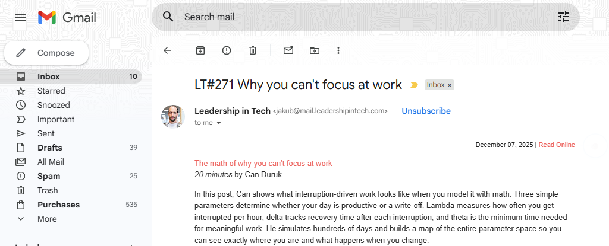

2025-11-28 [How good engineers write bad code at big companies](https://www.seangoedecke.com/bad-code-at-big-companies/) { www.seangoedecke.com }

> 
>
> ---
>
>
> Bad code at large tech companies emerges not from weak engineers but from structural pressures like constant team churn, tight deadlines, and unfamiliar legacy systems that force competent people to write quick, imperfect fixes.
>
>
> Short engineer tenure combined with decade-old codebases means most changes are made by relative beginners who lack deep context, making messy or fragile solutions an inevitable byproduct of the environment.
>
>
> Code quality depends heavily on a small group of overloaded experts who informally guard the system, but because companies rarely reward long-term ownership, their influence is fragile and inconsistently applied.
>
>
> Big tech intentionally optimizes for organizational legibility  ([*Seeing like a software company*](https://www.seangoedecke.com/seeing-like-a-software-company)) and engineer fungibility over deep expertise, creating conditions where hacky code is a predictable side effect of easy reassignability and constant reprioritization.
>
>
> Individual engineers have limited power to counteract these structural forces, so the most effective strategy is to become an "old hand" who selectively blocks high-risk decisions while accepting that not all ugliness is worth fighting.
>
>
> Most big-company work is impure engineering driven by business constraints rather than technical elegance, so ugly-but-working code is often the rational outcome rather than a failure of ability or care.
>
>
> Public ridicule of bad big-company code usually misattributes blame to an individual rather than recognizing that the organization’s incentives, review bandwidth, and churn make such outcomes routine.
>
>
> Improving quality meaningfully requires leadership to change incentives, stabilize ownership, and prioritize expertise, because simply hiring better engineers cannot overcome a system designed around speed and reassignability.

2025-11-28 [Feedback doesn't scale | Another Rodeo](https://another.rodeo/feedback/) { another.rodeo }

> When you're leading a team of five or 10 people, feedback is pretty easy. It's not even really "feedback”: you’re just talking. You may have hired everyone yourself. You might sit near them (or at least sit near them virtually). Maybe you have lunch with them regularly. You know their kids' names, their coffee preferences, and what they're reading. So when someone has a concern about the direction you're taking things, they just... tell you.
>
> You trust them. They trust you. It's just friends talking. You know where they're coming from.
>
> At twenty people, things begin to shift a little. You’re probably starting to build up a second layer of leadership and there are multiple teams under you, but you're still fairly close to everyone. The relationships are there, they just may be a bit weaker than before. When someone has a pointed question about your strategy, you probably mostly know their story, their perspective, and what motivates them. The context is fuzzy, but it’s still there.
>
> Then you hit 100
>
> 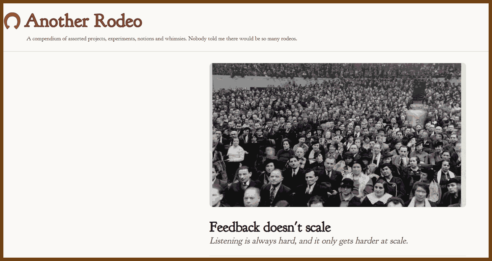

2025-11-28 [Tiger Style](https://tigerstyle.dev/) { tigerstyle.dev }

> **Tiger Style** is a coding philosophy focused on **safety**, **performance**, and **developer experience**. Inspired by the practices of TigerBeetle, it focuses on building robust, efficient, and maintainable software through disciplined engineering.
>
> **Summary**
>
> 1. [Core principles](https://tigerstyle.dev/#1-core-principles)
> 2. [Design goals](https://tigerstyle.dev/#2-design-goals)
>    1. [Safety](https://tigerstyle.dev/#2.1-safety)
>    2. [Performance](https://tigerstyle.dev/#2.2-performance)
>    3. [Developer experience](https://tigerstyle.dev/#2.3-developer-experience)
>
> 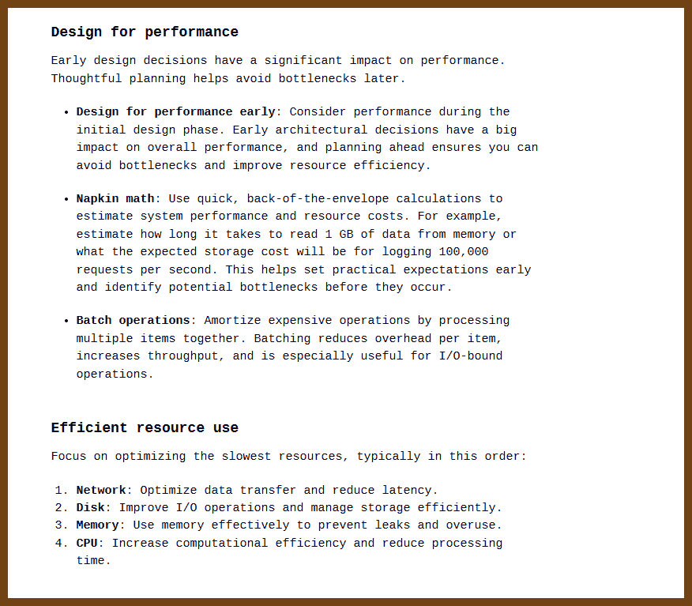

2025-11-09 [To get better at technical writing, lower your expectations](https://www.seangoedecke.com/technical-communication/) { www.seangoedecke.com }

> 
>
>
> ---
>
> Write for people who will not really read you. Put your main point in the first sentence and, if possible, in the title. Keep everything as short as you can. Drop most nuance and background. Say one clear thing for a broad audience, like "this is hard" or "this is slow." Reserve long, detailed docs for the tiny group of engineers who actually need all the details. Before you write, force yourself to express your idea in one or two sharp sentences, and build only the minimum around that.
>
> Do this because almost nobody will give your writing full attention. Most readers will glance at the first line, skim a bit, then stop. They do not share your context, they do not care as much as you do, and they do not have time. No document will transfer your full understanding or perfectly align everyone. Real understanding comes from working with the system itself. In that reality, a short, front-loaded note that lands a single important idea is far more useful than a long, careful essay that most people never finish.

2025-11-05 [Send this article to your friend who still thinks the cloud is a good idea](https://rameerez.com/send-this-article-to-your-friend-who-still-thinks-the-cloud-is-a-good-idea/) { rameerez.com }

> 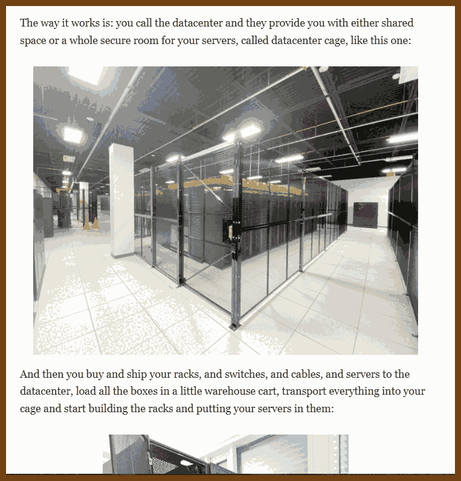

2025-11-02 [Your URL Is Your State](https://alfy.blog/2025/10/31/your-url-is-your-state.html) { alfy.blog }

> 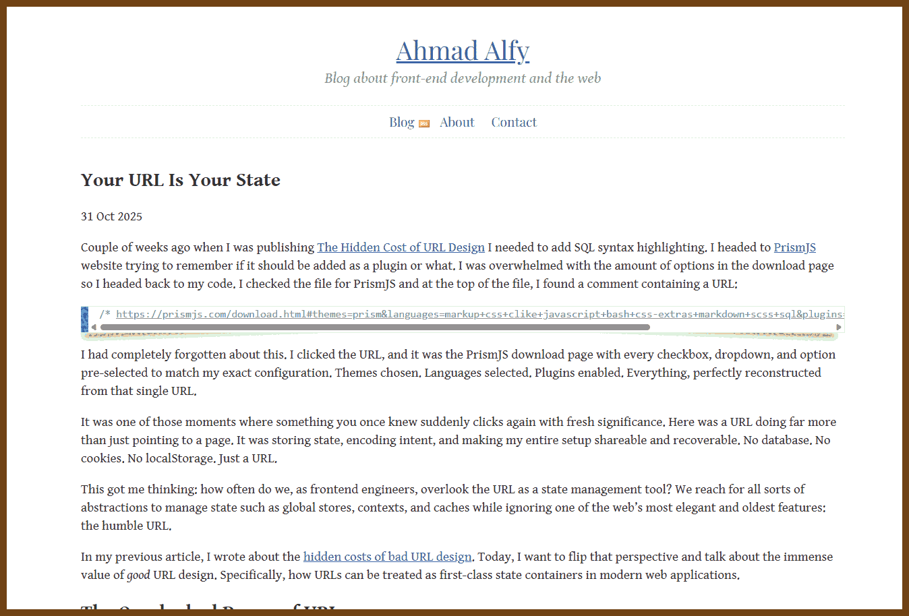
>
> Couple of weeks ago when I was publishing [The Hidden Cost of URL Design](https://alfy.blog/2025/10/16/hidden-cost-of-url-design.html) I needed to add SQL syntax highlighting. I headed to [PrismJS](https://prismjs.com/) website trying to remember if it should be added as a plugin or what. I was overwhelmed with the amount of options in the download page so I headed back to my code. I checked the file for PrismJS and at the top of the file, I found a comment containing a URL:
>
> ```javascript
> /* https://prismjs.com/download.html#themes=prism&languages=markup+css+clike+javascript+bash+css-extras+markdown+scss+sql&plugins=line-highlight+line-numbers+autolinker */
> ```
>
> I had completely forgotten about this. I clicked the URL, and it was the PrismJS download page with every checkbox, dropdown, and option pre-selected to match my exact configuration. Themes chosen. Languages selected. Plugins enabled. Everything, perfectly reconstructed from that single URL.
>
> It was one of those moments where something you once knew suddenly clicks again with fresh significance. Here was a URL doing far more than just pointing to a page. It was storing state, encoding intent, and making my entire setup shareable and recoverable. No database. No cookies. No localStorage. Just a URL.
>
> This is scary:
>
> 

2025-11-04 [hwayne/awesome-cold-showers: For when people get too hyped up about things](https://github.com/hwayne/awesome-cold-showers) { github.com }

> 


## 🪻 Bloom Filter

2025-11-25 [Bloom filters: the niche trick behind a 16× faster API | Blog | incident.io](https://incident.io/blog/bloom-filters/) { incident.io }

> 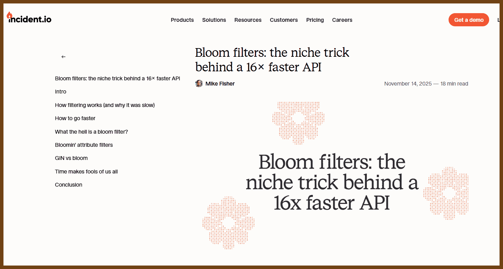
>
> The goal of the optimization is to reduce the cost of fetching and decoding data by pushing as much of the filtering as possible into Postgres itself, specifically by making better use of the JSONB attribute data so that fewer irrelevant rows ever reach the application.
>
> Two approaches are considered: using a GIN index on the JSONB column, which is the standard Postgres solution for complex types, or introducing a custom encoding where attribute values are turned into bit strings so the database can perform fast bitwise membership checks instead.
>
> A bloom filter is introduced as the core idea of the second approach: a probabilistic data structure that can say an item is definitely not in a set or might be in it, with the benefit of very efficient use of time and space.
>
> > A bloom filter is a compact data structure that lets you test set membership quickly by allowing some false positives but no false negatives.

2025-12-15 [Bloom Filters](https://www.jasondavies.com/bloomfilter/) { www.jasondavies.com }

> 
>
> 2025-12-15 [jasondavies/bloomfilter.js: JavaScript bloom filter using FNV for fast hashing](https://github.com/jasondavies/bloomfilter.js) { github.com }
>
> [FNV Hash](http://www.isthe.com/chongo/tech/comp/fnv/#FNV-reference-source)
>
> 2025-12-15 [lcn2/fnv: FNV hash tools](https://github.com/lcn2/fnv) { github.com }
>
> **Fowler/Noll/Vo hash**
>
> The basis of this hash algorithm was taken from an idea sent as reviewer comments to the IEEE POSIX P1003.2 committee by:
>
> [Phong Vo](http://www.research.att.com/info/kpv) [Glenn Fowler](http://www.research.att.com/~gsf/)
>
> In a subsequent ballot round [Landon Curt Noll](http://www.isthe.com/chongo) improved on their algorithm. Some people tried this hash and found that it worked rather well. In an email message to Landon, they named it the `Fowler/Noll/Vo` or FNV hash.
>
> FNV hashes are designed to be fast while maintaining a low collision rate. The FNV speed allows one to quickly hash lots of data while maintaining a reasonable collision rate. See http://www.isthe.com/chongo/tech/comp/fnv/index.html for more details as well as other forms of the FNV hash. Comments, questions, bug fixes and suggestions welcome at the address given in the above URL.


## 😁 Fun / Retro

2025-12-09 [Legacy Update: Get back online, activate, and install updates on your legacy Windows PC](https://legacyupdate.net/) { legacyupdate.net }

> 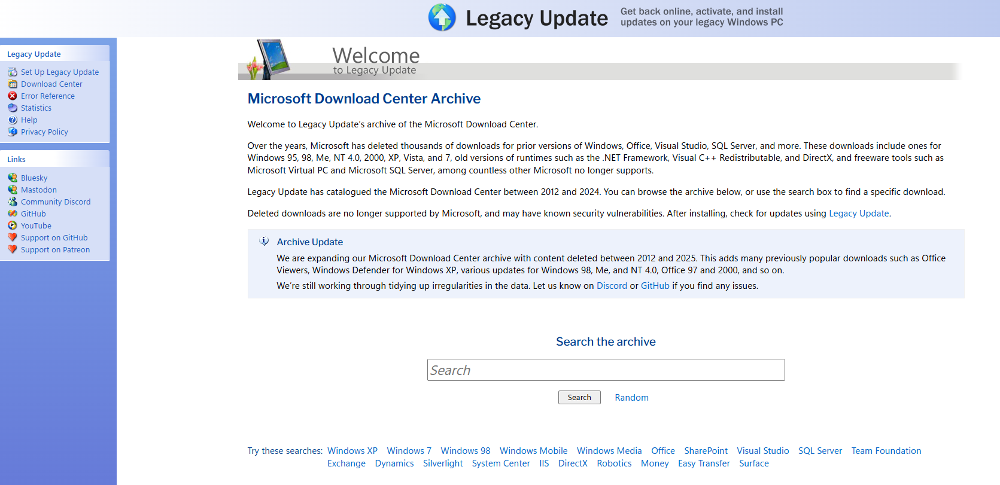
>
> 
>
> 2025-12-09 [Legacy Update](https://github.com/LegacyUpdate) { github.com }
> 

2025-11-29 [Mac OS 9 Images < Mac OS 9 Lives](https://macos9lives.com/downloads-macos9) { macos9lives.com }

> 
> 2025-11-29 [Tiernan's Comms Closet How to Set Up Mac OS 9 on QEMU](https://www.tiernanotoole.ie/2024/12/11/how-to-set-up-mac-os-9-on-qemu.html) { www.tiernanotoole.ie }


## 👂 The Ear of AI (LLMs)

2025-12-24 [Tencent-Hunyuan/AutoCodeBenchmark](https://github.com/Tencent-Hunyuan/AutoCodeBenchmark) { github.com }

> 

2025-12-23 [The Illustrated Transformer Jay Alammar Visualizing machine learning one concept at a time.](https://jalammar.github.io/illustrated-transformer/) { jalammar.github.io }

> Discussions: [Hacker News (65 points, 4 comments)](https://news.ycombinator.com/item?id=18351674), [Reddit r/MachineLearning (29 points, 3 comments)](https://www.reddit.com/r/MachineLearning/comments/8uh2yz/p_the_illustrated_transformer_a_visual_look_at/)
> Translations: [Arabic](https://www.mundhor.site/post/post14), [Chinese (Simplified) 1](https://blog.csdn.net/yujianmin1990/article/details/85221271), [Chinese (Simplified) 2](https://blog.csdn.net/qq_36667170/article/details/124359818), [French 1](https://a-coles.github.io/2020/11/15/transformer-illustre.html), [French 2](https://lbourdois.github.io/blog/nlp/Transformer/), [Italian](https://medium.com/@val.mannucci/il-transformer-illustrato-it-37a78e3e2348), [Japanese](https://tips-memo.com/translation-jayalmmar-transformer), [Korean](https://nlpinkorean.github.io/illustrated-transformer/), [Persian](http://dml.qom.ac.ir/2022/05/17/illustrated-transformer/), [Russian](https://habr.com/ru/post/486358/), [Spanish 1](https://www.ibidemgroup.com/edu/transformer-ilustrado-jay-alammar/), [Spanish 2](https://hackernoon.com/el-transformador-ilustrado-una-traduccion-al-espanol-0y73wwp), [Vietnamese](https://trituenhantao.io/tin-tuc/minh-hoa-transformer/)
> Watch: MIT’s [Deep Learning State of the Art](https://youtu.be/53YvP6gdD7U?t=432) lecture referencing this post
> Featured in courses at [Stanford](https://web.stanford.edu/class/cs224n/), [Harvard](https://scholar.harvard.edu/binxuw/classes/machine-learning-scratch/materials/transformers), [MIT](https://ocw.mit.edu/courses/6-s897-machine-learning-for-healthcare-spring-2019/d39a6eed387ee90b1f72a01949c35c7b_MIT6_S897S19_lec8.pdf), [Princeton](https://www.cs.princeton.edu/courses/archive/fall22/cos597G/), [CMU](https://www.cs.cmu.edu/~leili/course/mldl22w/14-Transformer.pdf) and others
>
> 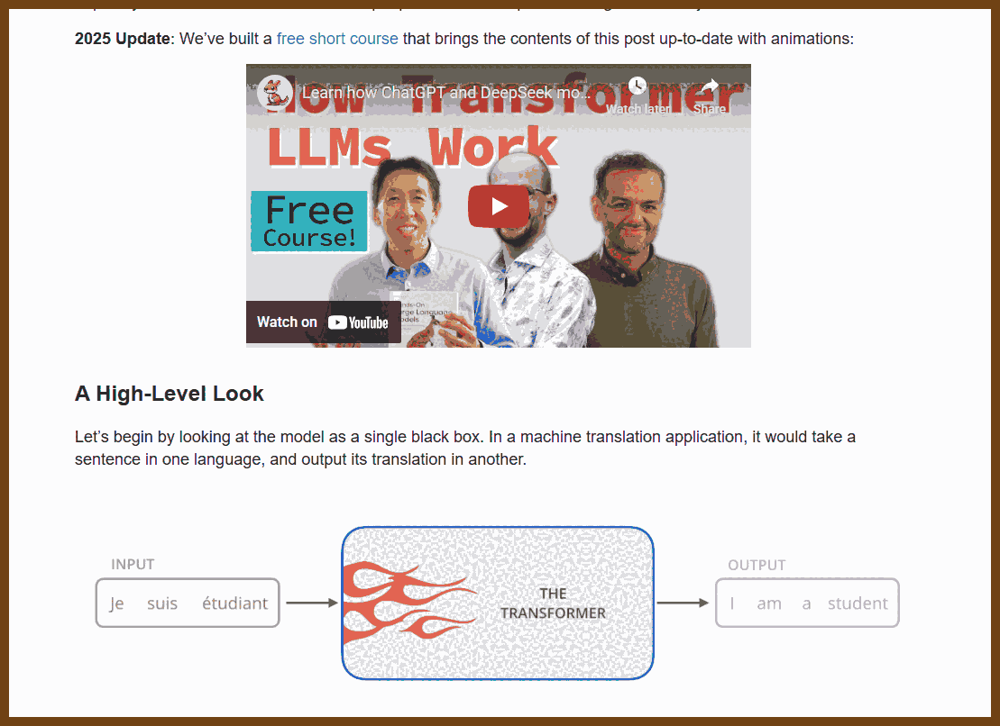
> 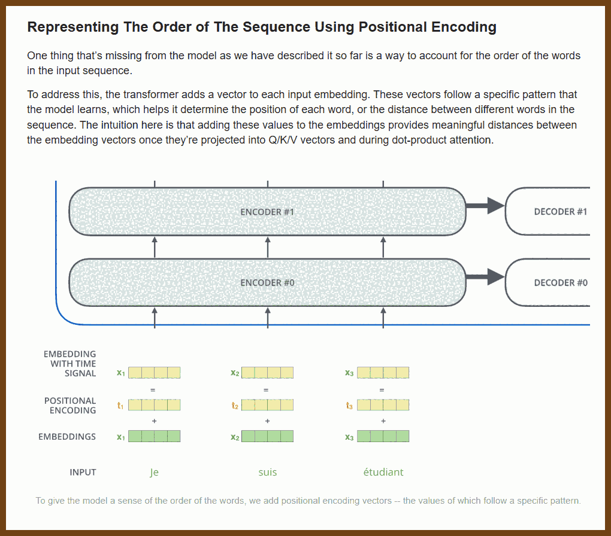

2025-12-23 [Scaling LLMs to larger codebases - Kieran Gill](https://blog.kierangill.xyz/oversight-and-guidance) { blog.kierangill.xyz }

> 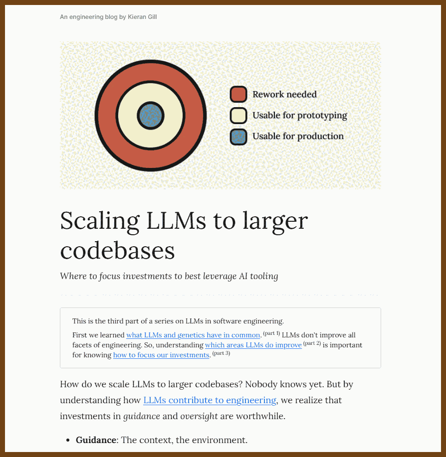
>
> ---
>
> This was the third part of a series on LLMs in software engineering.
>
> First we learned [what LLMs and genetics have in common](https://blog.kierangill.xyz/how-hype-works.html). (part 1) LLMs don't simply improve all facets of engineering. Understanding [which areas LLMs do improve](https://blog.kierangill.xyz/ai-strengths-and-limitations-in-engineering.html) (part 2) is important for knowing [how to focus our investments](https://blog.kierangill.xyz/oversight-and-guidance.html). (part 3)
>
> ---
>
> Invest in reusable context that makes the model behave like someone who already knows your codebase, so prompts can stay focused on requirements instead of restating conventions every time.
>
> > A prompt library is reusable context you give a model so it follows your codebase conventions.
>
> Aim for workflows where output is usable in one pass, because the main cost comes from rework when you have to repeatedly intervene and patch what it produced.
>
> > One-shotting is getting a usable solution from a model in a single attempt.
>
> Reduce hidden complexity in the system first, because accumulated compromises make every change harder for both humans and tools, which limits automation gains.
>
> > Technical debt is accumulated design and code compromises that make future changes harder and riskier.
>
> Structure the system into clear, independent parts with stable boundaries, so changes can be localized and the context needed for edits stays small and high-quality.
>
> > Modularity is organizing software into well-defined parts that can be understood and changed independently.
>
> Treat quality and safety as a checking problem, not a prompting problem, and build verification into the process because instructions do not guarantee the code actually meets the intent.
>
> > Verification is the process of checking that changes are correct, safe, and meet requirements.
>
>
> ---

> **Aside**: Example usage of a prompt library.

```
You are helping me build a new feature. 
Here is the relevant documentation to onboard yourself to our system:
- @prompts/How_To_Write_Views.md -- Our conventions and security practices for sanitizing inputs.
- @prompts/How_To_Write_Unit_Tests.md -- Features should come with tests. Here are docs on creating test data and writing quality tests.
- @prompts/Testing_Best_Practices.md -- How to make a test readable. When to DRY test data creation.
- @prompts/The_API_File.md -- How to find pre-existing functionality in our system.

Feature request:

Extend our scheduler to allow for bulk uploads. 
- This will happen via a csv file with the format `name,start_time,end_time`. 
- Times are given in ET. 
- Please validate the user exists and that the start and end times don't overlap. You should also make sure there are no pre-existing events for a given row; we don't want duplicates. 
- I recommend by starting in @server/apps/scheduler/views.py`. 
```

> Or, better yet, the preamble is preloaded into the models context (for example, by using `CLAUDE.md`).

> Your prompt should be thorough enough to guide the LLM to the right choices. But verification is required. **Read every line of generated code**. Just because you told an LLM to sanitize inputs, doesn't mean it actually did.

2025-12-09 [Has the cost of building software just dropped 90%? - Martin Alderson](https://martinalderson.com/posts/has-the-cost-of-software-just-dropped-90-percent/) { martinalderson.com }

> 
>
> ---
>
> **Domain knowledge is the only moat**
>
> So where does that leave us? Right now there is still enormous value in having a human 'babysit' the agent - checking its work, suggesting the approach and shortcutting bad approaches. Pure YOLO vibe coding ends up in a total mess very quickly, but with a human in the loop I think you can build incredibly good quality software, *very* quickly.
>
> This then allows developers who really master this technology to be hugely effective at solving business problems. Their domain and industry knowledge becomes a huge lever - knowing the best architectural decisions for a project, knowing which framework to use and which libraries work best.
>
> Layer on understanding of the business domain and it does genuinely feel like the mythical 10x engineer is here. Equally, the pairing of a business domain expert with a motivated developer and these tools becomes an incredibly powerful combination, and something I think we'll see becoming quite common - instead of a 'squad' of a business specialist and a set of developers, we'll see a far tighter pairing of a couple of people.
>
> This combination allows you to iterate incredibly quickly, and software becomes almost disposable - if the direction is bad, then throw it away and start again, using those learnings. This takes a fairly large mindset shift, but the hard work is the *conceptual thinking*, not the typing.

2025-12-09 [AI should only run as fast as we can catch up Higashi.blog](https://higashi.blog/2025/12/07/ai-verification/) { higashi.blog }

> 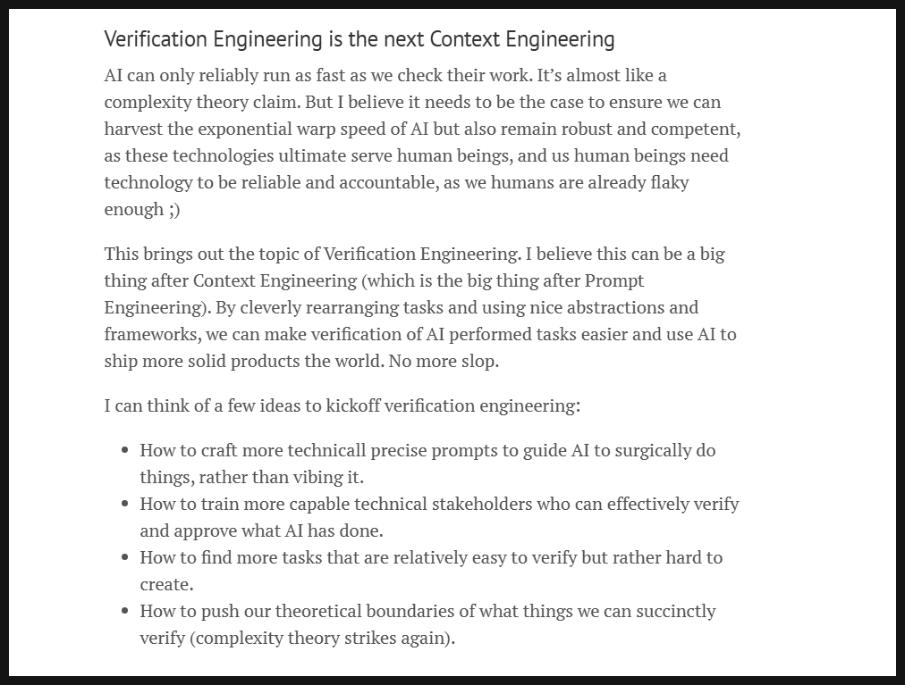

2025-12-02 [Codex, Opus, Gemini try to build Counter Strike](https://www.instantdb.com/essays/agents_building_counterstrike) { www.instantdb.com }

> 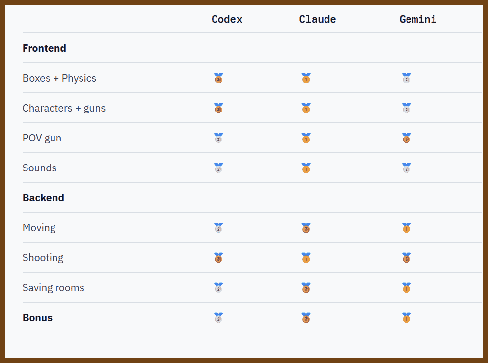
>
> 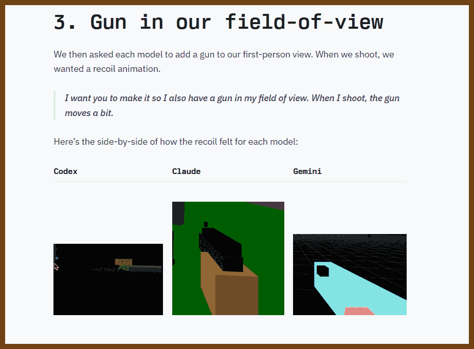

2025-11-29 [So you wanna build a local RAG?](https://blog.yakkomajuri.com/blog/local-rag) { blog.yakkomajuri.com }

> When we launched [Skald](https://github.com/skaldlabs/skald), we wanted it to not only be self-hostable, but also for one to be able to run it without sending any data to third-parties.
>
> With LLMs getting better and better, privacy-sensitive organizations shouldn't have to choose between being left behind by not accessing frontier models and doing away with their committment to (or legal requirement for) data privacy.
>
> So here's what we did to support this use case and also some benchmarks comparing performance when using proprietary APIs vs self-hosted open-source tech.
>
> 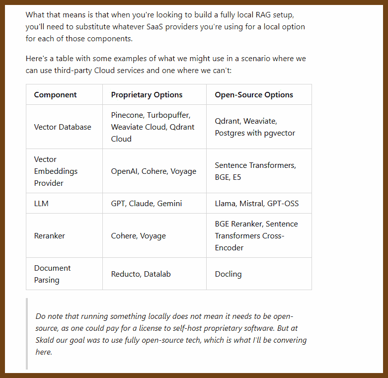

2025-11-28 [InstaVM - Secure Code Execution Platform](https://instavm.io/blog/llm-anti-patterns) { instavm.io }

> 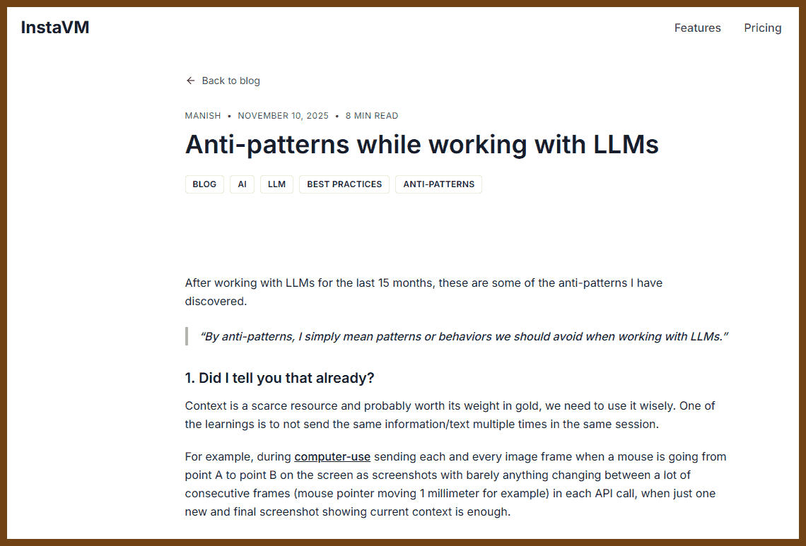
>
> LLMs perform more reliably when you avoid sending redundant or unchanged context.
> LLMs handle exact or brittle tasks poorly, so shift precision work into generated code or external tools.
> Long prompts degrade accuracy, making it essential to keep context well below the model`s limits.
> Models struggle with obscure or rapidly evolving topics unless you supply up-to-date, targeted documentation.
> AI-generated code remains fallible, requiring disciplined human review to prevent security and correctness issues.

2025-11-27 [addyosmani/gemini-cli-tips: Gemini CLI Tips and Tricks](https://github.com/addyosmani/gemini-cli-tips) { github.com }

> 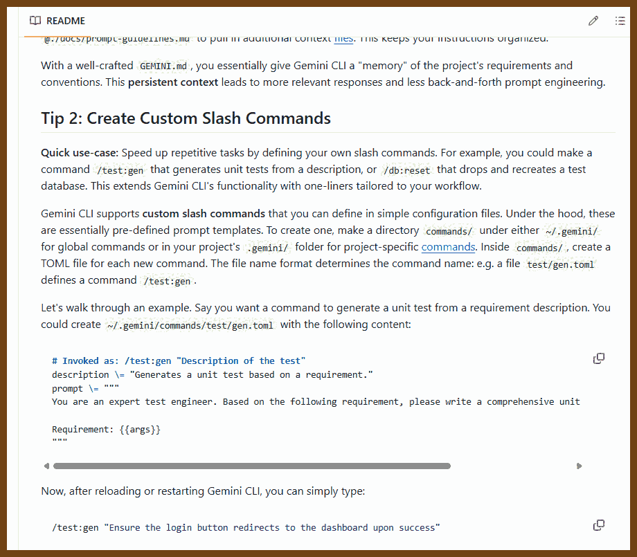
> **This guide covers ~30 pro-tips for effectively using Gemini CLI for agentic coding**
>
> **[Gemini CLI](https://github.com/google-gemini/gemini-cli)** is an open-source AI assistant that brings the power of Google's Gemini model directly into your [terminal](https://www.philschmid.de/gemini-cli-cheatsheet#:~:text=The Gemini CLI is an,via a Gemini API key). It functions as a conversational, "agentic" command-line tool - meaning it can reason about your requests, choose tools (like running shell commands or editing files), and execute multi-step plans to help with your development [workflow](https://cloud.google.com/blog/topics/developers-practitioners/agent-factory-recap-deep-dive-into-gemini-cli-with-taylor-mullen#:~:text=The Gemini CLI  is,understanding of the developer workflow).
>
> In practical terms, Gemini CLI acts like a supercharged pair programmer and command-line assistant. It excels at coding tasks, debugging, content generation, and even system automation, all through natural language prompts. Before diving into pro tips, let's quickly recap how to set up Gemini CLI and get it running.

2025-11-15 [Anthropic admits that MCP sucks - YouTube](https://www.youtube.com/watch?v=1piFEKA9XL0) { www.youtube.com }

> 
>
> 
>
> 2025-11-15 [Code execution with MCP: building more efficient AI agents \ Anthropic](https://www.anthropic.com/engineering/code-execution-with-mcp) { www.anthropic.com }
> The core problem is context bloat. MCP clients typically load all tool definitions into the system prompt, then run multi step flows like gdrive.find_document followed by gdrive.get_document, then another tool, and so on. Every tool definition and every intermediate result lives in the context window, so each new tool call resends the whole history as input tokens. This quickly explodes into hundreds of thousands of tokens, increases latency, raises costs, and raises the chance of mistakes. Real world setups like Trey show agents with dozens of tools, including irrelevant ones like Supabase for users who do not even use it, which only adds noise.
>
> Anthropic’s proposed fix is to treat MCP servers as code APIs and let the model write code that calls them from a sandboxed execution environment, usually using TypeScript. Tools become normal functions in a file tree, and the model discovers and imports only what it needs. Most of the heavy lifting happens in code, not in the LLM context. That cuts token usage dramatically, makes workflows faster, and lets the model leverage what it is actually good at, which is writing and navigating code rather than juggling hundreds of tool definitions and transcripts.
>
> This code first approach also solves privacy, composition, and state in a more normal way. Large documents, big tables, and joined data can be filtered, aggregated, and matched in code, then only the small, relevant results are sent back to the model. Sensitive fields can be tokenized before they ever reach the LLM and untokenized only when communicating between backends like Google Sheets and Salesforce. State can live in memory or in files, and reusable workflows can be saved as functions or skills, which starts to look a lot like conventional SDKs and libraries.
