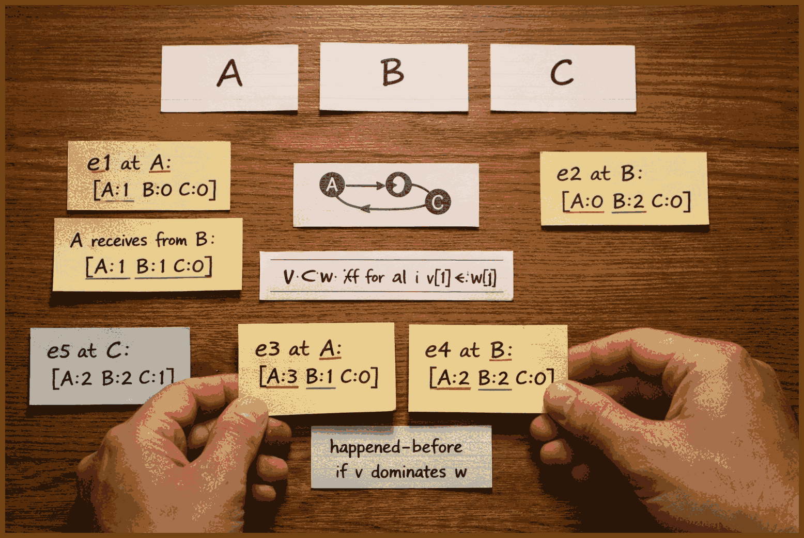
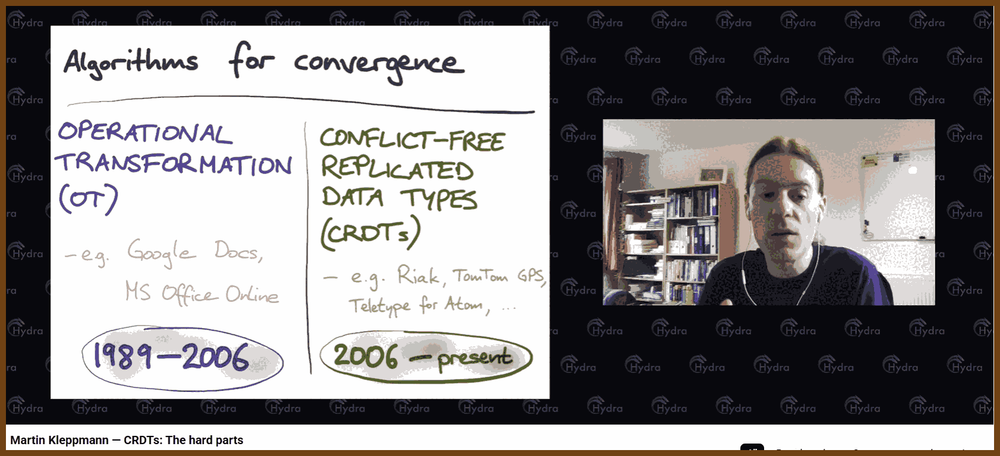
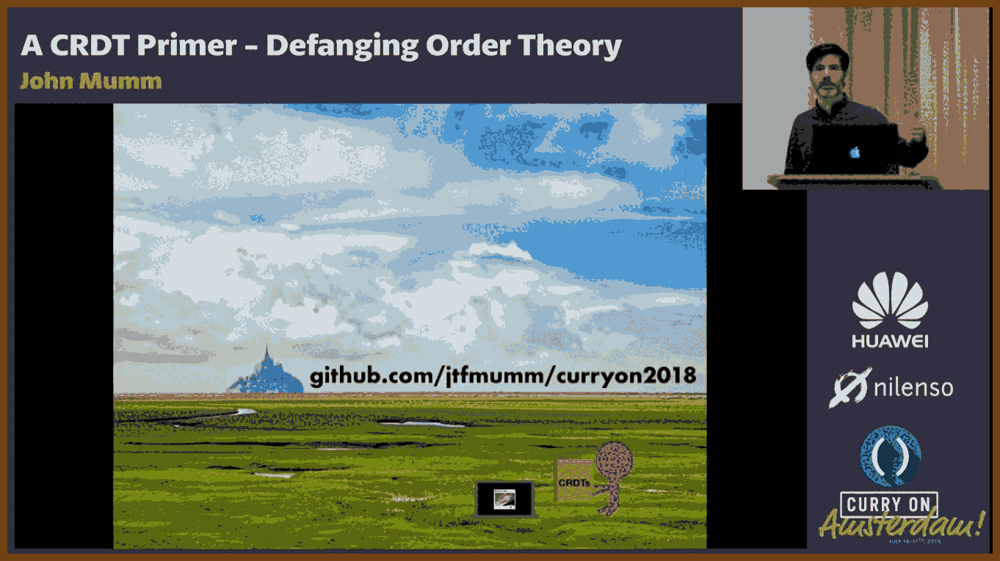
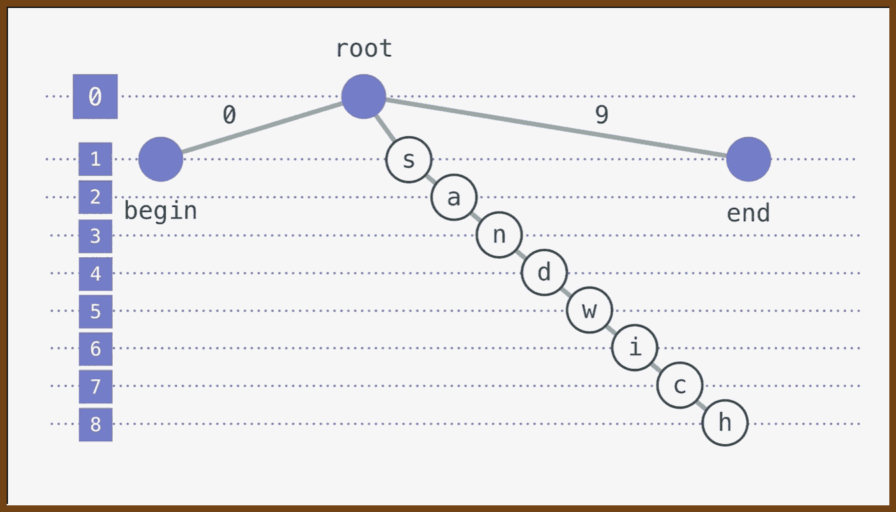
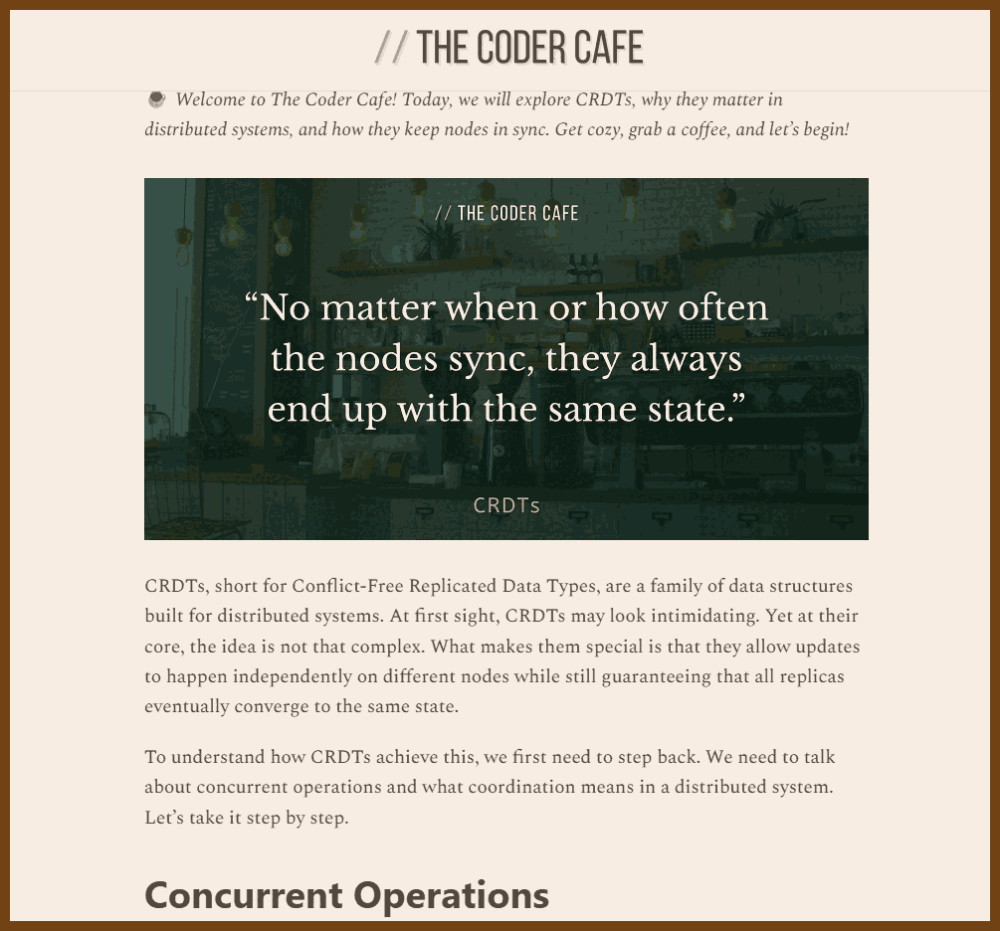
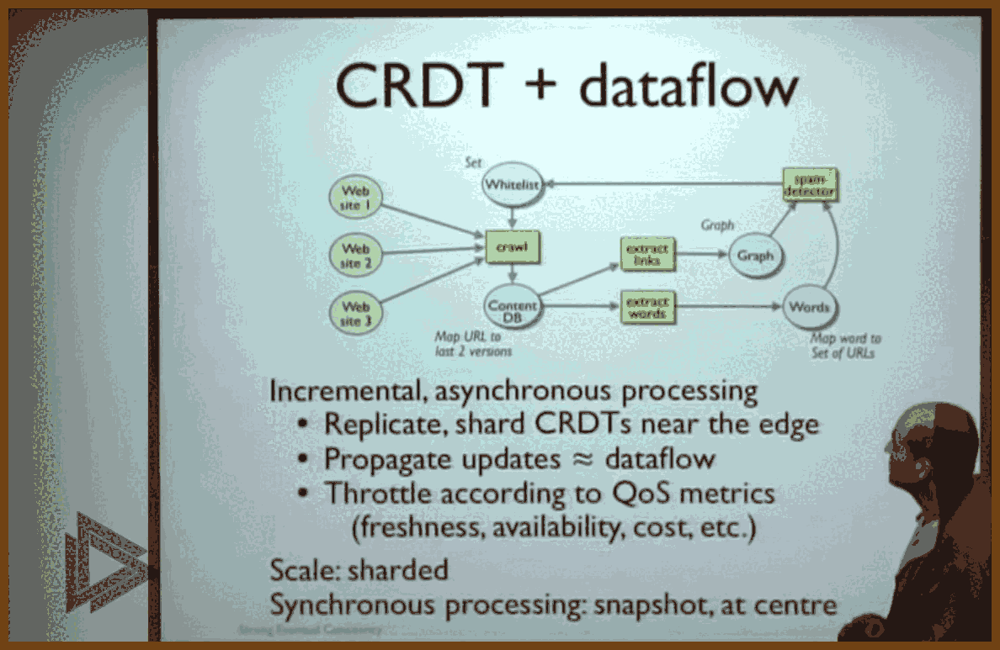

---
layout: post
title:  "Links from my inbox 2026-01-10"
date:   2026-01-10T00:12:00-08:00
categories: links
---

## CRDT

🏵️ 2025-11-29 [The CRDT Dictionary: A Field Guide to Conflict-Free Replicated Data Types - Ian Duncan - Ian Duncan](https://www.iankduncan.com/engineering/2025-11-27-crdt-dictionary/) { www.iankduncan.com }

> 
> 
>
> ---
>
> Explains how to design and use conflict free replicated data types to handle concurrent updates without coordination, walking through the core idea of lattices and monotone joins, state based vs operation based variants, and concrete structures for counters, sets, registers, maps, and sequences. Shows how different semantics arise (grow only, two phase, last write wins, add wins, multi value) and how to compose these pieces into practical data structures like shopping carts, collaborative text, and replicated maps, including causal and delta based optimizations.
>
> Digs into the real tradeoffs: metadata growth, tombstones, garbage collection, causal tracking, bandwidth, and the need for supporting protocols like causal broadcast. Stresses that nothing is free; each structure trades coordination for more state and weaker semantics, so the right choice depends on operations needed, tolerance for lost updates, and operational constraints, with a strong push to treat CRDTs as a targeted tool to be combined and tuned rather than a default magic solution.
>
> ---
>
> - G-Counter: Grow-only counter where each replica keeps its own count and merge takes per-replica max; use for monotonic metrics like page views, likes, or any count that only increases.
> - PN-Counter: Counter built from two G-Counters (increments and decrements) whose values are subtracted; use for inventory, resource pools, or any count that must go up and down.
> - G-Set: Grow-only set that supports add and merge=union but no removals; use for append-only collections like tag registries, logs of seen items, or immutable membership.
> - 2P-Set: Two-phase set with separate grow-only add and remove sets where removal is permanent; use when elements can be created then permanently retired but never re-added (e.g., tombstones, revoked IDs).
> - LWW-Element-Set: Set that tracks per-element add/remove timestamps and lets the latest operation win; use when you need add/remove/re-add and can tolerate last-write-wins data loss (preferences, feature flags, cached sets).
> - OR-Set: Observed-remove set that tracks per-element tags so removes only delete observed additions, giving add-wins semantics; use when concurrent adds must never be lost (collaborative lists, shopping carts, shared sets).
> - LWW-Register: Single-value cell with a timestamped value where the latest timestamp wins; use for fields where occasional lost concurrent updates are acceptable (profile fields, cached config).
> - MV-Register: Multi-value register that stores all concurrent writes instead of discarding them; use when you must detect and resolve conflicts in application logic (collaborative text fields, conflict-aware configs).
> - Causal Register: Register keyed by version vectors that keeps only values with concurrent causal histories; use when you want MV-Register behavior plus precise causal conflict detection and better GC.
> - OR-Map: Map whose keys and/or values are backed by OR-Set semantics, often with nested CRDTs per value; use for replicated JSON-like documents, distributed configuration maps, and nested structures.
> - RGA (Replicated Growable Array): Sequence where elements have immutable IDs and parent links, supporting inserts-after and tombstoned deletes; use for collaborative text or lists where arbitrary-position inserts must merge cleanly.
> - WOOT: Sequence CRDT representing characters as objects with prev/next links and visibility flags, resolving order via constraints; use mainly as a historical or academic model, not typically in new production systems.
> - Logoot: Sequence CRDT assigning each element a dense ordered position identifier; use for collaborative sequences when you prefer position-based ordering over pointer-based structures.
> - LSEQ: Variant of Logoot with adaptive position allocation to keep identifiers shorter; use as a practical improvement over plain Logoot when identifier growth is a concern.
> - Tree CRDTs: Family of structures for replicated trees that preserve parent-child relationships under concurrency; use when you truly need CRDT-level guarantees over hierarchical data like file trees or document outlines.
> - OR-Tree: Tree CRDT that stores an OR-Set of parents per node and resolves parent conflicts with policies like LWW or first-wins; use for replicated hierarchies where concurrent moves must be reconciled automatically.
> - CRDT-Tree: Tree design that relies on causal ordering of move operations to pick winners; use when you already enforce causal delivery and want deterministic, causality-driven resolution of structural conflicts.
> - Log-based Trees: Tree approach that logs operations and rebuilds structure on read from a replicated log; use when reads can afford reconstruction cost and you want simple, append-only operational histories.
> - Delta CRDTs: Any state-based CRDT extended with a delta mechanism that sends only changes instead of full state; use whenever state is large or bandwidth is a concern, especially in production systems.
> - Causal CRDTs (e.g., Causal OR-Set, causal maps): CRDTs augmented with version vectors or similar clocks to track happens-before and prune dominated history; use when you need precise conflict classification and safer garbage collection.
> - Causal OR-Set: OR-Set variant that attaches version vectors to tags and uses them to decide what metadata can be safely discarded; use for long-lived sets where tag GC matters and causal tracking is already in place.
> - CheckpointedCRDT: Wrapper pattern that periodically compacts history into a baseline snapshot plus recent deltas; use when most replicas are online often and you want aggressive pruning at the cost of occasional full resyncs.
> - Observed-Remove Shopping Cart (OR-Set + PN-Counter): Composite CRDT mapping products to PN-Counters under OR-Set semantics; use for offline-capable carts where concurrent adds/removes and quantity changes must merge without data loss.
>
>
> ---
>
> 1. The term “Conflict-free Replicated Data Type” was coined by Marc Shapiro, Nuno Preguiça, Carlos Baquero, and Marek Zawirski in their 2011 paper [“Conflict-free Replicated Data Types”](https://hal.inria.fr/inria-00609399v1/document) (technical report) and the 2011 SSS conference paper [“A comprehensive study of Convergent and Commutative Replicated Data Types”](https://hal.inria.fr/inria-00555588/document). The theoretical foundations draw from earlier work on commutative replicated data types and optimistic replication.
> 2. WOOT was introduced by Oster, Urso, Molli, and Imine in [“Data Consistency for P2P Collaborative Editing”](https://hal.inria.fr/inria-00108523/document) (2006). The name is a play on “OT” (Operational Transformation), emphasizing that it achieves similar goals “WithOut OT.” WOOT was one of the first practical sequence CRDTs and influenced many subsequent designs.
> 3. State-based CRDTs are also called “convergent” replicated data types (CvRDT). The “Cv” stands for “convergent” - emphasizing that replicas converge to the same state by repeatedly applying the join operation.
> 4. Operation-based CRDTs are also called “commutative” replicated data types (CmRDT). They require causal delivery of operations - if operation A happened before operation B on the same replica, B must not be delivered before A at any other replica.
> 5. The G-Counter appears in Shapiro et al.’s 2011 technical report [“A Comprehensive Study of Convergent and Commutative Replicated Data Types”](https://hal.inria.fr/inria-00555588/document) as one of the foundational examples demonstrating CRDT principles.
> 6. The space complexity is O(n) where n is the number of replicas, not the number of increments. This means G-Counters scale well with the number of operations but require tracking all replicas that have ever incremented the counter.
> 7. The OR-Set (Observed-Remove Set) was introduced by Shapiro et al. in their [2011 technical report](https://hal.inria.fr/inria-00555588/document). It’s also known as the “Add-Wins Set” because concurrent add and remove operations result in the element remaining in the set. The key innovation is using unique tags to distinguish between different additions of the same element. 
> 8. Sequence CRDTs are particularly challenging because positional indices change as elements are inserted or deleted. Unlike sets or counters where elements have stable identity, sequences must maintain ordering despite concurrent modifications at arbitrary positions.
> 9. RGA was introduced by Roh et al. in [“Replicated Abstract Data Types: Building Blocks for Collaborative Applications”](http://csl.skku.edu/papers/jpdc11.pdf) (2011). The name “Replicated Growable Array” emphasizes that it’s an array-like structure that can grow through replication.
> 10. YATA (Yet Another Transformation Approach) was developed by Kevin Jahns for the [Yjs](https://yjs.dev/) collaborative editing library. It combines ideas from RGA and WOOT while optimizing for the common case of sequential insertions (typing). Yjs is used in production by companies like Braid, Row Zero, and others for real-time collaboration.
> 11. Version vectors were introduced by Parker et al. in [“Detection of Mutual Inconsistency in Distributed Systems”](https://www.cs.purdue.edu/homes/bb/cs542-11Spr/Parker_TSE83.pdf) (1983). They extend [Lamport’s logical clocks](https://lamport.azurewebsites.net/pubs/time-clocks.pdf) to track causality in distributed systems. Each replica maintains a vector of logical clocks (one for each replica), enabling precise causal ordering without requiring synchronized physical clocks.
> 12. Delta CRDTs were introduced by Almeida, Shoker, and Baquero in [“Delta State Replicated Data Types”](https://arxiv.org/abs/1603.01529) (2018). They bridge the gap between state-based and operation-based CRDTs, achieving operation-based bandwidth efficiency while maintaining state-based simplicity. Most production CRDT systems ([Riak](https://riak.com/), [Automerge](https://automerge.org/)) use delta-state internally.
> 13. Logoot was introduced by Weiss, Urso, and Molli in [“Logoot: A Scalable Optimistic Replication Algorithm for Collaborative Editing”](https://hal.inria.fr/inria-00432368/document) (2009). The name combines “log” (logarithmic complexity) with “oot” from WOOT, its predecessor. Logoot’s position-based approach influenced many subsequent CRDTs including LSEQ and Treedoc.
> 14. LSEQ was introduced by Nédelec, Molli, Mostéfaoui, and Desmontils in [“LSEQ: An Adaptive Structure for Sequences in Distributed Collaborative Editing”](https://hal.archives-ouvertes.fr/hal-00921633/document) (2013). The key innovation is using different allocation strategies (boundary+ vs boundary-) based on tree depth, which keeps position identifiers shorter in practice compared to Logoot’s fixed strategy. 
> 15. [Automerge](https://automerge.org/), created by Martin Kleppmann and collaborators, implements a JSON CRDT described in [“A Conflict-Free Replicated JSON Datatype”](https://arxiv.org/abs/1608.03960) (2017). It uses a columnar encoding for efficiency and has been [rewritten in Rust](https://github.com/automerge/automerge) for performance. Used by production apps like [Inkandswitch’s Pushpin](https://www.inkandswitch.com/pushpin/). 
> 16. [Yjs](https://yjs.dev/), created by Kevin Jahns, is optimized for text editing and uses the YATA algorithm. It’s notably faster than Automerge for text operations and includes bindings for popular editors like [CodeMirror](https://codemirror.net/), [Monaco](https://microsoft.github.io/monaco-editor/), [Quill](https://quilljs.com/), and [ProseMirror](https://prosemirror.net/).
> 17. [Riak](https://riak.com/), a distributed database from Basho, was one of the first production systems to adopt CRDTs (2012). It implements counters, sets, and maps as [native data types](https://docs.riak.com/riak/kv/latest/developing/data-types/index.html), using Delta CRDTs internally to minimize bandwidth. Sadly, the company collapsed dramatically, and the project was abandoned for quite some time. I think it’s still around in a diminished form, but haven’t tried it in a while. 
> 18. [Redis Enterprise’s CRDT support](https://redis.io/docs/latest/operate/rc/databases/configuration/active-active-redis/) (Active-Active deployment) uses operation-based CRDTs with causal consistency. It supports strings, hashes, sets, and sorted sets with CRDT semantics, enabling multi-master Redis deployments.
> 19. [AntidoteDB](https://www.antidotedb.eu/) is a research database from the [SyncFree project](https://syncfree.lip6.fr/) that makes CRDTs the primary abstraction. Unlike other databases where CRDTs are a feature, AntidoteDB is designed from the ground up around CRDT semantics, providing highly available transactions over CRDTs.

2025-12-06 [Martin Kleppmann CRDTs: The hard parts - YouTube](https://www.youtube.com/watch?v=PMVBuMK_pJY) { www.youtube.com }

>The talk introduces conflict free replicated data types as a way to build collaboration software where several people can edit shared state, such as documents, graphics, or task boards, even while offline, and then have all changes merged automatically without manual conflict resolution.
>
>> A conflict free replicated data type is a data structure that guarantees all replicas end up in the same state after exchanging all updates, without needing central coordination.
>
>One established approach to collaborative text editing is operational transformation, where every change is recorded as an operation like insert or delete at a numeric index in the document, and when concurrent edits arrive, their positions are transformed so they still apply correctly to the modified document, a process that assumes all operations are totally ordered by a single server.
>
>> Operational transformation is a method where edits are indexed by position and later adjusted so they still make sense after other edits change the document.
>
>A key limitation of that older family of algorithms is the reliance on a central server that sequences all edits, which prevents using peer to peer channels, local networks, or offline media to synchronize, because any side channel would break the single ordered stream of operations the method depends on.
>
>The newer family of replicated data types solves the same general problem but avoids indexes and central ordering by giving each element in the document a unique identifier, allowing edits to commute regardless of network topology, and targeting a core correctness property called convergence: if two replicas have seen the same set of operations, they must be in the same state, no matter the order of delivery.
>
>> Convergence means that any two replicas that have processed the same updates, in any order, must show exactly the same data.
>
>However, convergence alone is not sufficient, because it says only that everyone ends up in the same state, not that this state is meaningful or desirable for users; many simple designs converge to results that are technically consistent but clearly wrong or unusable from a human perspective, so additional constraints and better algorithms are needed.
>
>One common design for text in these data types is to represent each character with a fractional position between 0 and 1 instead of an index, assigning numbers like 0.2, 0.4, 0.6, and 0.8 to successive characters, and when inserting between two positions, choosing any number between them, perhaps randomly, which allows new characters to be ordered without shifting indexes.
>
>With that scheme, if two people independently insert different words at the same place, they both generate multiple positions in the same numeric interval between two existing characters, and when those sets of characters are merged and sorted by position, the letters from both words can become arbitrarily interleaved, producing output that is a jumble of mixed characters rather than two readable words in sequence.
>
>This interleaving anomaly has been found in at least two specific list based algorithms in the literature, where the design of their position identifiers makes it impossible to prevent such mixing without completely changing the algorithm, while other schemes that do not suffer from this issue, like some tree based ones, are much less efficient and were partly the motivation for the problematic designs.
>
>> An interleaving anomaly is when concurrent inserts at the same place are merged in a way that mixes characters or chunks from different users, producing unreadable or surprising text.
>
>Another widely discussed list algorithm uses a different structure: each inserted element remembers its predecessor at the time of insertion, forming a tree like structure based on cursors; this avoids arbitrary character level interleaving in typical use, but still allows block level interleaving where whole words or segments can end up woven between each other under some cursor movement patterns.
>
>In this predecessor based structure, a user might type “dear reader” by first inserting “reader” and then moving the cursor back and inserting “dear”, while another user inserts “Alice” at the same place; depending on the order of operations, outcomes like “hello dear Alice reader” are allowed, which are sometimes acceptable but show that concurrent insertions can slip between earlier insert segments.
>
>The worst theoretical behavior of that structure occurs if a user types the entire document backwards, constantly jumping the cursor to the front, which would allow arbitrary character interleaving, but under the realistic assumption that people mostly type forward with occasional cursor moves, the problem is much smaller, and this makes that algorithm more attractive than ones with inherent character scrambling.
>
>The speaker and collaborators prefer this predecessor based approach over the more pathological schemes and have developed an extended version that eliminates even these less severe interleavings by refining the insertion rules; the details and proofs are in a separate research paper that formalizes the problem and presents a corrected variant.
>
>The talk then turns to moving items in lists, as in a to do app where a user drags an item like “Phone Joe” to the top, and points out that existing list structures built for text only support insertion and deletion, so developers often simulate a move by deleting at the old position and inserting at the new one.
>
>If two replicas simulate a move in this way and both perform the same move concurrently, each one deletes the old item once but inserts it at the new position twice, so when their changes are merged the list contains duplicated items, which is not what users expect when they drag a single entry.
>
>To define more reasonable behavior, the speaker considers the case where two people move the same item to different places: instead of duplicating, a more useful semantics is that the item appears only once in the final list, at one of the requested positions chosen arbitrarily but deterministically, which mirrors how a last writer wins register handles conflicting updates.
>
>> A last writer wins register is a variable where concurrent writes are resolved by picking a single winner deterministically, usually based on timestamps or IDs.
>
>Using this analogy, each list item can have an associated value that describes its position, stored in a last writer wins register, and when different replicas move the item, they simply assign different position values; when merged, the register chooses one winning position, so the item appears only once, and all replicas agree on where it ended up.
>
>To implement this, the design reuses any existing list structure that already produces stable, unique position identifiers for arbitrary insertion points, and combines it with a set structure that holds items and their position registers, so moving an entry becomes “allocate a new position ID where you want it to appear, and update the item’s register to that ID,” giving a move operation that works with any underlying list algorithm.
>
>This compositional construction yields a new list data type that supports atomic moves of single items with sensible semantics under concurrency, without modifying the underlying sequence structure, and shows how combining simple replicated components such as sets, registers, and list position IDs can express more complex operations.
>
>The talk then examines moving ranges of text, such as moving a whole list item represented as a line of characters with a bullet and newline, and shows a counterexample where one replica moves the range “milk” above “bacon” while another edits “milk” into “soy milk”; the intuitive desired result is that the edited text appears in its new position.
>
>Applying the single item move construction naïvely to each character or range causes edits to remain tied to the old positions, so the moved copy is “milk” while the edit turns the original location into a partially applied change like a stray “soy m” after “bacon”, revealing that properly moving segments while preserving concurrent edits is significantly harder than moving individual logical items.
>
>The speaker notes that they do not yet have a fully satisfactory and safe general solution for moving ranges of characters with correct interaction with concurrent edits, and that this remains an open research question that others are invited to work on.
>
>The next topic is moving nodes in tree shaped data structures such as file systems, JSON documents, or XML, where nodes represent directories or objects and operations can move an entire subtree from one parent to another, and the same concurrency issues appear when multiple replicas move the same node.
>
>If one replica moves a node under B and another concurrently moves it under C, simple strategies include duplicating the subtree so it appears under both parents, or treating the structure as a general graph where a node can have multiple parents, but both are undesirable in many applications that expect a proper tree, so again the best option is to choose one destination as the winner and discard the other move.
>
>Trees add a second challenge absent from linear lists: cycles, as illustrated by trying to move directory A into its own child B or more subtly by two replicas moving A under B and B under A concurrently, which can create a loop in the parent pointers and break the tree structure if not detected and prevented.
>
>Real systems like file systems detect direct self moves and reject them as invalid, but concurrent cross moves from different replicas cannot be caught locally in the same simple way, and the talk describes experiments where cloud storage failed with vague errors under such patterns, motivating a rigorous algorithm that guarantees the tree remains acyclic.
>
>To handle these moves, each operation is represented with a globally unique timestamp (for example a Lamport clock), the identifier of the node being moved, the new parent, and some metadata like a local name, and all operations on a replica are conceptually ordered by their timestamps so that the effect of concurrent moves can be judged in a consistent historical order.
>
>Because operations may arrive out of timestamp order, the algorithm maintains a log that supports undo and redo: when an operation with an earlier timestamp arrives, the system temporarily undoes all later operations, applies the new one, and then reapplies the undone ones, so that, in effect, the tree has been modified as if all operations were processed strictly in timestamp order.
>
>The cost of this backward and forward replay grows with the number of operations processed, but experiments with three replicas on different continents performing many moves show that even with this overhead, a simple implementation can handle on the order of hundreds of moves per second, which is sufficient for interactive applications where humans generate edits relatively slowly.
>
>Within this framework, the algorithm defines an ancestor relation on nodes: a is an ancestor of b if it is the parent of b or the parent of some ancestor of b; before applying a move of child under parent, it checks whether child is already an ancestor of parent or identical to parent, and if so, it discards the move because it would introduce a cycle.
>
>If the move passes this check, the operation removes the old parent child edge from the tree and inserts the new one with its metadata; the authors prove that this preserves the tree properties of unique parents and absence of cycles, and that for any set of moves, the final tree is the same on all replicas, so the structure is a valid replicated data type.
>
>The final major topic is performance and space overhead, especially for text, where each character carries not only its byte of content but also a position identifier, an actor identifier, and additional metadata, so the per character overhead can easily be tens or hundreds of bytes, making naive implementations impractical.
>
>The speaker reports on work in the AutoMerge project using a real dataset: the full editing history of an academic paper written in a custom editor that logged every keystroke and cursor move, producing a final LaTeX file of about 100 kilobytes and roughly 300,000 recorded changes including insertions, deletions, and cursor movements.
>
>Storing this history as a simple JSON log of operations yields about 150 megabytes, which compresses to around 6 megabytes with gzip, but by redesigning the storage format they can encode the same full history in about 700 kilobytes, a roughly 200x improvement over the naive encoding, without losing any information about past edits.
>
>They then explore further tradeoffs: discarding cursor movement events reduces the size by roughly a fifth, discarding full editing history while keeping only the data needed to merge the current state cuts it further down to a few hundred kilobytes, and if one also removes tombstones that track deleted characters, the metadata overhead shrinks to on the order of tens of kilobytes.
>
>> Tombstones in this context are markers that remember where deleted elements used to be so that concurrent edits can still be merged correctly.
>
>One version of the compressed format, with history for text but not cursors and with merge relevant metadata retained, gzips to almost the same size as the raw LaTeX text, showing that with careful design, these data types can be implemented with overhead comparable to traditional version control while still supporting rich merging and offline edits.
>
>The compression method keeps the idea of storing all operations with unique identifiers, often Lamport timestamps composed of a counter and an actor ID, and references predecessors (as in the predecessor based list algorithm) to specify where new characters are inserted, but organizes these operations into columns and encodes each column separately.
>
>For a simple example, operations are tabulated with columns for timestamp counter, actor ID, predecessor reference, inserted text, length of the inserted UTF 8 sequence, and flags for deletion, then numeric columns are delta encoded so that successive values become small differences, run length encoded where repeated values occur, and finally written using variable length integer encoding that uses fewer bytes for small numbers.
>
>The text column is compacted by concatenating the bytes of all inserted characters while lengths and deletion flags allow reconstructing which subsequences belong to which operations, so together with some modest metadata about event grouping and ranges of counters, the system can reconstruct the document at any past time while storing the entire operation log in a very compact binary representation.
>
>The question period turns to delta based replicated data types, which combine characteristics of state based and operation based approaches by aggregating several adjacent changes into small deltas that can be merged idempotently, and the speaker notes that while this is natural for counters and sets, it is less useful for text and list structures where operations are insertions and deletions at specific places rather than arithmetic updates.
>
>> A delta based replicated structure sends compact summaries of recent changes instead of individual operations or full state, but still provides a merge function that can be applied repeatedly without changing the result.
>
>Another question concerns snapshotting or garbage collecting the operation log used for undo and redo; the answer is that logs can be truncated safely once causal stability is reached, meaning all nodes are known to have applied all operations up to some timestamp, beyond which no older operations will arrive, but determining that point is hard in practice because a single offline node can delay the stability frontier.
>
>> Causal stability is the point in time up to which every replica has seen all updates, so older metadata can be safely discarded.
>
>There is discussion about whether it still makes sense to use these replicated structures when a system already uses a single server for synchronization, and the speaker explains that historically operational transformation had an efficiency advantage for plain text in such settings, but the new metadata compression makes the newer approach competitive, while the latter also scales better to richer data types and multi data center server replication.
>
>Comparing the two families, the speaker suggests that if a system only needs plain linear text and can rely on a robust single sequencer with well tested implementations, the older approach can be acceptable, but for applications that need trees, complex documents, or server side replication across data centers, the more recent data types provide a simpler correctness story and avoid the fragile single server requirement.
>
>The final question asks about implementing modal editors like Vim on top of these structures, and the response is that most editor commands ultimately decompose into insertions, deletions, cuts, copies, and moves of ranges, which can in principle be expressed using the foundational operations discussed, though there is still open work on recognizing and coalescing sequences like cut then paste into semantic moves.
>
>Throughout the answers, the speaker emphasizes that beyond formal convergence, the ultimate test for a merging strategy in editors is whether it matches human expectations in real use, and that much of the ongoing research is about refining the behavior of these replicated data types until they converge not just to a single state, but to one that users experience as natural and correct.

2025-11-30 [dotJS 2019 - James Long - CRDTs for Mortals - YouTube](https://www.youtube.com/watch?v=DEcwa68f-jY) { www.youtube.com }

> 
>
> 2025-11-30 [jlongster/crdt-example-app: A full implementation of CRDTs using hybrid logical clocks and a demo app that uses it](https://github.com/jlongster/crdt-example-app) { github.com }
>
> > This is a demo app used for my dotJS 2019 talk ["CRDTs for Mortals"](https://www.youtube.com/watch?v=DEcwa68f-jY)
> >
> > Slides here: https://jlongster.com/s/dotjs-crdt-slides.pdf
> >
> > View this app here: [https://crdt.jlongster.com](https://crdt.jlongster.com/)
> >
> > It contains a full implementation of [hybrid logical clocks](https://cse.buffalo.edu/tech-reports/2014-04.pdf) to generate timestamp for causal ordering of messages. Using these timestamps, CRDTs can be easily used to change local data that also syncs to multiple devices. This also contains an implementation of a merkle tree to check consistency of the data to make sure all clients are in sync.
> >
> > It provides a server to store and retrieve messages, so that clients don't have to connect peer-to-peer.
> >
> > The entire implementation is tiny, but provides a robust mechanism for writing distributed apps:
> >
> > - Server: 132 lines of JS
> > - Client: 639 lines of JS
> >
> > (This does not include `main.js` in the client which is the implementation of the app. This is just showing the tiny size of everything needed to build an app)
> >
> > Links:
> >
> > - Actual: https://actualbudget.com/
> > - Hybrid logical clocks: https://cse.buffalo.edu/tech-reports/2014-04.pdf
> > - CRDTs: https://bit.ly/2DMk0AD
> > - Live app: https://crdt.jlongster.com/
>
> ---
>
> The talk starts from the question of why apps that work offline by design have not become common. The core claim is that making everything local - all code and data stored on the device - is straightforward, but the hard part is syncing that local state across devices without data loss or scary "changes may not be saved" errors.
>
> The key step is to recognize that a local app used on multiple devices is a distributed system. Each device runs its own copy, can go offline, make changes, then later reconnect, and all those independent histories must be merged safely.
>
> The speaker describes building a personal finance app that is fully local but syncs across devices. The design goals are instant offline availability, high speed, strong privacy, and the ability to run arbitrary queries, all of which naturally follow when all data lives on the device.
>
> Because all data is local, the app can expose a query interface that directly compiles user input to SQLite, allowing custom reports and even query-like code from the user. This would be unsafe or unacceptable in a cloud environment, where arbitrary code on the server is a security and reliability risk, but is fine when it only touches the user's own local database.
>
> The need for a mobile client to record transactions on the go forced the creation of a sync engine. The app's data is small - a few megabytes in SQLite - and the author refused to switch databases because SQLite's extremely fast reads are central to the user experience, so syncing had to be built as a thin layer on top of SQLite rather than as a replacement.
>
> Syncing is described as hard because of two fundamental challenges: unreliable ordering of changes between devices, and conflicts when multiple devices edit the same data. The solution must run correctly 100 percent of the time, with no data loss and no irrecoverable states, because the app is local and cannot be "fixed" by refreshing a browser tab.
>
> Unreliable ordering arises because different devices make changes in parallel and receive each other's updates at different times. If each device simply applied incoming operations in whatever order they arrived, the final states would diverge, since one client might apply A, C, D, B and another might apply B, A, D, C.
>
> Back end systems traditionally deal with this by enforcing strong consistency, which relies on heavy coordination and complex algorithms. The talk instead advocates eventual consistency, where the system accepts that multiple timelines exist and is designed so that once every device has seen all the same changes, they all converge to the same state, regardless of the order in which those changes arrived.
>
> > Eventual consistency means every copy of the data ends up the same after all changes have been delivered, even if they were applied in different orders.
>
> To get convergence under reordering, each change needs a timestamp that encodes its position relative to other changes on that device, not a wall clock time. The timestamp must capture what events the device had already seen when the new change was made, so that later merges can respect causal order.
>
> The solution is to use logical clocks, such as vector clocks or hybrid logical clocks, that exist per device and generate timestamps that can be compared using a simple less-than comparison. The talk focuses on hybrid logical clocks, which produce string timestamps that combine physical time with logical counters while remaining easy to serialize and compare.
>
> > A hybrid logical clock is a per-device counter that mixes real time and a logical sequence so you can tell which of two events happened "later" without relying on a perfectly accurate clock.
>
> Each change gets an HLC timestamp, and operations like "set X to value" are ordered by comparing these timestamps. In a last-write-wins strategy, the change with the larger timestamp wins. The important point is that these timestamps are not trusted as actual times, only as a consistent way to order events, and the full implementation can fit in a couple hundred lines of JavaScript without dependencies.
>
> Even with reliable ordering, conflicts still happen when two devices set the same field while offline and then sync later. Many existing systems hand this problem off to developers by requiring manual conflict resolution logic, but the speaker argues this is unrealistic and error-prone, because conflict handling is subtle and must be designed into the data model from the beginning, not tacked on afterward.
>
> Conflict-free replicated data types are presented as the solution to conflict handling in a distributed setting. These are special data structures that are designed so that concurrent updates can always be merged automatically in a well-defined way.
>
> > A CRDT is a data structure that you can copy to many devices and update in any order, and it will still end up the same everywhere when you merge the changes.
>
> The specific flavor of these structures that matters in practice is defined by two properties. Operations must be commutative, meaning applying changes in different orders gives the same result, and idempotent, meaning applying the same change more than once does not change the result after the first time.
>
> > Commutative means you can swap the order of two operations and still get the same final state.
>
> > Idempotent means doing the same operation multiple times has the same effect as doing it once.
>
> An example structure is a last-write-wins map. Here, each update to a property carries a timestamp, and when applying a change, the system checks whether the new timestamp is later than the one already stored. If it is later, it overwrites the value; if it is earlier, it is ignored. Because only the update with the newest timestamp is used per property, applying the same set of updates in any order yields the same map.
>
> > A last-write-wins map is a key-value map where, for each key, the value from the newest timestamp always wins over older values.
>
> Another example is a grow-only set, where elements can be added but never removed. Duplicate additions have no effect because membership is just true or false for each id, and once true it stays true. In a distributed setting, the reason nothing is ever removed is that future changes might still reference an element that has not yet been seen locally, so permanent deletion would make merging unsafe.
>
> > A grow-only set is a set where you can only add elements and never delete them, so any number of adds for the same element has the same effect as one add.
>
> To bring these ideas into a relational world, a SQLite table is treated as a grow-only set of last-write-wins maps, one map per row. The concrete implementation adds a single messages table to the database that records every change ever observed, whether created locally or received from another device.
>
> Each message row contains a timestamp, the target dataset or table name, the row id, the column name, and the new value. Applying a message is conceptually like selecting a cell at (table, row id, column) and writing the value there, but only if the timestamp is newer than whatever has been recorded before for that cell.
>
> If a message refers to a row id that does not yet exist, the system creates that row on the fly and sets the specified column. Over time, as more messages arrive, rows get more fields filled in, so the full relational data structure emerges from this stream of CRDT updates.
>
> Reads stay simple and fast because the app still uses plain SQLite queries to access the reconstructed tables. Writes are routed through helper functions such as an update function that takes the table name, row id, and changed fields, generates messages with timestamps, and feeds them through the same sync pipeline that handles incoming messages from other devices.
>
> Deletion is handled using tombstones instead of actually removing rows. A delete function generates a message that sets a special tombstone field on the row to 1, and read queries are written to ignore rows with the tombstone set. The row remains present in the underlying grow-only set so that future sync operations can still reason about it correctly.
>
> > A tombstone in this context is a flag on a record that marks it as deleted without physically removing it from the data set.
>
> To keep devices efficiently in sync, the system can use a Merkle tree built over the set of timestamps. This tree of hashes summarizes which changes a device has seen, so two clients can quickly compare trees to figure out what messages they are missing and only exchange the necessary differences.
>
> > A Merkle tree is a tree of hashes that lets two sides compare large sets of data by comparing small hash values instead of every item.
>
> The architecture lends itself to end-to-end encryption and a very lightweight sync server, because the server only needs to accept messages and send them back out, without needing to understand or inspect the actual data contents.
>
> The talk emphasizes that data shapes should be designed to avoid conflicts altogether when possible. For example, a mapping table can be used so that category ids from different devices are mapped into a canonical set of categories, ensuring that cases like "item added in a category that was deleted elsewhere" resolve automatically to a safe default without manual conflict code.
>
> The resulting sync implementation is surprisingly small: the server side is roughly a hundred lines of JavaScript that just stores and forwards messages, and the client side - including database handling, clocks, and CRDT logic - is only a few hundred lines with minimal dependencies. This demonstrates that robust local-first sync can be achieved with compact, understandable code.
>
> The conclusion is that fully local applications provide a far superior experience in speed, offline behavior, privacy, and flexibility, and developers are encouraged to explore this direction using CRDTs, simple logical clocks, and deliberately small implementations instead of relying on complex, heavyweight systems.

2025-11-30 [John Mumm - A CRDT Primer: Defanging Order Theory - YouTube](https://www.youtube.com/watch?v=OOlnp2bZVRs) { www.youtube.com }

> 
>
> ---
>
> Imagine we are building the Birdwatch app from the talk: people click a little bird icon on a post, and we want to count how many times that has happened across several servers.
>
> Step 1: We decide that each server will keep its own local copy of the counter, but instead of storing a single integer, each server stores a vector of integers. If we have three servers, the state looks like `[c0, c1, c2]`, where `c0` is how many clicks server 0 believes it has processed, `c1` is how many clicks it believes server 1 has processed, and so on. At the very beginning, all servers start at `[0, 0, 0]`.
>
> Step 2: A user request to click the bird hits server 0. Server 0 handles that click by applying the local update. The update rule is: "increment my own slot in the vector." Since this is server 0, it increments the first component and changes its local state from `[0, 0, 0]` to `[1, 0, 0]`. The other servers have not seen this yet, so they still sit at `[0, 0, 0]`.
>
> Step 3: Another user click arrives at server 2. Server 2 uses the same rule, but on its own index. It increments the third component and changes its local state from `[0, 0, 0]` to `[0, 0, 1]`. Now the system has two different local views: server 0 believes the state is `[1, 0, 0]`, server 2 believes it is `[0, 0, 1]`, and server 1 still believes `[0, 0, 0]`.
>
> Step 4: Periodically, servers gossip their state to each other. Suppose server 0 sends its state `[1, 0, 0]` to server 2. When a server receives a remote state, it merges it into its own local one using the merge function. The merge rule is: "take the componentwise maximum." Server 2 merges `[0, 0, 1]` (its own) and `[1, 0, 0]` (received) and gets `[max(0,1), max(0,0), max(1,0)] = [1, 0, 1]`. After this merge, server 2 now knows that server 0 has seen one click and server 2 itself has seen one click.
>
> Step 5: At any point, a client can ask a server, "what is the current value of the counter?" The rule for answering is simple: sum all components of the local vector. For server 2, which now holds `[1, 0, 1]`, the visible count is `1 + 0 + 1 = 2`. That is exactly the total number of clicks the whole system has processed so far, even though not all servers know this yet.
>
> Step 6: A third click arrives, this time at server 1. Using the same update rule, server 1 increments its own slot and changes its local state from `[0, 0, 0]` to `[0, 1, 0]`. Now the true global situation, if we conceptually add everything up, is three clicks: one at server 0, one at server 1, and one at server 2. But the replicas do not yet all agree.
>
> Step 7: Gossip continues. Suppose server 1 sends `[0, 1, 0]` to server 0. Server 0 merges its own `[1, 0, 0]` with that remote state componentwise and gets `[max(1,0), max(0,1), max(0,0)] = [1, 1, 0]`. Server 0 now believes one click happened on itself and one on server 1, but still knows nothing about server 2. If a client queries server 0 at this moment, it answers `1 + 1 + 0 = 2`, which is slightly behind the real total of three, but it is not wrong with respect to anything it has seen.
>
> Step 8: Later, server 2 gossips `[1, 0, 1]` to server 1. Server 1 merges `[0, 1, 0]` and `[1, 0, 1]` and gets `[1, 1, 1]`. Now server 1 has a full picture: one click per server. A query to server 1 now gets `1 + 1 + 1 = 3`, which matches the true global count. Nothing has forced all servers to synchronize at once; this has happened through normal asynchronous gossip and merging.
>
> Step 9: Eventually server 1 will gossip `[1, 1, 1]` to server 0 and server 2. When they merge, both will also obtain `[1, 1, 1]`. At that point all replicas agree, but the key point is that this agreement was not required for correctness at intermediate steps. Every merge was just a componentwise max; every local update only increased one component; and any sequence of these operations keeps moving the state upward in the partial order defined by comparing vectors componentwise.
>
> Step 10: Because the merge is associative, commutative, and idempotent, the final state each replica converges to does not depend on the order of gossip messages, nor on whether some states are received multiple times. Re-merging `[1, 1, 1]` with `[1, 1, 1]` does nothing, since the max of equal components is the same number. Delayed messages do not break anything; when an old state finally arrives, merging it with a newer state simply keeps the newer information because the newer components are greater.
>
> Step 11: From the client perspective, the counter behaves very naturally. When they click, the local node increases its own component, so the next read from that same node will show a value at least as large as what they saw before, often strictly larger. As more gossip completes, reads from any node monotonically rise toward the true total. There is no possibility of the count going down, and no risk that merging creates phantom extra clicks, because every update is a local increment and every merge is a join that preserves the maximum seen at each replica.
>
> Step 12: The same pattern works for more complex replicated structures. Once you choose a state representation with a partial order, define a merge that is the join in that order, and design updates that only move states upward, you obtain the same behavior: independent replicas, asynchronous gossip, arbitrary reordering and duplication of messages, and eventual convergence on a coherent global value without coordination.
>
> ---
>
> At the heart of this structure there are three moving parts: the **update** function, the **merge** function, and the **value** function. Each has a very simple job, and the combination of those jobs is what makes the whole thing work in a hostile distributed system.
>
> First, think about the order we put on states. For the G-counter, each state is a vector like `[c0, c1, c2]`. We say one state is less than or equal to another when every component is less than or equal componentwise. So `[1,0,1] <= [2,0,3]` because each position is less than or equal. But `[1,3,0]` and `[2,1,0]` are incomparable, because sometimes the arrows go up, sometimes they go down.
>
> > A state s1 is below s2 in the order if every component of s1 is less than or equal to the corresponding component of s2.
>
> Now look at the update function. On node i, update is “add one to component i, leave the rest alone.” If the old state is v and the new state is v', then every component except i is identical, and component i has increased by one. That means v is always less than or equal to v' in our componentwise order. The state never moves sideways or down; an update always pushes it strictly upward.
>
> > The update function is monotone: applying it produces a new state that is greater than or equal to the old one in the order.
>
> Because updates only move upward, they never erase information. A click that has been recorded in some component is never undone by a later update anywhere. If you imagine the partial order as a graph, every update is a step along one of the arrows that go upward.
>
> Next, the merge function. Merge takes two states and computes the componentwise maximum. If we merge `[1,0,2]` and `[0,3,1]`, we get `[max(1,0), max(0,3), max(2,1)] = [1,3,2]`. This merged state is exactly the least upper bound of the two in our order: it is above both input states, and it is the smallest state with that property. So merge is literally implementing the join operation of the join-semilattice.
>
> > The merge function is the join: it returns the smallest state that is above both of its arguments in the order.
>
> Because merge is a join, it obeys three key algebraic laws. It is associative, so `(a merge b) merge c` is the same as `a merge (b merge c)`. That means if node A gossips to B, then B gossips to C, you get the same combined information as if A had gossiped directly to C and then C merged with B later. It is commutative, so `a merge b` equals `b merge a`; it does not matter which direction the message flowed or which replica is considered “left” or “right” in the code. And it is idempotent, so `a merge a` is just `a`; if the same state is transmitted twice and merged twice, nothing changes the second time.
>
> > Idempotence means merging the same information again does not change the state.
>
> Those three properties of merge are exactly why message reordering, duplication, and fan-out do not break convergence. Any finite pattern of gossip is equivalent to “take the join of all states you have ever seen,” because you can regroup (associativity), reorder (commutativity), and drop duplicate merges (idempotence) without changing the result. The unique result of “join everything” is the least upper bound of all the replica states at that moment, which we can think of as the ghost global state.
>
> Now combine update and merge. Every local update moves a state upward. Every merge also moves the receiving state upward or leaves it where it is, because the result is an upper bound of the two arguments in the order. There is no operation in the system that moves a state downward. So if you watch any one replica over time, its state follows some path that only climbs in the partial order, sometimes by local increments, sometimes by merges. If you conceptually join all the states that have been created so far, you get the current ghost global upper bound. And because each replica is repeatedly joining in more and more of these states through gossip, its own local state keeps moving toward that upper bound.
>
> > Because every transition is monotone, any sequence of updates and merges always moves replicas upward toward the current global upper bound.
>
> The last piece is the value function. For the G-counter, value is “sum all components of the vector.” If state v is below state w in the componentwise order, then every component of v is less than or equal to the corresponding component of w, so the sum of v is less than or equal to the sum of w. That means the value function itself is monotone with respect to the state order: when the state goes up, the visible integer count never goes down.
>
> > A monotone value function never reports a smaller observable value when the underlying state becomes larger in the order.
>
> This is precisely why a client never observes the counter decreasing. When you click on a post, your node applies an update, which raises its local state. The next time you ask for the value on that node, the state cannot be lower than it was before, so the sum cannot be lower either. Later, when gossip brings in information about clicks seen on other nodes, merges will raise the local state again, and the sum will increase again. At worst, the value you see is a little behind the ghost global sum because you have not yet heard about all remote updates, but it is always consistent with some prefix of the system’s history and always nondecreasing from your point of view.
>
> Putting all of this together, the structure works because of a very tight alignment between these three parts. The state space with its order is a join-semilattice. Merge computes joins in that semilattice and so has the algebraic properties that tolerate arbitrary gossip. Update is monotone in that same order, so it moves states up without breaking the lattice structure. Value is also monotone, so as states climb, observable values climb too. Given those three conditions, no matter how many nodes you have, no matter how messages are reordered, delayed, or duplicated, all replicas are always climbing toward the same upper bound, and all clients see counters that only move forward.

2025-12-02 [Conflict-Free Replicated Data Types (CRDT) for Distributed JavaScript Apps. - YouTube](https://www.youtube.com/watch?v=M8-WFTjZoA0) { www.youtube.com }

> Speaker: https://jonathanleemartin.com/
>
> 2025-12-02 [coast-team/dotted-logootsplit: A delta-state block-wise sequence CRDT](https://github.com/coast-team/dotted-logootsplit) { github.com }
>
> 2025-12-02 [automerge/automerge: A JSON-like data structure (a CRDT) that can be modified concurrently by different users, and merged again automatically.](https://github.com/automerge/automerge) { github.com }

> 
> 
>
> ---
>
> Conflict-free replicated data types are presented as a different paradigm for handling concurrent edits: instead of transforming operations like in operational transformation, they define data structures whose update rules guarantee that all replicas converge without needing a special conflict-resolution step.
>
> > A conflict-free replicated data type is a way of storing data so that many copies can be edited independently and still end up in the same state automatically.
>
> Basic instances such as sets and counters are described as largely solved, and are already used in systems like distributed databases; however, creating good structures for ordered sequences such as text is much harder and has driven a lot of recent research.
>
> One particular sequence design, called LSEQ (linear sequence), is highlighted as a favorite because it aims to be fast, memory-efficient, and suitable for multi-peer collaboration without a central server.
>
> > LSEQ is a tree-based representation of a sequence that assigns each element a carefully chosen position identifier so replicas can merge edits consistently.
>
> Instead of representing text as a simple array of characters, this approach uses a special exponential tree (based on the Logoot tree): a root with multiple numbered branches at each level, where characters live at leaves, and a left-to-right depth-first traversal of the tree yields the visible string.
>
> In this scheme there is a clear split between the model and the view: the underlying tree is the model optimized for correctness and performance, while the string shown to the user is a view obtained by traversing that structure.
>
> > The model is the internal data structure the algorithm manipulates, while the view is the human-readable form derived from it.
>
> Each character node is addressed by an identifier constructed from the sequence of branch labels taken from the root to that node (for example, "3.7.7" might name one letter), and this identifier serves as a permanent, unique name for that position.
>
> > An identifier here is a structured label that uniquely and permanently names a position in the collaborative document.
>
> When inserting between two characters, the editor chooses a new identifier that sorts between their identifiers (for example, inserting between "3.7.7" and "3.8" might produce "3.7.9"), adds a new node in the appropriate place in the tree, and associates the inserted character with that new name.
>
> When replicas exchange operations, they do not transform indices; they simply share the inserted or deleted identifiers, and each participant integrates them into its own tree and then traverses that tree, so that all end up with the same character order even if operations are applied in different orders.
>
> > The core idea is that the total order over identifiers replaces explicit conflict resolution rules.
>
> For this to work, the identifiers must be immutable and unique: once a name is assigned to a position, it can never change or be reused, because later merges may depend on that exact label as a stable reference.
>
> > Immutability here means that once a position label is created, it never changes value.
>
> Because identifiers are never reused and insertions may require creating names between existing ones, their length and the depth of the tree can grow as the document is edited; if this were done naively, the tree could degenerate into something like a linked list with poor performance.
>
> LSEQ therefore focuses heavily on an allocation strategy for identifiers: it uses an exponential branching pattern and some randomness so that, even under adversarial editing patterns, the tree stays roughly balanced, identifier growth is slow, and lookups remain close to logarithmic time.
>
> A key advantage over central-server operational transformation is that this tree-based sequence allows true multi-peer operation: any number of replicas can edit offline and then synchronize changes directly with one another, yet still converge without relying on a single authoritative server.
>
> Another advantage is that it does not require an explicit tombstone mechanism with coordinated garbage collection; instead, because identifiers encode position independently of the current tree, nodes associated only with deleted content can eventually be dropped locally without a global clean-up phase.
>
> > A tombstone is a marker that remembers where a deleted element used to be so later operations that refer to it can still be interpreted.
>
> In the question-and-answer discussion, it is clarified that deletions do still leave structural traces: if a node has children, its character payload is removed but the node stays as a kind of implicit tombstone until all possible descendants are gone, after which the structure can naturally disappear from that replica.
>
> The same discussion explains that even if a subtree was removed on one machine, a later operation from another replica that references an identifier inside that region can reconstruct the necessary path from the identifier itself, because the position is encoded in the ID rather than in surrounding context.
>
> To keep different editors from picking exactly the same position name, identifiers include more than just the tree path: they also contain a replica or site ID, a local counter, and possibly causal metadata, which together ensure uniqueness and provide a deterministic tie-breaker when different users choose numerically similar positions.
>
> > Replica identifiers and counters let the system break ties in a consistent way whenever different users generate conflicting-looking position labels.
>
> The algorithm has non-obvious performance costs: every time a user inserts at a given character index in the visible text, the system must map that view index to the correct node in the tree, and this mapping step can be more expensive than the ideal logarithmic time suggested by the tree shape.
>
> There is also a behavioral caveat: if two people independently insert different words at the same visual position while offline, the merged result may consist of their letters interleaved character-by-character, producing a structurally valid but linguistically unnatural string that does not match either person`s intention.
>
> Subsequent research has built on this scheme, leading to newer sequence structures such as dotted Logoot-split AVL trees that aim to reduce identifier growth, improve memory usage, and mitigate interleaving problems while preserving the same convergence guarantees.
>
> Practical JavaScript implementations now exist: tree-based text CRDTs like logoot-split offer LSEQ-style behavior for documents, while a library such as Automerge provides a CRDT for arbitrary JSON data, so application state or Redux-like stores can be replicated and merged without conflicts at the structural level.
>
> Automerge treats strings as lists and uses a different sequence algorithm (RGA-split) that relies on tombstones; this works well for many small text fields such as card titles or descriptions but is not ideal for very long, heavily edited documents because the tombstone history can grow large in memory.
>
> Beyond linear text, these ideas generalize to many collaborative domains: any state that can be modeled as sets, counters, ordered sequences, or nested JSON-like structures can be given CRDT semantics, enabling distributed editing of things like boards, documents, diagrams, or even music notation.
>
> The speaker stresses that structural convergence does not automatically guarantee semantic correctness; designers still need to choose good data models, so that even when different edits are merged mechanically, the resulting state respects as many application-level invariants as possible, with manual conflict resolution reserved for rare edge cases.
>
> Finally, the algorithms rely only on per-replica ordering of operations, typically via local counters or timestamps; there is no need for globally synchronized clocks, and batching operations for network transmission is independent of the logical order used for merging.
>
>
> ---
>
> A00 Let us first fix a simple mental model. Think of an LSEQ style CRDT as keeping two things at once. There is the view, which is the text the user sees, like "cat". Underneath there is the model, which is a list of characters, and each character has a special position id that can be compared and sorted. When two replicas merge, they do not argue about indices like "insert at index 1". They only collect all characters with their ids, sort by id, and the sorted order defines the final text.
>
> A01 A position id in LSEQ is not just a single number. It is a small vector of integers, like [3] or [3,5] or [10,2]. Two ids are compared lexicographically: first element, then second, and so on. Between two ids you can often create a new id that sorts between them by choosing new numbers or by going one level deeper. This ability to always find a fresh id between two existing ids is the key that lets many users insert in the "same" place without conflicts.
>
> A02 For this example, there will be two users, Alice and Bob. They both start from the same initial document containing the text "cat". At the model level, the document is stored as a list of entries of the form (id, character). At the beginning we will assume some simple ids, chosen by a library when the document was created:
>
> (id: [3], char: "c")
>  (id: [7], char: "a")
>  (id: [11], char: "t")
>
> A03 The view is the string that results from sorting these entries by id and reading out the characters: [3] < [7] < [11], so the text is "cat". Alice and Bob both see exactly this text and those same ids at the start.
>
> A04 Now both go offline and make edits concurrently. Alice wants to insert the letter "h" right after "c" to start writing "chat". In the view, that means insert "h" at index 1. In the model, Alice looks at the two neighboring ids: the "c" has id [3], the next character "a" has id [7]. LSEQ asks: choose a new id that compares strictly between [3] and [7]. There are many choices; a simple one is [5]. So Alice creates a new entry:
>
> (id: [5], char: "h")
>
> and inserts it in her local structure between [3] and [7]. Locally her model is now:
>
> [3] "c", [5] "h", [7] "a", [11] "t"
>
> and her view shows "chat".
>
> A05 At the same time, Bob wants to insert the letters "r" and "e" after "c" to write "cr eat" on his side. For illustration, let us say Bob first inserts "r" after "c", then "e" after that. When he inserts "r", he also looks at ids [3] and [7], just like Alice did, but his local random strategy picks a different id between them, say [4]. So after inserting "r" he has:
>
> [3] "c", [4] "r", [7] "a", [11] "t"
>
> and his view shows "crat" for a moment.
>
> A06 Then Bob inserts "e" right after "r". In the view this is between "r" and "a". In the model this is between ids [4] and [7]. He can choose a new id between [4] and [7], say [6]. After that change, his model is:
>
> [3] "c", [4] "r", [6] "e", [7] "a", [11] "t"
>
> and his view shows "creat". So now, offline, Alice sees "chat" and Bob sees "creat".
>
> A07 Each replica has also recorded the operations it made in terms of CRDT events. An event is something like "insert character 'h' at id [5]" or "insert character 'r' at id [4]". Notice that the event contains the chosen id, not "insert at index 1". The index is only a local convenience for the user; the id is the durable address.
>
> A08 When Alice and Bob come back online, they exchange their operations. The important point: they do not need to know the exact order in which things happened in real time, and they do not need to transform indices. Each side simply takes the operations that came from the other side and applies them to its own model.
>
> A09 Consider what happens on Alice’s side when she receives Bob’s operations. Her model currently has entries:
>
> [3] "c", [5] "h", [7] "a", [11] "t"
>
> She receives an operation "insert 'r' at id [4]" and an operation "insert 'e' at id [6]". The application rule is very simple: add these new entries into the set keyed by id, assuming those ids are not already present. After inserting both, Alice’s local list of entries is:
>
> [3] "c", [4] "r", [5] "h", [6] "e", [7] "a", [11] "t"
>
> A10 To build the view, Alice sorts by id. Lexicographically [3] < [4] < [5] < [6] < [7] < [11], so the visible text becomes "crheat". This looks odd in English, but structurally it is fully defined by the ids and independent of the order in which the operations arrived.
>
> A11 On Bob’s side the same thing happens in the other direction. His model currently has:
>
> [3] "c", [4] "r", [6] "e", [7] "a", [11] "t"
>
> He receives Alice’s operation "insert 'h' at id [5]". That id is not present yet, so Bob adds the new entry and now has:
>
> [3] "c", [4] "r", [5] "h", [6] "e", [7] "a", [11] "t"
>
> He also sorts by ids and his view becomes "crheat". Even though the messages may have arrived in a different order, the final sorted order by id is exactly the same as on Alice’s side.
>
> A12 This is how convergence is achieved. The CRDT guarantees two properties. First, every replica eventually receives the same set of operations, which means the same set of (id, character) pairs. Second, the order is determined only by a pure function over these immutable ids. So as long as id generation follows the same rules on all replicas, sorting will always produce the same sequence of characters.
>
> A13 The example above uses only one level numbers like [3], [4], [5], [6], [7]. In practice, you will eventually need to insert between two ids that have no free integer between them. For example, suppose you have ids [3] and [4], and someone wants to insert one more character between them. There is no integer strictly between 3 and 4, so LSEQ drops to a deeper level. It creates a two-component id, for example [3,5]. When you compare ids, [3,5] still sorts between [3] and [4], because first you compare the first component: 3 equals 3, then you compare the second component, 5, which is less than 4 by definition of how that level is constructed.
>
> A14 Because ids are vectors of integers and not just single numbers, the CRDT can always proceed by adding a deeper component when it runs out of space at the current level. Different replicas can choose different random numbers for these components and still end up with a total order because the tie breaking rules are deterministic. Over time this gives you a tree shape inside the id space, even though you interact with it as a sorted sequence.
>
> A15 Deletion works in a similar fashion. There is no "delete at index 2" in the CRDT protocol. There is "delete the character that has id [5]". When Alice deletes that character, she marks id [5] as removed in her model. When Bob later receives this deletion operation, he also removes the character associated with id [5] from his model. Since both replicas drop the same id, they both agree on which character disappeared. They then sort the remaining ids and reach the same view.
>
> A16 This example shows the main ideas without the full tree representation. The model stores characters keyed by immutable ids. Insertion generates a fresh id between two neighboring ids. Deletion removes the character for a specific id. Replicas exchange operations that mention these ids, not raw indices. Each replica independently maintains a set of entries and derives a view by sorting them. Because sorting is deterministic and ids never change, all replicas converge to the same sequence once they have seen the same operations, even if their edits were concurrent and even if messages arrive in different orders.
>
>
> ---
>
> To make LSEQ-style ids immutable and unique you mainly have to decide 2 things: what the id looks like, and how you allocate a new one between two existing ids.
>
> A practical shape for an id is a triple: a path, a replica identifier, and a local counter. The path is the list of integers you already saw, for example [3], [3,7], [3,7,9]. The replica identifier is a value that is globally unique per device or browser session, such as a UUID or random 128-bit number. The counter is a number that starts at 0 on each replica and is incremented every time that replica allocates a new id. Once you create a triple (path, replicaId, counter) you never change any part of it again; that is where immutability comes from.
>
> Uniqueness comes from combining the path with the replica identifier and counter. Two replicas may occasionally choose the same path when inserting between the same neighbors, but because they have different replica identifiers they still produce different overall ids. Even on a single replica, the counter ensures you never accidentally reuse the same (path, replicaId) pair twice. When you compare ids to sort characters, you use a fixed lexicographic rule: first compare paths component by component; if the paths are equal, compare replicaId; if still equal, compare counter. That comparison rule is the same on every replica, so they all derive the same total order.
>
> The interesting part is how to generate a new path between two neighbors. Suppose you want to insert between left path L and right path R. At some depth d you look at the d-th component of L and R. If they differ and there is room between them, you choose a random integer between them at that depth, and copy the prefix from the left side. For example, if L is [3] and R is [7], you can choose 4, 5, or 6 as the new component and get a path [5]. Because 3 < 5 < 7, [5] will sort between the two neighbors on all replicas. If there is no room between L and R at the current depth, you go one level deeper. For example, if L is [3] and R is [4], there is no integer strictly between 3 and 4, so you extend the shorter path. You might treat L as [3,0] and R as [4,0] conceptually, or you might define a depth-dependent base, and then pick a number between those new bounds at the deeper level, for example [3,5]. Now [3,5] still sorts between [3] and [4] because you compare 3 with 3 first, then 5 with the implicit 4 at that depth according to your scheme. The LSEQ paper chooses these ranges carefully and often uses randomness within them so that, over time, insertions are spread out and the tree stays fairly balanced.
>
> Once you have a procedure like that, generating a new id when a user inserts a character looks like this in words. You take the id of the character just before the insertion point and the id of the character just after it. You run your “allocate path between L and R” procedure to get a fresh path. You increment your local counter. You form the id as (newPath, replicaId, counter). You attach that id to the inserted character. After that, that id is frozen forever: you never edit it, and you never reuse it.
>
> Deletions then talk only about existing ids. When a user deletes a character, the operation you broadcast is “delete id X”. Every replica that receives that operation finds the entry with id X and removes it or marks it deleted. Because ids never change and are globally unique, every replica removes the same character. Insertions only ever introduce new ids, never modify old ones. Deletions only ever remove existing ids, never create new ones. As replicas exchange these operations, each one ends up with the same set of ids and associated characters, and because the comparison rule is deterministic and based on immutable fields, sorting them always yields the same order.
>
> So the recipe is: design ids as immutable tuples that include a path, a globally unique replica identifier, and a per-replica counter; define a deterministic lexicographic comparison over those fields; implement a “pick a path between two paths” function that can always find a new path by going deeper when necessary and that tends to keep the tree balanced. With those three pieces in place, the ids are naturally immutable, unique, and sufficient to drive convergence.

2025-12-02 [CRDT Papers Conflict-free Replicated Data Types](https://crdt.tech/papers.html) { crdt.tech }

> This page contains a comprehensive list of research publications on CRDTs. The data is available [in BibTeX format](https://crdt.tech/papers_bib.html). If you have anything to add or correct, please [edit the file on GitHub](https://github.com/ept/crdt-website/edit/gh-pages/papers.bib) and send us a pull request.
> 

2025-10-27 [Conflict-Free Replicated Data Types (CRDTs): Convergence Without Coordination](https://read.thecoder.cafe/p/crdt) { read.thecoder.cafe }

> ☕ *Welcome to The Coder Cafe! Today, we will explore CRDTs, why they matter in distributed systems, and how they keep nodes in sync. Get cozy, grab a coffee, and let’s begin!*
>
> **Concurrency is about causality, not timing**
> Two operations are concurrent if neither was aware of the other — regardless of when they happened. For example, edits made hours apart can still be concurrent if there was no shared knowledge of each other's changes.
> **Action:** Classify operations as concurrent by checking if they were causally dependent, not by timestamp.
>
> **Coordination is costly and optional with CRDTs**
> Traditional systems need replicas to coordinate to agree on one valid result before responding, which delays responses. CRDTs remove this need by defining deterministic merge functions, enabling replicas to process updates locally.
> **Action:** Use CRDTs when you need immediate local writes, even under network partitions.
>
> **CRDTs ensure Strong Eventual Consistency (SEC)**
> CRDTs use deterministic merge rules that ensure all replicas converge on the same result without central coordination.
> **Action:** Choose CRDTs when you want high availability and are willing to trade off strong immediate consistency.
>
> **G-Counter shows simple merge rules**
> Each node only increments its own counter. Merging is done by taking the element-wise maximum, ensuring all replicas converge.
> **Action:** Use G-Counter for cases like "likes" or counters where values only grow.
>
> **PN-Counter handles increments and decrements**
> Maintains separate vectors for additions and subtractions. After merge, computes total by subtracting summed decrements from increments.
> **Action:** Use PN-Counter for distributed systems that need to both increment and decrement reliably.
>
> **Three CRDT sync models exist**
>
> - *State-based*: send full state and merge using associative, commutative, idempotent logic.
> - *Operation-based*: send ops like "add 5", needing causal delivery.
> - *Delta-based*: send only changed fragments.
>   **Action:** Match the sync strategy to your bandwidth and delivery guarantee constraints.
>
> **Offline collaboration is a natural CRDT use case**
>  CRDTs let users make changes while offline and merge later without conflict. Notion and other modern tools leverage this for seamless collaboration.
>  **Action:** Implement CRDTs in editors and UIs where users may go offline.
>
> **Active-active replication is CRDT-backed**
>  Systems like Redis use CRDTs to support multi-region writes with local latency and no central authority.
>  **Action:** Apply CRDTs in systems needing cross-region availability and latency-sensitive updates.
>
> **CRDTs vs Operational Transformation (OT)**
>  OT needs a central arbiter to coordinate edits. CRDTs allow fully decentralized, offline-safe updates.
>  **Action:** Use CRDTs for peer-to-peer or offline-first architectures.
>
> **Beyond text: CRDTs fit edge and IoT scenarios**
>  CRDTs naturally support devices that store local state and sync later, like IoT or CDN edge caches.
>  **Action:** Consider CRDTs in environments where connectivity is intermittent or decentralized coordination is impractical.

2025-12-06 [Microsoft Research Video 153540 Strong Eventual Consistency and Conflict free Replicated Data Types - YouTube](https://www.youtube.com/watch?v=QmSeClNY4Yw) { www.youtube.com }

> 
>
> 🌈**Year 2011** **Marc Shapiro**
>
> The talk explains how to build very fast, highly scalable replicated data structures in the cloud by relaxing traditional consistency guarantees, so that replicas can update their local state without coordination yet still converge to the same value later.
>
> Strong consistency is described as the model where all updates are totally ordered, so every replica sees the same sequence of operations and always has the same view of the world, often called linearizability or sequential consistency.
>
> > Strong consistency: every operation appears to run one after another in a single global order.
>
> To implement this total order, systems use consensus protocols that force all participants to agree on each next step, turning a parallel system into a logically sequential one and creating both a performance bottleneck and a reliability bottleneck because progress depends on a majority of nodes being alive.
>
> > Consensus: a protocol by which multiple nodes agree on a single value or decision.
>
> Eventual consistency arose as a way to avoid putting consensus on the critical path: replicas can update independently, diverge for a while, then later reconcile their differences with a global arbitration step that resolves conflicts, often again using some form of consensus in the background.
>
> In this weaker model, a replica may temporarily see invalid or conflicting states; reconciliation can be complex, may roll back previous outcomes, and can be difficult to design correctly despite the apparent simplicity of letting updates proceed without initial coordination.
>
> > Eventual consistency: if updates stop, all replicas will eventually hold the same state, but what happens before that is unconstrained.
>
> Strong eventual consistency is introduced as a stricter and more useful variant: as soon as two replicas have received the same set of updates, they must already be in the same state, with no rollbacks or later corrections.
>
> Under this model, updates are applied locally without synchronization, but the way operations are defined guarantees that any replica that has seen the same operations will converge to exactly the same result, independent of delivery order or interleaving.
>
> > Strong eventual consistency: replicas that have applied the same updates are already identical.
>
> With strong eventual consistency, the classical CAP tradeoff is reframed: instead of choosing between strong consistency and availability under network partitions, one can keep availability and partition tolerance and still have a well-defined consistency property, provided one is willing to adopt this weaker but deterministic convergence model.
>
> The talk formally characterizes traditional eventual consistency with three properties: every operation is eventually delivered everywhere, every operation eventually terminates, and replicas eventually converge when updates stop; strong eventual consistency keeps the first two but strengthens convergence to hold immediately once the same updates have been seen, eliminating the need for rollbacks.
>
> To realize strong eventual consistency, the speaker proposes designing special data types whose operations guarantee convergence without coordination; these are called conflict-free replicated data types, or CRDTs.
>
> > CRDT: a replicated data type whose operations are designed so that replicas converge without needing coordination.
>
> Two replication styles are considered: state-based and operation-based. In the state-based style, replicas occasionally send their entire state (or summaries) to other replicas, which merge the received state with their own using a merge function defined by the data type.
>
> For state-based replication, a simple mathematical condition guarantees convergence: the local payload must form a join-semilattice, every update must move the state monotonically upward in that partial order, and the merge function must compute the least upper bound of the two states.
>
> > Semilattice: a set with a partial order and an operation that gives a least upper bound for any two elements.
>
> This condition means that replicas can exchange states in any pattern, repeatedly, and still converge, because each merge moves them upward in a way that never loses information and never cycles.
>
> For operation-based replication, replicas broadcast update operations instead of full state; each operation is applied at its origin and then delivered to all other replicas, which replay it on their local state.
>
> In the operation-based style, a sufficient condition for strong eventual consistency is that all concurrent operations commute, while operations that are causally ordered must be delivered and applied in that same causality order at every replica.
>
> > Commutativity: two operations commute if applying them in either order gives the same result.
>
> The talk explains that these two conditions, one for state-based and one for operation-based replication, are in fact equivalent: any state-based CRDT can be emulated in an operation-based system and vice versa, and convergence in one model implies convergence in the other.
>
> State-based specifications are often easier to reason about mathematically, while operation-based implementations are usually more efficient in practice, because they avoid sending entire state and can instead send small deltas or individual operations.
>
> The compositional properties of CRDTs are highlighted: the product of two independent CRDTs is again a CRDT, and a single CRDT can be partitioned into independent components that remain CRDTs, which directly supports static sharding of large data structures across many nodes.
>
> This compositionality underpins a clean story for scaling: a large structure, such as a graph, can be partitioned deterministically across shards by a hash function, with each shard maintaining its own CRDT state, as long as the partitioning remains static or any re-partitioning is done with some coordination.
>
> The speaker emphasizes that the CRDT conditions are not just sufficient but effectively necessary for strong eventual consistency: if a data type allows two replicas to apply the same concurrent updates and still end up consistent regardless of delivery order, then those concurrent operations must commute for all initial states and arguments.
>
> The talk then explores concrete CRDT designs, starting with counters. Even for a simple grow-only counter, the state-based approach requires more structure than a single integer: each replica keeps a vector of per-replica counters, with each replica only incrementing its own entry, and merge taking elementwise maxima.
>
> The value of such a grow-only counter is the sum of the entries in this vector, the partial order is the usual componentwise order between vectors, and each increment moves the state upward, so merge-as-max satisfies the semilattice condition and convergence is guaranteed.
>
> To support both increments and decrements while staying within the semilattice framework, the design uses two grow-only counters, one tracking increments and one tracking decrements; the exposed value is the difference between these two internal counters, and each update only ever grows one of the components.
>
> The talk stresses that naïve approaches, such as using a single counter that increments and decrements arbitrarily and merging by taking maxima, do not work because decrements would be lost or behave as no-ops, violating the intended semantics.
>
> Sets provide a richer case study. Sequentially, a set offers add and remove operations with the obvious invariants: after add(e), element e is in the set; after remove(e), e is not; the challenge is to define what should happen for concurrent add(e) and remove(e) operations on different replicas.
>
> Several conflict-resolution strategies are possible: mark the result as an error, use last-writer-wins based on timestamps, choose add-wins, or choose remove-wins; all are consistent strong eventual semantics, and the right choice depends on the application.
>
> The talk focuses on an add-wins design that closely matches intuitive expectations for many applications: when an add and a remove are concurrent, the element should remain present, because the remove could not have seen the add.
>
> To realize add-wins semantics as a CRDT, the observed-remove set (OR-set) is introduced. Each call to add(e) actually creates an internal instance of e tagged with a unique identifier, and remove(e) removes only those internal instances of e that were observable in the local state at the time of the remove.
>
> > Tombstone: a marker that an element instance was removed, kept so that later merges can recognize that removal.
>
> In this OR-set, the internal state includes both live element instances and tombstones for removed instances; merge is defined as a union of these internal records, and the externally visible membership test for e only checks whether there is any live instance of e that has not been tombstoned.
>
> Because a remove can only tombstone internal instances it has observed, a concurrent add of e with a fresh identifier that the remove did not see will survive, so after all updates are propagated and merged, e remains in the set, giving the intended add-wins behavior.
>
> The talk explains why simpler ideas like using a per-element counter (increment on add, decrement on remove) can fail in the presence of concurrency: different replicas may both decrement based on the same single add, causing the counter to go negative or to misrepresent membership when operations are merged.
>
> The need to keep tombstones raises garbage-collection concerns. The speaker notes that vector clocks or version vectors can be used to track causality, allowing implementations to detect when a deletion has been seen by all replicas, at which point the corresponding tombstones can be safely discarded in optimized implementations.
>
> A practical motivation is given through Amazon Dynamo’s shopping cart example. Dynamo used a multi-value register that stored a set of possible values instead of a true set CRDT, which can cause removed items to reappear; a correctly designed set CRDT like the OR-set would avoid such anomalies.
>
> Building on sets, the talk constructs a graph CRDT. A graph is modeled as a pair of sets: a set of vertices and a set of edges, where each edge is a pair of vertices; sequentially, one typically enforces an invariant that edges reference existing vertices and that vertices cannot be removed while incident edges exist.
>
> In the distributed setting, concurrency between removing a vertex and adding an edge to that vertex introduces a new kind of conflict; as with sets, there are multiple possible semantics, such as enforcing strict invariants with coordination or choosing which operation should dominate.
>
> For modeling the web, the talk adopts add-edge-wins semantics and relaxes the invariant: operations to add edges or delete vertices are always accepted, the invariant is not enforced at update time, and instead lookups interpret the stored state, treating edges to non-existent vertices as absent.
>
> This behavior matches URLs pointing to pages that may not exist yet or anymore and supports sharding, because add operations do not need to synchronously consult remote shards to check invariants; only lookups need to traverse shards, and they can do so on a consistent snapshot.
>
> Consistent snapshots are achieved by using the unique identifiers of elements as timestamps, combined with version vectors: for each replica, a timestamp summarizes what it has seen, and a global snapshot is defined by choosing a vector of local timestamps that describes a cut in the distributed execution.
>
> Given such a snapshot vector and retained tombstones, the system can answer membership or reachability queries as of that logical time, which is useful for operations like computing PageRank that require a stable view of the graph.
>
> The talk then sketches how these ideas could structure a large-scale web indexing and search system: crawlers build local maps from URLs to content, a CRDT graph for links, and CRDT maps for words to postings; updates are propagated as operations through a dataflow pipeline.
>
> Because CRDTs allow asynchronous updates and strong eventual consistency, the system can run many replicas and shards around the world, make progress despite partitions, and adapt resource usage by throttling or accelerating update propagation without violating convergence guarantees.
>
> Finally, the limitations of CRDTs are discussed: they make it difficult to enforce strong global invariants or multi-object constraints, such as ensuring a bank account never goes negative or atomically transferring money between accounts without ever showing intermediate double-credit or double-debit states.
>
> In such cases, some form of synchronization, transactions, or centralized computation on consistent snapshots is still required, and the lesson is that CRDTs and strong eventual consistency are powerful for a wide class of problems but do not replace consensus-based mechanisms for all data types or invariants.

2025-09-29 [Why Local-First Apps Haven’t Become Popular?](https://marcobambini.substack.com/p/why-local-first-apps-havent-become) { marcobambini.substack.com }

> 
> Local-first apps promise instant load times, resilience to flaky networks, and better privacy, but they remain rare because sync is hard. The article frames local-first as a distributed-systems problem: multiple devices mutate the same data while offline, then must converge to one state without losing intent. Two core challenges block adoption. First, unreliable ordering: operations arrive out of order, so naïve “last write wins” produces surprising losses. Second, conflicts: concurrent edits require semantics that match user expectations, not just technical convergence.
>
> The proposed path uses Hybrid Logical Clocks (to assign a consistent happens-before order across devices) and CRDTs (to merge concurrent changes without coordination). Together they remove reliance on network ordering and allow safe, client-side merges. The piece argues that a robust local database is the right foundation and positions SQLite as a strong fit because it is embeddable, fast, and ubiquitous across platforms. With a local DB handling durability and indexes, and a CRDT/clock layer handling causality and merge, you can deliver true offline-first behavior and sync later without central coordination.
>
> This matters because local-first improves UX (zero-latency reads/writes), reliability (works through outages), and privacy (data persists on devices). For developers, the takeaway is to treat sync as a first-class concern: model data with CRDTs where appropriate, capture causality with logical clocks, and store everything in a proven local database. The combination reduces edge-case complexity and makes offline-capable apps practical beyond demos.
