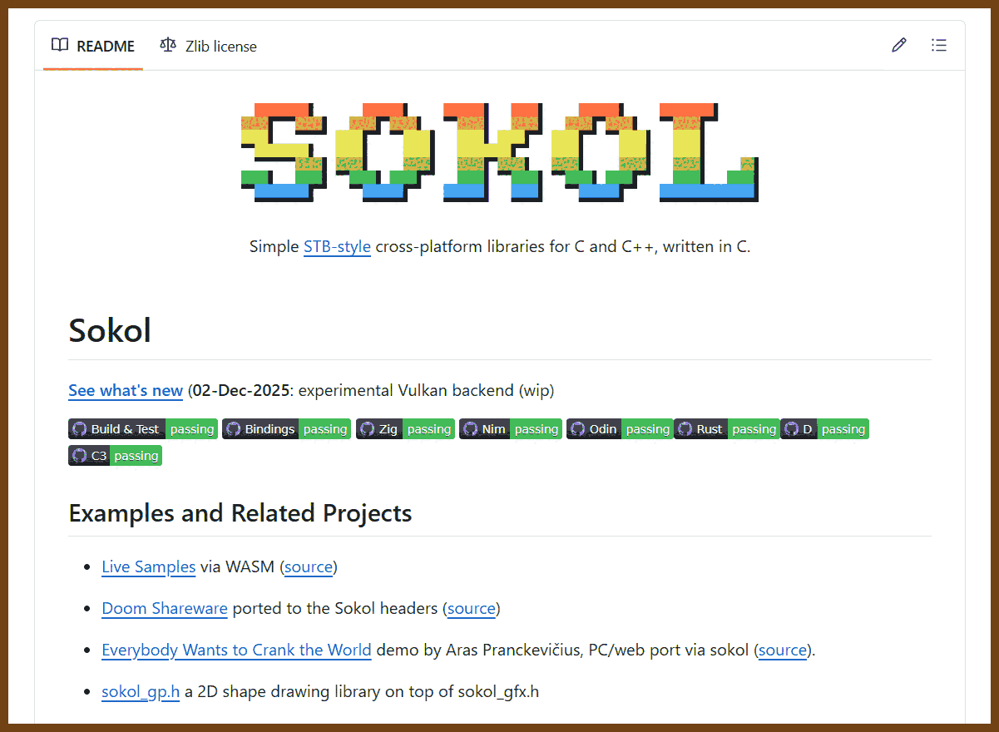
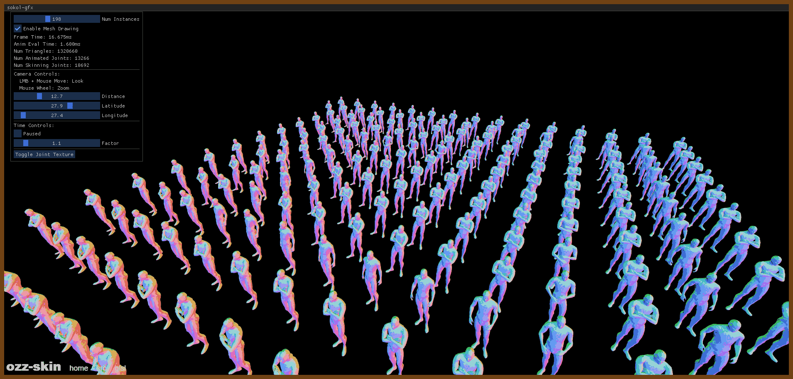
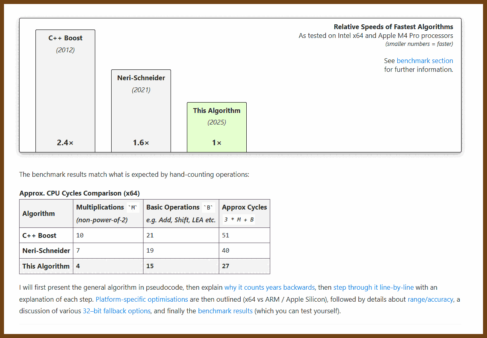
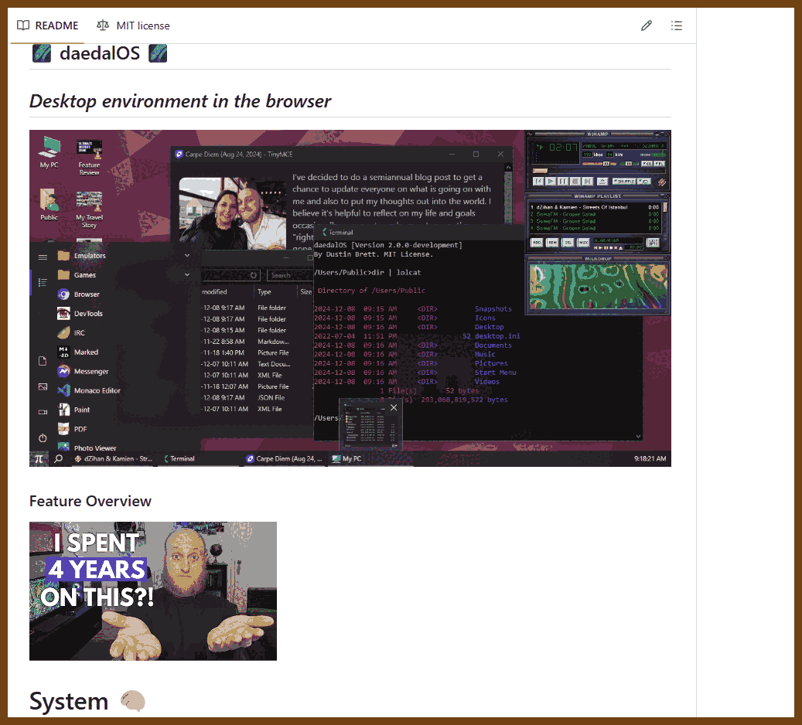
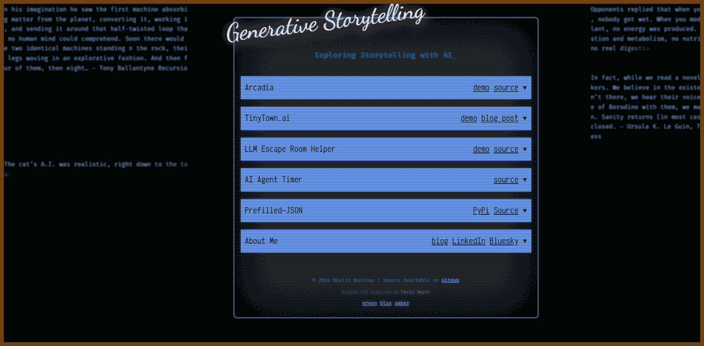
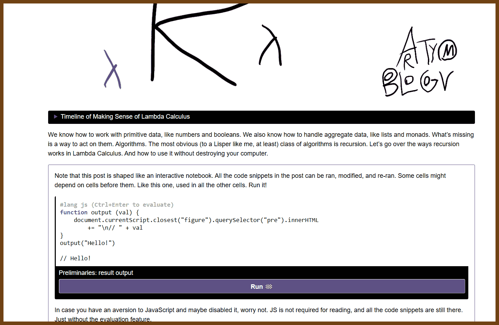
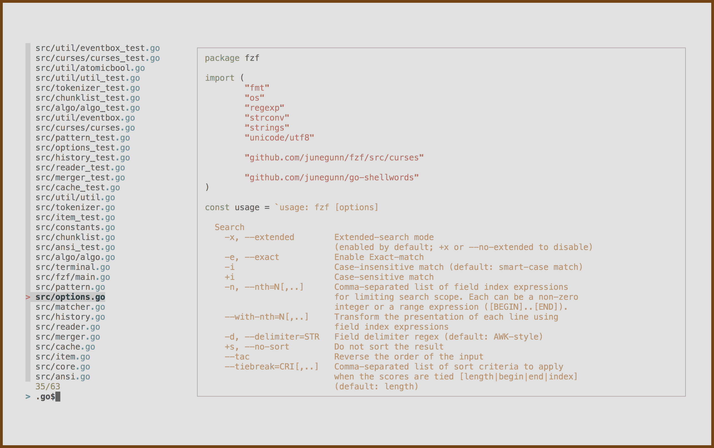
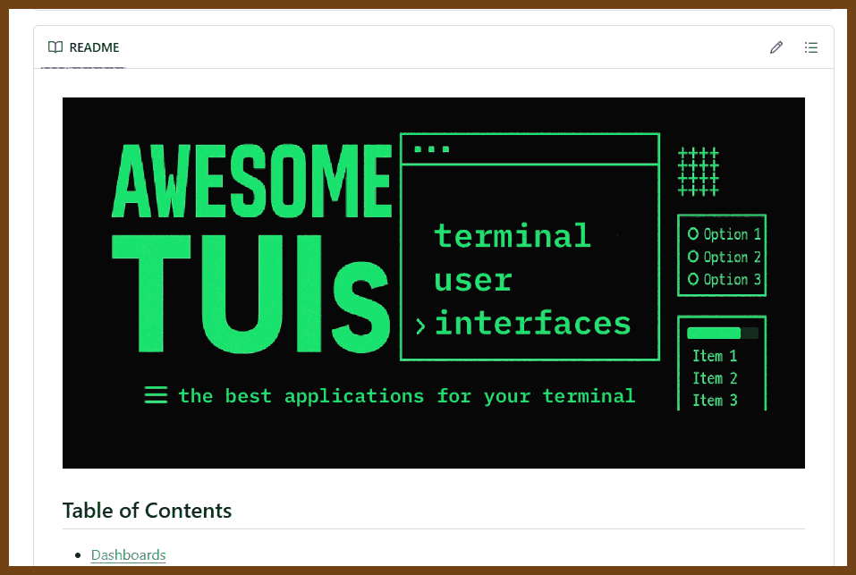
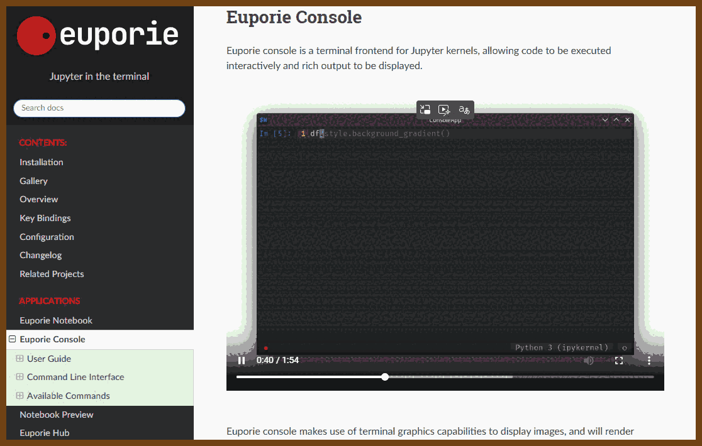

---
layout: post
title:  "Links from my inbox 2026-01-17"
date:   2026-01-17T13:46:00-08:00
categories: links
---


## 🌈Recreational Programming

2025-11-27 [Crafting Interpreters](https://craftinginterpreters.com/) { craftinginterpreters.com }

>  
>  Crafting Interpreters contains everything you need to implement a full-featured, efficient scripting language. You’ll learn both high-level concepts around parsing and semantics and gritty details like bytecode representation and garbage collection. Your brain will light up with new ideas, and your hands will get dirty and calloused. It’s a blast.

> Starting from main(), you build a language that features rich syntax, dynamic typing, garbage collection, lexical scope, first-class functions, closures, classes, and inheritance. All packed into a few thousand lines of clean, fast code that you thoroughly understand because you write each one yourself. 

> **it is also available for free**
>
> 

2025-11-27 [My 2 Year Journey of Learning C, in 9 minutes - YouTube](https://www.youtube.com/watch?v=lMvFWKHhVZ0) { www.youtube.com }

> 
>
> ---
>
> This is a short video about my journey from not understanding C in the least to being able to make a relatively large codebase.
>
> 2025-11-27 [PixelRifts/c-codebase: A simple base layer, and utilities for my own C development. ](https://github.com/PixelRifts/c-codebase) { github.com }
>
> A lot of the stuff came from https://www.youtube.com/c/Mr4thProgramming, but I have made a few simplifications/modifications


## 🔫 C || C++

2025-12-27 [floooh/sokol: minimal cross-platform standalone C headers](https://github.com/floooh/sokol) { github.com }

> 
>
> Examples and Related Projects
>
> - [Live Samples](https://floooh.github.io/sokol-html5/index.html) via WASM ([source](https://github.com/floooh/sokol-samples))
> - [Doom Shareware](https://floooh.github.io/doom-sokol/) ported to the Sokol headers ([source](https://github.com/floooh/doom-sokol))
> - [Everybody Wants to Crank the World](https://aras-p.github.io/demo-pd-cranktheworld/) demo by Aras Pranckevičius, PC/web port via sokol ([source](https://github.com/aras-p/demo-pd-cranktheworld)).
> - [sokol_gp.h](https://github.com/edubart/sokol_gp) a 2D shape drawing library on top of sokol_gfx.h
> - [Dear ImGui starterkit](https://github.com/floooh/cimgui-sokol-starterkit) a self-contained starterkit for writing Dear ImGui apps in C.
> - [qoiview](https://github.com/floooh/qoiview) a basic viewer for the new QOI image file format
> - [Tiny 8-bit emulators](https://floooh.github.io/tiny8bit/)
> - A 'single-file' [Pacman clone in C99](https://github.com/floooh/pacman.c/), also available in [Zig](https://github.com/floooh/pacman.zig/)
> - [Soluna](https://github.com/cloudwu/soluna), a framework to make 2D games in Lua by @cloudwu
> - [Deep Future](https://github.com/cloudwu/deepfuture): ...and a game implemented with Soluna
> - [Solar Storm](https://store.steampowered.com/app/2754920/Solar_Storm/), a turn-based scifi artillery game built with Odin and Sokol, released on Steam.
> - [Spanking Runners (Samogonki)](https://store.steampowered.com/app/2599800/Spanking_Runners/), arcade racing in a bright and unusual world, released on Steam.
> - [MEG-4](https://bztsrc.gitlab.io/meg4) a virtual fantasy console emulator in C89, ported to sokol
> - A [Minigolf game](https://mgerdes.github.io/minigolf.html) ([source](https://github.com/mgerdes/minigolf)).
> - [hIghQube](https://github.com/RuiVarela/hIghQube) A game demo that used sokol rendering extensively
> - [Senos](https://github.com/RuiVarela/Senos) A music app that uses sokol as backend
> - ['Dealer's Dungeon'](https://dealers-dungeon.com/demo/) ([lower graphics quality](https://dealers-dungeon.com/demo/?q=3), [source](https://github.com/bqqbarbhg/spear))
> - [LearnOpenGL examples ported to sokol-gfx (may be outdated)](https://zeromake.github.io/learnopengl-examples/) ([git repo](https://github.com/zeromake/learnopengl-examples))
> - [Command line tools](https://github.com/floooh/sokol-tools) (shader compiler)
> - [How to build without a build system](https://github.com/floooh/sokol-samples#how-to-build-without-a-build-system): useful details for integrating the Sokol headers into your own project with your favourite C/C++ build system
>
> Core libraries
>
> - [**sokol_gfx.h**](https://github.com/floooh/sokol/blob/master/sokol_gfx.h): 3D-API wrapper (GL/GLES3/WebGL2 + Metal + D3D11 + WebGPU)
> - [**sokol_app.h**](https://github.com/floooh/sokol/blob/master/sokol_app.h): app framework wrapper (entry + window + 3D-context + input)
> - [**sokol_time.h**](https://github.com/floooh/sokol/blob/master/sokol_time.h): time measurement
> - [**sokol_audio.h**](https://github.com/floooh/sokol/blob/master/sokol_audio.h): minimal buffer-streaming audio playback
> - [**sokol_fetch.h**](https://github.com/floooh/sokol/blob/master/sokol_fetch.h): asynchronous data streaming from HTTP and local filesystem
> - [**sokol_args.h**](https://github.com/floooh/sokol/blob/master/sokol_args.h): unified cmdline/URL arg parser for web and native apps
> - [**sokol_log.h**](https://github.com/floooh/sokol/blob/master/sokol_log.h): provides a standard logging callback for the other sokol headers
>
> 
>
> Utility libraries
>
> - [**sokol_imgui.h**](https://github.com/floooh/sokol/blob/master/util/sokol_imgui.h): sokol_gfx.h rendering backend for [Dear ImGui](https://github.com/ocornut/imgui)
> - [**sokol_nuklear.h**](https://github.com/floooh/sokol/blob/master/util/sokol_nuklear.h): sokol_gfx.h rendering backend for [Nuklear](https://github.com/Immediate-Mode-UI/Nuklear)
> - [**sokol_gl.h**](https://github.com/floooh/sokol/blob/master/util/sokol_gl.h): OpenGL 1.x style immediate-mode rendering API on top of sokol_gfx.h
> - [**sokol_fontstash.h**](https://github.com/floooh/sokol/blob/master/util/sokol_fontstash.h): sokol_gl.h rendering backend for [fontstash](https://github.com/memononen/fontstash)
> - [**sokol_gfx_imgui.h**](https://github.com/floooh/sokol/blob/master/util/sokol_gfx_imgui.h): debug-inspection UI for sokol_gfx.h (implemented with Dear ImGui)
> - [**sokol_debugtext.h**](https://github.com/floooh/sokol/blob/master/util/sokol_debugtext.h): a simple text renderer using vintage home computer fonts
> - [**sokol_memtrack.h**](https://github.com/floooh/sokol/blob/master/util/sokol_memtrack.h): easily track memory allocations in sokol headers
> - [**sokol_shape.h**](https://github.com/floooh/sokol/blob/master/util/sokol_shape.h): generate simple shapes and plug them into sokol-gfx resource creation structs
> - [**sokol_color.h**](https://github.com/floooh/sokol/blob/master/util/sokol_color.h): X11 style color constants and functions for creating sg_color objects
> - [**sokol_spine.h**](https://github.com/floooh/sokol/blob/master/util/sokol_spine.h): a sokol-style wrapper around the Spine C runtime (http://en.esotericsoftware.com/spine-in-depth)
>
> 
>
> 2025-12-27 [Sokol WebGL](https://floooh.github.io/sokol-html5/) { floooh.github.io }
>
> 

2025-12-27 [floooh/chips: 8-bit chip and system emulators in standalone C headers](https://github.com/floooh/chips/tree/master) { github.com }

> A toolbox of 8-bit chip-emulators, helper code and complete embeddable system emulators in dependency-free C headers (a subset of C99 that compiles on gcc, clang and cl.exe).
>
> Tests and example code is in a separate repo: https://github.com/floooh/chips-test
>
> The example emulators, compiled to WebAssembly: https://floooh.github.io/tiny8bit/
>
> For schematics, manuals and research material, see: https://github.com/floooh/emu-info
>
> The USP of the chip emulators is that they communicate with the outside world through a 'pin bit mask': A 'tick' function takes an uint64_t as input where the bits represent the chip's in/out pins, the tick function inspects the pin bits, computes one tick, and returns a (potentially modified) pin bit mask.
>
> A complete emulated computer then more or less just wires those chip emulators together just like on a breadboard.
>
> In reality, most emulators are not quite as 'pure' (as this would affect performance too much or complicate the emulation): some chip emulators have a small number of callback functions and the adress decoding in the system emulators often take shortcuts instead of simulating the actual address decoding chips (with one exception: the lc80 emulator).
>
>
> 

2025-12-27 [Home | rxi](https://rxi.github.io/) { rxi.github.io }

> 
>
> [A Simple UI Animation System](https://rxi.github.io/a_simple_ui_animation_system.html)
> A minimal tweening system for immediate mode UIs that tracks only active animations in a fixed array, exposes an update/start/get API, and lets your program store only target values while rendering uses animated values.
>
> [A Simple Serialization System](https://rxi.github.io/a_simple_serialization_system.html)
> A self-describing binary serialization format built from tagged values (including arrays and objects), designed for simple implementation, linear reading, easy inspection, and forward/backward compatibility, with an optional string interning extension.
>
> [Textbox Behaviour](https://rxi.github.io/textbox_behaviour.html)
> A reference specification for textbox editing behavior that breaks the problem into caret/selection state plus movements, operations, and commands, covering single-line, multi-line, and mouse-driven selection details.
>
> [Level Generation Using Markov Chains](https://rxi.github.io/level_generation_using_markov_chains.html)
> A method for generating 2D tilemap levels by training a Markov chain on one-dimensional row strings from example maps, then generating new rows and optionally placing entities by scanning for special tiles.
>
> [A Simple Undo System](https://rxi.github.io/a_simple_undo_system.html)
> An undo/redo approach where code marks memory blocks before they might change and commits at interaction end to diff and record only changed blocks, implemented with undo, redo, and temporary stacks.
>
> [lite: An Implementation Overview](https://rxi.github.io/lite_an_implementation_overview.html)
> An implementation tour of the lite text editor, describing its Lua/C split, frame loop, cooperative coroutine-based background work, document management, incremental syntax highlighting, view-based UI layout, and plugin approach.
>
> [microui v2: An Implementation Overview](https://rxi.github.io/microui_v2_an_implementation_overview.html)
> An implementation overview of a tiny immediate mode UI library in ANSI C that turns input into draw commands within fixed buffers, explaining windows and controls, hover rules, z-ordering in one command list, and bounded state storage.
>
> [Cached Software Rendering](https://rxi.github.io/cached_software_rendering.html)
> A software rendering technique that lets the app redraw as if every frame is full while the renderer redraws only changed regions using a command buffer plus a per-cell hash grid to detect dirty areas.

2025-11-27 [A Very Fast 64–Bit Date Algorithm: 30-40% faster](https://www.benjoffe.com/fast-date-64) { www.benjoffe.com }

> In this article I present my final *very* fast date conversion algorithm. It represents a significant speed gain — being similar in magnitude to the speed gains achieved by the previous fastest algorithm (Neri-Schneider 2021) over its predecessor (C++ Boost). The full algorithm [implementation in C++ ](https://github.com/benjoffe/fast-date-benchmarks/blob/main/algorithms/benjoffe_fast64.hpp) is released as free open source software (BSL-1.0 License).
>
> The algorithm provides accurate results over a period of ±1.89 Trillion years, making it suitable to process the full UNIX 64–bit time (in seconds).
>
> The entire algorithm has been re-written top-to-bottom, with various micro-optimisations, but three main new ideas:
>
> - **Years are calculated \*backwards\***, which removes various intermediate steps.
> - **The step to calculate day-of-year is \*skipped\***, instead using a year-modulus-bitshift technique which removes a division.
> - **The \*"Julian Map"\* technique is utilised** from my previous article, which speeds up the 100/400 year calculation, removing two more hardware multiplications.
>
> While fast date algorithms have always used 7 or more expensive computations (multiplication, division, or modulus by non-power-of-2 numbers), **this algorithm uses only 4 multiplications**. The speed-gain can be seen at a glance.
> 


## 💖 Inspiration!

2026-01-17 [Compilation: Ask HN: Share Your Personal Website](https://blog.zharii.com/docs/chatGPT/2026-01-17-Ask-HN-Share-your-personal-website) { blog.zharii.com }

> **Compilation of ** [Ask HN: Share your personal website | Hacker News](https://news.ycombinator.com/item?id=46618714) { news.ycombinator.com }
>
> 

2026-01-17 [DustinBrett/daedalOS: Desktop environment in the browser](https://github.com/DustinBrett/daedalOS) { github.com }

> 

2026-01-17 [Ganbaru Games | Browser-based games, puzzle and otherwise.](https://ganbaru.games/) { ganbaru.games }

> 

2026-01-17 [Generative Storytelling - Exploring Storytelling with AI and LLMs](https://www.generativestorytelling.ai/) { www.generativestorytelling.ai }

> 

2026-01-17 [Making Sense of Lambda Calculus 6: Recurring Problems](https://aartaka.me/lambda-6.html) { aartaka.me }

> 

2026-01-17 [Michael Ongaro](https://www.michaelongaro.com/) { www.michaelongaro.com }

> 

2026-01-17 [Carpe Diem (Aug 24, 2024) - TinyMCE - daedalOS](https://dustinbrett.com/) { dustinbrett.com }

> 

2026-01-17 [Nick Smith - Senior Software Engineer](https://nicksmith.software/) { nicksmith.software }

> 

2026-01-17 [Window management](https://nabraj.com/demo/grid) { nabraj.com }

> 2026-01-17 [projects | nabraj.com](https://nabraj.com/projects) { nabraj.com }
>
> 

2026-01-05 [ELIZA](https://anthay.github.io/eliza.html) { anthay.github.io }

> [anthay.github.io/eliza.html at main · anthay/anthay.github.io](https://github.com/anthay/anthay.github.io/blob/main/eliza.html)
>
> Joseph Weizenbaum’s 1966 ELIZA recreated in C++
>
> [anthay/ELIZA: A Simulation in C++ of Joseph Weizenbaum’s 1966 ELIZA](https://github.com/anthay/ELIZA)
>
> I’ve made in C++ what I think is an accurate simulation of the original ELIZA. It is a console application that takes as input the original format script file, which looks like a series of S-expressions, and then waits for the user to type a line of text before responding with a line of text of its own.

> 

2025-12-25 [junegunn/fzf: :cherry_blossom: A command-line fuzzy finder](https://github.com/junegunn/fzf) { github.com }

> 
>
>
> 
>
> It's an interactive filter program for any kind of list; files, command history, processes, hostnames, bookmarks, git commits, etc. It implements a "fuzzy" matching algorithm, so you can quickly type in patterns with omitted characters and still get the results you want.

2025-12-24 [antonmedv/textarea: A notes webapp](https://github.com/antonmedv/textarea) { github.com }

> 

2025-12-11 [Patterns.dev](https://www.patterns.dev/) { www.patterns.dev }

> 
>
> 

2025-12-10 [A series of tricks and techniques I learned doing tiny GLSL demos](https://blog.pkh.me/p/48-a-series-of-tricks-and-techniques-i-learned-doing-tiny-glsl-demos.html) { blog.pkh.me }

> 

2025-12-09 [fanfa.dev - Animated, interactive And visuals Mermaid Diagrams](https://fanfa.dev/) { fanfa.dev }

> 

2025-12-02 [rothgar/awesome-tuis: List of projects that provide terminal user interfaces](https://github.com/rothgar/awesome-tuis) { github.com }

> 

2025-12-02 [joouha/euporie: Jupyter notebooks in the terminal](https://github.com/joouha/euporie) { github.com }

> **Euporie is a terminal based interactive computing environment for Jupyter.**
>
> Euporie's apps allow you to interact with Jupyter kernels, and run Jupyter notebooks - entirely from the terminal.
>
> If you're working with Jupyter notebooks in a terminal only environment, like an SSH server or a container, or just prefer working in the terminal, then euporie is the tool for you!
>
> 

2025-11-29 [Be Like Clippy](https://be-clippy.com/) { be-clippy.com }

> 
>


2025-11-27 [penpot/penpot: Penpot: The open-source design tool for design and code collaboration](https://github.com/penpot/penpot/tree/develop) { github.com }

> Penpot is the first **open-source** design tool for design and code collaboration. Designers can create stunning designs, interactive prototypes, design systems at scale, while developers enjoy ready-to-use code and make their workflow easy and fast. And all of this with no handoff drama.
>
> Available on browser or self-hosted, Penpot works with open standards like SVG, CSS, HTML and JSON, and it’s free!
>
> 
> 

> We have very precise rules on how our git commit messages must be formatted.
>
> The commit message format is:
>
> ```
> [type] [subject]
> 
> [body]
> 
> [footer]
> ```
>
> 
>
> Where type is:
>
> - 🐛 `:bug:` a commit that fixes a bug
> - ✨ `:sparkles:` a commit that adds an improvement
> - 🎉 `:tada:` a commit with a new feature
> - ♻️ `:recycle:` a commit that introduces a refactor
> - 💄 `:lipstick:` a commit with cosmetic changes
> - 🚑 `:ambulance:` a commit that fixes a critical bug
> - 📚 `:books:` a commit that improves or adds documentation
> - 🚧 `:construction:` a WIP commit
> - 💥 `:boom:` a commit with breaking changes
> - 🔧 `:wrench:` a commit for config updates
> - ⚡ `:zap:` a commit with performance improvements
> - 🐳 `:whale:` a commit for Docker-related stuff
> - 📎 `:paperclip:` a commit with other non-relevant changes
> - ⬆️ `:arrow_up:` a commit with dependency updates
> - ⬇️ `:arrow_down:` a commit with dependency downgrades
> - 🔥 `:fire:` a commit that removes files or code
> - 🌐 `:globe_with_meridians:` a commit that adds or updates translations
>
> More info:
>
> - https://gist.github.com/parmentf/035de27d6ed1dce0b36a
> - https://gist.github.com/rxaviers/7360908
