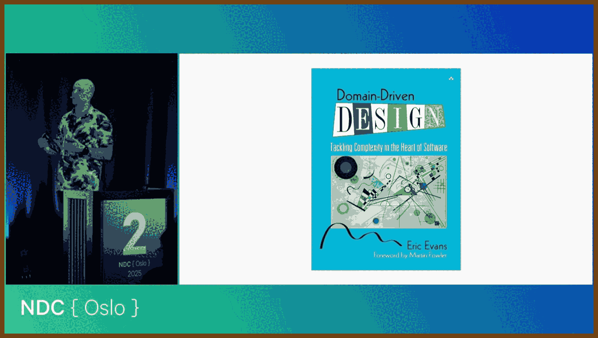
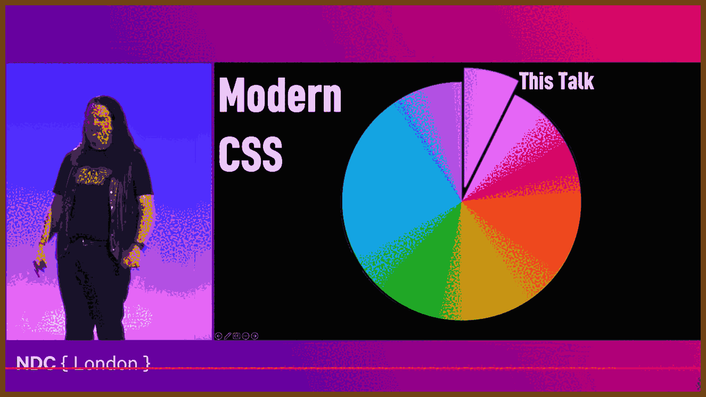
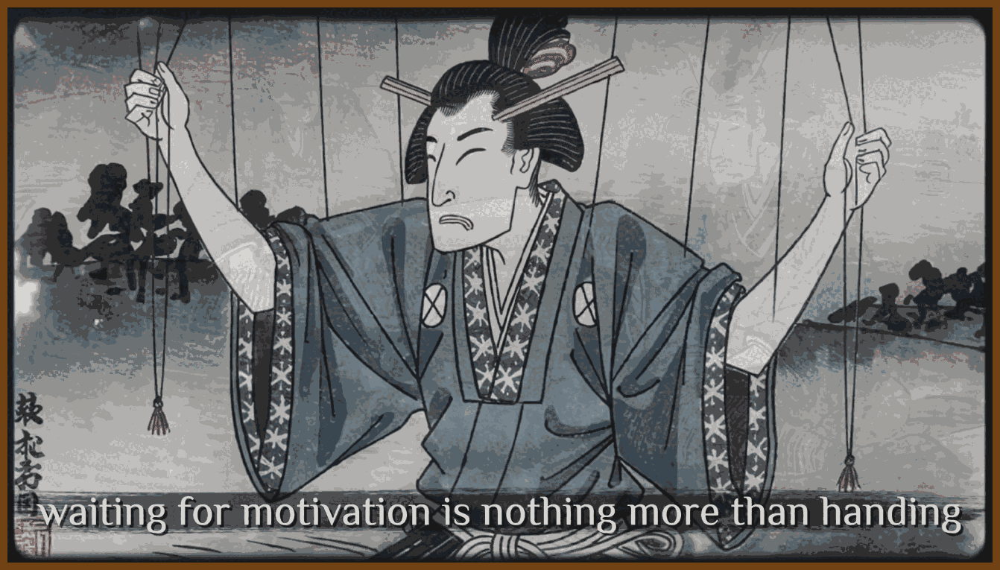
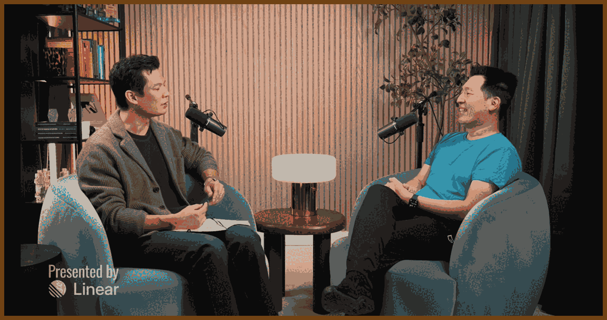

---
layout: post
title:  "Links from my inbox 2026-02-16"
date:   2026-02-16T18:51:00-08:00
categories: links
---

## ⌚ Nice watch!

> 2026-02-17 [The Career Bet Every Engineer Must Make - YouTube](https://www.youtube.com/watch?v=HLxA1Gh-x3g) { www.youtube.com }
>
> 
>
> The conversation treats AI as a phase change in work, not a normal productivity boost. Tools are starting to behave like delegated workers, which forces people to rethink what their job even is.
>
> Stable job definitions are breaking down and will not revert. The point is not that every task disappears, but that the old bundles of responsibilities that used to define roles are dissolving.
>
> The classic individual contributor mode is shifting toward coordination: choosing goals, splitting work, comparing outputs, and deciding what to trust. That starts to look like management even for people who still see themselves as builders.
>
> > An individual contributor is someone whose main job is doing the work directly, not coordinating other workers.
>
> Software creation is likely to spread into non-technical domains because non-coders can now build useful tools with agents. This grows the total amount of software-making rather than only shrinking engineering teams.
>
> Accountability is a key barrier in high-stakes fields. Society still wants a responsible party who can be blamed, sued, licensed, or removed, even if the system performs well.
>
> > Accountability is being responsible for outcomes and facing consequences when things go wrong.
>
> Human expertise and algorithmic guidance differ in what they can "see." Tools can incorporate dynamic information, while trust in human experts often rests on psychology and legitimacy, not just measured accuracy.
>
> Recent capability jumps can trigger a trust flip, especially when automated reviewers catch issues humans miss. Once systems reliably outperform people on meaningful parts of the job, the norm shifts from "assist me" to "mostly do it."
>
> Taste is often claimed as the last human moat, but much of it is learned pattern recognition that machines can copy or brute-force through massive iteration. What stays scarce is exceptional judgment, not average judgment.
>
> > Taste is the ability to choose what feels best among many possible options.
>
> The economic outcome is framed as a market shift, not the end of markets. As production costs fall, profits compress in that area and users capture more of the value, even though specialized roles get disrupted.
>
> Productivity tools rarely create freedom by default because ambition and incentives expand to fill the new capacity. Without deliberate constraints, people and organizations use AI to do more work faster, not to work less.
>
> The implied survival strategy is to assume rapid role change and act accordingly instead of betting on stability. This likely rewards people who enjoy novelty and constant retooling, and punishes people who need predictability.
>
> Finally, the discussion argues that AI forces a question about human value beyond economic output. If machines produce much of what markets reward, society may need new ways to value people, while scarcity and status still keep some things valuable because access is limited.

2026-02-16 [Exposing the not-so-secret practices of the cult of DDD - Chris Klug - NDC Oslo 2025 - YouTube](https://www.youtube.com/watch?v=A7WcjoMMp7c) { www.youtube.com }

> 
>
> ---
>
> Stop translating the business into developer-speak. When the expert says "purchase", "client discount", and "total cost", keep those concepts and words in the model and the code, so you do not drift away from what was actually meant.
>
> Readable code is not a nicety, it is a correctness tool. If the code reads like the domain, you can sanity check intent with the people who know the work, and you reduce the amount of mental decoding in every review.
>
> The tactical stuff is not the point, it is support. Patterns like value objects, events, and layers are just there to make it easier to express and protect domain behavior, not to be the main goal.
>
> > Value objects are small immutable types that carry validation and compare by their contents. Domain events are messages that announce something meaningful happened. Layers are a way to separate responsibilities so core rules are not tangled with infrastructure concerns.
>
> Put rules where the data lives, not sprinkled around the codebase. If validation lives in services and helpers, someone will forget to call it, and then invalid state sneaks in; the object should defend itself.
>
> If several fields move together, treat them as one concept. Instead of juggling a handful of primitives, bundle them into a small type that is always valid and easier to reason about.
>
> > A value object is a small type defined by its values and rules, and it should never be creatable in an invalid state.
>
> Use small typed wrappers to prevent dumb mistakes. When an API takes several primitives of the same type, parameters get swapped; tiny types like UserId and GroupId make that error obvious and make call sites self-documenting.
>
> Name operations by intent, not by mechanics. "LivingIn(city)" communicates what you want, while "GetByCity" tells you how the author thought about data access and invites pattern debates instead of meaning.
>
> Identity is not mandatory, it is earned. If something does not need lifecycle tracking, it can stay as a pure value, and you do not have to force an ID into every concept just because the database likes keys.
>
> > An entity is something you track over time by identity, even as its attributes change.
>
> Hide persistence compromises from the domain model. If the database needs an integer key, keep it private or let the ORM manage it as a shadow detail, so the public model stays aligned with the real-world identifier.
>
> Architecture should make "outside world" concerns plug in cleanly. Layered diagrams often fall apart under messaging, email, and integrations; ports and adapters keeps the domain focused while letting external mechanisms attach at the edges.
>
> Split the problem so you spend effort where it pays. Identify what is core, what is supporting, and what is generic you should buy or integrate, then stop building commodity capabilities unless they are literally your business.
>
> When one model talks to another, protect your model from their mess. Put translation and multi-call orchestration into an anti-corruption layer so external changes do not leak through your core domain code.
>
> > An anti-corruption layer is a boundary component that translates between two models so one does not contaminate the other.
>
> Events make change cheaper later. Emit small "something happened" signals so new behavior can be added by subscribing, instead of rewriting core flows every time someone wants a new cross-cutting feature.
>
> > A domain event is a small message that says a meaningful domain change occurred.
>
> Consistency has boundaries, and you should choose them on purpose. Treat one aggregate as the unit you can save atomically; if you change two separate things, you now own the coordination problem, so do not pretend the database will magically keep everything aligned.
>
> Saving data and publishing messages is a reliability trap unless you design for it. The outbox pattern is the practical move: persist the change and the outgoing event together, publish later with retries, and accept that consumers must handle duplicates.
>
> > The outbox pattern stores outgoing messages with your database transaction, then publishes them safely afterward.
>
> Read models and write models can be different without being wrong. CQRS fits because the shape that protects invariants on writes is often not the shape you want for queries, and forcing one model to do both usually makes both worse.
>
> > CQRS means you separate the model you use for writes (commands) from the model you use for reads (queries), so each can be optimized for its job.
>
> Do not worship DRY if it destroys clarity. A little duplication is often cheaper than building shared abstractions that couple unrelated parts of the system and turn simple code into a generic, parameter-driven mess.
>
> > DRY means "do not repeat yourself", but misusing it often creates shared code that is harder to understand and harder to change safely.

2026-02-08 [Stoic lessons to become your best self in 2026 | Massimo Pigliucci - YouTube](https://www.youtube.com/watch?v=4EmuBcIlWBs) { www.youtube.com }

> 
>
> ---
>
> Stoicism aims to shape you into a better human being, meaning someone who lives a life worth living.
>
> A common Stoic idea sounds almost trivial: some things are up to you and other things are not. The point is not whether it is simple, but whether you actually practice it in daily life.
>
> Massimo Pigliucci presents himself as both an evolutionary biologist and a philosopher of science, and he coauthored Beyond Stoicism with Greg Lopez and Meredith Kunz.
>
> He frames what follows as a small set of practical techniques that can improve life, sometimes quickly, if you apply them consistently.
>
> A starting point is the relationship between reason and emotion, because emotions are unavoidable parts of human biology and psychology.
>
> Feelings can help by acting like alarm bells that signal when something seems right or wrong, but they can also mislead and drive reactions you later regret.
>
> The Stoics treated emotions as a serious subject, and Seneca focused especially on anger in On Anger because it commonly pushes people into harmful escalation.
>
> A key Stoic claim is that reason and emotion are not separate forces fighting each other; they are tightly connected.
>
> Modern cognitive science supports this connection by showing that emotion-related brain systems and reasoning-related systems are massively interconnected, so thinking and feeling constantly influence each other.
>
> That interconnection becomes a lever for change: start with deliberate thinking, let actions follow from that judgment, and repeat the combination until emotional responses gradually shift.
>
> The idea is that emotions move in the direction your interpretations move, so changing the interpretation is often the first practical step.
>
> Consider an insult: what triggers anger is not just the words, but your appraisal that the words count as a personal attack.
>
> Epictetus treats an insult as sounds that you interpret, so you can choose a different frame before anger takes over.
>
> One frame is that if the criticism is true, it is useful information delivered badly, so it is better to learn from it than to explode.
>
> Another frame is that if the criticism is false, it reflects the speaker's error, so it is their problem rather than yours.
>
> By rehearsing these frames, you can deescalate because your emotional surge loses its fuel when the event stops being read as a real harm.
>
> This is hard in the moment when you are unprepared, so Stoicism emphasizes preparation instead of relying on willpower at the peak of emotion.
>
> A central preparation method is philosophical journaling, which is not a diary of events but a structured reflection on how you reacted and why.
>
> > Philosophical journaling is writing to analyze your actions so you can respond better next time.
>
> Marcus Aurelius provides a model in Meditations, which was written for himself rather than for publication.
>
> Its repetitiveness reflects how the same personal problems keep recurring, and its preachy tone reflects self-correction rather than performance for an audience.
>
> This reflective practice aligns with methods used in modern cognitive behavioral therapy, where reviewing thoughts and behaviors can reliably support self-improvement.
>
> One effective routine is to set aside time before bed to review a specific incident from the day and describe it as objectively and analytically as possible, without re-living the emotion.
>
> Writing in the second person, as if addressing a friend, can create emotional distance that makes learning easier.
>
> The core review uses three questions: what you did wrong, what you did right, and what you could do differently next time.
>
> The first question is not for self-punishment, because the past cannot be changed, but it can be mined for lessons.
>
> The second question prevents a one-sided focus on failure by reinforcing behaviors you want to repeat and turning improvement into concrete goals.
>
> The third question matters most because many situations repeat, so a better planned response today is likely to be usable soon.
>
> Preparedness does not promise perfection, but it raises the odds of a better response when the same trigger appears again.
>
> A related idea appears in the Serenity Prayer, commonly used in 12-step settings such as Alcoholics Anonymous, which asks for wisdom to distinguish what can be changed, courage to change it, and calm acceptance of what cannot.
>
> The Stoic version centers on the same distinction: focus effort where agency actually exists and cultivate equanimity toward what lies outside your control.
>
> > Equanimity is calm steadiness even when things do not go your way.
>
> A job interview illustrates how to apply the distinction: getting the job is not fully up to you, so you prepare to accept either outcome without a tantrum.
>
> What is up to you includes preparing seriously, aiming for rest, and aiming to arrive on time, while recognizing that sleep and punctuality can still be disrupted by factors like noise, transit failures, or traffic.
>
> This leads to a practical rule: own your intentions and preparation, and do not treat outcomes as guaranteed entitlements.
>
> The same approach scales beyond personal life to social and political concerns that feel overwhelming.
>
> He points to turbulence in ancient times and parallels it with current fears like climate change, nuclear war, and rapid political and social change.
>
> With climate change, the individual cannot solve the global problem alone, but can still act through learning, donating, voting, persuading others, and joining public advocacy.
>
> Those actions may not secure the desired result, but they make a real contribution and reduce helplessness because you are doing what is genuinely within your agency.
>
> At the same time, you prepare emotionally for the possibility that outcomes still fail, because many results depend on collective systems beyond any one person.
>
> Stoicism also addresses decision making, where people often second-guess themselves and force choices into black-and-white categories.
>
> Epictetus centers this on prohairesis, the faculty of judgment and choice that assesses situations and commits to a course of action.
>
> > Prohairesis is your ability to judge a situation and choose how to respond.
>
> The world is often complex, so trying to force it to fit your preferred simplicity is futile; it is better to understand how things actually work and act within that reality.
>
> He illustrates this with a student complaining about a cold, where the Stoic response is not to demand the universe adjust, but to do the practical thing like using a handkerchief.
>
> To improve judgment, Stoicism emphasizes the discipline of assent, meaning you learn to pause before endorsing the first impulse that comes with an experience.
>
> > Assent is saying "yes" to a thought, so you practice delaying that "yes" until you have examined it.
>
> The Stoics say you are constantly hit by impressions, which combine what you perceive with an immediate, usually automatic evaluation.
>
> > An impression is a quick judgment that arrives вместе with what you notice.
>
> A simple example is seeing tempting food and instantly concluding you should buy it, then stopping to ask whether it actually fits your goals and context.
>
> This method shifts attention away from obsessing over outcomes and toward the reasons and values driving your choices.
>
> For moral choices, the key question becomes whether your motivations express virtue, not whether the action looks good on the surface.
>
> Volunteering can be virtuous if it comes from a genuine desire to help, but it can damage character if it is mainly a way to use others for status or resume benefits.
>
> Stoicism frames the overall ethical aim as living according to nature, meaning understanding what kind of being a human is and what helps that being flourish.
>
> > Living according to nature means living in ways that help humans thrive as humans.
>
> This makes ethics resemble an empirical discipline, because you must observe what actually supports human flourishing rather than inventing ideals detached from human life.
>
> The Stoics liken ethics to medicine: some impulses are natural but harmful, like cravings for sugar and fat that once helped survival but now often undermine health.
>
> They argue anger is similar for the psyche: natural as a reaction to perceived injustice, but typically damaging to a good life.
>
> What supports mental health is reasoning through problems instead of reacting blindly, and building cooperative social relationships because humans flourish as social animals.
>
> From there, concern should expand beyond the immediate circle to all people, since life is interconnected and cooperation scales.
>
> Hierocles recommends imagining circles of concern that stretch from self to family, friends, acquaintances, and ultimately all humanity, then working to pull the outer circles closer.
>
> He even suggests behavioral prompts, like addressing strangers with family-like terms, to remind yourself that everyone is part of the same human community.
>
> > Cosmopolitanism is treating every human as part of one shared community.
>
> He returns to the earlier objection that these ideas are too simple by arguing that simplicity is not the obstacle; failure to practice is.
>
> The Stoics compare ethical training to athletics: the movements can be easy to understand, but only repeated practice changes strength and capability.
>
> He then explains his own path: he began as a scientist, then faced a midlife crisis about repeating the same work for decades.
>
> A long-standing interest sparked by a philosophy teacher in Rome guided a shift into philosophy, including a move into philosophy of science.
>
> The crisis deepened as several major stresses arrived close together, including a death in the family, an unexpected divorce, and relocating across the country.
>
> He searched for a philosophy of life, explored Buddhism without finding the fit he hoped for, and narrowed toward virtue ethics in the Greco-Roman tradition.
>
> While browsing X, he saw a mention of Stoic Week and became curious, despite earlier stereotypes of Stoics as emotion-suppressing like Mr. Spock from Star Trek.
>
> Remembering earlier encounters with Marcus and Seneca, he tried the program and first read Epictetus, whose blunt style and emphasis on judgment immediately resonated.
>
> A story about wanting wealth and power to help others leads to the Stoic point that money and power do not teach right action; improved judgment does.
>
> He reports that starting to practice had quick effects, changing how he thought about persistent problems and how he behaved in response.
>
> For weight, he applied the up-to-you distinction: genetics and early development set limits, but diet and exercise remain within agency, so he focused on the latter while accepting the former.
>
> For anger, he learned to stop expecting people to behave ideally and to treat hurtful or foolish behavior as part of the world as it is, while still choosing thoughtful responses.
>
> He stresses that this realism is not passivity or being a doormat; action matters, but it should be guided by reflection, aimed at what can be influenced, and free of fantasies about miracles.

2026-02-06 [Do It With Style: Rethinking CSS - Dylan Beattie - NDC London 2026 - YouTube](https://www.youtube.com/watch?v=nhbYveaV0pk) { www.youtube.com }

> 
>
> In this talk we will discuss why CSS has such a bad reputation, why those complaints are often valid, and why it still matters because you cannot really build for the web without touching it.
>
> We will then discuss why it is worth revisiting CSS today, because HTML and CSS are living standards and modern browser update cycles mean new capabilities become usable much faster than they used to.
>
> We will discuss how features that used to require JavaScript or heavy libraries can increasingly be handled by native elements and modern CSS, using accordions as a concrete example with details/summary, better selectors, and cleaner authoring patterns like nesting.
>
> We will discuss modern motion in CSS, including transitions, keyframe animation, and the long-running "transition to auto" problem, along with the opt-in fixes and the use of feature queries to progressively enhance without breaking older browsers.
>
> We will discuss modern color in CSS, moving from named colors and RGB toward relative colors and perceptual color spaces like OKLCH, and how that enables practical theming and palette generation from a single user-chosen color.
>
> We will discuss how gradients, layering, and blend modes let CSS generate complex visuals and even transform images, such as desaturating and tinting a background image, without needing JavaScript or external image processing.
>
> We will conclude by discussing the evolving work on styling native form controls, especially select elements, and why enhancing built-in controls is usually better than replacing them, because you keep accessibility, keyboard support, and long-term maintainability.

2026-02-01 [The history of C# and TypeScript with Anders Hejlsberg | GitHub - YouTube](https://www.youtube.com/watch?v=uMqx8NNT4xY) { www.youtube.com }

> 
> 
>
> ---
>
> Anders Hejlsberg is one of the most influential language designers of our time, having created Turbo Pascal, Delphi, C#, and TypeScript. In this interview, he discusses his 40-year career, the early days of open source at Microsoft, and the decision to move TypeScript to GitHub. He also reveals why the team recently decided to port the TypeScript compiler to Go for a 10x performance boost. 
>
> ---
>
> Early access to a school computer and the arrival of 8-bit machines pushed him from curiosity into building his own kit computer, then writing enough software to realize he was good at it and enjoyed the craft.
>
> Working with tiny memory limits forced a different mindset: keep designs small enough to fit, leave space for users, and rely on understanding the whole system well enough to hold it in your head.
>
> Turbo Pascal aimed at the same instant feedback people liked in BASIC, but without paying the speed penalty of an interpreter and without settling for a crude line-based editing experience.
>
> > A "feedback loop" is the time between changing code and seeing the result.
>
> The key was to make "Run" feel immediate by compiling straight into memory, avoiding disk writes, executing right away, and dropping back into the editor when errors appeared.
>
> Slow compiles are universally frustrating because the moment you finish writing code is the moment you want to see it run, not the moment you want to start waiting.
>
> Pricing turned out to be a strategic lever: selling far cheaper felt risky at first, but it enabled vastly higher volume, which ultimately made the product far more successful.
>
> Growth forced a shift from a one-person approach to a team approach, because hardware capacity and user expectations rose faster than any single developer could scale.
>
> Becoming a real team player meant accepting that work will be done differently than you would do it, and that other people's code will not match your personal style.
>
> It also meant learning that "fixing" code you dislike often does not change product behavior enough to justify the time, especially when the schedule is tight.
>
> Handing off responsibility is not optional at scale: people need clear ownership so they feel empowered to make decisions and deliver the parts they own.
>
> > "Empowerment" is giving someone real authority to make choices for the work they own.
>
> At Microsoft, early Java tooling was assembled quickly but lacked deep integration and rapid iteration, so the goal became a more cohesive development experience rather than a set of loosely connected parts.
>
> A pragmatic view guided the work: if you build for a specific platform, you should interoperate well with that platform instead of pretending every environment is identical.
>
> Java's "write once, run everywhere" ideal often led to least-common-denominator UI and restrictions that blocked taking advantage of what a platform could do best.
>
> > A "least common denominator" design is one that stays generic by avoiding features that only some platforms support.
>
> The core lesson was to design holistically, because users judge the combined experience of language, runtime, libraries, editor, debugger, and tooling rather than separating them into categories.
>
> Avoiding organizational silos improves outcomes, since mismatched visions across components tend to produce awkward layers and compromises instead of a clean, best-of-breed system.
>
> As browsers, JavaScript engines, and HTML matured, the industry shifted toward the browser as the real platform, which enabled much larger applications across many device types.
>
> That growth exposed a painful reality: building big systems in a dynamic language without strong tooling leads to fragile code and organizational strain.
>
> ScriptSharp was a warning sign: teams were willing to write in one language and compile to JavaScript just to get type checking, interfaces, and serious tooling for large-scale collaboration.
>
> This sparked the idea that treating JavaScript as a compilation target was the wrong fix, and that improving the ecosystem would mean keeping JavaScript while addressing what breaks at scale.
>
> Making the new language a strict superset reduced friction by meeting developers where they already were, so existing code stayed valid while optional types and better tooling improved reliability.
>
> He is skeptical of "new language" ambition because most of the work is repetitive infrastructure, and modern expectations include broad IDE integration, debugging, profiling, and now AI-facing services.
>
> The adoption curve is also brutal: meaningful usage can take many years, and a new language must survive long enough to earn trust and community investment.
>
> Launching the project as open source was necessary to engage the JavaScript community, but early efforts were constrained by limited trust and by processes that still treated the public repo as a one-way drop.
>
> Moving to GitHub and adopting a truly open workflow changed the trajectory: development happened through public pull requests, issues stayed public, and internal contributors operated under the same visible process as outsiders.
>
> Open development benefits users by preserving the reasoning behind decisions in public threads, and it benefits maintainers by turning shipping into an ongoing dialogue instead of rare, high-stakes releases.
>
> Community voting through issue upvotes provides a practical prioritization signal, creating a feedback cycle where shipping what users want increases trust and participation.
>
> Porting the compiler to Go was driven by scale: JavaScript is single-threaded by design, lacks shared-memory concurrency, and leaves most available compute power unused on modern machines.
>
> Even with deep expertise in JavaScript performance tricks, the team hit a ceiling, so native code plus concurrency offered a step-change, on the order of 10x improvements that could not be ignored.
>
> The strategy was to port, not rewrite, because the type checker encodes many subtle behaviors that are not fully documented anywhere but the existing implementation.
>
> Choosing the target language required matching the compiler's needs: cyclic data structures and garbage collection are central, making Rust impractical without turning the effort into a redesign.
>
> Go fit well enough to produce a native compiler that behaves like a carbon copy of the old one, quirks included, which avoids forcing the ecosystem to relearn or discard existing assumptions.
>
> AI-assisted coding changes incentives: the best target languages for AI are the ones with the most training data, so common languages gain an advantage while brand-new languages start behind.
>
> Using AI to translate a large codebase is risky when you need deterministic equivalence, because small hallucinations force painstaking review, erasing the value of automation.
>
> A better pattern is to ask AI to generate tooling that performs deterministic transformations, so the output can be trusted by rerunning the tool instead of auditing every line.
>
> As AI improves at code fixes and refactors, some parts of traditional language services may matter less to port exactly, because the role of tooling shifts toward enabling AI workflows rather than reproducing old editor-era behavior.
>
> > A "language service" is the component that powers completions, navigation, refactors, and quick fixes in editors.
>
> AI is most valuable when it removes toil: repetitive housekeeping, triaging large issue backlogs, checking whether old reports still reproduce, and migrating changes across divergent branches.
>
> This raises a workforce concern: if AI replaces too much entry-level work, teams must find new ways to develop beginners into experts rather than narrowing the pipeline until it breaks.
>
> Over the next 5 to 10 years, the language itself will largely track JavaScript standardization plus additional type-system features layered on top, while tooling direction is far less predictable.
>
> The tooling shift is already visible: AI is moving from an assistant inside the IDE to an agent doing work under supervision, which may reduce the centrality of the traditional IDE while increasing reliance on semantic services.
>
> Connecting semantic tooling to AI through MCP is a way to give agents structured, deterministic access to language understanding and refactoring capabilities.
>
> > "MCP" is a way for tools to provide structured capabilities that an AI can call.
>
> Open source remains a balancing act because it is given away while being funded by organizations that must justify costs, creating ongoing tension about sustainability and incentives.
>
> Many enterprises depend on open source maintenance, yet often contribute less than they consume, so the ecosystem still lacks a widely accepted model that reliably rewards maintainers.
>
> He respects any language that achieves real adoption because getting there is hard, and he highlights Rust for its memory-management approach, Go for a simple type-safe, memory-safe systems style, and Python for its enormous impact.
>
> As a designer, he views languages as cumulative learning: borrowing proven ideas is rational, and refusing to learn from predecessors is a mistake.
>
> He remains optimistic about collaborative platforms because the work persists: years of searchable history capture decisions and evolution in a way that does not vanish into private email, even if the ecosystem also contains noise and abandoned projects.

2026-01-09 [If Youre Ambitious but Lazy, Watch This Samurai Lesson (Kaizen Method to Success) - YouTube](https://www.youtube.com/watch?v=VDBncKw5v_o) { www.youtube.com }

> 
>
> I can talk myself into feeling like I am progressing, just by describing what I will do and picturing the future version of me who already succeeded. That mental rehearsal can become a reward that replaces real work.
>
> When I build my identity around being a person with big plans, I create a gap between what I want and what I am willing to do today. I stay comfortable in the role of the dreamer instead of becoming the person who practices.
>
> I learn that wanting something badly does not automatically make me act. Clear goals and strong ambition do not cross the distance between desire and daily effort.
>
> The bigger the goal, the easier it is for me to feel overwhelmed by how far away it is. That feeling makes me delay the small steps that would actually bring it closer.
>
> I can mistake preparation for progress. Planning, researching, and talking can feel productive while I quietly drift away from the only thing that changes me, which is practice.
>
> If I keep speaking about my plans without acting, my mind treats it like an achievement. That makes inaction easier to repeat and makes regret more likely later.
>
> Time is the hidden cost. Dreams without action spend it slowly, and once it is gone I cannot recover it.
>
> I stop waiting for a burst of inspiration because that is just another way to postpone. If I wait for perfect conditions, I can wait forever while someone else moves forward in imperfect weather.
>
> Motivation is not what I should depend on to start. More often, it shows up after I begin, because action creates momentum and momentum creates energy.
>
> > Motivation is the push I often feel after I start acting, not the feeling I must have before I begin.
>
> I take the idea of small improvements seriously, because it turns change into something I can do daily. I climb by steps, not by staring at the peak and wishing.
>
> > Kaizen is improving through very small steps repeated over time.
>
> Small steps work because they are repeatable. Even if the effort looks tiny, repetition makes it powerful, and consistency is what turns slow progress into real mastery.
>
> If I practice even one small form each day, the movement becomes automatic. My body strengthens, my technique sharpens, and my discipline deepens, while the people who keep waiting stay at the starting line.
>
> I stop trusting the illusion that talking equals doing. Talking without practice gives me the feeling of motion without the reality of change.
>
> When I say I need motivation, I am often protecting myself from discomfort. I fear starting when I am tired, continuing when I feel resistance, and working without immediate reward.
>
> Discipline is not the absence of those feelings. It is moving through them.
>
> True strength is not acting only when conditions are perfect. It is acting when conditions are not.
>
> I break laziness in a simple way: I begin with small daily actions even when they feel insignificant. I do not wait to feel ready, because readiness is a story my mind uses to delay.
>
> I choose habits and commitments over emotion. Feelings change, but commitments can stay steady, and they can carry me forward when inspiration is missing.
>
> > Commitment is the decision I keep following even when my feelings change.
>
> Strength is not saying I feel like doing this. Strength is saying I will do this whether I feel like it or not.

2026-01-08 [Why Even The Best Engineers Are Afraid Of Whats Coming | Philip Su - YouTube](https://www.youtube.com/watch?v=BgE6yfblex0) { www.youtube.com }

> 
>
> Philip Su is a software engineer and founder of the podcast app Superphonic (sometimes discussed alongside earlier naming like "Superic" in interviews). He previously held senior engineering roles at Microsoft, Meta, and OpenAI, and is often described as having reached Meta's Distinguished Engineer level (IC9). ([LinkedIn](https://www.linkedin.com/in/suphilip))
>
> He also writes about technology and society in his newsletter Molochinations and hosts the podcast Peak Salvation, which centers on his experience leaving tech leadership to work in an Amazon warehouse during Peak season and reflect on automation and the future of work. ([molochinations.substack.com](https://molochinations.substack.com/p/a-life-engineered))
>
> 
>
> They shift from technical change to social impact, emphasizing that prior labor transitions happened across generations, while current automation pressures people already deep into a career to retrain under time stress.
>
> A concrete example is professional voice acting, where he tells a friend that near term replacement is plausible and emotionally devastating because the work is specialized, identity forming, and often loved.
>
> Philip Su distinguishes jobs he is happy to see automated, like physically punishing warehouse lifting, from creative or expressive work where automation can remove something people value doing.
>
> His main near term worry is social instability, because displacement can happen faster than legal, regulatory, and institutional systems can adapt.
>
> He says the usual historical argument, "we have always predicted job loss and been wrong," may fail because general purpose systems could outperform many people across many tasks, leaving fewer obvious fields to retrain into.
>
> He expects many companies to choose "more with less" rather than "more with more," because human coordination overhead means adding people does not scale output linearly.
>
> > The mythical man-month is the idea that adding people to a project often adds coordination cost and does not scale output proportionally.
>
> From that perspective, shrinking headcount while augmenting remaining staff with automation can reduce meetings and friction and increase per employee productivity, making layoffs economically attractive.
>
> He predicts that developers who do not learn to use these tools risk being displaced by peers who do, even if the tools are imperfect today.
>
> They separate commercial productivity from craft enjoyment: using AI can turn the job into reviewing mediocre generated code rather than writing code directly, which can reduce the joy for people who love the craft.
>
> He compares this to whittling, where the point is not efficiency but the pleasure of making, and argues that some people will still choose hands on creation even if machines can do it better.

2025-12-27 [Bad Estimates Destroy Careers (Heres What to Say Instead) - YouTube](https://www.youtube.com/watch?v=2-QCqbMsPDc) { www.youtube.com }

> 
>
> When someone asks for a timeline before you understand the work, giving a confident answer is risky because it turns into a promise you cannot reliably keep.
>
> Saying "two weeks" is often a reflex under pressure, but it is effectively a lie if it is not based on real understanding, and the cost of that lie shows up later when the project slips and you are blamed.
>
> A single date assumes ideal conditions, but real projects include unknowns, legacy complexity, and unexpected problems, so early estimates are naturally uncertain.
>
> People asking for deadlines are usually anxious rather than malicious; they want a number because it feels like a plan, even if the number has no foundation.
>
> You should not give a single deadline; you should give a range that reflects uncertainty, such as "3 to 6 weeks", and narrow that range as you learn more.
>
> > An estimate range is a timeline expressed as earliest and latest likely completion, rather than one fixed day.
>
> If someone wants a precise answer, you should require precise inputs, because vague requirements cannot produce precise timelines.
>
> If pushed, you can ask for a short research period, such as two days, to investigate and then provide a range you actually believe.
>
> A useful move is to reframe the request by asking what outcome they are trying to achieve, because solving the underlying goal can be better than building a complex implementation that does not match the real need.
>
> When a range is rejected, you can transfer risk explicitly by explaining that a single date will likely be wrong and that it only holds if nothing goes wrong.
>
> You can also propose a discovery step by committing to a brief investigation and a specific day when you will deliver a credible range.
>
> Another option is to refuse the unrealistic date while offering a path forward, such as maintaining quality by extending time, finishing current commitments first, or adding another developer to hit the desired schedule.
>
> Accepting fantasy timelines harms the business, not just the engineer, because bad estimates drive overruns, force weekends, and incentivize corner-cutting.
>
> Under high pressure, quality drops and defects multiply, so an aggressive date does not truly save time; it creates future cost by accumulating technical debt and rework.
>
> > Technical debt is extra future work created when you take shortcuts now.
>
> Your job is not to comfort others with a fake date; it is to provide truthful information so they can make tradeoffs and decisions.
>
> Taking on impossible timelines leads to burnout and long-term dissatisfaction, so protecting estimate integrity is also protecting your ability to do sustainable work.
>
> The recommended defense is to give a range, push for the missing information needed to narrow it, and reframe the problem toward the desired outcome.
>
> A practical script is to acknowledge the request for a timeline, state the current range, and explain that tightening it requires more information, which positions you as professional rather than obstructive.
>
> **Video Comments:**
>
> gojkogalonja
> I'd rephrase 3-6 weeks into "It could take up to 6 weeks".
>
> @dynabeen2
> Here is the thing though - say 3 to 6 weeks and all they hear is 3 weeks.
