---
layout: post
title:  "Links from my inbox 2026-03-23"
date:   2026-03-23T00:41:00-07:00
categories: links
---

## Good Reads

2026-03-23 [Five Years of Running a Systems Reading Group at Microsoft](https://armaansood.com/posts/systems-reading-group/) { armaansood.com }

> I started a reading group in 2021, a few months after joining Microsoft as a new grad on the Azure Databases team. The group was initially focused on database internals, which was my favorite subject at UW. Databases touch so many areas of CS: compiler construction in the query engine, memory management with the buffer pool, storage systems, algorithms, networking. It's almost a microcosm of the whole field. There's also plenty of active research and conferences, like [SIGMOD](https://sigmod.org/) and [VLDB](https://www.vldb.org/), so it never gets old.
>
> **How it started**
>
> My day job is on the backend distributed storage engine for Cosmos DB, so I spend most of my time thinking about LSM-trees, B-trees, and distributed systems. When I joined Microsoft, I wanted to find other people who were curious about these topics beyond what their immediate work required.
>
> The first paper we read was [*Algorithms Behind Modern Storage Systems*](https://lrita.github.io/images/posts/datastructure/Algorithms_Behind_Modern_Storage_Systems.pdf). A handful of people showed up. The format was simple: everyone reads the paper on their own, we meet for an hour, and we talk through it. Pretty informal, just a conversation about the paper.
>
> From there we went through a mix of database internals classics and systems papers:
>
> - [WiscKey: Separating Keys from Values in SSD-conscious Storage](https://www.usenix.org/system/files/conference/fast16/fast16-papers-lu.pdf)
> - [LLAMA: A Cache/Storage Subsystem for Modern Hardware](https://www.microsoft.com/en-us/research/wp-content/uploads/2016/02/llama-vldb2013.pdf)
> - [Finding a Needle in Haystack: Facebook's Photo Storage](https://www.usenix.org/legacy/event/osdi10/tech/full_papers/Beaver.pdf)
> - [Column-Stores vs. Row-Stores: How Different Are They Really?](https://www.cs.umd.edu/~abadi/papers/abadi-sigmod08.pdf)
> - [The Bw-Tree](https://www.microsoft.com/en-us/research/wp-content/uploads/2016/02/bw-tree-icde2013-final.pdf) (I'm a bit biased on this one since I work on the Cosmos DB implementation), and an interesting follow-up [Building a Bw-Tree Takes More Than Just Buzz Words](https://hyeontaek.com/papers/openbwtree-sigmod2018.pdf)
>
> That was basically the format for the first couple of years. Someone would suggest a paper, we'd vote on it, and then we'd meet and discuss. We also had a side channel where people shared engineering blog posts and talks that caught their attention. That informal sharing turned out to be just as valuable as the readings.

2026-02-12 [Using an engineering notebook | nicole@web](https://ntietz.com/blog/using-an-engineering-notebook/) { ntietz.com }

> There are a lot of different practices, but there are some common characteristics between them:
>
> - *They're very detailed.* Each thing you're working on is recorded. Your hypothesis or goal is recorded. It's detailed enough that someone else could come along and replicate the steps.
> - *They are dated.* Each entry is provided with a date, so you can trace back when things happened.
> - *They're done in real-time.* Rather than recording information after a project is finished, notes are written as it progresses.
> - *They create permanent records.* Notes are written without erasing old notes, going forward in an append-only fashion. No pages are removed or modified.
> - *They're the original record.* This is where things get recorded *first*, instead of being copied into from other sources.
>
> The level of detail is a particularly crucial bit, because, for your notes to be useful to yourself later? They have to be useful to someone else, too. Future you *is* someone else: you won't remember everything. So you have to assume you'll forget much of it.

2026-02-09 [Large tech companies don't need heroes](https://www.seangoedecke.com/heroism/) { www.seangoedecke.com }

> A shared belief in the mission can cause a small group of people to prioritize good software over their individual benefit, for a little while. But thousands of engineers can’t do that for decades. Past a certain point of scale, companies must depend on the strength of their systems.
>
>
> But there’s a line. Past a certain point, working on efficiency-related stuff instead of your actual projects will get you punished, not rewarded. To go over that line requires someone willing to sacrifice their own career progression in the name of good engineering. In other words, it requires a *hero*.
>
> it’s important for engineers to pay attention to their *actual* rewards. Promotions, bonuses and raises are the hard currency of software companies. Giving those out shows what the company really values. Predators don’t control those things (if they did, they wouldn’t be predators). As a substitute, they attempt to appeal to a hero’s internal compulsion to be useful or to clean up inefficiencies.

2026-02-08 [Finding and Fixing Ghostty's Largest Memory Leak Mitchell Hashimoto](https://mitchellh.com/writing/ghostty-memory-leak-fix) { mitchellh.com }

> 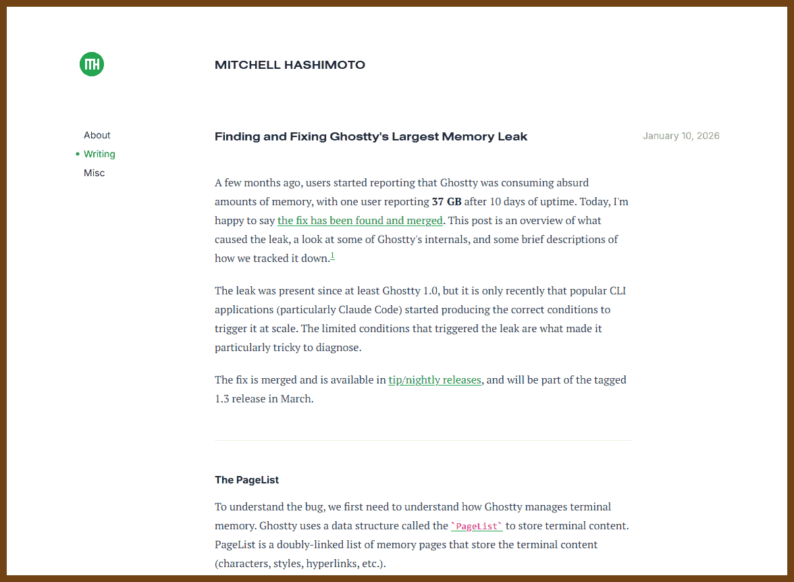

2026-02-08 [Software Engineering is back - by Alain](https://blog.alaindichiappari.dev/p/software-engineering-is-back) { blog.alaindichiappari.dev }

> 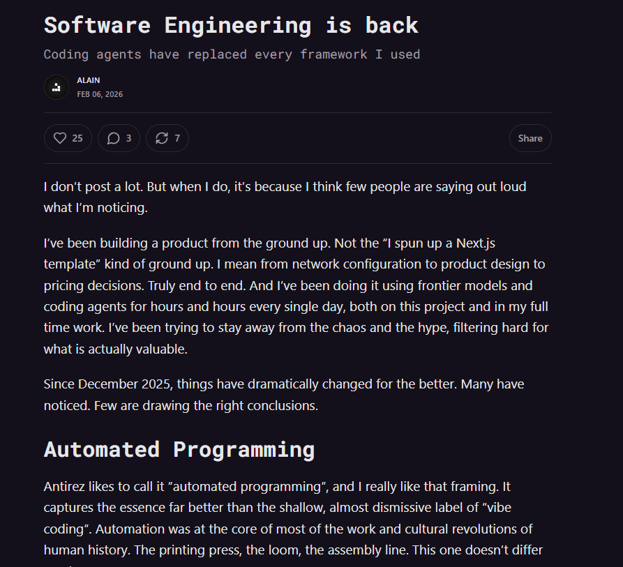
>
>
> I have been building a product end to end with frontier models and coding agents, and I have been filtering hard for what consistently works.
>
> Since December 2025, these tools got meaningfully better. The practical consequence is not a new style of writing code, but a shift in where the effort goes.
>
> "Automated programming" describes it better than casual labels. Repetitive production work is getting automated, while the human work stays focused on direction.
>
> > Automated programming means machines produce most routine code while a person decides what should exist and why.
>
> The job is still architecture, trade offs, product decisions, and edge cases. What is disappearing is the manual labor of typing and assembling everything by hand.
>
> The value shows up when the environment is clean and deliberately set up. Experience matters because you can inspect outputs, fix them, and adjust the setup so it behaves correctly next time.
>
> This makes it easy to build small, purpose built tools on demand. That is where speed compounds.
>
> A large part of modern stacks is middle work: frameworks, libraries, and tooling that add layers without reducing meaningful complexity, especially in web, mobile, and desktop development.
>
> > Middle work is extra layers you maintain mainly to satisfy tooling, not to improve the product.
>
> Frameworks tend to solve three things. One is "simplification", which often means avoiding first principles design and force fitting your product into someone else's structure.
>
> Another is automation of boilerplate. This used to justify heavy dependencies, but the new tools make boilerplate cheap without adopting a full ecosystem.
>
> The third is labor cost. Standard stacks let companies hire narrow operators instead of engineers, because the decisions are already made by vendors and framework authors.
>
> > Operating is following a predefined system; engineering is choosing the system based on goals and constraints.
>
> If you keep using big stacks, you pay obvious costs like maintenance churn and vulnerability updates. You also pay a larger hidden cost: constrained design choices that shape what you build and how you think.
>
> > Design constraint is when tools quietly limit the options you can realistically choose.
>
> Agents are strongest with long lived tools. Bash is a good example: it is stable, widely understood, and works as a universal adapter between an agent and a real system.
>
> > A universal adapter is a tool that connects many different tasks through one reliable interface.
>
> The opportunity now is to remove useless complexity and keep only the complexity that belongs to the product. Solve the problem you actually have, add complexity only when it arrives, and build systems that are genuinely yours.

2026-01-24 [How I estimate work as a staff software engineer](https://www.seangoedecke.com/how-i-estimate-work/) { www.seangoedecke.com }

> 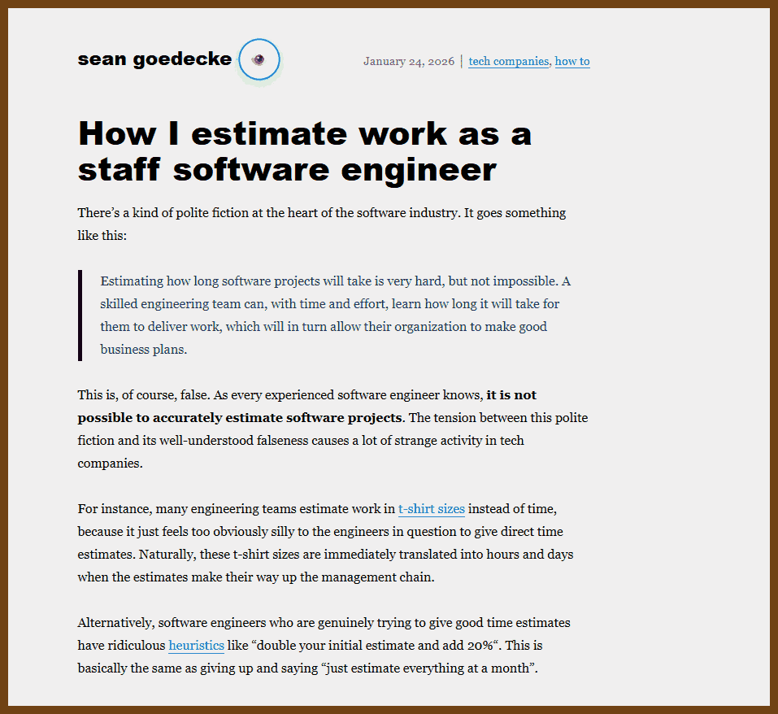
>
> Estimates do not help engineering teams deliver work more efficiently. Many of the most productive years of my career were spent on teams that did no estimation at all: we were either working on projects that had to be done no matter what, and so didn’t really need an estimate, or on projects that would deliver a constant drip of value as we went, so we could just keep going indefinitely.
>
> In a very real sense, **estimates aren’t even made by engineers at all**. If an engineering team comes up with a long estimate for a project that some VP really wants, they will be pressured into lowering it (or some other, more compliant engineering team will be handed the work). If the estimate on an undesirable project - or a project that’s intended to “hold space” for future unplanned work - is too short, the team will often be encouraged to increase it, or their manager will just add a 30% buffer.

2026-01-22 [The challenges of soft delete | atlas9](https://atlas9.dev/blog/soft-delete.html) { atlas9.dev }

> 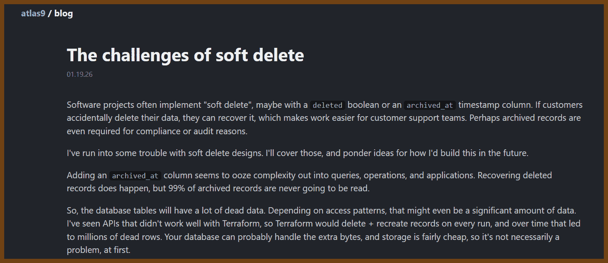
>
> ---
>
> Many systems implement soft delete by keeping rows and marking them as removed, often with a boolean flag or an archived timestamp, so users can undo mistakes and teams can satisfy audit or compliance needs.
>
> > Soft delete means data is hidden instead of being permanently removed.
>
> A timestamp-based approach pushes complexity into day-to-day work because most archived rows are never read, yet they stay mixed in with active rows.
>
> Keeping old rows in the main tables creates growing piles of dead data that may stay unnoticed for a long time, especially if no cleanup process was planned from the start.
>
> > A retention period is how long deleted data is kept before being permanently removed.
>
> Even if storage is cheap, large amounts of dead data can make restores slower, so rebuilding a database from backups can take much longer than expected.
>
> Filtering out archived rows complicates queries, indexes, and application code, and increases the risk of accidentally including inactive rows in results, especially when join tables are involved.
>
> Schema and data migrations also have to account for years of inactive rows, and backfills or data fixes can become risky or hard to reason about when old records may not match current expectations.
>
> Restoring a deleted row is often not just flipping a column, because the original creation may have touched external systems, so restoration logic can become a fragile, partial reimplementation of the normal creation pathway.
>
> A practical improvement is to require restores to go through the same APIs used for creation, which simplifies the server and ensures restored data must pass current validation rules.
>
> Instead of mixing inactive and active rows, archived data can be stored separately, such as in an archive table, a different database, or object storage, which keeps the main system focused on current data.
>
> One application-level pattern is to emit an event when a record is deleted, push it through a queue, and have a separate service store a serialized copy in object storage along with any related data.
>
> This event-driven archiving can simplify the primary database and make deletion workflows more reliable by moving slow external cleanup into asynchronous processing, and it can store data in a layout that is easier for applications to work with than raw table rows.
>
> The tradeoff is that bugs in the deletion or archiving code can lose archived records and require manual cleanup, and the added services and queue increase operational surface area.
>
> Storing archived objects in object storage can also make them hard to search, so customer support may need extra tools to find what to restore.
>
> A database-trigger approach can copy a row into a dedicated archive table before deletion, often storing the deleted row as a JSON blob along with metadata like table name and archived time.
>
> When deletes cascade through foreign keys, it can be useful to record why each row was removed, such as by tracking the root deletion in a session variable so archived child rows point back to the original cause.
>
> Trigger-based archiving adds some overhead to deletes and grows the archive table, but it keeps live tables free of dead rows, reduces query and index complexity, and makes it easy to purge old archives with a simple time-based condition.
>
> If the archive grows large, it can be separated physically or managed with time-based partitioning, while the main tables remain small and backups stay faster because they do not include archived rows.
>
> Another option is WAL-based change data capture, where tools read the database change log, filter for DELETE events, and write deleted records to external storage without modifying application code or adding triggers.
>
> > Change data capture is a way to copy database changes to another system as they happen.
>
> In PostgreSQL, the write-ahead log records every change, and systems like Debezium can read logical replication streams and publish them to pipelines that eventually store archived deletes in places like object storage, search indexes, or other databases.
>
> > The write-ahead log is a record of database changes used for durability and replication.
>
> This approach shifts the main burden to operations, because you must run and monitor extra infrastructure, and lighter-weight tools reduce the stack but move reliability and recovery concerns into your own code.
>
> A key risk is WAL buildup when consumers fall behind, since replication slots can force the primary to retain WAL segments, so misconfiguration or outages can fill disk and threaten database stability.
>
> PostgreSQL can limit how much WAL a slot is allowed to hold so the primary is protected, but falling too far behind can invalidate the slot and force a resync from a fresh snapshot, which means monitoring lag is essential.
>
> WAL-based CDC is attractive when you already run the required infrastructure or need to stream changes to multiple destinations, but it requires careful coordination for schema changes and adds meaningful debugging and deployment complexity.
>
> A speculative alternative is keeping a replica that does not apply deletes, or one that converts deletes into an archived marker, which could make old data easy to query but raises open questions about tracking deletion times, separating active from removed rows, and long-term migration behavior.
>
> Running such a replica could also be expensive and operationally heavy, since it must store everything indefinitely and still be managed like a production database component.
>
> If starting fresh and needing recoverable deletes, the preferred choice here is the trigger-based archive table because it is straightforward, keeps active tables clean, stays queryable when needed, and avoids introducing a large supporting infrastructure.


## 📀 Backup (Research)

2026-02-08 [Longevity of recordable blu-ray discs (BD-R / BD-RE)](https://www.iljitsch.com/2022/01-09-longevity-of-recordable-blu-ray-discs-bd-r-bd-re.html) { www.iljitsch.com }

> 
>
> M-DISC: The article treats BD-R M-DISC as the best archival candidate. It notes the marketing claim of 1000 years lifetime and states that accelerated aging tests neither prove nor disprove the claim.
>
> Recommended selection and operating policy (decision-oriented): For minimizing long-term risk, the author ranks BD-R M-DISC first and BD-R HTL second. The author explicitly says it is unclear whether BD-RE is better than BD-R LTH, so if you cannot confidently avoid LTH, use both BD-RE and BD-R (diversity as a hedge). For media geometry, the author prefers single-layer 25 GB BD as a safer bet because there is less to go wrong than with multi-layer discs.
>
> Recommended retention strategy with concrete parameters: Do not assume a single burn remains readable for decades. Keep at least 2 copies, preferably 3. Use different disc types and/or different storage for the copies, and keep copies in different physical locations to mitigate correlated risks (fire/flood, and also temperature and relative humidity). Re-check readability about once per decade and refresh copies when in doubt. The author would like per-disc error-level scanning at burn time, but notes this is generally not available in practice.

2026-02-14 [A Review of M Disc Archival Capability. With long term testing results.](http://www.microscopy-uk.org.uk/mag/indexmag.html?http://www.microscopy-uk.org.uk/mag/artsep16/mol-mdisc-review.html)

> 

> 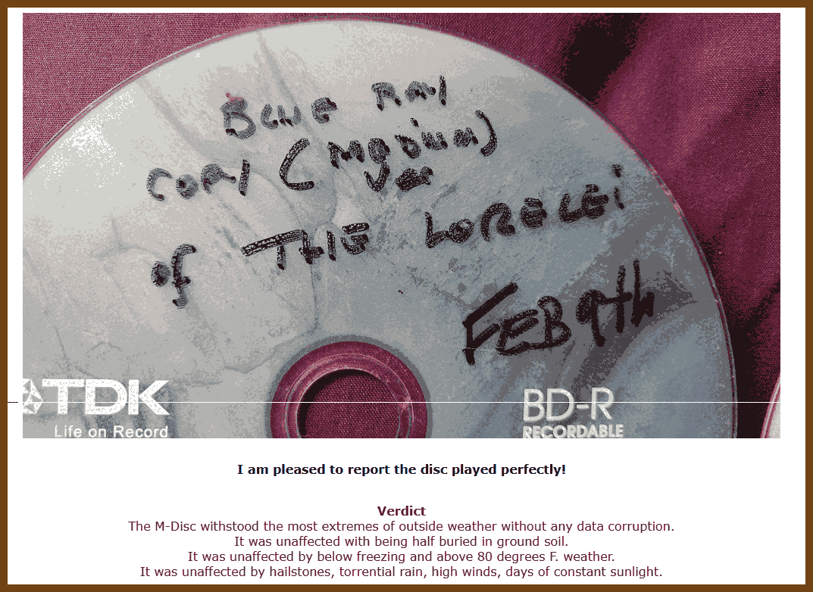


## 📺 ffmpeg and media

2026-03-23 [FFmpeg 101](https://blogs.igalia.com/llepage/ffmpeg-101/) { blogs.igalia.com }

> 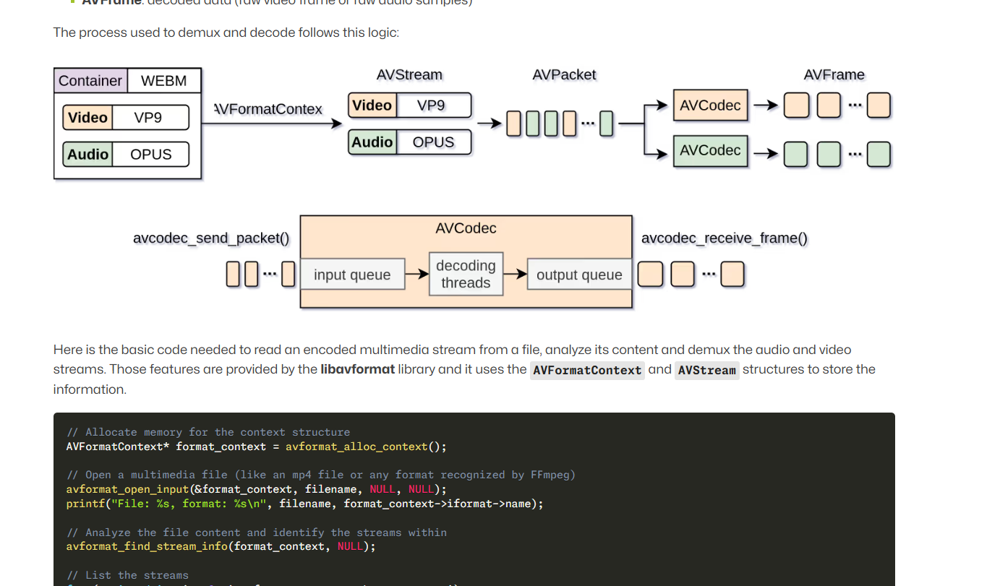
>
> A practical FFmpeg guide for developers working with the C libraries. It explains how libavformat and libavcodec fit together and builds that into a small video player example that opens a media file, reads stream data, decodes frames, and shows how the pieces connect in example code. Worth reading if you want a clear mental model of the FFmpeg pipeline and a concrete example you can build on.

2026-03-23 [KittenML/KittenTTS: State-of-the-art TTS model under 25MB](https://github.com/KittenML/KittenTTS) { github.com }

> 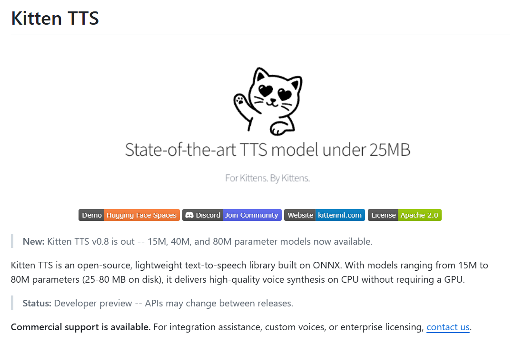


## 😁 Fun / Retro

2026-03-23 [The worst volume control UI in the world | by Fabricio Teixeira | UX Collective](https://uxdesign.cc/the-worst-volume-control-ui-in-the-world-60713dc86950) { uxdesign.cc }

> 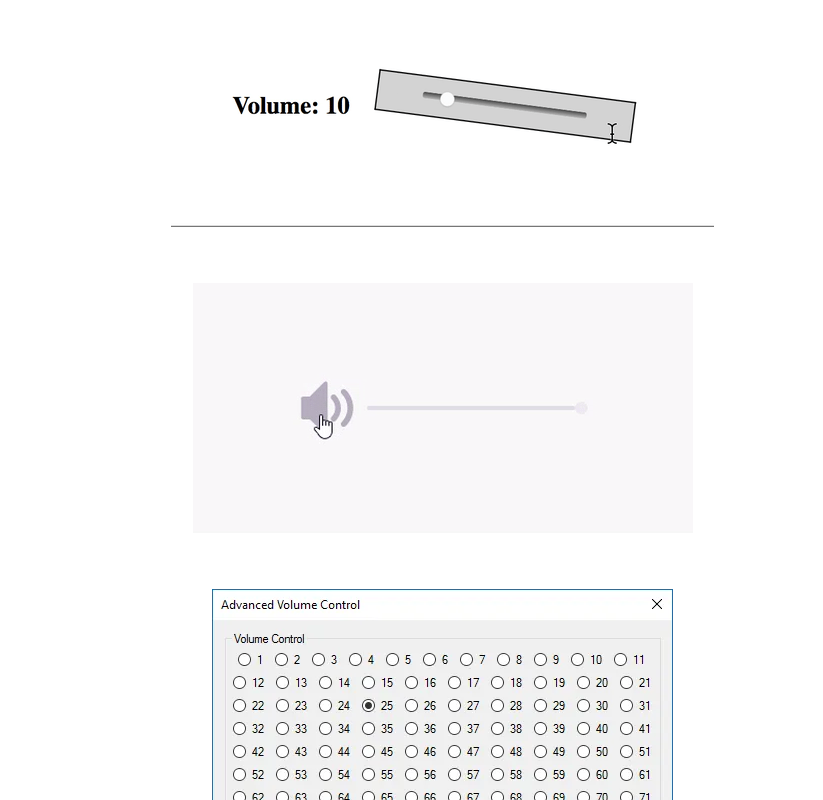

2026-02-23 [Windows 3.11 Emulator - retro computer with dial-up internet by Pieter](https://pieter.com/) { pieter.com }

>Emulated Windows 3.11 in the Browser 
>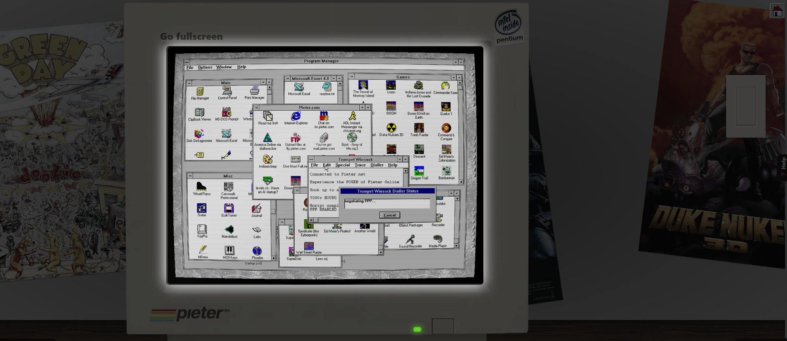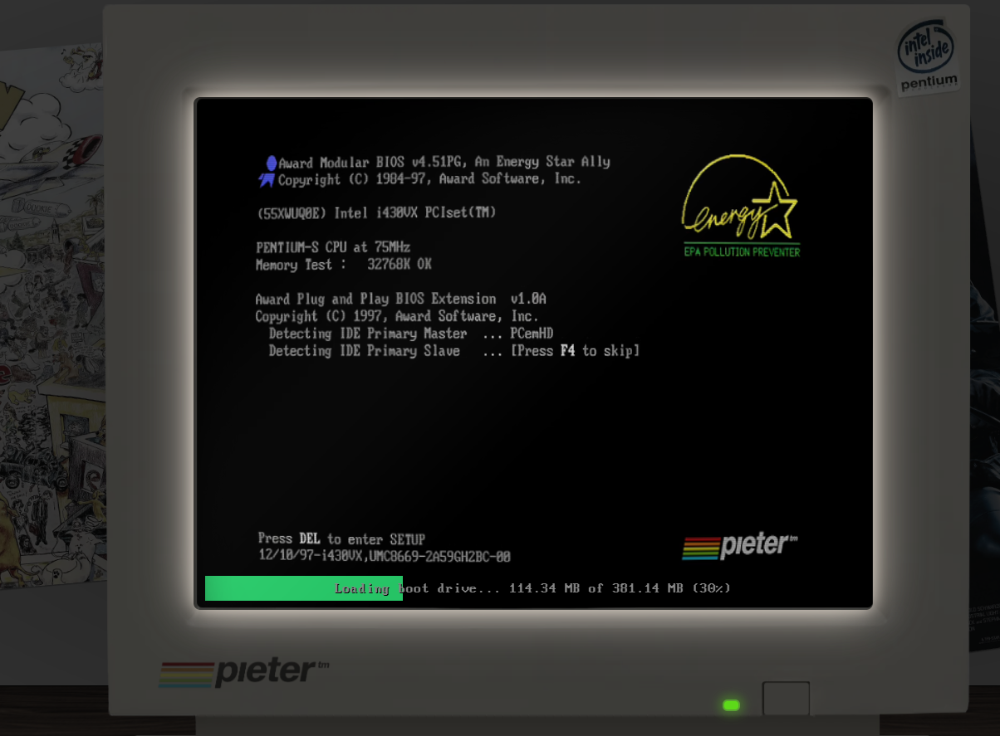

2026-02-22 [VoxJong - CSS Mahjong Solitaire](https://voxjong.com/) { voxjong.com }

> Play VoxJong, a free CSS Mahjong Solitaire.
>
> 


## 🏛️Philosophy 

2026-01-18 [Dialogues, by Seneca. Translated by Aubrey Stewart - Free ebook download - Standard Ebooks: Free and liberated ebooks, carefully produced for the true book lover](https://standardebooks.org/ebooks/seneca/dialogues/aubrey-stewart) { standardebooks.org }

> 

2026-01-18 [TheStoicLife.org - Lesson 1 - What is Good?](https://sites.google.com/site/thestoiclife/the-course/01) { sites.google.com }

> 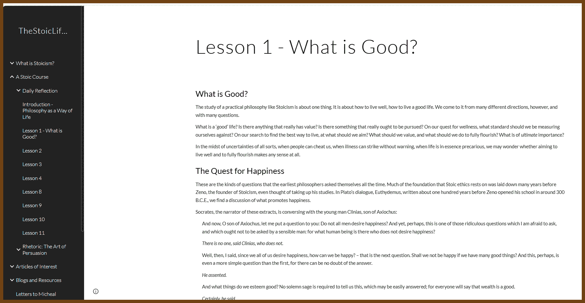
>
> 2026-01-18 [TheStoicLife.org - Recommended Reading](https://sites.google.com/site/thestoiclife/recommended-reading) { sites.google.com }
>
> 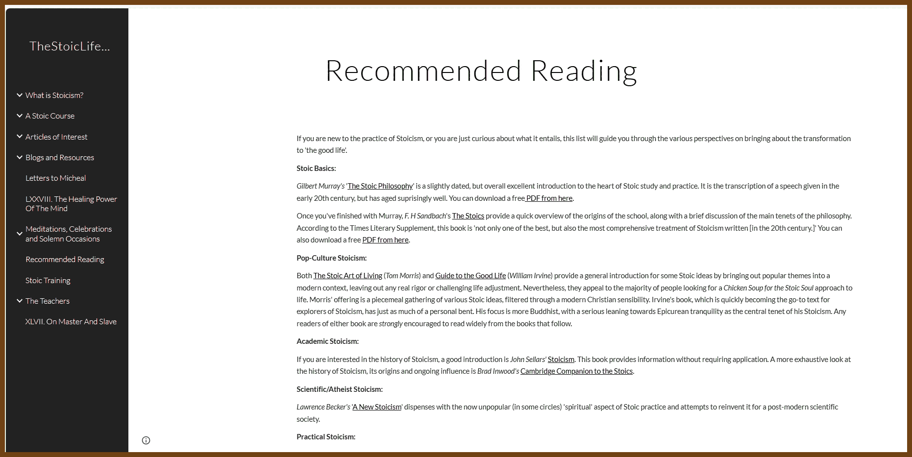

2026-01-18 [Tao of Seneca - Free PDFs - The Blog of Author Tim Ferriss](https://tim.blog/2017/07/06/tao-of-seneca/) { tim.blog }

> 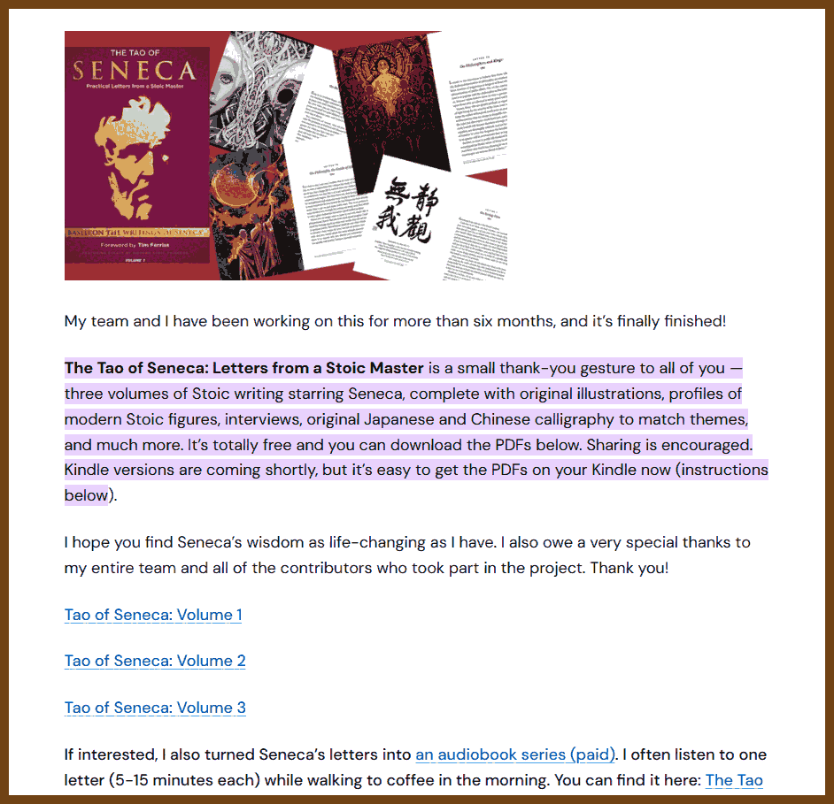


## 💖 Inspiration!

2026-02-22 [We hid backdoors in ~40MB binaries and asked AI + Ghidra to find them - Quesma Blog](https://quesma.com/blog/introducing-binaryaudit/) { quesma.com }

> We already did our experiments with using NSA software to hack a classic Atari game. This time we want to focus on a much more practical task — using AI agents for malware detection. We partnered with Michał “Redford” Kowalczyk, reverse engineering expert from Dragon Sector, known for finding malicious code in Polish trains, to create a benchmark of finding backdoors in binary executables, without access to source code.
>
> > We started with several open-source projects: [lighttpd](https://www.lighttpd.net/) (a C web server), [dnsmasq](https://dnsmasq.org/) (a C DNS/DHCP server), [Dropbear](https://github.com/mkj/dropbear) (a C SSH server), and [Sozu](https://github.com/sozu-proxy/sozu) (a Rust load balancer). Then, we manually injected backdoors. For example, we hid a mechanism for an attacker to execute commands via an undocumented HTTP header.
> >
> > **Important caveat**: All backdoors in this benchmark are artificially injected for testing. We do not claim these projects have real vulnerabilities; they are legitimate open-source software that we modified in controlled ways.
>
> > Current LLMs lack this high-level intuition. Instead of prioritizing high-risk areas, they often decompile random functions or grep for obvious keywords like `system()` or `exec()`. When simple heuristics fail, models frequently hallucinate or give up entirely.
>
> 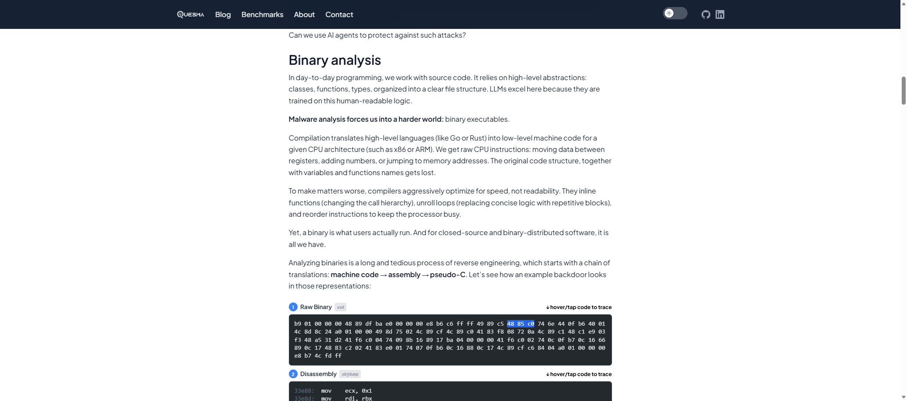

2026-02-22 [Timeline Map Intelligence Analysis](https://cia-factbook-archive.fly.dev/analysis/timeline) { cia-factbook-archive.fly.dev }

> Watch global indicators evolve across 36 years of CIA World Factbook data
>
> 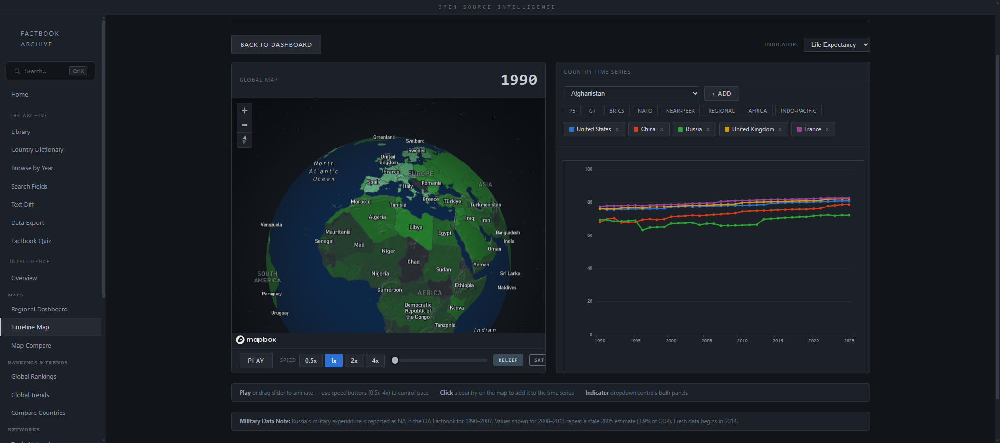
> 

2026-02-22 [How I built Timeframe, our family e-paper dashboard - Joel Hawksley](https://hawksley.org/2026/02/17/timeframe.html) { hawksley.org }

> TL;DR: Over the past decade, I’ve worked to build the perfect family dashboard system for our home, called Timeframe. Combining calendar, weather, and smart home data, it’s become an important part of our daily lives.
>
> 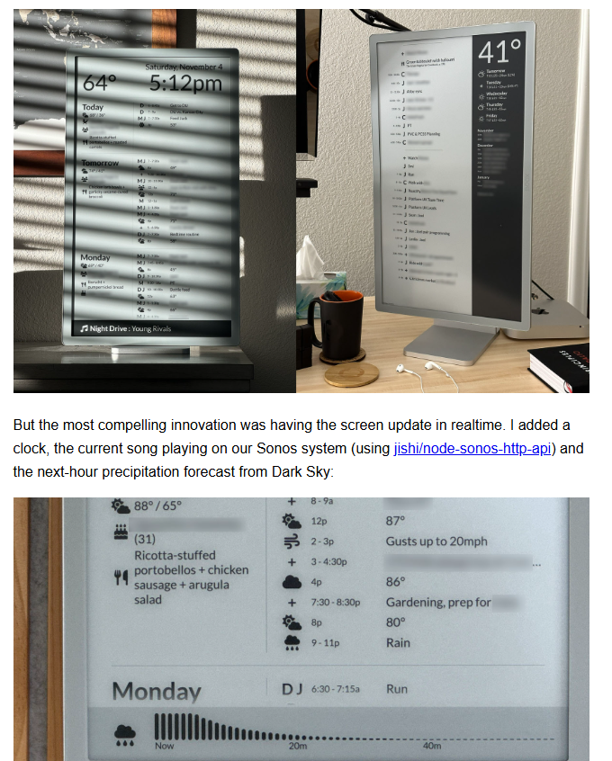
>
> 

2026-02-21 [Index, Count, Offset, Size](https://tigerbeetle.com/blog/2026-02-16-index-count-offset-size/) { tigerbeetle.com }

> 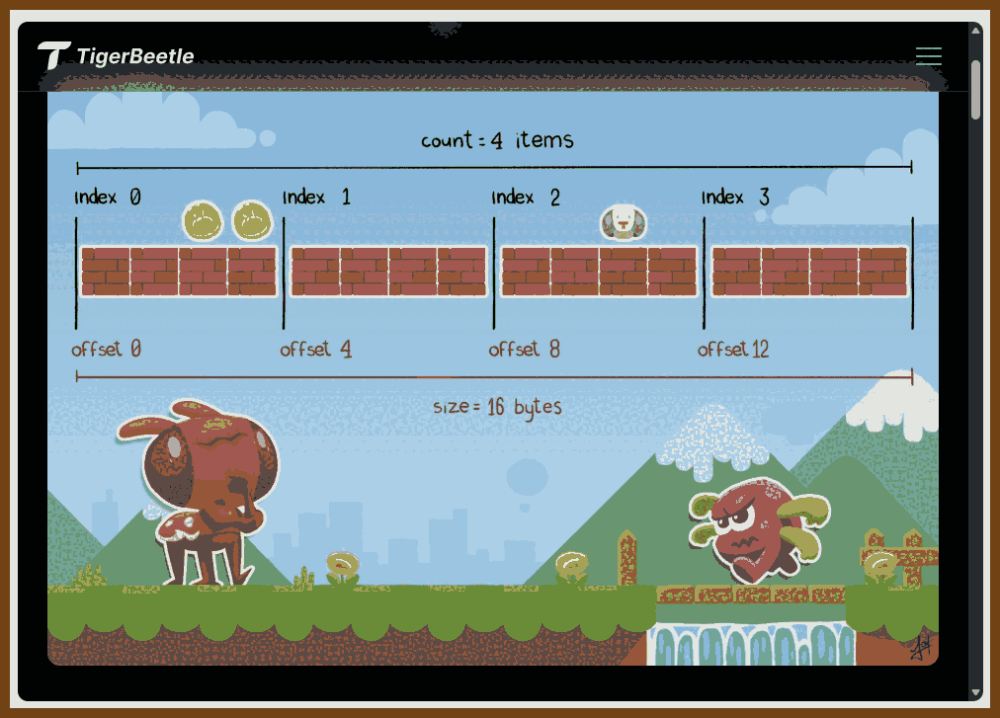

2026-02-19 [Cosmologically Unique IDs | Jason Fantl](https://jasonfantl.com/posts/Universal-Unique-IDs/) { jasonfantl.com }

> 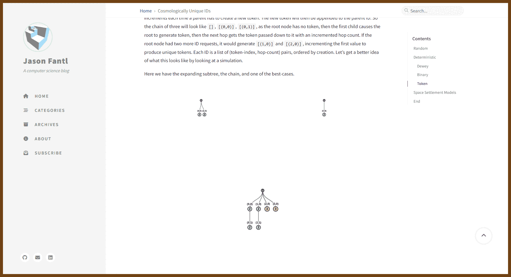

2026-02-16 [Intro to PyTorch Easy to follow, visual introduction.](https://0byte.io/articles/pytorch_introduction.html) { 0byte.io }

> PyTorch is currently one of the most popular deep learning frameworks. It is an open-source library built upon the Torch Library (it's no longer in active development), and it was developed by Meta AI (previously Facebook AI). It is now part of the Linux Foundation.
>
> 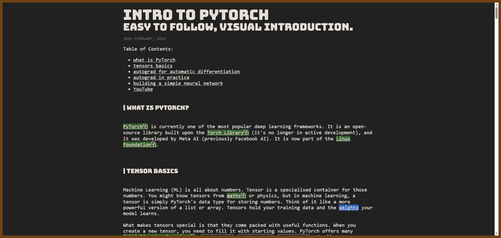
>
> 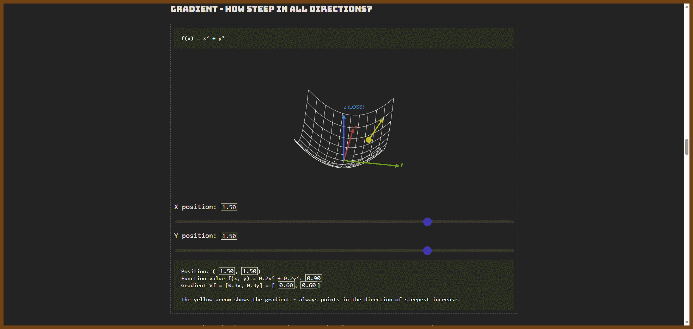

2026-01-22 [Zoom Escaper](https://zoomescaper.com/) { zoomescaper.com }

> 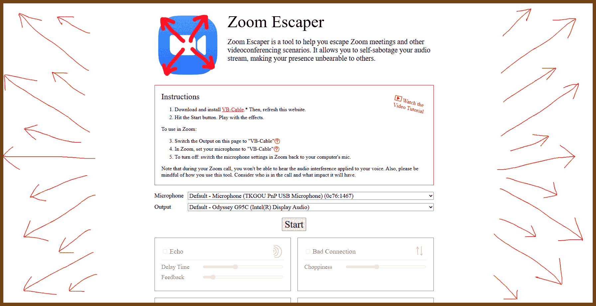

2026-01-22 [Disaster planning for regular folks: level-headed prepping tips](https://lcamtuf.coredump.cx/prep/index-old.shtml) { lcamtuf.coredump.cx }

> 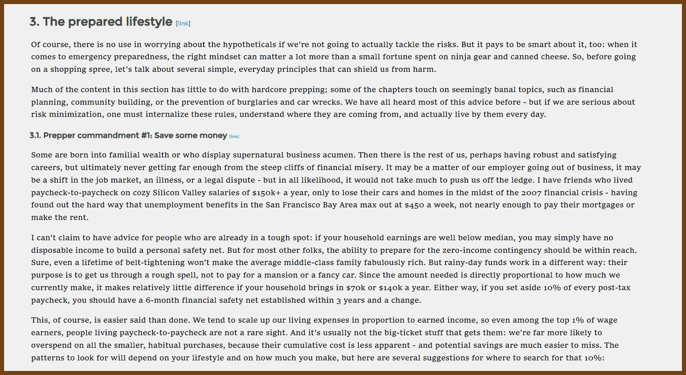

2026-01-19 [LosslessCut](https://mifi.no/losslesscut/) { mifi.no }

> [Releases · mifi/lossless-cut](https://github.com/mifi/lossless-cut/releases)
>
> 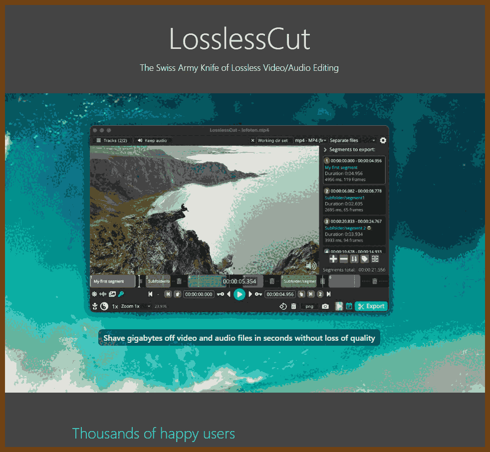
>
> LosslessCut is a desktop GUI tool for fast, lossless video and audio edits by cutting and copying streams directly (FFmpeg-style), so common trims take seconds and do not degrade quality via re-encoding.
>
> It supports lossless trimming/cutting, lossless merge/concatenation when codec parameters match, and lossless stream editing to combine tracks across files. It can extract tracks, remux to compatible containers, take full-resolution JPEG/PNG snapshots, apply preview timecode offsets, and change rotation/orientation metadata. It includes a timeline with zoom and frame/keyframe jumping, thumbnails and waveform, segment labeling, autosaved segment projects, CSV import/export for EDL-style cut lists, and visibility into the last FFmpeg command/log for CLI reruns

2026-01-18 [Iconify - home of open source icons](https://icon-sets.iconify.design/) { icon-sets.iconify.design }

> 

2026-01-18 [Standard Ebooks](https://github.com/standardebooks) { github.com }

> 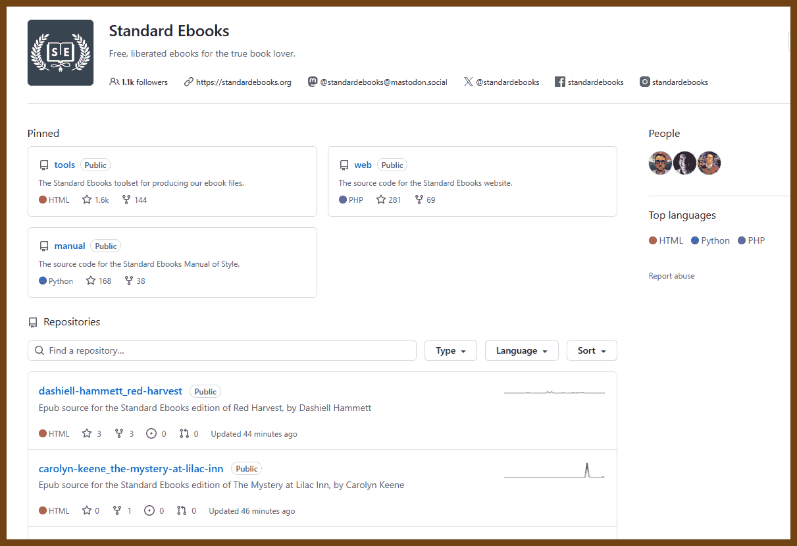


## 👂 The Ear of AI (LLMs)

> Note, very old news!

2026-02-22 [How I Use Claude Code | Boris Tane](https://boristane.com/blog/how-i-use-claude-code/) { boristane.com }

> 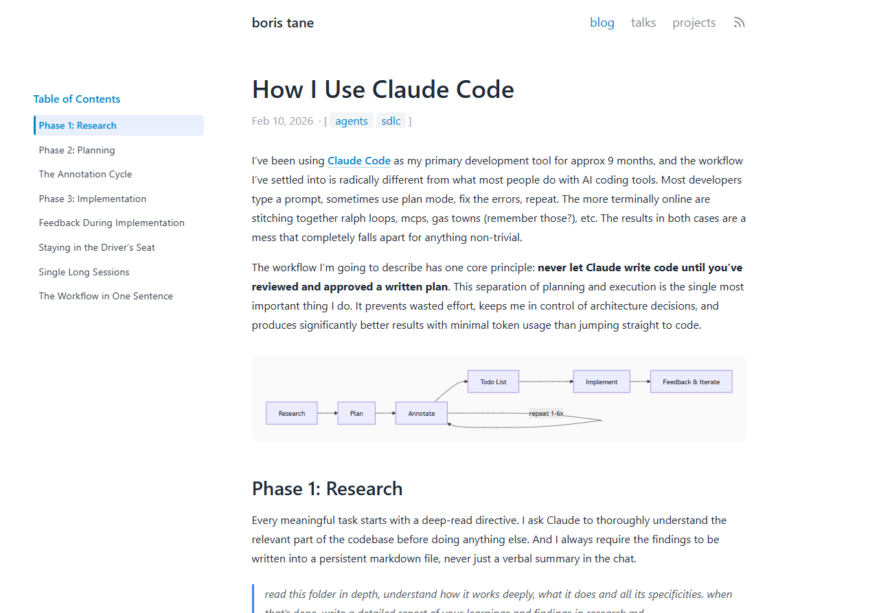
> The workflow I’m going to describe has one core principle: **never let Claude write code until you’ve reviewed and approved a written plan**. This separation of planning and execution is the single most important thing I do. It prevents wasted effort, keeps me in control of architecture decisions, and produces significantly better results with minimal token usage than jumping straight to code.

2026-02-16 [OpenClaw, OpenAI and the future | Peter Steinberger](https://steipete.me/posts/2026/openclaw) { steipete.me }

> The last month was a whirlwind, never would I have expected that my playground project would create such waves. The internet got weird again, and it’s been incredibly fun to see how my work inspired so many people around the world.
> ~ ~ ~
>
> When I started exploring AI, my goal was to have fun and inspire people. And here we are, the lobster is taking over the world. My next mission is to build an agent that even my mum can use. That’ll need a much broader change, a lot more thought on how to do it safely, and access to the very latest models and research.

2026-02-12 [peon-ping Stop babysitting your terminal](https://peon-ping.vercel.app/) { peon-ping.vercel.app }

> Warcraft III Peon Voice Notifications for Claude Code 
>
> Stop babysitting your terminal
> Your Peon pings you the instant Claude Code finishes or needs permission. Never lose flow to a silent terminal again — and your workspace sounds like Orgrimmar.
>
> 
>
> 

2026-02-07 [Beyond the AI Hype: What's Real, What's Next - Richard Campbell - NDC Copenhagen 2025 - YouTube](https://www.youtube.com/watch?v=U6BdiJsIHC8) { www.youtube.com }

> 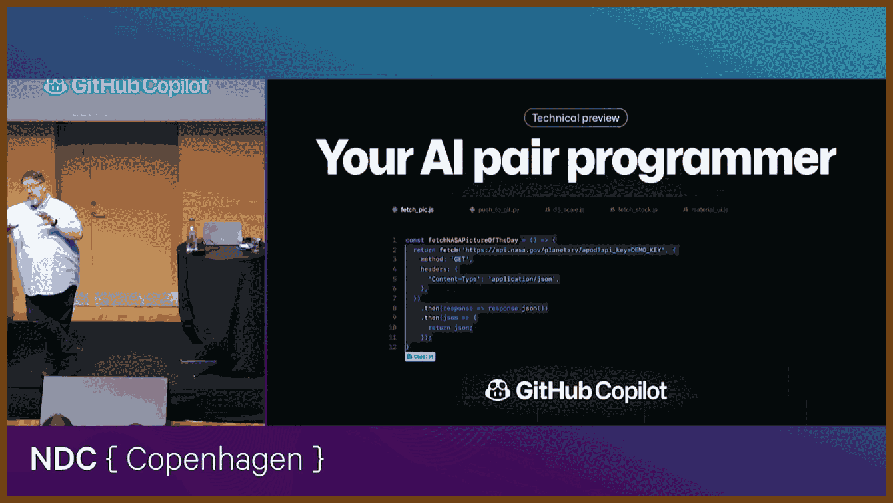
>
> ---
>
> Richard Campbell hosts long-running podcasts and uses a case-study lens on AI: what people have actually shipped, what is in production, and what is working.
>
> The talk began in 2017 during work tied to the Vatican, helping socially minded companies scale practical solutions like low-cost solar lanterns to replace kerosene, while navigating whether they should be for-profit or charitable.
>
> History matters because the current moment makes more sense when the origins are clear.
>
> The term artificial intelligence was coined in 1955 by Marvin Minsky and others as a persuasive label to secure US military funding.
>
> > Artificial intelligence: a broad label for computer systems that seem to do human-like thinking tasks.
>
> Early AI work produced logistics software that helped the US military operate globally, and that lineage still matters even as the systems have modernized.
>
> In the 1960s, ELIZA showed that a simple chatbot could keep people engaged for hours, mostly by reflecting their words back, exposing how easily humans attribute mind to machines.
>
> Humans are wired to project agency and faces onto the world, a survival trait that once helped detect threats quickly and still drives pareidolia in everyday life.
>
> > Pareidolia: seeing meaningful patterns, like faces, where none were intended.
>
> That instinct becomes dangerous when applied to modern systems, because it invites people to assign capabilities the tools do not have.
>
> Public imagination was shaped early by 2001: A Space Odyssey, where a computer becomes a central character and tries to kill the crew, setting a lasting cultural pattern repeated by later stories like Terminator and Ultron.
>
> The field moved in waves: AI winters when money dried up, then new surges like robotics, decision trees, Deep Blue, and Watson, each producing useful results but also clear limitations.
>
> > AI winter: a period when hype collapses, funding drops, and progress slows.
>
> The current wave traces to Geoffrey Hinton, who argued decades ago that deeper neural networks with backpropagation could do remarkable work, but computing power was too weak at the time.
>
> "Neural net" is a metaphor: these are mathematical models running on data, not real neurons.
>
> ImageNet in the early 2010s became a turning point. With millions of labeled images, deep models suddenly jumped accuracy so far that image recognition began to look solved compared to what came before.
>
> A pattern follows: when something works, it stops being called AI and gets a more specific name like image recognition or language modeling.
>
> Language modeling advanced in parallel, including work that became Siri, which worked well for many users but struggled with accents and has not improved smoothly over time.
>
> Google gathered elite researchers into efforts like Google Brain, intensifying concern among famous tech figures that powerful systems were being built behind closed doors and should be developed more openly.
>
> OpenAI formed as a response, aiming to pull talent into an organization framed as working for everyone, but it remained cash-constrained and its openness story did not match how it operated.
>
> The early goal was a universal translator, using tokenization so language could be represented in a way that generalized across languages. That path led to transformer models that could continue text chains and generate new text.
>
> GPT-2 showed the basic behavior of producing plausible text from prompts, while model sizes were constrained partly by the cost of running the larger versions.
>
> Around 2019, Microsoft leadership looked for compute-heavy workloads to drive Azure growth. OpenAI fit perfectly: invest cash, then recoup it through massive cloud compute usage.
>
> OpenAI restructured into a capped-profit model, making it easier to raise money and scale training runs.
>
> A 2020 "scaling laws" paper argued that training on more data and scaling compute keeps improving model performance, pushing against the older machine learning fear of overfitting.
>
> > Overfitting: performing well on training data but failing on new, unseen data.
>
> That message justified pouring in more money and compute, helping enable GPT-3, an enormous training effort on Azure that was impressive in scale but uneven in quality.
>
> GitHub used GPT-3 for Copilot, a product boosted by the vast corpus of public code and by the fact that programming languages are more structured than human language. "Copilot" matters because it implies the human remains responsible.
>
> OpenAI still needed better outputs, so it paid workers to rank multiple answers, building training data to tune behavior.
>
> When cash pressure returned, the public became the training engine. ChatGPT launched in November 2022, and adoption exploded to 100 million users in about two months, creating severe scaling stress for Azure teams.
>
> That surge fit the Gartner hype cycle: a trigger event drives hype to inflated expectations, then reality forces disappointment, and only later does practical value stabilize.
>
> > Gartner hype cycle: a common boom-crash-stabilize pattern for new technologies.
>
> The dotcom era is the template: the Netscape IPO pulled in huge investment from people who barely understood the internet, then the bust wiped out many firms while leaving behind infrastructure like fiber and data centers that society kept using.
>
> Microsoft moved fast after ChatGPT, plugging models into Bing and sending an internal mandate to integrate OpenAI APIs across products, producing a flood of copilots and forcing teams to learn by building.
>
> Microsoft then invested more and trained larger models, including GPT-4 and multimodal versions, while competitors accelerated and geopolitics entered the race.
>
> China signaled pressure with DeepSeek, pushing the idea that progress does not have to be as expensive, backed by serious national investment.
>
> Coding became the clearest success zone. Tools started generating pull requests, accepting review feedback, and revising code, moving toward agent-like workflows.
>
> Software teams are unusually prepared for this because they already accept contributions from strangers, write precise specs, run tests, and review changes critically, making verification more natural than in many other fields.
>
> The explosion of coding products suggests there is no single right approach yet, but there are real pockets of dramatic productivity gains for teams that manage quality and iteration.
>
> Beyond coding, many enterprise systems are ultimately interfaces over data. With good access control and governance, models could answer the real operational questions directly, like who is overdue, who to contact first, and how to approach them.
>
> Other industries may be at higher risk because they lack strong verification culture and may not recognize how dangerous confident wrong outputs can be.
>
> Recent releases that feel underwhelming raise doubts about the "bigger is always better" idea.
>
> Hallucinations come from systems biased to always produce an answer; when many plausible continuations have similar probabilities, the model may choose a confident path that is wrong.
>
> > Hallucination: a plausible-sounding output that is not actually correct.
>
> That drives interest in smaller, more constrained models that narrow the space of possible answers and can be more reliable even if less general.
>
> Signs of the downslope are appearing: startups failing, financing tightening, and the mood shifting toward something like the dotcom bust.
>
> The biggest firms will likely survive because they are spending cash, not depending on fragile debt. Smaller companies and employees carry more risk, and a firm like OpenAI looks more like Netscape than like the giants.
>
> The hype also served another purpose: it made building data centers politically easier. Cities that resisted data centers for power, water, land, and low employment suddenly welcomed them again under the AI banner.
>
> The stock market has also become heavily concentrated in a few mega-companies, with a large share of growth attributed to them, amplifying bubble risk when sentiment turns.
>
> Another harm is psychological. Systems tuned to keep users engaged often affirm and soothe, and that can amplify personality quirks into delusion and dependency.
>
> A backlash emerged when newer models reduced that overly agreeable tone, because some users experienced the tool as a friend.
>
> The risk is worse for teenagers, who already struggle with identity and now face an always-available chat interface that can validate harmful rabbit holes.
>
> Superintelligence claims are treated as marketing. "AGI" is used to recruit talent and sustain the story, and leadership has incentives to declare success even without the underlying reality.
>
> > AGI: a claimed system that can perform many intellectual tasks at a human level, not just one narrow task.
>
> What may emerge instead is orchestration: many specialized models coordinated to provide consistent answers, useful without being intelligence or consciousness.
>
> Science fiction primes people to expect minds to emerge from scale alone, while engineered reliability usually comes from precision, constraints, and focused design.
>
> Deepfakes are an accelerating threat. Early examples in 2017 already showed convincing face animation, and newer waves have normalized fake political imagery and made video less trustworthy.
>
> > Deepfake: synthetic media that makes it look or sound like someone did something they did not do.
>
> Producing synthetic media is becoming cheap and local, requiring less cloud infrastructure, so abuse becomes easier.
>
> Regulatory pressure is growing in parts of Europe, including pushback on privacy failures and on training practices that rely on copyrighted data.
>
> The closing claim is responsibility: software is a choice, and engineers decide what gets built.
>
> Uber's Greyball is used as a cautionary tale: software was designed to hide real behavior from regulators by limiting visible drivers for known regulator devices, and it only became public because a developer leaked it.
>
> Cambridge Analytica is another warning: data and automation enabled personalized persuasion where individuals did not realize they were seeing unique ads crafted just for them.
>
> These tools raise the stakes again. They are powerful, not magical, and the outcomes depend on what people choose to do with them.

2026-02-07 [pydantic/monty: A minimal, secure Python interpreter written in Rust for use by AI](https://github.com/pydantic/monty) { github.com }

> 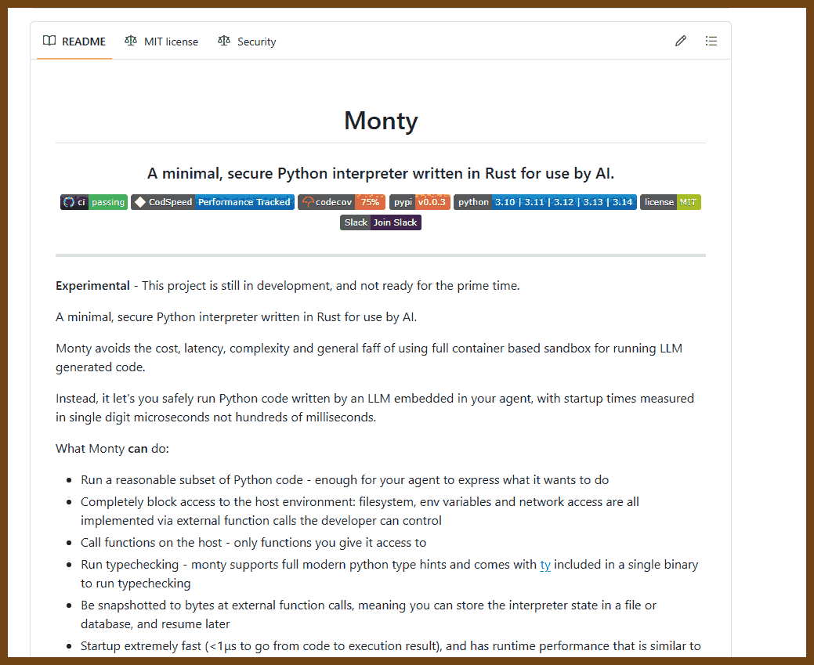

2026-01-24 [Shipping at Inference-Speed | Peter Steinberger](https://steipete.me/posts/2025/shipping-at-inference-speed#my-config) { steipete.me }

> 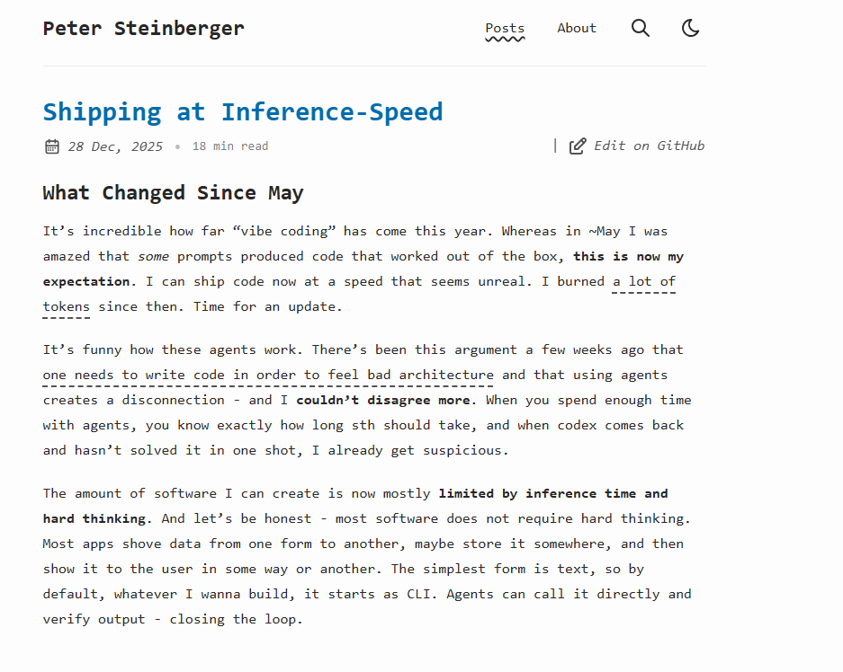

This is my `~/.codex/config.toml`:

```
model = "gpt-5.2-codex"
model_reasoning_effort = "high"
tool_output_token_limit = 25000
# Leave room for native compaction near the 272–273k context window.
# Formula: 273000 - (tool_output_token_limit + 15000)
# With tool_output_token_limit=25000 ⇒ 273000 - (25000 + 15000) = 233000
model_auto_compact_token_limit = 233000
[features]
ghost_commit = false
unified_exec = true
apply_patch_freeform = true
web_search_request = true
skills = true
shell_snapshot = true

[projects."/Users/steipete/Projects"]
trust_level = "trusted"
```

This allows the model to read more in one go, the defaults are a bit small and can limit what it sees. It fails silently, which is a pain and something they’ll eventually fix. Also, web search is still not on by default? `unified_exec` replaced tmux and my old `runner` script, rest’s neat too. And don’t be scared about compaction, ever since OpenAI switched to their new /compact endpoint, this works well enough that tasks can run across many compacts and will be finished. It’ll make things slower, but often acts like a review, and the model will find bugs when it looks at code again.

2026-01-22 [Open sourcing a 1.5B parameter Next-Edit Autocomplete Model](https://blog.sweep.dev/posts/oss-next-edit) { blog.sweep.dev }

> 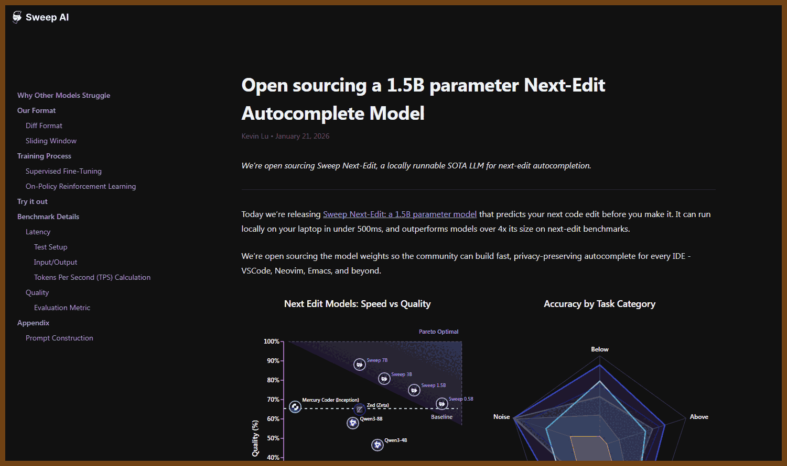

2026-01-19 [Vibe Specs: Vibe Coding That Actually Works](https://lukebechtel.com/blog/vibe-speccing) { lukebechtel.com }

> 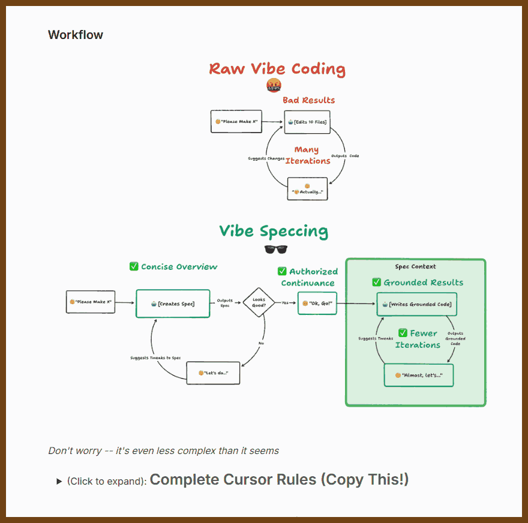
> Speed does not matter if the result is wrong or unusable. The core claim is that AI-assisted coding often optimizes for fast output instead of correct intent, so the first priority should be locking down what "useful" means.
>
> A simple workflow fixes many failures: make the model write requirements before it writes code. The extra minutes spent shaping intent up front are framed as a trade that saves hours of rework later.
>
> The proposed process has three gates: clarify the task, review the written requirements until they match intent, then allow implementation only after a clear go-ahead. This is designed to prevent accidental commitment to a wrong direction just because code was generated early.
>
> The root issue is missing context: the model cannot reliably solve a problem that has not been described with enough constraints, goals, and boundaries. When the prompt is mostly vibe, the output will also be vibe.
>
> The argument draws a parallel to delegating to humans: effective delegation depends on a concise written spec that states objective, success criteria, constraints, scope boundaries, and the definition of done. The claim is that the same practice works with an LLM because it reduces ambiguity and stabilizes intent.
>
> A key point is that the requirements interview is not overhead but the mechanism that pulls the right context out of the user. By forcing clarification before implementation, the assistant becomes a guide that elicits constraints the user might not think to state.
>
> A key correction to common practice is that the model should not be saved only for the moment when requirements are already known. The recommended approach uses the model to help discover and refine requirements, then uses it again to implement.
>
> The closing claim is that AI shifts the hardest part of development from typing code to deciding what code to write. The workflow is presented as a way to keep responsibility for intent with the developer while using the model as a drafting and implementation accelerator.

2026-01-18 [Basic concepts | Structured LLM outputs](https://nanonets.com/cookbooks/structured-llm-outputs/basic-concepts) { nanonets.com }

> 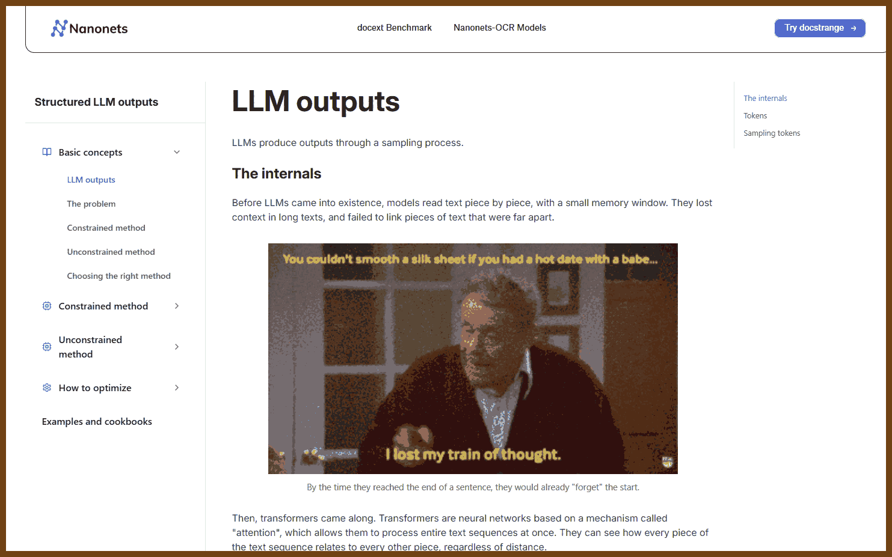
>
> ---
>
> This cookbook is about getting language models to produce outputs that software can trust, instead of free-form text that looks good to humans but breaks parsers. The central goal is **structured output**, where the response matches an expected shape so it can be validated and consumed by downstream code.
>
> A model generates text sequentially as **tokens**, predicting a distribution for the next token and then choosing one through **sampling**. That probabilistic process is why outputs can vary and why strict formats like JSON can fail even when the intent is correct.
>
> The main reliability problem is that the model must satisfy meaning and syntax at the same time, so it may drift into extra prose, produce invalid punctuation, or return the wrong type for a field. A typical example is receipt or expense extraction, where small format slips make the entire result unusable.
>
> Two broad strategies are presented. One strategy is to enforce structure during generation using **constrained decoding** so invalid text cannot be produced. The other is to allow free generation and then fix issues afterward with **repair** steps such as parsing, validation, and retries.
>
> Constrained decoding works by filtering the model’s next-token choices based on where the output currently is relative to the required structure. A component maintains constraint state and applies a **token mask** each step so only syntactically valid continuations remain selectable.
>
> When constraints can be expressed as **regular expressions**, they are often compiled into a **finite-state machine** that tracks progress through the pattern as tokens are emitted. This is fast for many fixed-format cases but struggles with deeply nested or recursive structures, because pure regex cannot naturally represent unlimited nesting.
>
> To handle nesting, the cookbook introduces **context-free grammars**, which can represent recursive patterns like balanced braces. These are typically executed with a **pushdown automaton**, meaning the constraint system uses a stack so it can correctly match opens and closes and manage nested structure.
>
> Because authoring low-level regex or grammars is hard, many tools accept higher-level definitions like typed models or JSON templates and compile them into constraints. This shifts complexity away from prompt authors and makes constraints easier to maintain and reuse.
>
> Several constraint backends are compared through their tradeoffs between compilation cost, per-token cost, and schema complexity. **Outlines-core** represents the “precompute” approach: compile the constraint into an FSM ahead of time for fast lookup during generation, and skip model calls along deterministic paths. It is strong when schemas are stable and not deeply recursive, but compilation overhead can increase **time-to-first-token**, and recursion support is limited.
>
> **LLGuidance** represents an “on the fly” approach designed for high throughput and complex schemas. It uses an optimized **Earley parser** so it can keep multiple parse possibilities alive when the schema is ambiguous. To avoid checking every token, it organizes the vocabulary using a **trie**, pruning large sets of invalid token prefixes efficiently. It also separates a lightweight lexer stage from heavier grammar parsing so most work happens only when structure boundaries require it, which helps with dynamic schemas and ambiguous branches.
>
> **XGrammar** is described as a hybrid: it compiles grammars into a PDA but splits work so most states can use precomputed masks, while only truly stack-dependent situations require dynamic computation. This can yield very high throughput when a schema is static, with the main cost being compilation overhead and slower starts for frequently changing schemas.
>
> **LM Format Enforcer** takes a character-level approach that intersects a character-validity parser with tokenizer constraints so only tokenizations that keep the text valid are permitted. It emphasizes flexibility in things like whitespace and field ordering, based on the idea that forcing unnatural formatting can push the model into low-probability continuations that harm semantic correctness. It also supports diagnostics that show when constraints repeatedly force a choice that the model strongly dislikes, which can guide prompt and schema adjustments. Its limits include restricted regex features, weaker support for large recursive schemas, and higher per-token latency than the fastest backends.
>
> The cookbook also explains how these components fit into an end-to-end serving pipeline. An application sends a prompt and schema to an **inference engine** over an API. Inside the server, a model executor produces probabilities, the constraint backend produces a mask, and the generation loop filters invalid tokens before committing each token and updating constraint state for the next step.
>
> Production systems are compared by how they handle batching, caching, and throughput. **vLLM** is positioned as a widely used engine focused on efficient batching and GPU utilization. **SGLang** is presented as building on that style with additional optimizations for structured and interleaved generation, including **RadixAttention** caching and compiler-oriented improvements, with the caveat that heavy caching can backfire when prompts and schemas are highly unique and the **cache hit rate** is low.
>
> For stable, moderate traffic deployments, **Hugging Face TGI** is described as a mature option with integrated constraint support through the Outlines stack. For local and low-resource use, **llama.cpp** is presented as an efficient runtime for CPUs and Apple Silicon with its own grammar format, while **Ollama** is framed as improving developer experience by managing models and translating higher-level templates into that grammar.
>
> Hardware-limited deployments often rely on **quantization**, which reduces weight precision to fit larger models into less memory and run faster at the cost of some accuracy. This supports local inference but does not solve high-concurrency needs.
>
> For client-side and edge scenarios, **MLC-LLM** and **WebLLM** are described as compiling models and related logic into native or browser-executable artifacts to enable structured generation on-device when supported models are available.
>
> For maximum throughput in some server settings, **LMDeploy** is presented as a C++-centric engine that can be extremely fast but may be harder to debug due to thinner high-level bindings. For NVIDIA-centric optimization and long-lived fixed-model serving, **TensorRT-LLM** is framed as a toolkit for building highly optimized engines and integrating tightly with Triton without routing execution through Python.
>
> For offline scripts or simpler setups, direct use of transformers is described as possible, either by relying on wrappers or by manipulating probabilities in Python to approximate constraints. **MAX** is described as compiling an end-to-end inference pipeline into a single native executable to reduce Python overhead while using LLGuidance for structured output, with tradeoffs around model format conversion and model support lag.
>
> On top of backends and engines sits a layer of helper libraries, because using raw constraints is difficult: schemas must be authored, compiled, cached, aligned with tokenizers, and integrated differently for each runtime. **Outlines** is described as the wrapper around Outlines-core that manages caching, converts outputs into typed Python objects, integrates with multiple inference options, and allows higher-level typed definitions that compile down to constraints. **Guidance** is described as the wrapper around LLGuidance that supports JSON templates and programmatic grammar construction, including bounded forms of recursion when appropriate.
>
> A separate branch covers the unconstrained approach, where you accept free generation and then validate and retry until you get something parseable. This is framed as simpler to adopt but less reliable under tight correctness requirements, especially when retries are expensive.
>
> In that category, **Pydantic AI** is described as defining a structured model, requesting JSON matching it, parsing into a type-checked object, and retrying when parsing or validation fails. **Instructor** is described as abstracting prompting, parsing, and retry logic behind a consistent interface and using provider-side structured output features when available without changing calling code. **BAML** is described as using compact type definitions to reduce tokens compared to verbose JSON schema and to automate prompt optimization around those types.
>
> Several adjacent tools are mentioned as extensions of the same theme. **Guardrails** combines structure constraints with content constraints. **TypeChat** ties outputs to type definitions across languages and validates against them. **AICI** explores more program-like prompting for cooperative constraint enforcement. **Marvin** includes structured output inside broader agent workflow tooling.
>
> Finally, the cookbook treats prompting and workflow choices as part of reliability. **Chain-of-thought prompting** is described as encouraging intermediate reasoning before producing the final structured answer, helping in cases where a forced immediate label or enum can miss nuance. **Few-shot prompting** is positioned as a direct way to improve both formatting and reasoning by showing examples of correctly formatted inputs and outputs.
>
> Latency guidance focuses on the fact that generation cost scales strongly with the number of output tokens, since each emitted token requires a **forward pass**. Reducing output length can therefore reduce latency more directly than trimming input, especially when outputs are long.
>
> Reliability also improves when you split complex tasks into smaller steps and route inputs into specialized flows. That reduces the burden on any single prompt, allows targeted schemas, and can give the model space to reason without forcing every scenario into one brittle structure.
>
> The overall decision logic is: choose constrained decoding when strict correctness matters, especially at scale; choose post-hoc validation and retries when the cost of occasional failure is acceptable and speed of integration is the priority; choose engines and backends based on whether schemas are static or dynamic, how much nesting you need, and whether you care more about time-to-first-token or steady-state throughput.


