---
layout: post
title:  "Links from my inbox 2026-05-02"
date:   2026-05-02T14:56:00-07:00
categories: links
---


## ⌚ Nice watch!

2026-04-28 [Spec-Driven Dev Is Back. But Not How You Think Daniel Terhorst-North & Gojko Adzic GOTO 2026 - YouTube](https://www.youtube.com/watch?v=6mLYZF97oaU) { www.youtube.com }

> 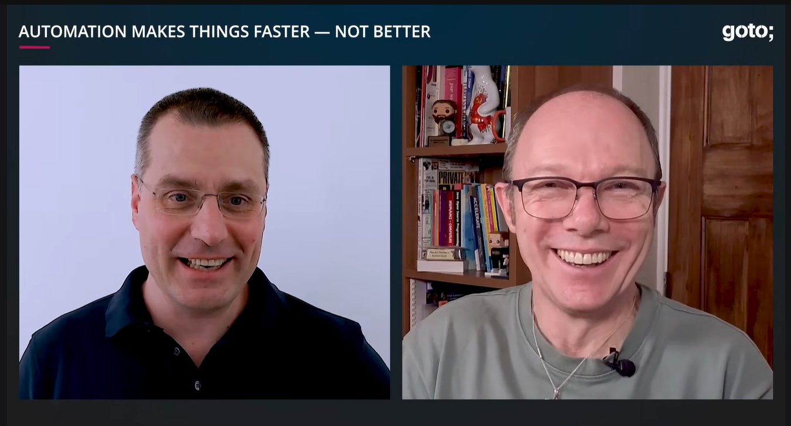
>
> This was a conversation between Daniel Terhorst-North and Gojko Adzic about spec-driven development, AI coding agents, and the practical limits of using large language models in software delivery. They contrasted naive one-shot specification generation with a more useful iterative approach based on feedback, tests, review, and evolving understanding. The discussion moved from the risks of unreadable generated specs and vendor-driven frameworks to stronger ideas: turning stable project rules into automated checks, using agents to build guardrails, treating each agent session like onboarding a new developer, and applying AI mainly where it improves feedback loops, developer workflow, and non-core support tasks. The central theme was that humans must remain responsible for meaning, judgment, and domain understanding, while machines are most valuable when they help make feedback faster, clearer, and more reliable.
>
> Ideas
>
> Treat spec-driven development as useful only when it is iterative. The strong idea is not "write a perfect spec, then generate the product." The strong idea is "use a spec as a living object that gets refined through feedback, tests, examples, and implementation."
>
> 
>
> Do not let generated specs become unreadable documents. The failure mode is a machine producing the same kind of 500-page artifact that nobody reads. The useful filter is whether the spec helps people make decisions faster and more accurately.
>
> 
>
> Agents are not compilers. A compiler gives deterministic transformation. An agent gives probabilistic assistance. Any workflow that assumes reliable translation from prose to product is fragile.
>
> 
>
> Move stable rules out of prompts and into deterministic tools. If a rule matters and repeats often, turn it into a linter, hook, test, CLI check, CI rule, or pre-commit guard. Prompts are weak memory. Tools are stronger feedback.
>
> 
>
> Use AI to create the guardrails, not only to drive inside them. One of the best ideas is asking the agent to write custom rules that constrain future work: ESLint rules, test helpers, validation scripts, grep checks, and project-specific checks.
>
> 
>
> Write error messages for agents and humans. A weak error says what failed. A strong error says what failed and what to do next. This matters because agents may loop on vague failures, while specific repair instructions improve both automation and human onboarding.
>
> 
>
> Think of every agent session as onboarding a new developer. If the same knowledge must be explained repeatedly, it should not live in someone's head or a markdown essay. It should become fast feedback inside the system.
>
> 
>
> Separate domain judgment from deterministic support work. AI may not be the right tool for core business decisions, but it can be excellent for setup, cleanup, test data loading, static analysis, scaffolding, impact analysis, and other surrounding work.
>
> 
>
> Use AI for quality-of-life engineering. The best near-term value may come from small things developers never had time to build: scripts, checks, loaders, review helpers, prototypes, reports, and workflow shortcuts.
>
> 
>
> Automation does not make work better by itself. It makes work faster and more repeatable. If the rule is wrong, automation repeats the wrong thing faster. So automate only when the rule is stable enough.
>
> 
>
> Start with markdown, but do not stay there. Markdown can help discover and discuss rules. Once a rule proves valuable and stable, convert it into executable feedback.
>
> 
>
> Generic AI frameworks are sourdough starters. They are not recipes to follow exactly. Their value is as a beginning that should be reduced, modified, and adapted to the team's real process.
>
> 
>
> Look for repeated friction. The best automation targets are places where the team or agent keeps hitting the same problem. Repetition is a signal that the rule or workflow should be externalized.
>
> 
>
> Keep implementation loops small enough to review. A useful agent workflow might change only a few files at a time, generate visible checkpoints, and allow fast inspection through diffs or static prototypes.
>
> 
>
> Use research-plan-implement as a flexible mental model. First understand the code and context. Then plan the impact and constraints. Then implement in small observable steps.
>
> 
>
> The agent should not own the process. The team should own the process, and the agent should be shaped to fit it. Using a vendor framework unchanged means adopting someone else's assumptions.
>
> 
>
> The most interesting shift is from "AI writes code" to "AI helps build a better engineering environment." The deeper value is not generated output alone, but faster creation of tests, checks, feedback loops, and local development tools.

2026-05-02 [Age of Empires: 25+ years of pathfinding problems with C++ - Raymi Klingers - Meeting C++ 2025 - YouTube](https://www.youtube.com/watch?v=lEBQveBCtKY) { www.youtube.com }

> 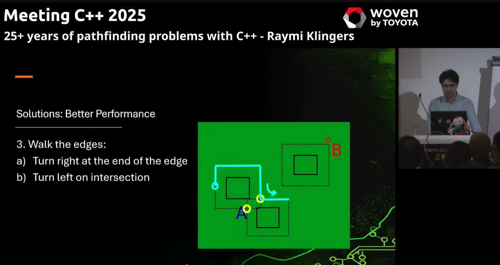
>
> Raymi Klingers is an engineering director at Forgotten Empires, the studio that has worked on modern Age of Empires releases and remasters. His talk, [Age of Empires: 25+ years of pathfinding problems with C++](https://www.youtube.com/watch?v=lEBQveBCtKY), was presented at Meeting C++ 2025. The official slides are available here: [25+ Years of Pathfinding Problems with C++](https://meetingcpp.com/mcpp/slides/2025/25%2B Years of Pathfinding Problems442903.pdf). His public profile also lists him as a lead engineer at Forgotten Empires: [Raymi Klingers on LinkedIn](https://nl.linkedin.com/in/raymi-klingers). One older Forgotten Empires credits page lists him under artificial intelligence work for Age of Mythology: Tale of the Dragon: [Forgotten Empires credits](https://www.forgottenempires.net/age-of-mythology-tale-of-the-dragon/credits).
>
> The talk is about maintaining a very old commercial game codebase where technical behavior, player memory, legacy bugs, and competitive gameplay are all connected. The core issue is that pathfinding in Age of Empires is both hated and loved by the community, so changing it too much can make the game technically better but emotionally or competitively wrong.
>
> > Pathfinding means finding a route from one point to another while avoiding obstacles.
>
> Klingers explains that he worked on many of the legacy reboots and a little on Age of Empires IV. He focuses mostly on Age of Empires II and uses "legacy" to mean the original releases from around 1999, while "reboots" means the later remakes and remasters.
>
> The first major problem is community feedback. Most pathfinding feedback is negative, but not all negative feedback is equally useful. A vague complaint like "pathfinding is bad" gives little information, while a comparison to legacy behavior or to a previous patch can identify a regression. The best report is a replay with a timestamp, because the game simulation is deterministic and can reproduce the exact situation.
>
> > Deterministic means the same inputs produce the same result every time.
>
> Age of Empires pathfinding is hard because the game does not take the easy route. Units bump into each other, stop, repath, and try to move around blockers. They do not push other units, and they usually cannot overlap. Formations make this more complicated because friendly units in a formation can overlap in limited ways, creating a second movement system that must cooperate with normal unit movement.
>
> The maps also make the problem harder. They are random, dynamic, and can change during a match as players build towns, place buildings, cut through forests, and create new obstructions. The game is partly grid based because buildings and terrain obstructions align to tiles, but units themselves are not locked to the grid.


## 🔫 C || C++

2026-03-29 [containers/bubblewrap](https://github.com/containers/bubblewrap) { github.com }

> Low-level unprivileged sandboxing tool used by Flatpak and similar projects
>
> 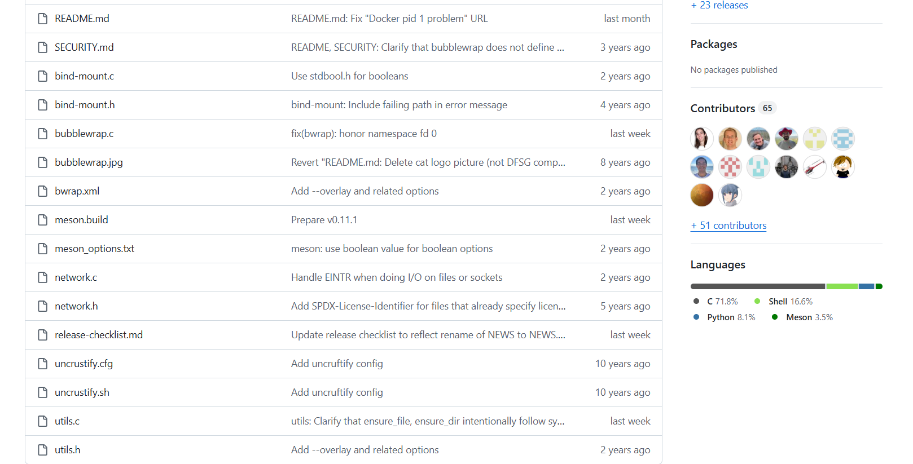
>
> Many container runtime tools like `systemd-nspawn`, `docker`, etc. focus on providing infrastructure for system administrators and orchestration tools (e.g. Kubernetes) to run containers.
>
> These tools are not suitable to give to unprivileged users, because it is trivial to turn such access into a fully privileged root shell on the host.


## 💖 Inspiration!

2026-03-31 [codingfont](https://www.codingfont.com/) { www.codingfont.com }

> 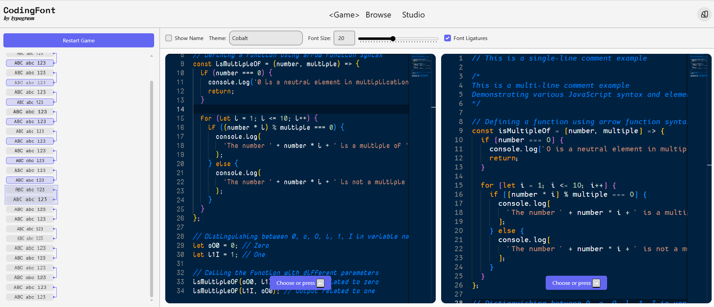

2026-03-29 [I Decompiled the White House's New App](https://blog.thereallo.dev/blog/decompiling-the-white-house-app) { blog.thereallo.dev }

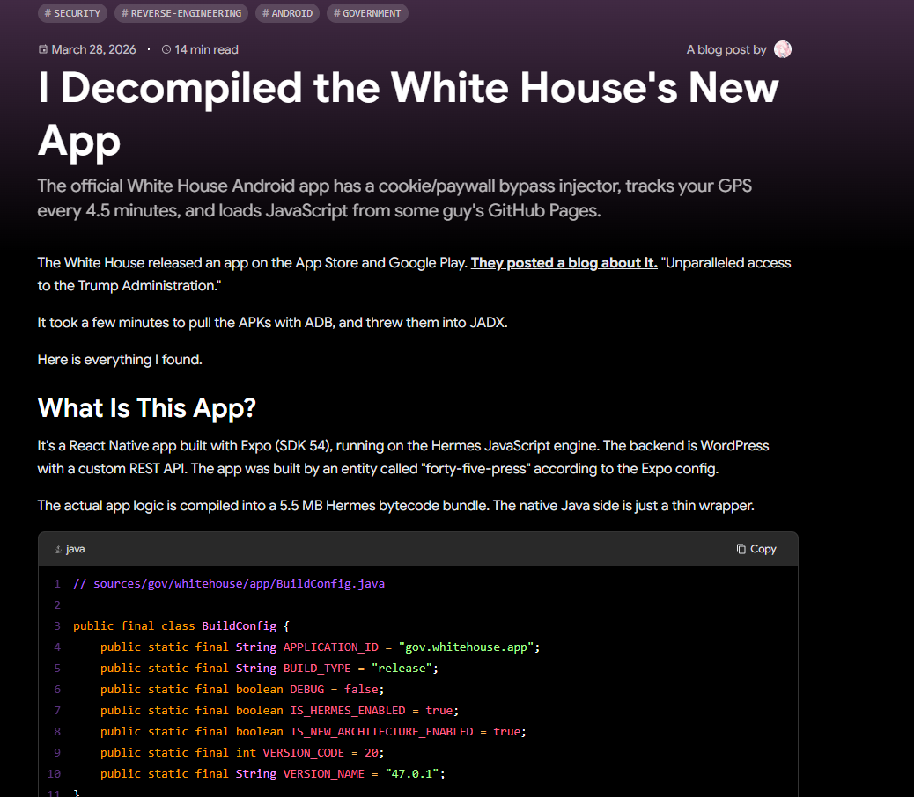

> The app has a WebView for opening external links. Every time a page loads in this WebView, the app injects a JavaScript snippet. I found it in the Hermes bytecode string table:
>
> ```javascript
> (function() {
> var css = document.createElement('style');
> css.textContent = [
>  '[class*="cookie"], [id*="cookie"], [class*="Cookie"], [id*="Cookie"]',
>  '[class*="consent"], [id*="consent"], [class*="Consent"], [id*="Consent"]',
>  '[class*="gdpr"], [id*="gdpr"], [class*="GDPR"]',
>  '[class*="privacy-banner"], [id*="privacy-banner"]',
>  '[class*="onetrust"], [id*="onetrust"]',
>  '[class*="cc-banner"], [class*="cc-window"]',
>  '[aria-label*="cookie" i], [aria-label*="consent" i]',
>  '[class*="login-wall"], [class*="loginWall"], [class*="LoginWall"]',
>  '[class*="signup-wall"], [class*="signupWall"]',
>  '[class*="upsell"], [class*="Upsell"]',
>  '.cmpboxBtnYes, .cmpbox, #cmpbox, .cmpboxBG',
>  '[class*="banner-cookie"], [class*="CookieBanner"]',
> ].join(',') + '{ display: none !important; visibility: hidden !important; }';
> css.textContent += 'body { overflow: auto !important; }';
> document.head.appendChild(css);
> 
> var observer = new MutationObserver(function() {
>  var els = document.querySelectorAll(
>    '[class*="cookie" i], [class*="consent" i], [class*="gdpr" i], '
>       + '[id*="cookie" i], [id*="consent" i]'
>     );
>     els.forEach(function(el) { el.style.display = 'none'; });
>   });
>   observer.observe(document.body, { childList: true, subtree: true });
> })();
> true;
> ```

> Read that carefully. It hides:
>
> - Cookie banners
> - GDPR consent dialogs
> - OneTrust popups
> - Privacy banners
> - Login walls
> - Signup walls
> - Upsell prompts
> - Paywall elements
> - CMP (Consent Management Platform) boxes
>
> It forces `body { overflow: auto !important }` to re-enable scrolling on pages where consent dialogs lock the scroll. Then it sets up a MutationObserver to continuously nuke any consent elements that get dynamically added.
>
> An official United States government app is injecting CSS and JavaScript into third-party websites to strip away their cookie consent dialogs, GDPR banners, login gates, and paywalls.

2026-03-24 [Claude Code Cheat Sheet](https://cc.storyfox.cz/) { cc.storyfox.cz }

> 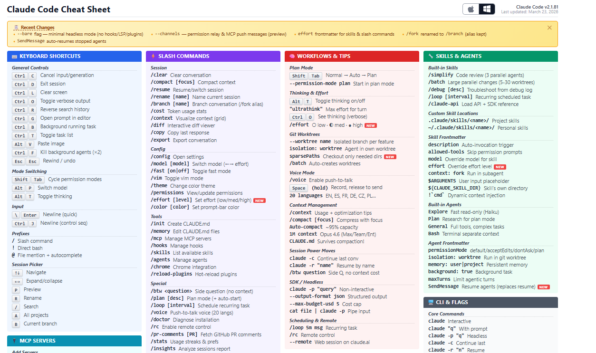

2026-03-24 [bjarneo/cliamp: cliamp - Terminal music player inspired by winamp](https://github.com/bjarneo/cliamp) { github.com }

> 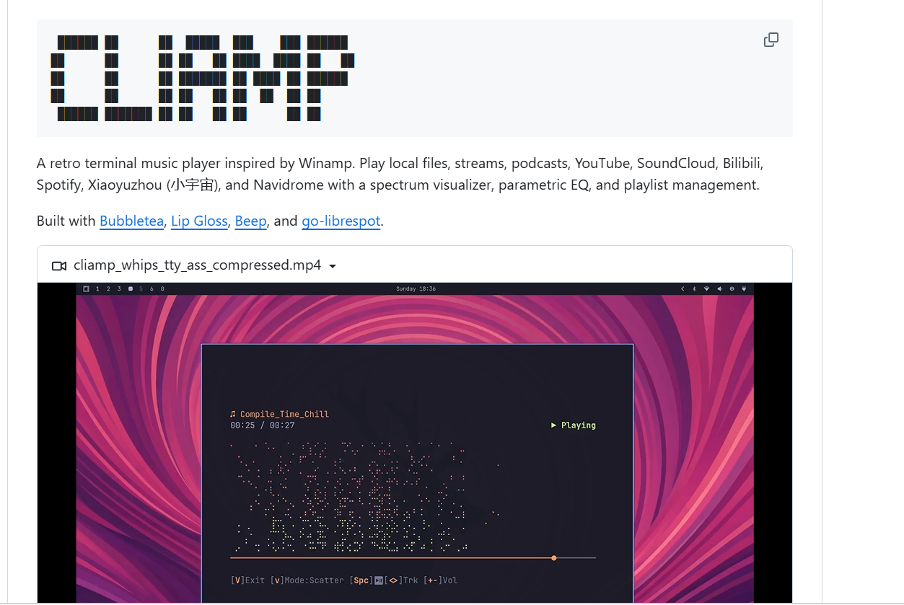

2024-12-26 [Devhints — TL;DR for developer documentation](https://devhints.io/) { devhints.io }

> Amazing collection of cheat sheets for various programming languages.
>
> 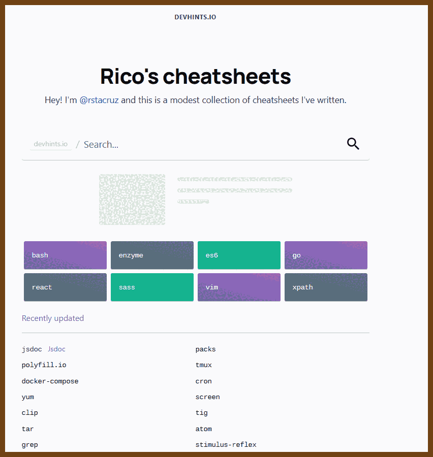


## 🛜 RSS

2026-02-15 [ooh.directory: a place to find good blogs that interest you](https://ooh.directory/) { ooh.directory }

> Ooh.directory: a place to find good blogs that interest you 
>
> 


## CRDT

2026-03-23 [Manyana - by Bram Cohen - Brams Thoughts](https://bramcohen.com/p/manyana) { bramcohen.com }

> I’m releasing [Manyana](https://github.com/bramcohen/manyana), a project which I believe presents a coherent vision for the future of version control — and a compelling case for building it.
>
> It’s based on the fundamentally sound approach of using **CRDTs for version control**, which is long overdue but hasn’t happened yet because of subtle UX issues. A CRDT merge always succeeds by definition, so there are no conflicts in the traditional sense — the key insight is that changes should be flagged as conflicting when they touch each other, giving you informative conflict presentation on top of a system which never actually fails. This project works that out.


## Usual ML

2026-03-23 [Flash-KMeans: Fast and Memory-Efficient Exact K-Means](https://arxiv.org/abs/2603.09229) { arxiv.org }

> A systems-heavy k-means paper that treats clustering as an online GPU primitive rather than offline preprocessing and focuses on why standard implementations waste time on memory traffic and atomic contention instead of actual compute. It introduces flash-kmeans, with one kernel that avoids materializing the full distance matrix and another that replaces scatter-style centroid updates with sorted segment reductions, then backs that up with kernel design details, performance breakdowns, and large-scale benchmarks against cuML, FAISS, and other baselines. Worth reading if you care about GPU dataflow, IO-aware kernel design, or exact k-means that can scale to production-sized AI workloads without giving up mathematical correctness.

2025-09-29 [Markov Chains Are the Original Language Models](https://elijahpotter.dev/articles/markov_chains_are_the_original_language_models) { elijahpotter.dev }

> 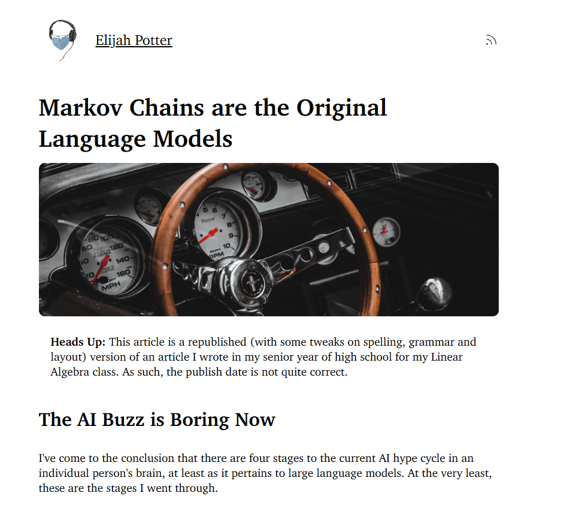
> The article steps back from modern LLMs and shows how a simple Markov chain can power autocomplete and tiny text generation. It explains how to count word-to-word transitions, turn them into next-word probabilities, and use those to suggest or generate text. It also shows why greedy choices become repetitive and how adding randomness helps. The piece is a practical primer on building a tiny, understandable language model from scratch.


## Data Engineering

2024-11-20 💛 [DataExpert-io/data-engineer-handbook: This is a repo with links to everything you'd ever want to learn about data engineering](https://github.com/DataExpert-io/data-engineer-handbook) { github.com }

> 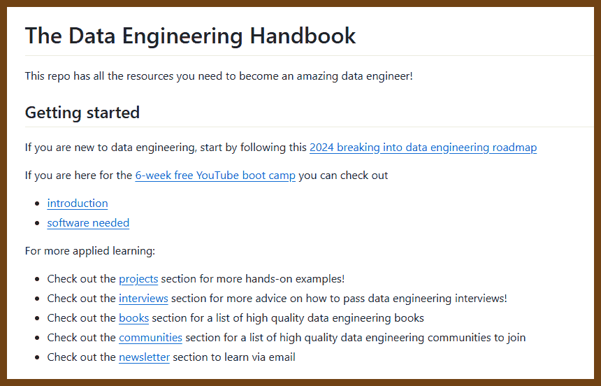


## SIMD

2025-10-07 [Cuckoo hashing improves SIMD hash tables](https://reiner.org/cuckoo-hashing) { reiner.org }

> 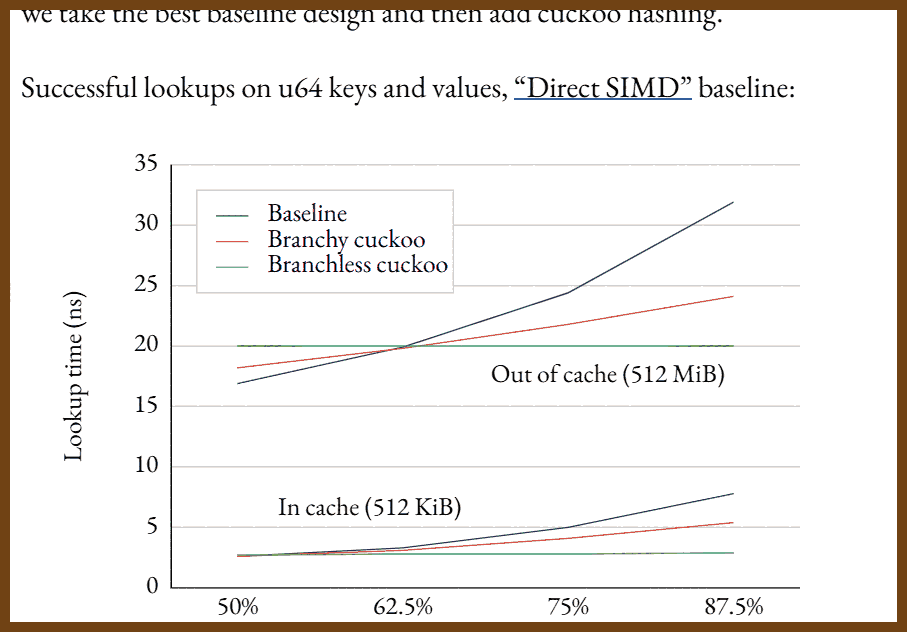
>
> Cuckoo hashing can outperform traditional SIMD-accelerated hash tables when carefully engineered. Unlike quadratic probing, which checks sequential slots and suffers from branch mispredictions, cuckoo hashing uses two hash functions and probes at most two fixed SIMD groups. This allows a fully branchless lookup with predictable memory access patterns. The result is faster lookups for in-cache tables due to fewer branches and competitive performance for out-of-cache tables when bucket sizes and memory layouts are tuned. Benchmarks show cuckoo hashing matches or exceeds the performance of Swiss Tables and Meta’s F14 designs, especially at high load factors.

2025-10-05 [perf-portfolio/bytepack at main · ashtonsix/perf-portfolio](https://github.com/ashtonsix/perf-portfolio/tree/main/bytepack) { github.com }

> 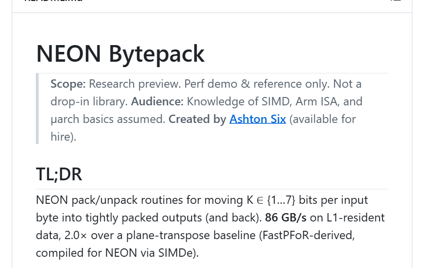

