---
layout: post
title:  "Links from my inbox 2026-05-23"
date:   2026-05-23T11:19:00-07:00
categories: links
---

## Developer Tools

2026-01-02 [FracturedJson](https://github.com/j-brooke/FracturedJson/wiki) { github.com }

> 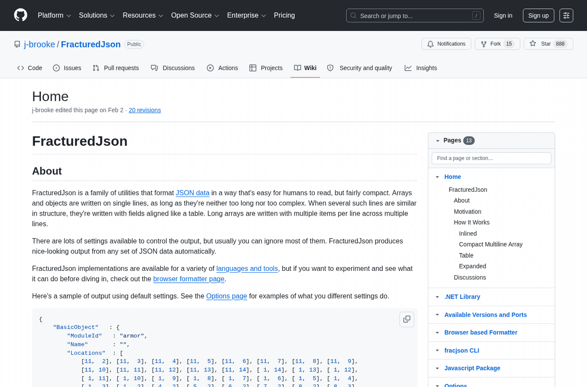
>
> FracturedJson formats JSON for human scanning without wasting vertical space. Small arrays and objects can stay on one line, repeated structures can align like a table, and larger data still breaks into readable blocks.
>
> It is a good reminder that pretty-printing is an interface design problem. The best layout depends on shape, repetition, and the task a human is doing with the data.

2026-01-04 [awesome-bookmarklets](https://github.com/ThomasOrlita/awesome-bookmarklets) { github.com }

> 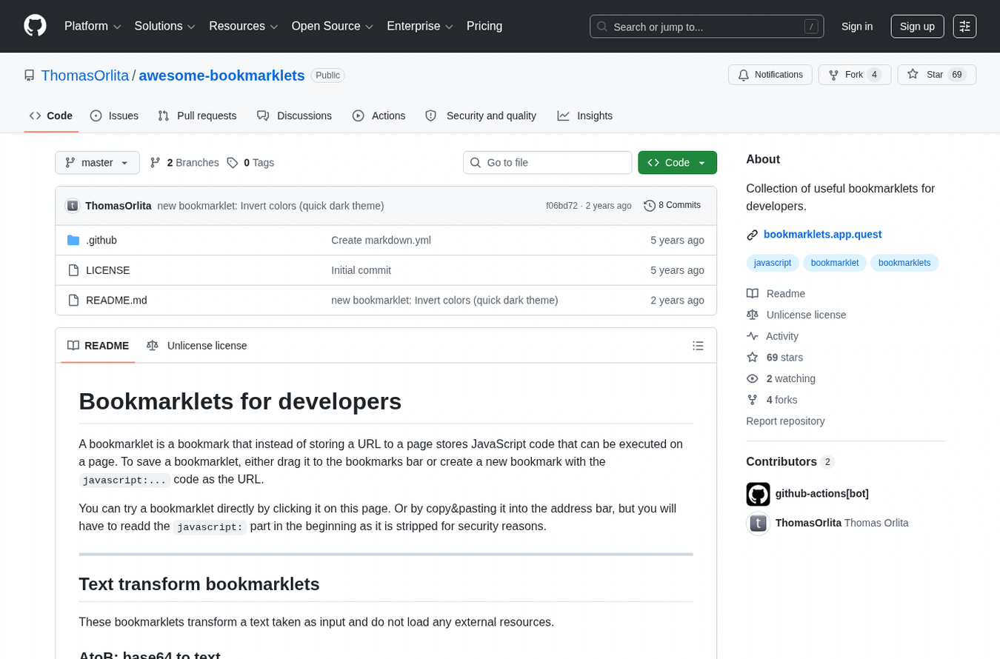
>
> A bookmarklet is still one of the lowest-friction ways to carry a tiny browser tool around. This collection keeps the idea visible: page inspection, DOM manipulation, quick formatting, and small utilities can live in the bookmarks bar without an extension build pipeline.
>
> Several bookmarklet lists were saved in the export; this one is kept as the representative developer-focused collection.

2026-01-05 [ticket: git-native issue tracking in one shell script](https://github.com/wedow/ticket) { github.com }

> 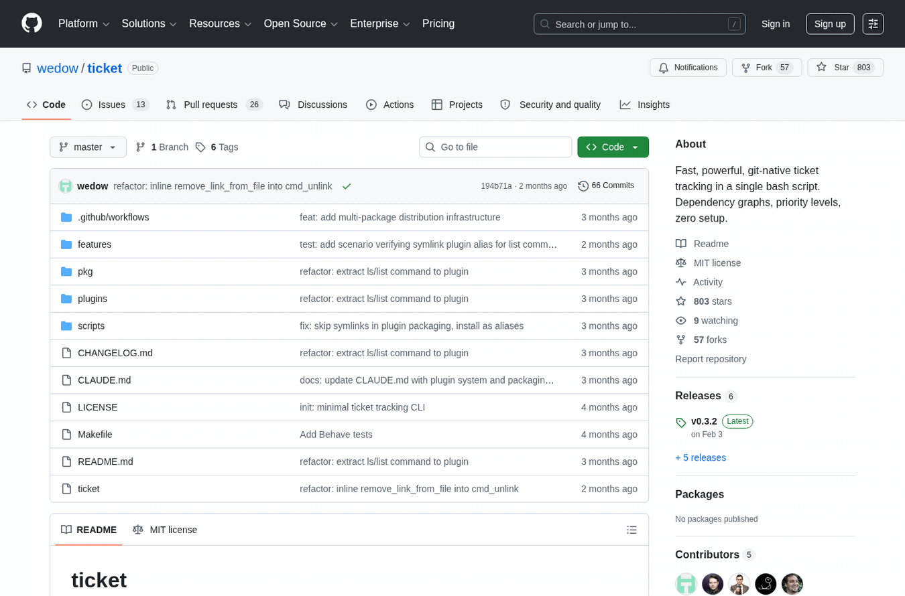
>
> `ticket` stores project work items in git and runs as a single Bash script. The appeal is not enterprise workflow coverage; it is keeping issues, dependencies, priorities, and history close to the repository with almost no service dependency.
>
> This kind of tool is useful for small teams, solo projects, and environments where the source repository is the most durable coordination surface.

2026-01-05 [git-bug](https://github.com/git-bug/git-bug) { github.com }

> 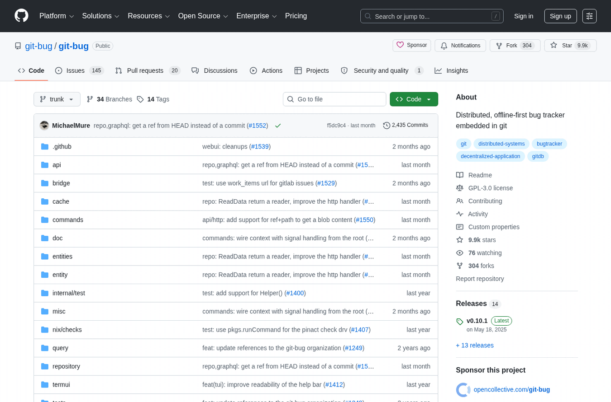
>
> git-bug turns bug tracking into data that travels with the repository. Issues can be created and edited offline, synchronized through git remotes, and bridged to external trackers when needed.
>
> The long-lived idea is distributed project state: not every coordination artifact has to live in a central web app.

2026-01-09 [opencode](https://github.com/anomalyco/opencode) { github.com }

> 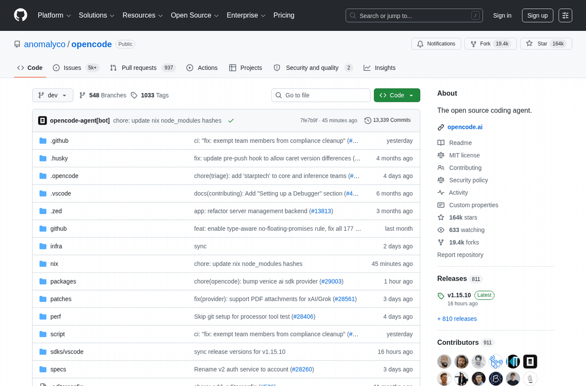
>
> opencode is an open-source coding agent with enough activity and surface area to be worth saving as a reference point. Even if the agent landscape changes quickly, the repository shows what users expect from a local coding agent: sessions, tools, model plumbing, editing, and review loops.
>
> The project is time-sensitive, but the design pressure is durable: coding agents are becoming developer tools, not just chat boxes.

2026-01-13 [superdiff](https://github.com/DoneDeal0/superdiff/tree/main) { github.com }

> 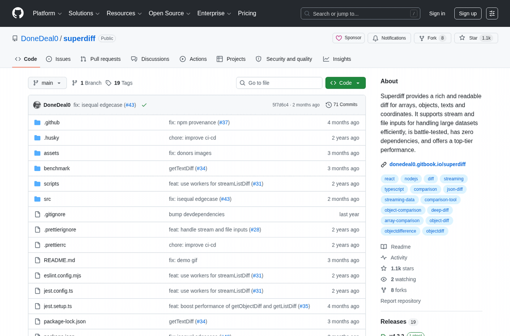
>
> superdiff focuses on making differences readable across structured data, text, coordinates, streams, and files. It is useful when a normal line diff hides the semantic shape of the change.
>
> Good diffs reduce review cost. A diff tool that understands structure can make data changes inspectable without requiring a custom viewer for every format.

2026-02-05 [CG/SQL](https://ricomariani.github.io/CG-SQL-author/docs/) { ricomariani.github.io }

> 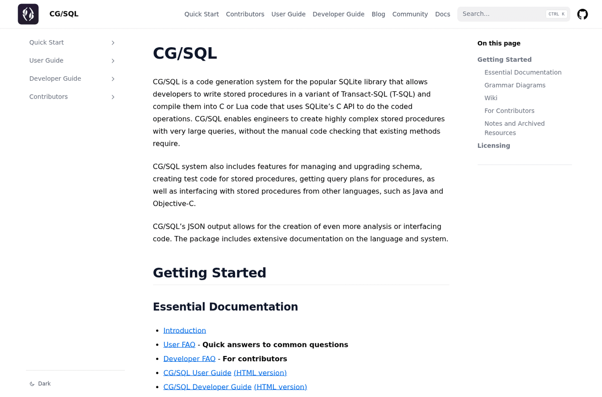
>
> CG/SQL lets developers write stored procedures in a T-SQL-like language and compile them into C or Lua code that uses SQLite's C API. It also handles schema evolution and test generation.
>
> The interesting part is the boundary: SQLite stays embedded and portable, while complex database logic gets a higher-level authoring model and generated low-level code.

2026-04-03 [Podroid: rootless Linux containers on Android](https://github.com/ExTV/Podroid) { github.com }

> 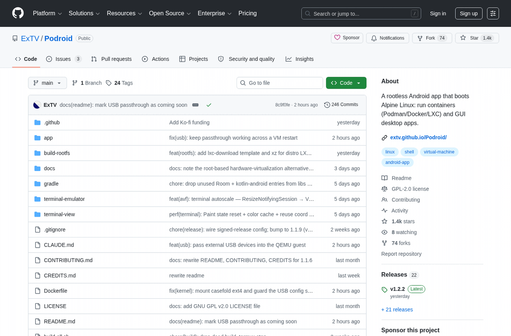
>
> Podroid packages an Alpine-based Linux environment into a rootless Android app, with support for containers and GUI desktop applications. It turns a phone or tablet into a surprisingly serious Linux playground.
>
> The project is worth saving as a reference for mobile development environments, Android virtualization boundaries, and the continuing pull of Unix tools onto every device people carry.

## 🔫 C || C++ / Systems

2026-01-06 [Why SQLite is coded in C](https://sqlite.org/whyc.html) { sqlite.org }

> 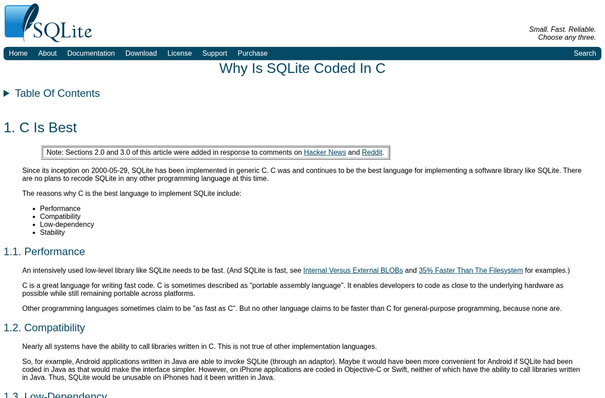
>
> SQLite's argument for C is concrete: performance, compatibility, low dependency load, and long-term stability. A small embedded database library has to run almost everywhere and remain callable from almost everything.
>
> The page is also a useful antidote to language monoculture. Safety and abstraction matter, but SQLite's constraints include ABI durability, toolchain reach, and decades of integration surface.

2026-01-16 [From bare metal to containers](https://buildsoftwaresystems.com/post/guide-to-execution-environments/) { buildsoftwaresystems.com }

> 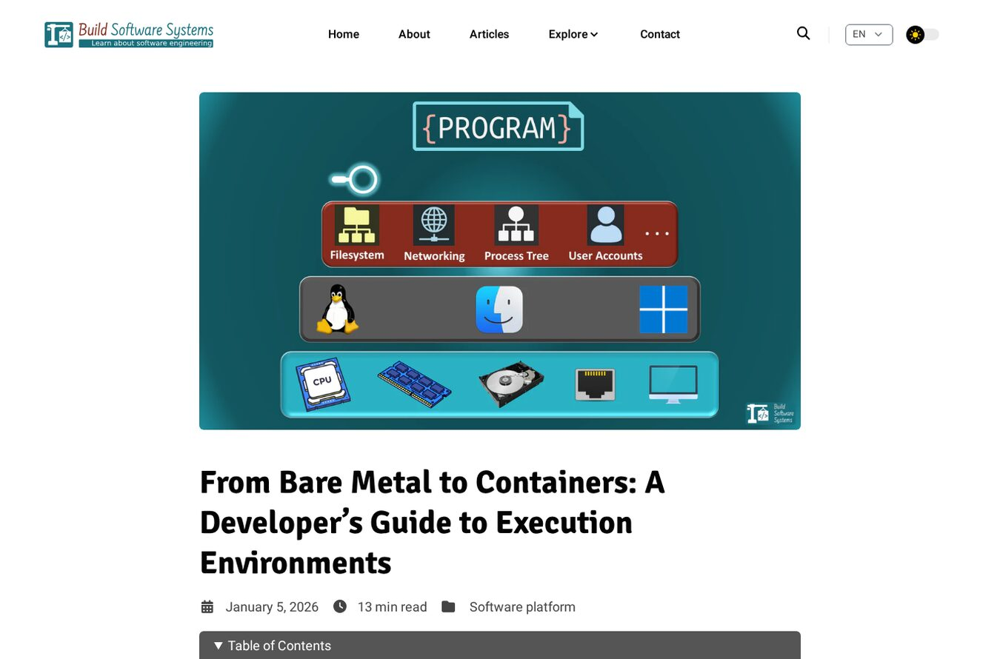
>
> This guide compares physical machines, virtual machines, containers, process sandboxes, and language virtual environments as points on the same isolation spectrum.
>
> The useful framing is that containers are not magic portability boxes. They are one layer in a stack of kernel features, filesystem assumptions, process boundaries, and operational tradeoffs.

2026-01-17 [The Arena: custom memory allocators in C](https://www.bytesbeneath.com/p/the-arena-custom-memory-allocators) { bytesbeneath.com }

> 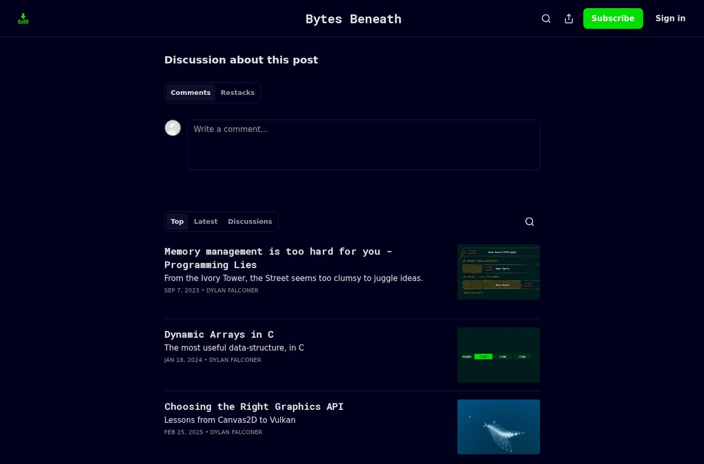
>
> Arena allocation groups many allocations under one lifetime and frees them all at once. That can remove bookkeeping, reduce fragmentation, and make ownership easier to reason about when the program's phases are clear.
>
> The tradeoff is discipline: arenas are powerful when lifetimes are simple and dangerous when long-lived references leak across phase boundaries.

2026-02-09 [What functional programmers get wrong about systems](https://iankduncan.com/engineering/2026-02-09-what-functional-programmers-get-wrong-about-systems/) { iankduncan.com }

> 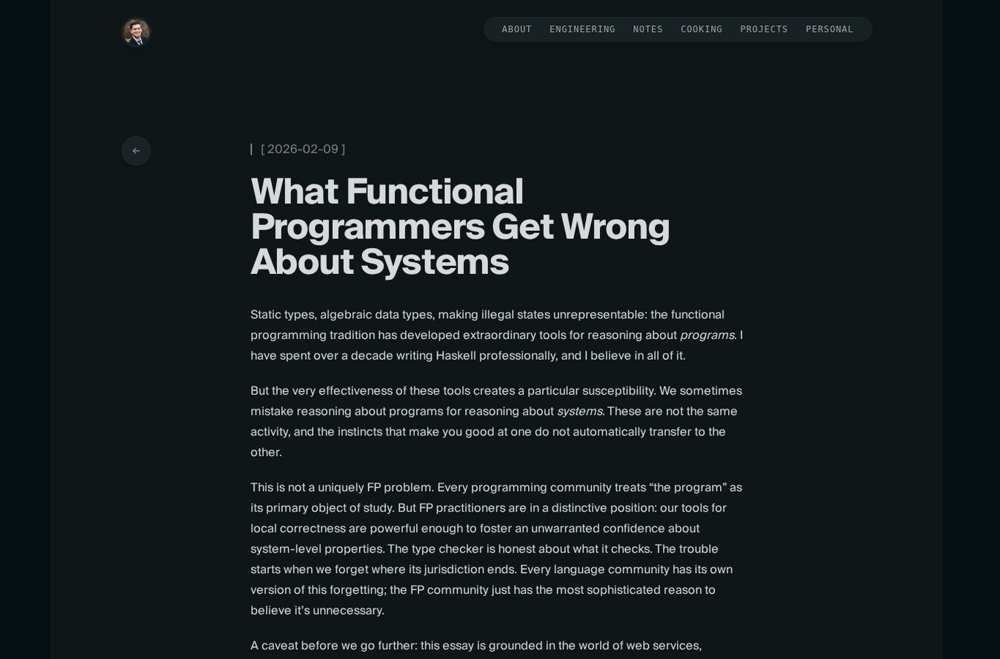
>
> Type systems verify properties of programs, but production correctness belongs to the whole deployed system. Rolling deploys, old messages, multiple live versions, queues, migrations, and operational recovery all sit outside the neat boundary of a single build.
>
> The durable lesson is that local reasoning is necessary but not sufficient. The unit that fails in production is often a fleet, a protocol, a migration path, or a historical message format.

2026-02-19 [-fbounds-safety: enforcing bounds safety for C](https://clang.llvm.org/docs/BoundsSafety.html) { clang.llvm.org }

> 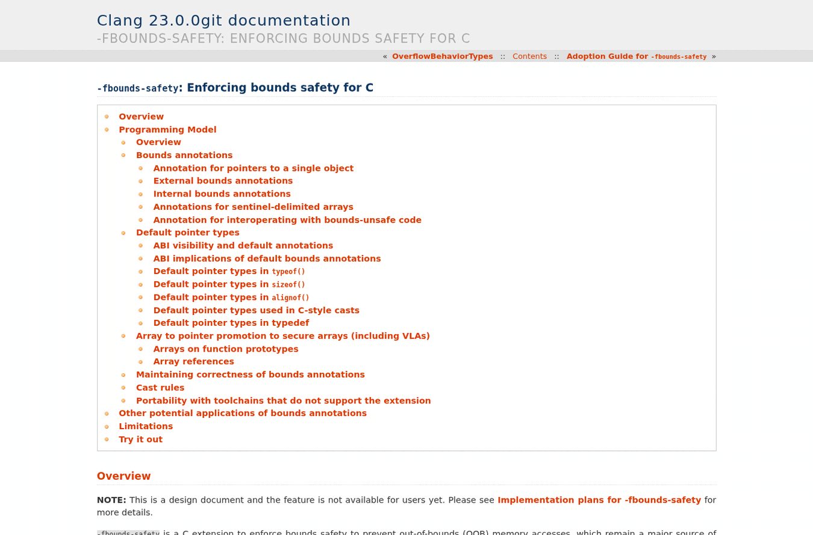
>
> Clang's `-fbounds-safety` adds bounds annotations and checked pointer types to C while preserving interoperability with existing C code. The model is incremental: safer pointer defaults and annotations where the compiler needs more information.
>
> This is worth saving because it shows one plausible path for improving C safety without pretending the C ecosystem can be rewritten all at once.

2026-02-21 [canvas_ity: a single-header C++ 2D rasterizer](https://github.com/a-e-k/canvas_ity) { github.com }

> 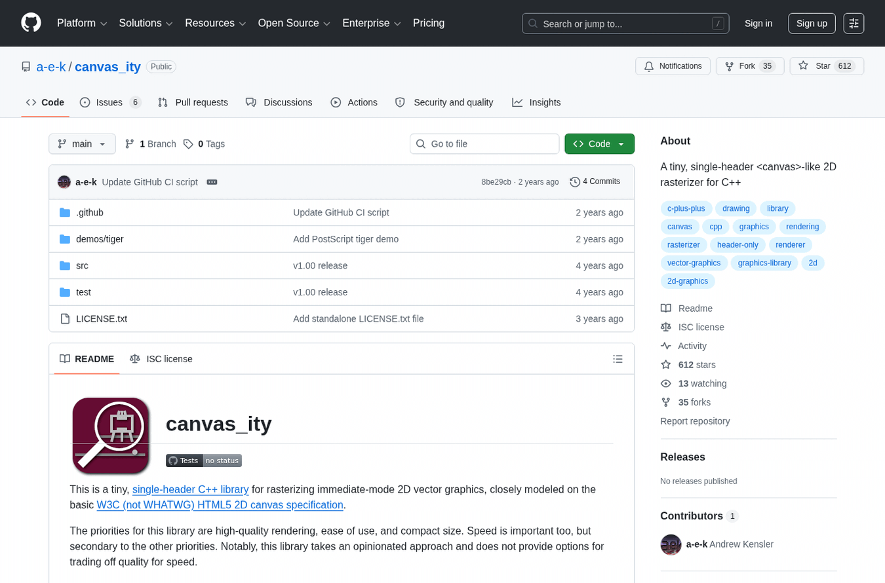
>
> canvas_ity is a tiny single-header C++ rasterizer modeled on the basic HTML5 2D canvas API. It prioritizes portability and immediate-mode drawing over a large rendering stack.
>
> Small graphics libraries are useful references because the whole system can fit in one reader's head: paths, transforms, fills, strokes, rasterization, and demos without a framework.

2026-03-30 [Comprehensive C++ hashmap benchmarks](https://martin.ankerl.com/2022/08/27/hashmap-bench-01/) { martin.ankerl.com }

> 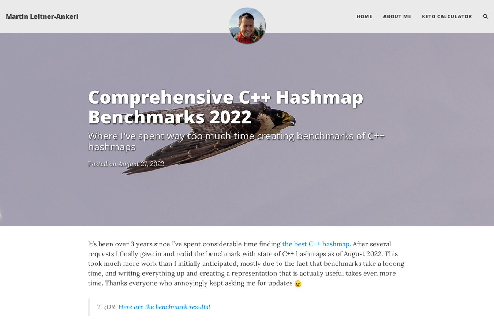
>
> The benchmark compares C++ hash map implementations across insert, erase, lookup, iteration, memory, and reference-stability scenarios. The valuable part is the benchmark shape as much as the ranking.
>
> Hash table performance is workload-specific. This is best read as a map of tradeoffs and measurement pitfalls, not as a permanent answer to which container is fastest.

2026-05-17 [C++26 shipped a SIMD library nobody asked for](https://lucisqr.substack.com/p/c26-shipped-a-simd-library-nobody) { lucisqr.substack.com }

> 
>
> The critique argues that `std::simd` misses many patterns real performance code needs, especially when width choices, compile times, and expressiveness matter. The practical recommendation is still to use intrinsics for hard parts and let the auto-vectorizer handle the easy parts.
>
> Whether or not every conclusion holds for every workload, the post is useful because it names the abstraction mismatch: standard-library portability can become too narrow for the code that actually needs SIMD.

## Web / Browsers / Frontend

2026-01-01 [Web browsers have stopped blocking pop-ups](https://www.smokingonabike.com/2025/12/31/web-browsers-have-stopped-blocking-pop-ups/) { smokingonabike.com }

> 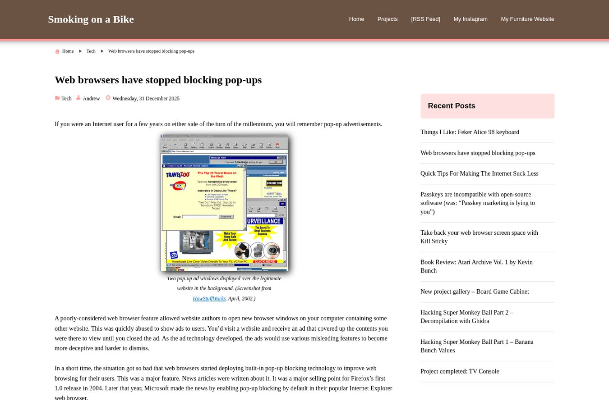
>
> Pop-up blocking used to be a visible browser victory over abusive advertising. The modern loophole is user activation: once a click or tap occurs, pages can often open windows again in flows that feel legitimate to the browser but hostile to the user.
>
> The lesson is broader than pop-ups. Browser protections are only as strong as their interaction model, and attackers adapt to whatever action counts as consent.

2026-01-02 [WASM-ImageMagick](https://github.com/KnicKnic/WASM-ImageMagick) { github.com }

> 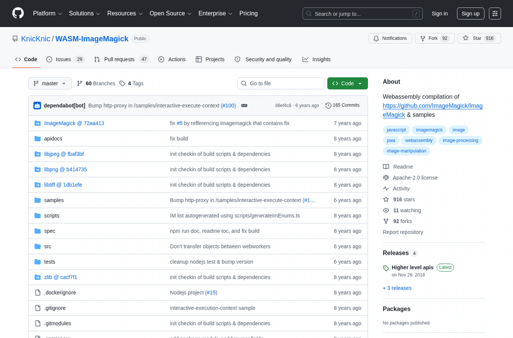
>
> WASM-ImageMagick brings ImageMagick into the browser through WebAssembly. It is useful both as a tool and as a concrete example of a large native library exposed to web code.
>
> The project is a good reference for the rough edges of serious WebAssembly ports: compiled dependencies, sample UIs, API wrappers, and the difference between a demo and a usable browser-side utility.

2026-01-05 [Shaders 103: smoke](https://garden.bradwoods.io/notes/javascript/three-js/shaders/shaders-103-smoke) { garden.bradwoods.io }

> 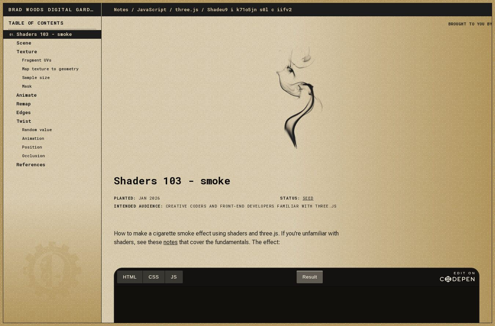
>
> This shader note builds a smoke effect in three.js from texture sampling, UV mapping, masks, remapping, edge work, twist, and animation. The value is in the staged construction rather than a final copy-paste fragment.
>
> Visual shader tutorials are easiest to remember when the screenshot carries the effect and the text explains the mechanism.

2026-01-09 [What happened to WebAssembly](https://emnudge.dev/blog/what-happened-to-webassembly/) { emnudge.dev }

> 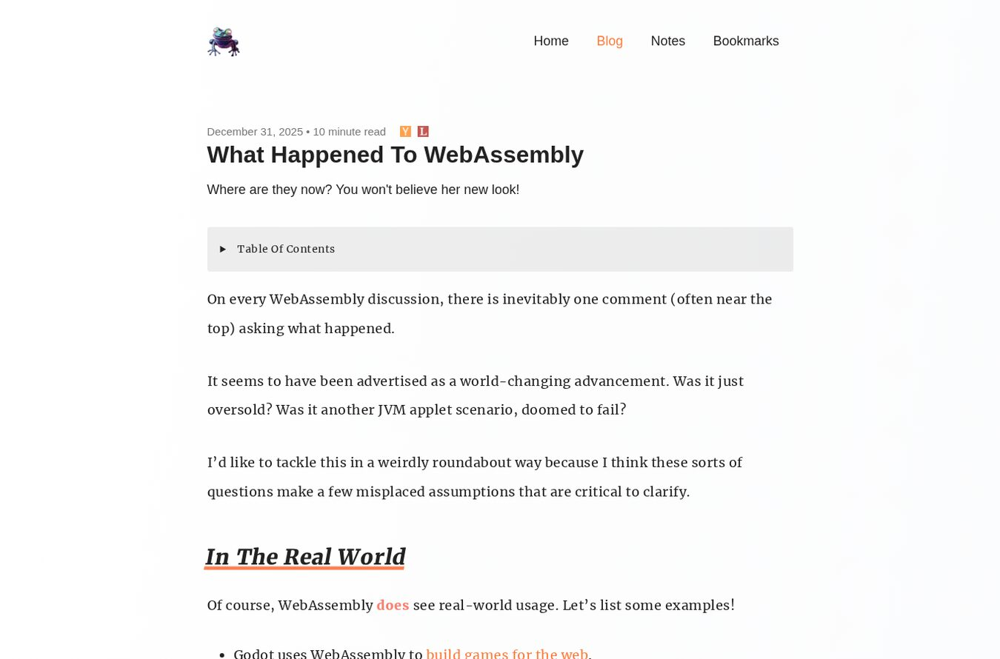
>
> WebAssembly was sold as a web revolution, but its durable value is more specific: portable sandboxed execution, compilation targets, embeddability, and performance-sensitive modules in systems that can tolerate its boundaries.
>
> The piece is useful because it separates hype from deployment reality. WebAssembly did not become a replacement for JavaScript applications, but it did become infrastructure in places where a safe portable binary target matters.

2026-01-13 [Text-based web browsers and modern HTML](https://cssence.com/2026/text-based-web-browsers/) { cssence.com }

> 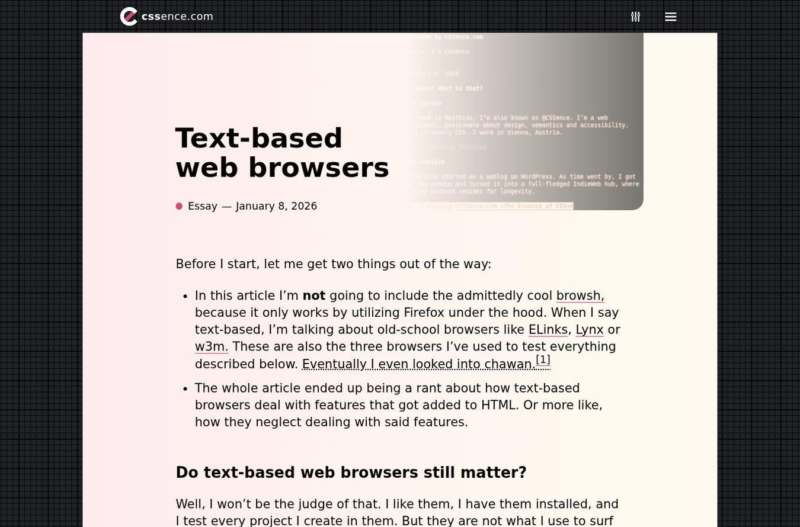
>
> Modern HTML features such as details, datalists, dialogs, popovers, and richer form controls behave unevenly in text-based browsers. The result is a practical audit of how much of the web still works when graphics and JavaScript are not the interface.
>
> Text browsers are a useful pressure test. If essential content disappears there, the page may also be fragile for search, automation, low-bandwidth use, and assistive workflows.

## Data Engineering

2026-01-05 [Databases in 2025: a year in review](https://www.cs.cmu.edu/~pavlo/blog/2026/01/2025-databases-retrospective.html) { cs.cmu.edu }

> 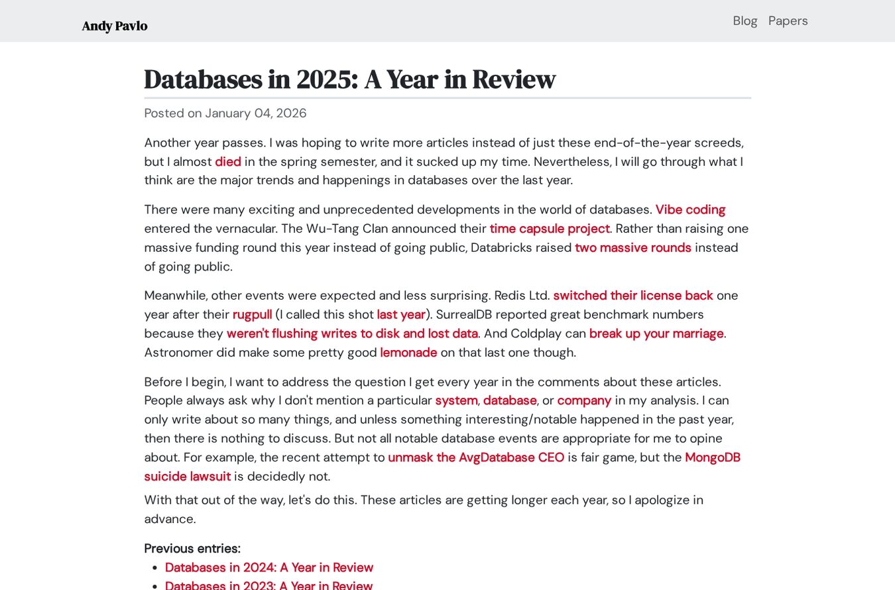
>
> Andy Pavlo's database review is a point-in-time map of what mattered in 2025: PostgreSQL's continuing gravity, database vendors attaching MCP surfaces, licensing fights, and the recurring tension between new systems and operational reality.
>
> The post is most useful as context. It preserves what the database world looked like at the turn of 2026, not as a permanent ranking of winners.

2026-01-25 [Introduction to PostgreSQL indexes](https://dlt.github.io/blog/posts/introduction-to-postgresql-indexes/) { dlt.github.io }

> 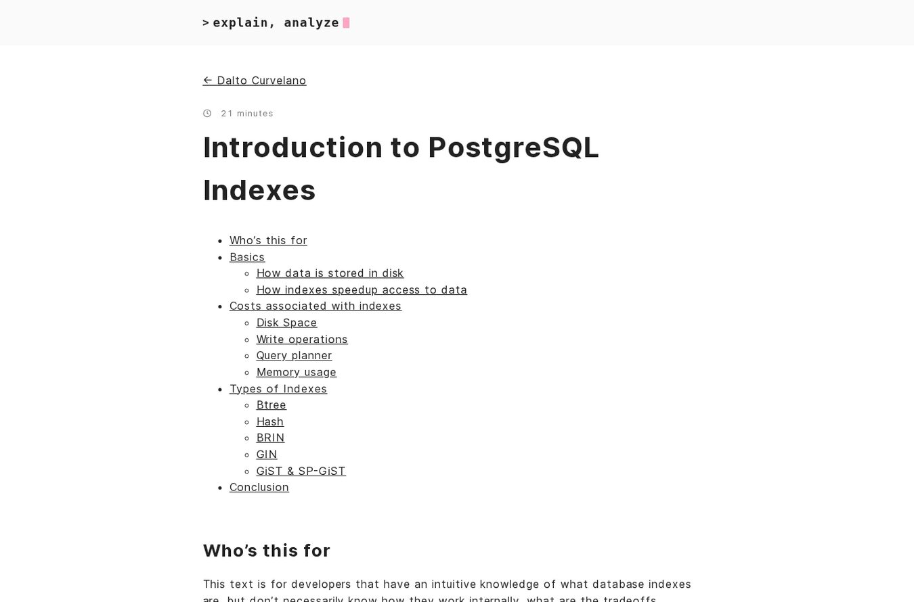
>
> This PostgreSQL index guide starts from how data sits on disk and moves into why indexes speed reads while costing disk, writes, planner complexity, and memory.
>
> The useful part is the tradeoff framing across index types: B-tree, hash, BRIN, GIN, GiST, and SP-GiST are not interchangeable optimizations. Each encodes assumptions about access patterns and data shape.

2026-02-17 [Hamming distance for hybrid search in SQLite](https://notnotp.com/notes/hamming-distance-for-hybrid-search-in-sqlite/) { notnotp.com }

> 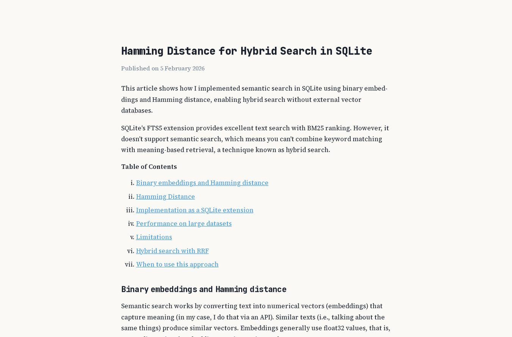
>
> This note implements semantic search in SQLite with binary embeddings and Hamming distance, then combines it with FTS5 keyword search through reciprocal rank fusion.
>
> The result is a useful middle ground: hybrid search without running a separate vector database. The limits are clear too; O(n) scans can be acceptable at some scales and wrong at others.

2026-02-23 [pgdog: PostgreSQL pooler, load balancer, and sharder](https://github.com/pgdogdev/pgdog) { github.com }

> 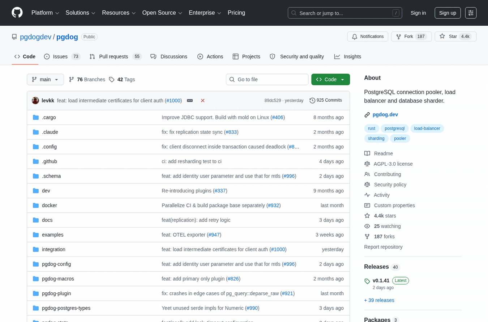
>
> pgdog sits in front of PostgreSQL as a connection pooler, load balancer, and sharding layer. It is worth saving because the project makes several operational concerns explicit: routing, resharding, auth, replication state, and client compatibility.
>
> PostgreSQL scaling tools are most interesting when they show the boundary between a single-node database and a distributed operational system.

## 📺 ffmpeg and media

2026-01-02 [What you need to know before touching a video file](https://gist.github.com/arch1t3cht/b5b9552633567fa7658deee5aec60453/) { gist.github.com }

> 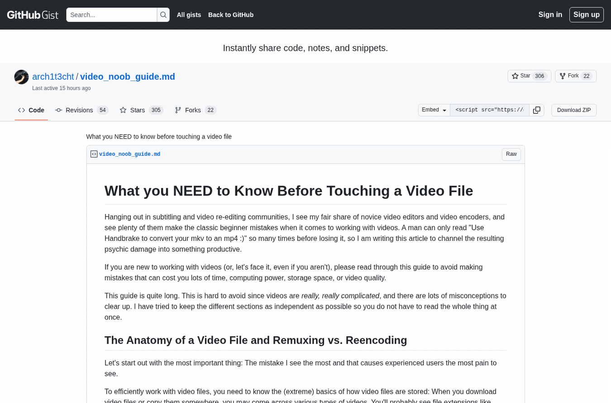
>
> This guide explains the mistakes beginners make with video files: confusing containers with codecs, re-encoding when a remux would do, throwing away quality, and using tools without understanding what they change.
>
> The durable distinction is simple: a container is how streams are packaged, while a codec is how audio or video streams are encoded. Editing workflows go wrong when those layers are treated as the same thing.

2026-03-10 [FFmpeg-over-IP](https://github.com/steelbrain/ffmpeg-over-ip) { github.com }

> 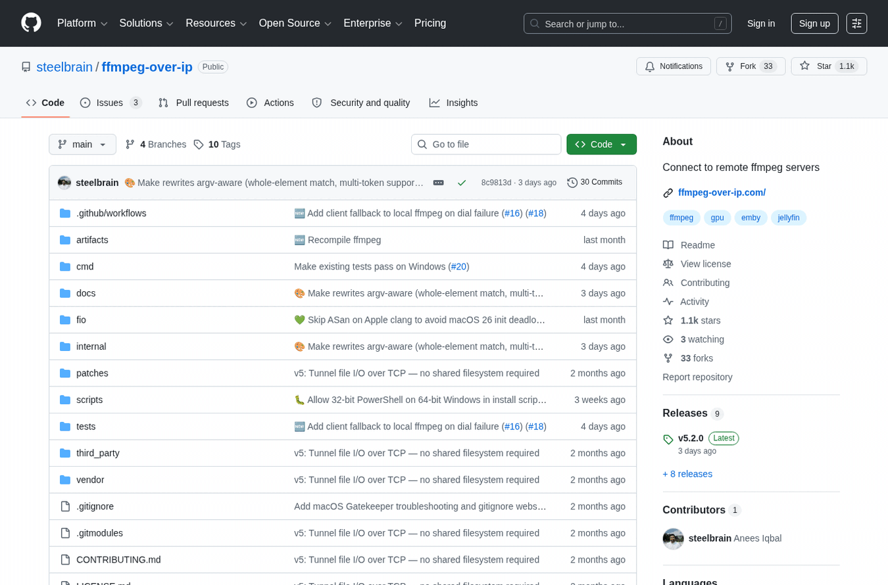
>
> FFmpeg-over-IP connects clients to remote FFmpeg servers, making heavyweight media work run somewhere other than the local machine. It keeps the familiar FFmpeg command shape while moving execution across the network.
>
> The project is useful as a pattern: wrap a known command-line tool with remote execution while preserving enough of its interface that existing habits still apply.

2026-03-16 [lazycut: terminal UI for video trimming](https://github.com/emin-ozata/lazycut) { github.com }

> 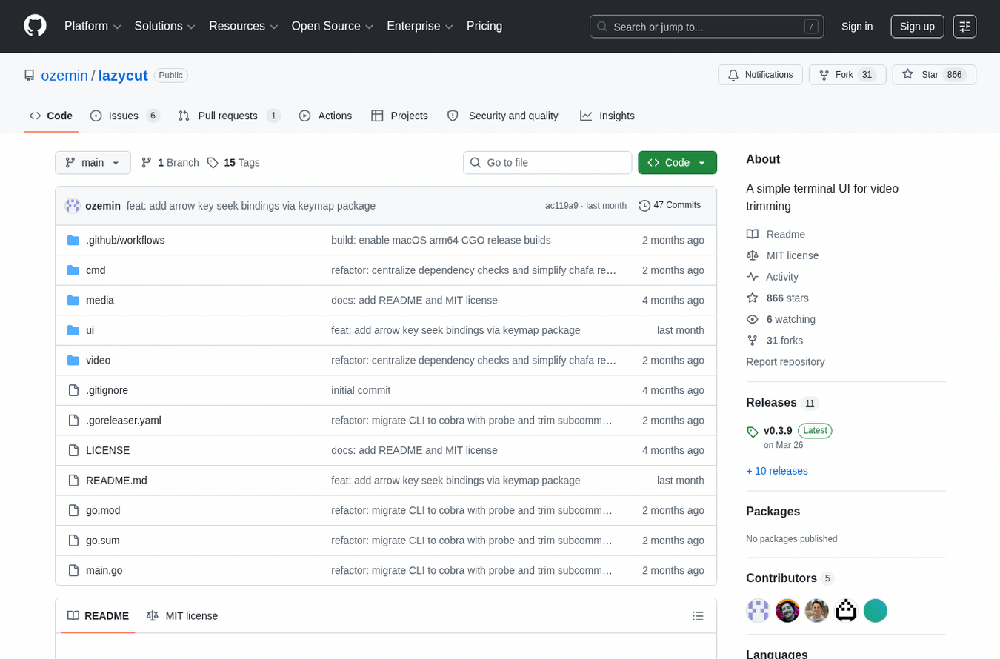
>
> lazycut is a terminal UI for trimming video, built around quick preview and FFmpeg-backed cuts. It fits the common job where opening a full editor is too much ceremony.
>
> Focused media tools age well when they make one operation faster without hiding the underlying files and commands.

## 😁 Fun / Retro

2026-02-07 [Why I write games in C](https://jonathanwhiting.com/writing/blog/games_in_c/) { jonathanwhiting.com }

> 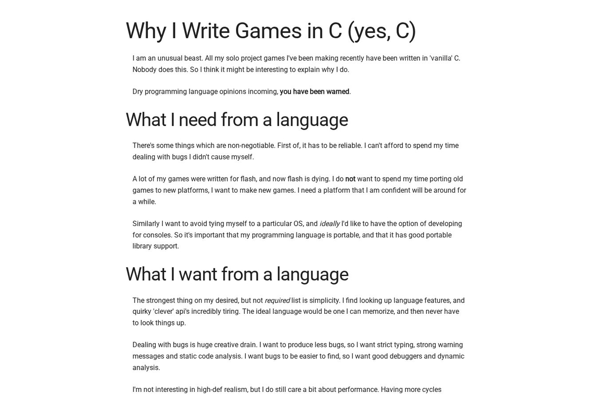
>
> This is a practical defense of plain C for solo game projects: reliability, control, portability, fast builds, and a small enough language surface to keep the whole program understandable.
>
> The interesting part is not language nostalgia. It is the fit between a tool and a creator's constraints: small games, long-lived source, few dependencies, and a preference for debugging one's own code.

2026-03-02 [Making video games in 2025 without an engine](https://www.noelberry.ca/posts/making_games_in_2025/) { noelberry.ca }

> 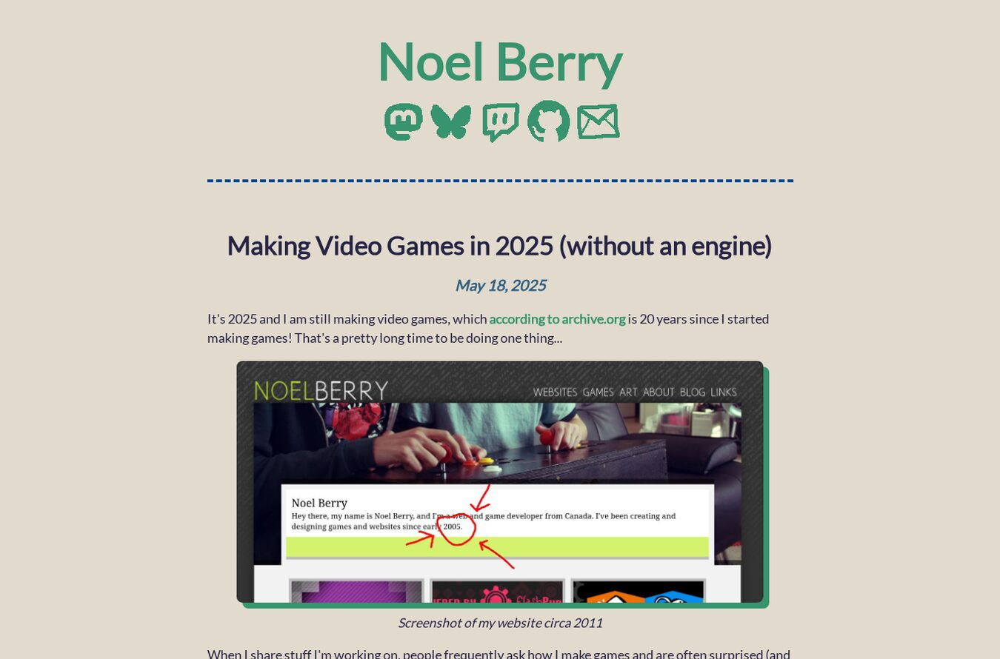
>
> Noel Berry lays out a 2025 game-making stack without a commercial engine: programming language choices, rendering, input, audio, assets, level editing, UI, porting, and platform support.
>
> The durable idea is that an engine is a bundle of decisions. Small games can sometimes move faster by choosing narrower libraries and owning the integration work directly.

2026-03-04 [Elevator Saga](https://play.elevatorsaga.com/index.html) { play.elevatorsaga.com }

> 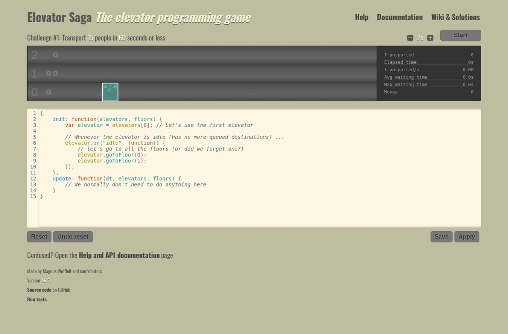
>
> Elevator Saga is a browser programming game where the player writes JavaScript to control elevators under timing and throughput constraints.
>
> It remains a neat little systems exercise: queues, scheduling, latency, fairness, and throughput become visible as people wait on floors.

2026-04-09 [Haunted Paper Toys](http://ravensblight.com/papertoys.html) { ravensblight.com }

> 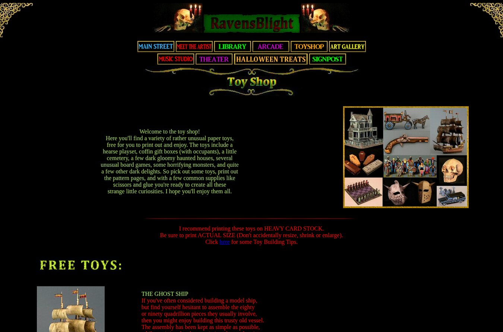
>
> Haunted Paper Toys is a collection of printable models: houses, coffins, a cemetery, board games, monsters, and other small paper constructions.
>
> It is worth keeping for the web-archive feeling as much as the objects themselves: a personal site offering strange, handmade, printable things with no platform ceremony.
