---
layout: post
title:  "Links from my inbox 2026-07-10"
date:   2026-07-10T23:57:00-07:00
categories: links
---

[[_TOC_]]

## Good reads

2026-05-25 [Using AI to write better code more slowly](https://nolanlawson.com/2026/05/25/using-ai-to-write-better-code-more-slowly/) { nolanlawson.com }

> 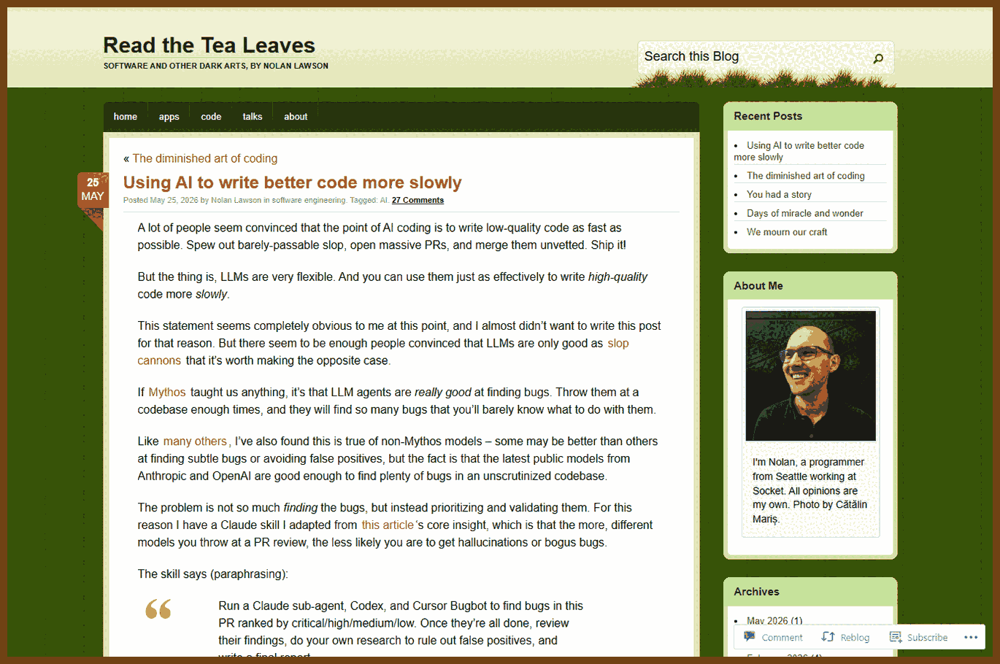
>
> A counter to the idea that AI coding means shipping low-quality code fast. Lawson argues LLMs are just as effective at writing high-quality code slowly: use them to find bugs — throw enough passes at a codebase and they surface plenty — then spend your effort prioritizing and validating rather than typing. His trick is running several different models over the same change so hallucinated or bogus findings cancel out.

2026-05-31 [Domain Expertise Has Always Been the Real Moat | Aaron Brethorst](https://www.brethorsting.com/blog/2026/05/domain-expertise-has-always-been-the-real-moat/) { brethorsting.com }

> 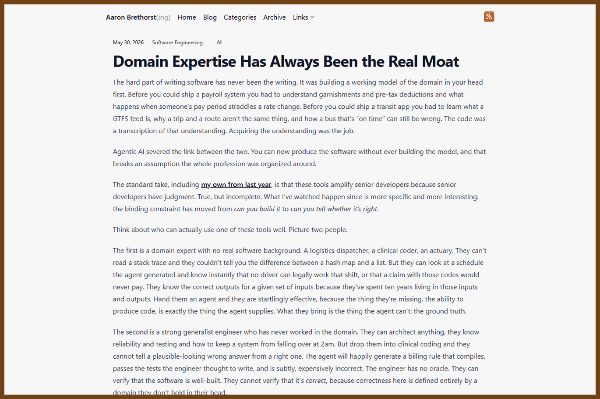
>
> The hard part of software was never typing the code — it was building an accurate model of the domain in your head first. Before shipping a payroll system you had to understand garnishments and pre-tax deductions; before a transit app, what a GTFS feed is and why a bus that's “on time” can still be wrong. The code was a transcription of that understanding, and that understanding is what AI doesn't hand you for free.

2026-06-13 [If You are Asking for Human Attention, Demonstrate Human Effort | Tom Bedor's Blog](https://tombedor.dev/human-attention-and-human-effort/) { tombedor.dev }

> 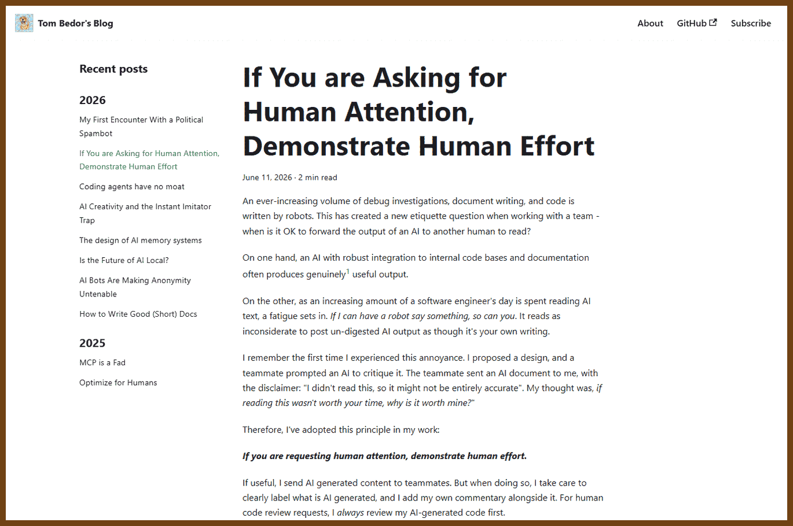
>
> As more debugging, writing, and code comes from AI, a new etiquette question appears: when is it OK to forward AI output to another human to read? The argument — if you're asking for someone's attention, show that you put in human effort first.

2026-06-15 [Perlisisms - "Epigrams in Programming" by Alan J. Perlis](https://www.cs.yale.edu/homes/perlis-alan/quotes.html) { cs.yale.edu }

> 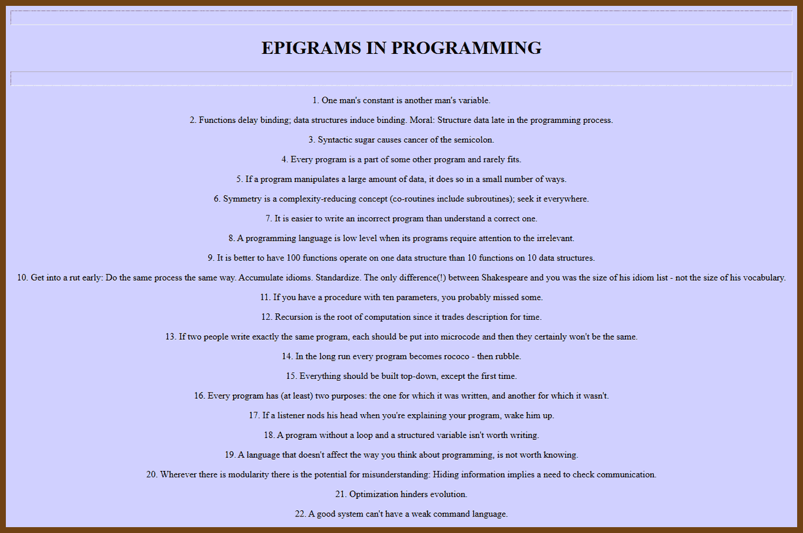
>
> Alan Perlis's “Epigrams in Programming” — 130-odd sharp, quotable one-liners (“A language that doesn't affect the way you think about programming is not worth knowing”). Durable aphorisms worth rereading every so often.

## Dev

2026-05-24 [Implementing the Inbox Pattern for Reliable Message Consumption](https://www.milanjovanovic.tech/blog/implementing-the-inbox-pattern-for-reliable-message-consumption) { milanjovanovic.tech }

> 
>
> The Outbox pattern guarantees reliable publishing; the Inbox pattern covers the consumer side, ensuring each incoming message is processed exactly once even when the broker retries or delivers duplicates. Walks through an implementation in .NET with MassTransit and PostgreSQL: the inbox schema, the consumer, and the background processor.

## Retro Historical 

2026-07-10 [The tech of Terminator 2: an oral history](https://vfxblog.com/2017/08/23/the-tech-of-terminator-2-an-oral-history/) { vfxblog.com }

> 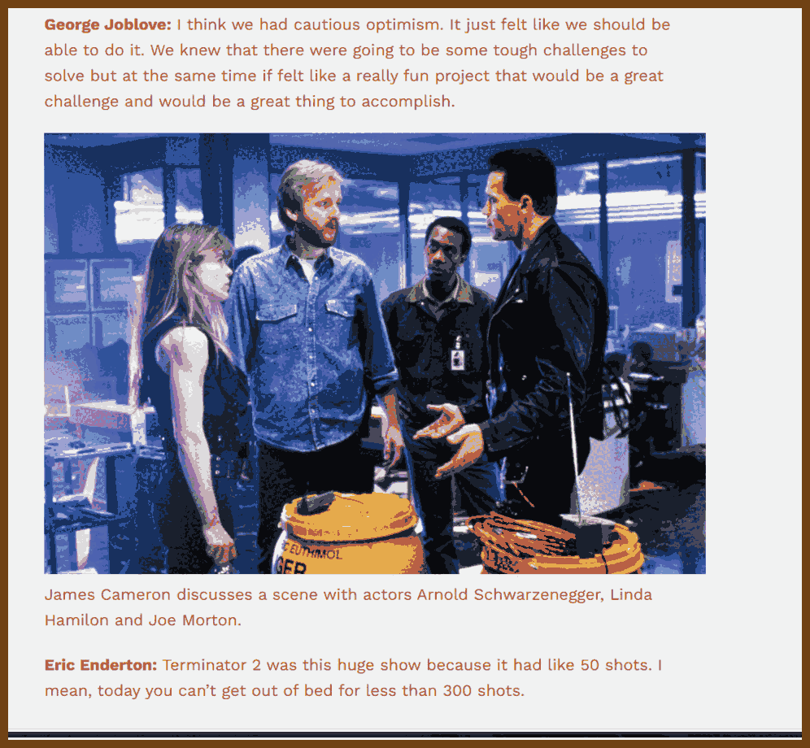
>
> 
>
> The people who built the effects for Terminator 2 tell the story in their own words — ILM artists, Cameron's team, and the crew behind the T-1000. The film had roughly 50 effects shots, a number Eric Enderton contrasts with today: “today you can't get out of bed for less than 300 shots.” The liquid-metal morphs, the chrome man walking out of fire, the digital body doubles — all done when the tools barely existed and much of the pipeline was invented on the show. A first-hand record of the moment computer graphics crossed into believable, photoreal character work.

2026-05-24 [A History of IDEs at Google](https://laurent.le-brun.eu/blog/a-history-of-ides-at-google) { laurent.le-brun.eu }

> 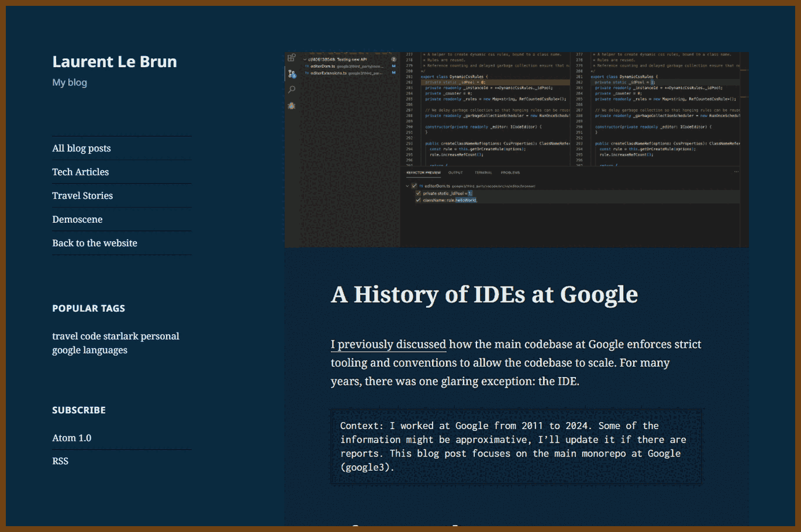
>
> How Google's internal developer tooling evolved from a fragmented set of editors toward a shared, browser-based Cloud IDE. A firsthand look at what editing code at that scale demands and why the ecosystem kept splintering before it consolidated.

## C

2026-06-28 [nnevskij/wordle.c: Wordle game in less than 200 LOC written in C](https://github.com/nnevskij/wordle.c) { github.com }

> 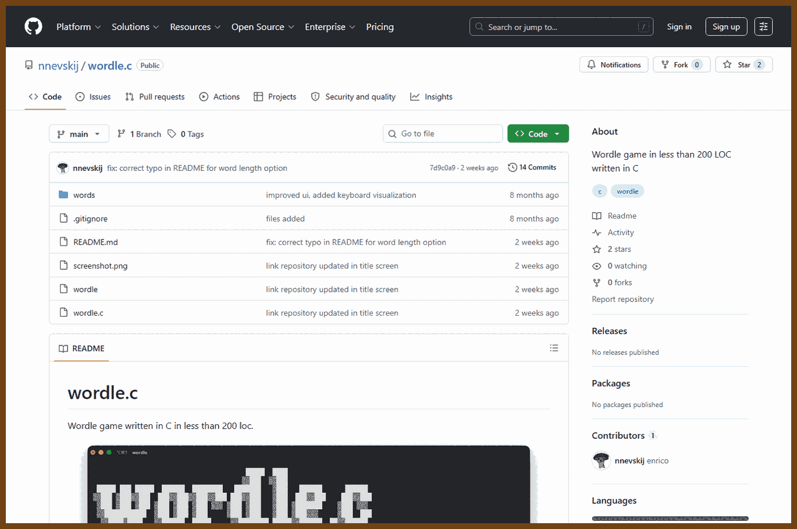
>
> Wordle implemented in under 200 lines of C — small enough to read in one sitting, with a few advanced options. A tidy example of how little code the game actually needs.

2026-06-28 [Ported my game built in C to WASM, here's every bug I hit : r/C_Programming](https://www.reddit.com/r/C_Programming/comments/1u33ioq/ported_my_game_built_in_c_to_wasm_heres_every_bug/) { reddit.com }

> 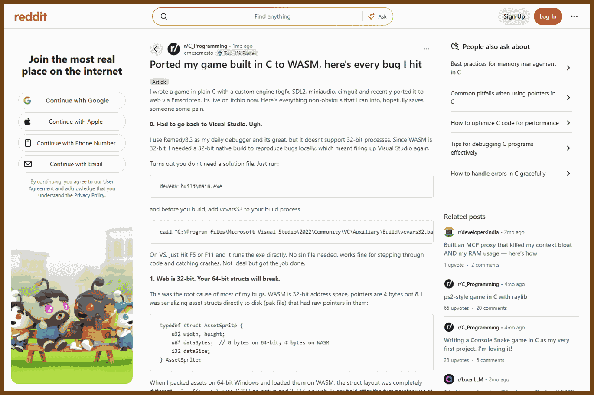
>
> A blunt postmortem of porting a hand-written C game engine (bgfx, SDL2, miniaudio, cimgui) to the web via Emscripten. A numbered list of every non-obvious problem hit along the way — starting with being forced back to Visual Studio because the author's debugger doesn't support 32-bit processes. Practical, pain-saving notes for anyone shipping C to WASM.

2026-05-23 [tspader/sp: A modern C standard library](https://github.com/tspader/sp) { github.com }

> 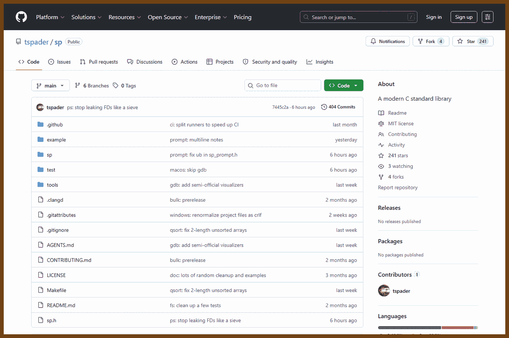
>
> A modern C standard library delivered as a single header, `sp.h`, bundling the utilities C leaves out. The examples go as far as a small `ls` implementation to show the library in real use.

2026-05-23 [antirez/sds: Simple Dynamic Strings library for C](https://github.com/antirez/sds) { github.com }

> 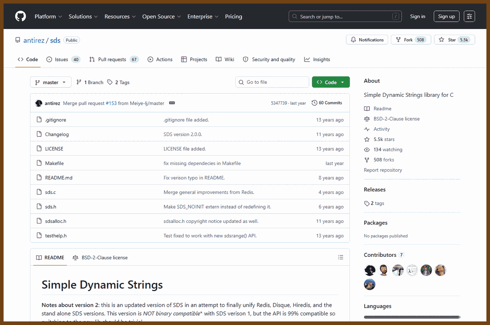
>
> Simple Dynamic Strings: antirez's small, widely-copied C string library (the one from Redis). Its trick is storing the length in a header that sits before the character pointer, so SDS strings stay compatible with plain C string functions while gaining O(1) length and safe growth. The README lays out the design and its tradeoffs.

2026-05-25 [On C extensions, portability, and alternative compilers](https://lemon.rip/w/6-c-extensions-compilers/) { lemon.rip }

> 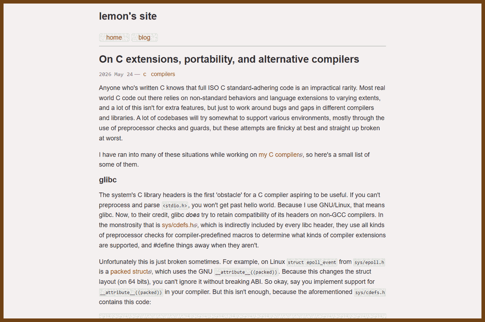
>
> A working list of the non-standard behaviors and compiler/library gaps you hit writing “portable” C, collected while building a C compiler. Concrete friction points across glibc, SDL, OpenBSD libc, and bionic show how rarely real-world code is actually pure ISO C.

2026-07-06 [The LLVM Compiler Infrastructure – Communications of the ACM](https://cacm.acm.org/federal-funding-of-academic-research/the-llvm-compiler-infrastructure/) { cacm.acm.org }

> 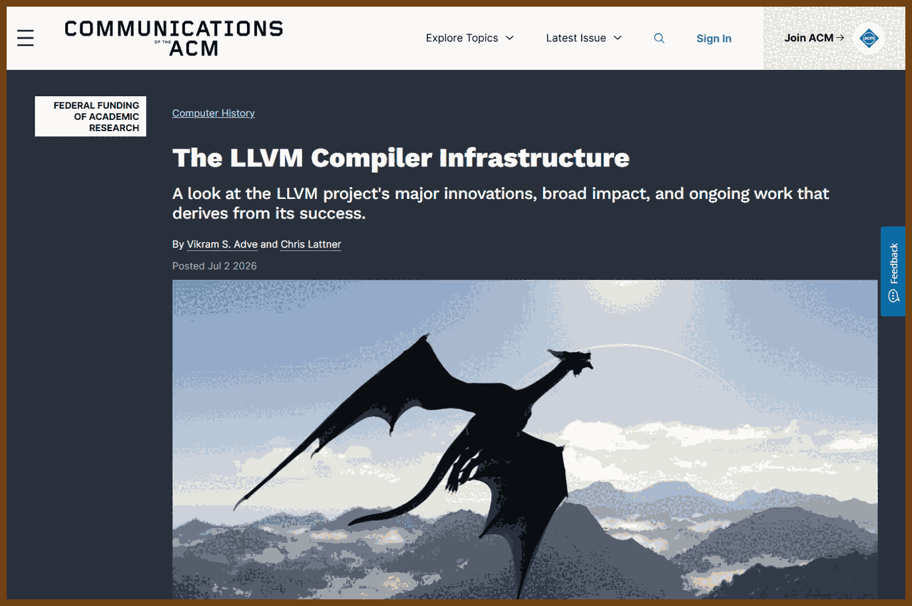
>
> A retrospective on LLVM by its creators, Vikram Adve and Chris Lattner, tracing the project from NSF-funded research in 2000 to code that now runs on billions of devices. Covers its major innovations, its external impact, and where the infrastructure is still heading — and doubles as a case for federal funding of basic research.

2026-07-09 [ironrinox/mini-c-compiler: Minimal C compiler implemented in C for educational purposes](https://github.com/ironrinox/mini-c-compiler) { github.com }

> 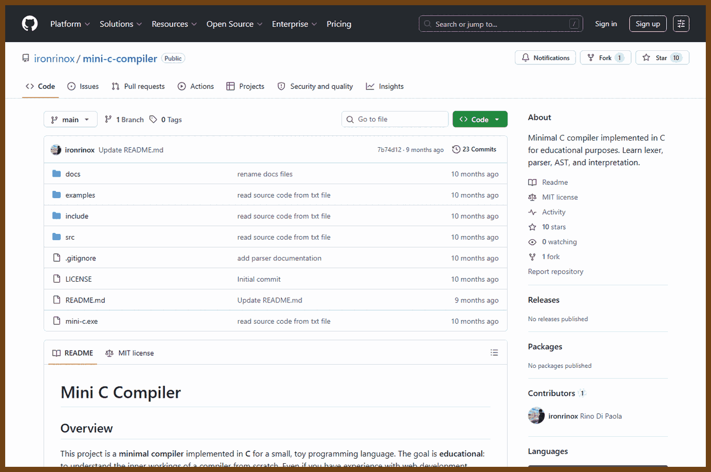
>
> A minimal C compiler written in C for learning — lexer, parser, AST, and interpreter — small enough to read end to end and understand how each stage feeds the next.

## Hey, Zig!

2026-06-08 [boringcollege/zig-by-example: Zig by example](https://github.com/boringcollege/zig-by-example) { github.com }

> 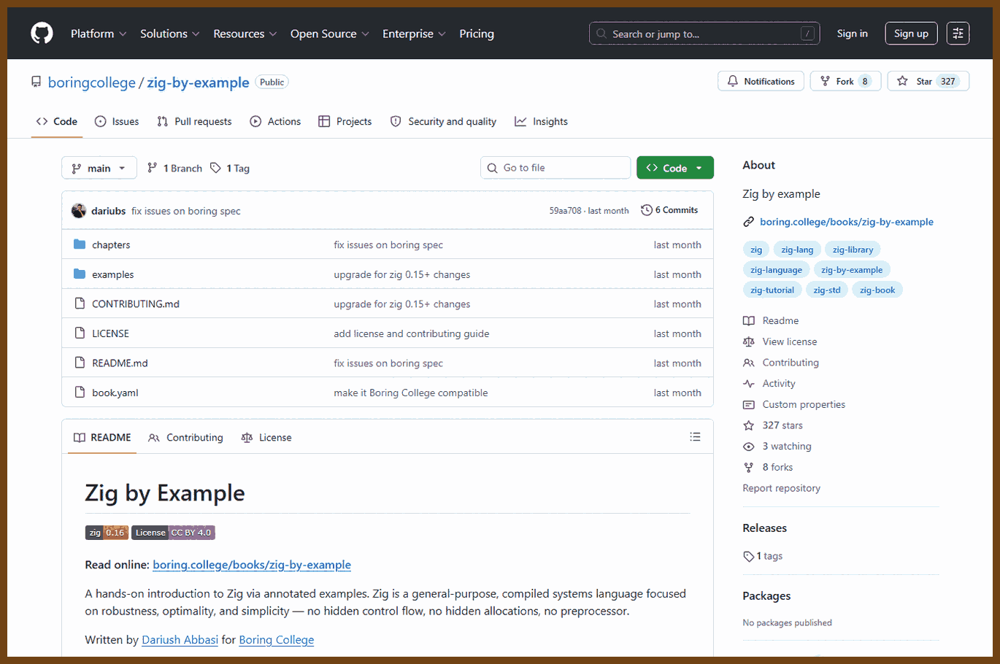
>
> A hands-on introduction to Zig through annotated examples, in the spirit of Go by Example. It leans on the language's focus on robustness and simplicity — no hidden control flow, no hidden allocations, no preprocessor. Readable online or straight from the repo.

## Bookmarklets

2026-06-01 [Bookmarklets Collection](https://tools.simonwillison.net/bookmarklets) { tools.simonwillison.net }

> 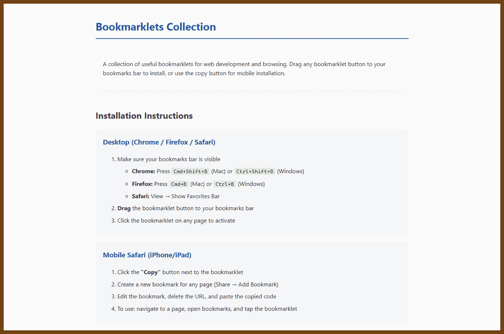
>
> A collection of small, useful bookmarklets for web development and browsing, with drag-to-install buttons and a copy option for mobile. Includes handy ones like viewing a page's reference anchors or its source.

## But Better

2026-05-26 [laminar-run/beautiful-mermaid: Simple React App for beautiful Mermaid Diagrams](https://github.com/laminar-run/beautiful-mermaid) { github.com }

> 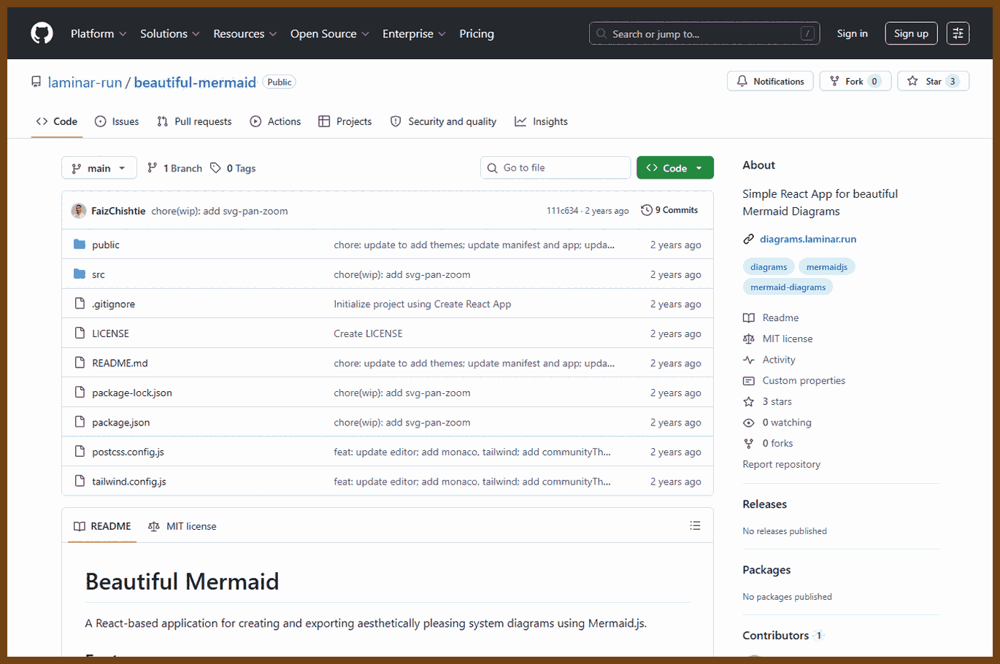
>
> A small React app that renders Mermaid diagrams with far nicer styling than the defaults — paste diagram source and get a clean, presentable result ready to drop into a doc or slide.

## Good Prompts

2026-05-24 [obra/superpowers: An agentic skills framework & software development methodology that works](https://github.com/obra/superpowers) { github.com }

> 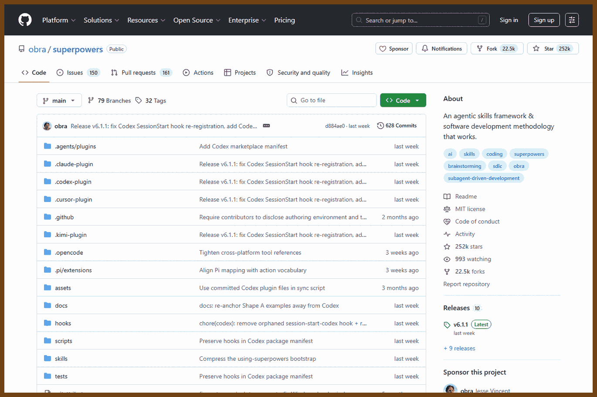
>
> An agentic “skills” framework and development methodology for Claude: a structured library of reusable skills plus a workflow for applying them. Includes a quickstart and an explanation of how the skills compose into a repeatable process.

## More RSS

2026-06-02 [RSS Is Back. AI Agents Are Reading It. — Julien Reszka](https://julienreszka.com/blog/rss-is-back-ai-agents-are-reading-it/) { julienreszka.com }

> 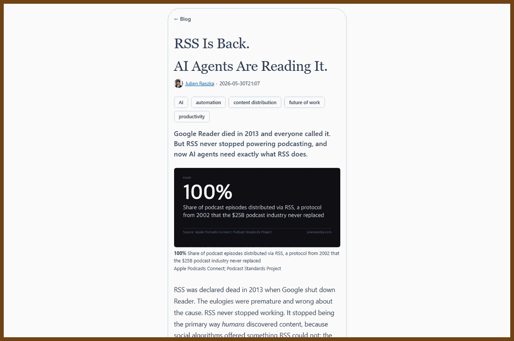
>
> RSS never actually died — it quietly powered podcasting for a decade — and now AI agents need exactly what it provides: a clean, structured, pollable feed of content. A short argument that the old format is unexpectedly well-suited to the agent era.

2026-06-02 [prof18/feed-flow: FeedFlow is a minimalistic RSS Reader available on Android, iOS, macOS, Windows and Linux](https://github.com/prof18/feed-flow) { github.com }

> 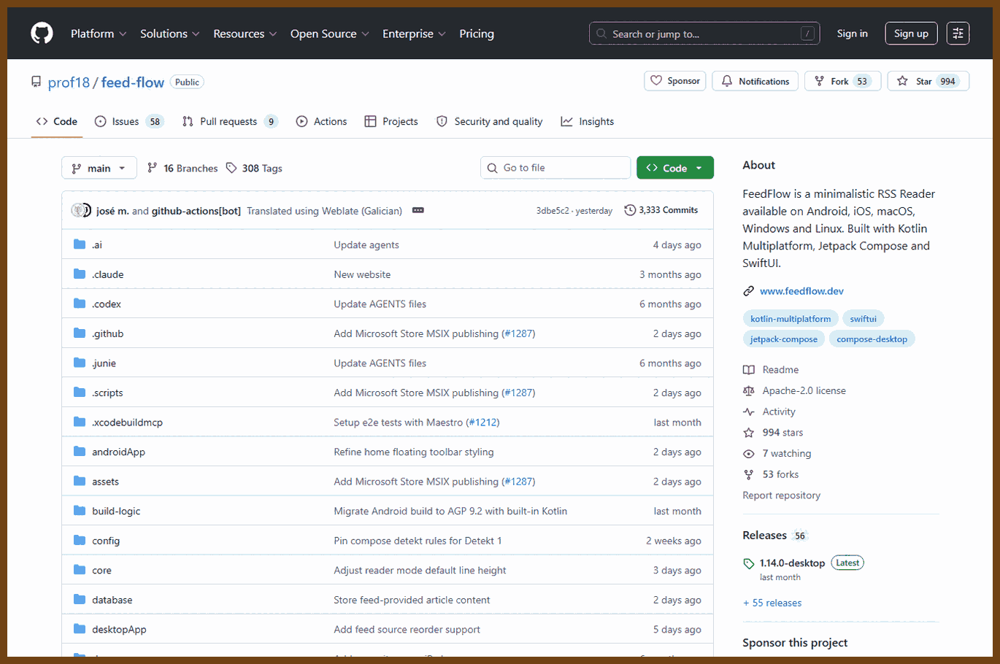
>
> FeedFlow is a minimalist cross-platform RSS reader (Android, iOS, macOS, Windows, Linux) built with Kotlin Multiplatform, Jetpack Compose, and SwiftUI. A clean, single-codebase example of a modern KMP app as much as a usable reader.

2026-06-29 [RSS Subscription Extension (by Google) - Chrome Web Store](https://chromewebstore.google.com/detail/rss-subscription-extensio/nlbjncdgjeocebhnmkbbbdekmmmcbfjd?pli=1) { chromewebstore.google.com }

> 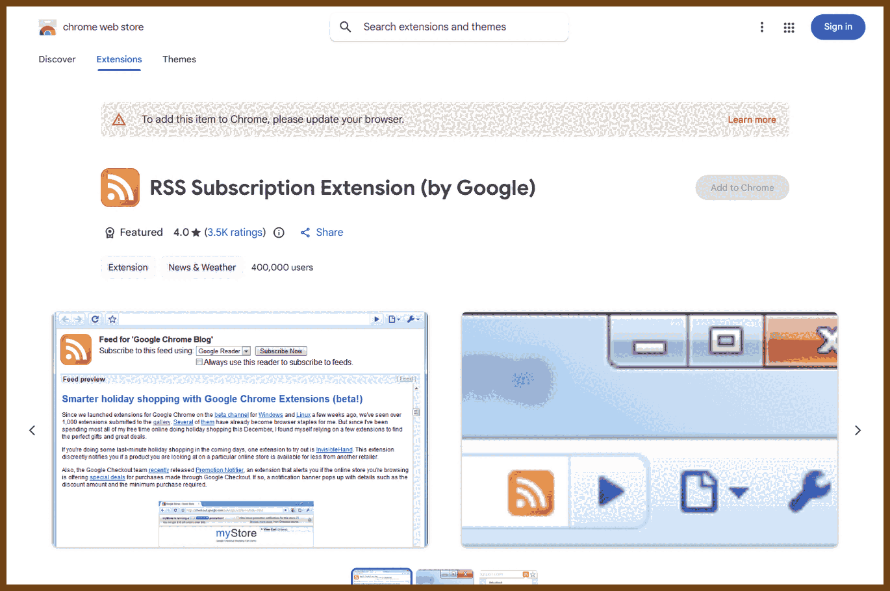
>
> Google's official RSS Subscription Extension for Chrome: adds one-click feed subscription to the toolbar and previews feeds in the browser. Rated 4.0★ across ~3.5K reviews.

2026-06-29 [6 Best Free RSS Feed Readers For 2026](https://bloggingwizard.com/free-rss-feed-readers/) { bloggingwizard.com }

> 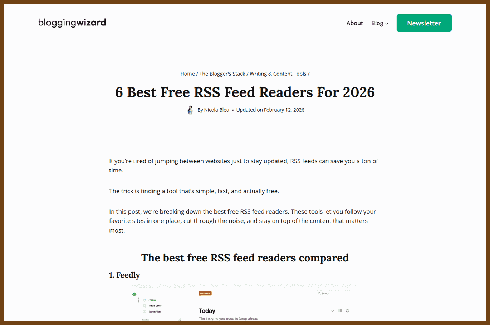
>
> A roundup of six free RSS readers for 2026 — Feedly, Inoreader, NewsBlur, and others — compared on what each does well. A reasonable starting point if you're picking a reader.

2026-06-29 [Feedbro - RSS Feed Reader with built-in Rule Engine](https://nodetics.com/feedbro/) { nodetics.com }

> 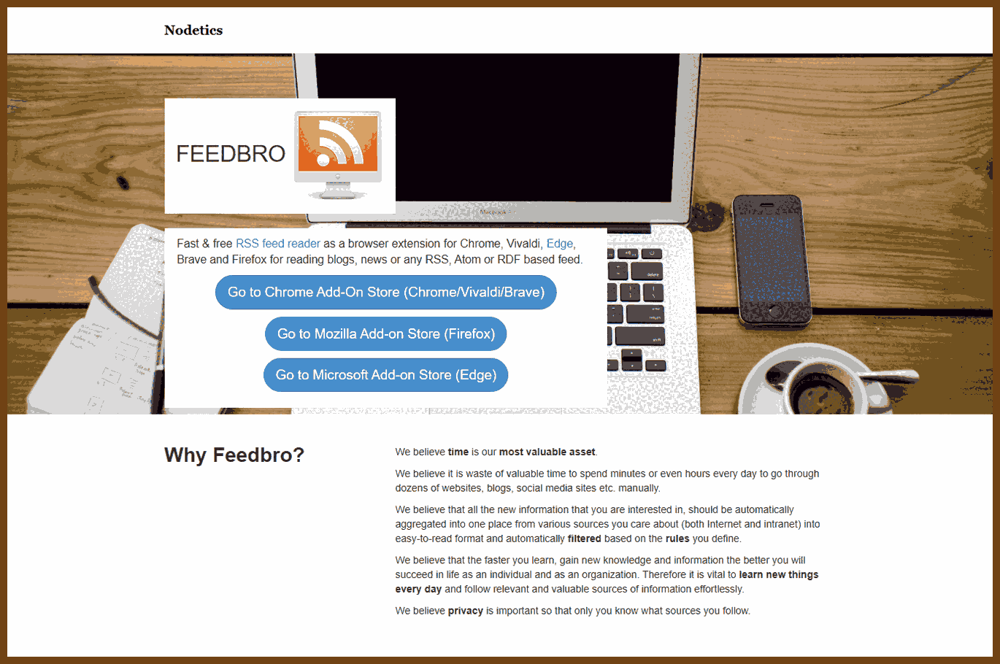
>
> Feedbro is a browser-extension RSS/Atom/RDF reader (Chrome, Edge, Brave, Vivaldi, Firefox) with a built-in rule engine for filtering and auto-tagging feeds — handy for following many sources without drowning in them.

2026-06-29 [lqdev/rss-browser-extension: RSS Feed Detector Extension](https://github.com/lqdev/rss-browser-extension) { github.com }

> 
>
> A small browser extension that detects RSS/Atom feeds on the page you're viewing so you can subscribe quickly. Installable from source in developer mode.
