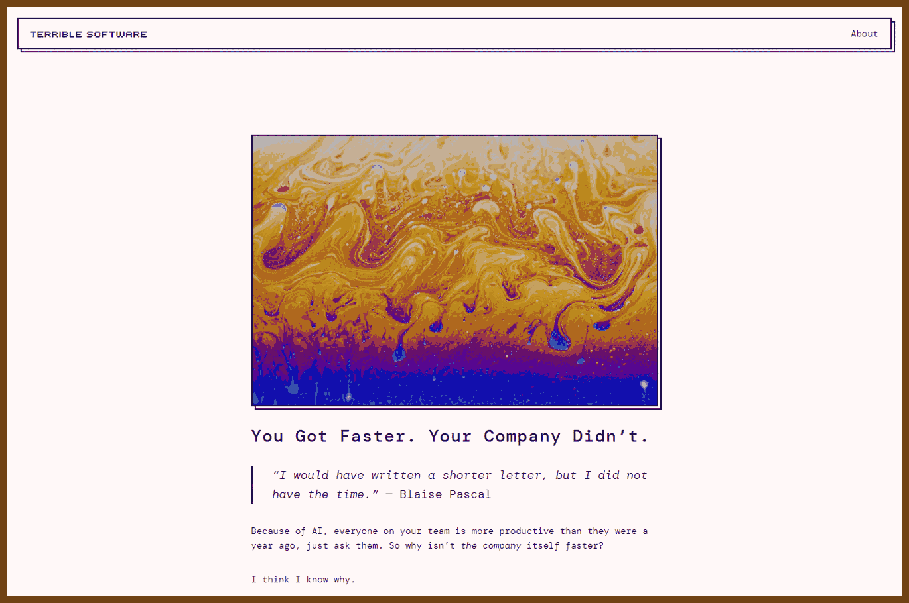
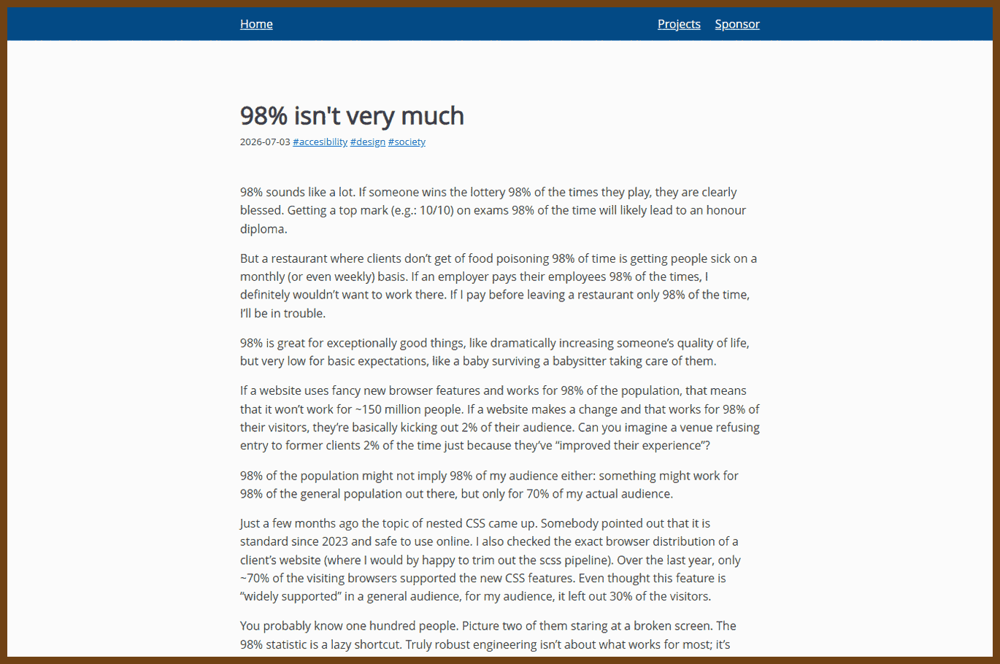
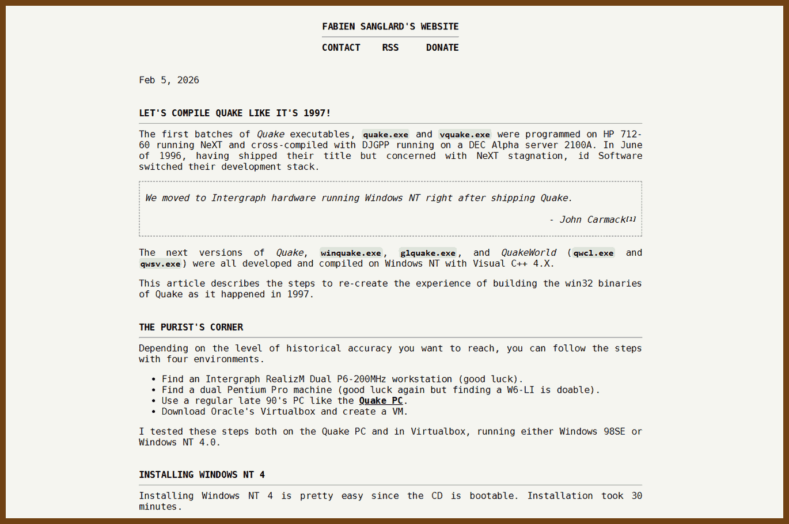
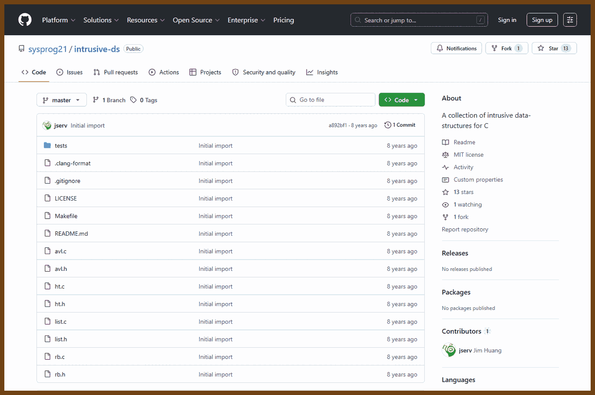
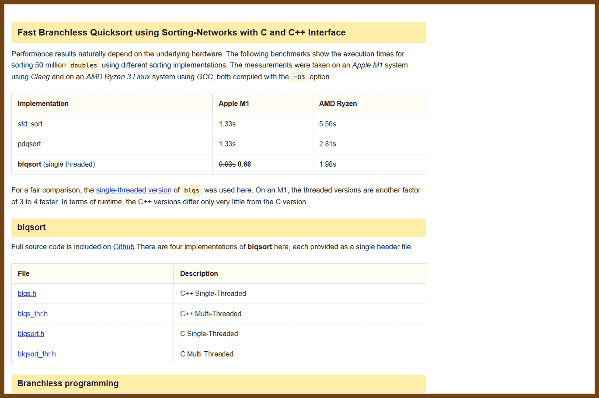
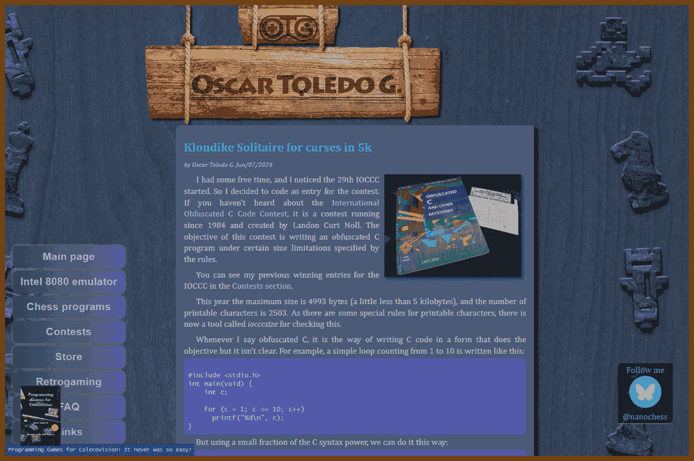
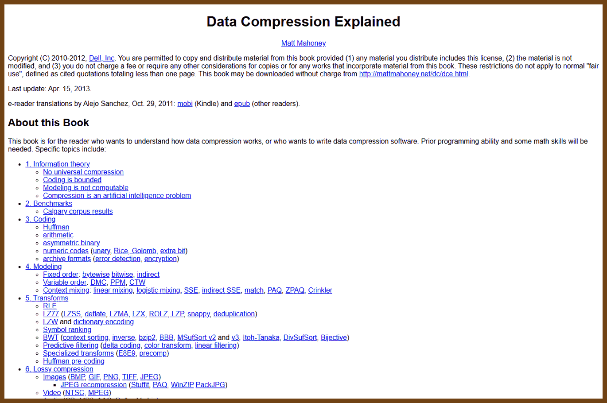
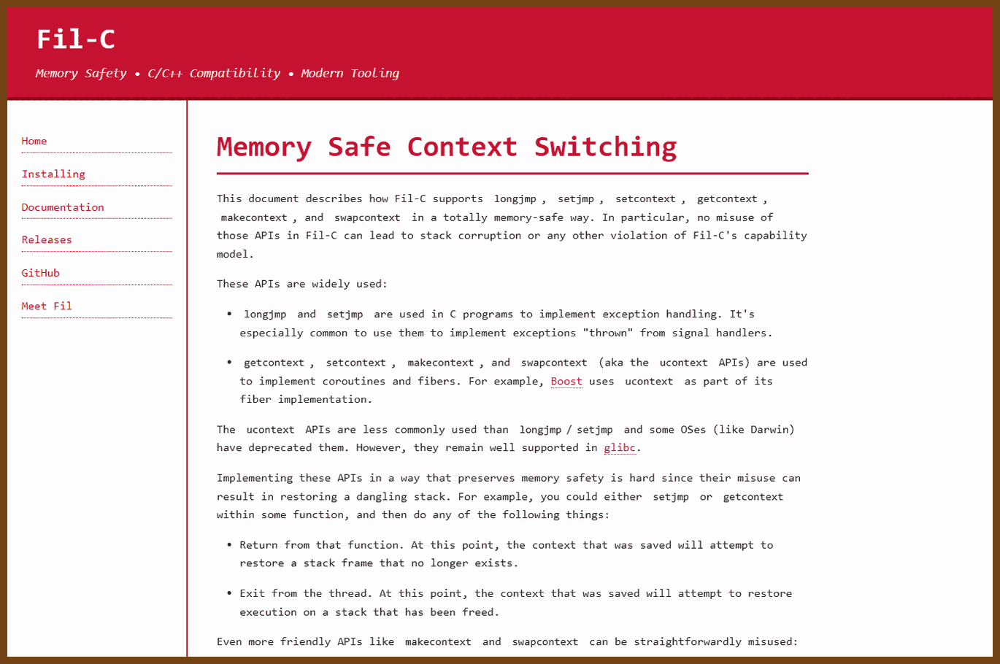
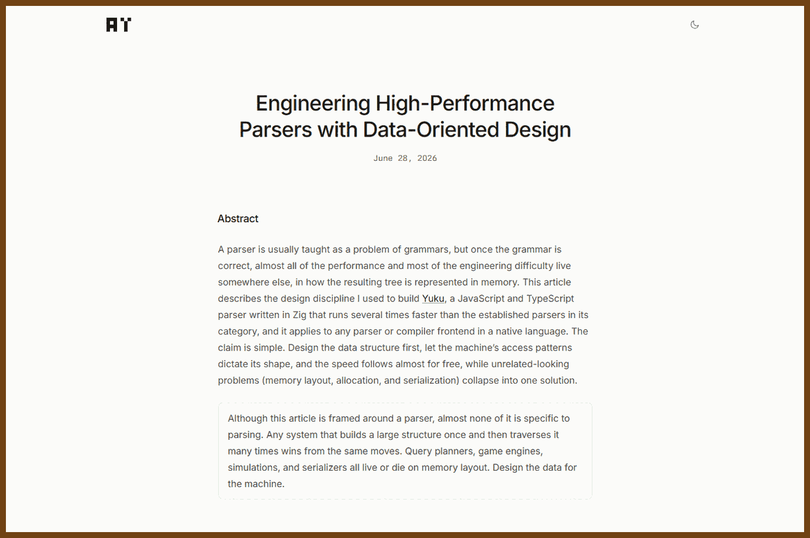

---
layout: post
title:  "Links from my inbox 2026-08-09"
date:   2026-08-09T13:16:00-07:00
categories: links
---

## Good Reads

2026-06-17 [You got faster; your company didn't](https://terriblesoftware.org/2026/06/17/you-got-faster-your-company-didnt/) { terriblesoftware.org }

> 
>
> Individual speedups from AI don't turn into faster shipping because the real bottlenecks — review, coordination, decisions — sit outside your editor. Local optimization runs straight into the system's actual constraint.

2026-06-21 [How software groups rot: legacy of the expert beginner](https://daedtech.com/how-software-groups-rot-legacy-of-the-expert-beginner/) { daedtech.com }

> 
>
> Erik Dietrich's classic on why teams stagnate. An “expert beginner” stops improving early, mistakes tenure for mastery, and entrenches — and because they set the local standards, the whole group calcifies around their ceiling.

2026-07-01 [Why I stopped arguing with people](https://wangcong.org/2026-06-30-why-i-stopped-arguing-with-people.html) { wangcong.org }

> 
>
> On the cost of winning arguments that change no one's mind. The author's shift from debating to disengaging is framed as reclaimed attention rather than defeat — pick the arguments that actually move something.

2026-07-02 [How to ask for help](https://pradyuprasad.com/writings/how-to-ask-for-help/) { pradyuprasad.com }

> 
>
> A guide to asking questions that actually get answered: show what you tried, state the goal, and make it cheap for someone to help you. Better questions get better and faster help — and respect people's time.

2026-07-07 [98% isn't very much](https://whynothugo.nl/journal/2026/07/03/98-isnt-very-much/) { whynothugo.nl }

> 
>
> Reliability is multiplicative. A step that works 98% of the time sounds excellent until you chain twenty of them and the whole pipeline fails more often than it succeeds. A short, sharp argument about why “nearly always” rarely is.

## Emacs

2026-06-15 [Even more batteries included with Emacs](https://karthinks.com/software/even-more-batteries-included-with-emacs/) { karthinks.com }

> 
>
> A tour of capable built-in Emacs features people reach for packages to replace — completion, project handling, window management — that already ship in the box. The theme: learn what's included before installing over it.

2026-07-04 [Magit 4.6 released](https://emacsair.me/2026/07/01/magit-4.6/) { emacsair.me }

> 
>
> Release notes for Magit 4.6, the Git porcelain for Emacs. Worth skimming for the new commands and workflow changes if you drive Git from inside the editor.

## 🦶🔫 C || C++ 

2026-05-29 [Let's compile Quake like it's 1997](https://fabiensanglard.net/compile_like_1997/) { fabiensanglard.net }

> 
>
> Rebuilds the original Quake with a period-accurate 1997 DOS toolchain — Watcom C, DOS4GW — to show what shipping a game looked like before modern build systems. The interesting part is the friction: fixed memory models, segmented pointers, and a compiler whose optimizer you had to hand-hold.

2026-06-04 [Intrusive data structures](https://tivrfoa.github.io/rust/data-structure/2025/07/27/intrusive-data-structures.html) { tivrfoa.github.io }

> 
>
> The node's link fields live inside the element itself instead of in a separate container node — the Linux kernel `list_head` style. One fewer allocation per insert, better cache locality, and an element can belong to several lists at once. The tradeoff is that the structure and its storage are now coupled.

2026-06-04 [sysprog21/intrusive-ds: intrusive data structures for C](https://github.com/sysprog21/intrusive-ds) { github.com }

> 
>
> A small C library collecting intrusive lists and trees ready to drop into a project, companion code to the intrusive-structures write-up. Useful as a reference for the `container_of` trick and how the macros hide the pointer arithmetic.

2026-06-04 [Branchless quicksort](https://tiki.li/blog/blqsort) { tiki.li }

> 
>
> Removes the unpredictable branch from quicksort's partition step. Instead of an `if` that the CPU keeps mispredicting on random data, it computes both outcomes and selects with a conditional move, trading a few extra instructions for a big drop in branch-misprediction stalls.

2026-06-10 [Klondike solitaire for curses in 5k of C](https://nanochess.org/klondike_in_c.html) { nanochess.org }

> 
>
> A full playable Klondike solitaire for the terminal in about 5 KB of C, from Óscar Toledo, who is known for extremely compact programs. Worth reading as an exercise in how much game fits into very little code when you drop every abstraction.

2026-06-19 [Data Compression Explained](https://mattmahoney.net/dc/dce.html) { mattmahoney.net }

> 
>
> Matt Mahoney's book-length reference on lossless compression, from information theory and entropy through arithmetic coding, context mixing, and the PAQ family that has topped compression benchmarks. Dense but self-contained; a good single source for how modern compressors actually model data.

2026-06-22 [microcrad: micrograd re-implemented in C](https://github.com/oraziorillo/microcrad) { github.com }

> 
>
> Karpathy's micrograd — a tiny scalar autograd engine and neural net — rewritten in C. Small enough to read end to end, which makes backpropagation concrete: every value is a node in a graph, and gradients flow backward through it.

2026-06-29 [Memory-safe context switching](https://fil-c.org/context_switches) { fil-c.org }

> 
>
> How Fil-C — a memory-safe implementation of C and C++ — handles context switching without breaking its safety guarantees. Coroutine and thread switches move the stack out from under running code, exactly the kind of operation a naive safety scheme forbids; this explains how it stays sound.

2026-07-01 [Text editor data structures: the piece table](https://www.averylaird.com/programming/the%20text%20editor/2017/09/30/the-piece-table.html) { averylaird.com }

> 
>
> Why serious editors don't store text as one big array. Compares gap buffers, ropes, and the piece table — the append-only original plus a list of pieces pointing into original and added buffers — which gives cheap edits and near-free undo. The structure VS Code settled on, and why.

2026-07-01 [Engineering high-performance parsers with data-oriented design](https://www.arshad.fyi/writings/engineering-high-performance-parsers) { arshad.fyi }

> 
>
> Applies data-oriented design to parsing: lay tokens out as struct-of-arrays, keep hot fields packed for the cache, and shape the loops so the branch predictor and prefetcher can keep up. The point is that parser speed is mostly a memory-layout problem, not a clever-algorithm problem.

2026-07-08 [GTK's in-tree timsort in C](https://github.com/GNOME/gtk/blob/main/gtk/timsort/gtktimsort.c) { github.com }

> 
>
> GTK carries its own C implementation of timsort — the adaptive merge sort that exploits existing runs of ordered data. Reading production timsort shows the parts the textbook description skips: run detection, galloping merges, and the delicate invariant that bounds the merge stack.
