---
layout: post
title:  "Links from my inbox 2026-09-20"
date:   2026-09-20T18:24:00-07:00
categories: links
---

[[_TOC_]]


## Good Read

2026-08-30 [Making the internet boring](https://cemrehancavdar.com/2026/08/30/making-the-internet-boring/) { cemrehancavdar.com }

> 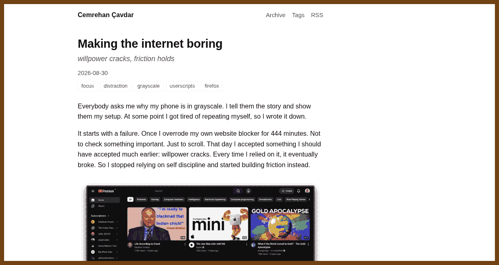
>
> The author once overrode the author's own website blocker for 444 minutes. After that the author stopped relying on willpower and started making the internet boring: app deletions, LeechBlock, grayscale mode, and a custom userscript.
>
> RSS: [Subscribe](https://cemrehancavdar.com/feed.xml)

2025-08-26 [Mark Dominus (@mjd@mathstodon.xyz)](https://mathstodon.xyz/@mjd/115096720350507897) { mathstodon.xyz }

> 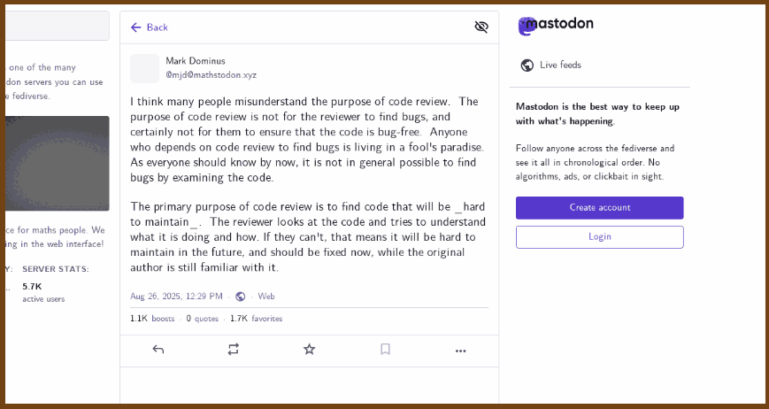
>
> 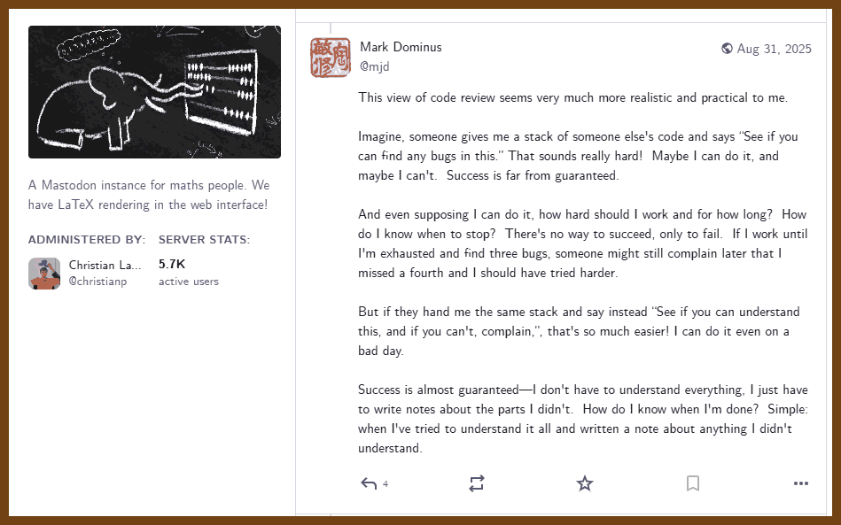
>
> The author think many people misunderstand the purpose of code review. The purpose of code review is not for the reviewer to find bugs, and certainly not for them to ensure that the code is bug-free. Anyone who depends on code review to find bugs is living in a fool's paradise. As everyone should know by now, it is not in general possible to find bugs by examining the code. The primary purpose of code review is to find code that will be _hard to maintain_. The reviewer looks at the code and tries to understand what it is doing and how. If they can't, that means it will be hard to maintain in the future, and should be fixed now, while the original author is still familiar with it.

2025-10-15 [I am sorry, but everyone is getting syntax highlighting wrong](https://tonsky.me/blog/syntax-highlighting) { tonsky.me }

> 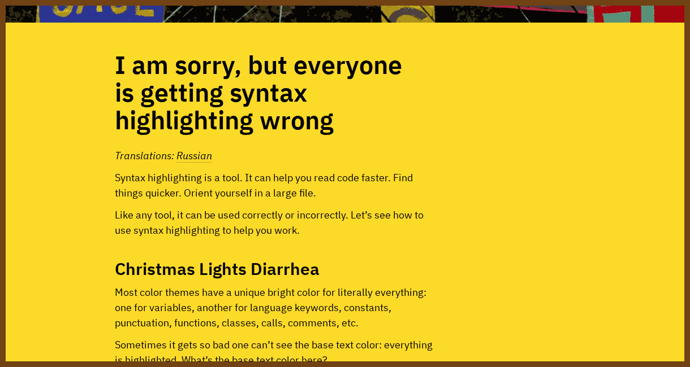
>
> 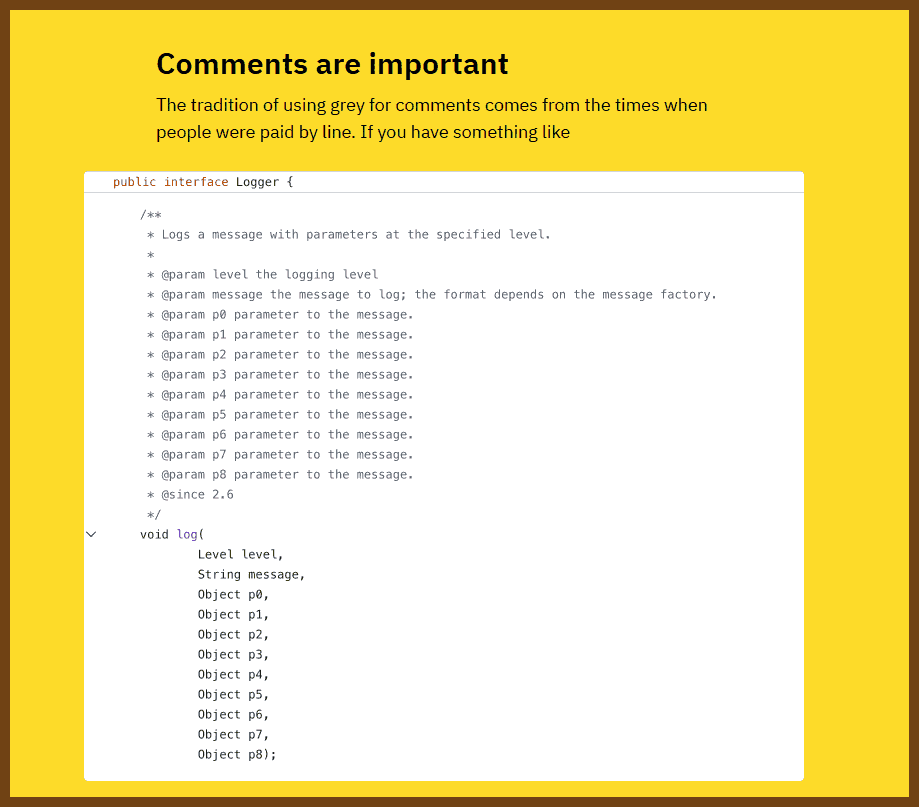
>
> I’ve been applying these principles for [about 8 years now](https://github.com/tonsky/vscode-theme-alabaster/commit/5c840f5fb57e5cd0dce93ac8c450495bdb0a2658).
>
> I call this theme **Alabaster** and I’ve built it a couple of times for the editors I used:
>
> - [VS Code](https://github.com/tonsky/vscode-theme-alabaster)
> - [JetBrains IDEs](https://github.com/tonsky/intellij-alabaster)
> - [Sublime Text](https://github.com/tonsky/sublime-scheme-alabaster) ([twice](https://github.com/tonsky/clojure-sublimed/?tab=readme-ov-file#color-scheme))
>
> It’s also been ported to many other editors and terminals; the most complete list is [probably here](https://github.com/tonsky/sublime-scheme-alabaster?tab=readme-ov-file#variations-1). If your editor is not on the list, try searching for it by name—it might be built-in already! I always wondered where these color themes come from, and now I became an author of one (and I still don’t know).
>
> Feel free to use Alabaster as is or build your own theme using the principles outlined in the article—either is fine by me.
>
> As for the principles themselves, they worked out fantastically for me. I’ve never wanted to go back, and just one look at any “traditional” color theme gives me a scare now.
>
> I *suspect* that the only reason we don’t see more restrained color themes is that people never really thought about it. Well, this is your wake-up call. I hope this will inspire people to use color more deliberately and to change the default way we build and use color themes.
>
> Applying human ergonomics and design principles to syntax highlighting
>
> Feed: [Subscribe](https://tonsky.me/atom.xml)

2026-08-28 [Highlighting my Code Based on How Much I Care](https://hank.bond/posts/highlighting-my-code-based-on-how-much-i-care/) { hank.bond }

> 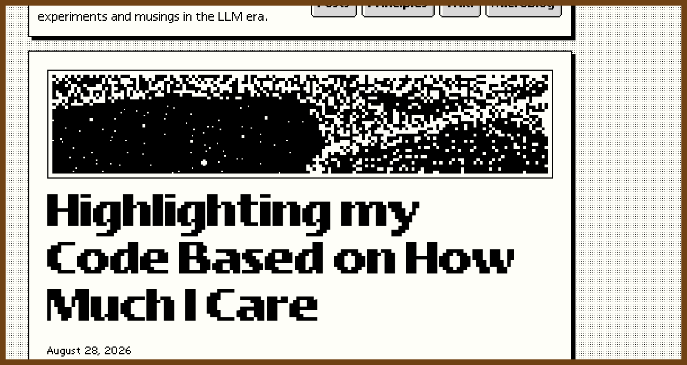
>
> The author never questioned why code should be highlighted until the author tried to make the author's own theme.
>
> RSS: [Subscribe](https://hank.bond/index.xml)

2026-06-22 [p99 0 ms* autocomplete for 240 million domain names](https://ruurtjan.com/articles/p99-0ms-autocomplete-for-240-million-domain-names) { ruurtjan.com }

> 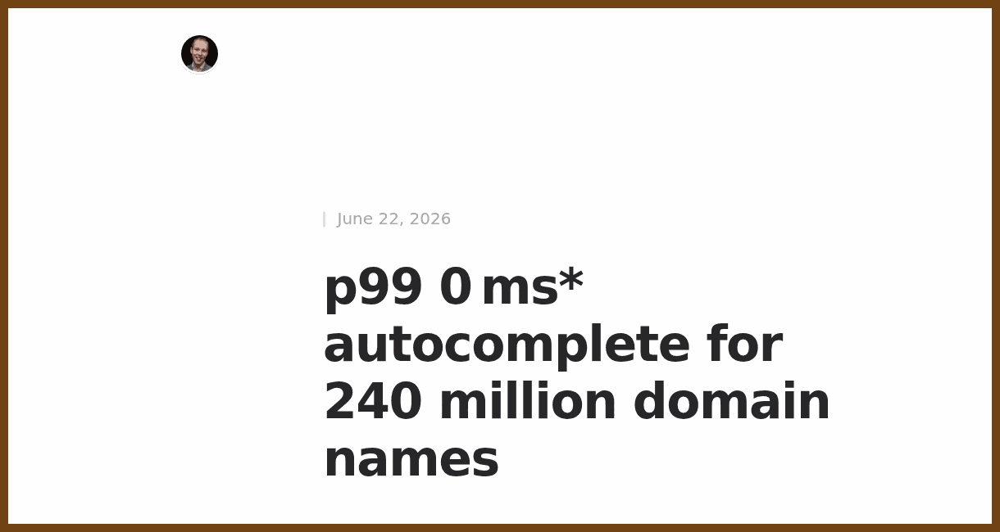
>
> How Wirewiki's domain-name autocomplete renders suggestions next frame for 99% of keystrokes.
>
> RSS: [Subscribe](https://ruurtjan.com/feed.xml)

2026-07-15 [Making 768 servers look like 1 — PlanetScale](https://planetscale.com/blog/making-768-servers-look-like-1) { planetscale.com }

> 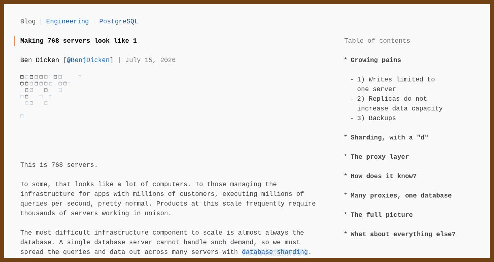
>
> How to make 768 distinct Postgres servers look like 1 to your applications.
>
> Feed: [Subscribe](https://planetscale.com/blog/feed.atom)

2026-07-22 [The startup's Postgres survival guide](https://hatchet.run/blog/postgres-survival-guide) { hatchet.run }

> 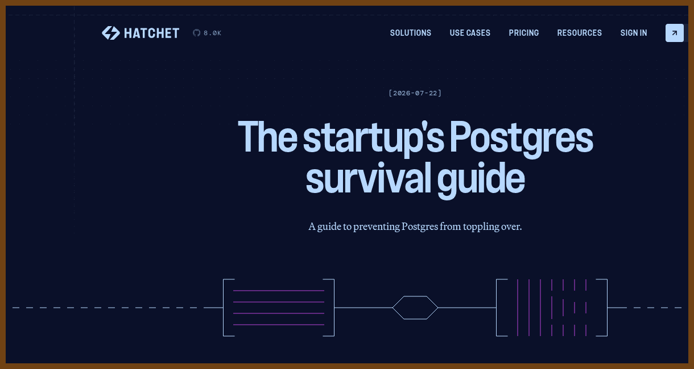
>
> A guide to preventing Postgres from toppling over.

2026-07-25 [How I Find Problems to Solve as a Staff Engineer](https://lalitm.com/post/find-problems-staff-engineer/) { lalitm.com }

> 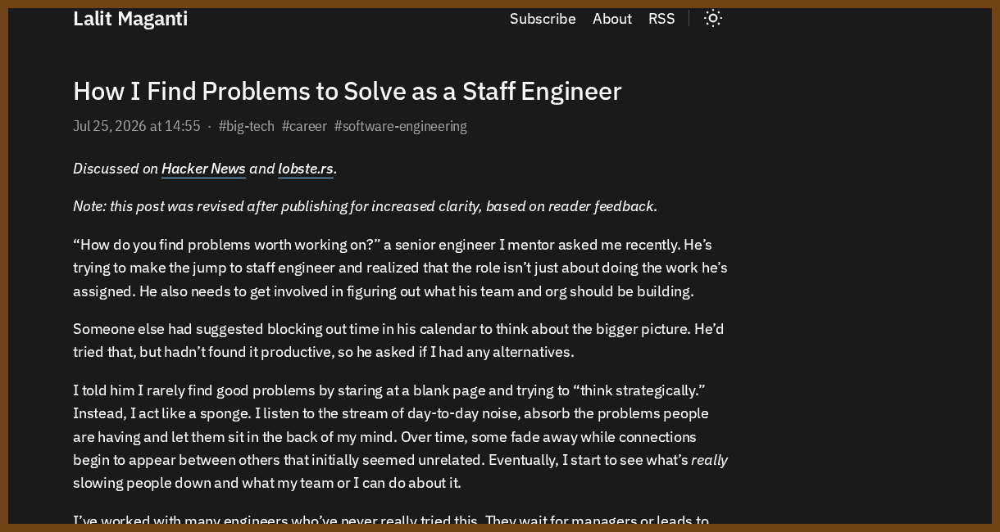
>
> How listening broadly turns everyday problems into useful project ideas.
>
> RSS: [Subscribe](https://lalitm.com/articles/index.xml)

2026-07-26 [maybe sometimes the black pill is ok (a response to Andrew Kelley)](https://sebsite.pw/w/20260726-blackpill.html) { sebsite.pw }

> 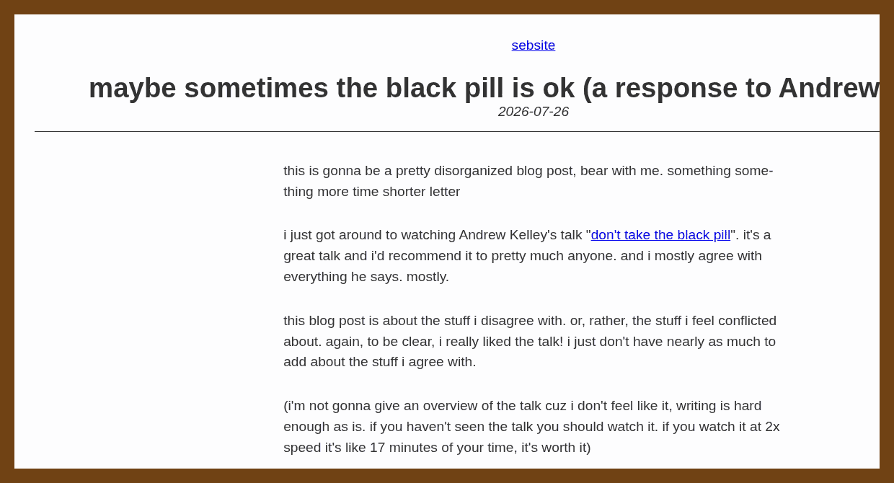
>
> maybe sometimes the black pill is ok (a response to Andrew Kelley) is a broad guide covering discord, hinge, conclusion i guess?.
>
> Feed: [Subscribe](https://sebsite.pw/feed.xml)

2026-08-02 [Giving and taking credit in big tech companies](https://www.seangoedecke.com/giving-and-taking-credit/) { www.seangoedecke.com }

> 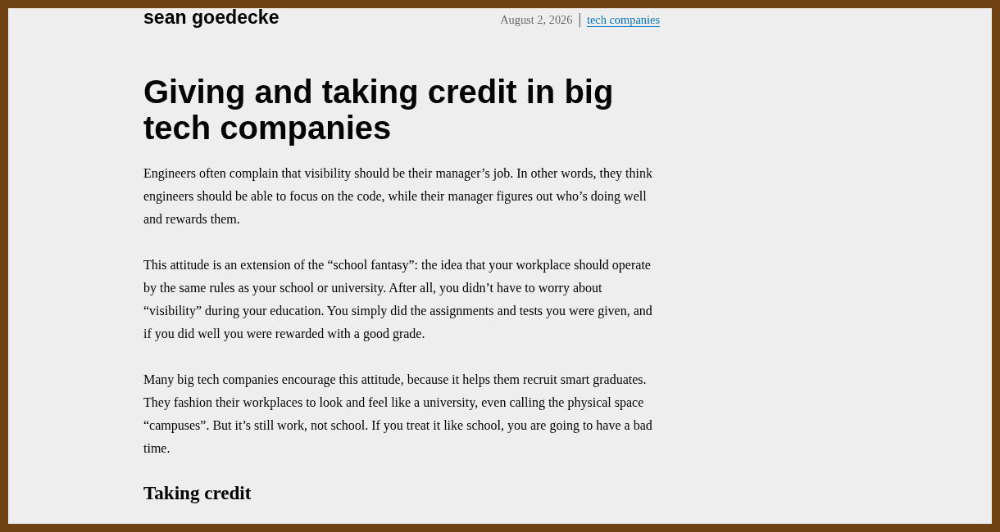
>
> Engineers often complain that visibility should be their manager’s job. In other words, they think engineers should be able to focus on the code, while their…
>
> RSS: [Subscribe](https://www.seangoedecke.com/rss.xml)

2025-05-06 [The definitive guide to Durable Execution](https://temporal.io/blog/what-is-durable-execution) { temporal.io }

> 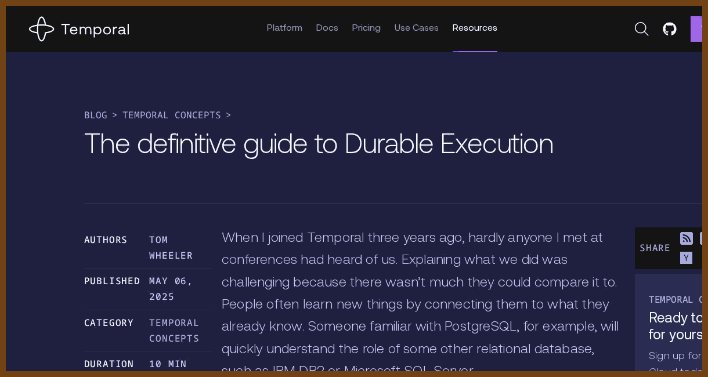
>
> Learn what Durable Execution is and how it enables developers to quickly create reliable applications that can withstand crashes.
>
> RSS: [Subscribe](https://temporal.io/blog/feed.xml)

2026-07-09 [GitHub - architecture-decision-record/architecture-decision-record: Architecture decision record (ADR) examples for software planning, IT leadership, and template documentation](https://github.com/architecture-decision-record/architecture-decision-record) { github.com }

> Architecture decision record (ADR) examples for software planning, IT leadership, and template documentation - architecture-decision-record/architecture-decision-record

2026-07-09 [bliki: Architecture Decision Record](https://martinfowler.com/bliki/ArchitectureDecisionRecord.html) { martinfowler.com }

> 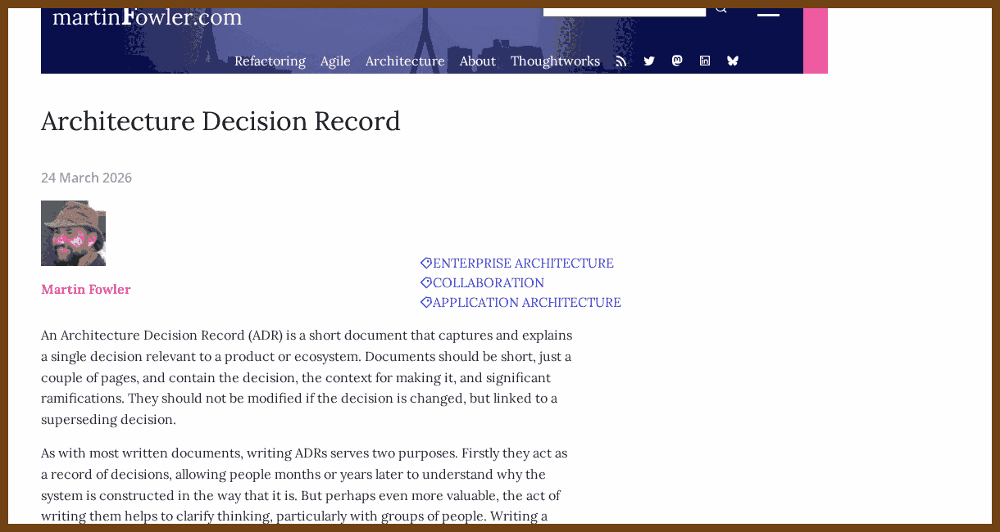
>
> A short document that captures a single decision, structured into a log to provide a history
>
> Feed: [Subscribe](https://martinfowler.com/feed.atom)

2026-07-16 [Job queues are deceptively tricky](https://typesanitizer.com/blog/job-queues.html) { typesanitizer.com }

> 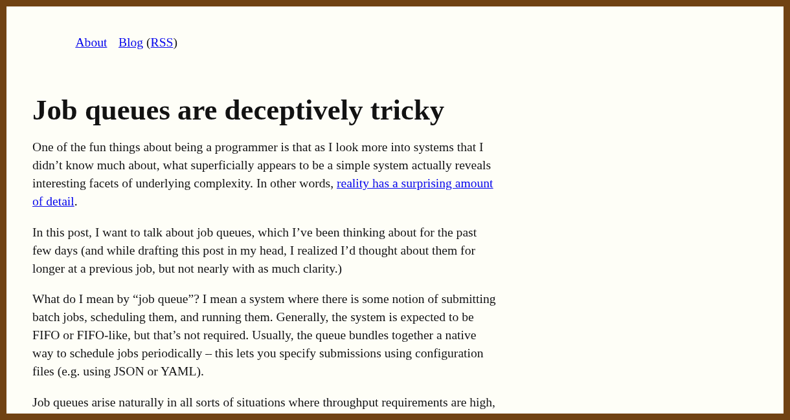
>
> A worked out example of different job queueing semantics and how they affect workloads.
>
> RSS: [Subscribe](https://typesanitizer.com/blog/rss.xml)

2026-07-16 [Scaling to 1 million concurrent sandboxes in seconds | Modal Blog](https://modal.com/blog/scaling-to-1-million-concurrent-sandboxes-in-seconds) { modal.com }

> 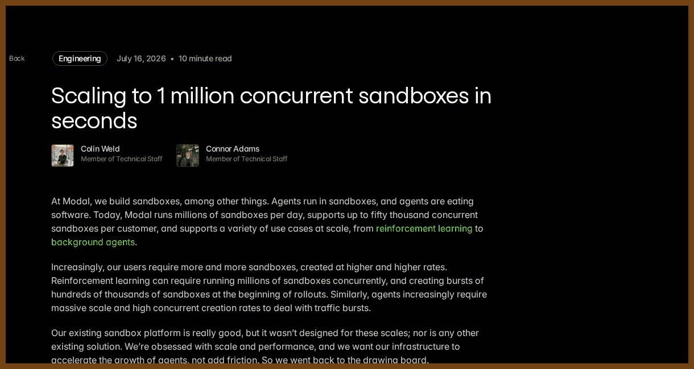
>
> How (and why) the authors built a scheduling system that can scale to 1 million concurrent sandboxes (per workspace) in seconds.
>
> Feed: [Subscribe](https://modal.com/blog/atom.xml)

2026-08-05 [GitHub - pshenok/server-survival: Tower defense game that teaches cloud architecture. Build infrastructure, survive traffic, learn scaling.](https://github.com/pshenok/server-survival) { github.com }

> 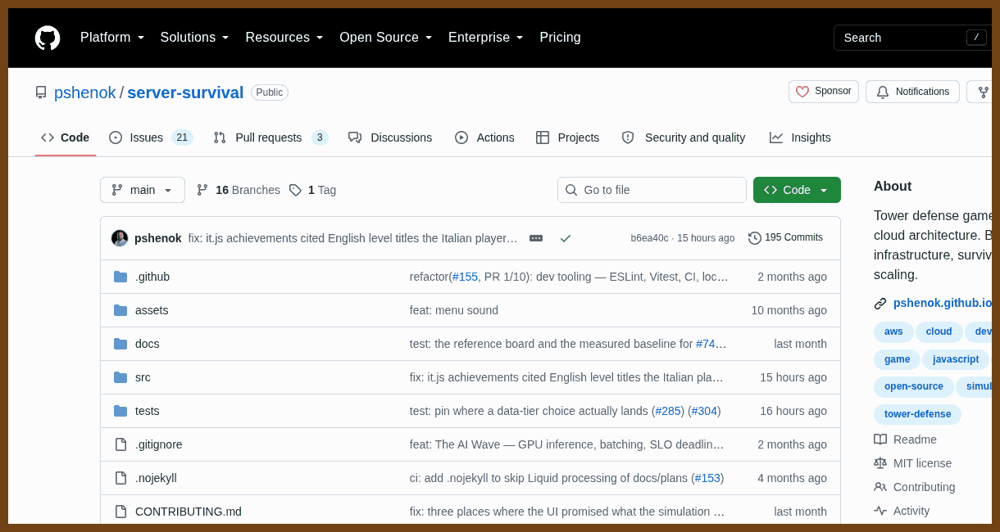
>
> Tower defense game that teaches cloud architecture. Build infrastructure, survive traffic, learn scaling. - pshenok/server-survival

2026-09-15 [Distributed Systems Classics](https://nvartolomei.com/dist-sys-classics/) { nvartolomei.com }

> 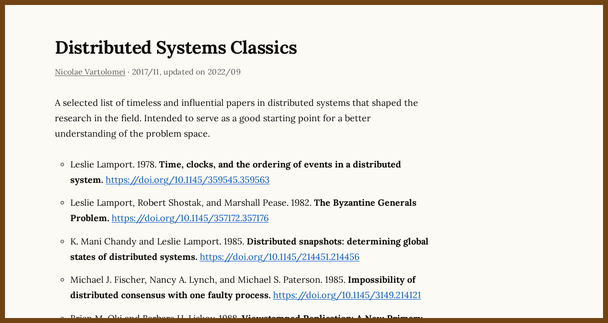
>
> Nicolae Vartolomei · 2017/11, updated on 2022/09 A selected list of timeless and influential papers in distributed systems that shaped the research in the field. 1985. **Distributed snapshots: determining global states of distributed systems.** https://doi.org/10.1145/214451.214456 Michael J.
>
> RSS: [Subscribe](https://nvartolomei.com/rss.xml)

2026-09-18 [How Uber Protects Against Retry Storms](https://www.uber.com/us/en/blog/protecting-against-retry-storms/) { www.uber.com }

> 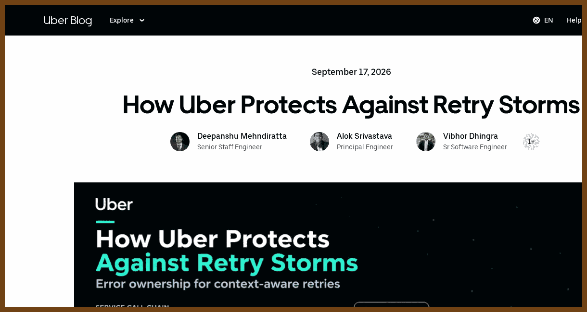
>
> What if retries could know when they’re helping, and when they’re making things worse? Uber Engineering built error ownership to prevent and contain retry storms.

2026-07-07 [30 papers · The reading list Ilya Sutskever gave John Carmack](https://30papers.com/) { 30papers.com }

> 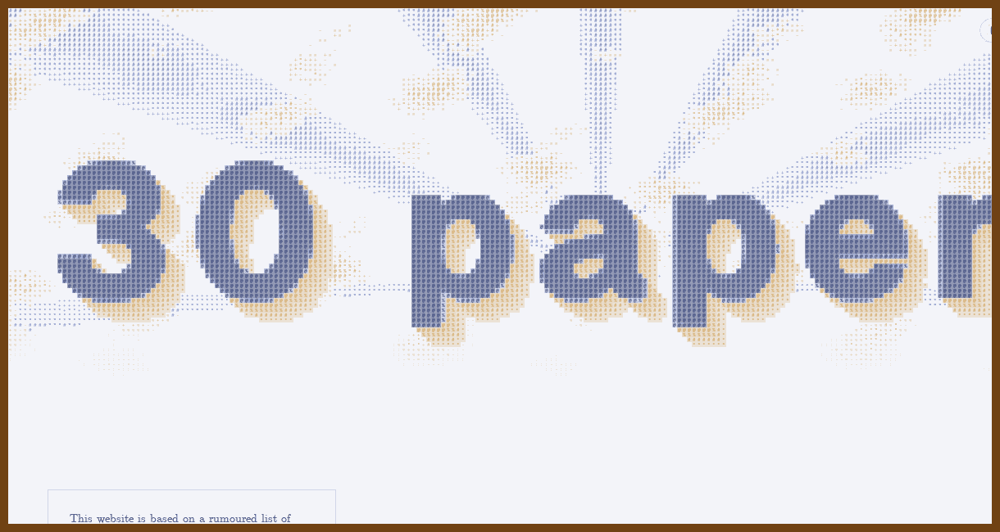
>
> A curated reading list of foundational AI and deep learning papers, hosted in full with plain-language explanations of difficult terms.


## C || C++ / Systems

2021-03-01 [C Language Enum Tips & Tricks](https://kubyshkin.name/posts/c-language-enums-tips-and-tricks/) { kubyshkin.name }

> 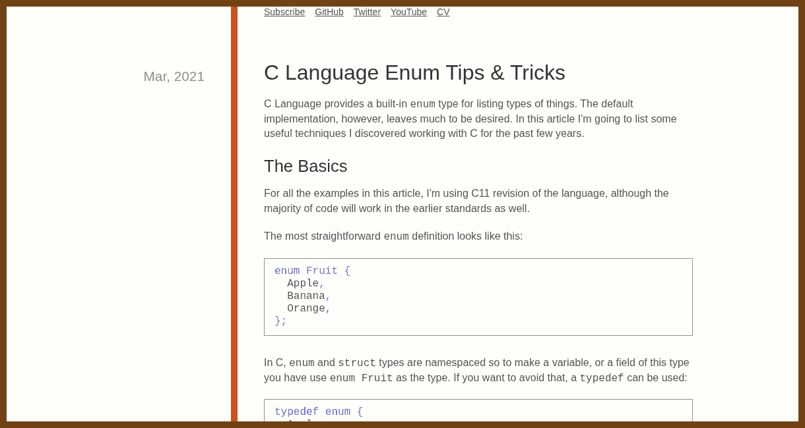
>
> C Language Enum Tips & Tricks is a broad guide covering The Basics, Name Strings, Enum Size, Smaller Storage Classes. Later sections move through Summary, with the page serving as a practical reference rather than a single-idea essay.
>
> RSS: [Subscribe](https://kubyshkin.name/rss.xml)

2022-11-18 [Everything I wish I knew when learning C](https://tmewett.com/c-tips/) { tmewett.com }

> 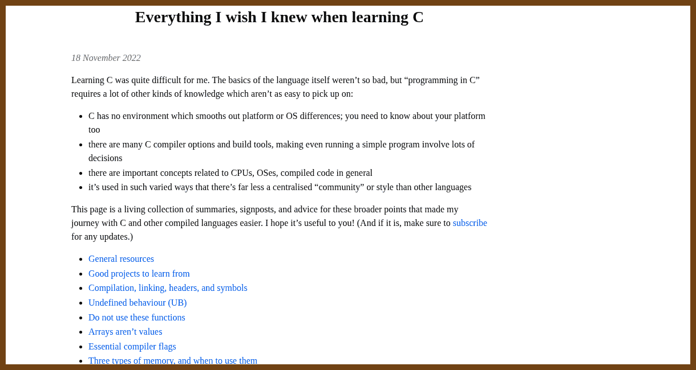
>
> Everything I wish I knew when learning C is a broad guide covering General resources, Good projects to learn from, Compilation, linking, headers, and symbols, Undefined behaviour (UB). Later sections move through Do not use these functions, Arrays aren’t values, Essential compiler flags, Three types of memory, and when to use them, with the page serving as a practical reference rather than a single-idea essay.
>
> Feed: [Subscribe](https://tmewett.com/feed.xml)

2025-07-27 [Intrusive Data Structures](https://tivrfoa.github.io/rust/data-structure/2025/07/27/intrusive-data-structures.html) { tivrfoa.github.io } 

> Intrusive Data Structures is a broad guide covering From: Crate intrusive_collections, From: Data Structures in the Linux Kernel - Doubly linked list, Gemini Definition, Who is responsible for freeing the object?. Later sections move through From: Boost - Intrusive and non-intrusive containers, From mgaunard, Gemini:, C, with the page serving as a practical reference rather than a single-idea essay.
>
> Feed: [Subscribe](https://tivrfoa.github.io/feed.xml)

2026-06-05 [GitHub - sysprog21/intrusive-ds: A collection of intrusive data-structures for C](https://github.com/sysprog21/intrusive-ds) { github.com }

> 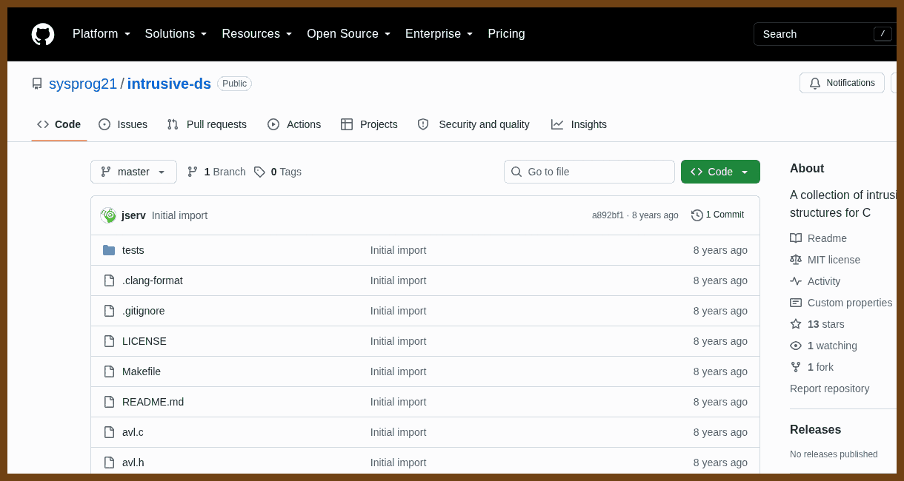
>
> A collection of intrusive data-structures for C. Contribute to sysprog21/intrusive-ds development by creating an account on GitHub.

2026-07-11 [C Strings: A 50-Year Mistake](https://longtran2904.substack.com/p/c-strings-a-50-year-mistake) { longtran2904.substack.com }

> 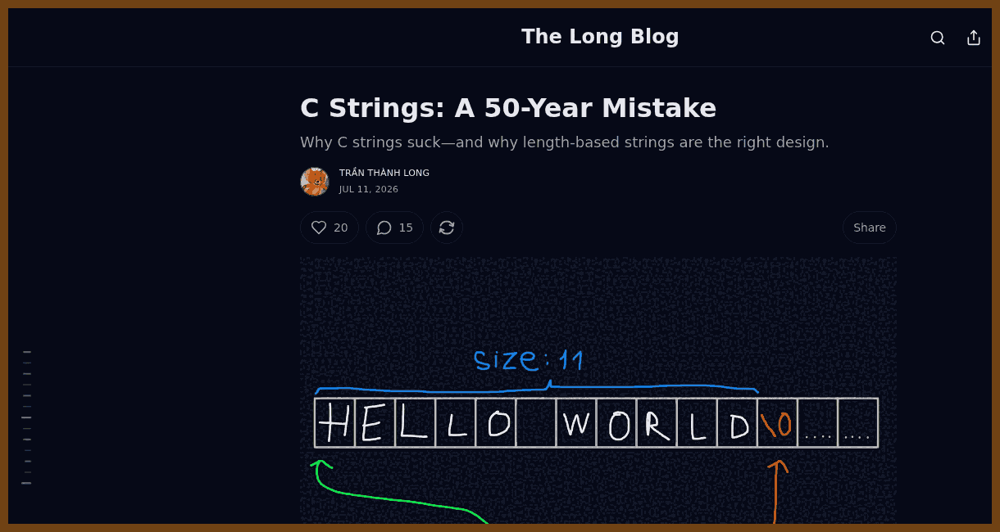
>
> Why C strings suck—and why length-based strings are the right design.
>
> RSS: [Subscribe](https://longtran2904.substack.com/feed)

2026-07-12 [a bunch of stuff i used to not know about K&R C](https://sebsite.pw/w/20260712-kandr.html) { sebsite.pw }

> 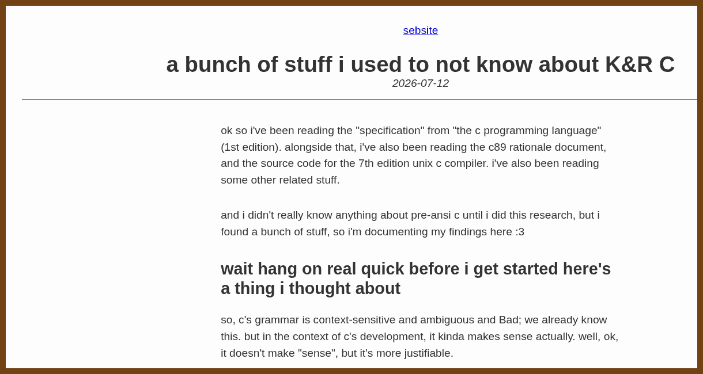
>
> a bunch of stuff i used to not know about K&R C is a broad guide covering wait hang on real quick before i get started here's a thing i thought about, void is an ansi invention, apparently, different floating point types, some more interesting stuff with type specifiers. Later sections move through different behavior for integer promotion, unsigned integer constants, 8 and 9 were valid digits in octal constants, missing escape sequences, with the page serving as a practical reference rather than a single-idea essay.
>
> Feed: [Subscribe](https://sebsite.pw/feed.xml)

2026-07-21 [Branch‑Avoidant Programming](https://easylang.online/blog/branchless) { easylang.online }

> 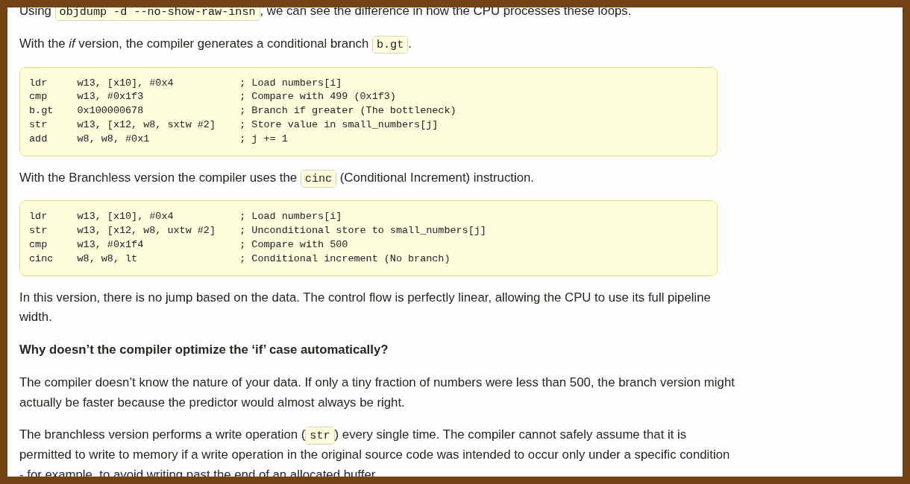
>
> A straightforward implementation in C looks like this: If the numbers are randomly distributed, the result of the ‘if’ condition becomes unpredictable for the CPU’s branch predictor. the authors can avoid this problem by using a branchless approach: While this version introduces an unconditional store (writing to memory even if the condition isn’t met), its cost is typically far lower than the heavy penalty of a branch misprediction. *Performance Comparison** To get meaningful results, the authors run both routines for 1000 iterations using 100,000 random numbers.

2026-07-22 [Everyone Should Know SIMD](https://mitchellh.com/writing/everyone-should-know-simd) { mitchellh.com }

> 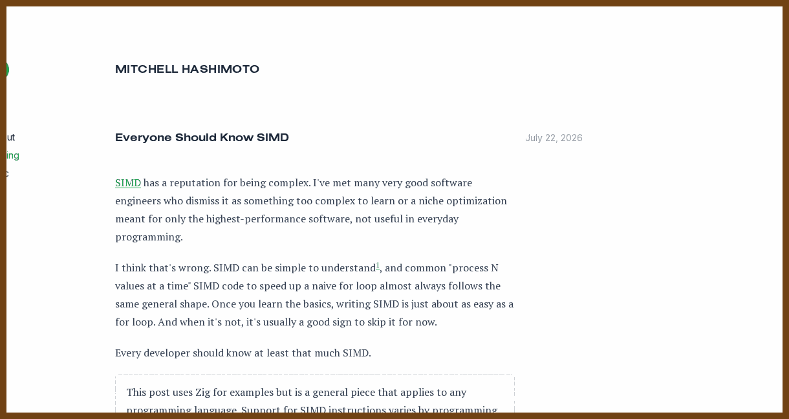
>
> Everyone Should Know SIMD is a broad guide covering Background: What Is SIMD?, The Common Shape, A Real Example, Step 1: Broadcast Constants. Later sections move through Step 2: Loop One Vector at a Time, Step 3: Perform the SIMD Operation, Step 4: Reduce the Vector Result, Step 5: Finish with the Scalar Tail, with the page serving as a practical reference rather than a single-idea essay.
>
> RSS: [Subscribe](https://mitchellh.com/feed.xml)

2026-08-03 [Reliability Lessons From SQLite - Richard Hipp | SSW 2026](https://www.youtube.com/watch?v=V_qzqY1bb7I) { www.youtube.com }

> 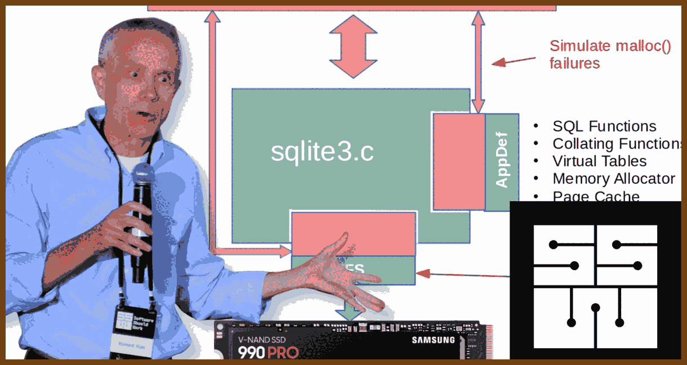
>
> Abstract: SQLite is a C-language library that implements a self-contained, in-process relational database engine supporting full-featured SQL, an advanced query planner, and ACID transactions. By many estimates, SQLite is the most widely used software library in the world today.
>
> Over its 26-year history, SQLite has gained a reputation as software that "just works". This talk goes over the design choices and development practices that have, at least in the opinion of the lead developer, resulted in that reputation.

2026-08-20 [A faster way to calculate the day-of-the-week](https://www.benjoffe.com/fast-day-of-week) { www.benjoffe.com }

> 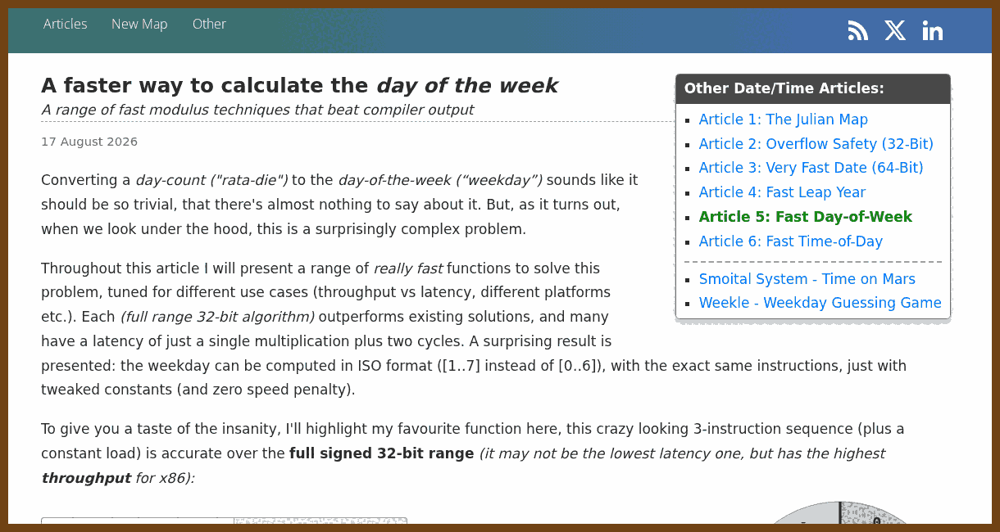
>
> A range of fast modulus techniques that beat compiler output
>
> RSS: [Subscribe](https://www.benjoffe.com/rss.xml)

## The EAR of AI

2026-08-17 [AI;DR (AI; Didn’t Read)](https://www.rickmanelius.com/p/aidr-ai-didnt-read) { www.rickmanelius.com }

> 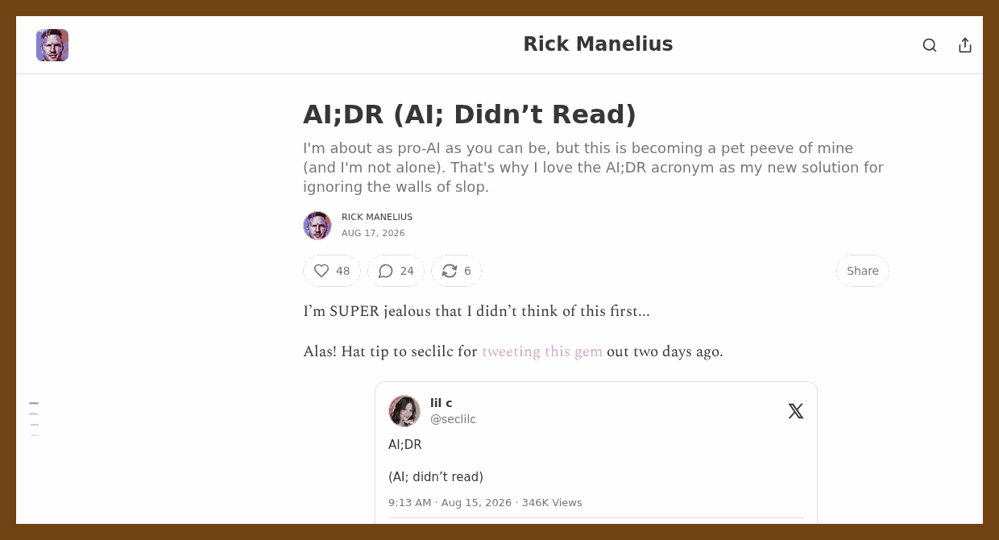
>
> The author is about as pro-AI as you can be, but this is becoming a pet peeve of the author's (and the author is not alone). That's why the author love the AI;DR acronym as the author's new solution for ignoring the walls of slop.
>
> RSS: [Subscribe](https://www.rickmanelius.com/feed)

2026-08-23 [I Built an AI Companion That Actually Plays With You](https://pantel.is/projects/ai-gaming-companion/) { pantel.is }

> 
>
> How Varkos was built: a low-latency AI companion that plays Skyrim with you, follows complex instructions and evolves through shared experiences.

2026-09-17 [How To Write With An LLM](https://sockpuppet.org/blog/2026/09/17/how-to-write-with-an-llm/) { sockpuppet.org }

> 
>
> Two rules keep an LLM from pasteurizing your writing: never take a word it suggests, and never let it encourage you. Then hand it all the tedious work.
>
> RSS: [Subscribe](https://sockpuppet.org/index.xml)

2026-09-18 [GitHub - arnegiacomo/fugleramme: E-ink bird frame for Raspberry Pi - real-time bird detection by audio, fully local AI, rendered as real, hand-cut 1800s bird illustrations.](https://github.com/arnegiacomo/fugleramme) { github.com }

> 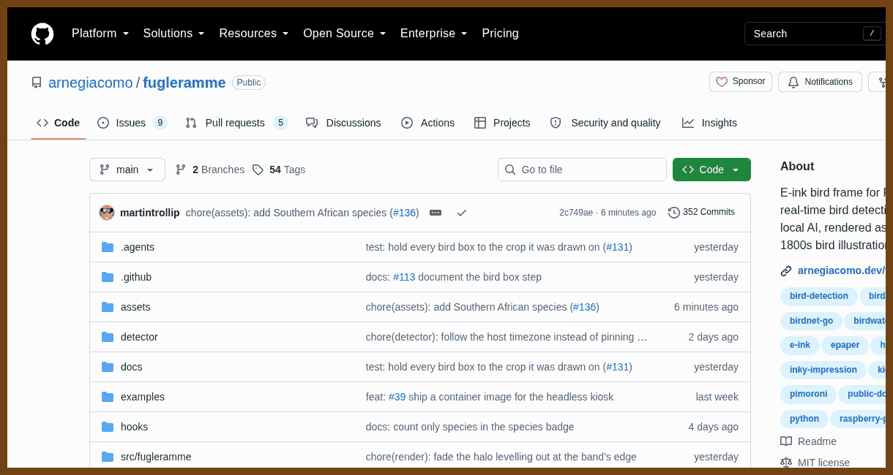
>
> 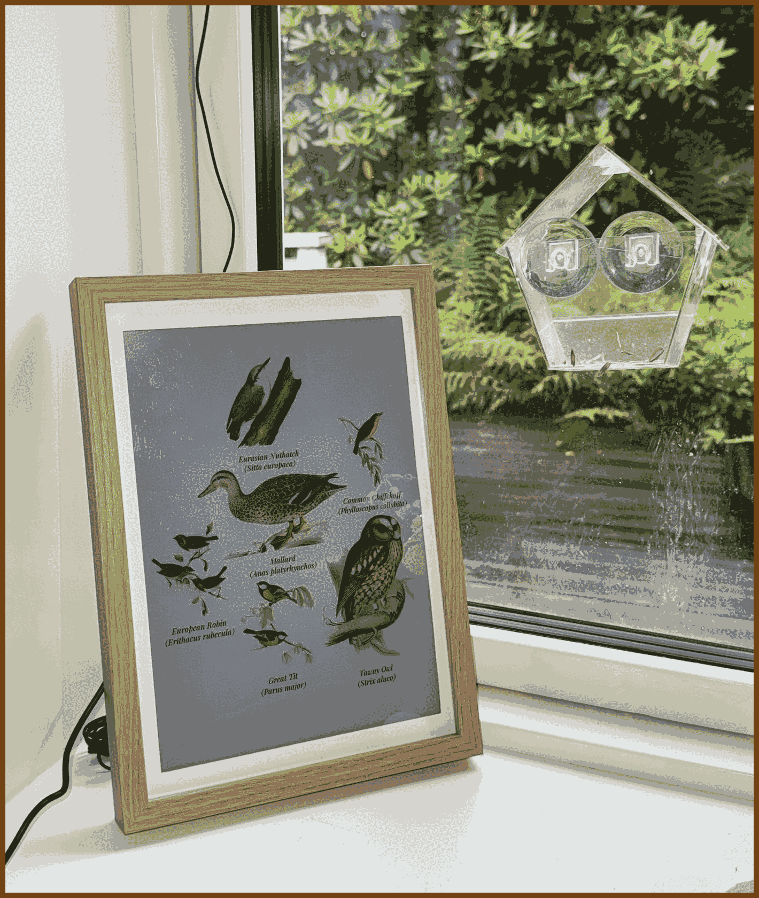
>
> E-ink bird frame for Raspberry Pi - real-time bird detection by audio, fully local AI, rendered as real, hand-cut 1800s bird illustrations. - arnegiacomo/fugleramme

2026-08-30 [English ↔ Claudish — the over-engineered translator](https://programasweights.com/claudish) { programasweights.com }

> 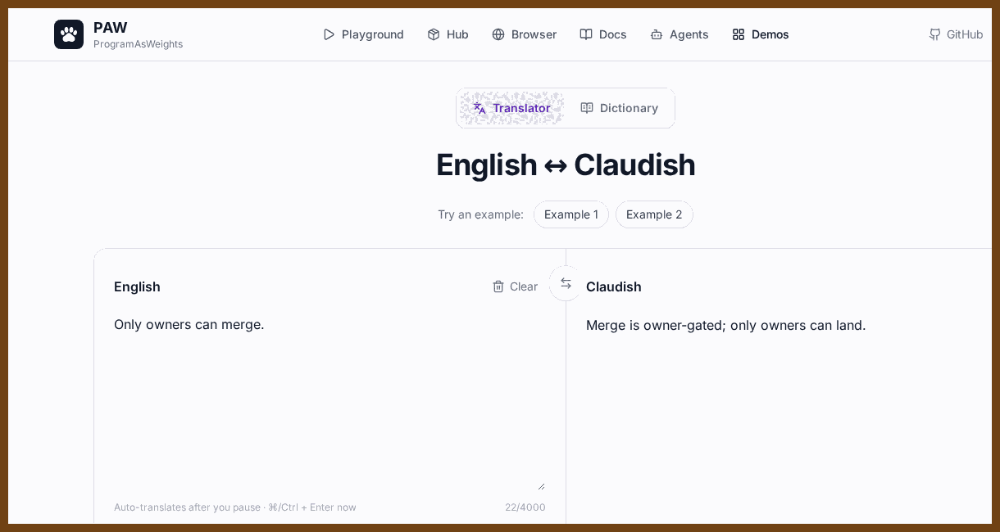
>
> A bidirectional English and Claudish translator powered by compiled 0.6B neural programs.


## Usual ML

2024-01-22 [Autoencoder by Hand ✍️](https://www.byhand.ai/p/13-can-you-calculate-an-autoencoder) { www.byhand.ai }

> 
>
> Autoencoder by Hand ✍️ is a broad guide covering Network Architecture, Setup, Encoder, This post is for paid subscribers.
>
> RSS: [Subscribe](https://www.byhand.ai/feed)

2026-04-01 [Local, CPU-Friendly, High-Quality TTS (Text-to-Speech) with Kokoro](https://ariya.io/2026/03/local-cpu-friendly-high-quality-tts-text-to-speech-with-kokoro/) { ariya.io }

> 
>
> Just a few years ago, realistic local speech generation seemed unimaginable. Today, its quality is exceptional and, crucially, it delivers these results without compromising privacy.
>
> RSS: [Subscribe](https://ariya.io/index.xml)

2026-07-10 [GitHub - sandrohanea/whisper.net: Whisper.net. Speech to text made simple using Whisper Models](https://github.com/sandrohanea/whisper.net) { github.com }

> 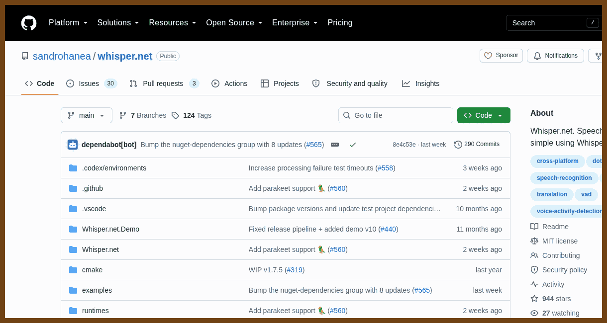
>
> Whisper.net. Speech to text made simple using Whisper Models - sandrohanea/whisper.net


## How the things work

2026-06-01 [What do Visa and Mastercard do? An intro to card networks](https://tautology.town/2026/06/01/card-networks.html) { tautology.town }

> 
>
> tautology.town is a blog that contains tautologies.
>
> RSS: [Subscribe](https://tautology.town/feed.xml)

2026-06-20 [Data Compression Explained](https://mattmahoney.net/dc/dce.html) { mattmahoney.net } 

> 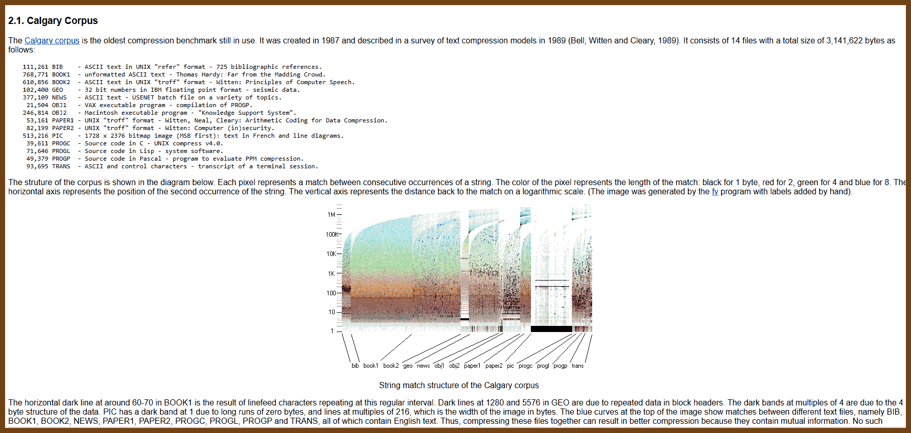
>
> Data Compression Explained is a broad guide covering About this Book, 1. Information Theory, 2. Benchmarks, 3. Coding. Later sections move through 4. Modeling, 5. Transforms, 6. Lossy Compression, Conclusion, with the page serving as a practical reference rather than a single-idea essay.

2026-07-04 [Fintech Engineering Handbook](https://w.pitula.me/fintech-engineering-handbook/) { w.pitula.me } 

> 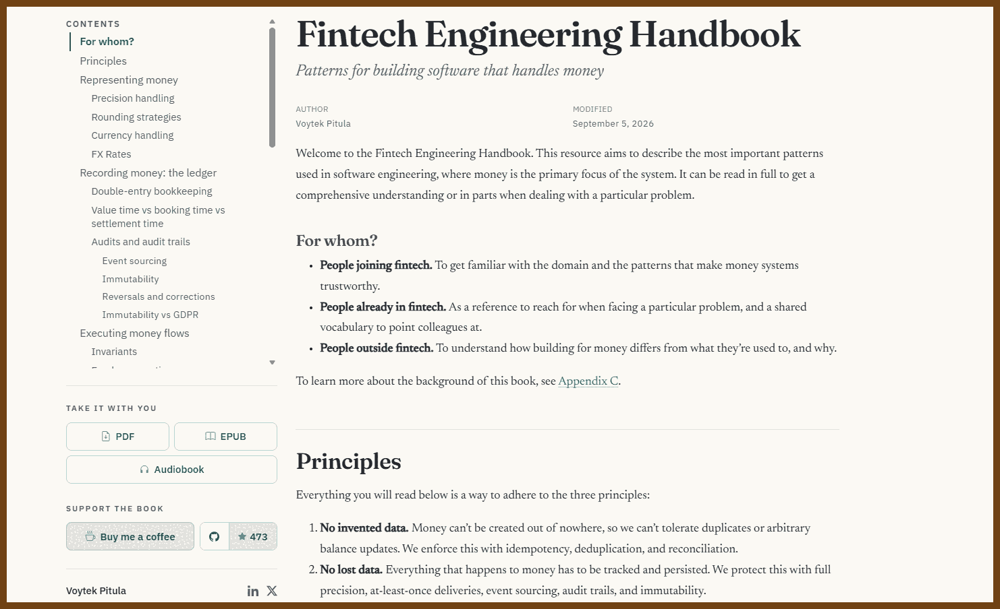
>
> Fintech Engineering Handbook is a broad guide covering Principles, Representing money, Recording money: the ledger, Executing money flows. Later sections move through The external world, Controls and access, Testing, 
> Know your domain, with the page serving as a practical reference rather than a single-idea essay.

2026-07-19 [Beyond Happy Path Engineering: Time](https://blog.gaborkoos.com/posts/2026-07-19-Beyond-Happy-Path-Engineering-Time/) { blog.gaborkoos.com }

> 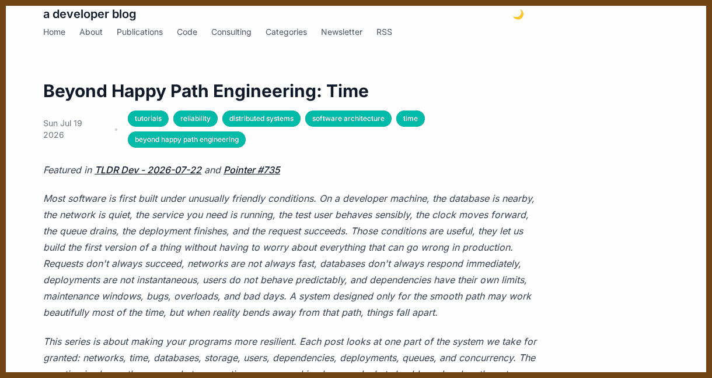
>
> Time is where application code meets uncertainty: clock skew, wall-clock corrections, ambiguous ordering, late schedulers, and business-calendar boundaries.
>
> RSS: [Subscribe](https://blog.gaborkoos.com/feed.xml)

2026-07-24 [Systems and Delays](https://martin.janiczek.cz/2026/07/24/systems-and-delays.html) { martin.janiczek.cz }

> 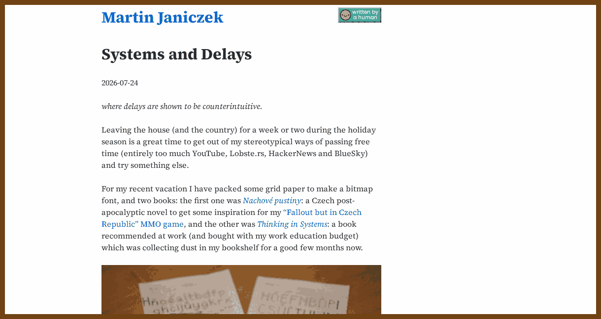
>
> where delays are shown to be counterintuitive.
>
> Feed: [Subscribe](https://martin.janiczek.cz/feed)


## 🌈 Recreational Programming 

2026-07-01 [What To Learn To Be A Real Time Graphics Programmer](https://blog.demofox.org/2026/07/01/what-to-learn-to-be-a-graphics-programmer/) { blog.demofox.org }

> 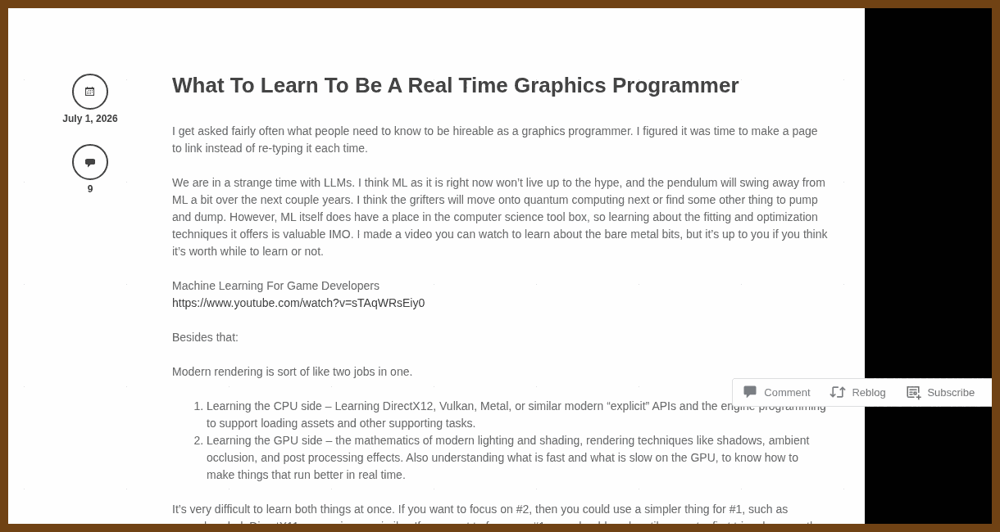
>
> The author get asked fairly often what people need to know to be hireable as a graphics programmer. the author figured it was time to make a page to link instead of re-typing it each time. the authors are in a strange time w…
>
> RSS: [Subscribe](https://blog.demofox.org/feed/)

2026-06-09 [Catlantean 3D - Making Graphics Like It's 1993](https://staniks.github.io/articles/catlantean-3d-blog-1) { staniks.github.io }

> 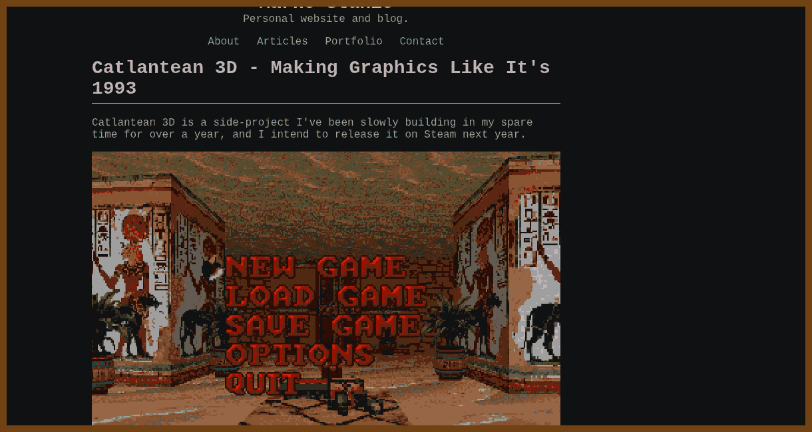
>
> A deep dive into the asset creation pipeline for Catlantean 3D.
>
> RSS: [Subscribe](https://staniks.github.io/feed)

2026-06-30 [Announcing Box3D](https://box2d.org/posts/2026/06/announcing-box3d/) { box2d.org }

> 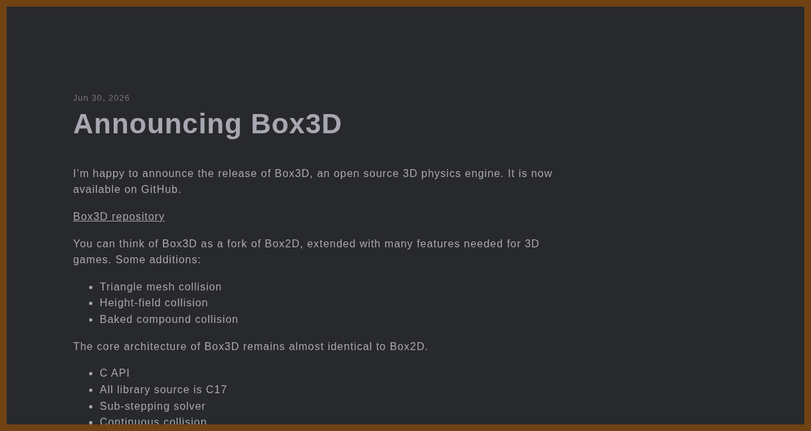
>
> The author is happy to announce the release of Box3D, an open source 3D physics engine. It is now available on GitHub. Box3D repository You can think of Box3D as a fork of Box2D, extended with many features needed for 3D games. Some additions: Triangle mesh collision Height-field collision Baked compound collision The core architecture of Box3D remains almost identical to Box2D. C API All library source is C17 Sub-stepping solver Continuous collision Graph coloring for large islands Wide SIMD contact solver Multi-threading hooks Optional internal scheduler Large world support with doubles for position Cross platform determinism Recording and replay If you want to see Box3D in action, watch this video:
>
> RSS: [Subscribe](https://box2d.org/index.xml)

2026-07-02 [Programming Praxis](https://programmingpraxis.com/) { programmingpraxis.com }

> 
>
> A collection of etudes, updated weekly, for the education and enjoyment of the savvy programmer
>
> RSS: [Subscribe](https://programmingpraxis.com/feed/)

2026-07-02 [Programming by Doing](https://programmingbydoing.com/) { programmingbydoing.com }

> 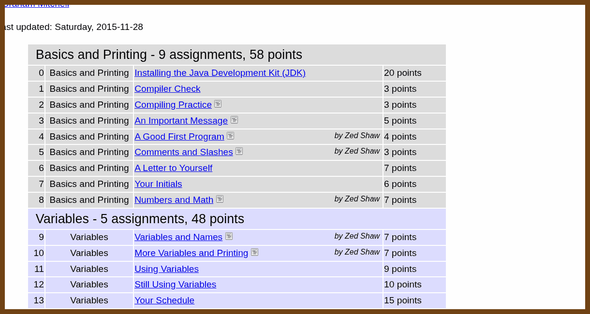
>
> If you are having trouble figuring out how to do these assignments without help, then the author's book with videos “Learn Java the Hard Way” will explain things a lot better. (Especially if you have never coded before!) Or if you have finished most of these assignments and are ready for the object-oriented side of Java, “Learn Object-Oriented Java the Hard Way” is the book for you! If you've ever tried to teach yourself programming and couldn't quite get going, then these assignments are for you.

2026-07-02 [1000_Projects](https://github.com/vicky002/1000_Projects) { github.com }

> 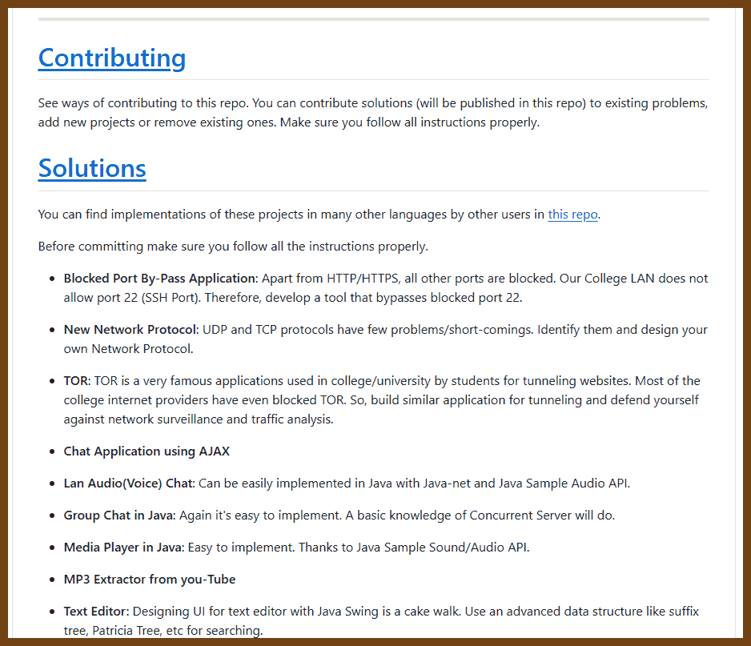

2026-05-29 [Let's compile Quake like it's 1997!](https://fabiensanglard.net/compile_like_1997/) { fabiensanglard.net }

> 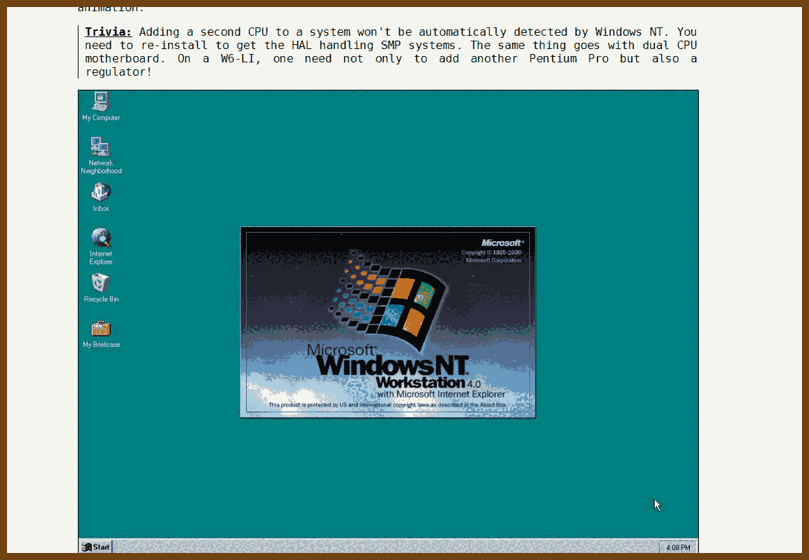
>
> 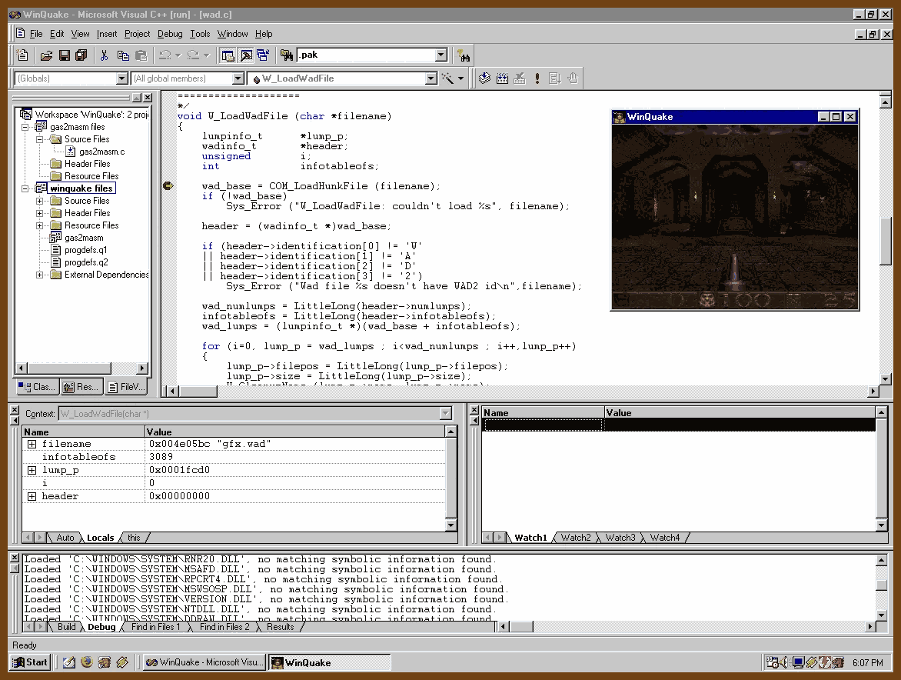
>
>
> The first batches of *Quake* executables, `quake.exe` and `vquake.exe` were programmed on HP 712-60 running NeXT and cross-compiled with DJGPP running on a DEC Alpha server 2100A. the authors moved to Intergraph hardware running Windows NT right after shipping Quake. \- John Carmack[\[1\]](https://fabiensanglard.net/compile_like_1997/#footnote_1) The next versions of *Quake*, `winquake.exe`, `glquake.exe`, and *QuakeWorld* (`qwcl.exe` and `qwsv.exe`) were all developed and compiled on Windows NT with Visual C++ 4.X.
>
> RSS: [Subscribe](https://fabiensanglard.net/rss.xml)

2017-09-30 [Text Editor: Data Structures](https://www.averylaird.com/programming/the%20text%20editor/2017/09/30/the-piece-table.html?utm_campaign=issue-289&utm_medium=website&utm_source=betterdev.link) { www.averylaird.com }

> 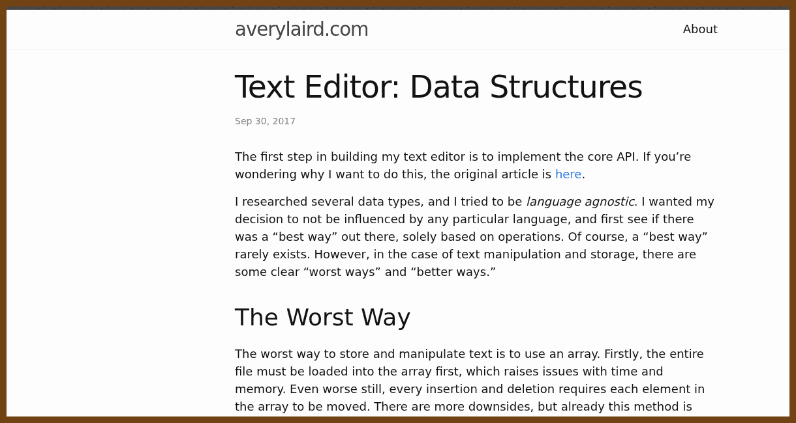
>
> The first step in building the author's text editor is to implement the core API. If you’re wondering why the author want to do this, the original article is here.
>
> Feed: [Subscribe](https://www.averylaird.com/feed.xml)

2026-06-05 [data structures in practice](https://www.data-structures-in-practice.com/) { www.data-structures-in-practice.com }

> 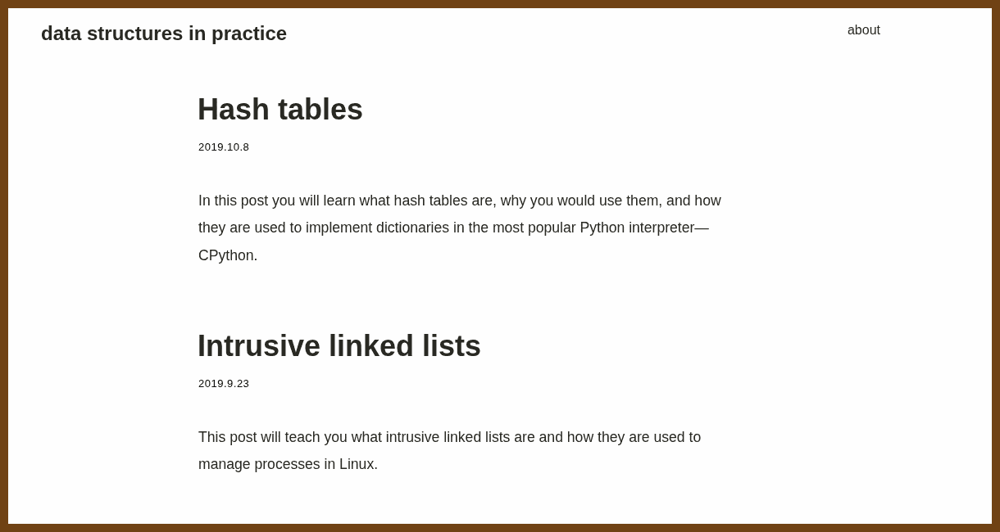
>
> Learn about data structures and how they are used in open source projects.
>
> RSS: [Subscribe](https://www.data-structures-in-practice.com/index.xml)


## Projects

2026-07-26 [Zig by Example](https://zigbyexample.neocities.org/) { zigbyexample.neocities.org }

> 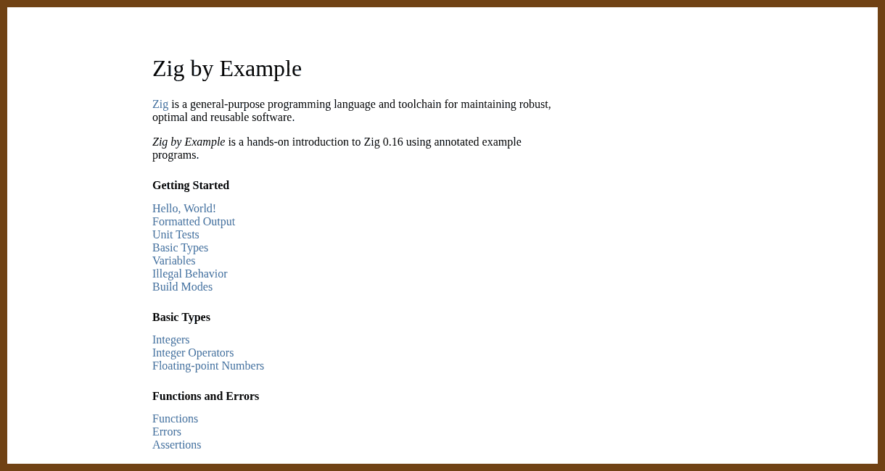
>
> Zig by Example is a broad guide covering Getting Started, Basic Types, Functions and Errors, Control Flow. Later sections move through Compound Types, Standard Library, Command-line Programs, Async/Await and I/O, with the page serving as a practical reference rather than a single-idea essay.

2026-07-19 [transcribe.cpp](https://workshop.cjpais.com/projects/transcribe-cpp) { workshop.cjpais.com }

> 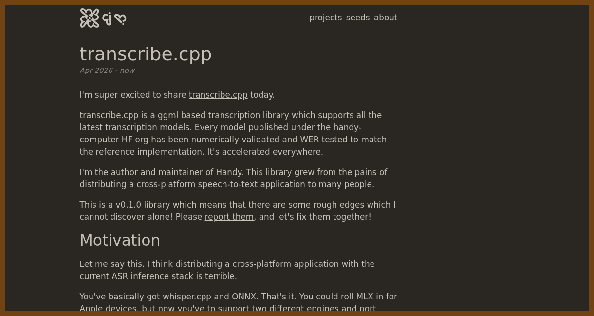
>
> A place to play around with technology and make it easy and fun

2026-07-30 [CheapFoodMap — Find meals under $10 across the US](https://cheapfoodmap.com/) { cheapfoodmap.com }

> 
>
> Crowdsourced map of meals under $10 across the them. Real people, real prices. Vote, comment, share finds.

2026-08-03 [handwritten.blog — blogs, but handwritten](https://handwritten.blog/) { handwritten.blog }

> 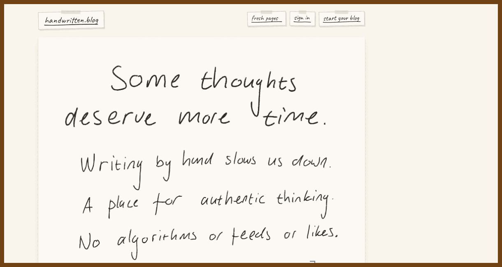
>
> Some thoughts deserve more time. Writing by hand slows them down. A place for authentic thinking. No algorithms or feeds or likes. Just your pages, published as…
>
> RSS: [Subscribe](https://handwritten.blog/feed.xml)

2026-08-12 [GitHub - liquidslr/system-design-notes: Notes of the book System Desgin Interview - An Insider's Guide](https://github.com/liquidslr/system-design-notes) { github.com }

> 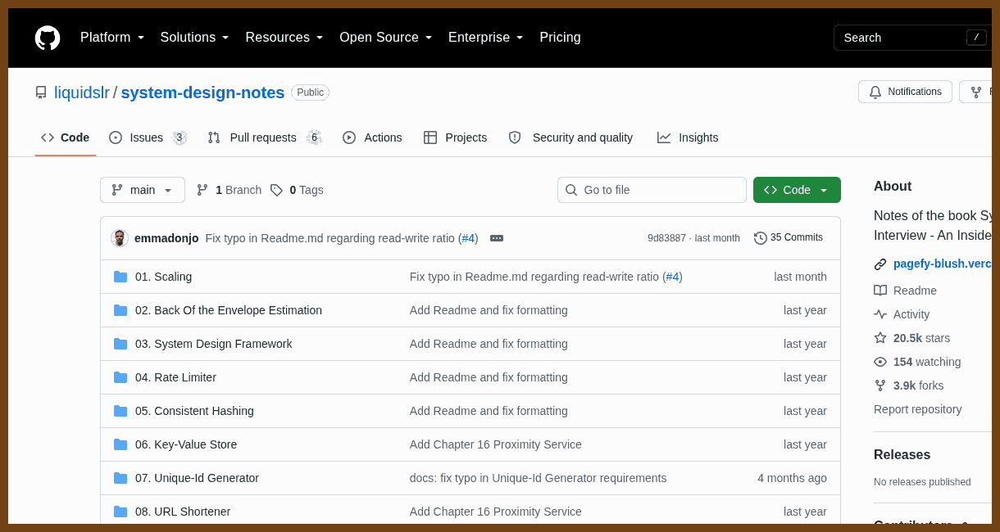
>
> Notes of the book System Desgin Interview - An Insider's Guide - liquidslr/system-design-notes

2026-08-17 [Desktop background colors, by operating system](https://desktopcolors.com/) { desktopcolors.com }

> 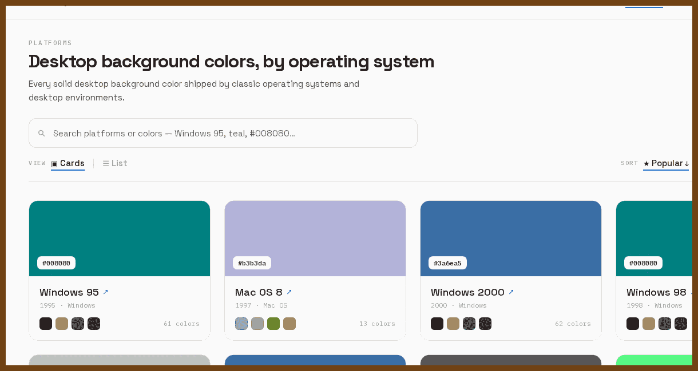
>
> Every solid desktop background color shipped by classic operating systems.


## Retro / Fun

2026-07-13 [densha — study Japanese in a living voxel Tokyo](https://jivx.com/densha) { jivx.com }

> 
>
> Ride the Yamanote line through a voxel Tokyo synced to Japan's real clock, weather, and seasons. A lofi bed plays while N5 sentences are read aloud and drift by as subtitles — an ambient Japanese study room you just press play into.

2026-08-06 [How to Make a Nintendo 64 Game in 2026](https://phoboslab.org/log/2026/08/xibalba64-making-of) { phoboslab.org }

> 
>
> How to Make a Nintendo 64 Game in 2026 is a broad guide covering The Engine, N64 Hardware and Platform Library, Dev Environment, The Game. Later sections move through Rendering, Sound & Music, Publishing & Sales, Resources, with the page serving as a practical reference rather than a single-idea essay.
>
> RSS: [Subscribe](https://phoboslab.org/log/feed)

2018-01-09 [The Vintage Beauty Of Soviet Control Rooms](https://designyoutrust.com/2018/01/vintage-beauty-soviet-control-rooms/) { designyoutrust.com }

> 
>
> Just for the pleasure, a selection of vintage control rooms dating back to the Soviet era! A beautiful collection of control rooms filled with large buttons and analog dials, long before the democratization of computers and screens. 
>
> RSS: [Subscribe](https://designyoutrust.com/feed/)

2026-06-29 [A History of Menus is a Menu of History](https://pudding.cool/2026/06/menu-story/) { pudding.cool }

> 
>
> What do America’s earliest restaurant menus teach them about America?
>
> RSS: [Subscribe](https://pudding.cool/rss.xml)

2026-08-09 [How I use LLMs to learn complex topics · Laurentiu Raducu](https://laurentiugabriel.github.io/blog/articles/how-i-use-llms-to-learn/) { laurentiugabriel.github.io }

> 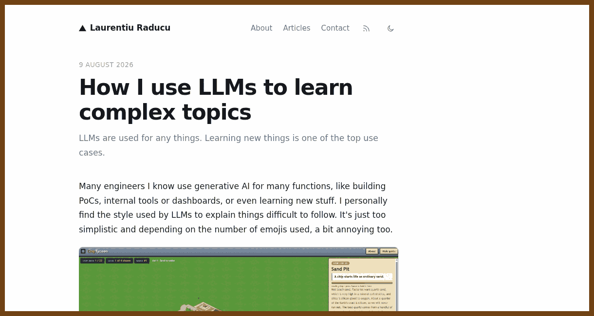
>
> LLMs are used for any things. Learning new things is one of the top use cases.
>
> RSS: [Subscribe](https://laurentiugabriel.github.io/blog/feed.xml)

2026-09-04 [Bespoke: A Programming Language for People Who Say Please](https://blog.hofstede.it/bespoke-a-programming-language-for-people-who-say-please/) { blog.hofstede.it }

> 
>
> Modern programming languages are full of violence, vulgar abbreviations, and naked imperatives. Bespoke is a statically typed alternative in which exceptions are regrettable circumstances, mutexes ...
>
> RSS: [Subscribe](https://blog.hofstede.it/feeds/all.rss.xml)Control Flow by Deliberation
>
> An `if` statement is an accusation: *this condition is true, now do as I say*. Bespoke instead places a hypothetical question before the court.
>
> ```
> Should it please the court to consider whether carriageCount is strictly greater than 10,
>     Dear Output Console,
>     Kindly convey to the standard stream the Textual Passage "Capital progress, indeed!".
>     Thank you kindly.
> Or, should the contrary prove true,
>     Dear Output Console,
>     Kindly convey to the standard stream the Textual Passage "A modest showing, regrettably.".
>     Thank you kindly.
> Thus concludes the matter.
> ```
>
> 
>
> For a given truth value, the choice of branch is deterministic. The court is ceremonial and cannot be lobbied by either side.
>
> Closings follow a register: ordinary requests may use any approved expression of thanks, including `Much obliged` and `Ever grateful`; `Cheers` is accepted only in local scopes, while public library APIs require `Yours faithfully`. Compiler flags can tighten this under `--deference=white-tie`. Reports of misfortune and invitations to retire have their own approved valedictions.
>
> Loops are permitted, though repeatedly asking the computer to do the same thing can try its patience. Returning `carriageCount` to 0 requires another apology; the loop then explicitly recognises the burden of repetition:
>
> ```
> Dear Compiler,
> If it causes you no undue hardship, might we trouble you to update the value
> of carriageCount to 0?
> Much obliged.
> 
> Dear Compiler,
> Whilst it remains Quite True that carriageCount is strictly less than 3,
> might we impose upon your patience to execute the following:
>     Dear Output Console,
>     Pray convey to the standard stream the value of carriageCount.
>     Thank you.
> 
>     Dear Compiler,
>     Would you mind terribly advancing carriageCount by the value 1?
>     Cheers.
> We are deeply indebted for your forbearance.
> ```
>
> Functions as Diplomatic Proposals
>
> A function does not seize control and return a value. It proposes a small, bounded collaboration:
>
> ```
> To Whom It May Concern,
> I hereby propose a diplomatic procedure designated calculateFare,
> accepting as input:
>     An Integer Number known as distanceInMiles,
>     A Truth Value known as isFirstClass,
> and ultimately returning An Integer Number.
> 
> May we respectfully undertake the following:
>     Should it please the court to consider whether isFirstClass is Quite True,
>         I humbly submit that the appropriate return value is distanceInMiles multiplied by 4.
>     Or, should the contrary prove true,
>         I humbly submit that the appropriate return value is distanceInMiles multiplied by 2.
>     Thus concludes the matter.
> Thus concluded.
> Yours faithfully.
> ```
>
> 
>
> The verbosity has a practical advantage. Nobody has ever opened a Bespoke code review and complained that the function’s contract was unclear. They have complained that it was twelve pages long, but that is a separate metric.
>
> Regrettable Circumstances
>
> The phrase *throw an exception* is needlessly aggressive. In Bespoke, a component reports an awkward predicament and humbly raises it for gracious consideration:
>
> ```
> Dear Host Environment,
> I am dreadfully sorry to report an awkward predicament:
> A Regrettable Circumstance designated LedgerMissingMisfortune has arisen,
> specifically: "The parchment could not be located in the archives."
> Might I humbly raise this for your gracious consideration?
> With profound regret.
> ```
>
> 
>
> Nor does another component *catch* the poor thing. Contingency handling is a discreet attempt followed by a compassionate reception:
>
> ```
> May we venture to attempt the following, with the greatest discretion:
>     Dear Host Environment,
>     Kindly inspect the ledger at "parchments/annual_audit.csv".
>     Thank you kindly.
> Should our modest enterprise regrettably miscarry,
> and A Regrettable Circumstance designated LedgerMissingMisfortune be raised:
>     Dear Output Console,
>     Pray whisper to the standard error:
>         "A dreadful pity; we shall brew fresh tea instead.".
>     Much obliged.
> In any eventual outcome, whether triumph or tragedy:
>     Dear Host Environment,
>     Would you be so exceptionally good as to restore the desk to an orderly state?
>     Yours faithfully.
> Thus concludes our contingency.
> ```
>
> 
>
> This is structurally equivalent to `try`, `catch`, and `finally`, but it gives the filesystem room to retain its dignity.

2019-08-08 [PlayStation Architecture | A Practical Analysis](https://www.copetti.org/writings/consoles/playstation/) { www.copetti.org }

> 
>
> An in-depth analysis that explains how this console works internally
>
> RSS: [Subscribe](https://www.copetti.org/index.xml)


2026-06-17 [KirklandRoundabouts](https://kirklandroundabouts.com/) { kirklandroundabouts.com }

> 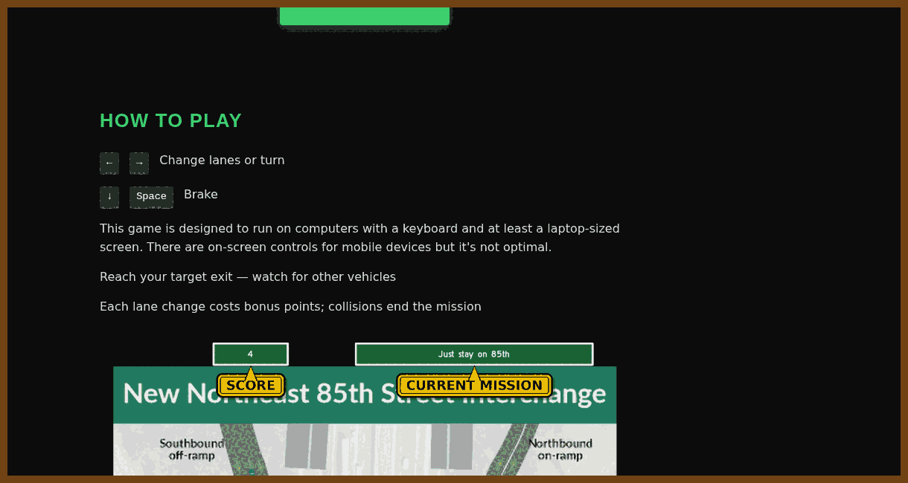
>
> Navigate the chaos of Kirkland's real roundabouts. A free browser game.

2026-07-13 [Tiny Emulators](https://floooh.github.io/tiny8bit-preview/index.html) { floooh.github.io }

> 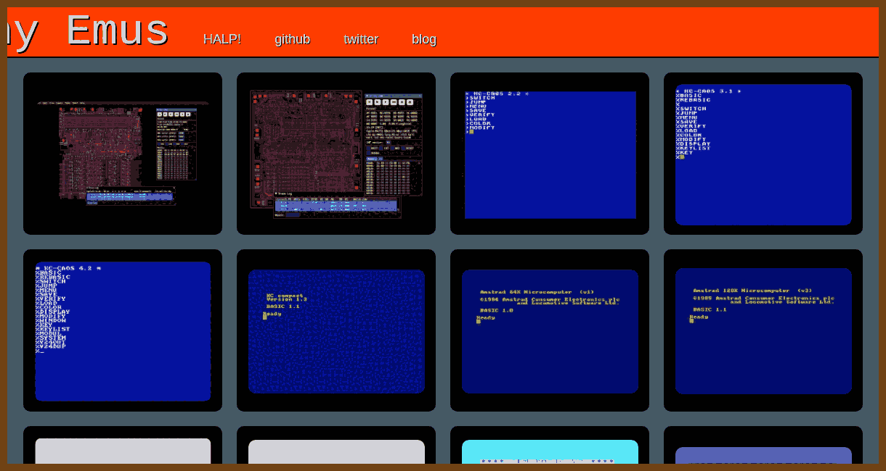
>
> RSS: [Subscribe](https://floooh.github.io/feed)


## Dev Tools

2026-09-14 [GitHub - rnwood/smtp4dev: smtp4dev - the fake smtp email server for development and testing](https://github.com/rnwood/smtp4dev) { github.com }

> 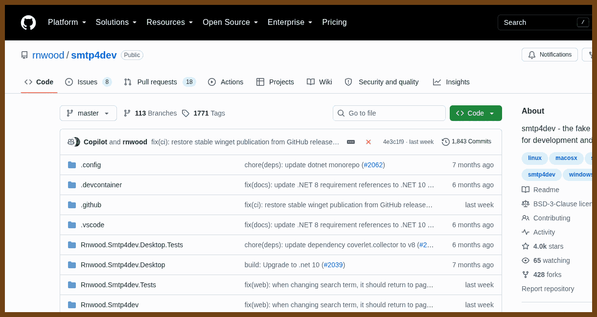
>
> smtp4dev - the fake smtp email server for development and testing - rnwood/smtp4dev


## Web Dev

2018-03-01 [How to Insert Text Into Textarea at Cursor Fast](https://kubyshkin.name/posts/insert-text-into-textarea-at-cursor-position/) { kubyshkin.name }

> 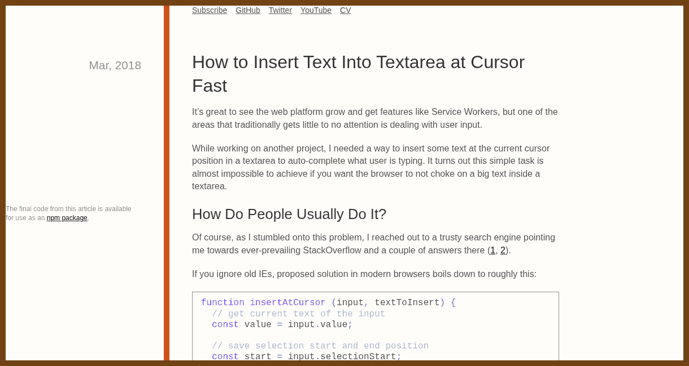
>
> How to Insert Text Into Textarea at Cursor Fast is a broad guide covering How Do People Usually Do It?, What Else Can We Do?, IE 11.
>
> And it works just  fine ;)
>
> RSS: [Subscribe](https://kubyshkin.name/rss.xml)

```js
function insertAtCursorIE11 (input, textToInsert) {
  const range = document.createRange();
  range.setStart(input, 0);
  range.setEnd(input, 0);
  range.insertNode(document.createTextNode(textToInsert));
}
```

2026-09-18 [Better Icon and Label Alignment](https://ishadeed.com/article/aligning-list-icons/) { ishadeed.com }

> 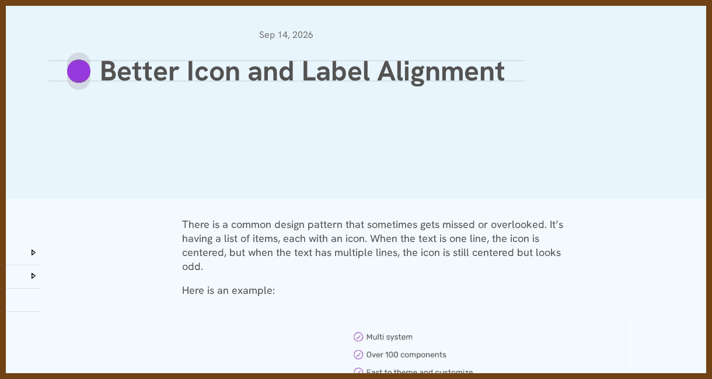
>
> Better Icon and Label Alignment is a broad guide covering Table of contents, The icon in the markup, Icon as a pseudo-element, Outro. Later sections move through The Layout Maestro, Join my mailing list, with the page serving as a practical reference rather than a single-idea essay.
>
> RSS: [Subscribe](https://ishadeed.com/feed.xml)

026-08-20 [HTML Can Do That](https://chrisburnell.com/html-can-do-that/) { chrisburnell.com }

> 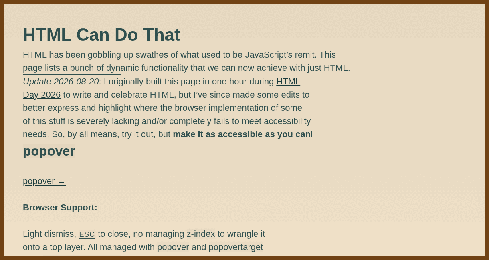
>
> HTML has been gobbling up swathes of what used to be JavaScript’s remit. This page lists a bunch of dynamic functionality that the authors can now achieve with just HTML.
>
> Feed: [Subscribe](https://chrisburnell.com/feed.xml)

2026-08-21 [HTMLcat — Compact notes on HTML, CSS, and JavaScript](https://htmlcat.net/) { htmlcat.net }

> 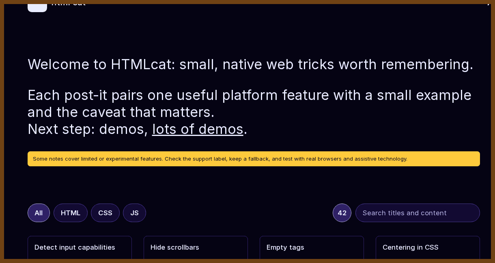
>
> A small, opinionated collection of compact notes about useful HTML, CSS, and JavaScript features.


## 🤫 Quick shell!

2021-01-07 [Using jq to format JSON on the clipboard](https://chris48s.github.io/blogmarks/posts/2021/jsontidy/) { chris48s.github.io }

> 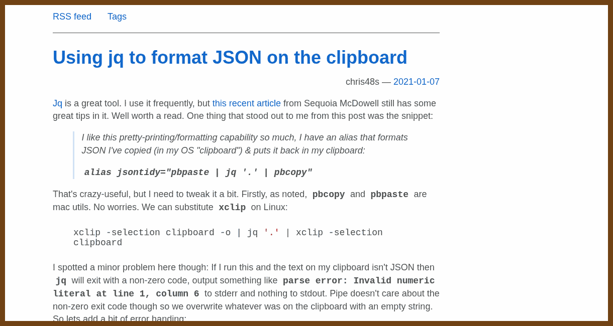
>
> Jq is a great tool. the author use it frequently, but this recent article from Sequoia McDowell still has some great tips in it. Well worth a read. One thing that stood out to the author from this post was the snippet
>
> RSS: [Subscribe](https://chris48s.github.io/blogmarks/rss.xml)

```sh
xclip -selection clipboard -o | jq '.' | xclip -selection clipboard
```

2026-04-16 [Telling a Computer to Do Things](https://will-keleher.com/posts/telling-your-computer-to-do-things/) { will-keleher.com }

> 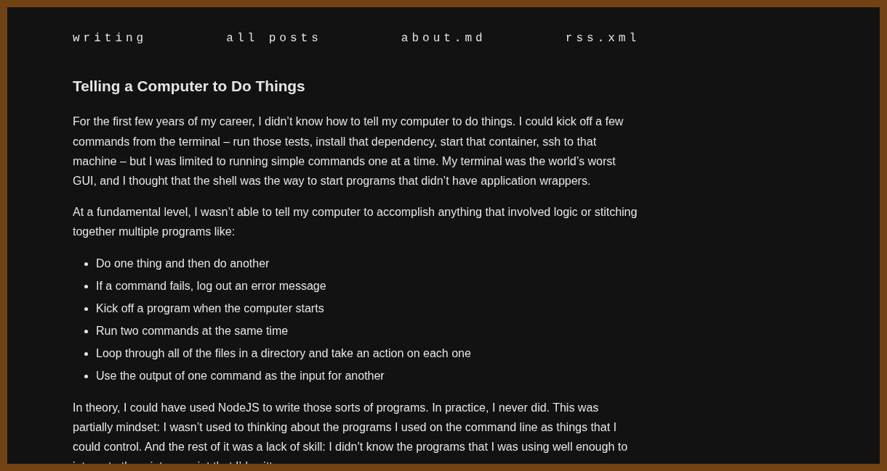
>
> If you don't know the shell, it's more difficult to tell a computer to do things.
>
> - If you know `fzf`, you can build quick utilities with interactive fuzzy-searching. (Example: `git checkout $(git branch --sort=-committerdate | fzf)` will let you fuzzy-choose a branch.)
> - If you know `tldr` or `eg`, you can pull up usage examples for any other command in this list
> - If you know `rsync`, you can copy changed files on to a faster remote server to run something heavy and slow
> - If you know `xargs`, you can build up commands incrementally and parallelize work
> - If you know `sed -i` or `ast-grep`, you can quickly rewrite complicated patterns across a bunch of files
> - If you know `direnv`, you can make sure the right environment variables are set for everyone who runs commands in a codebase.
> - If you know `duckdb`, you can write SQL to query CSV and JSON files locally as part of a larger script.
> - If you know `gh`, you can build scripts to check on your PRs and open up new PRs from the cli.
> - If you know `ngrok`, you can quickly serve a local port to test something out on a different machine.
>
> RSS: [Subscribe](https://will-keleher.com/feed.xml)


## Big Shell

2026-06-19 [A Practical Guide to SSH Tunnels: Local and Remote Port Forwarding | iximiuz Labs](https://labs.iximiuz.com/tutorials/ssh-tunnels) { labs.iximiuz.com }

> 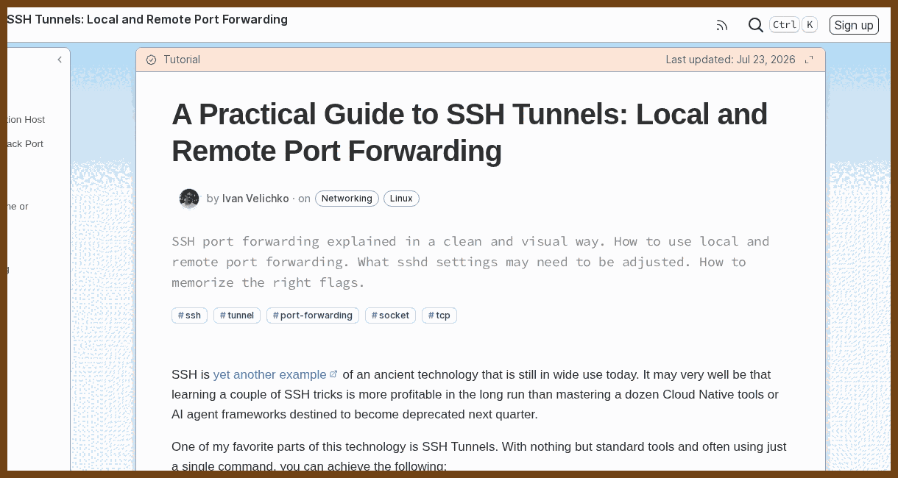
>
> SSH port forwarding explained in a clean and visual way. How to use local and remote port forwarding. What sshd settings may need to be adjusted. How to memorize the right flags.
>
> RSS: [Subscribe](https://labs.iximiuz.com/feed.rss)


## Inspiration

2026-03-04 [Acid Warrior by srtuss | Dittytoy](https://dittytoy.net/ditty/d2801bd785) { dittytoy.net } ⚠️

> 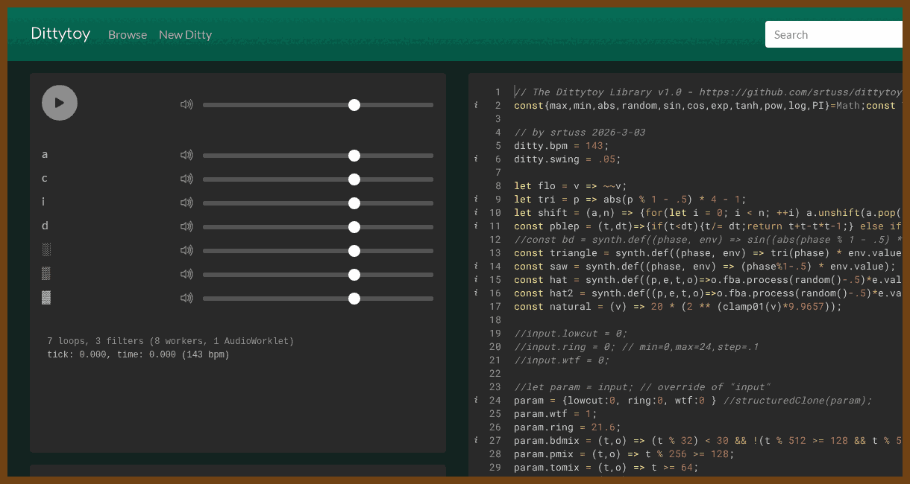
>
> Music, generated in JavaScript!


## Flashcards and Learning Japanese

2026-05-04 [A Love Letter to Flashcards | Lesley Lai](https://lesleylai.info/en/flashcards/) { lesleylai.info }

> 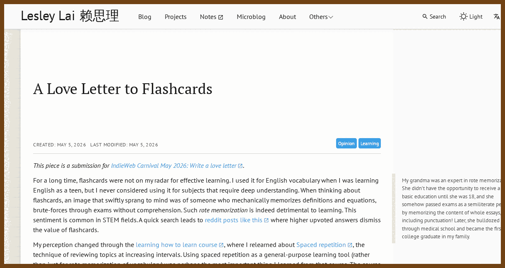
>
> A personal reflection on how spaced repetition and hand crafted flashcards helps me to keep understanding alive
>
> RSS: [Subscribe](https://lesleylai.info/rss.xml)

2026-05-21 [japanese verb conjugation the simple hard way - underreacted](https://underreacted.leaflet.pub/3mmevu6woys27) { underreacted.leaflet.pub }

> 
>
> japanese verbs are awesome. you can take the dictionary form of a verb (for example, "taberu", to eat) and turn it into many forms: taberu ("eat"): tabemasu…
>
> RSS: [Subscribe](https://underreacted.leaflet.pub/rss)


## Weird Projects

2026-06-01 [tools.simonwillison.net](https://tools.simonwillison.net/) { tools.simonwillison.net }

> 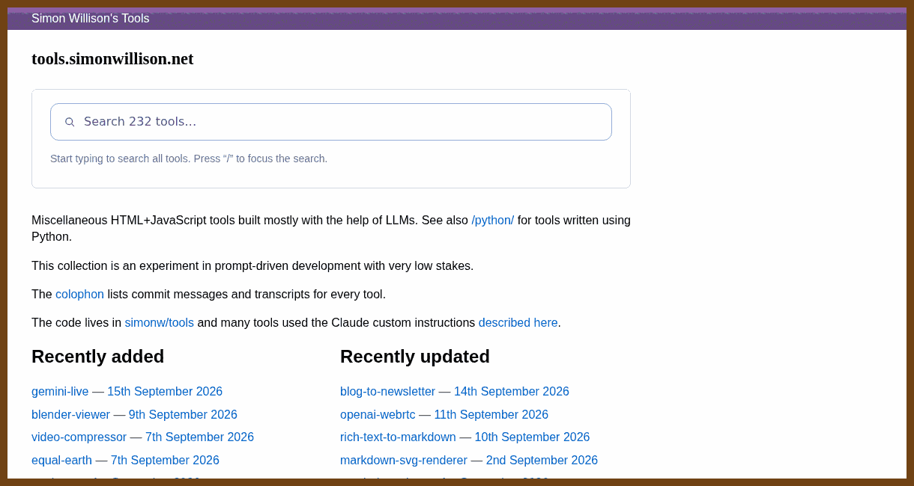
>
> tools.simonwillison.net is a broad guide covering Recently added, Recently updated, Settings.


## Some Pomera

2025-11-01 [PomeraにLinuxを入れてミニノートPCにすると楽しい（Obsidianとの連携メモ）｜koyasako](https://note.com/kysk_/n/n7bd9c5827925) { note.com }

> 
>
> ずっとミニノートPCがほしいと思っていた．Surface Laptopって好きだけどやっぱり重くて，ちょっとした出かけに持っていける小さいやつ，本当は電車の中で編集とかしたい．おそらく現状ではGPDが一番いいんだけど，サブノートにしては値段が結構厳しい（使うかどうかもわからないので）． そんな混迷の時代に颯爽と現れた（正確に言うとずっと昔からそこにいた）のがPomeraである．このポメラ，言わずもがなのノートPCというよりワードプロセッサで，基本的には文字を書く機能だけ存在しているのであるが，先人たちの知恵と努力により，なんとLinuxを起動できるのである．しかももともとのポメラの機能

2026-03-29 [Part 2: Converting Pomera DM250 to Linux and Creating a Slack Bridge](https://zenn.dev/iseebi_cs/articles/5f73db15c93346?locale=en) { zenn.dev }

> 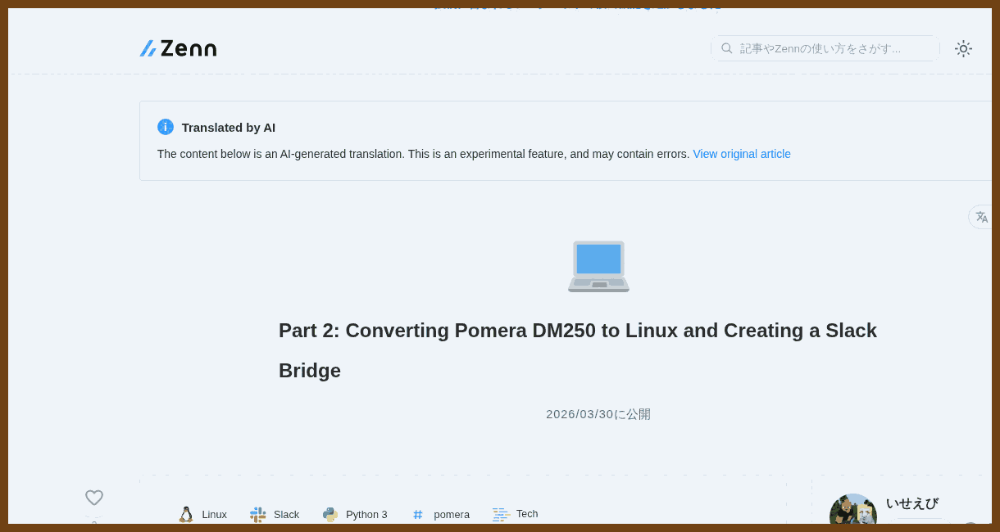
>
> Part 2: Converting Pomera DM250 to Linux and Creating a Slack Bridge is a broad guide covering About This Article, What I Wanted to Create, What Was Created, Rough Specifications of pomelax. Later sections move through What I Did, Troubleshooting: Common Problems on the Pomera Side, Troubleshooting: Common Slack Problems, Distribution and Current Status, with the page serving as a practical reference rather than a single-idea essay.
>
> RSS: [Subscribe](https://zenn.dev/feed)

2026-03-29 [Pomera DM250をLinux化してSlackブリッジを作成した話　前編](https://zenn.dev/iseebi_cs/articles/9f600f526f7091) { zenn.dev }

> 
>
> Pomera DM250をLinux化してSlackブリッジを作成した話　前編 is a broad guide covering この記事について, 最終的に作ったもの, 動機：なぜ２年半放置したポメラを今さら改造するのか, 準備段階. Later sections move through 1発同期できるような仕組みが欲しい、ものぐさ, クラウドストレージでの運用案, テキストをSlackに貼り付ければよくね？, with the page serving as a practical reference rather than a single-idea essay.
>
> RSS: [Subscribe](https://zenn.dev/feed)

2026-06-17 [DM30｜デジタルメモ「ポメラ」｜キングジム](https://www.kingjim.co.jp/pomera/dm30/) { www.kingjim.co.jp }

> 
>
> DM30｜デジタルメモ「ポメラ」｜キングジム is a broad guide covering 開閉時にキーフットが連動, 電子ペーパーディスプレイ搭載, 確かなキータッチを実現！, アルカリ乾電池で長時間駆動.

2026-06-18 [Debian on Pomera DM200/DM250](https://www.ekesete.net/log/?p=9504) { www.ekesete.net }

> 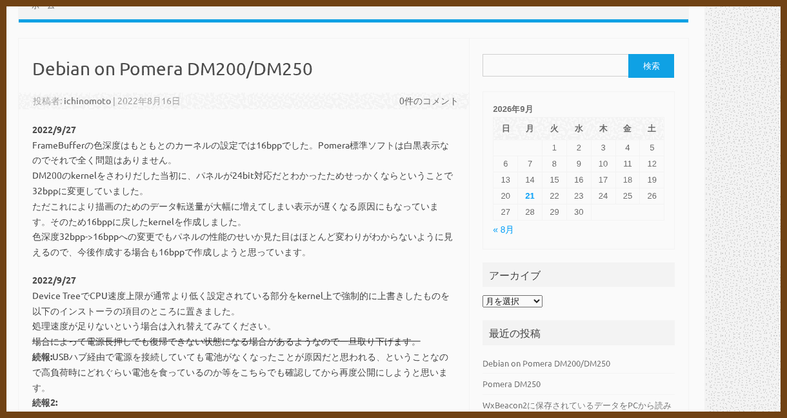
>
> Suspend to RAMとResumeは可能。 suspend状態でどの程度電池がもつかは検証不足。 WiFi/BTをONにしたことが有ると(?)復帰ミス発生の可能性あり。 注: hibernation(suspend to disk)はしないでください。これを行うとPomeraの標準環境を上書きしてしまいます。 戻すにはバックアップ時に取得するmmcblk0p5.imgが必要です。 内蔵eMMC(DM200は4GB、DM250は8GB)のバックアップをとるために十分なサイズのSDカードが必要です。16GB以上を推奨。 rootfsの入ったSDカードイメージを書き込むために8GB以上のSDカードが必要です。 SDカードは古いものを使うと特に書き込みでの待ち時間がかなり伸びるためなるべく新しめのものをおすすめします。 ・DM200/DM250 eMMC NAND バックアップ/リストア ツール v0.2 使い方: 1. fat32でフォーマットしたSDカード(DM200は8GB以上、DM250は16GB以上)にbackupフォルダの中身をコピーする。 2. SDカードをPCで見るとbackupフォルダの中にバックアップファイルが保存される。(DM200では25個、DM250では27個) https://www.ekesete.net/log/wp-content/uploads/2022/08/backup_v02.jpg *保存したバックアップファイルはPCなど別の機器上になくさないように保存しておいてください。 もとに戻す際に必要になります。** これがDebian化のためのメイン部分です。 ・kernel/initramfsインストーラ v0.2 使い方: 1. fat32でフォーマットしたSDカードにzipファイルの中身をすべてコピーする。 2.
>
> RSS: [Subscribe](https://www.ekesete.net/log/?feed=rss2)

2026-06-18 [GitHub - jcs/linux-dm250: Mainline linux kernel for Pomera DM250.](https://github.com/jcs/linux-dm250) { github.com }

> 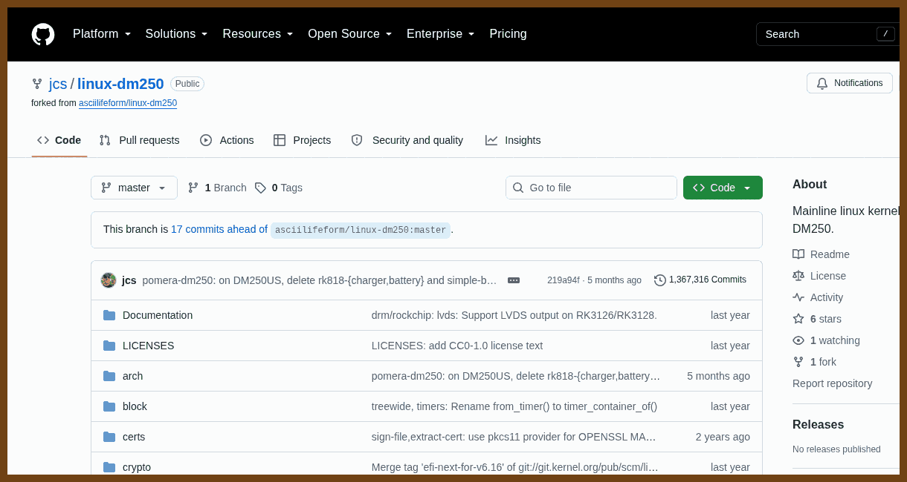
>
> Mainline linux kernel for Pomera DM250. Contribute to jcs/linux-dm250 development by creating an account on GitHub.


## ⌚ Nerd watch!

2026-08-26 [Casey Muratori – The Root of The Root of All Evil – BSC 2026](https://www.youtube.com/watch?v=hpj6r6CjJf8) { www.youtube.com }

> 
>
> Casey Muratori's talk at BSC 2026, delving into root of the root of all evil, premature optimization

2026-09-02 [Things Fall Apart - Architecture to avoid progressive collapse](https://www.youtube.com/watch?v=nkNvVNfp1F0) { www.youtube.com } ⚠️

> 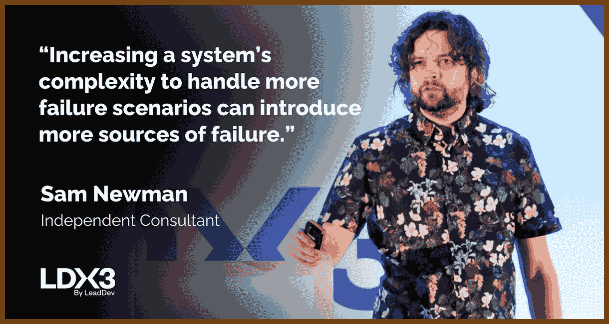
>

2018-02-05 [How To Be a Ventriloquist! Lesson 1 | JEFF DUNHAM](https://www.youtube.com/watch?v=2e0P8TL1PtI) { www.youtube.com }

> 
>

2021-10-14 [A better way to tie your gym shorts. (Or any drawstring)](https://www.youtube.com/watch?v=3R0Lp86GEBk) { www.youtube.com }

> 

2022-05-25 [The Difference Between A Dork And A Nerd. Don McMillan - Full Special](https://www.youtube.com/watch?v=kwz-Md6OoyA) { www.youtube.com }

> 

2025-04-07 [Livestream #11: Ventriloquism & My Life (Ft. Special Guest, my Dad!)](https://www.youtube.com/watch?v=dP97uonupHY) { www.youtube.com }

> 


$5 Collection:

> 
>
> - 2026-04-17 [$5 DTC 16:9](https://www.youtube.com/watch?v=sslhrP2C6rc) { www.youtube.com }
> - 2026-05-20 [Keep Quick DTC 1:1](https://www.youtube.com/shorts/13q5tnf568I) { www.youtube.com }
> - 2026-05-20 [Keep Quick DTC 16:9](https://www.youtube.com/watch?v=Wo-j2-vNKzg) { www.youtube.com }
> - 2026-06-25 [30 Dollars DTC 16:9](https://www.youtube.com/shorts/JjjzABPAmvM) { www.youtube.com }
> - 2026-07-17 [Lowering My Ask DTC 16:9](https://www.youtube.com/watch?v=7Fw4B5xXZ2A) { www.youtube.com }
