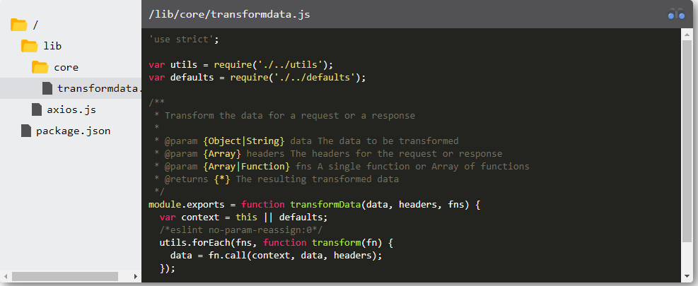

## Let's Think about it

- (2021-10-04) [It takes a PhD to develop that   RoyalSloth](https://blog.royalsloth.eu/posts/it-takes-a-phd-to-develop-that/) the most of the features are done by non-expert programmers, because the more experienced ones are busy with leadership tasks and other organizational stuff.

- (2021-10-06) [I'm sorry · Discussion #39 · dotnet-foundation/Home](https://github.com/dotnet-foundation/Home/discussions/39) - Executive Director for the .NET Foundation apologized about something, but other people did not like that apology.
    * [I'm Sorry | Hacker News](https://news.ycombinator.com/item?id=28779342)
    * [Add support for reproducible builds by clairernovotny · Pull Request #778 · reactiveui/splat](https://github.com/reactiveui/splat/pull/778/files) Original pull request
    * [DNF and its relationship with member projects · Discussion #38 · dotnet-foundation/Home](https://github.com/dotnet-foundation/Home/discussions/38)
    * [Glenn Watson - .NET Foundation problems and solutions](https://www.glennwatson.net/posts/dnf-problems-solutions)
    * [Change in .NET Foundation Leadership · Discussion #40 · dotnet-foundation/Home](https://github.com/dotnet-foundation/Home/discussions/40)
- (2021-10-08) [20 Things I've Learned in my 20 Years as a Software Engineer - Simple Thread](https://www.simplethread.com/20-things-ive-learned-in-my-20-years-as-a-software-engineer/)

## Azure

- (2021-10-04) [HOWTO: Install Azure AD Connect behind an Internet Proxy - The things that are better left unspoken](https://dirteam.com/sander/2021/01/19/howto-install-azure-ad-connect-behind-an-internet-proxy/)

## C# / .NET

- (2021-10-03) [Compress Strings With .NET and C# Khalid Abuhakmeh](https://khalidabuhakmeh.com/compress-strings-with-dotnet-and-csharp?utm_source=csharpdigest&utm_medium=email&utm_campaign=383) about GZip compression
- (2021-10-03) [PowerShell, System.Management.Automation C#  CSharp  Code Examples - HotExamples](https://csharp.hotexamples.com/examples/System.Management.Automation/PowerShell/-/php-powershell-class-examples.html) Run PowerShell from C#
- (2021-10-09) C# 8 asynchronous streams:
    * [C# 8 asynchronous streams](https://developers.redhat.com/blog/2020/02/24/c-8-asynchronous-streams)
    * [C# 8 pattern matching](https://developers.redhat.com/blog/2020/02/27/c-8-pattern-matching)
    * [C# 8 default interface methods](https://developers.redhat.com/blog/2020/03/03/c-8-default-interface-methods)
    * [C# 8 nullable reference types](https://developers.redhat.com/blog/2020/03/05/c-8-nullable-reference-types)
    * [Some more C# 8](https://developers.redhat.com/blog/2020/03/11/some-more-c-8)
- (2021-10-09) [c# - IEnumerable to Stream - Stack Overflow](https://stackoverflow.com/questions/22047900/ienumerable-to-stream)
    * (2015-12-10) [ProducerConsumerStream](https://web.archive.org/web/20151210235510/http://www.informit.com/guides/content.aspx?g=dotnet&seqNum=852) Omg, the JavaScript Date on archive.org is always in past :D
    * (2021-10-09) [c# - Implementing async stream for producer/consumer - Stack Overflow](https://stackoverflow.com/questions/3721552/implementing-async-stream-for-producer-consumer)

## Projects

- (2021-10-06) [sqlfluff](https://www.sqlfluff.com/) The SQL Linter for humans.
- (2021-10-06) [lvgl/lvgl: Powerful and easy-to-use embedded GUI library with many widgets, advanced visual effects  opacity, antialiasing, animations  and low memory requirements  16K RAM, 64K Flash .](https://github.com/lvgl/lvgl)

- (2021-10-09) [VanillaTreeViewer](https://abhchand.me/vanilla-tree-viewer/)

## JavaScript

- (2021-10-09) [Web Streams Everywhere  and Fetch for Node.js    CSS-Tricks](https://css-tricks.com/web-streams-everywhere-and-fetch-for-node-js/)
- (2021-10-09) [Replacing jQuery with Vanilla ES6   Aaron T. Grogg](https://aarontgrogg.com/blog/2021/09/29/replacing-jquery-with-vanilla-es6/)

## CSS

- (2021-10-09) [A Guide To CSS Debugging — Smashing Magazine](https://www.smashingmagazine.com/2021/10/guide-debugging-css/)

