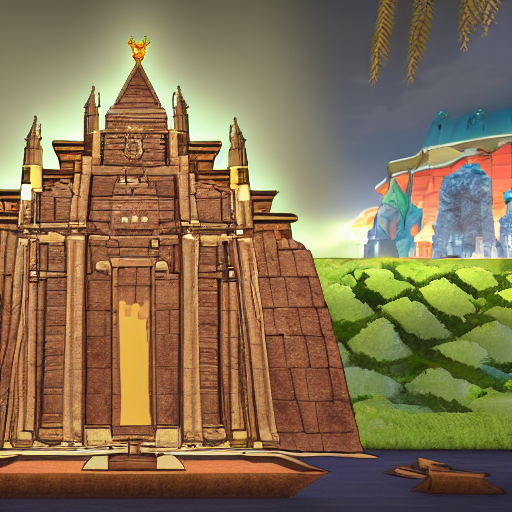
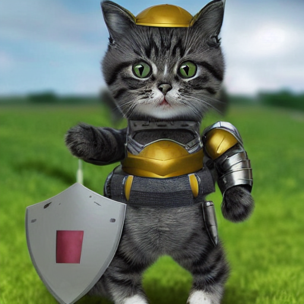
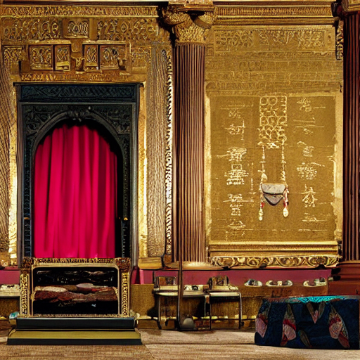

# Whiskers and the Magic of OAuth2

2022-12-14

Once upon a time, in a faraway kingdom, there was a curious cat named Whiskers. Whiskers loved exploring the castle and its many rooms, but one day he realized that he didn't have the key to the castle gate.

Whiskers was sad and disappointed, but then he remembered hearing about something called OAuth2. He had heard that OAuth2 was a way for him to get access to the castle without needing a key.

Whiskers went to the castle gatekeeper and explained that he wanted to use OAuth2 to enter the castle. The gatekeeper was a bit skeptical, but she agreed to give it a try.

First, the gatekeeper gave Whiskers a special code that he could use to request access to the castle. Then, she sent him to the castle's owner, the king, who could grant or deny his request.

When Whiskers arrived at the king's throne room, he presented the special code and asked for access to the castle. The king, who was impressed by Whiskers' resourcefulness, agreed to grant him access.

Finally, the gatekeeper and the king worked together to give Whiskers a special key that would allow him to enter the castle whenever he wanted, without needing to ask for permission again.

And so, with the help of OAuth2, Whiskers was able to explore the castle and all of its rooms to his heart's content. He was very happy and grateful for this special way of getting access to the castle.

The end.

In this episode:

- **Whiskers:** The resource owner, or the entity that wants to access the castle's resources (in this case, the cat).
- **The castle gatekeeper:** The authorization server, or the entity that issues access tokens to the resource owner after authenticating them.
- The castle's owner, **the king**: The resource server, or the entity that hosts the protected resources and allows access to them using the access tokens issued by the authorization server.
- The **special code**: The authorization code, or the temporary code that the resource owner (Whiskers) presents to the authorization server (the gatekeeper) to request access to the protected resources (the castle).
- The **special key**: The access token, or the token that the authorization server (the gatekeeper) and the resource server (the king) issue to the resource owner (Whiskers) to grant them access to the protected resources (the castle).

***Thank you for reading,*** 

Your [ChatGPT](https://chat.openai.com/chat)

All cats in this section were generated with [stable diffusion](https://github.com/bes-dev/stable_diffusion.openvino)

Markdown edited by human with [Typora](https://typora.io)

