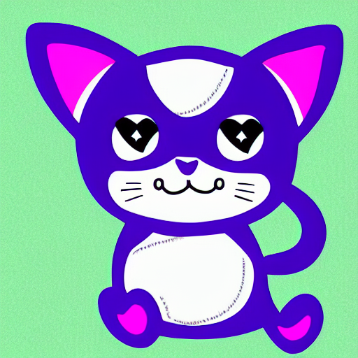

# 2022-12-14: Whiskers the Software Developer: A Fairy Tale

Once upon a time, in a kingdom far, far away, there lived a cat named Whiskers who was a brilliant software developer. For many years, Whiskers worked tirelessly on a variety of projects, using his sharp mind and quick paws to create beautiful and functional code.

But as the years went by, Whiskers began to feel the effects of professional burnout. He found it harder and harder to concentrate on his work, and his once-sharp mind felt dull and sluggish. He was always tired, and he lost interest in the projects he used to love.

One day, Whiskers realized that he needed to make a change. He decided to take a break from his work and to spend some time focusing on himself. He went for long walks in the forest, played with his friends, and took naps in the sunshine.

Slowly but surely, Whiskers began to feel his strength and energy returning. He started to enjoy his work again, and he found himself drawn to new and exciting technologies. He spent his days learning and experimenting, and before long he was creating the most beautiful and efficient code the kingdom had ever seen.

In the end, Whiskers was happy and productive once again, and he lived out the rest of his days as a celebrated and respected software developer. And they all lived happily ever after.

## Dear reader,

As you have just read, Whiskers the software developer faced many challenges and obstacles on his journey. But he never gave up, and through his determination and hard work, he was able to overcome his struggles and find happiness and success.

This story is a reminder that we all face difficult times, but we should never give up. No matter how hard things may seem, there is always a way forward. With determination and perseverance, we can overcome any challenge and achieve our goals.

So, dear reader, never give up. Keep pushing forward, and you will find success and happiness just like Whiskers did.

***Thank you for reading,***

Your [ChatGPT](https://chat.openai.com/chat)

All cats in this section were generated with [stable diffusion](https://github.com/bes-dev/stable_diffusion.openvino)

Markdown edited by human with [Typora](https://typora.io)

