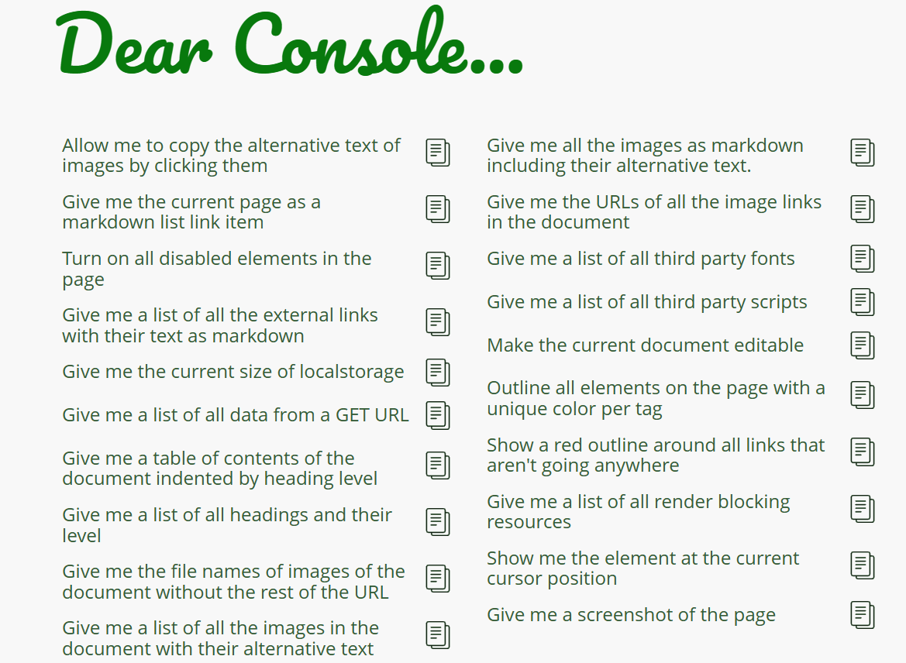
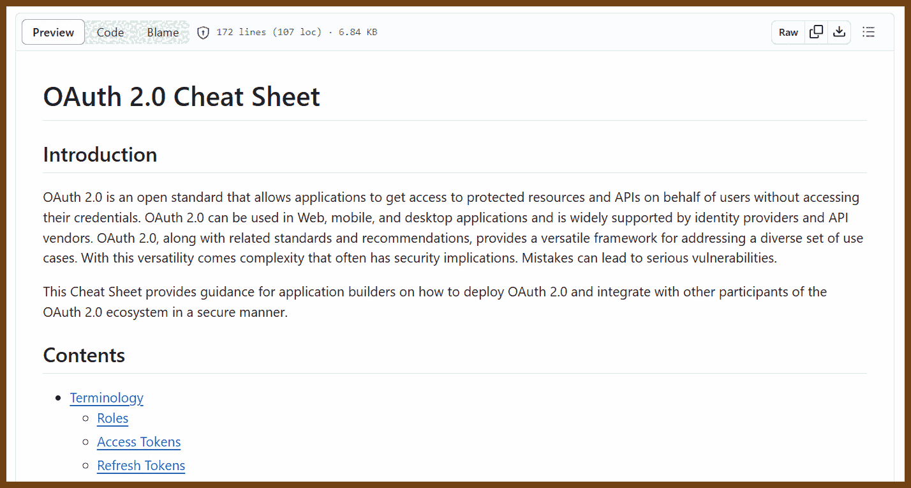

# Cheat-sheets
Date: 2023-08-05

[[_TOC_]]

## FFmpeg

- 2023-08-05 [ffmprovisr](https://amiaopensource.github.io/ffmprovisr/#basic-structure) ffmpeg cookbook

> Making FFmpeg Easier
> FFmpeg is a powerful tool for manipulating audiovisual files. Unfortunately, it also has a steep learning curve, especially for users unfamiliar with a command line interface. This app helps users through the command generation process so that more people can reap the benefits of FFmpeg.
>
> Each button displays helpful information about how to perform a wide variety of tasks using FFmpeg. To use this site, click on the task you would like to perform. A new window will open up with a sample command and a description of how that command works. You can copy this command and understand how the command works with a breakdown of each of the flags.
>
> This page does not have search functionality, but you can open all recipes (second option in the sidebar) and use your browser's search tool (often ctrl+f or cmd+f) to perform a keyword search through all recipes.
>
> 
>
> - [About this resource](https://amiaopensource.github.io/ffmprovisr/#about)
> - [FFmpeg basics](https://amiaopensource.github.io/ffmprovisr/#basics)
> - [Advanced FFmpeg concepts](https://amiaopensource.github.io/ffmprovisr/#concepts)
> - [Change container (rewrap)](https://amiaopensource.github.io/ffmprovisr/#rewrap)
> - [Change codec (transcode)](https://amiaopensource.github.io/ffmprovisr/#transcode)
> - [Change video properties](https://amiaopensource.github.io/ffmprovisr/#video-properties)
> - [Change/view audio properties](https://amiaopensource.github.io/ffmprovisr/#audio-files)
> - [Join/trim/create an excerpt](https://amiaopensource.github.io/ffmprovisr/#join-trim)
> - [Work with interlaced video](https://amiaopensource.github.io/ffmprovisr/#interlacing)
> - [Overlay timecode or text on a video](https://amiaopensource.github.io/ffmprovisr/#overlay)
> - [Create thumbnails or GIFs](https://amiaopensource.github.io/ffmprovisr/#create-images)
> - [Create a video from image(s) and audio](https://amiaopensource.github.io/ffmprovisr/#create-video)
> - [Use filters or scopes](https://amiaopensource.github.io/ffmprovisr/#filters-scopes)
> - [View or strip metadata](https://amiaopensource.github.io/ffmprovisr/#metadata)
> - [Preservation tasks](https://amiaopensource.github.io/ffmprovisr/#preservation)
> - [Generate test files](https://amiaopensource.github.io/ffmprovisr/#test-files)
> - [Use OCR](https://amiaopensource.github.io/ffmprovisr/#ocr)
> - [Compare similarity of videos](https://amiaopensource.github.io/ffmprovisr/#perceptual-similarity)
> - [Something else](https://amiaopensource.github.io/ffmprovisr/#other)
> - [Similar tools: tips & tricks](https://amiaopensource.github.io/ffmprovisr/#similar-tools)
> - [CDDA (Audio CD) Ripping Tools](https://amiaopensource.github.io/ffmprovisr/#cdda)
> - [ImageMagick](https://amiaopensource.github.io/ffmprovisr/#imagemagick)
> - [flac tool](https://amiaopensource.github.io/ffmprovisr/#flac-tool)

## Browser Console

2023-08-05 [Dear Console,… - a collection of code snippets to use in the browser console](https://codepo8.github.io/dearconsole/)

> 
>
> - [Allow me to copy the alternative text of images by clicking them](https://codepo8.github.io/dearconsole/scripts/copy-alt-on-click.html)
> - [Give me the current page as a markdown list link item](https://codepo8.github.io/dearconsole/scripts/current-doc-as-markdown.html)
> - [Turn on all disabled elements in the page](https://codepo8.github.io/dearconsole/scripts/enable-all-elements.html)
> - [Give me a list of all the external links with their text as markdown](https://codepo8.github.io/dearconsole/scripts/get-all-external-links.html)
> - [Give me the current size of localstorage](https://codepo8.github.io/dearconsole/scripts/get-localstorage-size.html)
> - [Give me a list of all data from a GET URL](https://codepo8.github.io/dearconsole/scripts/get-url-data.html)
> - [Give me a table of contents of the document indented by heading level](https://codepo8.github.io/dearconsole/scripts/headings-indented.html)
> - [Give me a list of all headings and their level](https://codepo8.github.io/dearconsole/scripts/headings.html)
> - [Give me the file names of images of the document without the rest of the URL](https://codepo8.github.io/dearconsole/scripts/image-names.html)
> - [Give me a list of all the images in the document with their alternative text](https://codepo8.github.io/dearconsole/scripts/images-alt-text.html)
> - [Give me all the images as markdown including their alternative text.](https://codepo8.github.io/dearconsole/scripts/images-as-markdown.html)
> - [Give me the URLs of all the image links in the document](https://codepo8.github.io/dearconsole/scripts/links-images.html)
> - [Give me a list of all third party fonts](https://codepo8.github.io/dearconsole/scripts/list-thirdparty-fonts.html)
> - [Give me a list of all third party scripts](https://codepo8.github.io/dearconsole/scripts/list-thirdparty-scripts.html)
> - [Make the current document editable](https://codepo8.github.io/dearconsole/scripts/make-document-editable.html)
> - [Outline all elements on the page with a unique color per tag](https://codepo8.github.io/dearconsole/scripts/outline-all-elements.html)
> - [Show a red outline around all links that aren't going anywhere](https://codepo8.github.io/dearconsole/scripts/outline-fake-links.html)
> - [Give me a list of all render blocking resources](https://codepo8.github.io/dearconsole/scripts/render-blocking-resources.html)
> - [Show me the element at the current cursor position](https://codepo8.github.io/dearconsole/scripts/show-element-at-cursor.html)
> - [Give me a screenshot of the page](https://codepo8.github.io/dearconsole/scripts/take-screenshot.html)

## Code

2023-09-07 💡 [LINQ to SQL cheat sheet » DamienG](https://damieng.com/blog/2009/08/12/linq-to-sql-cheat-sheet/)

> 2009 
>
> https://download.damieng.com/dotnet/LINQToSQLCheatSheet.pdf
>
> Old, but not obsolete, nicely made cheat sheet
>
> 

2023-12-15 [GOOD SOLID Cheatsheet - Single Responsibility Principle](https://www.monterail.com/hubfs/PDF%20content/SOLID_cheatsheet.pdf)

> 

## Security

2023-06-19 [CheatSheetSeries/cheatsheets_draft/OAuth_Cheat_Sheet.md at master · OWASP/CheatSheetSeries · GitHub](https://github.com/OWASP/CheatSheetSeries/blob/master/cheatsheets_draft/OAuth_Cheat_Sheet.md)

> 
