# Cheat-sheets
Date: 2023-08-05

[[_TOC_]]


## ✅ Essential Cheat Sheet Hubs

### [DevHints](https://devhints.io/)

> 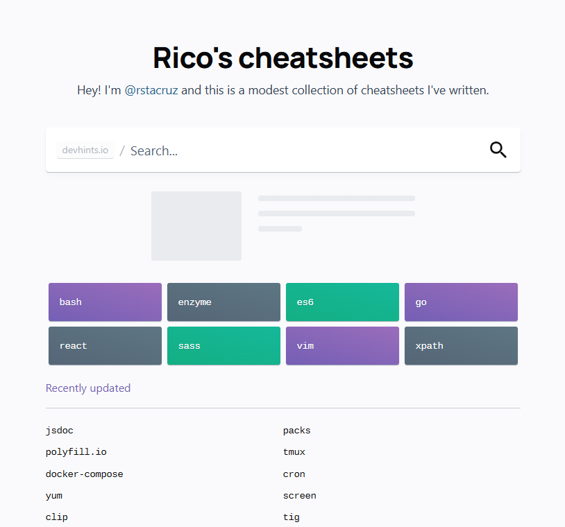
>
> A beautifully designed, fast-loading cheat sheet directory for developers. Covers dozens of languages, tools, and frameworks — including Bash, Git, JavaScript, Docker, SQL, and many more. Lightweight and searchable.

### [Hyperpolyglot](http://hyperpolyglot.org/)

> 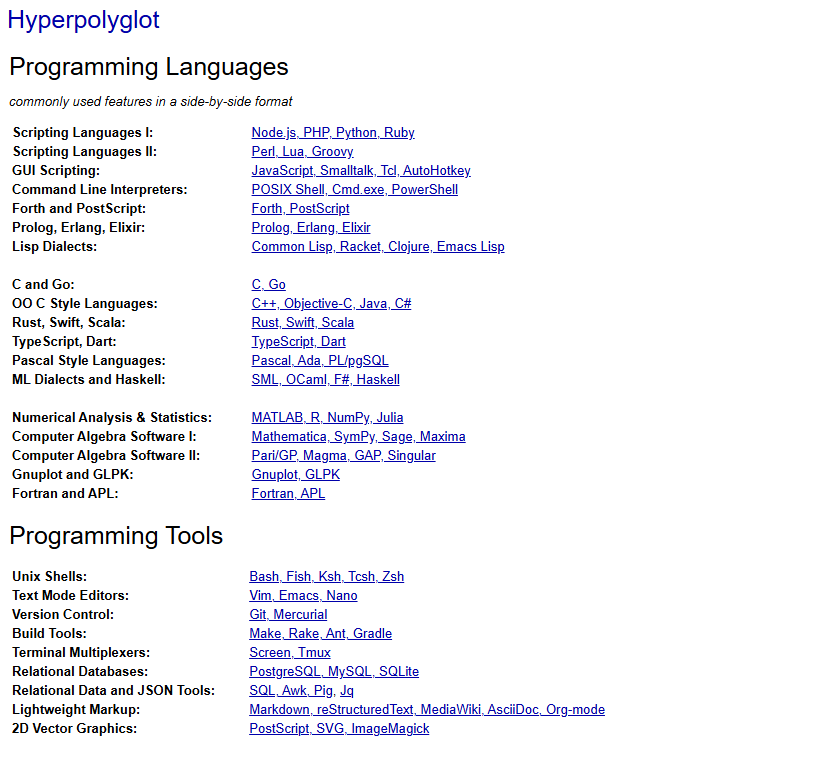
> Comparative cheat sheets for programmers fluent in multiple languages. Shows idiomatic constructs side-by-side in languages like C, Python, Ruby, JavaScript, Haskell, and more. Great for cross-language reference and migration.

### [Programming-Idioms](https://programming-idioms.org/)

> 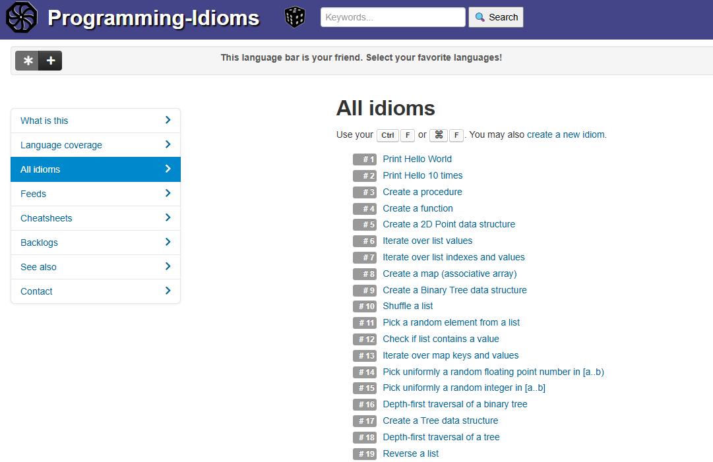
>
> A crowd-sourced collection of common programming tasks implemented in multiple languages. Useful for learning how idioms translate between languages or reviewing best practices.


## 🔁 Multi-Language, Multi-Tool Repositories

### [QuickRef.ME](https://quickref.me/)

> 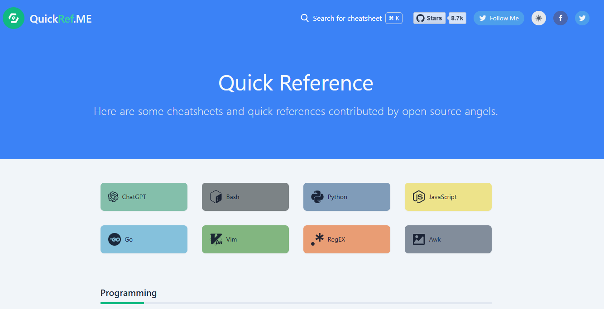
>
> Open-source, text-heavy cheat sheets for nearly everything: languages, libraries, CLI tools, databases, cloud, and more. Simple markdown-style layout, 100% fast and no fluff.

### [OverAPI](http://overapi.com/)

> 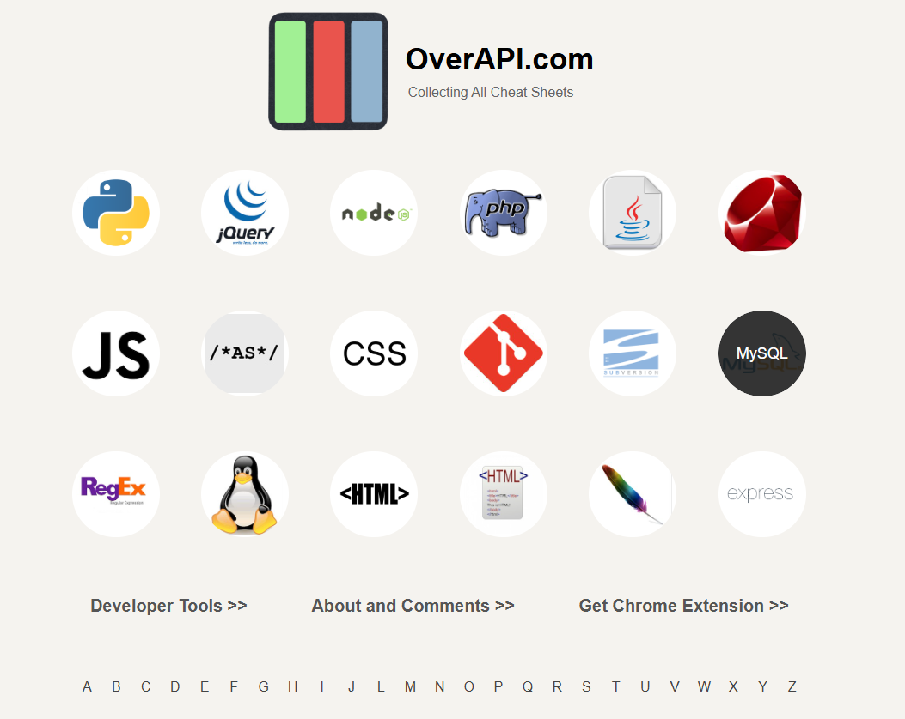
>
> A long-standing cheat sheet portal covering dozens of languages, APIs, and developer tools. Despite its old-school layout, it’s packed with useful links and code snippets.

### [Cheatography](https://cheatography.com/)

> 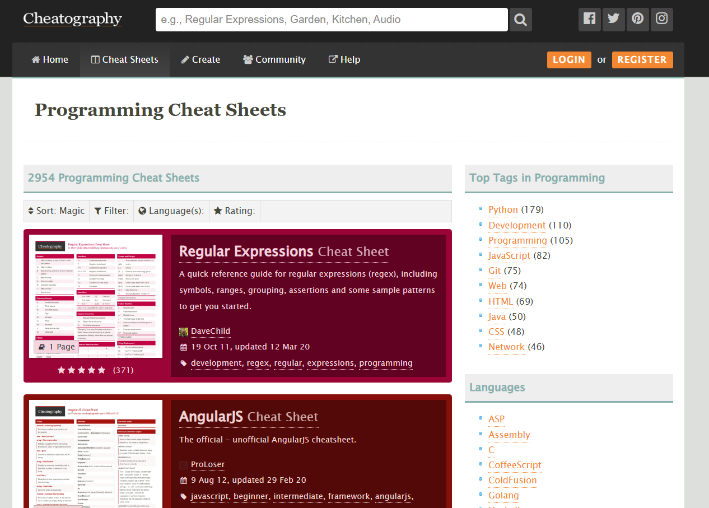
>
> Thousands of cheat sheets across programming, software, sysadmin, and non-dev subjects. Available as interactive web pages or downloadable PDFs. Massive, categorized index.

### [Awesome Cheat Sheets](https://lecoupa.github.io/awesome-cheatsheets/)

> 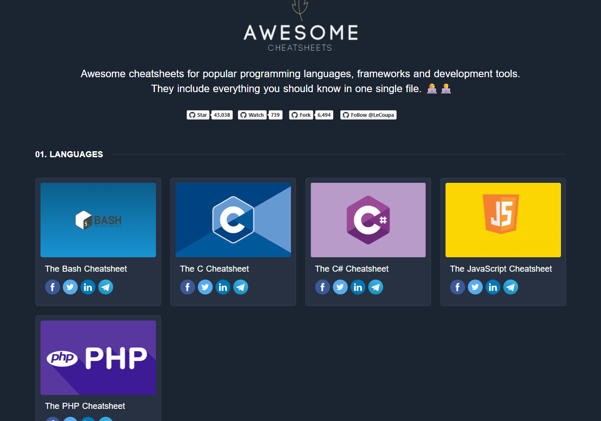
>
> 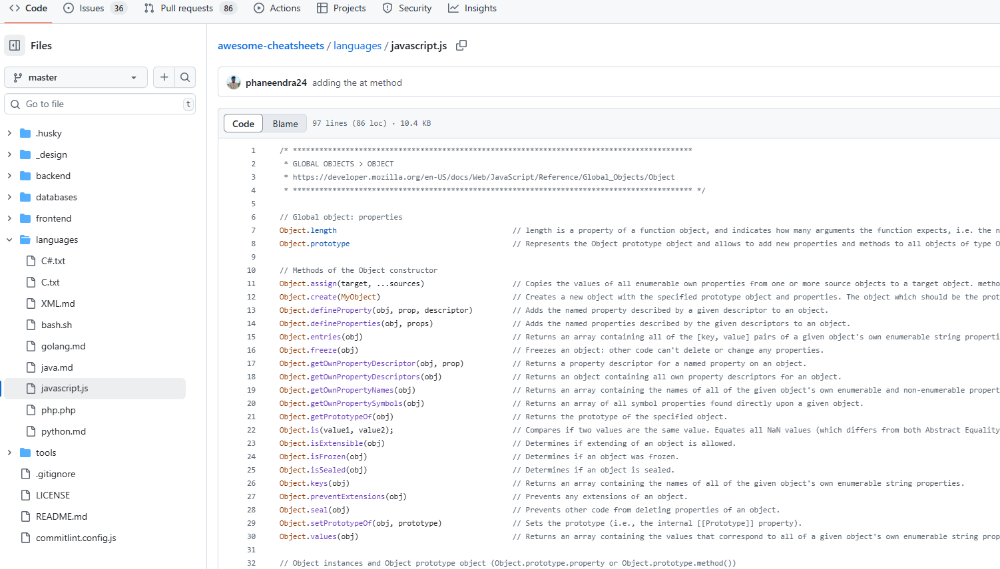
>
> A developer-curated set of all-in-one cheat sheets for major languages and frameworks (JavaScript, Python, Go, React, Node.js, etc.). Meant to give you a complete recall snapshot in one glance.


## 🌍 Interactive & Terminal-Friendly Resources

### [cheat.sh](https://cheat.sh/)

> 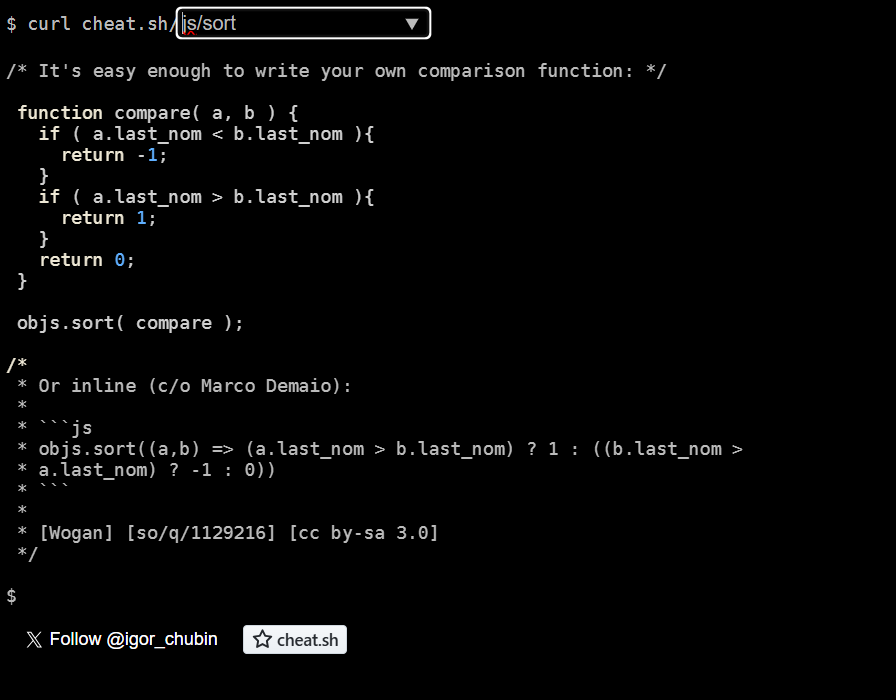
>
> The fastest, terminal-friendly cheat sheet lookup tool for over 50 languages and hundreds of tools. Instant results from curated community resources like Stack Overflow and TLDR. Use via web or curl.

### [Codecademy Cheat Sheets](https://www.codecademy.com/resources/cheatsheets)

> 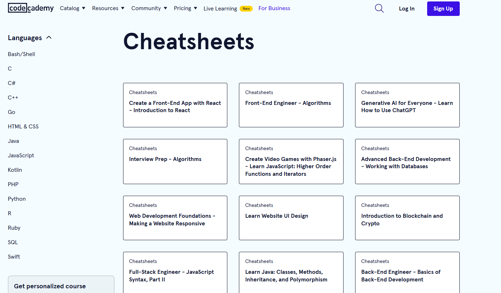
>
> Well-designed and beginner-friendly online references for most languages taught on Codecademy — Python, Java, C++, Ruby, SQL, data science, and more. Easy to digest and printer-ready.

------


## 📚 Community-Driven Aggregators

### [GitHub “cheatsheet-collection”](https://github.com/exajobs/cheatsheet-collection)

> 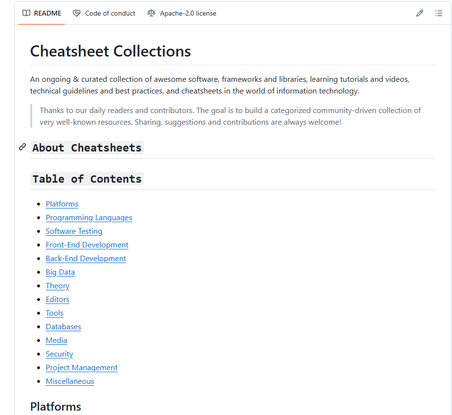
>
> A GitHub repo listing some of the most practical and up-to-date cheat sheets for everything from machine learning to shell scripting, React, regex, APIs, and cloud platforms.

### [Rosetta Code](http://rosettacode.org/)

> 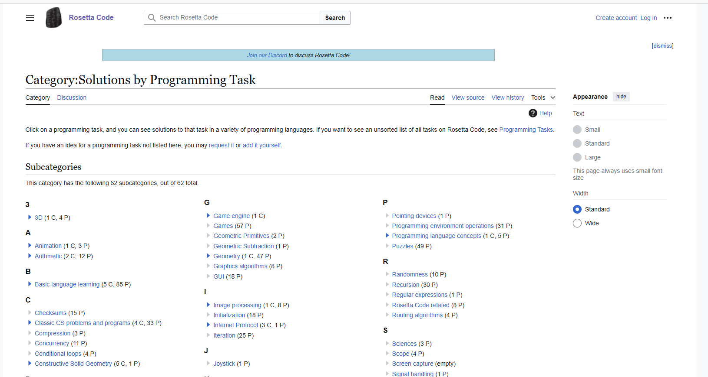
>
> A language-agnostic reference for over 1,000 tasks implemented in hundreds of languages. Ideal for language learners or comparing implementation styles.

------

**Pro tip**: Combine [cheat.sh](https://cheat.sh/) with terminal aliasing for ultra-fast access, or keep [QuickRef.ME](https://quickref.me/) open in a pinned browser tab for day-to-day reference.


## FFmpeg

- 2023-08-05 [ffmprovisr](https://amiaopensource.github.io/ffmprovisr/#basic-structure) ffmpeg cookbook

> Making FFmpeg Easier
> FFmpeg is a powerful tool for manipulating audiovisual files. Unfortunately, it also has a steep learning curve, especially for users unfamiliar with a command line interface. This app helps users through the command generation process so that more people can reap the benefits of FFmpeg.
>
> Each button displays helpful information about how to perform a wide variety of tasks using FFmpeg. To use this site, click on the task you would like to perform. A new window will open up with a sample command and a description of how that command works. You can copy this command and understand how the command works with a breakdown of each of the flags.
>
> This page does not have search functionality, but you can open all recipes (second option in the sidebar) and use your browser's search tool (often ctrl+f or cmd+f) to perform a keyword search through all recipes.
>
> 
>
> - [About this resource](https://amiaopensource.github.io/ffmprovisr/#about)
> - [FFmpeg basics](https://amiaopensource.github.io/ffmprovisr/#basics)
> - [Advanced FFmpeg concepts](https://amiaopensource.github.io/ffmprovisr/#concepts)
> - [Change container (rewrap)](https://amiaopensource.github.io/ffmprovisr/#rewrap)
> - [Change codec (transcode)](https://amiaopensource.github.io/ffmprovisr/#transcode)
> - [Change video properties](https://amiaopensource.github.io/ffmprovisr/#video-properties)
> - [Change/view audio properties](https://amiaopensource.github.io/ffmprovisr/#audio-files)
> - [Join/trim/create an excerpt](https://amiaopensource.github.io/ffmprovisr/#join-trim)
> - [Work with interlaced video](https://amiaopensource.github.io/ffmprovisr/#interlacing)
> - [Overlay timecode or text on a video](https://amiaopensource.github.io/ffmprovisr/#overlay)
> - [Create thumbnails or GIFs](https://amiaopensource.github.io/ffmprovisr/#create-images)
> - [Create a video from image(s) and audio](https://amiaopensource.github.io/ffmprovisr/#create-video)
> - [Use filters or scopes](https://amiaopensource.github.io/ffmprovisr/#filters-scopes)
> - [View or strip metadata](https://amiaopensource.github.io/ffmprovisr/#metadata)
> - [Preservation tasks](https://amiaopensource.github.io/ffmprovisr/#preservation)
> - [Generate test files](https://amiaopensource.github.io/ffmprovisr/#test-files)
> - [Use OCR](https://amiaopensource.github.io/ffmprovisr/#ocr)
> - [Compare similarity of videos](https://amiaopensource.github.io/ffmprovisr/#perceptual-similarity)
> - [Something else](https://amiaopensource.github.io/ffmprovisr/#other)
> - [Similar tools: tips & tricks](https://amiaopensource.github.io/ffmprovisr/#similar-tools)
> - [CDDA (Audio CD) Ripping Tools](https://amiaopensource.github.io/ffmprovisr/#cdda)
> - [ImageMagick](https://amiaopensource.github.io/ffmprovisr/#imagemagick)
> - [flac tool](https://amiaopensource.github.io/ffmprovisr/#flac-tool)


## Browser Console

2023-08-05 [Dear Console,… - a collection of code snippets to use in the browser console](https://codepo8.github.io/dearconsole/)

> 
>
> - [Allow me to copy the alternative text of images by clicking them](https://codepo8.github.io/dearconsole/scripts/copy-alt-on-click.html)
> - [Give me the current page as a markdown list link item](https://codepo8.github.io/dearconsole/scripts/current-doc-as-markdown.html)
> - [Turn on all disabled elements in the page](https://codepo8.github.io/dearconsole/scripts/enable-all-elements.html)
> - [Give me a list of all the external links with their text as markdown](https://codepo8.github.io/dearconsole/scripts/get-all-external-links.html)
> - [Give me the current size of localstorage](https://codepo8.github.io/dearconsole/scripts/get-localstorage-size.html)
> - [Give me a list of all data from a GET URL](https://codepo8.github.io/dearconsole/scripts/get-url-data.html)
> - [Give me a table of contents of the document indented by heading level](https://codepo8.github.io/dearconsole/scripts/headings-indented.html)
> - [Give me a list of all headings and their level](https://codepo8.github.io/dearconsole/scripts/headings.html)
> - [Give me the file names of images of the document without the rest of the URL](https://codepo8.github.io/dearconsole/scripts/image-names.html)
> - [Give me a list of all the images in the document with their alternative text](https://codepo8.github.io/dearconsole/scripts/images-alt-text.html)
> - [Give me all the images as markdown including their alternative text.](https://codepo8.github.io/dearconsole/scripts/images-as-markdown.html)
> - [Give me the URLs of all the image links in the document](https://codepo8.github.io/dearconsole/scripts/links-images.html)
> - [Give me a list of all third party fonts](https://codepo8.github.io/dearconsole/scripts/list-thirdparty-fonts.html)
> - [Give me a list of all third party scripts](https://codepo8.github.io/dearconsole/scripts/list-thirdparty-scripts.html)
> - [Make the current document editable](https://codepo8.github.io/dearconsole/scripts/make-document-editable.html)
> - [Outline all elements on the page with a unique color per tag](https://codepo8.github.io/dearconsole/scripts/outline-all-elements.html)
> - [Show a red outline around all links that aren't going anywhere](https://codepo8.github.io/dearconsole/scripts/outline-fake-links.html)
> - [Give me a list of all render blocking resources](https://codepo8.github.io/dearconsole/scripts/render-blocking-resources.html)
> - [Show me the element at the current cursor position](https://codepo8.github.io/dearconsole/scripts/show-element-at-cursor.html)
> - [Give me a screenshot of the page](https://codepo8.github.io/dearconsole/scripts/take-screenshot.html)

2023-08-31🌞 [DevTools Tips](https://devtoolstips.org/)

> 

2023-11-11 [67 Weird Debugging Tricks Your Browser Doesn't Want You to Know | Alan Norbauer](https://alan.norbauer.com/articles/browser-debugging-tricks)

> By using expressions that have side effects in places you wouldn’t expect, we can squeeze more functionality out of basic features like conditional breakpoints.
>
> WITH ANNIMATIONS!
>
> 

2023-11-06 [Git Hidden Gems - Enrico Campidoglio - Copenhagen DevFest 2023 - YouTube](https://www.youtube.com/watch?v=uFrPgUjv_Y8)

> 2023-11-06 [Enrico Campidoglio](https://megakemp.com/git/#articles)
> Git log Pretty Print:
```bash
git log --pretty="%C(red)%h%Creset%C(yellow)%d%Creset %s %C(cyan)(%ar)%Creset"
```
Delta:
https://github.com/dandavison/delta

```
git config --global core.pager
```

Search all commits by C-style function name
```
# func: add
# in file src/calculator.ts

git log -L:add:src/calculator.ts
```


## Code

2024-12-26 [CPP / C++ - Bookmarks](https://caiorss.github.io/C-Cpp-Notes/bookmarks.html) { caiorss.github.io }

> See section: **1.11 Reference Cards for shell scripting languages and command line tools**

> 

2024-12-26 [Devhints — TL;DR for developer documentation](https://devhints.io/) { devhints.io }

> Amazing collection of cheat sheets for various programming languages.
>
> 

> 

2023-12-09 [The Complete Puppeteer Cheatsheet | ProxiesAPI](https://proxiesapi.com/articles/the-complete-puppeteer-cheatsheet)

> found in: https://javascriptweekly.com/issues/666
> Puppeteer is a Node.js library developed by Google for controlling headless Chrome and Chromium over the DevTools Protocol. It allows you to automate UI testing, scraping, screenshot testing, and more.
> 👍

2023-09-07 💡 [LINQ to SQL cheat sheet » DamienG](https://damieng.com/blog/2009/08/12/linq-to-sql-cheat-sheet/)

> 2009 
>
> https://download.damieng.com/dotnet/LINQToSQLCheatSheet.pdf
>
> Old, but not obsolete, nicely made cheat sheet
>
> 

2023-12-15 [GOOD SOLID Cheatsheet - Single Responsibility Principle](https://www.monterail.com/hubfs/PDF%20content/SOLID_cheatsheet.pdf)

> 


## Security

2023-06-19 [CheatSheetSeries/cheatsheets_draft/OAuth_Cheat_Sheet.md at master · OWASP/CheatSheetSeries · GitHub](https://github.com/OWASP/CheatSheetSeries/blob/master/cheatsheets_draft/OAuth_Cheat_Sheet.md)

> 


## Media processing 

2025-01-16 [FFmpeg By Example](https://ffmpegbyexample.com/) { ffmpegbyexample.com }

> 
