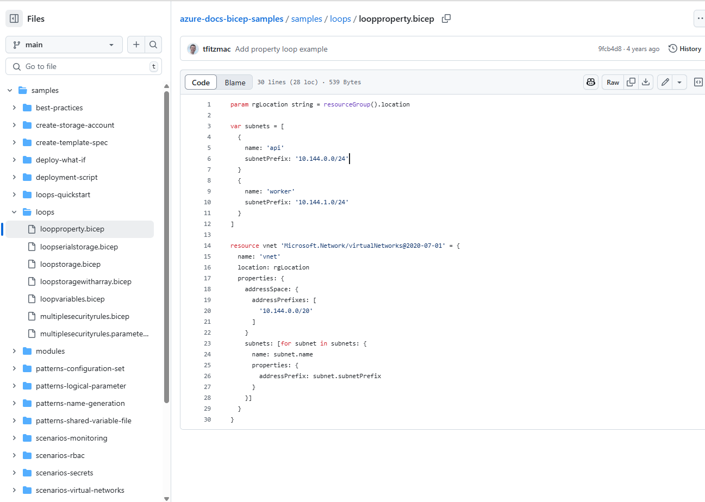

# dev-bicep
Date: 2025-07-19

[[_TOC_]]

## Tools

 [Bicep Playground](https://azure.github.io/bicep/) { azure.github.io }

> I hope it still works! Amazing online tool to learn bicep!
>
> I've used it with Azure Bicep Cheat Sheet below.
>
> 

## Official Reference from MSFT

2025-07-19 [Microsoft.Automation/automationAccounts - Bicep, ARM template & Terraform AzAPI reference | Microsoft Learn](https://learn.microsoft.com/en-us/azure/templates/microsoft.automation/automationaccounts?pivots=deployment-language-bicep) { learn.microsoft.com }

> Yay!

2025-07-20 [azure-docs-bicep-samples/samples/loops/loopproperty.bicep at main · Azure/azure-docs-bicep-samples](https://github.com/Azure/azure-docs-bicep-samples/blob/main/samples/loops/loopproperty.bicep) { github.com }

> Maybe okayish, but a bit outdated. Check the recent resource version. 
>
> 


## Bicep Guide

[nnellans/bicep-guide: Bicep Guide](https://github.com/nnellans/bicep-guide) { github.com }

> by Nathan Nellans
>
> 

# Azure Bicep Cheat Sheet

**Source:**  [johnlokerse/azure-bicep-cheat-sheet: Quick-reference guide on Azure Bicep 💪🏻](https://github.com/johnlokerse/azure-bicep-cheat-sheet) { github.com }


**This is a copy of the cheat sheet created by [John Lokerse](https://github.com/johnlokerse).** 

---

## What is a cheat sheet?


A cheat sheet is a concise set of notes or a reference guide used for quick retrieval of essential information. It's often a single page that contains summaries, commands, formulas, or procedures that someone might need to reference frequently, especially when learning a new topic or skill.

## What is Azure Bicep?


Azure Bicep is a domain-specific language (also known as DSL) designed by Microsoft for defining and deploying Azure resources in a declarative manner. It's the next generation of Azure Resource Manager (ARM) templates, offering a cleaner syntax, improved type safety, and better support for modularization. While ARM templates use JSON syntax, Bicep uses a more concise syntax that aims to make it easier for developers to author and maintain Azure deployments.

## Topics
## Topics

> [!NOTE]
> Click the arrow next to a topic to expand its content.

<details>
  <summary>
    <span><b>Basics</b></span>
    <p><i>Declarations of new and existing resources, variables, parameters and outputs, etcetera.</i></p>
  </summary>

### Create a resource

[GitHub Copilot Prompt - Learn more on resource creation](https://github.com/copilot?prompt=how%20to%20define%20a%20resource%20in%20azure%20bicep)

how to define a resource in azure bicep

```bicep
resource resourceName 'ResourceType@version' = {
  name: 'exampleResourceName'
  properties: {
    // resource properties here
  }
}
```

### Create a child resource

[GitHub Copilot Prompt - Learn more about creating child resources](https://github.com/copilot?prompt=Can%20you%20explain%20the%20differences%20between%20creating%20child%20resources%20in%20Azure%20Bicep%20using%20a%20name%20property,%20using%20a%20parent%20property,%20and%20nesting%20them%20within%20a%20parent%20resource%20block?%20Please%20include%20examples%20and%20clarify%20when%20to%20use%20each%20approach.)

#### Via name

```bicep
resource resVnet 'Microsoft.Network/virtualNetworks@2022-01-01' = {
  name: 'my-vnet'
}

resource resChildSubnet 'Microsoft.Network/virtualNetworks/subnets@2022-01-01' = {
  name: '${resVnet}/my-subnet'
}
```

#### Via parent property

```bicep
resource resVnet 'Microsoft.Network/virtualNetworks@2022-01-01' = {
  name: 'my-vnet'
}

resource resChildSubnet 'Microsoft.Network/virtualNetworks/subnets@2022-01-01' = {
  name: 'my-subnet'
  parent: resVnet
}
```

#### Via parent resource

```bicep
resource resVnet 'Microsoft.Network/virtualNetworks@2022-01-01' = {
  name: 'my-vnet'

  resource resChildSubnet 'subnets' = {
    name: 'my-subnet'
  }
}
```

### Reference to an existing resource

```bicep
resource resKeyVaultRef 'Microsoft.KeyVault/vaults@2019-09-01' = existing {
  name: 'myExistingKeyVaultName'
}
```

### Access a nested resource (::)

```bicep
resource resVnet 'Microsoft.Network/virtualNetworks@2022-01-01' existing = {
  name: 'my-vnet'
  resource resChildSubnet 'subnets' existing = {
    name: 'my-subnet'
  }
}

// access child resource
output outChildSubnetId string = resVnet::resChildSubnet.id
```

### Declare a variable

```bicep
var varEnvironment = 'dev'
```

There is no need to declare a datatype for a variable, because the type is inferred from the value.

### Declare a parameter

```bicep
param parStorageAccountName string
param parLocation string = resourceGroup().location
```

Available datatypes are: `string`, `bool`, `int`, `object`, `array` and `custom (user defined type)`.

### Declare a secure parameter

```bicep
@secure()
param parSecureParameter string
```

### Declare an output

```bicep
resource resPublicIp 'Microsoft.Network/publicIPAddresses@2023-02-01' ={
  name: parPublicIpName
  tags: parTags
  location: parLocation
  zones: parAvailabilityZones
  sku: parPublicIpSku
  properties: parPublicIpProperties
}

output outPublicIpId string = resPublicIp.id
output outMyString string = 'Hello!'
```

Available datatypes are: `string`, `bool`, `int`, `object`, `array` and `custom (user defined type)`.

### String interpolation

```bicep
var varGreeting = 'Hello'
output outResult string = '${varGreeting} World'
```

### Multi-line strings

```bicep
var varMultiLineString = '''
  This is a
  Muli-line string
  variable.
'''
```

</details>

<details>
  <summary>
    <span><b>Modules</b></span>
    <p><i>Split your deployment into smaller, reusable components.</i></p>
  </summary>

### Create a module

[GitHub Copilot Prompt](https://github.com/copilot?prompt=Can%20you%20explain%20what%20Azure%20Bicep%20modules%20are%20and%20how%20they%20work?%20Also,%20how%20can%20you%20reference%20a%20module%20stored%20in%20an%20external%20Azure%20Container%20Registry%20(ACR)?)

```bicep
module modVirtualNetwork './network.bicep' = {
  name: 'networkModule'
  params: {
    parLocation: 'westeurope'
    parVnetName: 'my-vnet-name'
  }
}
```

### Reference to a module using a bicep registry

```bicep
module modBicepRegistryReference 'br/<bicep registry name>:<file path>:<tag>' = {
  name: 'deployment-name'
  params: {}
}
```

</details>

<details>
  <summary>
    <span><b>Conditions</b></span>
    <p><i>Resource definitions based on conditions.</i></p>
  </summary>

[GitHub Copilot - Learn more about conditions](https://github.com/copilot?prompt=How%20do%20conditions%20work%20in%20Azure%20Bicep?%20Can%20you%20explain%20it%20in%20detail%20and%20provide%20examples%20of%20how%20to%20use%20conditions%20to%20control%20resource%20deployment%20or%20property%20values?)

### If condition

```bicep
param parDeployResource bool

resource resDnsZone 'Microsoft.Network/dnszones@2018-05-01' = if (parDeployResource) {
  name: 'myZone'
  location: 'global'
}
```

### Ternary if/else condition

```bicep
param parEnvironment string

var varSku = parEnvironment == 'prod' ? 'premium' : 'standard'
```

</details>

<details>
  <summary>
    <span><b>Loops</b></span>
    <p><i>Loop constructions.</i></p>
  </summary>

[GitHub Copilot - Learn more about loops](https://github.com/copilot?prompt=How%20do%20you%20create%20loops%20in%20Azure%20Bicep?%20Can%20you%20show%20examples%20using%20the%20for%20keyword%20to%20deploy%20multiple%20resources%20or%20set%20values%20in%20an%20array?)

### foreach using an array

```bicep
param parStorageAccountNames array = [
  'storageaccount1'
  'storageaccount2'
  'storageaccount3'
]

resource resStorageAccounts 'Microsoft.Storage/storageAccounts@2021-04-01' = [for name in parStorageAccountNames: {
  name: name
  location: 'westeurope'
  kind: 'StorageV2'
  sku: {
    name: 'Standard_LRS'
  }
}]
```

### foreach using an array of objects

``` bicep
param parStorageAccountNames array = [
  {
    name: 'storageaccount1'
    kind: 'StorageV2'
    sku: {
      name: 'Standard_LRS'
    }
  }
  {
    name: 'storageaccount2'
    kind: 'StorageV2'
    sku: {
      name: 'Standard_LRS'
    }
  }
]

resource resStorageAccounts 'Microsoft.Storage/storageAccounts@2021-04-01' = [for storageAccount in parStorageAccountNames: {
  name: storageAccount.name
  location: 'westeurope'
  kind: storageAccount.kind
  sku: {
    name: storageAccount.sku
  }
}]
```

</details>

<details>
  <summary>
    <span><b>Data manipulation</b></span>
    <p><i>Functions used to manipulate data.</i></p>
  </summary>

[GitHub Copilot - Learn more about lambda functions](https://github.com/copilot?prompt=In%20Azure%20Bicep,%20how%20do%20the%20filter(),%20map(),%20and%20sort()%20functions%20work?%20Can%20you%20explain%20each%20function%20in%20detail%20and%20show%20how%20they%E2%80%99re%20used%20in%20practice?%20For%20example:%20%E2%80%A2output%20outProducts%20array%20=%20filter(varGroceryStore,%20item%20=%3E%20item.productPrice%20%3E=%204)%20%E2%80%A2output%20outDiscount%20array%20=%20map(range(0,%20length(varGroceryStore)),%20item%20=%3E%20{%20productNumber:%20item,%20productName:%20varGroceryStore[item].productName,%20discountedPrice:%20%27The%20item%20${varGroceryStore[item].productName}%20is%20on%20sale.%20Sale%20price:%20${(varGroceryStore[item].productPrice%20/%202)}%27%20})%20%E2%80%A2output%20outUsingSort%20array%20=%20sort(varGroceryStore,%20(a,%20b)%20=%3E%20a.productPrice%20%3C=%20b.productPrice)%20Please%20walk%20through%20what%20each%20of%20these%20functions%20does%20and%20when%20to%20use%20them)

### Example data

```bicep
var varGroceryStore = [
  {
    productName: 'Icecream'
    productPrice: 2
    productCharacteristics: [
      'Vegan'
      'Seasonal'
    ]
  }
  {
    productName: 'Banana'
    productPrice: 4
    productCharacteristics: [
      'Bio'
    ]
  }
]
```

### filter() function

```bicep
  output outProducts array = filter(varGroceryStore, item => item.productPrice >= 4)
```

#### returns

```json
[
  {
    "productName": "Banana",
    "productPrice": 4,
    "productCharacteristics": [
      "Bio"
    ]
  }
]
```

### map() function

```bicep
output outDiscount array = map(range(0, length(varGroceryStore)), item => {
  productNumber: item
  productName: varGroceryStore[item].productName
  discountedPrice: 'The item ${varGroceryStore[item].productName} is on sale. Sale price: ${(varGroceryStore[item].productPrice / 2)}'
})
```

#### returns

```json
[
  {
    "productNumber": 0,
    "productName": "Icecream",
    "discountedPrice": "The item Icecream is on sale. Sale price: 1"
  },
  {
    "productNumber": 1,
    "productName": "Banana",
    "discountedPrice": "The item Banana is on sale. Sale price: 2"
  }
]
```

### sort() function

```bicep
output outUsingSort array = sort(varGroceryStore, (a, b) => a.productPrice <= b.productPrice)
```

#### returns

```json
[
  {
    "productName": "Icecream",
    "productPrice": 2,
    "productCharacteristics": [
      "Vegan"
      "Seasonal"
    ]
  },
  {
    "productName": "Banana",
    "productPrice": 4,
    "productCharacteristics": [
      "Bio"
    ]
  }
]
```

</details>

<details>
  <summary>
    <span><b>User Defined Types</b></span>
    <p><i>Define custom complex data structures.</i></p>
  </summary>

[GitHub Copilot - Learn more on User Defined Types](https://github.com/copilot?prompt=Can%20you%20explain%20in%20detail%20how%20User%20Defined%20Types%20work%20in%20Azure%20Bicep?%20Please%20include%20examples%20of%20defining%20custom%20object%20types,%20including%20how%20to%20structure%20them%20and%20how%20to%20define%20optional%20properties.%20Optional%20properties%20should%20be%20defined%20using%20a%20?%20at%20the%20type%20level%20(e.g.,%20type%20Bla%20=%20{%20name:%20string?%20}).%20Also%20include%20examples%20of%20arrays%20of%20objects%20with%20optional%20properties,%20such%20as:type%20arrayWithObjectsType%20=%20{%20name:%20string%20age:%20int%20hasChildren:%20bool?%20hasPets:%20bool?%20}[])

### Primitive types

```bicep
// a string type with two allowed strings ('Standard_LRS' or 'Standard_GRS')
type skuType = 'Standard_LRS' | 'Standard_GRS'

// an integer type with one allowed value (1337)
type integerType = 1337

// an boolean type with one allowed value (true)
type booleanType = true

// Reference the type
param parMyStringType skuType
param parMyIntType integerType
param parMyBoolType booleanType
```

### A custom type that enforced an array with a specific object structure

```bicep
type arrayWithObjectsType = {
  name: string
  age: int
}[]

param parCustomArray arrayWithObjectsType = [
  {
    name: 'John'
    age: 30
  }
]
```

### Optional properties in objects (using ?)

```bicep
type arrayWithObjectsType = {
  name: string
  age: int
  hasChildren: bool?
  hasPets: bool?
}[]

param parCustomArray arrayWithObjectsType = [
  {
    name: 'John'
    age: 30
  }
  {
    name: 'Jane'
    age: 31
    hasPets: true
  }
  {
    name: 'Jack'
    age: 45
    hasChildren: true
    hasPets: true
  }
]
```

</details>

<details>
  <summary>
    <span><b>User Defined Functions</b></span>
    <p><i>Define custom complex expressions.</i></p>
  </summary>

[GitHub Copilot - Learn more about User Defined Functions](https://github.com/copilot?prompt=Can%20you%20explain%20in%20detail%20how%20User%20Defined%20Functions%20work%20in%20Azure%20Bicep?%20Please%20include%20examples%20that%20show%20how%20to%20define%20and%20use%20custom%20functions,%20including%20parameter%20definitions,%20return%20types,%20and%20function%20logic.%20Also%20include%20a%20simple%20example%20such%20as:func%20funcSayHelloTo()%20string%20=%3E%20%27Hello%20and%20welcome,%20John%20Doe%27%20output%20outName%20string%20=%20funcSayHelloTo()%20/*%20Outputs:%20%27Hello%20and%20welcome,%20John%20Doe%27%20*/)

### User-defined function syntax

```func <function-name> (<parameter-name> <data-type>) <return-type> => <expression>```

### Basic user-defined function

```bicep
func funcSayHelloTo() string => 'Hello and welcome, John Doe'
```

### User-defined function with parameters

```bicep
func funcSayHelloTo(name string) string => 'Hello and welcome, ${name}'
```

With multiple parameters:

```bicep
func funcPersonNameAndAge(name string, age int) string => 'My name is ${name} and my age is ${age}'
```

### User-defined function return types

```bicep
func funcReturnTypeArray() array => [1, 2, 3, 4, 5]
func funcReturnTypeObject() object => {name: 'John Doe', age: 31}
func funcReturnTypeInt() int => 1337
func funcReturnTypeBool(key string) bool => contains({}, key)
func funcReturnTypeUserDefinedType() customTypeUsedAsReturnType => {
  hello: 'world'
}

type customTypeUsedAsReturnType = {
  hello: string
}
```

</details>

<details>
  <summary>
    <span><b>Compile-time imports</b></span>
    <p><i>Import and export() enable reuse of user-defined types variables, functions.<br>Supported in Bicep and Bicepparam files.</i></p>
  </summary>

[GitHub Copilot - learn more about compile-time imports](https://github.com/copilot?prompt=Show%20me%20how%20to%20use%20export%20and%20import%20in%20Azure%20Bicep%20to%20reuse%20a%20storage%20account%20resource%20across%20multiple%20Bicep%20files.)

### export() decorator (shared.bicep)

```bicep
@export()
var region = 'we'

@export()
type tagsType = {
  Environment: 'Prod' | 'Dev' | 'QA' | 'Stage' | 'Test'
  CostCenter: string
  Owner: string
  BusinessUnit: string
  *: string
}
```

### import statement

```bicep
import { region, tagsType } from 'shared.bicep'

output outRegion string = region
output outTags tagsType = {
  Environment: 'Dev'
  CostCenter: '12345'
  BusinessUnit: 'IT'
  Owner: 'John Lokerse'
}
```

### import statement with alias

```bicep
using 'keyVault.bicep'
import { region as importRegion } from 'shared.bicep'

param parKeyVaultName = 'kv-${importRegion}-${uniqueString(importRegion)}'
```

### import statement using a wildcard

```bicep
import * as shared from 'shared.bicep'

output outRegion string = shared.region
output outTags shared.tagsType = {
  Environment: 'Dev'
  CostCenter: '12345'
  BusinessUnit: 'IT'
  Owner: 'John Lokerse'
}
```

</details>

<details>
  <summary>
    <span><b>Networking</b></span>
    <p><i>CIDR functions to make subnetting easier.</i></p>
  </summary>

[GitHub Copilot - learn more about the networking functions](https://github.com/copilot?prompt=Can%20you%20explain%20how%20to%20use%20CIDR%20functions%20in%20Azure%20Bicep%20to%20make%20subnetting%20easier?%20Show%20how%20functions%20like%20cidrSubnet(),%20cidrHost()%20and%20others%20help%20to%20calculate%20subnet%20ranges,%20addresses,%20or%20specific%20IPs%20based%20on%20a%20base%20CIDR%20block.%20Include%20practical%20examples%20such%20as%20splitting%20a%20/16%20address%20space%20into%20multiple%20/24%20subnets.)

### parseCidr() function

```bicep
output outParseCidrInformation object = parseCidr('192.168.1.0/24')
```

#### returns

```json
"outParseCidrInformation": {
  "type": "Object",
  "value": {
    "broadcast": "192.168.1.255",
    "cidr": 24,
    "firstUsable": "192.168.1.1",
    "lastUsable": "192.168.1.254",
    "netmask": "255.255.255.0",
    "network": "192.168.1.0"
  }
}
```

### cidrSubnet() function

```bicep
output outCidrSubnet string = cidrSubnet('192.168.1.0/24', 25, 0)
```

#### returns

```json
"outCidrSubnet": {
  "type": "String",
  "value": "192.168.1.0/25"
}
```

### cidrHost() function

```bicep
output outCidrHost array = [for i in range(0, 10): cidrHost('192.168.1.0/24', i)]
```

#### returns

```json
"outCidrHost": {
  "type": "Array",
  "value": [
    "192.168.1.1",
    "192.168.1.2",
    "192.168.1.3",
    "192.168.1.4",
    "192.168.1.5",
    "192.168.1.6",
    "192.168.1.7",
    "192.168.1.8",
    "192.168.1.9",
    "192.168.1.10"
  ]
}
```
</details>

<details>
  <summary>
    <span><b>Bicepconfig</b></span>
    <p><i>Customize your Bicep development experience.</i></p>
  </summary>

[GitHub Copilot - Learn more about bicepconfig.json](https://github.com/copilot?prompt=Tell%20me%20more%20about%20the%20bicepconfig.json%20in%20Azure%20Bicep.%20What%20does%20it%20do%20and%20why%20do%20I%20need%20it?)

### Azure Container Registry configuration

```json
{
  "moduleAliases": {
    "br": {
      "<bicep registry name>": {
        "registry": "<url to registry>",
        "modulePath": "<module path of the alias>"
      }
    }
  }
}
```

</details>

<details>
  <summary>
    <span><b>Dependencies</b></span>
    <p><i>Implicit and explicit dependencies.</i></p>
  </summary>

[GitHub Copilot - learn more about dependencies](https://github.com/copilot?prompt=How%20do%20dependencies%20work%20in%20Azure%20Bicep?%20Explain%20it%20to%20me%20in%20detail%20and%20add%20examples.)

### Implicit dependency using symbolic name

```bicep
resource resNetworkSecurityGroup 'Microsoft.Network/networkSecurityGroups@2019-11-01' = {
  name: 'my-networkSecurityGroup'
  location: resourceGroup().location
}

resource nsgRule 'Microsoft.Network/networkSecurityGroups/securityRules@2019-11-01' = {
  name: '${resNetworkSecurityGroup}/AllowAllRule'
  properties: {
    // resource properties here
  }
}
```

### Explicit dependency using dependsOn

```bicep
resource resDnsZone 'Microsoft.Network/dnsZones@2018-05-01' = {
  name: 'contoso.com'
  location: 'global'
}

module modVirtualNetwork './network.bicep' = {
  name: 'networkModule'
  params: {
    parLocation: 'westeurope'
    parVnetName: 'my-vnet-name'
  }
  dependsOn: [
    resDnsZone
  ]
}
```

</details>

<details>
  <summary>
    <span><b>Deployment</b></span>
    <p><i>Orchestration commands to deploy Azure Bicep to your Azure Environment.</i></p>
  </summary>

### Azure CLI

| Scope           | Command                                                                                                                             |
| --------------- | ----------------------------------------------------------------------------------------------------------------------------------- |
| resourceGroup   | `az deployment group create --resource-group ResourceGroupName --template-file template.bicep --parameters parameters.bicepparam`   |
| subscription    | `az deployment sub create --location location --template-file template.bicep --parameters parameters.bicepparam`                    |
| managementGroup | `az deployment mg create --management-group-id ManagementGroupId --template-file template.bicep --parameters parameters.bicepparam` |
| tenant          | `az deployment tenant create --location location --template-file template.bicep --parameters parameters.bicepparam`                 |

### Azure PowerShell

| Scope           | Command                                                                                                                                                                     |
| --------------- | --------------------------------------------------------------------------------------------------------------------------------------------------------------------------- |
| resourceGroup   | `New-AzResourceGroupDeployment -ResourceGroupName "ResourceGroupName" -TemplateFile "template.bicep" -TemplateParameterFile "parameters.bicepparam`                         |
| subscription    | `New-AzDeployment -Location "Location" -TemplateFile "template.bicep" -TemplateParameterFile "parameters.bicepparam"`                                                       |
| managementGroup | `New-AzManagementGroupDeployment -ManagementGroupId "ManagementGroupId" -Location "location" -TemplateFile "template.bicep" -TemplateParameterFile "parameters.bicepparam"` |
| tenant          | `New-AzTenantDeployment -Location "Location" -TemplateFile "template.bicep" -TemplateParameterFile "parameters.bicepparam"`                                                 |

</details>

<details>
  <summary>
    <span><b>Target Scopes</b></span>
    <p><i>Deployment scope definitions.</i></p>
  </summary>

[GitHub Copilot - Learn more about target scopes](https://github.com/copilot?prompt=What%20are%20target%20scopes%20in%20Azure%20Bicep%20when%20deploying%20to%20Azure?)

### Target scopes

The `targetScope` directive in Azure Bicep determines the level at which the Bicep template will be deployed within Azure. The default is `targetScope = 'resourceGroup'`.

Azure Bicep supports multiple levels of `targetScope`:

| Scope           | Description                                                                                                              |
| --------------- | ------------------------------------------------------------------------------------------------------------------------ |
| resourceGroup   | The Bicep file is intended to be deployed at the Resource Group level.                                                   |
| subscription    | The Bicep file targets a Subscription, allowing you to manage resources or configurations across an entire subscription. |
| managementGroup | For managing resources or configurations across multiple subscriptions under a specific Management Group.                |
| tenant          | The highest scope, targeting the entire Azure tenant. This is useful for certain global resources or policies.           |

```bicep
targetScope = 'resourceGroup'

resource resKeyVault 'Microsoft.KeyVault/vaults@2019-09-01' = {
  // key vault properties here
}
```

Use the scope property on modules to deploy on a different scope than the target scope:

```bicep
// Uses the targetScope
module modStorageModule1 'storage.bicep' = {
  name: 'storageModule1'
}

// Uses the scope of the module
module modStorageModule2 'storage.bicep' = {
  name: 'storageModule2'
  scope: resourceGroup('other-subscription-id', 'other-resource-group-name')
  // module properties here
}
```

</details>

<details>
  <summary>
    <span><b>Azure Verified Modules</b></span>
    <p><i>Microsoft building blocks for Azure Bicep right at your fingertips.</i></p>
  </summary>

[GitHub Copilot - Learn more about Azure Verified Modules](https://github.com/copilot?prompt=What%20are%20Azure%20Verified%20Modules%20(https://aka.ms/avm),%20and%20how%20can%20I%20use%20them%20in%20my%20Azure%20Bicep%20files?%20Please%20explain%20their%20purpose,%20benefits,%20and%20show%20an%20example%20of%20how%20to%20reference%20and%20deploy%20a%20verified%20module%20in%20a%20Bicep%20template.)

### Azure Verified Modules reference

When you're writing Bicep, you can reference Azure Verified Modules (AVM) directly in your Bicep files. To get access to the IntelliSense prompt, you need the Azure Bicep VSCode extension installed. Additionally, to restore the Bicep modules successfully, make sure you have access to the Microsoft Container Registry at mcr.microsoft.com.

As an example, here is how to reference to an Azure Key Vault from the Microsoft Container Registry:


More information on Azure Verified Modules can be found [here](https://aka.ms/avm).

</details>


# Popular Azure Bicep Patterns
(GPT Research)

Below are many common Bicep coding patterns used in enterprise-grade deployments. Each pattern includes a code example (with sample output where appropriate) and an explanation, along with references to official documentation or community examples.

## UniqueString-based Naming

Developers often build resource names by combining meaningful prefixes with the `uniqueString()` function to guarantee global uniqueness. For example:

```bicep
param env string = 'prod'
param appName string = 'myApp'
param storageAccountName string = '${appName}-${env}-${uniqueString(resourceGroup().id)}'

resource stg 'Microsoft.Storage/storageAccounts@2023-04-01' = {
  name: storageAccountName
  location: resourceGroup().location
  sku: { name: 'Standard_LRS' }
  kind: 'StorageV2'
}
```

**Output Example:** If `resourceGroup().id` is `"RG/123"` this might produce a name like `myApp-prod-zcztcwvu6iyg6`. The 13-character suffix (`zcztcwvu6iyg6` in this case) comes from `uniqueString()`. This pattern ensures *deterministic* yet unique names (the same RG ID yields the same suffix) and incorporates a human-readable prefix for context.

**Why it Emerges:** Azure resource names often must be globally unique. Embedding `uniqueString(resourceGroup().id)` (or similar seeds like subscription ID) with a descriptive prefix creates names that differ per environment or project yet remain repeatable across deployments.

## Standard Naming Convention

Many teams follow a structured naming convention (environment, application code, etc.) via string interpolation. For example:

```bicep
param shortAppName string = 'app'
param shortEnv string = 'prod'
param appServiceName string = '${shortAppName}-${shortEnv}-${uniqueString(resourceGroup().id)}'

resource webApp 'Microsoft.Web/sites@2022-09-01' = {
  name: appServiceName
  location: resourceGroup().location
  kind: 'app'
  // ...
}
```

**Output Example:** With `shortAppName='app'`, `shortEnv='prod'`, a sample name could be `app-prod-0a1b2c3d4e5f`. This combines meaningful parts (`app-prod`) with `uniqueString()` to avoid collisions.

**Why it Emerges:** Embedding environment tags or application codes in names makes them **meaningful** (e.g. indicating “prod” vs “dev”), while `uniqueString()` adds a unique suffix. Microsoft documentation explicitly recommends using string interpolation with `uniqueString` to build names that are unique, deterministic, and informative.

## Default Parameters and Overrides

It’s common to define resource names (or other values) as parameters with sensible defaults that users can override. For instance:

```bicep
param resourcePrefix string = 'contoso' 
param location string = resourceGroup().location
param saName string = '${resourcePrefix}sa${uniqueString(resourceGroup().id)}'

resource storageAccount 'Microsoft.Storage/storageAccounts@2023-04-01' = {
  name: saName
  location: location
  // ...
}
```

**Output Example:** With defaults above, the storage account might be `contososa-zcztcwvu6iyg6`. If the user needs a different naming scheme, they can override `resourcePrefix` or pass a completely different `saName`.

**Why it Emerges:** Bicep best practices advise using parameters (with defaults) for values that may change between deployments. This makes the template reusable: defaults (like low-cost SKUs or test names) apply out-of-the-box, but operators can override them.

## Parameter Constraints (`@allowed`)

Templates often include parameters for things like environments or SKUs, with an `@allowed` decorator to restrict values. For example:

```bicep
@allowed([
  'dev'
  'test'
  'prod'
])
param environment string = 'dev'

@allowed([
  'Standard_LRS'
  'Standard_GRS'
])
param storageSku string = 'Standard_LRS'
```

This ensures only permitted values are supplied. In a different context, the **new vs existing resource** example uses `@allowed` for `"new"/"existing"` choices.

**Why it Emerges:** Enforcing allowed values prevents misconfiguration (e.g. disallowing unsupported SKUs). It makes the template self-documenting about valid inputs.

## Secure Parameters (`@secure`)

Sensitive inputs (passwords, secrets) should be marked with `@secure`. Example:

```bicep
@secure()
param adminPassword string

resource sqlServer 'Microsoft.Sql/servers@2021-02-01' = {
  name: 'sql-${uniqueString(resourceGroup().id)}'
  properties: {
    administratorLogin: 'adminUser'
    administratorLoginPassword: adminPassword
  }
}
```

Bicep treats these values securely (they aren’t logged or stored in deployment history).

**Why it Emerges:** Enterprise deployments often include secrets. Marking them secure prevents accidental exposure. ARM/Bicep will mask secure parameters or values in logs, as recommended in official guidance.

## Conditional Resource Deployment (`if` on resources)

Bicep’s `if` expression can toggle resource creation. For example, to deploy a DNS zone only when requested:

```bicep
param deployDns bool = true

resource dnsZone 'Microsoft.Network/dnsZones@2023-07-01' = if (deployDns) {
  name: 'myZone'
  location: 'global'
}
```

If `deployDns` is `false`, the resource is skipped.

**Why it Emerges:** It allows one template to handle multiple scenarios (e.g. dev vs prod). Users can flip features on/off via parameters. This pattern is explicitly documented: “Use an `if` expression in the resource declaration. When the condition is false, the resource isn’t created”.

## Conditional Modules (`if` on modules)

Similarly, you can conditionally deploy a module. For example:

```bicep
param createWebApp bool = false

module webAppModule 'webApp.bicep' = if (createWebApp) {
  name: 'deployWebApp'
  params: { appName: 'myWebApp'; location: location }
}
```

Here `webApp.bicep` only runs if `createWebApp == true`.

**Why it Emerges:** Large deployments often have optional components. For instance, only deploy an App Service in certain environments. Wrapping modules in `if` keeps templates concise and flexible.

## “New or Existing” Resources Pattern

A common enterprise pattern is letting the user choose “new” vs “existing” for a resource. For example, to either create a storage account or use an existing one:

```bicep
param saName string
param location string = resourceGroup().location

@allowed(['new','existing'])
param mode string = 'new'

resource saNew 'Microsoft.Storage/storageAccounts@2023-04-01' = if (mode == 'new') {
  name: saName
  location: location
  sku: { name: 'Standard_LRS' }
  kind: 'StorageV2'
}

resource saExisting 'Microsoft.Storage/storageAccounts@2023-04-01' existing = if (mode == 'existing') {
  name: saName
}

output storageAccountId string = 
  (mode == 'new') ? saNew.id : saExisting.id
```

**Output Example:** If `mode` is `"new"`, the template creates a new account and outputs its ID. If `"existing"`, it skips creation and instead looks up the existing account’s ID.

**Why it Emerges:** Enterprises often integrate new deployments with existing resources. This pattern (shown in docs) uses conditional blocks and the `existing` keyword to flexibly handle both cases in one template.

## Loops – Multiple Resource Instances

Bicep supports `for` loops to create multiple copies of a resource. For example, to make N storage accounts:

```bicep
param location string = resourceGroup().location
param storageCount int = 3

resource storageAccts 'Microsoft.Storage/storageAccounts@2023-05-01' = [for i in range(0, storageCount): {
  name: 'stg${i}${uniqueString(resourceGroup().id)}'
  location: location
  sku: { name: 'Standard_LRS' }
  kind: 'StorageV2'
}]
```

**Output Example:** If `storageCount=3`, this creates 3 storage accounts named like `stg0abc123...`, `stg1def456...`, `stg2ghi789...`. You can then reference them as `storageAccts[0]`, `storageAccts[1]`, etc.

**Why it Emerges:** Loops eliminate repetitive code and allow dynamic scaling. This pattern is documented as “create multiple resource instances”. Each loop index (`i`) can be used in names or properties.

## Loops – Multiple Module Deployments

In the same way, you can deploy multiple instances of a module. For example:

```bicep
param location string = resourceGroup().location
param vmCount int = 2

module vmModule 'vmTemplate.bicep' = [for i in range(0, vmCount): {
  name: 'deployVm${i}'
  params: {
    vmName: 'vm${i}'
    location: location
  }
}]

output vmIds array = [for i in range(0, vmCount): vmModule[i].outputs.vmId]
```

This deploys `vmTemplate.bicep` twice with different parameters, and collects their output IDs.

**Why it Emerges:** Scaling out resources (VMs, subnets, etc.) is common. Using loops to instantiate modules keeps code DRY and lets you parametrize the count.

## Loops in Child Properties (Nested Loops)

You can loop inside a resource’s properties. For example, defining multiple subnets in a VNet:

```bicep
param location string = resourceGroup().location

var subnets = [
  { name: 'api'; subnetPrefix: '10.0.0.0/24' }
  { name: 'worker'; subnetPrefix: '10.0.1.0/24' }
]

resource vnet 'Microsoft.Network/virtualNetworks@2023-11-01' = {
  name: 'vnet1'
  location: location
  properties: {
    addressSpace: {
      addressPrefixes: ['10.0.0.0/16']
    }
    subnets: [for sn in subnets: {
      name: sn.name
      properties: { addressPrefix: sn.subnetPrefix }
    }]
  }
}
```

This creates a single VNet with two subnets (`api` and `worker`) using one loop.

**Why it Emerges:** Often a resource has a collection child (like subnets). Loops make it easy to define them from data. The official docs highlight looping in nested objects for exactly this purpose.

## Loops with Conditions

You can combine loops with conditions. For example, deploy up to N resources but only if a flag is true:

```bicep
param createResources bool = true
param resourceCount int = 3
param location string = resourceGroup().location

var baseName = 'stor${uniqueString(resourceGroup().id)}'

module storageMod 'storageAccount.bicep' = [for i in range(0, resourceCount): if (createResources) {
  name: 'deploy${i}${baseName}'
  params: { 
    storageName: '${i}${baseName}'
    location: location
  }
}]
```

If `createResources` is false, the loop yields no instances. If true, it deploys `resourceCount` modules. Loop-with-`if` is demonstrated in docs.

**Why it Emerges:** This pattern allows conditional scale-out. For example, you might allow an admin to choose whether multiple instances should be created at all. It combines flexibility of loops with `if`-based gating.

## Module Reuse (Local Modules)

Large deployments are broken into reusable modules. Example:

```bicep
param location string = resourceGroup().location

resource plan 'Microsoft.Web/serverfarms@2021-02-01' = {
  name: 'myAppPlan'
  location: location
  sku: { name: 'B1'; tier: 'Basic' }
}

module webApp 'modules/webApp.bicep' = {
  name: 'webAppModule'
  params: {
    appName: 'myWebApp'
    location: location
    appServicePlanId: plan.id
  }
}

module sqlDb 'modules/sqlDatabase.bicep' = {
  name: 'sqlModule'
  params: {
    serverName: 'mySqlServer'
    databaseName: 'myDatabase'
    location: location
  }
}
```

This calls separate Bicep files for each component. The [iaMachs guide](https://iamachs.com/blog/azure-bicep/part-4-master-modules-guide/) shows the same idea: splitting App Service, SQL, storage into modules.

**Why it Emerges:** Modularization is key for maintainability. It lets teams develop and version components (e.g. a standard webApp module) and keeps main files concise.

## Registry Modules (Versioned Reuse)

Beyond local files, modules can be pulled from an Azure Container Registry with a version tag. For example:

```bicep
module vnet 'br:myregistry.azurecr.io/shared-modules/networking/vnet:1.0.0' = {
  name: 'vnetDeployment'
  params: { vnetName: 'project-vnet'; addressPrefixes: ['10.1.0.0/16'] }
}
```

This references a published VNet module in ACR. The [iaMachs example](https://iamachs.com/blog/azure-bicep/part-4-master-modules-guide/) shows using the `br:` syntax to fetch a shared “vnet” module from a registry.

**Why it Emerges:** Enterprises often maintain a library of standardized modules. Referencing them by URL and version number ensures consistency and enables version control of infrastructure components.

## Outputs from Modules

Modules can return outputs to the parent template. For example, if `webApp.bicep` defines:

```bicep
resource webApp 'Microsoft.Web/sites@2022-09-01' = { name: appName; ... }
output defaultHostName string = webApp.properties.defaultHostName
```

then the parent can capture it:

```bicep
module webApp 'webApp.bicep' = {
  name: 'webAppModule'; params: { appName: 'myApp'; location: location; ... }
}
output webAppUrl string = webApp.outputs.defaultHostName
```

This pattern (seen in the [iaMachs example](https://iamachs.com/blog/azure-bicep/part-4-master-modules-guide/)) allows you to pass values (like hostnames, IDs) back up.

**Why it Emerges:** Modules encapsulate resources but sometimes you need their results (e.g. an endpoint URL) in the main template. Exporting outputs from modules and then using them avoids hardcoding and re-querying resources. It’s a best practice to pass values this way.

## Conditional Expressions (`?:`)

Bicep supports the ternary `? :` operator for concise logic in variables or outputs. For example, continuing the “new vs existing” pattern:

```bicep
output storageAccountId string = 
  (newOrExisting == 'new') ? saNew.id : saExisting.id
```

This chooses between `saNew.id` or `saExisting.id` based on the mode. This exact snippet appears in the docs.

**Why it Emerges:** It’s a compact way to select values. Instead of writing an `if` block around outputs, you can inline conditional logic. This often appears in outputs or variables when a decision depends on a parameter.

## Referencing Existing Resources (Same Scope)

Use the `existing` keyword to refer to an Azure resource already created. For example, to get an existing storage account in the current RG:

```bicep
resource stg 'Microsoft.Storage/storageAccounts@2023-04-01' existing = {
  name: 'examplestorage'
}

output blobEndpoint string = stg.properties.primaryEndpoints.blob
```

This does **not** create a new storage account. It simply lets you access properties (here `primaryEndpoints.blob`) of that named account.

**Why it Emerges:** Often, a deployment needs to reference an existing resource (like a Key Vault or VNet) to retrieve information. `existing` is the official Bicep construct for this (instead of, say, using `resourceId()`/`reference()`). It ensures the resource is only looked up and not redeployed.

## Referencing Existing Resources (Cross-Scope)

You can reference resources in another resource group (or subscription/management group) by setting the `scope` property. Example:

```bicep
resource otherStg 'Microsoft.Storage/storageAccounts@2023-04-01' existing = {
  name: 'examplestorage'
  scope: resourceGroup('OtherResourceGroup')
}

output blobEndpoint string = otherStg.properties.primaryEndpoints.blob
```

This grabs `examplestorage` from `OtherResourceGroup`. The docs give a similar example (see the “Different scope” section).

**Why it Emerges:** Large solutions span multiple RGs or subscriptions. Setting `scope` lets you reference a resource by name in the right RG. This avoids hardcoding IDs and keeps templates flexible.

## Tags Pattern

Tagging resources is critical in enterprise for governance/billing. Two common patterns:

* **Inline tags:** Define tags per resource (static or via expressions).

  ```bicep
  resource stg 'Microsoft.Storage/storageAccounts@2021-04-01' = {
    name: 'stg${uniqueString(resourceGroup().id)}'
    location: location
    tags: {
      Dept: 'Finance'
      Environment: 'Production'
      LastDeployed: utcNow('yyyy-MM-dd')
    }
  }
  ```

  This example (from Microsoft docs) shows literal tag values and one from a parameter (`utcNow` date).

* **Object or union-based tags:** Define a common tags object and merge it. For instance, a parameter or variable `commonTags = { Dept: 'Finance'; Owner: 'Ops' }`, then use `tags: union(commonTags, { specificTag: 'X'})`. The [StackOverflow solution](https://stackoverflow.com/a/69350105) illustrates this using `union(commonTags, { additionalTag: 'value' })`.

**Why it Emerges:** Tagging consistently is a best practice. Developers either hard-code tags inline or maintain a central tags object (possibly parameterized) and merge in resource-specific tags. This pattern is documented (apply tags in Bicep).

## Default Location Parameter

A very common shortcut is to default the `location` parameter to the resource group’s location:

```bicep
param location string = resourceGroup().location
```

This way, deployments automatically use the RG’s location unless overridden.

**Why it Emerges:** Nearly all resources require a location. Defaulting it to `resourceGroup().location` saves users from having to specify it each time, and ensures resources deploy to the same region as the RG.

## Base Name Variable Pattern

Often templates define a “base” name or prefix as a `var` to reuse in multiple places. Example:

```bicep
var baseName = 'store${uniqueString(resourceGroup().id)}'

resource storage1 'Microsoft.Storage/storageAccounts@2023-05-01' = {
  name: '${baseName}01'
  // ...
}
resource storage2 'Microsoft.Storage/storageAccounts@2023-05-01' = {
  name: '${baseName}02'
  // ...
}
```

This avoids repeating the `uniqueString(...)` call. In the loops example above, `baseName` was used as well.

**Why it Emerges:** Reusing a computed base string (like `uniqueString`) keeps names consistent and code DRY. It also guarantees related resources share the same suffix.

## Object/Array Parameter Configurations

Complex settings can be passed as objects or arrays rather than many parameters. For instance:

```bicep
param vNetSettings object = {
  name: 'VNet1'
  location: 'eastus'
  addressPrefixes: [
    { name: 'firstPrefix'; addressPrefix: '10.0.0.0/22' }
  ]
  subnets: [
    { name: 'apiSubnet'; addressPrefix: '10.0.0.0/24' }
    { name: 'workerSubnet'; addressPrefix: '10.0.1.0/24' }
  ]
}

resource vnet 'Microsoft.Network/virtualNetworks@2023-11-01' = {
  name: vNetSettings.name
  location: vNetSettings.location
  properties: {
    addressSpace: { addressPrefixes: [vNetSettings.addressPrefixes[0].addressPrefix] }
    subnets: [for sn in vNetSettings.subnets: {
      name: sn.name
      properties: { addressPrefix: sn.addressPrefix }
    }]
  }
}
```

This pattern (shown in Microsoft docs) packs related values into one object parameter.

**Why it Emerges:** Passing grouped values as a single object/array makes templates cleaner and more extensible. It’s easier to manage one parameter than many, especially for structured configuration like VNet/subnet definitions.

## Secure Outputs (`@secure()`)

When a template outputs sensitive information, mark the output secure:

```bicep
@secure()
output dbConnString string = sqlServer.properties.fullyQualifiedDomainName
```

This hides the output from logs and history.

**Why it Emerges:** Connection strings or keys should not appear in plain text after deployment. Using `@secure()` on outputs is a documented best practice to protect sensitive data.

## Subscription-Level Deployment (`targetScope`)

Large-scale templates may deploy at the subscription scope (for RGs, policies, etc.). Use `targetScope = 'subscription'`. For example, to create a new resource group:

```bicep
targetScope = 'subscription'

param rgName string
param rgLocation string

resource newRG 'Microsoft.Resources/resourceGroups@2024-11-01' = {
  name: rgName
  location: rgLocation
}
```

This example (from Microsoft docs) runs at subscription scope to create RGs. You can also define modules with `scope: newRG` as shown in that article.

**Why it Emerges:** Enterprise scripts often need to manage RGs, budgets, or policies at the subscription or management-group level. Setting `targetScope='subscription'` is the pattern for these deployments.

## (Additional Notes)

* **Parameter Files:** A common practice is to use separate `.bicepparam` files per environment (dev/test/prod) that supply parameter values. This isn’t shown above but is widely used for deployment promotion.
* **API Versions:** While not a “pattern” per se, always use recent API versions for resources (as best practice recommends).
* **Resource Symbolic Names:** Don’t include “Name” in the symbolic resource name (use e.g. `resource storageAccount` not `resource storageAccountName`).

Each of the above patterns is widely used in production-grade Bicep files. The examples demonstrate how they work in code; the cited docs explain their rationale. By studying these patterns, you can learn industry-standard practices for naming, conditional logic, modularization, looping, and securing Bicep deployments.


## Other resources

2025-07-19 [45 days of Azure Bicep Language](https://gist.github.com/daveRendon/6d6d14eb5fcfffc1f07f49b98cc33d9d) { gist.github.com }

> Collection of articles on medium 


## Inspiration and use-cases

2025-07-19 [Deploying an Automation Account with a Runbook and Schedule Using Bicep - Arinco](https://arinco.com.au/blog/deploying-an-automation-account-with-a-runbook-and-schedule-using-bicep/) { arinco.com.au }

```bicep
resource automationAccountModules 'Microsoft.Automation/automationAccounts/modules@2020-01-13-preview' = [for module in modules: {
  parent: automationAccount
  name: module.name
  properties: {
    contentLink: {
      uri: module.version == 'latest' ? '${module.uri}/${module.name}' : '${module.uri}/${module.name}/${module.version}'
      version: module.version == 'latest' ? null : module.version
    }
  }
}]
```

2025-07-19 [AKS-Construction/bicep/automationrunbook/automation.bicep at d1a98d0bd12e8d1625f382e93c6478b95f186d31 · Azure/AKS-Construction](https://github.com/Azure/AKS-Construction/blob/d1a98d0bd12e8d1625f382e93c6478b95f186d31/bicep/automationrunbook/automation.bicep) { github.com }

> This is what I needed

```
type runbookJob = {
  scheduleName: string
  parameters: object?
}

@description('The Runbook-Schedule Jobs to create with workflow specific parameters')
param runbookJobSchedule runbookJob[]

@description('The name of the runbook to create')
param runbookName string

@allowed([
  'GraphPowerShell'
  'Script'
])
@description('The type of runbook that is being imported')
param runbookType string = 'Script'

@description('The URI to import the runbook code from')
param runbookUri string = ''

@description('A description of what the runbook does')
param runbookDescription string = ''

var runbookVersion = '1.0.0.0'
var tomorrow = dateTimeAdd(today, 'P1D','yyyy-MM-dd')
var timebase = '1900-01-01'
var scheduleNoExpiry = '9999-12-31T23:59:00+00:00'
var workWeek = {weekDays: [
                  'Monday'
                  'Tuesday'
                  'Wednesday'
                  'Thursday'
                  'Friday'
                  ]
                }

resource automationAccount 'Microsoft.Automation/automationAccounts@2022-08-08' = {
  name: automationAccountName
  location: location
  identity: {
    type: 'SystemAssigned'
  }
  properties: {
    sku: {
      name: accountSku
    }
  }
}

resource automationAccountDiagLogging 'Microsoft.Insights/diagnosticSettings@2021-05-01-preview' = if(!empty(loganalyticsWorkspaceId)) {
  name: 'diags'
  scope: automationAccount
  properties: {
    workspaceId: loganalyticsWorkspaceId
    logs: [for diagCategory in diagnosticCategories: {
      category: diagCategory
      enabled: true
    }]
  }
}
```

2025-07-19 [azure-bicep/Maester/WebApp/modules/aa-advanced.bicep at 40b46281ee427fd43fd089c1ce81e52481cb6f5f · brianveldman/azure-bicep](https://github.com/brianveldman/azure-bicep/blob/40b46281ee427fd43fd089c1ce81e52481cb6f5f/Maester/WebApp/modules/aa-advanced.bicep#L74) { github.com }

> Another good example, but simpler to follow

```
@description('Runbook Deployment')
resource automationAccountRunbook 'Microsoft.Automation/automationAccounts/runbooks@2023-11-01' = {
  name: 'runBookMaester'
  location: __location__
  parent: automationAccount
  properties: {
    runbookType: 'PowerShell72'
    logProgress: true
    logVerbose: true
    description: 'Runbook to execute Maester report'
    publishContentLink: {
      uri: __ouMaesterScriptBlobUri__
    }
  }
}

```


# Structure

