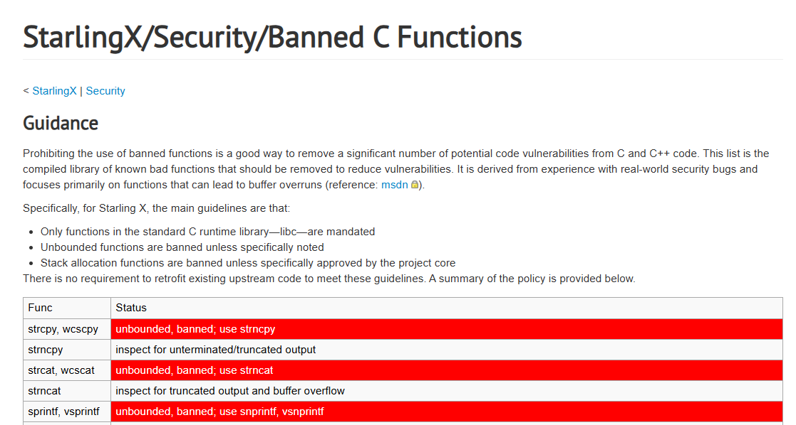

# dev-c99-github-banned-h
Date: 2025-10-03


2025-10-03 [git/banned.h at master · git/git](https://github.com/git/git/blob/master/banned.h) { github.com }

```c
#ifndef BANNED_H
#define BANNED_H

/*
 * This header lists functions that have been banned from our code base,
 * because they're too easy to misuse (and even if used correctly,
 * complicate audits). Including this header turns them into compile-time
 * errors.
 */

#define BANNED(func) sorry_##func##_is_a_banned_function

#undef strcpy
#define strcpy(x,y) BANNED(strcpy)
#undef strcat
#define strcat(x,y) BANNED(strcat)
#undef strncpy
#define strncpy(x,y,n) BANNED(strncpy)
#undef strncat
#define strncat(x,y,n) BANNED(strncat)
#undef strtok
#define strtok(x,y) BANNED(strtok)
#undef strtok_r
#define strtok_r(x,y,z) BANNED(strtok_r)

#undef sprintf
#undef vsprintf
#define sprintf(...) BANNED(sprintf)
#define vsprintf(...) BANNED(vsprintf)

#undef gmtime
#define gmtime(t) BANNED(gmtime)
#undef localtime
#define localtime(t) BANNED(localtime)
#undef ctime
#define ctime(t) BANNED(ctime)
#undef ctime_r
#define ctime_r(t, buf) BANNED(ctime_r)
#undef asctime
#define asctime(t) BANNED(asctime)
#undef asctime_r
#define asctime_r(t, buf) BANNED(asctime_r)

#endif /* BANNED_H */
```

See also:

2025-10-03 [x509cert/banned: Banned.h - deprecated C runtime functions](https://github.com/x509cert/banned) { github.com }

```c
/***
* banned.h - list of Microsoft Security Development Lifecycle (SDL) banned APIs
* Copyright (c) Microsoft Corporation. All rights reserved.
*
* Permission is hereby granted, free of charge, to any person obtaining a copy of this software
* and associated documentation files (the "Software"), to deal in the Software without 
* restriction, including without limitation the rights to use, copy, modify, merge, publish, 
* distribute, sublicense, and/or sell copies of the Software, and to permit persons to whom the
* Software is furnished to do so, subject to the following conditions:
*
* The above copyright notice and this permission notice shall be included in all copies or 
* substantial portions of the Software.
*
* THE SOFTWARE IS PROVIDED "AS IS", WITHOUT WARRANTY OF ANY KIND, EXPRESS OR IMPLIED, 
* INCLUDING BUT NOT LIMITED TO THE WARRANTIES OF MERCHANTABILITY, FITNESS FOR A PARTICULAR 
* PURPOSE AND NONINFRINGEMENT. IN NO EVENT SHALL THE AUTHORS OR COPYRIGHT HOLDERS BE LIABLE
* FOR ANY CLAIM, DAMAGES OR OTHER LIABILITY, WHETHER IN AN ACTION OF CONTRACT, TORT OR OTHERWISE,
* ARISING FROM, OUT OF OR IN CONNECTION WITH THE SOFTWARE OR THE USE OR OTHER DEALINGS IN THE 
* SOFTWARE.
*
* Purpose:
*       This include file contains a list of banned APIs which should not be used in new code and 
*       removed from legacy code over time.
*
* History
* 01-Jan-2006 - mikehow  - Initial Version
* 22-Apr-2008 - mikehow	 - Updated to SDL 4.1, commented out recommendations and added memcpy
* 26-Jan-2009 - mikehow  - Updated to SDL 5.0, made the list sane, added SDL compliance levels
* 10-Feb-2009 - mikehow  - Updated based on feedback from MS Office
* 12-May-2009 - jpardue  - Added wmemcpy
* 08-Jul-2009 - mikehow  - Fixed header #ifndef/#endif logic, made the SDL recommended compliance level name more obvious
* 05-Nov-2009 - mikehow	 - Added vsnprintf (ANSI version of _vsnprintf)
* 01-Jan-2010 - mikehow  - Added better strsafe integration, now the following works:
*							#include "strsafe.h"
*							#include "banned.h"
* 04-Jun-2010 - mikehow  - Small "#if" bug fix
* 16-Jun-2011 - mikehow	 - Added the two _CRT_SECURE_xxxxx macros
* 07-Jul-2011 - mikehow  - Bugfix when using recommended banned functions and StrSafe. Locally surpressed C4005 warnings
* 15-Jun-2012 - bryans   - Moved lstrlen to required banned; removed strlen, wcslen, _mbslen, _mbstrlen, StrLen from recommended banned
* 01-Feb-2013 - martinwo - Added license to header
* 09-Jan-2014 - mikehow  - Combined the current external and internal versions
* 10-Feb-2015 - mikehow  - Added gcc/clang support (thanks to Ramsey Dow) 
*                          Note that many of the APIs are Windows specific, however.
* 18-May-2018 - mikehow  - Updated URL for info about the auto-migrate feature in VC++
* 
***/

#ifndef _INC_BANNED
#	define _INC_BANNED

#	if defined(_MSC_VER)
#		pragma once

// Flip the 'auto-migrate' functionality in VC++
// Some functions, such as strcpy() are changed to safer functions by the compiler
// More info: https://docs.microsoft.com/en-us/cpp/c-runtime-library/secure-template-overloads
#ifndef _SDL_DONT_AUTO_FIX

#	pragma warning(push)
#	pragma warning(disable: 4005) // Turns off macro redefinition warnings

	// strcpy etc
#	define _CRT_SECURE_CPP_OVERLOAD_STANDARD_NAMES			(1)

	// memcpy etc
#	define _CRT_SECURE_CPP_OVERLOAD_STANDARD_NAMES_MEMORY	(1)

#	pragma warning(pop)

#endif

		// SDL 6.0 Requirements
#		if defined(_STRSAFE_H_INCLUDED_) && !defined(STRSAFE_NO_DEPRECATE)

			// Only deprecate what's not already deprecated by StrSafe
#			pragma deprecated (_mbscpy, _mbccpy)
#			pragma deprecated (strcatA, strcatW, _mbscat, StrCatBuff, StrCatBuffA, StrCatBuffW, StrCatChainW, _tccat, _mbccat)
#			pragma deprecated (strncpy, wcsncpy, _tcsncpy, _mbsncpy, _mbsnbcpy, StrCpyN, StrCpyNA, StrCpyNW, StrNCpy, strcpynA, StrNCpyA, StrNCpyW, lstrcpyn, lstrcpynA, lstrcpynW)
#			pragma deprecated (strncat, wcsncat, _tcsncat, _mbsncat, _mbsnbcat, lstrncat, lstrcatnA, lstrcatnW, lstrcatn)
#			pragma deprecated (IsBadWritePtr, IsBadHugeWritePtr, IsBadReadPtr, IsBadHugeReadPtr, IsBadCodePtr, IsBadStringPtr)
#			pragma deprecated (memcpy, RtlCopyMemory, CopyMemory, wmemcpy)
#			pragma deprecated (lstrlen)

#		else
			// StrSafe not loaded, so deprecate everything!
#			pragma deprecated (strcpy, strcpyA, strcpyW, wcscpy, _tcscpy, _mbscpy, StrCpy, StrCpyA, StrCpyW, lstrcpy, lstrcpyA, lstrcpyW, _tccpy, _mbccpy, _ftcscpy)
#			pragma deprecated (strcat, strcatA, strcatW, wcscat, _tcscat, _mbscat, StrCat, StrCatA, StrCatW, lstrcat, lstrcatA, lstrcatW, StrCatBuff, StrCatBuffA, StrCatBuffW, StrCatChainW, _tccat, _mbccat, _ftcscat)
#			pragma deprecated (sprintfW, sprintfA, wsprintf, wsprintfW, wsprintfA, sprintf, swprintf, _stprintf)
#			pragma deprecated (wvsprintf, wvsprintfA, wvsprintfW, vsprintf, _vstprintf, vswprintf)
#			pragma deprecated (strncpy, wcsncpy, _tcsncpy, _mbsncpy, _mbsnbcpy, StrCpyN, StrCpyNA, StrCpyNW, StrNCpy, strcpynA, StrNCpyA, StrNCpyW, lstrcpyn, lstrcpynA, lstrcpynW)
#			pragma deprecated (strncat, wcsncat, _tcsncat, _mbsncat, _mbsnbcat, StrCatN, StrCatNA, StrCatNW, StrNCat, StrNCatA, StrNCatW, lstrncat, lstrcatnA, lstrcatnW, lstrcatn)
#			pragma deprecated (gets, _getts, _gettws)
#			pragma deprecated (IsBadWritePtr, IsBadHugeWritePtr, IsBadReadPtr, IsBadHugeReadPtr, IsBadCodePtr, IsBadStringPtr)
#			pragma deprecated (memcpy, RtlCopyMemory, CopyMemory, wmemcpy)
#			pragma deprecated (lstrlen)
#		endif //defined(_STRSAFE_H_INCLUDED_) && !defined(STRSAFE_NO_DEPRECATE)

		// SDL 6.0 Recommendations
#		if defined(_SDL_BANNED_RECOMMENDED)
#			if defined(_STRSAFE_H_INCLUDED_) && !defined(STRSAFE_NO_DEPRECATE)
				// Only deprecate what's not already deprecated by StrSafe
#				pragma deprecated (wnsprintf, wnsprintfA, wnsprintfW)
#				pragma deprecated (vsnprintf, wvnsprintf, wvnsprintfA, wvnsprintfW)
#				pragma deprecated (strtok, _tcstok, wcstok, _mbstok)
#				pragma deprecated (makepath, _tmakepath,  _makepath, _wmakepath)
#				pragma deprecated (_splitpath, _tsplitpath, _wsplitpath)
#				pragma deprecated (scanf, wscanf, _tscanf, sscanf, swscanf, _stscanf, snscanf, snwscanf, _sntscanf)
#				pragma deprecated (_itoa, _itow, _i64toa, _i64tow, _ui64toa, _ui64tot, _ui64tow, _ultoa, _ultot, _ultow)
#				pragma deprecated (CharToOem, CharToOemA, CharToOemW, OemToChar, OemToCharA, OemToCharW, CharToOemBuffA, CharToOemBuffW)
#				pragma deprecated (alloca, _alloca)
#				pragma deprecated (ChangeWindowMessageFilter)
#			else
				// StrSafe not loaded, so deprecate everything!
#				pragma deprecated (wnsprintf, wnsprintfA, wnsprintfW, _snwprintf, _snprintf, _sntprintf)
#				pragma deprecated (_vsnprintf, vsnprintf, _vsnwprintf, _vsntprintf, wvnsprintf, wvnsprintfA, wvnsprintfW)
#				pragma deprecated (strtok, _tcstok, wcstok, _mbstok)
#				pragma deprecated (makepath, _tmakepath,  _makepath, _wmakepath)
#				pragma deprecated (_splitpath, _tsplitpath, _wsplitpath)
#				pragma deprecated (scanf, wscanf, _tscanf, sscanf, swscanf, _stscanf, snscanf, snwscanf, _sntscanf)
#				pragma deprecated (_itoa, _itow, _i64toa, _i64tow, _ui64toa, _ui64tot, _ui64tow, _ultoa, _ultot, _ultow)
#				pragma deprecated (CharToOem, CharToOemA, CharToOemW, OemToChar, OemToCharA, OemToCharW, CharToOemBuffA, CharToOemBuffW)
#				pragma deprecated (alloca, _alloca)
#				pragma deprecated (ChangeWindowMessageFilter)
#			endif // StrSafe
#		endif // SDL recommended

# else

# if defined __clang__
#		pragma clang system_header
# endif // __clang__

		// SDL 6.0 and later Requirements
# 		pragma GCC poison strcpy strcpyA strcpyW wcscpy _tcscpy _mbscpy StrCpy StrCpyA StrCpyW lstrcpy lstrcpyA lstrcpyW _tccpy _mbccpy _ftcscpy
#		pragma GCC poison strcat strcatA strcatW wcscat _tcscat _mbscat StrCat StrCatA StrCatW lstrcat lstrcatA lstrcatW StrCatBuff StrCatBuffA StrCatBuffW StrCatChainW _tccat _mbccat _ftcscat
#		pragma GCC poison sprintfW sprintfA wsprintf wsprintfW wsprintfA sprintf swprintf _stprintf
#		pragma GCC poison wvsprintf wvsprintfA wvsprintfW vsprintf _vstprintf vswprintf
#		pragma GCC poison strncpy wcsncpy _tcsncpy _mbsncpy _mbsnbcpy StrCpyN StrCpyNA StrCpyNW StrNCpy strcpynA StrNCpyA StrNCpyW lstrcpyn lstrcpynA lstrcpynW
#		pragma GCC poison strncat wcsncat _tcsncat _mbsncat _mbsnbcat StrCatN StrCatNA StrCatNW StrNCat StrNCatA StrNCatW lstrncat lstrcatnA lstrcatnW lstrcatn
#		pragma GCC poison gets _getts _gettws
#		pragma GCC poison IsBadWritePtr IsBadHugeWritePtr IsBadReadPtr IsBadHugeReadPtr IsBadCodePtr IsBadStringPtr
#		pragma GCC poison memcpy RtlCopyMemory CopyMemory wmemcpy
#		pragma GCC poison lstrlen

#if		defined(_SDL_BANNED_RECOMMENDED)
			// SDL 6.0 and later Recommendations
#			pragma GCC poison wnsprintf wnsprintfA wnsprintfW _snwprintf _snprintf _sntprintf
#			pragma GCC poison _vsnprintf vsnprintf _vsnwprintf _vsntprintf wvnsprintf wvnsprintfA wvnsprintfW
#			pragma GCC poison strtok _tcstok wcstok _mbstok
#			pragma GCC poison makepath _tmakepath _makepath _wmakepath
#			pragma GCC poison _splitpath _tsplitpath _wsplitpath
#			pragma GCC poison scanf wscanf _tscanf sscanf swscanf _stscanf snscanf snwscanf _sntscanf
#			pragma GCC poison _itoa _itow _i64toa _i64tow _ui64toa _ui64tot _ui64tow _ultoa _ultot _ultow
#			pragma GCC poison CharToOem CharToOemA CharToOemW OemToChar OemToCharA OemToCharW CharToOemBuffA CharToOemBuffW
#			pragma GCC poison alloca _alloca
#			pragma GCC poison ChangeWindowMessageFilter

#		endif
#	endif // _MSC_VER_
#endif  // _INC_BANNED 
```

2025-10-03 [StarlingX/Security/Banned C Functions - OpenStack](https://wiki.openstack.org/wiki/StarlingX/Security/Banned_C_Functions) { wiki.openstack.org }

> 

Prohibiting the use of banned functions is a good way to remove a significant number of potential code vulnerabilities from C and C++ code. This list is the compiled library of known bad functions that should be removed to reduce vulnerabilities. It is derived from experience with real-world security bugs and focuses primarily on functions that can lead to buffer overruns (reference: [msdn](https://msdn.microsoft.com/en-us/library/bb288454.aspx)).

Specifically, for Starling X, the main guidelines are that:

- Only functions in the standard C runtime library—libc—are mandated
- Unbounded functions are banned unless specifically noted
- Stack allocation functions are banned unless specifically approved by the project core

There is no requirement to retrofit existing upstream code to meet these guidelines. A summary of the policy is provided below.

| Func                           | Status                                                       |
| ------------------------------ | ------------------------------------------------------------ |
| strcpy, wcscpy                 | unbounded, **banned**; use strncpy                           |
| strncpy                        | inspect for unterminated/truncated output                    |
| strcat, wcscat                 | unbounded, **banned**; use strncat                           |
| strncat                        | inspect for truncated output and buffer overflow             |
| sprintf, vsprintf              | unbounded, **banned**; use snprintf, vsnprintf               |
| snprintf                       | inspect for result fitting in buffer: snprintf(buf, size, ...) < size |
| vsnprintf                      | **banned** except with approval from core. requires detailed inspection to avoid va_list pitfalls.vsnprint() is typically used for custom logging functionality. Given the flexibility of this function, it is easy to mismatch data types pushed on the stack for a va-list function and types pulled from the stack by the function. The core needs to ensure that the format matches the variables passed to avoid mismatches. |
| strtok                         | unbounded, **banned**; use strtok_r or strsep                |
| strtok_r, strsep               | Inspect for terminated input buffer                          |
| scanf, sscanf, vscanf, vsscanf | **banned** except with approval of core. Requires detailed inspection to ensure field widths are specified. For unknown inputs, it is recommended to use strto* functions to avoid arithmetic overflows. |
| gets                           | unbounded, **banned**, use fgets() instead                   |
| ato*                           | **banned**, use equivalent strto* functions                  |
| *toa                           | Non-standard, inspect for output buffer length; prefer snprintf |
| strlen, wcslen                 | **banned** except static strings; use strnlen with max length constant |
| memcpy, memmove                | allowed                                                      |
| alloca                         | **banned** except with approval of core. Requires detailed inspection to avoid stack overflow. In general, it is preferable to allocate from the heap using malloc() or calloc().alloca() returns a pointer to a buffer located on the current thread's stack vs. the heap like malloc(). It's often used in cases where performance is especially important, but data length is unknown beforehand, because allocation is a simple matter of moving the stack pointer for the currently executing function. The dangers of using alloca() are stack space exhaustion or a buffer overflow which corrupts local variables.If alloca() is used, the designer needs to understand that:alloca() makes no guarantees about alignment and in most cases provides no overflow canaries that may exist in heap buffersNever use alloca() in a loop where the bounds are not known beforehand. There is no ability to free memory allocated with alloca() unless you return from the function. If a long function continually calls alloca() in a loop, there is a high risk of stack exhaustion.The conversion of alloca() to malloc() or calloc() requires a free() calls to be added as well |


## String handling functions

String routines that copy or concatenate omit length checks. Functions like `strcpy` and `strcat` always trust the caller to allocate enough space. See [StarlingX banned C functions](https://wiki.openstack.org/wiki/StarlingX/Security/Banned_C_Functions) and why even “bounded” variants can still bite. For example, `strncpy` does not guarantee a trailing `\0` if the source is at least `n` bytes, and it pads with zeros. See [Klocwork notes on banned and recommended APIs](https://help.klocwork.com/2024/en-us/reference/sv.banned.recommended.numeric.htm). Prefer explicit length checks and safer patterns.

| Function  | Issue, safer alternative                                     |
| --------- | ------------------------------------------------------------ |
| `strcpy`  | Copies without a size check, can overflow. Ensure capacity or use a length aware copy. |
| `strncpy` | May not append `\0` when the source length is at least `n`, can truncate silently. Add explicit terminator or use a checked copy. |
| `strcat`  | Appends without a size check, can overflow. Compute remaining space and use a bounded append. |
| `strncat` | The count is the remaining capacity, not the source length, easy to misuse. Compute remaining space first. |
| `strtok`  | Modifies the input buffer and uses hidden global state, not thread safe. Use a reentrant tokenizer or manual parsing. |

------

### Examples

#### `strcpy`

```c
// Failure example: strcpy overflows when the destination is too small.
#include <stdio.h>
#include <string.h>

int main(void) {
    char dst[8];
    const char *src = "too-long"; // 8 chars including '\0' would fit exactly, add 1 more to overflow
    src = "definitely-longer";    // longer than dst

    // Undefined behavior, writes past dst
    strcpy(dst, src);

    printf("dst: %s\n", dst); // may crash or corrupt memory
    return 0;
}
// Avoidance example: check lengths and copy with an explicit bound and terminator.
#include <stdio.h>
#include <string.h>

int main(void) {
    char dst[8];
    const char *src = "definitely-longer";
    size_t cap = sizeof dst;

    size_t need = strlen(src) + 1;          // include '\0'
    if (need > cap) {
        // truncate safely
        size_t to_copy = cap - 1;
        memcpy(dst, src, to_copy);
        dst[to_copy] = '\0';
    } else {
        memcpy(dst, src, need);
    }

    printf("dst: %s\n", dst);
    return 0;
}
```

#### `strncpy`

```c
// Failure example: strncpy may omit the trailing '\0' when source length >= n.
#include <stdio.h>
#include <string.h>

int main(void) {
    char dst[5];
    const char *src = "ABCDE"; // length 5, no room for '\0' if n == 5

    strncpy(dst, src, sizeof dst); // no guarantee of '\0'
    // dst is not necessarily null terminated here

    // Using dst as a C string now is undefined behavior
    printf("dst: %s\n", dst); // may read past dst
    return 0;
}
// Avoidance example: copy up to cap-1 and append '\0' yourself.
#include <stdio.h>
#include <string.h>

int main(void) {
    char dst[5];
    const char *src = "ABCDE";

    size_t cap = sizeof dst;
    size_t to_copy = strlen(src);
    if (to_copy >= cap) to_copy = cap - 1;

    memcpy(dst, src, to_copy);
    dst[to_copy] = '\0';

    printf("dst: %s\n", dst);
    return 0;
}
```

#### `strcat`

```c
// Failure example: strcat overflows when the buffer cannot hold the result.
#include <stdio.h>
#include <string.h>

int main(void) {
    char buf[8] = "abc";
    const char *add = "defghi"; // result would need 3 + 6 + 1 = 10 bytes

    // Undefined behavior, writes past buf
    strcat(buf, add);

    printf("buf: %s\n", buf); // may crash or corrupt memory
    return 0;
}
// Avoidance example: compute remaining space and append at most that many chars.
#include <stdio.h>
#include <string.h>

int main(void) {
    char buf[8] = "abc";
    const char *add = "defghi";

    size_t used = strlen(buf);
    size_t cap = sizeof buf;
    if (used < cap) {
        size_t rem = cap - used - 1;       // space left for new chars
        size_t to_copy = strlen(add);
        if (to_copy > rem) to_copy = rem;  // truncate if needed
        memcpy(buf + used, add, to_copy);
        buf[used + to_copy] = '\0';
    }

    printf("buf: %s\n", buf);
    return 0;
}
```

#### `strncat`

```c
// Failure example: passing sizeof(buf) instead of remaining space causes overflow.
#include <stdio.h>
#include <string.h>

int main(void) {
    char buf[8] = "abc";
    const char *add = "def";

    // Wrong: count should be remaining capacity, not total size
    strncat(buf, add, sizeof buf); // may write past buf due to internal scan

    printf("buf: %s\n", buf); // undefined behavior possible
    return 0;
}
// Avoidance example: compute remaining space before calling strncat, or append manually.
#include <stdio.h>
#include <string.h>

int main(void) {
    char buf[8] = "abc";
    const char *add = "def";

    size_t used = strlen(buf);
    size_t cap = sizeof buf;
    size_t rem = (used < cap) ? (cap - used - 1) : 0;

    strncat(buf, add, rem); // safe when rem is computed as remaining space

    printf("buf: %s\n", buf);
    return 0;
}
```

#### `strtok`

```c
// Failure example: strtok modifies the buffer and uses hidden global state.
#include <stdio.h>
#include <string.h>

int main(void) {
    char data[] = "a,b,c";
    // strtok writes '\0' into data and keeps static state
    char *tok = strtok(data, ",");
    while (tok) {
        printf("[%s]\n", tok);
        tok = strtok(NULL, ",");
    }
    // Original string is now "a\0b\0c", the commas are gone
    printf("original mutated: %s\n", data); // prints "a"
    return 0;
}
// Avoidance example: do not mutate the original, parse with strchr on a read-only source.
#include <stdio.h>
#include <string.h>

static void split_commas(const char *s) {
    const char *p = s;
    while (p && *p) {
        const char *comma = strchr(p, ',');
        size_t len = comma ? (size_t)(comma - p) : strlen(p);
        // Print token without modifying the source
        printf("[%.*s]\n", (int)len, p);
        p = comma ? comma + 1 : NULL;
    }
}

int main(void) {
    const char *data = "a,b,c";
    split_commas(data);
    // data remains unchanged and the function is reentrant
    printf("original intact: %s\n", data);
    return 0;
}
```


## Formatted output functions

Functions like `sprintf` and `vsprintf` write formatted text into a buffer without any length limit. If the result exceeds the buffer, the write overflows. Prefer `snprintf` or `vsnprintf`, and check the return value. 

| Function   | Issue, safer alternative                                   |
| ---------- | ---------------------------------------------------------- |
| `sprintf`  | Writes without a size limit, can overflow. Use `snprintf`. |
| `vsprintf` | Same issue with varargs. Use `vsnprintf`.                  |

------

### Examples

#### `sprintf`

```c
// Failure example: sprintf overflows when the result does not fit.
#include <stdio.h>
#include <string.h>

int main(void) {
    char buf[8];
    const char *name = "charlie"; // 7 chars

    // Needs at least 7 + 6 + 1 bytes for "user: " + name + '\0'
    // Writes past buf, causes undefined behavior
    sprintf(buf, "user: %s", name);

    printf("%s\n", buf); // may crash or corrupt memory
    return 0;
}
// Avoidance example: use snprintf and check for truncation.
#include <stdio.h>
#include <string.h>

int main(void) {
    char buf[8];
    const char *name = "charlie";

    int n = snprintf(buf, sizeof buf, "user: %s", name);
    if (n < 0) {
        // formatting error
        return 1;
    }
    if ((size_t)n >= sizeof buf) {
        // truncated, handle or resize
        puts("truncated");
    } else {
        puts(buf);
    }
    return 0;
}
// Avoidance example: compute required size, then allocate.
#include <stdio.h>
#include <stdlib.h>

int main(void) {
    const char *name = "charlie";
    int need = snprintf(NULL, 0, "user: %s", name);
    if (need < 0) return 1;

    char *buf = malloc((size_t)need + 1);
    if (!buf) return 1;

    snprintf(buf, (size_t)need + 1, "user: %s", name);
    puts(buf);
    free(buf);
    return 0;
}
```

#### `vsprintf`

```c
// Failure example: helper that forwards to vsprintf without bounds.
#include <stdio.h>
#include <stdarg.h>

static int format_into(char *dst, const char *fmt, ...) {
    va_list ap;
    va_start(ap, fmt);
    // No size, writes past dst if output is too large
    int n = vsprintf(dst, fmt, ap);
    va_end(ap);
    return n;
}

int main(void) {
    char buf[16];
    format_into(buf, "id=%d name=%s", 42, "a-very-long-user-name");
    puts(buf); // undefined behavior possible
    return 0;
}
// Avoidance example: safe wrapper that uses vsnprintf and checks the result.
#include <stdio.h>
#include <stdarg.h>
#include <string.h>

static int vformat_into(char *dst, size_t cap, const char *fmt, va_list ap) {
    int n = vsnprintf(dst, cap, fmt, ap);
    if (n < 0) return -1;                 // formatting error
    if ((size_t)n >= cap) return n;       // truncated, caller may reallocate
    return n;                              // success
}

static int format_into(char *dst, size_t cap, const char *fmt, ...) {
    va_list ap;
    va_start(ap, fmt);
    int n = vformat_into(dst, cap, fmt, ap);
    va_end(ap);
    return n;
}

int main(void) {
    char buf[16];
    int n = format_into(buf, sizeof buf, "id=%d name=%s", 42, "bob");
    if (n < 0) return 1;
    if ((size_t)n >= sizeof buf) {
        puts("truncated");
    } else {
        puts(buf);
    }
    return 0;
}
```


## Input parsing functions

`gets` reads a line with no limit. C11 removed it. `scanf` and friends read unbounded text for `%s` or scansets like `%[...]` unless you include a field width. Prefer `fgets`, or always specify a maximum width.

| Function                         | Issue, safer alternative                                     |
| -------------------------------- | ------------------------------------------------------------ |
| `gets`                           | Reads until newline with no limit, overflows. Use `fgets(buf, n, stdin)`. |
| `scanf` / `sscanf` with `%s`     | No width means unbounded read. Use `"%Ns"` with the correct `N`, or `fgets`. |
| `scanf` / `sscanf` with `%[...]` | No width means unbounded read. Use `"%N[...]"` with the correct `N`, or `fgets`. |

------

### Examples

#### `gets`

```c
// Failure example: gets overflows when the input line exceeds the buffer.
#include <stdio.h>

int main(void) {
    char buf[8];

    // Dangerous: reads an arbitrarily long line into buf
    // Any input > 7 chars plus '\0' will overflow
    gets(buf); // removed in C11, undefined behavior in practice

    printf("read: %s\n", buf);
    return 0;
}
// Avoidance example: use fgets with an explicit bound and strip the newline.
#include <stdio.h>
#include <string.h>

int main(void) {
    char buf[8];

    if (fgets(buf, sizeof buf, stdin)) {
        // Remove trailing '\n' if present
        buf[strcspn(buf, "\n")] = '\0';
        printf("read: %s\n", buf);
    }
    return 0;
}
```

#### `scanf` with `%s`

```c
// Failure example: scanf("%s") overflows when the word is longer than the array.
#include <stdio.h>

int main(void) {
    char name[8];

    // If the user types "alexandria", this writes past name
    printf("name: ");
    if (scanf("%s", name) == 1) { // no width, unbounded
        printf("got: %s\n", name);
    }
    return 0;
}
// Avoidance example: add a width that leaves space for the '\0'.
#include <stdio.h>

int main(void) {
    char name[8];

    // Width is capacity - 1. Here, 7.
    printf("name: ");
    if (scanf("%7s", name) == 1) {
        printf("got: %s\n", name);
    }
    return 0;
}
// Avoidance example: prefer fgets, then parse if needed.
#include <stdio.h>
#include <string.h>

int main(void) {
    char line[32];
    char name[8];

    printf("name: ");
    if (fgets(line, sizeof line, stdin)) {
        line[strcspn(line, "\n")] = '\0';
        // Parse with a bounded conversion, or copy safely
        // Here we just take up to 7 chars
        size_t n = strlen(line);
        if (n > sizeof name - 1) n = sizeof name - 1;
        memcpy(name, line, n);
        name[n] = '\0';
        printf("got: %s\n", name);
    }
    return 0;
}
```

#### `sscanf` with scanset `%[...]`

```c
// Failure example: scanset without width reads until delimiter, unbounded.
#include <stdio.h>

int main(void) {
    const char *input = "toolongvalue,rest";
    char field[8];

    // Reads everything up to ',' into field with no bound, overflows field
    if (sscanf(input, "%[^,]", field) == 1) {
        printf("field: %s\n", field);
    }
    return 0;
}
// Avoidance example: add a width to scanset to cap the write.
#include <stdio.h>

int main(void) {
    const char *input = "toolongvalue,rest";
    char field[8];

    // Width is capacity - 1. Here, 7.
    if (sscanf(input, "%7[^,]", field) == 1) {
        printf("field: %s\n", field);
    } else {
        puts("no match or truncated");
    }
    return 0;
}
```

#### `fscanf` and partial reads

```c
// Failure example: fscanf("%s") can leave unread input and overflow the target.
#include <stdio.h>

int main(void) {
    char user[8];
    char rest[8];

    // Input: "verylongusername data"
    // First read may overflow user, and the space-delimited remainder stays buffered
    if (fscanf(stdin, "%s", user) == 1 &&
        fscanf(stdin, "%7s", rest) == 1) {
        printf("user=%s rest=%s\n", user, rest);
    }
    return 0;
}
// Avoidance example: read a whole line with fgets, then parse with widths.
#include <stdio.h>
#include <string.h>

int main(void) {
    char line[64];
    char user[8], rest[8];

    if (fgets(line, sizeof line, stdin)) {
        line[strcspn(line, "\n")] = '\0';
        // Both fields bounded, no buffer overrun
        if (sscanf(line, "%7s %7s", user, rest) == 2) {
            printf("user=%s rest=%s\n", user, rest);
        }
    }
    return 0;
}
```


## Numeric conversion functions

`atoi`, `atof`, `atol`, and `atoll` do not report errors or overflow. Invalid input and out-of-range values look the same as valid zeros or wrapped results. Prefer `strtol`, `strtoll`, and `strtod`, which let you detect errors. See [SEI CERT MSC24-C](https://wiki.sei.cmu.edu/confluence/display/c/MSC24-C.+Do+not+use+deprecated+or+obsolescent+functions).

| Function         | Issue, safer alternative                                     |
| ---------------- | ------------------------------------------------------------ |
| `atoi`           | No error reporting, overflow is undefined. Use `strtol`.     |
| `atol` / `atoll` | Same problem for long types. Use `strtol` or `strtoll`.      |
| `atof`           | No error reporting, cannot tell NaN or overflow. Use `strtod`. |

------

### Examples

#### `atoi`

```c
// Failure example: atoi cannot report errors or overflow.
#include <stdio.h>
#include <stdlib.h>

int main(void) {
    const char *s1 = "not-a-number";
    const char *s2 = "9999999999999999999999"; // may overflow int

    int a = atoi(s1); // returns 0, same as a valid "0", error is silent
    int b = atoi(s2); // overflow, result is undefined

    printf("a=%d b=%d\n", a, b);
    return 0;
}
// Avoidance example: use strtol with endptr and errno checks.
#include <stdio.h>
#include <stdlib.h>
#include <errno.h>
#include <limits.h>

static int parse_int(const char *s, int *out) {
    errno = 0;
    char *end = NULL;
    long v = strtol(s, &end, 10);
    if (end == s) return -1;                 // no digits
    if (*end != '\0') return -1;             // trailing junk
    if ((errno == ERANGE) || v < INT_MIN || v > INT_MAX) return -1; // overflow
    *out = (int)v;
    return 0;
}

int main(void) {
    int x;
    if (parse_int("123", &x) == 0) printf("ok %d\n", x);
    if (parse_int("9999999999999999999999", &x) != 0) puts("overflow detected");
    if (parse_int("not-a-number", &x) != 0) puts("invalid detected");
    return 0;
}
```

#### `atol` and `atoll`

```c
// Failure example: atol and atoll also hide errors and overflow.
#include <stdio.h>
#include <stdlib.h>

int main(void) {
    const char *s = "18446744073709551616"; // larger than 2^64
    long l = atol(s);    // overflow, undefined result
    long long ll = atoll(s); // overflow, undefined result
    printf("l=%ld ll=%lld\n", l, ll);
    return 0;
}
// Avoidance example: use strtoll with range checks.
#include <stdio.h>
#include <stdlib.h>
#include <errno.h>
#include <limits.h>

static int parse_long_long(const char *s, long long *out) {
    errno = 0;
    char *end = NULL;
    long long v = strtoll(s, &end, 10);
    if (end == s) return -1;          // no digits
    if (*end != '\0') return -1;      // trailing junk
    if (errno == ERANGE) return -1;   // overflow or underflow
    *out = v;
    return 0;
}

int main(void) {
    long long y;
    if (parse_long_long("9223372036854775807", &y) == 0) printf("ok %lld\n", y);
    if (parse_long_long("9223372036854775808", &y) != 0) puts("overflow detected");
    return 0;
}
```

#### `atof`

```c
// Failure example: atof cannot distinguish invalid input from 0.0 and hides overflow.
#include <stdio.h>
#include <stdlib.h>

int main(void) {
    const char *a = "abc";    // invalid
    const char *b = "0";      // valid zero
    const char *c = "1e5000"; // overflow to infinity on many libs

    double x = atof(a); // returns 0.0, same as valid "0"
    double y = atof(b); // returns 0.0
    double z = atof(c); // may be HUGE_VAL, but no errno or endptr available here

    printf("x=%f y=%f z=%f\n", x, y, z);
    return 0;
}
// Avoidance example: use strtod, check endptr and errno for range errors.
#include <stdio.h>
#include <stdlib.h>
#include <errno.h>
#include <math.h>

static int parse_double(const char *s, double *out) {
    errno = 0;
    char *end = NULL;
    double v = strtod(s, &end);
    if (end == s) return -1;         // no digits
    if (*end != '\0') return -1;     // trailing junk
    if (errno == ERANGE) return -1;  // underflow or overflow
    *out = v;
    return 0;
}

int main(void) {
    double d;
    if (parse_double("3.14159", &d) == 0) printf("ok %f\n", d);
    if (parse_double("1e5000", &d) != 0) puts("overflow detected");
    if (parse_double("abc", &d) != 0) puts("invalid detected");
    return 0;
}
```

