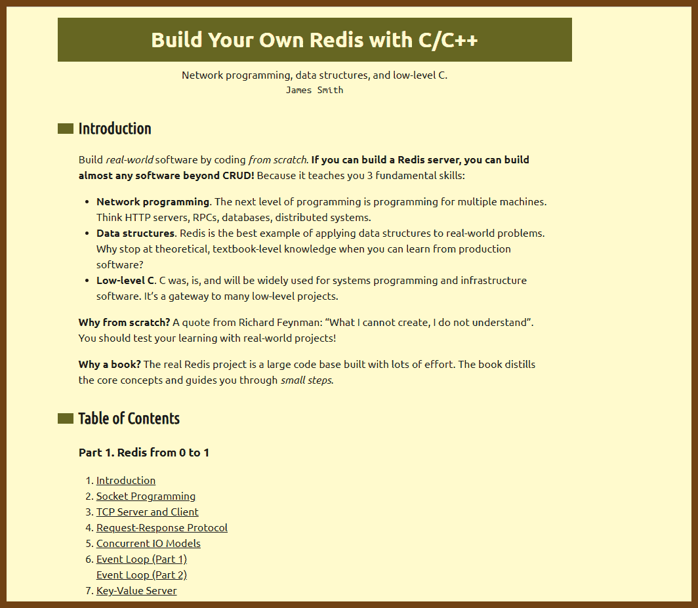
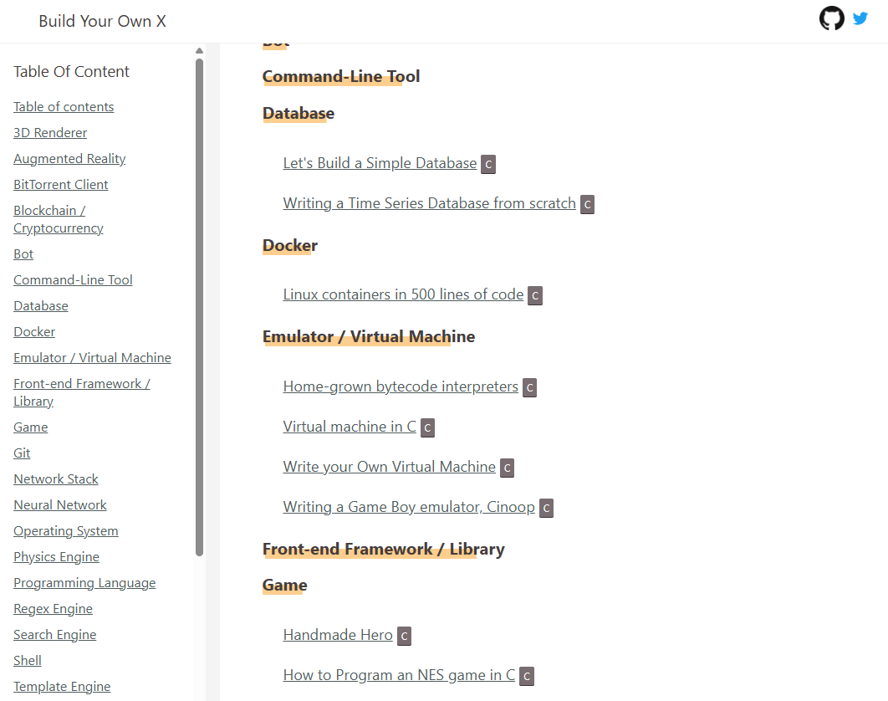

# dev-c99-recreational-programming
Date: 2025-08-10


## Tips for Structuring Your Recreational Programming Journey

**Learn, then build**
Follow a tutorial to learn a concept. Then make a small project that uses it. Build a tiny shell from a guide, then add piping on your own. Do a mini database tutorial, then write a simple key value store yourself.


**Ship in small steps**
Break projects into stages. Set clear milestones. For a text editor: open and show a file, edit text, save to disk, then add syntax highlighting. Keep the app runnable after each step to get fast feedback.


**Iterate and refactor**
 Write the simple version first. Expect to change it as you learn. Replace rough code with a cleaner design. It is fine to throw code away. You are here to learn, not hit a deadline.


**Keep a log**
Write a short note after each session. What you tried, what broke, how you fixed it. These notes reinforce learning and help future you. They also make easy README or blog posts that can help others.


**Mix your project types**
Do not stick to one domain. Try a system tool, then a small graphics demo with SDL or OpenGL, then a network app. A chat server with Berkeley sockets is a good next step. Beej’s Guide can help.


**Use modern C and tools**
Prefer C99 or C11. Use `stdint.h` types. Avoid unsafe calls like `gets()`. Use `gdb` or `lldb`, and address sanitizers to catch memory bugs early.


**Keep perspective**
Big hobby projects can look scary. Everyone starts small. It is okay to repeat classic projects. The point is to learn. As Brian Kernighan said, "the best way to learn a new programming language is to write programs in it." Celebrate small wins and enjoy the process.


## Compilers

[**bellard.org/tcc/: Tiny C Compiler (TCC) by Fabrice Bellard**](https://bellard.org/tcc/)

Tiny C Compiler (TCC) is a compact (~100 KB) standalone C compiler that combines preprocessing, compiling, assembling, and linking in one tool. It supports ANSI C (C89/C90), much of C99, and GNU C extensions including inline assembly, and can operate without external toolchains. TCC compiles, assembles, and links roughly nine times faster than GCC.

It includes optional memory and bounds checking that can be mixed seamlessly with regular C code. TCC scripts can be executed directly with `tcc -run` plus a shebang line. It is embeddable through `libtcc`, enabling dynamic code generation and execution.

Example usage:

```c
#!/usr/local/bin/tcc -run
#include <stdio.h>

int main() {
    printf("Hello, TCC!\n");
    return 0;
}
```

This runs the C code in one step—compile and execute—without manual linking.


## Programmers! 

**[How I program C - YouTube](https://www.youtube.com/watch?v=443UNeGrFoM) { www.youtube.com } - Eskil Steenberg**

**Advanced C: control over convenience**

A brief, distillation of a video transcript by Eskil Steenberg. The talk is aimed at experienced programmers who have heard that C is hard or dated. The thesis is simple: in the beginning you want results; in the end you want control. C gives you control. Embrace it.

**Core ideas**

- Embrace complexity you will eventually need. Avoid magic you cannot steer.
- Keep the tech footprint tiny. Target C89 portability. Wrap every dependency.
- Be explicit. Clarity beats cleverness. Prefer readable code and compiler errors over hidden behavior.
- Long, sequential code is fine when it improves state clarity. Fewer indirections, fewer surprises.
- Names should be long and regular: `module_object_action`. Pair opposites: `create` vs `destroy`.
- Crash loud in debug. Silence hides bugs. Tools + assertions are your friends.
- Build tools around a simple language. Own your stack. Build a mountain.

**What C can do: focused examples**

**Opaque handles: object-oriented C without the lies**

Public header exposes only a handle and functions. Internals stay private and free to change.

```c
/* public.h */
typedef void *io_stream;            /* opaque handle */

io_stream io_stream_create_tcp(const char *host, int port);
void      io_stream_send_all(io_stream s);
void      io_stream_destroy(io_stream s);

/* internal.c */
typedef struct {
    int sock;
    /* buffers, counters, whatever */
} stream_impl;

io_stream io_stream_create_tcp(const char *host, int port) {
    stream_impl *s = malloc(sizeof *s);
    /* connect... */
    return (io_stream)s;
}

void io_stream_send_all(io_stream h) {
    stream_impl *s = (stream_impl *)h;
    /* send pending bytes */
}

void io_stream_destroy(io_stream h) {
    stream_impl *s = (stream_impl *)h;
    /* close sock */
    free(s);
}
```

Why this matters: encapsulation without runtime overhead, ABI stability, freedom to rewrite internals.

**Debug memory like you mean it: wrap allocators with file+line**

Crashes are good. Precision is better. Track where bytes came from and where they were freed.

```c
/* memdbg.h */
void *dbg_malloc_impl(size_t n, const char *file, int line);
void *dbg_realloc_impl(void *p, size_t n, const char *file, int line);
void  dbg_free_impl(void *p, const char *file, int line);
void  dbg_report_leaks(void);

#define malloc(n)      dbg_malloc_impl((n), __FILE__, __LINE__)
#define realloc(p,n)   dbg_realloc_impl((p),(n), __FILE__, __LINE__)
#define free(p)        dbg_free_impl((p), __FILE__, __LINE__)
```

Inside `dbg_*` keep a table of allocations, over-allocate with a guard word, and verify guards to catch overruns. At exit, print where leaks came from with exact file:line.

**`sizeof *ptr`: allocations that cannot go stale**

Types change. This does not.

```c
double *a = NULL;
a = malloc(10 * sizeof *a);   /* correct even if a later becomes float* */
```

**Pointer iteration beats index math**

Let the type system stride for you.

```c
uint8_t *p = buf, *end = buf + n;
for (; p != end; ++p) *p = 0;      /* avoids repeated index*stride */
```

**Layout literacy: padding and order**

Order members to minimize padding and keep arrays tight.

```c
/* bad: wastes space on many ABIs */
struct Bad { uint8_t a; uint32_t b; uint8_t c; };

/* better: pack smalls together, then bigs */
struct Good { uint8_t a, c, pad[2]; uint32_t b; };
```

**One allocation for header + data: flexible arrays**

Keep related data contiguous for cache wins.

```c
typedef struct {
    size_t len;
    int    data[];         /* C99 flexible array */
} int_vec;

int_vec *v = malloc(sizeof *v + count * sizeof v->data[0]);
v->len = count;
```

**Dynamic arrays where `realloc` shines**

Make `realloc` rare, but do not fear it. Contiguity pays for itself.

```c
typedef struct { size_t len, cap; int *data; } vec;

static void vec_push(vec *v, int x) {
    if (v->len == v->cap) {
        v->cap = v->cap ? v->cap * 2 : 16;
        v->data = realloc(v->data, v->cap * sizeof *v->data);
    }
    v->data[v->len++] = x;
}
```

**Stride makes APIs universal**

Operate over RGB, RGBA, or structs without copies.

```c
void brighten_u8(uint8_t *rgb, size_t count, size_t stride, uint8_t add) {
    for (size_t i = 0; i < count; ++i) {
        rgb[0] = (uint8_t)(rgb[0] + add);
        rgb[1] = (uint8_t)(rgb[1] + add);
        rgb[2] = (uint8_t)(rgb[2] + add);
        rgb += stride;     /* 3 for RGB, 4 for RGBA, sizeof(struct Pix) for AoS */
    }
}
```

**Header first: simple inheritance**

A shared header lets you pass many concrete types through one API without vtables.

```c
typedef enum { ET_block, ET_collider, ET_character } entity_kind;

typedef struct {
    entity_kind kind;
    float       pos[3];
    int         id;
} entity_head;

typedef struct { entity_head h; int material; } block;
typedef struct { entity_head h; float radius; } collider;

void entity_move(entity_head *e, float dx, float dy, float dz) {
    e->pos[0] += dx; e->pos[1] += dy; e->pos[2] += dz;
}

void entity_debug(entity_head *e) {
    switch (e->kind) {
    case ET_block:    /* cast safely: header is first */
        printf("block id=%d\n", ((block *)e)->h.id);
        break;
    case ET_collider:
        printf("collider r=%f\n", ((collider *)e)->radius);
        break;
    default: break;
    }
}
```

**Binary packing that debugs itself**

Name your fields in debug builds; scream when order or type is wrong.

```c
/* pack.h */
void pack_u32(void *dst, uint32_t v, const char *name, const char *file, int line);
void unpack_u32(const void *src, uint32_t *v, const char *expect_name, const char *file, int line);
#define PACK_U32(d,v,name)   pack_u32((d),(v),(name), __FILE__, __LINE__)
#define UNPACK_U32(s,v,name) unpack_u32((s),(v),(name), __FILE__, __LINE__)
```

On mismatch, print: file:line expected u32 "health", found f32 "alpha". Bugs die fast.

**UI without ceremony: pointer-as-ID**

A single function can draw and handle input if you key state by a stable pointer.

```c
typedef struct { int phase; int mouse_x, mouse_y; int mouse_down; } ui_in;

/* The address of label acts as the unique ID for this button instance. */
bool ui_button(ui_in *in, const char *label, float x, float y) {
    void *id = (void *)label;   /* any stable pointer works */
    /* internally: remember last rect for id; on input phase, hit-test; on draw, render */
    /* return true if clicked and not occluded by later draws */
    /* ... */
    return false;
}
```

You do not pass handles around. The library uses the pointer to find its own stored state across phases.

**Name like you mean it**

Prefer width over brevity.

- Types: `ImageReader`, `HashMap`.
- Functions: `image_reader_open`, `image_reader_read`, `image_reader_close`.
- Pair actions: `create` vs `destroy`, `load` vs `unload`, never `create` vs `remove`.

**Crash early, crash loud**

If it is wrong, stop there with context.

```c
#define REQUIRE(x) do { if (!(x)) { \
    fprintf(stderr, "require failed: %s at %s:%d\n", #x, __FILE__, __LINE__); \
    abort(); } } while (0)
```

**Performance truths you can use today**

- Memory is slow; math is fast. Optimize for cache, not for CPU flops.
- Arrays beat linked lists for traversal. Contiguity wins.
- Reorder struct members to reduce size; smaller objects mean more cache residency.
- Avoid storing derivable data twice unless you can enforce consistency behind an API.

**How to think like this**

- Start with the interface. Implement internals later.
- Keep the language simple; build tools to amplify it.
- Fix code now. Technical debt compounds.
- Build a mountain: reusable libraries under small apps. Own the hard parts.


[**Tsoding Daily — YouTube Channel**](https://www.youtube.com/@TsodingDaily)

A channel by Tsoding featuring live coding streams and videos focused on building projects from scratch, experimenting with algorithms, implementing tools in C and other languages, exploring low-level programming, and working through game and graphics development challenges. Sessions often include problem-solving in real time, code refactoring, performance tuning, and occasional forays into esoteric programming concepts.


[**brennan.io/projects: Stephen Brennan**](https://brennan.io/projects/)

- [brenns10/cbot: CBot - IRC bot in C](https://github.com/brenns10/cbot)
  Loads plugins as shared libraries, stores plugin state in SQL, and uses cooperative threading to handle IRC I/O alongside tasks like HTTP requests.

- [brenns10/sos: SOS - minimal 32-bit ARM OS](https://github.com/brenns10/sos)
  Implements isolated processes, preemptive multitasking, and early FAT filesystem support, targeting Raspberry Pi and QEMU.

- [brenns10/minesweeper: Minesweeper in C](https://github.com/brenns10/minesweeper)
  Minesweeper playable via CLI, GTK, or ncurses, including an interactive solver.

- [funlisp: Lisp interpreter in C89](https://sr.ht/~brenns10/funlisp)
  Portable Lisp interpreter for POSIX systems, implemented in compact and readable C89.

- [brenns10/kchat: KChat kernel module](https://github.com/brenns10/kchat)
  Kernel module that creates a device file for real-time chat between processes.

- [brenns10/sshell: A Simple Shell in C](https://github.com/brenns10/sshell)
  Minimal shell showcasing parsing, built-ins, and process launching.

- [brenns10/tetris: Tetris in C](https://github.com/brenns10/tetris)
  Ncurses terminal Tetris clone with gravity, rotation, wall-kick, scoring, levels, pause, and save/load.

- [brenns10/libstephen: Libstephen](https://github.com/brenns10/libstephen)
  C library with data structures, argument parsing, regex, logging, and testing.

- [brenns10/nosj: NOSJ](https://github.com/brenns10/nosj)
  Lightweight JSON parser in C with a focus on clarity and simplicity.


2025-11-25 [Build Your Own Redis with C/C++ | Build Your Own Redis with C/C++](https://build-your-own.org/redis/) { build-your-own.org }

> 

2025-10-03 [Build Your Own X](https://build-your-own-x.vercel.app/) {build-your-own-x.vercel.app}

> This repo is forked from awesome [anistefanovic/build-your-own-x](https://github.com/danistefanovic/build-your-own-x) , site is created and maintained by [Kalan](https://github.com/kjj6198/build-your-own-x) which converted github README.md to website, and probably will add more opinionated resource.
> Follow me on [Twitter](https://build-your-own-x.vercel.app/twitter.com/kalanyei) or contibute your article link on [Github](https://github.com/kjj6198/build-your-own-x) is always welcomed!
> 

> - [Let's Build a Simple Database](https://cstack.github.io/db_tutorial/)
> - [Writing a Time Series Database from scratch](https://web.archive.org/web/20210803115658/https://fabxc.org/tsdb/)
> - [Linux containers in 500 lines of code](https://blog.lizzie.io/linux-containers-in-500-loc.html)
> - [Home-grown bytecode interpreters](https://medium.com/bumble-tech/home-grown-bytecode-interpreters-51e12d59b25c)
> - [Virtual machine in C](http://web.archive.org/web/20200121100942/https://blog.felixangell.com/virtual-machine-in-c/)
> - [Writing a Game Boy emulator, Cinoop](https://cturt.github.io/cinoop.html)
> - [Handmade Hero](https://handmadehero.org/)
> - [How to Program an NES game in C](https://nesdoug.com/)
> - [Chess Engine In C](https://www.youtube.com/playlist?list=PLZ1QII7yudbc-Ky058TEaOstZHVbT-2hg)
> - [Let's Make: Dangerous Dave](https://www.youtube.com/playlist?list=PLSkJey49cOgTSj465v2KbLZ7LMn10bCF9)
> - [Learn Video Game Programming in C](https://www.youtube.com/playlist?list=PLT6WFYYZE6uLMcPGS3qfpYm7T_gViYMMt)
> - [Coding A Sudoku Solver in C](https://www.youtube.com/playlist?list=PLkTXsX7igf8edTYU92nU-f5Ntzuf-RKvW)
> - [Coding a Rogue/Nethack RPG in C](https://www.youtube.com/playlist?list=PLkTXsX7igf8erbWGYT4iSAhpnJLJ0Nk5G)
> - [On Tetris and Reimplementation](https://brennan.io/2015/06/12/tetris-reimplementation/)
> - [Beej's Guide to Network Programming](http://beej.us/guide/bgnet/)
> - [Let's code a TCP/IP stack](http://www.saminiir.com/lets-code-tcp-ip-stack-1-ethernet-arp/)
> - [Building a software and hardware stack for a simple computer from scratch](https://www.youtube.com/watch?v=ZjwvMcP3Nf0&list=PLU94OURih-CiP4WxKSMt3UcwMSDM3aTtX)
> - [Operating Systems: From 0 to 1](https://tuhdo.github.io/os01/)
> - [Video Game Physics Tutorial](https://www.toptal.com/game/video-game-physics-part-i-an-introduction-to-rigid-body-dynamics)
> - [Baby's First Garbage Collector](http://journal.stuffwithstuff.com/2013/12/08/babys-first-garbage-collector/)
> - [Build Your Own Lisp: Learn C and build your own programming language in 1000 lines of code](http://www.buildyourownlisp.com/)
> - [Writing a Simple Garbage Collector in C](http://maplant.com/gc.html)
> - [C interpreter that interprets itself.](https://github.com/lotabout/write-a-C-interpreter)
> - [A C & x86 version of the "Let's Build a Compiler" by Jack Crenshaw](https://github.com/lotabout/Let-s-build-a-compiler)
> - [A journey explaining how to build a compiler from scratch](https://github.com/DoctorWkt/acwj)
> - [A Regular Expression Matcher](https://www.cs.princeton.edu/courses/archive/spr09/cos333/beautiful.html)
> - [Regular Expression Matching Can Be Simple And Fast](https://swtch.com/~rsc/regexp/regexp1.html)
> - [Tutorial - Write a Shell in C](https://brennan.io/2015/01/16/write-a-shell-in-c/)
> - [Let's build a shell!](https://github.com/kamalmarhubi/shell-workshop)
> - [Writing a UNIX Shell](https://indradhanush.github.io/blog/writing-a-unix-shell-part-1/)
> - [Build Your Own Shell](https://github.com/tokenrove/build-your-own-shell)
> - [Build Your Own Text Editor](https://viewsourcecode.org/snaptoken/kilo/)
> - [Build a HTTP Server from Scratch in C](https://medium.com/from-the-scratch/http-server-what-do-you-need-to-know-to-build-a-simple-http-server-from-scratch-d1ef8945e4fa)
> - [How to Write a Video Player in Less Than 1000 Lines](http://dranger.com/ffmpeg/ffmpeg.html)
> - [Learn how to write a hash table in C](https://github.com/jamesroutley/write-a-hash-table)
> - [The very basics of a terminal emulator](https://www.uninformativ.de/blog/postings/2018-02-24/0/POSTING-en.html)
> - [Write a System Call](https://brennan.io/2016/11/14/kernel-dev-ep3/)
> - [Sol - An MQTT broker from scratch](https://codepr.github.io/posts/sol-mqtt-broker)
>
> 2025-10-03 [Build Your Own X](https://build-your-own-x.vercel.app/#build-your-own-git) {build-your-own-x.vercel.app}

---

### [Salvatore “antirez” Sanfilippo — Blog](https://antirez.com/news/108)

Antirez is best known for Redis, but his hobby C work shows how far careful constraints can go. He builds small tools with clear goals, minimal dependencies, and sharp terminal UX. His writing focuses on tradeoffs and the craft of making something useful with very little code.

Notable projects

- [Writing an editor in less than 1000 lines of code](https://antirez.com/news/108)
- [Kilo source code](https://github.com/antirez/kilo)

### [Stephen Brennan — Blog](https://brennan.io/)

Stephen writes approachable guides that turn scary systems topics into weekend projects. He explains the why first, then the how, and backs it with complete C code. You come away understanding processes, terminals, and state machines, not just copying snippets.

Notable projects

- [Write a Shell in C](https://brennan.io/2015/01/16/write-a-shell-in-c/)
- [lsh source code](https://github.com/brenns10/lsh)
- [On Tetris and Reimplementation](https://brennan.io/2015/06/12/tetris-reimplementation/)

### [Connor Stack (cstack) — Tutorial Series](https://cstack.github.io/db_tutorial/)

Connor documents the internals of a tiny database from disk layout to B-trees. The series treats each concept as a unit you can implement and test. It is a practical path into storage engines, paging, and binary formats using plain C.

Notable projects

- [Let’s Build a Simple Database](https://cstack.github.io/db_tutorial/)
- [Project repository and notes](https://github.com/cstack/db_tutorial)

### [Arjun Sreedharan — Blog](https://arjunsreedharan.org/)

Arjun shows systems programming from first principles. He starts at a bootloader and builds up, or starts at sbrk and builds a malloc. Each post breaks the work into crisp steps you can run and verify, which makes deep topics feel tractable.

Notable projects

- [Kernels 101, Let’s write a Kernel](https://arjunsreedharan.org/post/82710718100/kernels-101-lets-write-a-kernel)
- [Memory Allocators 101, Write a simple memory allocator](https://arjunsreedharan.org/post/148675821737/memory-allocators-101-write-a-simple-memory-allocator)

### [Dan Luu — Articles](https://danluu.com/)

Dan writes hands-on systems pieces with measurement and debugging front and center. His malloc tutorial is a guided tour of implementing, testing, and stress-testing an allocator against real programs. You learn both mechanics and methodology.

Notable projects

- [Malloc Tutorial, Let’s write a malloc](https://danluu.com/malloc-tutorial/)

### [Daniel Holden — Build Your Own Lisp](http://www.buildyourownlisp.com/)

Holden turns interpreter writing into a structured C learning path. You build a small Lisp, add parsing, evaluation, and a rudimentary GC, and finish with a working REPL. The book is friendly, incremental, and big on exercises.

Notable projects

- [Build Your Own Lisp, free online book](http://www.buildyourownlisp.com/)
- [Lispy source code](https://github.com/orangeduck/BuildYourOwnLisp)

### [Robert Nystrom — Crafting Interpreters](https://craftinginterpreters.com/)

Nystrom teaches language implementation with clarity and momentum. The first half builds a bytecode VM in C for Lox. You implement scanning, parsing, a stack VM, a compiler, and memory management with a focus on correctness and readability.

Notable projects

- [Crafting Interpreters, C VM](https://craftinginterpreters.com/)
- [clox source code](https://github.com/munificent/craftinginterpreters)

### More to explore

- [Beej’s Guide to Network Programming](https://beej.us/guide/bgnet/)
- [The Little OS Book](https://littleosbook.github.io/)
- [Let’s code a TCP/IP stack](https://www.saminiir.com/lets-code-tcp-ip-stack-1-ethernet-arp/)
- [OSDev Wiki](https://wiki.osdev.org/Main_Page)


## Libraries

**[stclib/STC: STC - Generic Containers and Algorithms for C](https://github.com/stclib/STC)**

A header-only C99/C11 library providing type-safe generic containers, algorithms, and utilities with minimal boilerplate. Includes dynamic arrays, deques, queues, stacks, priority queues, hash maps, ordered maps/sets, UTF-8 strings with short-string optimization, bitsets, random number generation, regex, ranges, and coroutines. Type safety is enforced at compile time using templated macros, and ergonomic iteration helpers simplify code.

Example:

```c
#define T Floats, float
#include <stc/vec.h>

Floats nums = {0};
Floats_push(&nums, 10.f);
Floats_push(&nums, 20.f);

for (c_each(it, Floats, nums))
    printf(" %g", *it.ref);
Floats_drop(&nums);
```

[**nothings/stb: Single-file public-domain libraries for C/C++**](https://github.com/nothings/stb)

A set of single-header libraries providing drop-in, zero-dependency solutions for C/C++. Includes image loading, writing, and resizing; TrueType font rasterization; dynamic arrays and hash tables; noise generation; text editing; and voxel rendering. All files are small, self-contained, and easy to embed or modify.

Example:

```c
#define STB_IMAGE_IMPLEMENTATION
#include "stb_image.h"

int x, y, n;
unsigned char *data = stbi_load("image.png", &x, &y, &n, 0);
if (data) {
    // use image data
    stbi_image_free(data);
}
```


## Books

[**Build Your Own Lisp — Table of Contents**](https://www.buildyourownlisp.com/contents)

An online book that guides you step-by-step through implementing a Lisp interpreter in C. It begins with C language basics, environment setup, and building a simple REPL, then progresses into parsing expressions, evaluating code, adding error handling, implementing Lisp data structures like S-expressions and Q-expressions, and creating variables, functions, conditionals, and strings. Later chapters cover building a standard library and extending the language with advanced features such as macros, native data types, garbage collection, and tail-call optimization. The project is designed to be hands-on, with each chapter resulting in working code that gradually evolves into a complete interpreter.


