# dev-c99-video-content-creators
Date: 2025-10-03

### [Nic Barker — YouTube](https://www.youtube.com/@nicbarkeragain/videos)

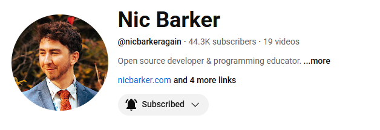

Nic explores modern C through thoughtfully edited, occasional long-form videos. Expect careful dives into data layout, performance tradeoffs, and why he built Clay, a single-header UI layout library in C, with clear explanations of the layout algorithm and practical usage. He posts when there is something substantial to show rather than on a fixed cadence, so uploads are infrequent but dense.

Notable projects

- [Clay: High-performance UI layout library in C](https://www.youtube.com/watch?v=DYWTw19_8r4)
- [How Clay’s layout algorithm works](https://www.youtube.com/watch?v=by9lQvpvMIc)

### [Tsoding Daily — YouTube](https://www.youtube.com/@TsodingDaily/videos)

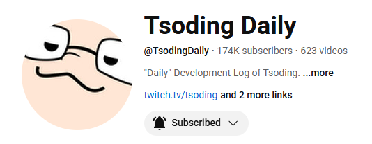

A true live-coding channel: multi-hour sessions most days where he prototypes tools, experiments with algorithms, and frequently writes C from scratch on stream. The focus shifts between languages, but you will often see pure C projects, hand-rolled build tooling, and algorithm visualization. Streams are near-daily and the archive is extensive.

Notable projects

- [I’m building C with C without CMake](https://www.youtube.com/watch?v=D1bsg8wkZzo)
- [Hash table in C](https://www.youtube.com/watch?v=tzEamfEoVag)
- [Better way to build C](https://www.youtube.com/watch?v=mLUhSPD4F2k)

### [Molly Rocket — YouTube](https://www.youtube.com/mollyrocket)

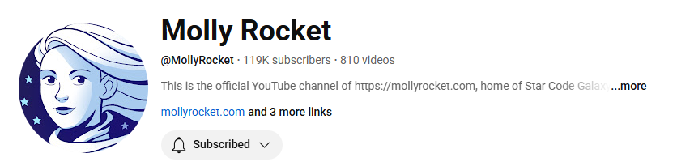

Casey Muratori’s home base for Handmade Hero, a from-scratch C game series that teaches engine architecture in meticulous, multi-hour episodes. The channel now updates sporadically, but the library remains a goldmine for understanding rendering, platform layers, live code reloading, and asset systems in C.

Notable projects

- [Handmade Hero series](https://www.youtube.com/watch?v=Ee3EtYb8d1o)
- [Dynamic code loading in C on Windows](https://www.youtube.com/watch?v=WMSBRk5WG58)

### [Jacob Sorber — YouTube](https://www.youtube.com/channel/UCwd5VFu4KoJNjkWJZMFJGHQ)

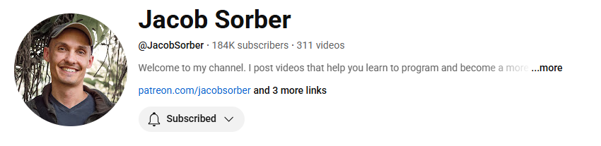

Jacob publishes concise, practical systems videos with a strong C slant: pointers, memory, processes vs threads, debugging, and tooling. His cadence is roughly weekly to bi-weekly, with each episode designed to stand alone and teach one concept cleanly.

Notable projects

- [Programming playlist with C topics like memcpy and pointer arithmetic](https://www.youtube.com/playlist?list=PL9IEJIKnBJjGsttQusXPNuEknLQ6leUfS)

### [CodeVault — YouTube](https://www.youtube.com/c/CodeVault/videos)

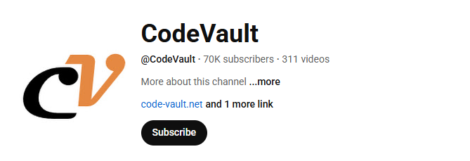

A carefully organized trove of POSIX and concurrency lessons in C. Uploads arrive in bursts rather than on a strict schedule, but the playlists are structured as mini-courses that you can binge for threads, processes, synchronization, and IPC.

Notable projects

- [Unix threads in C playlist](https://www.youtube.com/playlist?list=PLfqABt5AS4FmuQf70psXrsMLEDQXNkLq2)
- [Condition variables in C](https://www.youtube.com/watch?v=0sVGnxg6Z3k)
- [Semaphores in C](https://www.youtube.com/watch?v=ldJ8WGZVXZk)

### [Low Level Learning — YouTube](https://www.youtube.com/lowlevellearning)

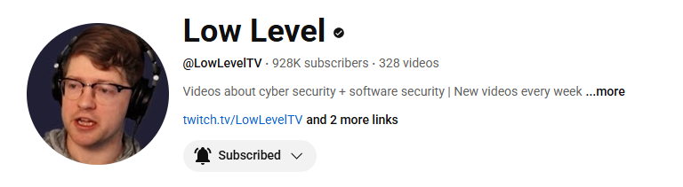

Security-tinged systems content every week: reverse engineering adventures, low-level debugging, and OS internals. While not exclusively C, many episodes dissect C-based implementations and vulnerabilities, making it useful for C programmers who want to understand how code fails in the wild.

Notable projects

- [Channel home with weekly schedule](https://www.youtube.com/@LowLevelTV/videos)

### [Bisqwit — YouTube](https://www.youtube.com/c/Bisqwit/videos)

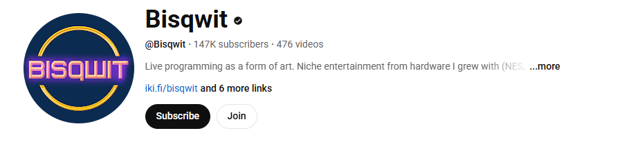

Long-form, old-school programming demonstrations that feel like a live performance. Uploads are sporadic, but when they land, they are deep: from writing a Doom-style engine renderer to retro graphics pipelines, often using C or C-like code and explaining every step.

Notable projects

- [Creating a Doom-style 3D engine in C](https://www.youtube.com/watch?v=HQYsFshbkYw)
- [3D rendering tutorial playlist](https://www.youtube.com/playlist?list=PLzLzYGEbdY5nla16U99NTLCLch1ZCxT_4)

### [Bitwise by Per Vognsen — YouTube](https://www.youtube.com/@pervognsen_bitwise)

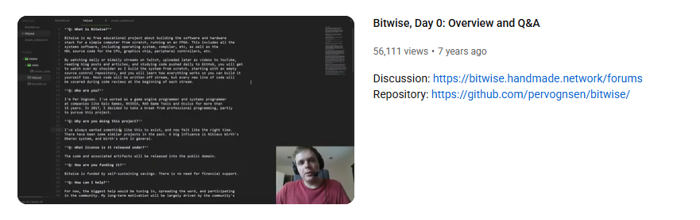

A classic, now-archived series that set out to build a whole computer stack. The lessons roam across compilers, parsers, and minimal OS components, with heavy C usage. New uploads are rare today, but the archive reads like a well-indexed course.

Notable projects

- [Bitwise series archive](https://www.youtube.com/@pervognsen_bitwise)

### [The Cherno — YouTube](https://www.youtube.com/@TheCherno)

Yan Chernikov documents the ongoing development of the Hazel engine in C++, mixing architecture talks with dev logs and code reviews. Uploads are intermittent but generally monthly-ish when a subsystem lands, and the engine’s evolution makes for a coherent long-running narrative that is directly relevant to C-style systems work.

Notable projects

- [Game Engine playlist](https://www.youtube.com/playlist?list=PLlrATfBNZ98dC-V-N3m0Go4deliWHPFwT)
- [Hazel dev logs](https://www.youtube.com/playlist?list=PLlrATfBNZ98drHSOb-h2e618oOB6yuLUS)
- [Hazel engine overview](https://www.youtube.com/watch?v=1W1FtRaY69Y)

### [javidx9 — YouTube](https://www.youtube.com/javidx9)

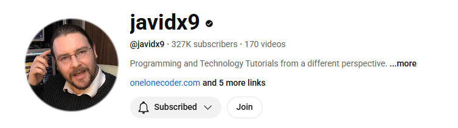

Project-driven teaching with an emphasis on graphics, emulators, and gameplay systems. Uploads come in waves, but the ecosystem is anchored by his single-header PixelGameEngine, making it easy to follow along in C or C++. Expect approachable explanations and complete, working projects.

Notable projects

- [olc::PixelGameEngine repo](https://github.com/OneLoneCoder/olcPixelGameEngine)
- [Example code repository](https://github.com/OneLoneCoder/Javidx9)

### [strager — YouTube](https://www.youtube.com/@strager_)

Matthew “strager” Glazar publishes occasional, high-signal videos distilled from his live teaching. Expect performance-oriented data structures, careful code reviews, and C or C++ implementations that emphasize measurement and correctness. Most days he streams on Twitch; the YouTube channel hosts polished takes.

Notable projects

- [Perfect hash table video](https://www.youtube.com/watch?v=DMQ_HcNSOAI)
- [Hash table implementation discussion](https://www.youtube.com/watch?v=FsfRsGFHuv4)

### [Portfolio Courses — YouTube](https://www.youtube.com/@PortfolioCourses/videos)

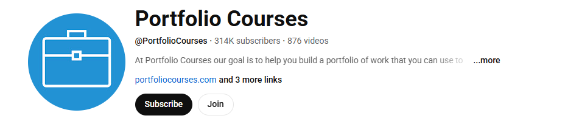

Hands-on C explained by building and refactoring small, testable examples. The channel publishes regularly, with new C lessons and exercises appearing most weeks; each episode is self-contained, so you can dip into pointers one day and file handling the next without losing context.

Notable projects

- [C Programming Tutorials playlist](https://www.youtube.com/playlist?list=PLA1FTfKBAEX4hblYoH6mnq0zsie2w6Wif)
- [C Programming Examples playlist](https://www.youtube.com/playlist?list=PLA1FTfKBAEX6dPcQitk_7uL3OwDdjMn90)

### [Cobb Coding — YouTube](https://www.youtube.com/channel/UCmYdGlEQxRskijuDOy1klvA) • [Twitch](https://www.twitch.tv/cobbcoding)

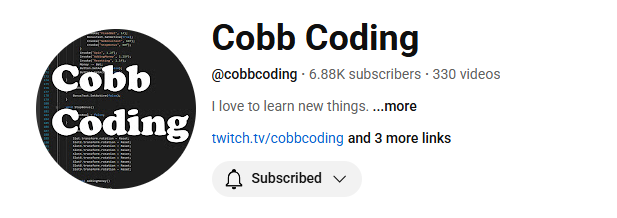

Long-form, project-driven sessions in C, often streamed live and later uploaded. The focus is on building tools and systems from scratch, with compiler development, virtual machines, and text editors all appearing as multi-episode arcs. The pace is steady, with regular streams and new videos most weeks.

Notable projects

- [Cano — text editor in C](https://github.com/CobbCoding1/Cano)
- [Building a Compiler in C playlist](https://www.youtube.com/playlist?list=PLRnI_2_ZWhtA_ZAzEa8uJF8wgGF0HjjEz)
- [VM in C — instruction set and runtime](https://www.youtube.com/watch?v=gmtep4sg1O4)

### [ThatOSDev — YouTube](https://www.youtube.com/@ThatOSDev)

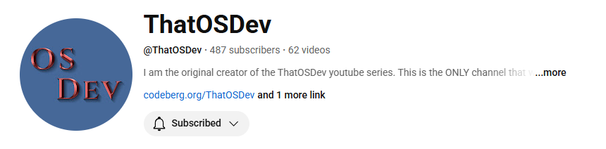

A hobby OS developer who shares the process of writing kernels and system utilities in C. The content is stream-like but edited into digestible uploads, covering everything from paging to ELF loaders and file descriptors. New videos appear consistently, building out a functional operating system layer by layer.

Notable projects

- [Virtual memory and paging in a 32-bit C kernel](https://www.youtube.com/watch?v=QIGun_BGuDw)
- [Expanding write() and file descriptor plumbing](https://www.youtube.com/watch?v=ZSQnAF7ZWqQ)
- [Amateur OS Dev in C](https://www.youtube.com/watch?v=gxmhHAqjLJM)

### [Low Byte Productions — YouTube](https://www.youtube.com/@LowByteProductions)

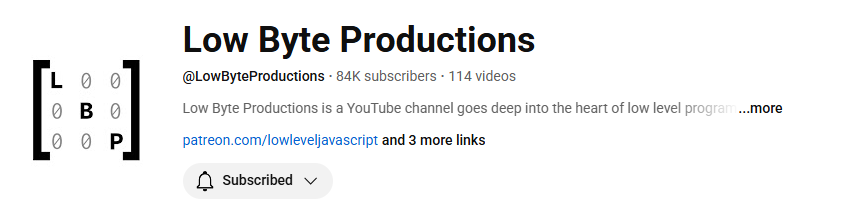

Low-level tutorials centered on bare-metal C programming, from Cortex-M firmware up to kernel boot sequences. The content blends coding with conceptual explanations, so you see how each line of C translates into instructions and device interactions. Uploads appear regularly and follow a project-oriented flow.

Notable projects

- [Bare-metal programming for Cortex-M in C](https://www.youtube.com/watch?v=06ICtJjPKlA)
- [World’s Simplest Bootloader — from C to flash](https://www.youtube.com/watch?v=cfNJ85cX-ms)
- [Understanding assembly generated from C](https://www.youtube.com/watch?v=nnnEy0w-l_A)

### [Write Your Own Operating System — YouTube](https://www.youtube.com/@writeyourownoperatingsystem)

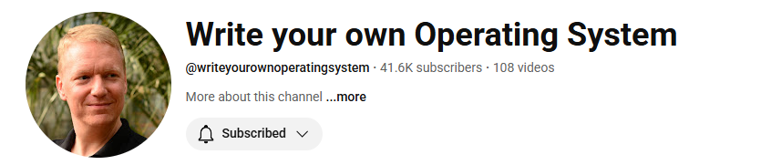

A channel dedicated to incremental operating system development in C, presented in short and accessible videos. Episodes build directly on one another, covering bootloaders, ELF parsing, and file systems, with new uploads arriving regularly to extend the project into a usable kernel.

Notable projects

- [Loading ELF PIE programs in a C kernel](https://www.youtube.com/watch?v=AEST2jH36vQ)
- [Coding a filesystem layer in C](https://www.youtube.com/watch?v=d8flm9qT5O0)
- [MS-DOS-style OS in C kickoff](https://www.youtube.com/watch?v=04BplOHSY_A)

### [Daniel Stenberg — YouTube](https://www.youtube.com/channel/UCD5eL38hFtSLiVFP9cCUJEA)

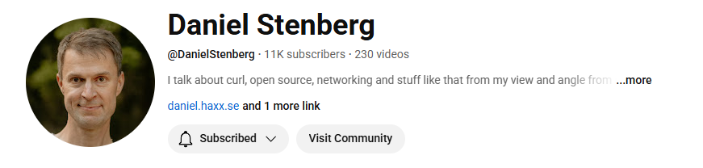

The creator of curl shares focused, production-oriented libcurl episodes in straight C. Each short tutorial isolates one API surface or option and builds a runnable sample with Makefiles and flags you can reuse. New entries arrive in bursts around releases and talks, so the cadence is irregular but consistently deep when they land.

Notable projects

- [libcurl video tutorial playlist](https://www.youtube.com/playlist?list=PLpXAyWkDQy40u-xT-Zr6Rab6EdEFOjO2W)
- [Getting started with libcurl](https://www.youtube.com/watch?v=W-0yEqLMkwg)
- [Mastering libcurl sessions](https://www.youtube.com/watch?v=ZQXv5v9xocU)

### [Oceano — YouTube](https://www.youtube.com/@onaecO)

Project-driven C with a strong “use real libraries” bias: X11 windows from scratch, MiniLibX for rendering, POSIX threads and synchronization, and practical systems exercises. Uploads come in steady clusters most months, often multi-part builds where the repo and compile steps are shown on screen.

Notable projects

- [Introduction to MiniLibX (X11 C API)](https://www.youtube.com/watch?v=bYS93r6U0zg)
- [Dining Philosophers in C with threads and mutexes](https://www.youtube.com/watch?v=zOpzGHwJ3MU)
- [Build a tiny shell in C](https://www.youtube.com/watch?v=yTR00r8vBH8)

### [Nir Lichtman — YouTube](https://www.youtube.com/@nirlichtman)

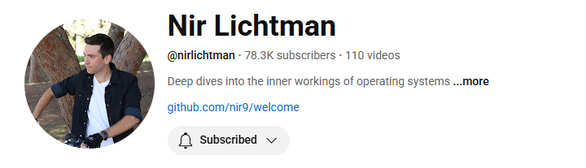

Compact, hands-on C sessions that wire up real libraries on Linux and Windows: OpenSSL for TLS, raw sockets and Winsock, X11, and shared objects or DLLs. Videos are pragmatic and reproducible, favoring minimal code you can paste into a new project. New uploads appear frequently, often weekly or bi-weekly.

Notable projects

- [Minimal HTTPS server in C with OpenSSL](https://www.youtube.com/watch?v=6stTRIOsm2E)
- [X11 window from C](https://www.youtube.com/watch?v=d2E7ryHCK08)
- [Minimalist text editor in C on Linux](https://www.youtube.com/watch?v=gnvDPCXktWQ)

### [Eric O Meehan — YouTube](https://www.youtube.com/c/ericomeehan/videos)

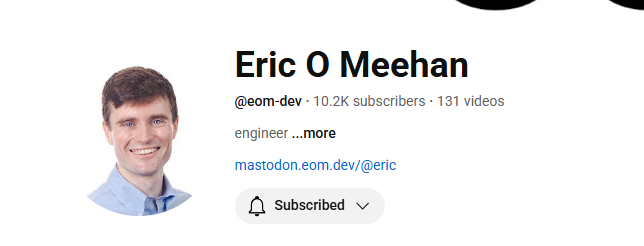

Long-form, end-to-end builds where C meets practical infrastructure. Expect sockets, routing, and persistence stitched together with libraries like OpenSSL and SQLite, with episodes that turn a prototype into a working service. Series are maintained over months with periodic, substantive updates.

Notable projects

- [Creating a web server from scratch in C](https://www.youtube.com/watch?v=gk6NL1pZi1M)
- [OpenSSL + libcrypto in a C blockchain project](https://www.youtube.com/watch?v=vgySgj9OC5c)
- [CLI and SQLite integration walkthrough](https://www.youtube.com/watch?v=LeAFbwuH2AM)
