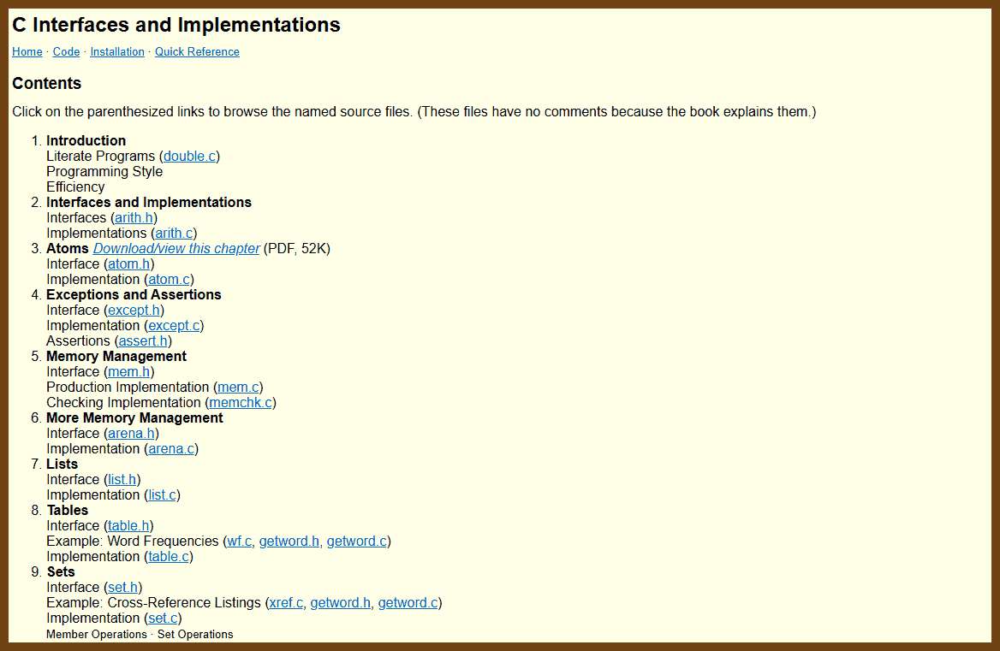

# dev-c99
Date: 2025-09-03

## See also!

-  [dev-c99-video-content-creators.md](dev-c99-video-content-creators.md) 
-  [dev-c99-libraries.md](dev-c99-libraries.md) 
-  [dev-c99-github-banned-h.md](dev-c99-github-banned-h.md) 


## Compilation and warnings

```sh
# Clang on Unix-like systems
clang -std=c99 -Wall -Wextra -Werror -O2 -g main.c -o main
```

This compiles main.c as C99 with Clang, enables many warnings (-Wall), adds extra diagnostics (-Wextra), and promotes all warnings to errors (-Werror). -O2 optimizes, -g keeps symbols for debugging, and -o main names the output.
[Clang Command Guide](https://clang.llvm.org/docs/CommandGuide/clang.html)

```sh
# GCC on Unix-like systems
gcc -std=c99 -Wall -Wextra -Werror -O2 -g main.c -o main
```

This compiles main.c as C99 with GCC. -Wall, -Wextra, and -Werror control diagnostics; -O2 and -g set optimization and debug info; -o names the output.
[GCC Warning Options](https://gcc.gnu.org/onlinedocs/gcc-14.1.0/gcc/Warning-Options.html)

```bat
:: MSVC cl.exe on Windows Developer Command Prompt
:: Note: cl.exe does not have a C99 mode switch. It can compile C code, but full C99 conformance is not guaranteed.
cl /TC /W4 /WX /Zi /O2 main.c /Fe:main.exe
```

This compiles main.c as C with MSVC. /TC forces C mode, /W4 is a high warning level, /WX treats warnings as errors, /Zi emits PDB debug info, /O2 optimizes, and /Fe names the exe. For strict C99 needs on Windows, use Clang or GCC toolchains.
[MSVC Warning Levels](https://learn.microsoft.com/en-us/cpp/build/reference/compiler-option-warning-level?view=msvc-170)
[MSVC C Language Conformance Notes](https://learn.microsoft.com/en-us/cpp/c-language/c-language-reference?view=msvc-170)

```bat
:: Clang-cl on Windows (MSVC-compatible driver, still C99 frontend)
clang-cl /std:c99 /W4 /WX /Zi /O2 main.c /Fe:main.exe
```

This uses Clang on Windows with MSVC-style flags, targeting C99. You get Clang diagnostics and codegen while integrating with MSVC-style tools and linkers.
 [Clang-cl User Guide](https://clang.llvm.org/docs/UsersManual.html#clang-cl)

```sh
# Tiny C Compiler (TCC)
# TCC is a C compiler; it does not compile C++ and has a smaller warning set.
tcc -std=c99 -Wall -Werror main.c -o main
```

This compiles main.c as C99 with TCC. -Wall enables its warnings and -Werror treats them as errors. TCC does not support -Wextra.
[Tiny C Compiler Reference](https://bellard.org/tcc/tcc-doc.html)


## Video

2025-08-01 [How I program C - YouTube](https://www.youtube.com/watch?v=443UNeGrFoM) { www.youtube.com }

> 
> **Speaker** Eskil Steenberg – game-engine and tools developer (Quel Solaar)
> **Recording** Seattle, Oct 2016 (2 h 11 m)
>
> Key themes
>
> - Results first, control later – why explicit memory management, crashes, and compiler errors are desirable.
> - Minimise technology footprint – target C89/C90, wrap every dependency, zero un-wrapped libraries.
> - Code is for humans – long descriptive names, uniform naming schemes, wide functions, avoid cleverness (e.g. operator overloading).
> - Favour simple languages plus strong tooling – write parsers, debuggers, doc generators yourself.
> - Memory mastery – pointers as arrays, alignment and padding, struct packing, cache-friendly dynamic arrays + `realloc`, dangers of linked lists.
> - API design – opaque handles (void *), start with public interface, isolate implementation, macro-assisted debug wrappers (`__FILE__`, `__LINE__`).
> - Build a mountain – own your stack, keep technical debt near zero, rewrite early.
> - UI toolkit pattern – single pass, stateless widgets keyed by pointer IDs; layout and hit-testing resolved internally.
> - Tools and snippets – Carmack inverse-sqrt; xorshift32 PRNG; GFlags page-guarding for memory bugs; Seduce UI; Testify binary packer; Ministry of Flat un-wrapper.
>
> **Talk structure in order of appearance**
>
> - Motivation and philosophy
> - Results vs control; garbage collection vs manual `free`
> - Small footprint and dependency wrapping
> - Naming conventions and formatting policies
> - Crashes and compiler errors as friends
> - Macros: when to use, when to avoid
> - Deep dive: pointers, arrays, structs, alignment, packed allocations
> - Cache-aware data structures; `realloc` growth patterns; backwards remove
> - API style with opaque handles; object orientation in C
> - Memory-debug and binary-packing helpers using `__FILE__` `__LINE__`
> - UI toolkit design example (Seduce)
> - Build-your-own-tools mindset; “build a mountain” analogy
> - Closing resources and project links

2025-08-01 [C Programming Full Course for free ⚙️ (2025) - YouTube](https://www.youtube.com/watch?v=xND0t1pr3KY) {www.youtube.com}

> 

2025-08-02 [Go from mid-level to advanced C programmer in two hours - YouTube](https://www.youtube.com/watch?v=eh8zBTTgRn4) {www.youtube.com}

> 

2025-08-02 [C Programming and Memory Management - Full Course - YouTube](https://www.youtube.com/watch?v=rJrd2QMVbGM) {www.youtube.com}

> Interesting, "Boot Dev", known for very annoying ads, also have some quality content
>
> 

2025-08-02 [I'm Building C with C without CMake - YouTube](https://www.youtube.com/watch?v=D1bsg8wkZzo) {www.youtube.com}

> 

2025-08-02 [Tips for C Programming - YouTube](https://www.youtube.com/watch?v=9UIIMBqq1D4) {www.youtube.com}

> 

**Topics covered**

* C in context: history, loadbearing role, perception vs practice
* C versions: C89 vs C99, syntax and QoL differences
* Compiler discipline: -std, -Wall, -Werror, -save-temps
* Project organization: headers vs single translation unit
* Debugging fundamentals: segfault model, call stacks, IDE debuggers
* Memory corruption and ASan: off-by-one, red zones, -fsanitize=address
* Arrays with length and capacity, bounds-checked access
* Generics tradeoffs in C: per-type code, macros, codegen
* Strings with explicit length, slices, avoiding standard libc pitfalls
* Pointers vs indices: relocation safety, bounds checks, serialization, generational indices
* Memory management by lifetime: static, scope, task; arenas for task-scoped data

**All examples referenced**

* C89 quirks: declare locals at top, positional struct init, type sizes vary
* C99 features: mixed declarations, designated initializers, stdint.h types, compound literals, // comments
* Compiler flags: -std=c99, -Wall, -Werror, -save-temps, -fsanitize=address
* Include behavior: literal paste, unity build via including .c files
* Segfault demo: dereference NULL, debugger halts on exact line
* Off-by-one bug: i <= count - 1 writes 1 past end, ASan catches
* Bounds-checked array: struct with length and capacity, get function
* Strings with length: slice without copying, avoid strlen pitfalls
* Indices not pointers: smaller references, resize-safe, serialize-friendly
* Arenas: one big alloc per task, one free, faster and simpler

**Small examples, close to the talk**

```c
// C99: declare where used, loop index scoped to loop
for (int i = 0; i < n; i++) { /* ... */ }
```

```c
// C99 designated initializer
typedef struct { int id; const char *name; int age; } User;
User u = { .name = "Ada", .age = 36, .id = 1 };  // order independent
```

```c
// Fixed-width and pointer-sized integers from stdint.h
#include <stdint.h>
uint32_t a = 0;
uintptr_t pbits = (uintptr_t)some_ptr;  // big enough to hold a pointer
```

```c
// Compiler discipline
// clang -std=c99 -Wall -Werror -O2 main.c
// clang -std=c99 -Wall -Werror -save-temps -O0 main.c
```

```c
// Unity build: single translation unit
// main.c
#include "math.c"
#include "strings.c"
int main(void) { return app_run(); }
// clang -std=c99 -Wall -Werror -O2 main.c
```

```c
// Segfault demo with debugger
int *p = 0;            // NULL
int x = *p;            // debugger halts here with SIGSEGV
```

```c
// Off-by-one corruption; ASan will flag the write past end
// clang -std=c99 -fsanitize=address -g oob.c -o oob
int *v = malloc(sizeof(int) * 10);
for (int i = 0; i <= 9; i++) v[i] = i;  // OK
v[10] = 42;                             // ASan error: heap-buffer-overflow
```

```c
// Bounds-checked dynamic array, minimal
typedef struct { size_t len; size_t cap; int *data; } IntArray;

static inline int int_array_get(const IntArray *a, size_t i) {
    if (i >= a->len) { __builtin_trap(); return 0; }  // debug break
    return a->data[i];
}
```

```c
// String with explicit length and slicing
typedef struct { const char *ptr; size_t len; } Str;

static inline Str str_slice(Str s, size_t off, size_t n) {
    if (off > s.len) { __builtin_trap(); return (Str){0}; }
    if (n > s.len - off) n = s.len - off;
    return (Str){ s.ptr + off, n };
}
```

```c
// Index over pointer for stable references
typedef struct { int id; /* ... */ } User;
typedef struct { size_t len; size_t cap; User *data; } UserArray;

typedef struct { uint32_t user_index; } Session;  // 32-bit index ref

static inline User *user_from_index(UserArray *ua, uint32_t idx) {
    if (idx >= ua->len) { __builtin_trap(); return 0; }
    return &ua->data[idx];
}
```

```c
// Arena allocator sketch for task lifetime
typedef struct { uint8_t *base; size_t used; size_t cap; } Arena;

void *arena_alloc(Arena *a, size_t n, size_t align) {
    size_t p = (a->used + (align - 1)) & ~(align - 1);
    if (p + n > a->cap) return 0;
    void *ptr = a->base + p;
    a->used = p + n;
    return ptr;
}
// Create once per task with a single malloc; free once when task ends.
```

```c
// Compound literal + designated init to pass a struct inline
typedef struct { int x, y; } Pt;
void draw_point(Pt p);
draw_point((Pt){ .x = 10, .y = 20 });
```

```c
// // single-line comments are valid in C99
// Use them freely for clarity.
```

> C is loadbearing tech. C99 removes unnecessary pain. I lock the compiler down with -Wall and -Werror. I keep builds simple with a unity build when it fits. I never chase blind crashes; I run a debugger and ASan so memory bugs surface at the line, not in production. I wrap arrays with length and bounds, and I carry string lengths so slices are cheap and safe. I store indices instead of pointers so my data survives resizes and serializes cleanly. I allocate by lifetime and free by lifetime with arenas. With these habits, C turns from scary to sharp.

2025-09-28 [Programming in Modern C with a Sneak Peek into C23 - Dawid Zalewski - ACCU 2023 - YouTube](https://www.youtube.com/watch?v=lLv1s7rKeCM) { www.youtube.com }

> 
>
> ------
>
> A high-level tour of *Programming in Modern C with a Sneak Peek into C23*  (by Dawid Zalewski) shows how C remains alive and evolving. The talk focuses on practical, post-C99 techniques, especially useful in systems and embedded work. It demonstrates idioms that improve clarity, safety, and ergonomics without giving up low-level control.
>
> **Topics covered**
>
> **Modern initialization**
>  Brace and designated initializers, empty initialization `{}` in C23, and mixed positional and designated forms.
>
> **Arrays**
>  Array designators, rules for inferred array size, and guidance on when to avoid variable-length arrays as storage while still using VLA syntax to declare function parameter bounds.
>
> **Pointer and API contracts**
>  Sized array parameters `T a[n]`, `static` qualifiers like `T a[static 3]` to require valid elements, and `const char *static 1` to enforce non-null strings.
>
> **Multidimensional data**
>  Strongly typed pointers to VLA-shaped arrays for natural `a[i][j]` indexing and safer `sizeof` expressions.
>
> **Compound literals**
>  Creating unnamed lvalues to reassign structs, pass inline structs to functions, and zero objects succinctly.
>
> **Macro patterns**
>  Named-argument style wrappers around compound literals, simple defaults, `_Generic` for ad-hoc overloading by type, and a macro trick for argument-count dispatch.
>
> **Memory layout**
>  Flexible array members for allocating a header plus payload in one contiguous block, reducing double-allocation pitfalls.
>
> **C23 highlights**
>  New keywords for `bool`, `true`, and `false`, the `nullptr` constant, `auto` type inference in specific contexts, a note on `constexpr`, and current compiler support caveats.


```c
/*
    Modern C23-leaning "vector" demo with annotations.
    ASCII only.
    Assumption: compiler supports C23 and earlier C99 features referenced.
*/

#include <stdio.h>
#include <stdlib.h>
#include <string.h>

/* C23: bool/true/false are keywords; stdbool.h not required in C23. */
bool vec_create(struct vector **vec /* C99: [static 1] on pointer parameter */,
                size_t cap);

typedef struct vector {
    size_t capacity;
    size_t size;
    double data[];      /* C99: flexible array member */
} vector;

/* forward */
void dump_vec(vector const * const v);

/*
    Create a vector with at least cap elements.

    Features used and standard origin:
      - C99: designated initializers in compound literal assignment.
      - C99: array parameter qualifier [static 1] to express non-null, valid storage.
      - C99: VLA type in sizeof, e.g., sizeof(double[cap]).
      - C23: bool, true/false keywords.
      - C23: nullptr keyword.
      - C23: constexpr object.
*/
bool vec_create(vector **vec /* C99: [static 1] contract */, size_t cap) {
    if (vec == nullptr) {          /* C23: nullptr keyword */
        return false;
    }

    constexpr size_t DEF_CAP = 16; /* C23: constexpr object */
    cap = (cap == 0) ? DEF_CAP : cap;

    /*
        One contiguous allocation:
          - sizeof *v covers the header up to data[].
          - sizeof(double[cap]) uses a VLA type (C99) to size the payload.
    */
    vector *v = malloc(sizeof *v + sizeof(double[cap]));
    if (v == nullptr) {
        *vec = nullptr;
        return false;
    }

    /* C99: compound literal with designated initializers to set the header. */
    *v = (vector){
        .capacity = cap,
        .size = 0
        /* data[] is the flexible member; no header field to set here */
    };

    *vec = v;
    return true;
}

/* trivial filler for demo output */
static void vec_fill_sequential(vector *v) {
    size_t n = v->capacity < 8 ? v->capacity : 8;
    for (size_t i = 0; i < n; ++i) {
        v->data[i] = (double)i;
    }
    v->size = n;
}

void dump_vec(vector const * const v) {
    printf("vector at %p\n", (void*)v);
    printf("  capacity = %zu, size = %zu\n", v->capacity, v->size);
    size_t n = v->size < 8 ? v->size : 8;
    for (size_t i = 0; i < n; ++i) {
        printf("  data[%zu] = %g\n", i, v->data[i]);
    }
}

int main(void) {
    vector *vec = nullptr;          /* C23: nullptr keyword */

    if (vec_create(&vec, 8)) {
        printf("created a vector\n\n");
        vec_fill_sequential(vec);
        dump_vec(vec);

        /*
            Single free releases both header and payload because data[]
            is a C99 flexible array member appended to the header.
        */
        free(vec);
    } else {
        fprintf(stderr, "failed to create vector\n");
        return 1;
    }

    return 0;
}

```

**Modern C99 Techniques You Can Use Today**

**1) Brace initialization**

```c
int x = { 42 };
struct Point { int x, y; };
struct Point p = { .x = 10, .y = 20 };
int a[] = { 1, 2, 3 };
int b[5] = { 1 };
```

Use `{}` initializers for scalars, arrays, and structs. Unlisted members become zero. `{0}` ensures explicit zeroing. For scalars, `int x = { 42 };` is the same as `int x = 42;`.

**2) Zeroing with `{0}`**

```c
struct State s = { 0 };
int zeros[16] = { 0 };
```

`{0}` zeroes the first element and, by rule, all others. `{}` is a C23 feature, not C99.

**3) Designated initializers**

```c
struct Cfg { int id, flags, mode, status; };
struct Cfg c1 = { .id = 7, .status = 2 };
```

Mix positional and named initializers. Later values override earlier ones. Safer against field reorder.

**4) Array element designators**

```c
int fib[] = {
    [0] = 0, [1] = 1, [2] = 1,
    [10] = 55, 89
};
```

Sparse initialization. Size deduced as highest index + 1. Missing entries zeroed.

**5) Nested designators**

```c
struct Item { int k; struct { int lo, hi; } ext; };
struct Item table[] = {
    [0]  = { .k = 1, .ext = { .lo = -3, .hi = 3 } },
    [10] = { .ext.hi = 99 }
};
```

Set deep fields directly. Useful for lookup tables.

**6) Variable Length Arrays (VLAs) in parameters**

```c
void fill(int n, int buf[n]);
void sum_n(size_t n, double buf[static 3]);
```

In parameters, VLAs encode bounds and non-null contracts. Avoid large VLAs as locals, they can exhaust the stack.

**7) Pointer contracts with `static 1`**

```c
void print_line(const char *static 1 s);
```

Means non-null pointer to at least one element. Passing NULL is UB. Only use when required.

**8) Strongly typed 2D arrays**

```c
size_t n = 5, m = 7;
double (*mat)[m] = malloc(sizeof *mat * n);
mat[2][3] = 1.0;
```

Keeps row/column math correct. One allocation, one free.

**9) `sizeof` with VLA types**

```c
int (*grid)[m] = malloc(sizeof *grid * n);
```

`sizeof *grid` always equals `m * sizeof(int)`. Safer against refactor mistakes.

**10) Compound literals**

```c
v = (struct Vec){ .cap = 64, .len = 0, .data = calloc(64, sizeof *v.data) };
time_t t = mktime(&(struct tm){ .tm_year = 124, .tm_mon = 8, .tm_mday = 28 });
```

Temporary lvalues. Use `(Type){0}` to clear. Block-scope literals live until block ends.

**11) Named-argument style calls**

```c
#define BLUR(...) blur(&(struct BlurParams){ __VA_ARGS__ })
BLUR(.dst = dst, .src = src, .width = w, .height = h, .kernel = 5);
```

Makes call sites self-documenting. Do not store the address of these temporaries.

**12) Default values with overlay macros**

```c
#define BLUR_DEFAULTS .compute_hw = 0, .kernel = 3
#define BLUR2(...) blur(&(struct BlurParams){ BLUR_DEFAULTS, __VA_ARGS__ })
```

Later fields override earlier ones. Keep defaults consistent with struct definition.

**13) Flexible array members**

```c
struct Str { size_t len; char data[]; };
struct Str *s = malloc(sizeof *s + n + 1);
```

Header and payload in one block. Better locality, single free. FAM must be last, and has no declared size.

**14) Single malloc vector**

```c
struct Vector { size_t capacity, size; double data[]; };
*v = (struct Vector){ .capacity = capacity, .size = 0 };
```

Use FAM to pack header and elements into one allocation.

**15) Macro overloading by arg count**

```c
#define _GET_3RD(a,b,c,...) c
#define _SELECT_SCALE(...) _GET_3RD(__VA_ARGS__, scale_rect2, scale_rect1)
#define scale_rect_auto(r, ...) _SELECT_SCALE(__VA_ARGS__)(r, __VA_ARGS__)
```

Simulates overloading. Pure preprocessor trick, no type checking.

**Portability and safety**

- Use `<stdbool.h>` for `bool`, `true`, `false`.
- VLAs are required in C99 but optional in later standards. Some compilers disable them.
- Contracts with `static k` are promises, not checks. Violating them is UB.
- Flexible array members require careful allocation.

**Safer alternatives**

- Prefer heap + VLA types for large arrays.
- Use `(Type){0}` to clear objects, not `memset`.
- Use designated initializers for public config structs.
- Use macro overlays for defaults.

2025-07-13 [Parse, Don’t Validate AKA Some C Safety Tips](https://www.lelanthran.com/chap13/content.html) { www.lelanthran.com }

> The article "Parse, Don’t Validate AKA Some C Safety Tips" by Lelanthran expands on the concept of converting input into strong types rather than merely validating it as plain strings. It demonstrates how this approach, when applied in C, reduces error-prone code and security risks. The post outlines three practical benefits: boundary handling with opaque types, safer memory cleanup via pointer‑setting destructors, and compile‑time type safety that prevents misuse deeper in the codebase.
>
> **Key Takeaways:**
>
> 1. **Use Strong, Opaque Types for Input**
>    - Instead of handling raw `char *`, parse untrusted input into dedicated types like `email_t` or `name_t`.
>    - This restricts raw input to the system boundary and ensures all later code works with validated, structured data.
> 2. **Reduce Attack Surface**
>    - Only boundary functions see untrusted strings; internal functions operate on safe, strongly typed data.
>    - This prevents deeper code from encountering malformed or malicious input.
> 3. **Enforce Correctness at Compile Time**
>    - With distinct types, the compiler prohibits misuse, such as passing an `email_t*` to a function expecting a `name_t*`.
>    - What would be a runtime bug becomes a compiler error.
> 4. **Implement Defensive Destructors**
>    - Design destructor functions to take a double pointer (`T **`) so they can free and then set the pointer to `NULL`.
>    - This prevents double‑free errors and related memory safety issues.
> 5. **Eliminate Internal String Handling**
>    - By centralizing parsing near the system entry and eliminating `char *` downstream, code becomes safer and clearer.
>    - Once input is parsed, the rest of the system works with well-typed data only.
>
> 


## C99 Reimplement this world!

> 💡 C99 keeps the standard library small, so engineers often reimplement common utilities -- strings, containers, parsing, algorithms. That repetition is a feature: it produces many competing designs you can read, compare, and learn a lot from because different approaches expose trade-offs and techniques.

2025-10-03 [Klib — a generic library in C](https://attractivechaos.github.io/klib/#About) { attractivechaos.github.io }

> [attractivechaos/klib: A standalone and lightweight C library](https://github.com/attractivechaos/klib) { github.com }
>
> Klib shows how to build fast, low-overhead “standard library” pieces in plain C without templates or `void*` indirection. The core pattern is macro-based generics: you instantiate a container or algorithm with a type name macro, and the preprocessor generates type-specialized code. That keeps binaries small, avoids runtime casts, and stays competitive with handwritten, type-specific containers. The README and docs stress this trade-off explicitly and show the macro expansion style with `khash.h` as the teaching example.
>
> 
>
> **Common components**
>
> - [khash.h](https://attractivechaos.github.io/klib/#Khash%3A generic hash table): generic hash table based on double hashing.
> - [kbtree.h](https://attractivechaos.github.io/klib/#KBtree%3A generic ordered map): generic search tree based on B-tree.
> - [kavl.h](https://attractivechaos.github.io/klib/#KAVL%3A generic intrusive AVL tree): generic intrusive AVL tree.
> - [ksort.h](https://attractivechaos.github.io/klib/#Ksort%3A sorting%2C shuffling%2C heap and k-small): generic sort, including introsort, merge sort, heap sort, comb sort, Knuth shuffle and the k-small algorithm.
> - [kseq.h](https://attractivechaos.github.io/klib/#Kseq%3A stream buffer and FASTA%2FQ parser): generic stream buffer and a FASTA/FASTQ format parser.
> - kvec.h: generic dynamic array.
> - [kdq.h](https://attractivechaos.github.io/klib/#Kdq%3A double-ended queue): generic double-ended queue (de-queue).
> - klist.h: generic single-linked list and memory pool.
> - kstring.{h,c}: basic string library.
> - [ketopt.h](https://attractivechaos.github.io/klib/#Ketopt%3A parsing command-line arguments): command-line argument parser, similar to [getopt_long](https://linux.die.net/man/3/getopt_long).
> - kmath.{h,c}: numerical routines including basic nonlinear programming and a few special math functions.
> - [kson.{h,c}](https://attractivechaos.github.io/klib/#Kson%3A simple JSON parser): simple [JSON](http://www.json.org/) parser (no streaming)
> - [kthread.{h,c}](https://attractivechaos.github.io/klib/#Kthread%3A simple threading models): simple multi-threading models.

Samples:

```c
// Hash map: int -> char
#include "khash.h"
KHASH_MAP_INIT_INT(m32, char)
int main() {
  int absent; khint_t k;
  khash_t(m32)* h = kh_init(m32);
  k = kh_put(m32, h, 42, &absent);
  if (absent) kh_value(h, k) = 'x';
  k = kh_get(m32, h, 42);
  if (k != kh_end(h)) kh_del(m32, h, k);
  kh_destroy(m32, h);
}
```

2025-10-03 [C Interfaces and Implementations](https://drh.github.io/cii/toc.html) { drh.github.io }

> [drh/cii: C Interfaces and Implementations](https://github.com/drh/cii) { github.com }
>
> David R. Hanson’s C Interfaces and Implementations (CII) is both a textbook and a production-grade library. The repository contains the complete source for the book’s 24 interfaces and implementations. The code favors clarity and pedagogical structure over clever micro-optimizations. It’s rich with reusable idioms: strict interface/implementation separation, minimal public surface area, explicit memory-management modules, compact yet complete data-structure implementations, and a small set of concurrency primitives with hand-written context switching.
>
> 


## Dev C Articles

- 2022-03-05 [Beginner's Guide to Linkers](https://www.lurklurk.org/linkers/linkers.html)

> This article is intended to help C & C++ programmers understand the essentials of what the linker does. I've explained this to a number of colleagues over the years, so I decided it was time to write it down so that it's more widely available.

- 2022-11-28 [Everything I wish I knew when learning C - Tom M](https://tmewett.com/c-tips/)

> Learning C was quite difficult for me. The basics of the language itself weren’t so bad, but “programming in C” requires a lot of other kinds of knowledge which aren’t as easy to pick up on:
>
> - C has no environment which smooths out platform or OS differences; you need to know about your platform too
> - there are many C compiler options and build tools, making even running a simple program involve lots of decisions
> - there are important concepts related to CPUs, OSes, compiled code in general
> - it’s used in such varied ways that there’s far less a centralised “community” or style than other languages

- 2022-11-13 Building a simple shell in C

  > A basic shell that prints a prompt, waits for user to enter command and prints what they entered on the next line

  - [Building a simple shell in C - Part 1](https://blog.ehoneahobed.com/building-a-simple-shell-in-c-part-1)
  - [Building a simple shell in C - Part 2](https://blog.ehoneahobed.com/building-a-simple-shell-in-c-part-2)
  - [Building a simple shell in C - Part 3](https://blog.ehoneahobed.com/building-a-simple-shell-in-c-part-3)

- 2022-11-13 [Build Your Own Text Editor](https://viewsourcecode.org/snaptoken/kilo/)

  > Welcome! This is an instruction booklet that shows you how to build a text editor in C.
  >
  > The text editor is antirez’s kilo, with some changes. It’s about 1000 lines of C in a single file with no dependencies, and it implements all the basic features you expect in a minimal editor, as well as syntax highlighting and a search feature.

- 2023-05-22 [Memory Allocation](https://samwho.dev/memory-allocation/)

> One thing that all programs on your computer have in common is a need for memory. Programs need to be loaded from your hard drive into memory before they can be run. While running, the majority of what programs do is load values from memory, do some computation on them, and then store the result back in memory.
>
> In this post I'm going to introduce you to the basics of memory allocation. Allocators exist because it's not enough to have memory available, you need to use it effectively. We will visually explore how simple allocators work. We'll see some of the problems that they try to solve, and some of the techniques used to solve them. At the end of this post, you should know everything you need to know to write your own allocator.
>
> 

- 2023-07-01 [Few lesser known tricks, quirks and features of C](https://jorengarenar.github.io/blog/less-known-c)

> There are some tricks, quirks and features (some quite fundamental to the language!) which seems to throw even experienced developers off the track. Thus I did a sloppy job of gathering some of them in this post (in no particular order) with even sloppier short explanations and/or examples (or quote of thereof).
>
> - [Array pointers](https://jorengarenar.github.io/blog/less-known-c#array-pointers)
> - [Comma operator](https://jorengarenar.github.io/blog/less-known-c#comma-operator)
> - [Digraphs, trigraphs and alternative tokens](https://jorengarenar.github.io/blog/less-known-c#digraphs-trigraphs-and-alternative-tokens)
> - [Designated initializer](https://jorengarenar.github.io/blog/less-known-c#designated-initializer)
> - [Compound literals](https://jorengarenar.github.io/blog/less-known-c#compound-literals)
> - [Compound literals are lvalues](https://jorengarenar.github.io/blog/less-known-c#compound-literals-are-lvalues)
> - [Multi-character constants](https://jorengarenar.github.io/blog/less-known-c#multi-character-constants)
> - [Bit fields](https://jorengarenar.github.io/blog/less-known-c#bit-fields)
> - [0 bit fields](https://jorengarenar.github.io/blog/less-known-c#0-bit-fields)
> - [`volatile` type qualifier](https://jorengarenar.github.io/blog/less-known-c#volatile-type-qualifier)
> - [`restrict` type qualifier](https://jorengarenar.github.io/blog/less-known-c#restrict-type-qualifier)
> - [`register` type qualifier](https://jorengarenar.github.io/blog/less-known-c#register-type-qualifier)
> - [Flexible array member](https://jorengarenar.github.io/blog/less-known-c#flexible-array-member)
> - [`%n` format specifier](https://jorengarenar.github.io/blog/less-known-c#n-format-specifier)
> - [`%.*` (minimum field width) format specifier](https://jorengarenar.github.io/blog/less-known-c#-minimum-field-width-format-specifier)
> - [Other less known format specifiers](https://jorengarenar.github.io/blog/less-known-c#other-less-known-format-specifiers)
> - [Interlacing syntactic constructs](https://jorengarenar.github.io/blog/less-known-c#interlacing-syntactic-constructs)
> - [`-->` "operator"](https://jorengarenar.github.io/blog/less-known-c#---operator)
> - [`idx[arr\]`](https://jorengarenar.github.io/blog/less-known-c#idxarr)
> - [Negative array indexes](https://jorengarenar.github.io/blog/less-known-c#negative-array-indexes)
> - [Constant string concatenation](https://jorengarenar.github.io/blog/less-known-c#constant-string-concatenation)
> - [Backslash line splicing](https://jorengarenar.github.io/blog/less-known-c#backslash-line-splicing)
> - [Using `&&` and `||` as conditionals](https://jorengarenar.github.io/blog/less-known-c#using--and--as-conditionals)
> - [Compile time assumption checking using `enum`s](https://jorengarenar.github.io/blog/less-known-c#compile-time-assumption-checking-using-enums)
> - [Ad hoc `struct` declaration in the return type of a function](https://jorengarenar.github.io/blog/less-known-c#ad-hoc-struct-declaration-in-the-return-type-of-a-function)
> - ["Nested" `struct` definition is not kept nested](https://jorengarenar.github.io/blog/less-known-c#nested-struct-definition-is-not-kept-nested)
> - [Flat initializer lists](https://jorengarenar.github.io/blog/less-known-c#flat-initializer-lists)
> - [Implicit casting of `void` pointers](https://jorengarenar.github.io/blog/less-known-c#implicit-casting-of-void-pointers)
> - [Static array indices in function parameter declarations](https://jorengarenar.github.io/blog/less-known-c#static-array-indices-in-function-parameter-declarations)
> - [Macro Overloading by Argument List Length](https://jorengarenar.github.io/blog/less-known-c#macro-overloading-by-argument-list-length)
> - [Function types](https://jorengarenar.github.io/blog/less-known-c#function-types)
> - [X-Macros](https://jorengarenar.github.io/blog/less-known-c#x-macros)
> - [Named function parameters](https://jorengarenar.github.io/blog/less-known-c#named-function-parameters)
> - [Combining default, named and positional arguments](https://jorengarenar.github.io/blog/less-known-c#combining-default-named-and-positional-arguments)
> - [Abusing unions for grouping things into namespaces](https://jorengarenar.github.io/blog/less-known-c#abusing-unions-for-grouping-things-into-namespaces)
> - [Unity builds](https://jorengarenar.github.io/blog/less-known-c#unity-builds)
> - [Matching character classes with `sscanf()`](https://jorengarenar.github.io/blog/less-known-c#matching-character-classes-with-sscanf)
> - [Garbage collector](https://jorengarenar.github.io/blog/less-known-c#garbage-collector)
> - [Cosmopolitan Libc](https://jorengarenar.github.io/blog/less-known-c#cosmopolitan-libc)
> - [Inline assembly](https://jorengarenar.github.io/blog/less-known-c#inline-assembly)
> - [Object Oriented Programming](https://jorengarenar.github.io/blog/less-known-c#object-oriented-programming)
> - [Metaprogramming](https://jorengarenar.github.io/blog/less-known-c#metaprogramming)
> - [Evaluate `sizeof` at compile time by causing duplicate case error](https://jorengarenar.github.io/blog/less-known-c#evaluate-sizeof-at-compile-time-by-causing-duplicate-case-error)

2023-06-30 [Structures in C: From Basics to Memory Alignment – Abstract Expression](https://abstractexpr.com/2023/06/29/structures-in-c-from-basics-to-memory-alignment/)

> Structures allow us to combine several variables to create a new data type. Some other languages support the same concept but call it “records”. If you come from object-oriented programming you can think about them as classes without methods.
>
> 


## Books

1993 ⭐ [Object-oriented Programming with ANSI-C (1993) [pdf]](https://www.mclibre.org/descargar/docs/libros/ooc-ats.pdf)

> Retro document! but very well written
>
> 


## RSS

> TODO List to review later

2025-10-03 [Prospecting for Hash Functions](https://nullprogram.com/blog/2018/07/31/) { nullprogram.com }


## Dev C Tools

- 2022-03-07 [clibs/clib: C package manager-ish](https://github.com/clibs/clib)

> Package manager for the C programming language.

## Dev C Libs

### Net

2023-05-17 [Home - DPDK](https://www.dpdk.org/)

> 2023-05-17 [DPDK/dpdk: Data Plane Development Kit](https://github.com/DPDK/dpdk)
>
> DPDK (Data Plane Development Kit) is an open-source software project that provides a set of libraries and drivers for fast packet processing in user space. Its main goal is to increase the performance of packet processing applications running on standard computing platforms. The project is hosted and can be accessed at [www.dpdk.org](http://www.dpdk.org/). It's widely used in network interface cards, routers, firewalls, and other networking appliances.


### C language development

- 2022-03-05 [Cello • High Level C](https://libcello.org/)

> Cello is a library that brings higher level programming to C.
> New C syntax for New Era!

```c
#include "Cello.h"

int main(int argc, char** argv) {

  /* Stack objects are created using "$" */
  var i0 = $(Int, 5);
  var i1 = $(Int, 3);
  var i2 = $(Int, 4);

  /* Heap objects are created using "new" */
  var items = new(Array, Int, i0, i1, i2);

  /* Collections can be looped over */
  foreach (item in items) {
    print("Object %$ is of type %$\n",
      item, type_of(item));
  }

  /* Heap objects destructed via Garbage Collection */
  return 0;
}
```

- 2022-03-16 [libmill](http://libmill.org/index.html) Libmill is a library that introduces Go-style concurrency to C

```c
go(foo(arg1, arg2, arg3));
chan ch = chmake(int, 0);
chan ch = chmake(int, 1000);
chs(ch, int, 42);
```

### SIMD

- 2022-05-01 `simd` [Removing characters from strings faster with AVX-512 – Daniel Lemire's blog](https://lemire.me/blog/2022/04/28/removing-characters-from-strings-faster-with-avx-512/)

> A computer science professor at the University of Quebec (TELUQ). View all posts by Daniel Lemire

- [DragonSpit/HPCsharp: High performance algorithms in C#: SIMD/SSE, multi-core and faster](https://github.com/DragonSpit/HPCsharp)
- (2021-09-26) [google/highway: Performance-portable, length-agnostic SIMD with runtime dispatch](https://github.com/google/highway)
- (2021-12-26) [Splitting CSV files at 3GB/s · Tinybird](https://blog.tinybird.co/2021/12/14/simd/) with SIMD! Good C lang examples on this topic.

- 2023-06-02 [Cornell Virtual Workshop: SIMD Parallelism](https://cvw.cac.cornell.edu/vector/overview_simd)

> SIMD stands for "Single Instruction Multiple Data," and is one of [several approaches to parallelism](https://cvw.cac.cornell.edu/parallel/tax.aspx) found in modern high-performance computing.
>
> Vector instructions are a primary example of SIMD parallelism in modern CPUs. For instance, the vector add instruction is a single instruction (add) that acts on multiple data (vectors) to yield a vector of sums. Given the two vectors `(1, 2, 3, 4)` and `(5, 6, 7, 8)`, the vector result `(6, 8, 10, 12)` is produced in a single operation. This operation is illustrated in the diagram and linked video below.

> 

2023-07-02 [Parsing time stamps faster with SIMD instructions – Daniel Lemire's blog](https://lemire.me/blog/2023/07/01/parsing-time-stamps-faster-with-simd-instructions/)

Standard:

```c
#include <time.h>
#include <stdio.h>
int main() {
  char buffer[15];
  struct tm timeinfo;
  time_t rawtime;
  time(&rawtime);
  gmtime_r(&rawtime, &timeinfo);
  size_t len = strftime(buffer, 15, "%Y%m%d%H%M%S", &timeinfo);
  buffer[14] = '\0';
  puts(buffer);
}
```

SIMD:

```c
 __m128i v = _mm_loadu_si128((const __m128i *)date_string);
v = _mm_sub_epi8(v, _mm_set1_epi8(0x30));
__m128i limit =
_mm_setr_epi8(9, 9, 9, 9, 1, 9, 3, 9, 2, 9, 5, 9, 5, 9, -1, -1);
__m128i abide_by_limits = _mm_subs_epu8(v, limit); // must be all zero
const __m128i weights = _mm_setr_epi8(
10, 1, 10, 1, 10, 1, 10, 1, 10, 1, 10, 1, 10, 1, 0, 0);
v = _mm_maddubs_epi16(v, weights);
__m128i limit16 =
_mm_setr_epi16(99,99, 12, 31, 23, 59, 59, -1);
__m128i abide_by_limits16 = _mm_subs_epu16(v, limit16);
__m128i limits = _mm_or_si128(abide_by_limits16,abide_by_limits);
if (!_mm_test_all_zeros(limits, limits)) {
  return false;
}
```

| instructions per stamp     | time per stamp |      |
| :------------------------- | :------------- | ---- |
| standard C with `strptime` | 700            | 46   |
| SIMD approach              | 65             | 7.9  |


