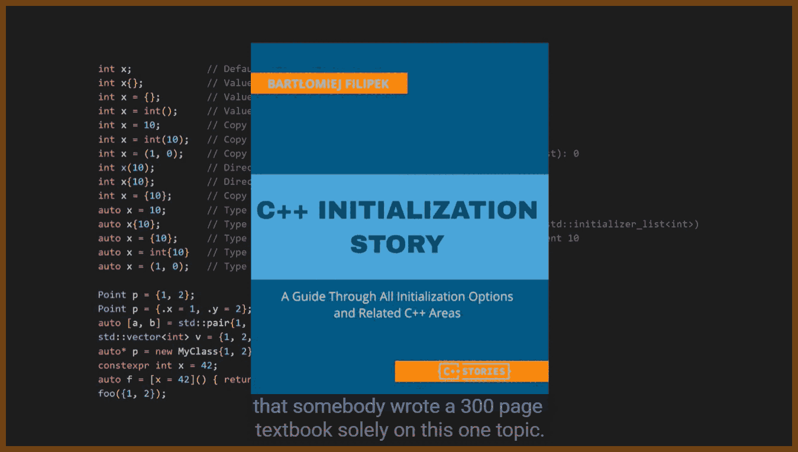

# dev-cpp-the-worst-programming-language-of-all-time
Date: 2025-12-04


## Video 

[Lazo Velko - YouTube](https://www.youtube.com/@Lazo)

2025-11-29 [C++ The worst programming language of all time - YouTube](https://www.youtube.com/watch?v=7fGB-hjc2Gc) { www.youtube.com }

> 
>
> 
>

## How to do better?

**RAII (Resource Acquisition Is Initialization)** is confusing because the phrase and acronym do not clearly say “automatic cleanup at end of scope”; it makes the idea sound more mystical than it is. The author suggests clearer names like Scope Bound Resource Management or CADRe (Constructor Acquires, Destructor Releases) so that the lifetime semantics are obvious from the name itself.

**Curiously Recurring Template Pattern (CRTP)** is confusing because “curiously recurring” merely describes the original author’s surprise at seeing the pattern, not what it actually does. The author suggests names like Static Polymorphism Template Pattern or Compile Time Inheritance that communicate the idea of static polymorphism directly.

**std::monostate** is confusing because the word “monostate” sounds pretentious and abstract, while the type is simply used as an “empty” alternative in a variant. The author suggests more straightforward names like std::empty, std::blank, or std::void to reflect that it just represents an empty state.

**“deducing this” (C++23 feature)** is confusing because the phrase is vague and technical, making it hard to guess that it is about exposing the implicit object parameter. The author suggests a clearer name like Explicit Object Parameters, which directly states what the feature does.

**std::remove** is confusing because, despite its name, it does not actually remove elements from a container but instead moves the “removed” elements to the end and leaves the container size unchanged; the author criticizes this mismatch between name and behavior and the need for the extra “erase–remove” ceremony.

```cpp
std::vector<int> v{1, 2, 3, 2, 4};

auto newEnd = std::remove(v.begin(), v.end(), 2);
// v.size() is still 5; elements from newEnd to v.end() are garbage tail.

// Correct pattern:
v.erase(std::remove(v.begin(), v.end(), 2), v.end());
```

**std::lock_guard vs std::scoped_lock** are confusing because nothing in the names indicates which one is the newer, more capable wrapper that can lock multiple mutexes. The author notes that calling the new one something like lock_guard2 would have made it more obvious that it is the improved successor.

**std::thread / std::function vs std::jthread / std::copyable_function** are confusing because the newer, safer, or more ergonomic versions do not advertise their “newness” or fixed behavior in their names. The author suggests names like thread2 and function2 that would better signal “use these instead of the old ones.”

**std::vector** is confusing because, in most other contexts, “vector” suggests a mathematical object with magnitude and direction, not a dynamically resizable array. Even the STL designer later admitted it was a poor name, and the author notes this mismatch between conventional meaning and usage.

**std::set and std::map vs std::unordered_set and std::unordered_map** are confusing because the short names set and map sound like generic hash-based containers, yet they are actually tree-based and O(log n), while the truly hash-based, O(1) versions have the word “unordered” bolted onto them. The author argues this violates expectations about performance implied by the simpler names.

```cpp
std::map<int, int> treeMap;            // log N lookup, but name doesn’t say “tree”
std::unordered_map<int, int> hashMap; // average O(1), but name is longer and uglier
```

**empty() as a container method** is confusing because the name “empty” could be read as a command (“empty the container”) or a question (“is the container empty?”), and at a glance it is not clear it returns a boolean. The author says a name like is_empty() would have communicated its intent far better.

```cpp
std::vector<int> v;

if (v.empty()) {
    // means "if v is empty"
}

// This compiles but is useless; some beginners think it might clear v:
v.empty();  // just returns bool, immediately discarded
```

**std::stoi / std::stol / std::stoll / std::stof / std::stod / std::stold** are confusing because their cryptic abbreviations are derived from type names and are intimidating to beginners, who have to memorize a cluster of lookalike short names instead of more descriptive alternatives.

**Fixed-width integer types with the _t suffix (e.g. uint64_t)** are confusing because the _t suffix is a dated C-style convention and makes the names look old and clunky. The author says something terse like i64 would have been much nicer and clearer for 64-bit integers.

**size_t** is confusing because the name is short, cryptic, and does not immediately communicate that it is an unsigned type used for sizes whose actual width depends on the platform. The author notes beginners are puzzled when APIs return size_t instead of just “an integer.”

**wchar / wchar_t and wide-character types (std::wstring vs std::string)** are confusing because there are multiple character and string types with different encodings, signedness, and platform-dependent behaviors. The author highlights that beginners do not understand why there are “seven different character types” and what practical differences between std::string and std::wstring actually are.

**std::vector** is confusing because, despite its name, it is not a normal std::vector specialization but a space-optimized bitset-like container with different semantics, proxy references, and performance tradeoffs. The author argues it should have been a separate type like std::dynamic_bitset or std::bit_vector instead of overloading the meaning of vector.

```cpp
std::vector<bool> flags(3);
flags[0] = true;

// For a real vector, this gives you an int*:
std::vector<int> v{1, 2, 3};
int* p = &v[0];

// For vector<bool>, this does not compile; operator[] returns a proxy, not bool&.
// bool* bad = &flags[0];  // error: cannot take address of proxy bit
```

**“modern C++”** is confusing because it is a moving marketing label that originally meant C++11, then C++11–C++17, and now vaguely refers to “whatever is new enough,” leaving learners unsure what features, idioms, or standard versions the term actually covers. The author points out that this vagueness undermines tutorials and books that claim to teach “modern C++.”

**“C style C++”** is confusing because beginners are repeatedly told “do not write C++ like C,” yet some codebases intentionally use a subset of C++ that is essentially “C with a few C++ features” and proudly call it “C style C++.” The author highlights how this contradictory messaging makes it hard to know when emulating C is acceptable.

**“C/C++” (as if it were one language)** is confusing because C and C++ are different languages with different idioms, features, and best practices, yet job postings and articles often lump them together as “C/C++” as though they were interchangeable. The author stresses that this fuels misunderstandings about whether you need to learn C first to write C++ and hides important differences in idiomatic usage.

**std::move (from )** is confusing because, despite the name, it does not literally “move” anything; it just casts its argument into an rvalue reference to enable moves. The author says it would be more honest to call it something like std::rvalue_cast, and notes that there is a second, unrelated std::move algorithm in , which further adds to the confusion.

```cpp
std::string s = "hello";

// std::move just changes value category; the move constructor does the actual work.
std::string t = std::move(s);

// If a type has no move ctor, this silently becomes a copy.
```

**std::move (algorithm)** being the same name as the utility is also confusing, because one is about value-category casting and the other is a range algorithm that really does move elements. The shared name hides that these are two very different operations living in different headers.

```cpp
std::vector<std::string> src{"a", "b"};
std::vector<std::string> dst(2);

// Algorithm version: actually moves elements from src to dst.
std::move(src.begin(), src.end(), dst.begin());
```

**std::launder** is confusing because the name invites jokes about “laundering memory” and is extremely opaque about what problem it solves. The author uses it as an example of how deep, obscure semantics get wrapped in a single verb with almost no intuitive meaning.

**std::addressof vs std::to_address** are confusing because their names are similar enough to be easily mixed up, yet they do subtly different things in the context of raw pointers vs fancy pointer-like types. The author explicitly warns not to confuse std::addressof with std::to_address and uses this as another illustration of naming that is too easy to misremember.

```cpp
struct Weird {
    int value;
    Weird* operator&() { return nullptr; }  // surprising override
};

Weird w;

Weird* p1 = &w;               // calls Weird::operator&, returns nullptr
Weird* p2 = std::addressof(w);  // gets the real object address
```

**std::unordered_map and operator[]** are confusing because the name suggests a simple hash map, but operator[] both reads and inserts, which is a surprising side effect when you only want to check existence. The ergonomic trap is not obvious from the type name.

```cpp
std::unordered_map<std::string, int> m;

int value = m["missing"];  // inserts "missing" with value 0
// m.size() is now 1, even though you only "looked"
```

**SFINAE (Substitution Failure Is Not An Error)** is confusing because its name is long, negative, and describes an internal rule (“substitution failure is not an error”) instead of describing what developers actually use it for (template type constraints). The author suggests that something like “template type constraints” would have been far more understandable and searchable.

```cpp
template <typename T>
std::enable_if_t<std::is_integral_v<T>, void>
print_double(T x) {
    std::cout << x * 2 << "\n";
}

// print_double(21);    // OK
// print_double(3.14);  // template is silently removed by SFINAE; overload fails
```

**C++ “concepts” (the template-constraint feature name)** is confusing because the word “concepts” is generic English and widely used in programming discourse, making it very hard to search for information specifically about the language feature. The author points out that this is a terrible name from a searchability and discoverability standpoint.

```cpp
template <typename T>
concept Integral = std::is_integral_v<T>;

void f(Integral auto x) {
    // constrained to integral types
}
```

**“zero-cost abstractions”** is confusing because it promises that abstractions in C++ come “at no cost,” while in practice they often have measurable overhead or rely heavily on complex compiler optimizations. The author criticizes this phrase as misleading marketing that hides real performance tradeoffs behind a catchy slogan.

**“Static Initialization Order Fiasco”** is confusing in the sense that the colorful label makes the bug sound like a quirky corner case while it actually names a serious, non-deterministic issue with global/static initialization across translation units. The author uses it as an example of yet another term beginners must learn just to talk about a class of subtle initialization bugs.

```cpp
// a.cpp
extern int get_value();

struct A {
    A() { std::cout << get_value() << "\n"; }
};

A a;

// b.cpp
int global_value = 42;

int get_value() { return global_value; }
```

Depending on which file’s globals are initialized first, A may see global_value as 42 or as an uninitialized value, and the term “fiasco” is the official label for this whole class of problems.


## Summarized transcript

A00 The speaker argues that this language is atrociously designed: even basic tasks like variable initialization, printing, and random number generation are needlessly complex, verbose, and inconsistent, often requiring multiple objects, obscure types, and awkward syntax that are hard to remember and use correctly.

The code for seemingly simple operations like benchmarking or casting is longer and uglier than in other languages, with many different cast forms to choose from, and attempts to hide this verbosity with aliases are discouraged because they create private dialects other programmers will not understand.

Correct code often looks wrong, especially to beginners, because the concise solution is rarely the correct or idiomatic one, and it takes a long time to build intuition for what good code in this ecosystem is supposed to look like.

B00 Many core keywords are overloaded with multiple unrelated meanings, which makes the language feel hacked together: `static`, `inline`, and `constexpr` all behave differently depending on context, repurpose historical semantics in inconsistent ways, and have special interactions with the One Definition Rule that are hard to remember.

> A “keyword” is a built-in word in a programming language whose meaning should be clear and consistent everywhere it appears.

Even fundamental features like interfaces and inheritance use indirect mechanisms rather than explicit constructs, requiring pure virtual functions with `= 0` and an optional `override` keyword, leading to unusual and error-prone syntax.

C00 The type system is presented as bewildering: there are many integer types with implementation-defined sizes that differ by compiler and operating system, verbose fixed-width type names with `_t` suffixes, and several character and string types whose roles, signedness, and Unicode behavior confuse newcomers.

Concepts like `size_t` and the multiple character and string flavors require understanding of hardware, ABI, and encoding details that are not obvious from the type names themselves.

D00 There are many different ways to write the same thing: two function syntaxes (normal and trailing return types), function objects via structs, multiple ways to achieve function-like behavior, and several ways to apply `const` that all look similar but have different meanings, forcing people to learn tricks like reading declarations right to left or using the “spiral rule”.

Beginners struggle with `const` in particular, since it can apply to the value, the pointer, or both, can be written on either side of the type, and can be defeated with casts; even combinations like `mutable const` are valid, which feels counterintuitive.

E00 Formatting and style across codebases are wildly inconsistent: teams disagree on naming conventions, brace placement, member order, pointer/reference attachment, header file extensions, and even whether to use “east const” or “west const”, so every project feels like a different language and no single style guide is widely followed in practice.

F00 Naming throughout the standard library and idioms is criticized as misleading or cryptic: containers like `vector`, `map`, and `set` do not convey their implementation or complexity, unordered hash-based containers have long unwieldy names, and abbreviations like `stoi` or `stoll` intimidate beginners.

Important idioms and features carry obscure labels such as RAII, CRTP, `monostate`, “deducing this”, `lock_guard` vs `scoped_lock`, and `jthread` vs `thread`, where names often fail to indicate which version is newer or what the feature actually does.

> An “idiom” is a pattern of code that experienced users of a language adopt so often that it effectively becomes an unwritten rule.

G00 Header files are portrayed as a fundamental design flaw: you must duplicate declarations and definitions across `.h` and `.cpp` files, keep them manually synchronized, and accept that simple mistakes like mismatched parameter names can compile without warnings, violating the “don’t repeat yourself” principle and causing maintenance overhead.

Each class or function typically appears several times across files, bloating project directories with many more files than the logical structure would require and increasing review and navigation fatigue.

H00 The include model is essentially a glorified copy-paste system: including a header physically dumps its contents into each translation unit, leading to One Definition Rule violations when things are included multiple times and forcing developers to add include guards or `#pragma once` directives in every header.

Arguments over whether to use macro-based guards, `#pragma once`, or both highlight that the compiler should have prevented multiple inclusion by default instead of requiring boilerplate in every single file.

I00 Header files also expose private implementation details because class declarations with private members live in public headers; this leaks internal types and dependencies into all code that includes them, causes excessive recompilation when a private member changes, and often forces patterns like PIMPL that add complexity and overhead just to hide details.

Attempts to hide implementation via anonymous namespaces, `static` functions, or “detail” namespaces/folders are ad hoc and unenforced, since nothing prevents users from including or calling those implementation parts directly if they choose.

J00 The inclusion model pollutes the symbol space and overwhelms autocomplete: including one header can bring in dozens more through transitive includes, so IDE suggestions become flooded with unrelated types, macros, and functions from across the entire dependency graph, and including large platform headers like `windows.h` can add huge numbers of symbols and macros that interfere with user code.

Macros behave as blind text substitutions that ignore scoping and types, so macros defined in one header can silently hijack identifiers (like `SendMessage` or `private`) in downstream code, causing subtle bugs and making debugging extremely difficult.

> A “macro” is a preprocessor rule that blindly rewrites source text before the compiler ever sees it.

K00 Namespaces are described as a fragile workaround for name clashes caused by the header system: they clutter code with prefixes, encourage short cryptic namespace names to reduce typing, and rely on complicated lookup rules where the compiler searches expanding scopes and parent namespaces, so adding a new function in a nested namespace can silently change which function is called in existing code.

This behavior makes deeply nested namespaces dangerous, since adding symbols in intermediate namespaces can hijack calls higher up, and leads to the recommendation that projects should use only a shallow namespace structure even though nested namespaces seem organizationally attractive.

L00 The video claims that the decision to use header files in C, driven by 1970s hardware constraints like limited memory and single-pass compilation, has inflicted decades of unnecessary complexity, wasted developer time, and psychological strain on those maintaining large C and C++ codebases.

It argues that these languages were never designed for large-scale modern software, and that any big project written in them will involve constant friction with the language’s structural limitations.

M00 Compile times are criticized as unacceptable because every translation unit recompiles all included headers from scratch; including something like `<string>` in hundreds of `.cpp` files causes the same code to be compiled hundreds of times, wasting CPU and energy.

Precompiled headers are presented as a hack that partially alleviates this but adds its own complexity and confusion, especially for beginners; modern modules aim to fix the problem, but are hard for compilers to implement and are expected to take many years before broad adoption, creating a long transitional period where both includes and modules must coexist.

N00 The notion of “modern C++” is portrayed as slippery and ill-defined: tutorials and posts from over a decade ago still rank highly, terminology like “modern” shifts as new standards appear, and many educational materials and textbooks quickly become outdated.

Most real-world codebases lag several standards behind, so working developers must understand older and newer styles simultaneously, and beginners often cannot tell whether a tutorial is teaching current best practices or obsolete patterns.

O00 The speaker argues that most tutorials and academic courses teach features but not wisdom: they explain pointers but not ownership, describe smart pointers without clarifying when `unique_ptr` versus `shared_ptr` is appropriate, and rarely cover lifetimes, scope, or real-world usage patterns seen in production code.

Online content is often created by people without large-scale production experience, leading to popular videos that offer generic motivational advice or outdated practices rather than deep, practical guidance.

P00 The talk emphasizes that as one learns more of the language, enthusiasm tends to turn into dislike: people who profess to “love” it are suspected of not knowing it deeply, because deeper knowledge reveals a growing pile of edge cases, moving best practices (Rule of Three to Five to Zero), and “gotcha” rules that keep changing over time.

Q00 The relationship between this language and C is framed as confused: many job postings treat them as a combined skill (“C/C++”), yet idiomatic styles differ significantly, and beginners are told not to write it like C, unless they land in a codebase that intentionally uses “C-style C++”, in which case they must.

Almost every feature has a surprising exception or caveat: when to use `static_cast` versus other casts, when raw pointers imply ownership versus non-ownership, when `std::move` is harmful because of return value optimization, or when private members can be accessed via `friend`, creating an ever-expanding list of special rules.

R00 The ecosystem around compilers, build systems, and packaging is described as deeply fragmented: there is no standard compiler, build system, package manager, or ABI, so developers must choose among many incompatible options and learn a large amount of configuration and tooling just to build programs.

> The “ABI” is the low-level binary contract that defines how compiled code from different pieces fits together in memory and at call boundaries.

Major compilers (MSVC, GCC, Clang) have different extensions, optimization behaviors, warning sets, and implementation timelines for new language features, and best practice often involves using multiple compilers to catch problems, which increases setup and maintenance work.

S00 Compiler flags are another source of complexity: there are hundreds of them, names differ between compilers, important security-related flags are easy to miss, optimization levels can subtly change program behavior, and even flags that sound comprehensive (like “all warnings”) often do not actually enable every useful diagnostic.

T00 Because there is no standard build system, each platform has its own default (MSBuild, Xcode’s system, Make, etc.), and meta-build tools like CMake, Meson, Premake, and others generate platform-specific files, adding another layer of indirection and complexity.

CMake has become the de facto standard despite being widely disliked: it uses an odd scripting language with tricky scoping and loose typing, maintains backward compatibility with outdated patterns, has inconsistent documentation, and realistically requires lengthy study to use effectively on large projects.

U00 Dependency management is portrayed as a nightmare: installing a library often means dealing with compiler and ABI compatibility, static vs dynamic linking, architecture differences, and matching optimization flags and runtime options, all before configuring paths and link settings in the build system or IDE.

If prebuilt binaries do not match the project’s environment, developers must build third-party code from source using whatever build system that project chose, which may itself have dependencies and version conflicts, leading to “dependency hell” where transitive libraries clash or generate huge numbers of warnings.

V00 Header-only libraries evolved partly to dodge some of this complexity by allowing developers to drop a single header into their project, but these tend to be massive files that increase compile times and do not solve underlying problems like macro collisions, transitive includes, or ABI concerns.

Package managers such as vcpkg, Conan, or Hunter offer some relief, yet none is standard, each has its own quirks, and it is not guaranteed that a needed library exists in the ecosystem chosen, so something still tends to go wrong during integration.

W00 The claimed vast and “battle-tested” ecosystem is questioned in terms of accessibility: because using third-party code is so painful, a lot of developer time is spent on build and dependency work instead of solving actual domain problems.

X00 Important platform libraries, especially the Windows API, are described as archaic and overloaded with technical debt: they use archaic naming conventions, macros, flags, and magic numbers, have awkward error-handling patterns, and require large amounts of boilerplate for relatively simple operations.

Y00 The standard library itself is criticized as both unreadable internally and incomplete at the surface: stepping through it in a debugger is nearly impossible due to complex template implementation, while essential modern functionality such as networking, HTTP, JSON, robust Unicode, and ergonomic command-line parsing is missing.

The Go standard library is used as a contrast, offering clean APIs, readable implementations, and easier debugging with far fewer layers of template complexity.

Z00 Specific standard types are examined in detail: `std::string` is essentially a byte string lacking proper Unicode awareness, historically missing common operations like splitting, joining, and trimming, and only recently gaining conveniences like `starts_with`, `ends_with`, `contains`, and `std::format`.

AA00 `std::vector` is seen as underpowered and awkward: it lacks higher-level methods for mapping, filtering, slicing, and chaining; common algorithms require repeatedly passing `begin()` and `end()`; many return iterators instead of simple booleans or optionals; and the specialized `vector<bool>` behaves like a bitset with surprising semantics and performance penalties.

Many algorithms using `vector` can be more verbose than the raw loops they are meant to abstract, and accidental mismatches like using `.begin()` from one container and `.end()` from another can silently break program logic.

AB00 Associative containers like `unordered_map` and `unordered_set` have unintuitive behaviors: accessing with `operator[]` inserts missing keys, insert operations fail silently when keys already exist, and entries are stored as `std::pair` with `first` and `second` instead of clearer `key` and `value` members.

Performance of the standard hash containers is also criticized because they use cache-unfriendly structures, and third-party alternatives like flat hash maps are recommended for serious performance work.

AC00 Many newer features are judged as half-integrated: `std::optional`, `std::expected`, `std::promise`, and `std::span` exist but do not mesh smoothly with older APIs, and the standard library rarely adopts them for return types or constexpr use, leaving a mix of exceptions, error codes, and older patterns.

Some features seen as fundamental to the everyday experience, such as smart pointers, `std::move`, and variants, arguably should have been baked into the core language instead of exposed as library components with verbose names and complex usage.

AD00 Several standard functions and facilities are effectively “do not use” because of poor Unicode support, weak randomness, or deprecation churn, so developers often must wrap or replace them, frequently resorting to templates that are beyond the typical beginner’s skill level.

AE00 Starting a new project is depicted as daunting: before writing meaningful code, one must choose compilers, IDEs, build systems, package managers, coding style, project layout, and decide between rolling custom wrappers or relying on third-party libraries, decisions that will shape the project’s future and are hard to revise later.

AF00 Creating user interfaces is highlighted as a particular maze: platform-native APIs on Windows are numerous, old, and inconsistently maintained; cross-platform frameworks such as Qt or wxWidgets have their own drawbacks in licensing, age, style, or lock-in; and documentation and tooling often feel dated.

Many developers therefore turn to web technologies (Electron, Tauri) for desktop UIs, accepting bloat and performance tradeoffs in exchange for faster iteration, better tooling, and easier hiring for frontend work.

AG00 Some major products use custom-built UI frameworks wired directly to graphics APIs (like OpenGL), but this is described as a herculean effort and risky given the evolving status of APIs such as OpenGL, Vulkan, and emerging systems like WebGPU whose long-term dominance is uncertain.

AH00 Compiler error messages and diagnostics are portrayed as a daily source of pain: even small mistakes can generate thousands of lines of templated error output filled with angle brackets and internal types, which are hard to read, hard to copy-paste, and often indirect indicators of a much simpler underlying problem.

Templates make these errors dramatically worse, and developers sometimes resort to tiny fonts or huge monitors just to see enough of the message to reason about it.

AI00 The developer experience in common IDEs is also criticized: default project settings target outdated language versions, GUI layouts are cluttered, code formatting is glitchy, autocompletion is polluted by transitive symbols, static analysis produces many false positives, and refactoring tools are limited and unreliable.

Despite the language’s verbosity, features like automatic header insertion, robust snippets, or clear inline type hints are either missing or poorly implemented, forcing a lot of manual work for basic navigation and cleanup.

AJ00 The language’s quality-of-life features are described as lacking: you cannot freely call functions defined later in a file without forward declarations; there is no struct update syntax; and enforcing complete member initialization in aggregates is awkward, leading to either unsafe defaults or verbose patterns like builders and custom wrappers.

Pattern matching via `std::visit` on variants is significantly less ergonomic than match expressions in Rust, requiring template boilerplate, less intuitive call patterns, poor autocompletion, and heavier compile-time costs.

AK00 Serialization and reflection are particularly awkward: there is no built-in way to introspect object structure, enumerate members, or generically convert types to formats like JSON, so developers must write repetitive serialization code, use macro-heavy libraries, or bring in external code generators and scripts.

Even tasks as simple as turning an enum into a string require manual work for each enum or reliance on clever but fragile hacks that use compiler-specific behavior; planned reflection features are late and will take years to reach widespread use.

> “Reflection” means the ability of a program to inspect and manipulate its own types and structure at runtime or compile time.

AL00 Defaults are often unsafe or misguided: variables are mutable and uninitialized by default, constructors allow implicit conversions unless marked `explicit`, destructors are non-virtual by default, class inheritance defaults to private when using `class`, and switch statements fall through unless each case explicitly breaks.

Standard containers commonly expose unsafe operations as the default (like unchecked `operator[]` on `vector`), while safer variants such as `.at()` are more verbose and less commonly used, encouraging error-prone patterns.

AM00 Attributes and other annotations tend to be opt-in where safe behavior might better be the default: `[[nodiscard]]` must be manually applied even to functions where ignoring the result is almost always a bug, `noexcept` is not assumed, and headers must be guarded manually, while modules require explicit declarations to be recognized.

AN00 The talk stresses a central irony: the language is extremely verbose about mundane details like namespace prefixes, casts, and container iterators, yet dangerously silent about crucial things like copies, implicit conversions, ownership, and exception propagation.

A single `=` can hide megabytes of copying or database access, while the distinction between deep and shallow copies — or between copying and moving — is invisible at the call site, forcing developers to know each type’s implementation in detail to reason about performance and behavior.

> “Ownership” is the idea of which part of a program is responsible for freeing a resource; if it is unclear, bugs and leaks are likely.

AO00 Implicit conversions are another invisible hazard: the language will happily convert string literals through pointer and boolean types to call a different overload than expected, truncate large integers into smaller types without warnings if settings are lax, and generally promote or convert values in ways that can silently corrupt data.

These conversions are particularly dangerous in domains like finance or security, where subtle truncation or misrouting of values can cause serious real-world consequences while leaving the program apparently running correctly.

AP00 Operator overloading allows arbitrary behavior to be attached to basic operators: the same symbol may represent very different operations depending on the type, such as path concatenation using `/` or custom overloads of the address-of operator that no longer return actual addresses.

Because even the address-of operator can be overridden, developers who truly need a real address must call special functions, and some expected overloads are missing from standard types, adding inconsistency on top of flexibility.

AQ00 Ownership and move semantics are portrayed as conceptually powerful but practically confusing: `std::move` does not actually move anything but instead casts to an rvalue, its behavior interacts with multiple value categories (lvalues, rvalues, glvalues, prvalues, xvalues), and correct use sometimes requires alternatives such as `std::move_if_noexcept`.

Different headers even define different functions named `move`, one for value category adjustment and one for actually moving ranges of elements, and entire books exist just to fully explain move semantics, whereas competing languages manage with much simpler documentation.

AR00 The language is full of quirks and “footguns”: initialization rules change across standards, brace syntax can lead to different types depending on equal-sign presence, constructor member initialization order follows declaration order rather than the order written in the initializer list, and field ordering affects struct size because of padding.

Global or static initialization order across translation units is undefined and leads to the “static initialization order fiasco”; utilities like `std::launder` exist to deal with low-level aliasing issues; multiple inheritance can cause the diamond problem; object slicing drops derived parts when assigning to base types; leading underscores are reserved; and virtually any type can be thrown as an exception.

> A “footgun” is a feature that makes it easy for the programmer to accidentally cause serious problems.

AS00 Templates and template metaprogramming are described as both the source of great power and immense pain: they enable generic programming and compile-time computation, but quickly become complex enough to warrant hundreds of pages of documentation.

Template-heavy code produces massive, unreadable errors, increases compile times and binary size, often must live entirely in headers, and historically has been poorly supported by tooling like IntelliSense and debuggers.

AT00 Template metaprogramming is noted as not having been designed but “discovered”: templates were intended for generic programming, but turned out to be Turing complete, leading to accidental emergence of a second language inside the first, with its own idioms and patterns.

Techniques like SFINAE were invented to restrict which types can be used with templates, but they are verbose, hard to understand, produce terrible error messages, and rely on confusing names that are difficult to search for.

> “Metaprogramming” is writing code that runs at compile time to generate or specialize other code automatically.

AU00 Newer features such as concepts are meant to replace SFINAE with clearer constraints, but even the name “concepts” is hard to search because it overlaps with ordinary English, and they add yet another layer of syntax and rules that developers must learn.

AV00 Beyond language features, many quality-of-life issues are highlighted in common tools: default project settings are poor, GUI options are easy to mis-click with significant consequences, formatting is inconsistent, and some obscure IDE pane or toggle can cause days of debugging when inadvertently changed.

Automated refactoring, encoding management, include handling, and modern conveniences like automatic import insertion lag behind what is available in higher-level ecosystems, making everyday editing slower and more brittle.

AW00 The language’s design is said to make truly safe and ergonomic code difficult: it lacks simple struct update syntax, convenient mechanisms for enforcing full initialization of fields, automatic derivation of serialization or reflection metadata, and straightforward ways to pattern match, all of which are available in newer languages.

Developers often must choose between safety and ergonomic simplicity, or resort to heavy templates, macros, or external tools, each adding to complexity and risk.

AX00 Memory safety is a central concern: the language allows dangling pointers, leaks, use-after-free, double free, use-after-move, buffer overflows, uninitialized reads, null dereferences, iterator invalidation, and subtle lifetime issues to compile and run, often manifesting as intermittent crashes or silent corruption far from the actual bug.

Debugging these issues is notoriously hard because they may alter the very state needed for debugging, be sensitive to optimization levels or timing, and interact with other parts of a program in complex ways.

> “Memory safety” means preventing programs from accessing memory they should not, such as freed, uninitialized, or out-of-bounds memory.

AY00 The talk cites data from large companies indicating that a majority of security vulnerabilities stem from memory safety issues, and notes that agencies and major vendors now recommend or are actively adopting memory-safe languages like Rust for new systems.

This trend suggests that relying on discipline and expertise is insufficient to prevent such bugs, and that the technology, not the programmers, is the core problem.

AZ00 Undefined behavior is described as a large, dangerous category of operations for which the standard imposes no requirements: when it occurs, anything can happen, from crashes to silent data corruption to seemingly normal execution, because compilers are allowed to assume such behavior never occurs and optimize accordingly.

> “Undefined behavior” means the language specification says nothing about what happens, so the compiler is free to do anything, including transformations that make bugs extremely hard to detect.

The speaker frames this as a Faustian bargain: performance is bought at the price of safety, but there is “no slower program than one that stops running” or behaves unpredictably.

BA00 Error handling is another unresolved topic: exceptions offer automatic propagation but come with performance and ABI concerns, can complicate control flow, and are problematic across shared library boundaries, while alternatives like `std::expected` make control flow explicit but syntactically heavier.

There is no community-wide consensus on which approach to use, leading to inconsistent error handling styles across codebases and even within the standard library itself.

BB00 Testing lacks a standard solution: various frameworks (GoogleTest, Catch2, Boost.Test, and others) compete, each with different macros and conventions, and there is no canonical way to test private members or internals without resorting to hacks like preprocessor tricks, inheritance abuse, or `friend` declarations.

Architecturally, projects must often be structured around static libraries rather than executables to make testing feasible, and attempts to retrofit tests onto monolithic projects can require large refactors or convoluted build scripts.

BC00 The long-standing slogan of “zero-cost abstractions” is questioned: in practice, smart pointers and views may pass by stack rather than in registers on some ABIs, move semantics are not truly free because moved-from objects still run destructors, and the inability to guarantee non-throwing moves has performance consequences.

The absence of destructive moves like those in Rust, and shortcomings in data layout control (Array-of-Structures vs Structure-of-Arrays), auto-differentiation, and fine-grained lifetime control suggest that many performance opportunities are lost or require heavy manual work.

BD00 Some standard components are notoriously slow or poorly optimized, such as the regular expression engine and hash containers; because of ABI stability requirements, these implementations are effectively “stuck” and cannot be radically improved without breaking existing binaries.

The overall conclusion is that the language prioritizes backward compatibility over performance, safety, and ergonomics, accumulating historical baggage that is difficult to shed.

BE00 The heavy reliance on compiler optimizations is presented as another structural weakness: features like copy elision and return value optimization are essential just to make common patterns efficient, but these optimizations are invisible in source and not guaranteed in all cases.

Performance can rarely be read directly from code; developers must either trust the optimizer or inspect generated assembly, and discrepancies between debug and release builds encourage additional hybrid build modes and superstition about how to “coax” the compiler into doing the right thing.

BF00 On the career side, the talk notes that jobs using this language tend to cluster in specialized domains such as high-frequency trading, automotive, robotics, game engines, and other performance-critical systems, where pay can be slightly higher on average (excluding lower-paid areas like game development) but mobility between domains is limited.

By contrast, web development often offers more opportunities, better work-life balance, easier remote options, and easier movement between products and companies, along with the ability to build visible, complete applications more quickly.

BG00 The language demands constant use to stay sharp; skills atrophy quickly, and development cycles are slow because of the complexity, compile times, and tooling overhead, so by the time a product ships, the market window or technology landscape may already have shifted.

BH00 The speaker strongly advises against learning it as a first language and suggests considering it only if one already has programming experience and a compelling need to work in domains where it is dominant, or when specific performance constraints and libraries make alternatives impractical.

It is also said to be suitable mainly for people with substantial free time and deep motivation, because reaching real proficiency can take years, and the language continues to grow more complex with each new standard.

BI00 Rough “napkin math” comparisons are given: experienced developers might need about a month to become productive in Go, a few months in Rust, but multiple years to become productive in this language depending on field and learning path, with the required time likely increasing as more features are added.

Because there will never be consensus on a safe, standard “subset” to learn, people will end up knowing different slices of the language, increasing fragmentation and making shared understanding harder.

BJ00 The speaker shares a personal story of creating a tool called Neverclick, a computer-vision-based system to control the mouse via keyboard, motivated by severe RSI; only this language could deliver the performance needed for real-time interaction, so despite all the frustrations, it was chosen out of necessity.

This example illustrates the argument that the language should be used only when there is no realistic alternative that meets performance and ecosystem requirements.

BK00 Learning the language for prestige or to prove intelligence is discouraged: much of its complexity is accidental, historical, or the result of poor design choices, and a large portion of the knowledge required does not transfer well to other languages or domains.

BL00 In terms of learning resources, many of the top search results are deemed poor; community consensus is that sites like LearnCpp are decent for fundamentals, channels like The Cherno can help with approachable introductions, and advanced conference talks or expert channels provide deep dives that are inaccessible without years of prior experience.

The implicit message is that even finding good guidance is nontrivial, adding to the cost of entry.

BM00 The talk ends with a harsh emotional verdict: serious, long-term use tends to make people resent the language; after years of wrestling with subtle bugs, one may feel that the “bug” is not just in the code but in the choice to use this tool at all, as it seems built for machines or superhuman entities rather than ordinary developers.

BN00 Rust is presented as a promising alternative: it offers performance comparable to this language, with a standard compiler and toolchain (including a built-in build system and package manager), a standard testing approach, no headers, excellent error messages, UTF-8 by default, strong enums and pattern matching, and move semantics integrated directly into the language.

Its standard library, while smaller, provides higher-quality building blocks such as efficient hash maps and ergonomic JSON serialization via libraries like Serde, and its ownership and borrowing model enforces memory safety at compile time.

BO00 Rust does have limitations: its ecosystem is younger and lacks some of the breadth and deep integration of long-standing C++ libraries, especially around technologies like CUDA and large game engines, and its borrow checker can make certain patterns (such as async workflows and self-referential data structures) challenging to express.

Its unsafe subset is more constrained and awkward than writing plain C or C++, compilation times can be slow, dependency trees can grow deep like in npm, and job opportunities, while growing, remain fewer than for C++.

BP00 Despite these drawbacks, Rust is judged to be a step-function improvement in design, safety, and developer experience, and a genuinely viable competitor rather than another short-lived “C++ killer”; however, adoption is constrained by existing legacy code, limited awareness among non-systems programmers, and the fact that many developers must first suffer through C++ to fully appreciate what Rust improves.

BQ00 Finally, the question “Is C++ dying?” is answered with a clear “no”: even though it is portrayed as a terrible, overcomplicated language, it underpins vast amounts of existing software and infrastructure, giving it enormous momentum and ensuring that it will remain relevant for decades.

The speculative hope is that future tools or AI might eventually rewrite large codebases into better languages, but in the foreseeable future developers will continue living with its flaws because the costs of replacement are so high.
