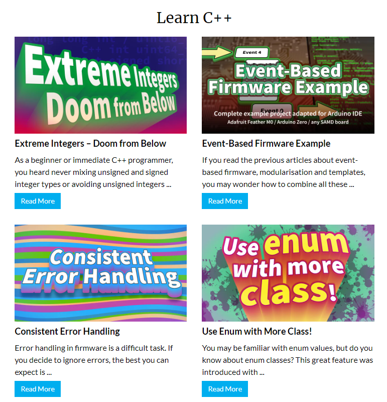
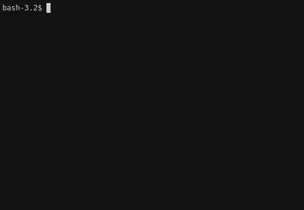
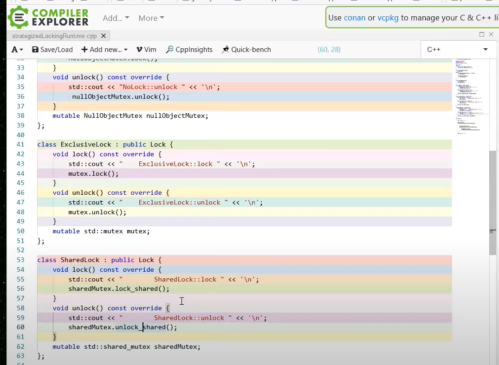
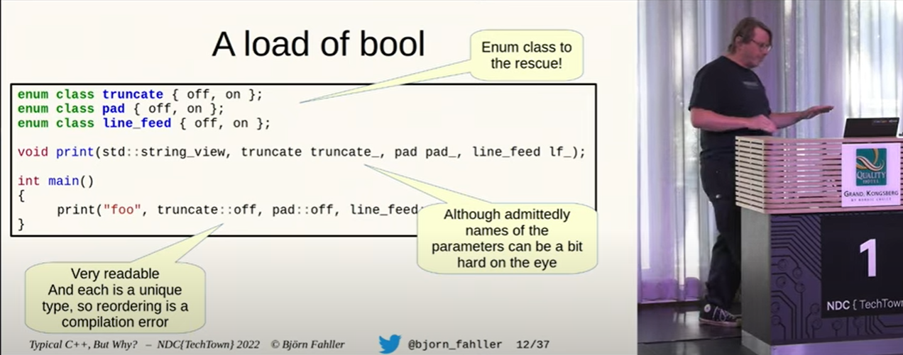

## C++ learning resources

## Books

- 2022-10-30 [Stroustrup: A Tour of C++ Third edition](https://www.stroustrup.com/tour3.html)

> The 'tour' is a quick (254 pages + index, historical information, etc.) tutorial overview of all of standard C++ (language and standard library) at a moderately high level for people who already know C++ or at least are experienced programmers. It covers C++20 plus a few likely features of C++23.

## C++ Interactive tutorials
- 2022-10-03 [Input/output with files](https://cplusplus.com/doc/tutorial/files/)
> interactive tutorial
- 2022-10-03 [Ask HN: Where can I find C++ by Example? Hacker News](https://news.ycombinator.com/item?id=33061140#33064712)
> my HN question
- https://cppbyexample.com/
- https://hackingcpp.com/
- https://www.learncpp.com/
- https://github.com/AnthonyCalandra/modern-cpp-features
- https://cppinsights.io/ it's a must so you can investigate what gets generated by templates behind the scenes.
- http://eel.is/c++draft/ bookmark this, you will need it!

These two are very good beginner resources:
- https://pythontutor.com/cpp.html
- https://www.learn-cpp.org
- https://godbolt.org
- https://root.cern/cling

- 2022-10-03 [Interactive C++ with Cling - The LLVM Project Blog](https://blog.llvm.org/posts/2020-11-30-interactive-cpp-with-cling/)

## C++ Other learning resources
- 2022-10-02 [C++ By Example Code Examples with Simple Explanations](https://cppbyexample.com/)
- 2022-10-02 [My tutorial and take on C++20 coroutines](https://www.scs.stanford.edu/~dm/blog/c++-coroutines.html)
- 2022-10-02 [uhub/awesome-cpp: A curated list of awesome C++ frameworks, libraries and software.](https://github.com/uhub/awesome-cpp)
- 2022-10-02 [Next Steps C++ Education Google Developers](https://developers.google.com/edu/c++/next-steps)
- 2022-10-02 [C++ Examples Programiz](https://www.programiz.com/cpp-programming/examples)
- 2022-10-02 [Next Steps C++ Education Google Developers](https://developers.google.com/edu/c++/next-steps)
```
Google's Introduction to Programming and C++
This online tutorial continues with more advanced concepts - please read Part III. Our focus in this module will be on using pointers, and getting started with objects.
```
- 2022-09-29 [changkun/modern-cpp-tutorial: 📚 Modern C++ Tutorial: C++11/14/17/20 On the Fly https://changkun.de/modern-cpp/](https://github.com/changkun/modern-cpp-tutorial)
- 2022-09-29 [modern-cpp-tutorial](https://changkun.de/modern-cpp/pdf/modern-cpp-tutorial-en-us.pdf)
- 2022-08-08 [Learn C++ - Lucky Resistor](https://luckyresistor.me/knowledge/learn-cpp/)

  > A collection of various tutorials, general and oriented on embedded programming
  >
  > 

### C++ CHEATSHEET
- 2022-09-26 [Rainier-Cyber/C-cheatsheet: A MEMORY DUMP OF C PROGRAMMING, by Sean Eyre @oni49 and Stephen Semmelroth @stephensemmelroth / @diodepack of Rainier Cyber acquired by StrataCore . This document is intended to provide you a quick desk reference for C’s syntax and semantics. We included several example programs that will elaborate on each section in greater detail.](https://github.com/Rainier-Cyber/C-cheatsheet)

- 2022-09-26 [karansaxena/STL_Cheat_Sheets: C++ STL Cheat Sheets.](https://github.com/karansaxena/STL_Cheat_Sheets)
- 📌 2022-09-26 [ufoym/cpp-core-guidelines-cheatsheet: Cheatsheet for the C++ core guidelines, including a set of tried-and-true guidelines, rules, and best practices about coding in C++.](https://github.com/ufoym/cpp-core-guidelines-cheatsheet)
- 2022-09-26 [muqsitnawaz/modern-cpp-cheatsheet: Cheatsheet for best practices of Modern C++ taken from Effective Modern C++](https://github.com/muqsitnawaz/modern-cpp-cheatsheet)
- 2022-09-26 [alugili/CSharp-9-CheatSheet: C# 9 Cheat Sheet with code example and pros and cons.](https://github.com/alugili/CSharp-9-CheatSheet)
- 2022-09-26 [mortennobel/cpp-cheatsheet: Modern C++ Cheatsheet](https://github.com/mortennobel/cpp-cheatsheet)
- 2022-09-26 [AnthonyCalandra/modern-cpp-features: A cheatsheet of modern C++ language and library features.](https://github.com/AnthonyCalandra/modern-cpp-features)
- 2022-09-26 [jwill9999/C-Sharp-Cheatsheet: C# Cheatsheet](https://github.com/jwill9999/C-Sharp-Cheatsheet)
- 2022-09-26 [crazyguitar/cppcheatsheet: C/C++ Cheat Sheet](https://github.com/crazyguitar/cppcheatsheet)
- 2022-09-26 [vaputa/awesome-cheatsheet: A collection of awesome cheatsheets. Including git, python, c/c++, frontend, matlab, markdown, etc.](https://github.com/vaputa/awesome-cheatsheet)


## TTY UI

- 2022-06-25 [ggerganov/imtui: ImTui: Immediate Mode Text-based User Interface C++ Library](https://github.com/ggerganov/imtui)

  > ImTui is an immediate mode text-based user interface library. Supports 256 ANSI colors and mouse/keyboard input.
  > 

- 2022-06-25 [ArthurSonzogni/FTXUI: C++ Functional Terminal User Interface.](https://github.com/ArthurSonzogni/FTXUI)

  > *Functional Terminal (X) User interface*
  >
  > A simple C++ library for terminal based user interfaces!
  > 

- 2022-11-01 [magiblot/tvision: A modern port of Turbo Vision 2.0, the classical framework for text-based user interfaces. Now cross-platform and with Unicode support.](https://github.com/magiblot/tvision)
  > 

- 2022-11-01 [dankamongmen/notcurses: blingful character graphics/TUI library. definitely not curses.](https://github.com/dankamongmen/notcurses)

  > **What it is**: a library facilitating complex TUIs on modern terminal emulators, supporting vivid colors, multimedia, threads, and Unicode to the maximum degree possible. [Things](https://www.youtube.com/watch?v=dcjkezf1ARY) can be done with Notcurses that simply can't be done with NCURSES. It is furthermore fast as shit. **What it is not**: a source-compatible X/Open Curses implementation, nor a replacement for NCURSES on existing systems.

- 2022-11-01 [gansm/finalcut: A text-based widget toolkit](https://github.com/gansm/finalcut)

  > FINAL CUT is a C++ class library and widget toolkit with full mouse support for creating a text-based user interface. The library supports the programmer to develop an application for the text console. It allows the simultaneous handling of multiple text windows on the screen.
  > [First steps · gansm/finalcut Wiki](https://github.com/gansm/finalcut/wiki/First-steps#first-steps-with-the-final-cut-widget-toolkit)

- 2022-11-01 [a-n-t-h-o-n-y/TermOx: C++17 Terminal User Interface TUI Library.](https://github.com/a-n-t-h-o-n-y/TermOx)

  > TermOx is a Terminal User Interface(TUI) Framework written in C++17. Built on top of Escape, it defines a set of Widgets, Layouts, and Events that make it quick to craft unique user interfaces in the terminal.
  > 


## Codding Style

- 2022-10-17  [C++ Core Guidelines](https://isocpp.github.io/CppCoreGuidelines/CppCoreGuidelines) by Bjarne Stroustrup, Herb Sutter
  > This is a set of core guidelines for modern C++ (currently C++20 and C++17) taking likely future enhancements and ISO Technical Specifications (TSs) into account. The aim is to help C++ programmers to write simpler, more efficient, more maintainable code.
- 2022-10-02 [Google C++ Style Guide](https://google.github.io/styleguide/cppguide.html)


## Articles

- [Modern C++ for C Programmers: part 1 - Bert Hubert's writings](https://berthub.eu/articles/posts/c++-1/)

  > Welcome to part 1 of Modern C++ for C Programmers, please see the [introduction](https://berthub.eu/articles/posts/cpp-intro/) for the goals and context of this series.
  >
  > In this part we start with C++ features that you can use to spice up your code ’line by line’, without immediately having to use all 1400 pages of ‘The C++ Programming Language’.
  >
  > Various code samples discussed here can be found on [GitHub](https://github.com/ahuPowerDNS/hello-cpp).

- 2022-03-05 [Beginner's Guide to Linkers](https://www.lurklurk.org/linkers/linkers.html)

  > This article is intended to help C & C++ programmers understand the essentials of what the linker does. I've explained this to a number of colleagues over the years, so I decided it was time to write it down so that it's more widely available.

- 2022-10-16 [What is Primitive Obsession and How Can we Fix it? HackerNoon](https://hackernoon.com/what-is-primitive-obsession-and-how-can-we-fix-it-wh2f33ki)

  > Primitive obsession is a code smell in which primitive data types are used excessively to represent your data models. The problem with primitives is they are very general. For example, a string could represent a name, an address, or even an ID. Why is this a problem?

- 2022-10-16 [Lippincott Pattern C++](https://ib-krajewski.blogspot.com/2020/05/lippincott-pattern.html)

  >  My coworkers at the then-customer were nice and open minded people so they didn't bridle at that, on the contrary, they were eager to change it and asked for advice. I simply said that they should google for the "Lippincot Pattern" and thought the matter were settled.

## Regular Expressions

- 2022-11-03 [C++ Weekly - Ep 213 - CTRE: Compile Time Regular Expressions - YouTube](https://www.youtube.com/watch?v=8aRfJp1oZGA&list=PLs3KjaCtOwSaqPapPV4pc1SRjypnwrXYV&index=2)

- 2022-11-03 [hanickadot/compile-time-regular-expressions: Compile Time Regular Expression in C++](https://github.com/hanickadot/compile-time-regular-expressions)

  > Fast compile-time regular expressions with support for matching/searching/capturing during compile-time or runtime.
  >  You can use the single header version from directory single-header. This header can be regenerated with make single-header. If you are using cmake, you can add this directory as subdirectory and link to target ctre.
  >  More info at compile-time.re


## Cross-platform testing

- 2022-10-30 [sickcodes/Docker-OSX: Run macOS VM in a Docker! Run near native OSX-KVM in Docker! X11 Forwarding! CI/CD for OS X Security Research! Docker mac Containers.](https://github.com/sickcodes/Docker-OSX)

## C++ Build tools
- 2022-10-03 [Ninja](https://ninja-build.org/)
> Ninja is a small build system with a focus on speed
- 2022-10-03 [Cmake](https://cmake.org/)
> CMake is an open-source, cross-platform family of tools designed to build, test and package software. CMake is used to control the software compilation process using simple platform and compiler independent configuration files

## C++ profiling tools
- 2022-11-12 [Measuring the memory usage of your C++ program – Daniel Lemire's blog](https://lemire.me/blog/2022/11/10/measuring-the-memory-usage-of-your-c-program/)


## C++ and Unicode
- 2022-09-29 [c++ - Is there a preprocessor define that is defined if the compiler is MSVC? - Stack Overflow](https://stackoverflow.com/questions/5850358/is-there-a-preprocessor-define-that-is-defined-if-the-compiler-is-msvc)
```
It's _MSC_VER. More info at MSDN and at predef.

But, be aware that some other compilers may also define it, e.g. Intel's C++ Compiler for Windows also defines _MSC_VER. If this is a concern, use #if _MSC_VER && !__INTEL_COMPILER.
```

- 2022-09-29 [SetConsoleCP function - Windows Console Microsoft Learn](https://learn.microsoft.com/en-us/windows/console/setconsolecp)
```
BOOL WINAPI SetConsoleCP(
  _In_ UINT wCodePageID
);
```

- 2022-09-29 [C++ not printing emojis as expected - Stack Overflow](https://stackoverflow.com/questions/71342226/c-not-printing-emojis-as-expected)
```cpp
#include <windows.h>
#include <iostream>

int main(){
  SetConsoleOutputCP(CP_UTF8);
  std::cout << "1) ✊\n";
  std::cout << "2) ✋\n";
  std::cout << "3) ✌️\n";
  return 0;
}
```

### CMAKE

- 2022-09-29 [Debugging – More Modern CMake](https://hsf-training.github.io/hsf-training-cmake-webpage/08-debugging/index.html)
> Cmake article on debugging


## Video

### Channels

- 2022-11-05 [NDC Conferences - YouTube](https://www.youtube.com/c/NDCConferences)

  > Very popular C++ conference with great speakers and talks

- 2022-11-05 [C++ Weekly With Jason Turner - YouTube](https://www.youtube.com/c/lefticus1)

  > Making C++ Fun and Accessible.

- 2022-11-10 [CppNorth - YouTube](https://www.youtube.com/channel/UCGWAlXciy785Iog-X7247Hw)
  > Winter is coming!

### Talks

2022-12-28 [Concurrency Patterns - Rainer Grimm - CppCon 2021 - YouTube](https://www.youtube.com/watch?v=A3DQxZCtKqo&list=PLHTh1InhhwT6bY4nS4p7f5b_754myC3ze&index=4)

>  This one is about the OOP C++ Concurrency patterns, like this one for locks:
>
>  


2022-11-03 [Typical C++, But Why? - Björn Fahller - NDC TechTown 2022 - YouTube](https://www.youtube.com/watch?v=PmVmaT1JNbw)

> some advice on writing more strongly-typed code, not only in C++
>
> 

2022-10-14 [Dependency management in C++ - Xavier Bonaventura - code::dive 2019 - YouTube](https://www.youtube.com/watch?v=dJpAppmRWVI)
  - 2022-10-14 [CppCon 2017: James McNellis “Everything You Ever Wanted to Know about DLLs” - YouTube](https://www.youtube.com/watch?v=JPQWQfDhICA)


# ======= C Programming Language ==========

## Dev C Articles

- 2022-03-05 [Beginner's Guide to Linkers](https://www.lurklurk.org/linkers/linkers.html)
> This article is intended to help C & C++ programmers understand the essentials of what the linker does. I've explained this to a number of colleagues over the years, so I decided it was time to write it down so that it's more widely available.

- 2022-11-28 [Everything I wish I knew when learning C - Tom M](https://tmewett.com/c-tips/)
> Learning C was quite difficult for me. The basics of the language itself weren’t so bad, but “programming in C” requires a lot of other kinds of knowledge which aren’t as easy to pick up on:
>
> - C has no environment which smooths out platform or OS differences; you need to know about your platform too
> - there are many C compiler options and build tools, making even running a simple program involve lots of decisions
> - there are important concepts related to CPUs, OSes, compiled code in general
> - it’s used in such varied ways that there’s far less a centralised “community” or style than other languages

- 2022-11-13 Building a simple shell in C

  > A basic shell that prints a prompt, waits for user to enter command and prints what they entered on the next line

  - [Building a simple shell in C - Part 1](https://blog.ehoneahobed.com/building-a-simple-shell-in-c-part-1)
  - [Building a simple shell in C - Part 2](https://blog.ehoneahobed.com/building-a-simple-shell-in-c-part-2)
  - [Building a simple shell in C - Part 3](https://blog.ehoneahobed.com/building-a-simple-shell-in-c-part-3)

- 2022-11-13 [Build Your Own Text Editor](https://viewsourcecode.org/snaptoken/kilo/)

  > Welcome! This is an instruction booklet that shows you how to build a text editor in C.
  >
  >  The text editor is antirez’s kilo, with some changes. It’s about 1000 lines of C in a single file with no dependencies, and it implements all the basic features you expect in a minimal editor, as well as syntax highlighting and a search feature.


## Dev C Tools

- 2022-03-07 [clibs/clib: C package manager-ish](https://github.com/clibs/clib)
> Package manager for the C programming language.

## Dev C Libs
# C language development

- 2022-03-05 [Cello • High Level C](https://libcello.org/)
> Cello is a library that brings higher level programming to C.
> New C syntax for New Era!
```c
#include "Cello.h"

int main(int argc, char** argv) {

  /* Stack objects are created using "$" */
  var i0 = $(Int, 5);
  var i1 = $(Int, 3);
  var i2 = $(Int, 4);

  /* Heap objects are created using "new" */
  var items = new(Array, Int, i0, i1, i2);

  /* Collections can be looped over */
  foreach (item in items) {
    print("Object %$ is of type %$\n",
      item, type_of(item));
  }

  /* Heap objects destructed via Garbage Collection */
  return 0;
}
```
- 2022-03-16 [libmill](http://libmill.org/index.html) Libmill is a library that introduces Go-style concurrency to C
```c
go(foo(arg1, arg2, arg3));
chan ch = chmake(int, 0);
chan ch = chmake(int, 1000);
chs(ch, int, 42);
```

## SIMD
- 2022-05-01 `simd` [Removing characters from strings faster with AVX-512 – Daniel Lemire's blog](https://lemire.me/blog/2022/04/28/removing-characters-from-strings-faster-with-avx-512/)
> A computer science professor at the University of Quebec (TELUQ). View all posts by Daniel Lemire
- [DragonSpit/HPCsharp: High performance algorithms in C#: SIMD/SSE, multi-core and faster](https://github.com/DragonSpit/HPCsharp)
- (2021-09-26) [google/highway: Performance-portable, length-agnostic SIMD with runtime dispatch](https://github.com/google/highway)
- (2021-12-26) [Splitting CSV files at 3GB/s · Tinybird](https://blog.tinybird.co/2021/12/14/simd/) with SIMD! Good C lang examples on this topic.
