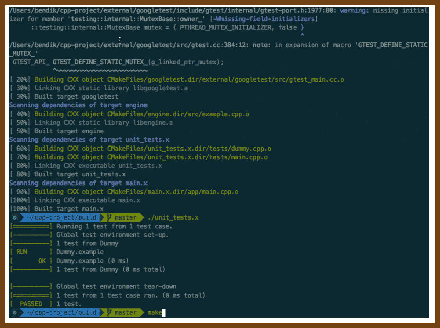
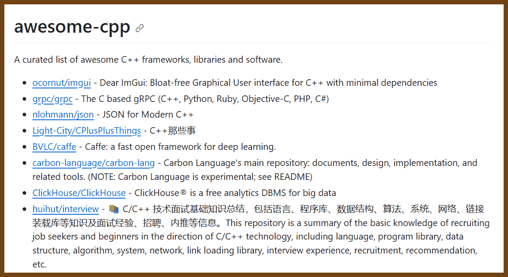
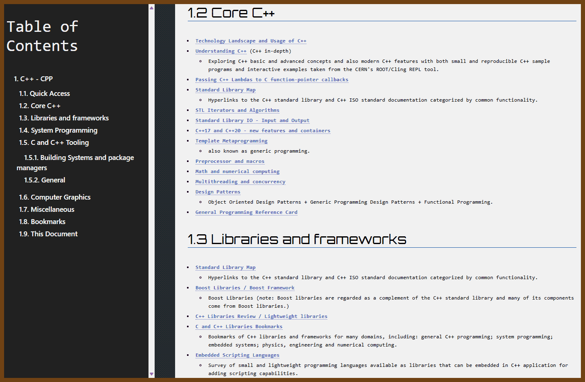
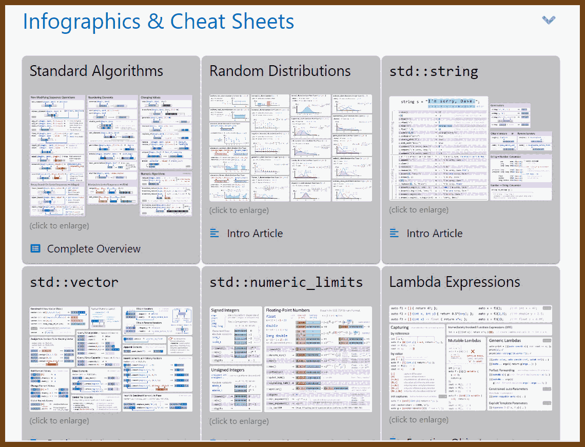
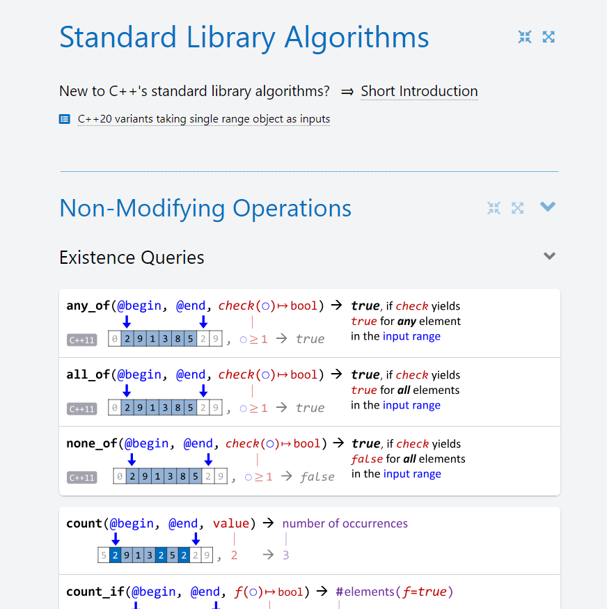
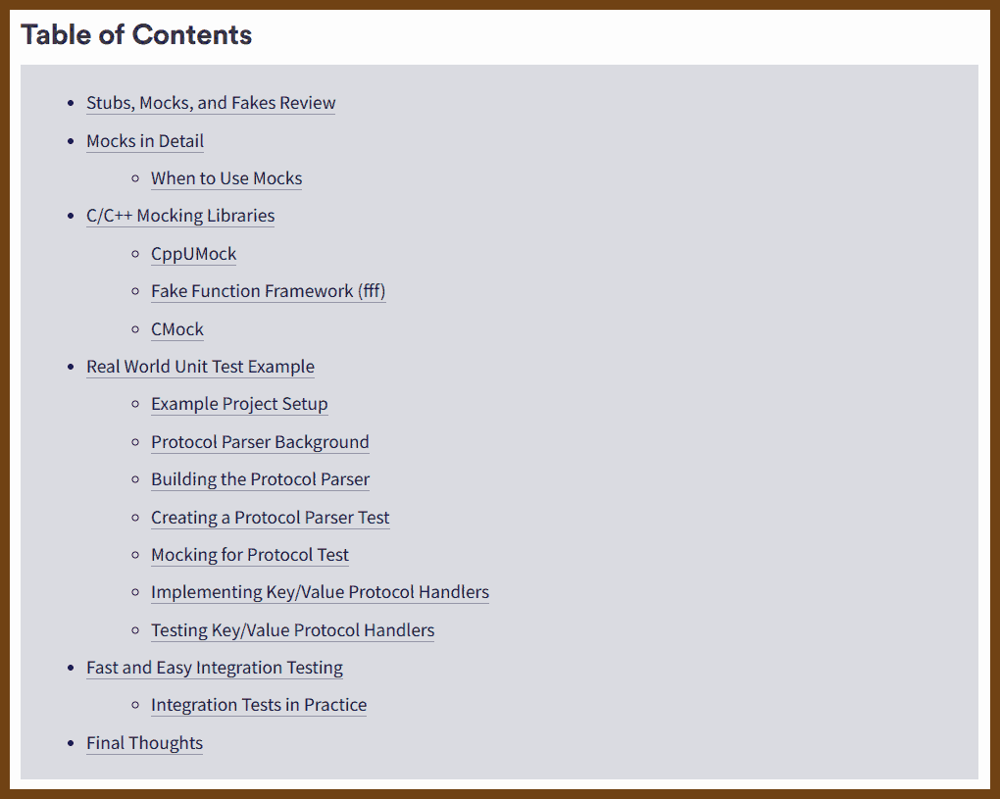
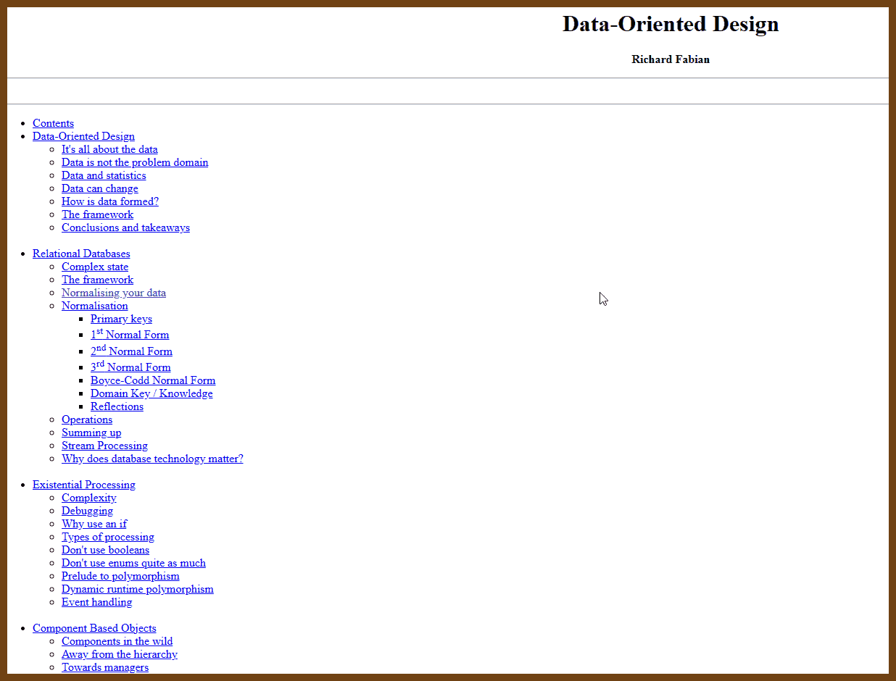

## C++ learning resources

[[_TOC_]]


## New Project Templates

2023-05-17 [cpp-best-practices/cmake_template](https://github.com/cpp-best-practices/cmake_template)

> "cmake_template" is a C++ Best Practices GitHub template designed for quick C++ project setups. Currently undergoing a major update, it enables Address Sanitizer, Undefined Behavior Sanitizer, treats warnings as errors, and performs static analysis using clang-tidy and cppcheck. It uses CPM for dependencies and provides a basic CLI example, testing examples, and a large Github action testing matrix. It requires cmake and a compiler to use. The project includes a simple usage example of FTXUI, featuring a game.

2023-05-17  [bsamseth/cpp-project: Boiler plate template for C++ projects, with CMake, Doctest, Travis CI, Appveyor, Github Actions and coverage reports.](https://github.com/bsamseth/cpp-project)

> This is a boiler plate for C++ projects. What you get:
>
> - Sources, headers and mains separated in distinct folders
> - Use of modern [CMake](https://cmake.org/) for much easier compiling
> - Setup for tests using [doctest](https://github.com/onqtam/doctest)
> - Continuous testing with [Travis-CI](https://travis-ci.org/), [Appveyor](https://www.appveyor.com/) and [GitHub Actions](https://github.com/features/actions), with support for C++17.
> - Code coverage reports, including automatic upload to [Coveralls.io](https://coveralls.io/) and/or [Codecov.io](https://codecov.io/)
> - Code documentation with [Doxygen](http://www.stack.nl/~dimitri/doxygen/)
>
> 

## Books

- 2022-10-30 [Stroustrup: A Tour of C++ Third edition](https://www.stroustrup.com/tour3.html)

> The 'tour' is a quick (254 pages + index, historical information, etc.) tutorial overview of all of standard C++ (language and standard library) at a moderately high level for people who already know C++ or at least are experienced programmers. It covers C++20 plus a few likely features of C++23.

## 

- 2023-06-24 👃 [60 terrible tips for a C++ developer](https://pvs-studio.com/en/blog/posts/cpp/1053/)

> 60 Dirty tips for dirty developers ;)
>
> Almost a book!
>
> - [Terrible tip N3. Nested macros](https://pvs-studio.com/en/blog/posts/cpp/1053/#IDB41BD4E93A)
> - [Terrible tip N4. Disable warnings](https://pvs-studio.com/en/blog/posts/cpp/1053/#IDC924C5C2DE)
> - [Terrible tip N5. The shorter the variable name is, the better](https://pvs-studio.com/en/blog/posts/cpp/1053/#ID435EA082EE)
> - [Terrible tip N6. Invisible characters](https://pvs-studio.com/en/blog/posts/cpp/1053/#ID94606C1576)
> - [Terrible tip N7. Magic numbers](https://pvs-studio.com/en/blog/posts/cpp/1053/#ID90FBE85088)
> - [Terrible tip N8. int, int everywhere](https://pvs-studio.com/en/blog/posts/cpp/1053/#ID2FB1279C3F)
> - [Terrible tip N9. Global variables](https://pvs-studio.com/en/blog/posts/cpp/1053/#IDA9A515DF38)
> - [Terrible tip N10. The abort function in libraries](https://pvs-studio.com/en/blog/posts/cpp/1053/#ID65E575FE16)
> - [Terrible tip N11. The compiler is to blame for everything](https://pvs-studio.com/en/blog/posts/cpp/1053/#ID65184F1F33)
> - [Terrible tip N12. Feel free to use argv](https://pvs-studio.com/en/blog/posts/cpp/1053/#ID1AB91381F6)
>
> ... and the list goes on and on

## C++ Interactive tutorials
- 2022-10-03 [Input/output with files](https://cplusplus.com/doc/tutorial/files/)
> interactive tutorial
- 2022-10-03 [Ask HN: Where can I find C++ by Example? Hacker News](https://news.ycombinator.com/item?id=33061140#33064712)
> my HN question
- https://cppbyexample.com/
- https://hackingcpp.com/
- https://www.learncpp.com/
- https://github.com/AnthonyCalandra/modern-cpp-features
- https://cppinsights.io/ it's a must so you can investigate what gets generated by templates behind the scenes.
- http://eel.is/c++draft/ bookmark this, you will need it!

These two are very good beginner resources:
- https://pythontutor.com/cpp.html
- https://www.learn-cpp.org
- https://godbolt.org
- https://root.cern/cling

- 2022-10-03 [Interactive C++ with Cling - The LLVM Project Blog](https://blog.llvm.org/posts/2020-11-30-interactive-cpp-with-cling/)


## C++ Awesome Lists

- 2023-10-29 [fffaraz/awesome-cpp ](https://github.com/fffaraz/awesome-cpp)

> A curated list of awesome C++ (or C) frameworks, libraries, resources, and shiny things. Inspired by awesome-... stuff.
>
> 

- 2023-10-29 [JesseTG/awesome-qt](https://github.com/JesseTG/awesome-qt)

>  A curated list of awesome tools, libraries, and resources for the Qt framework.
>
> 

- 2022-10-02 [uhub/awesome-cpp: A curated list of awesome C++ frameworks, libraries and software.](https://github.com/uhub/awesome-cpp)

> 


## C++ Other learning resources

- 2024-12-22 [Embedded Scripting Languages](https://caiorss.github.io/C-Cpp-Notes/embedded_scripting_languages.html#org4c5951c) { caiorss.github.io }

  > 

- 2024-12-22 [CPP C++ Papyrus](https://caiorss.github.io/C-Cpp-Notes/#org3506a7e) { caiorss.github.io }

  > 

- 2023-12-30 [Learn Contemporary C++ | Concise&Visual Examples | hacking C++](https://hackingcpp.com/index.html)

> 

- 2023-12-30 [C++ Standard Library Algorithms Visual Overview | hacking C++](https://hackingcpp.com/cpp/std/algorithms.html)

> 
>
> Amazing effort to visualize how the standard algorithms in C++ work. 


- 2023-12-30 [Best C++ Programming Blogs in 2023 | hacking C++](https://hackingcpp.com/cpp/blogs.html)

> 


- 
- 2023-02-12 [Learn C++ – Skill up with our free tutorials](https://www.learncpp.com/)
- 2022-10-02 [C++ By Example Code Examples with Simple Explanations](https://cppbyexample.com/)
- 2022-10-02 [My tutorial and take on C++20 coroutines](https://www.scs.stanford.edu/~dm/blog/c++-coroutines.html)
- 2022-10-02 [Next Steps C++ Education Google Developers](https://developers.google.com/edu/c++/next-steps)
- 2022-10-02 [C++ Examples Programiz](https://www.programiz.com/cpp-programming/examples)
- 2022-10-02 [Next Steps C++ Education Google Developers](https://developers.google.com/edu/c++/next-steps)

```
Google's Introduction to Programming and C++
This online tutorial continues with more advanced concepts - please read Part III. Our focus in this module will be on using pointers, and getting started with objects.
```
- 2022-09-29 [changkun/modern-cpp-tutorial: 📚 Modern C++ Tutorial: C++11/14/17/20 On the Fly https://changkun.de/modern-cpp/](https://github.com/changkun/modern-cpp-tutorial)
- 2022-09-29 [modern-cpp-tutorial](https://changkun.de/modern-cpp/pdf/modern-cpp-tutorial-en-us.pdf)
- 2022-08-08 [Learn C++ - Lucky Resistor](https://luckyresistor.me/knowledge/learn-cpp/)

  > A collection of various tutorials, general and oriented on embedded programming
  >
  > 

2023-08-14 [Performance Ninja -- Data Packing Intro - YouTube](https://www.youtube.com/watch?v=-V-oIXrqA2s&list=PLRWO2AL1QAV6bJAU2kgB4xfodGID43Y5d&index=1)

>  2023-08-14 [GitHub - dendibakh/perf-ninja: This is an online course where you can learn and master the skill of low-level performance analysis and tuning.](https://github.com/dendibakh/perf-ninja)
> Performance Ninja Class
> This is an online course where you can learn to find and fix low-level performance issues, for example CPU cache misses and branch mispredictions. It's all about practice. So we offer you this course in a form of lab assignments and youtube videos. You will spend at least 90% of the time analyzing performance of the code and trying to improve it.

> 

> 


### C++ CHEATSHEET

- 2022-09-26 [Rainier-Cyber/C-cheatsheet: A MEMORY DUMP OF C PROGRAMMING, by Sean Eyre @oni49 and Stephen Semmelroth @stephensemmelroth / @diodepack of Rainier Cyber acquired by StrataCore . This document is intended to provide you a quick desk reference for C’s syntax and semantics. We included several example programs that will elaborate on each section in greater detail.](https://github.com/Rainier-Cyber/C-cheatsheet)

- 2022-09-26 [karansaxena/STL_Cheat_Sheets: C++ STL Cheat Sheets.](https://github.com/karansaxena/STL_Cheat_Sheets)
- 📌 2022-09-26 [ufoym/cpp-core-guidelines-cheatsheet: Cheatsheet for the C++ core guidelines, including a set of tried-and-true guidelines, rules, and best practices about coding in C++.](https://github.com/ufoym/cpp-core-guidelines-cheatsheet)
- 2022-09-26 [muqsitnawaz/modern-cpp-cheatsheet: Cheatsheet for best practices of Modern C++ taken from Effective Modern C++](https://github.com/muqsitnawaz/modern-cpp-cheatsheet)
- 2022-09-26 [alugili/CSharp-9-CheatSheet: C# 9 Cheat Sheet with code example and pros and cons.](https://github.com/alugili/CSharp-9-CheatSheet)
- 2022-09-26 [mortennobel/cpp-cheatsheet: Modern C++ Cheatsheet](https://github.com/mortennobel/cpp-cheatsheet)
- 2022-09-26 [AnthonyCalandra/modern-cpp-features: A cheatsheet of modern C++ language and library features.](https://github.com/AnthonyCalandra/modern-cpp-features)
- 2022-09-26 [jwill9999/C-Sharp-Cheatsheet: C# Cheatsheet](https://github.com/jwill9999/C-Sharp-Cheatsheet)
- 2022-09-26 [crazyguitar/cppcheatsheet: C/C++ Cheat Sheet](https://github.com/crazyguitar/cppcheatsheet)
- 2022-09-26 [vaputa/awesome-cheatsheet: A collection of awesome cheatsheets. Including git, python, c/c++, frontend, matlab, markdown, etc.](https://github.com/vaputa/awesome-cheatsheet)

## C / C++ and GUI

2023-10-28 [Skia](https://skia.org/)

> C++ Skia is an open source 2D graphics library which provides common APIs that work across a variety of hardware and software platforms. It serves as the graphics engine for Google Chrome and ChromeOS, Android, Flutter, and many other products.
> https://skia.org/docs/user/modules/canvaskit/
>
> 


## TTY UI

- 2023-12-30 [rothgar/awesome-tuis: List of projects that provide terminal user interfaces](https://github.com/rothgar/awesome-tuis)

> - [CursedGL](https://github.com/saccharineboi/CursedGL) A **C** notcurses-based software rasterizer inspired by OpenGL 1.X that renders directly to the terminal.
> - [FINAL CUT](https://github.com/gansm/finalcut) **C++** library for creating terminal applications with text-based widgets
> - [FTXUI](https://github.com/ArthurSonzogni/FTXUI) 💻 **C++** Functional Terminal User Interface. ❤️
> - [ncurses](https://invisible-island.net/ncurses/announce.html) A classic **C** library with bindings for many languages

- 2022-06-25 [ggerganov/imtui: ImTui: Immediate Mode Text-based User Interface C++ Library](https://github.com/ggerganov/imtui)

  > ImTui is an immediate mode text-based user interface library. Supports 256 ANSI colors and mouse/keyboard input.
  > 

- 2022-06-25 [ArthurSonzogni/FTXUI: C++ Functional Terminal User Interface.](https://github.com/ArthurSonzogni/FTXUI)

  > *Functional Terminal (X) User interface*
  >
  > A simple C++ library for terminal based user interfaces!
  > 

- 2022-11-01 [magiblot/tvision: A modern port of Turbo Vision 2.0, the classical framework for text-based user interfaces. Now cross-platform and with Unicode support.](https://github.com/magiblot/tvision)
  > 

- 2022-11-01 [dankamongmen/notcurses: blingful character graphics/TUI library. definitely not curses.](https://github.com/dankamongmen/notcurses)

  > **What it is**: a library facilitating complex TUIs on modern terminal emulators, supporting vivid colors, multimedia, threads, and Unicode to the maximum degree possible. [Things](https://www.youtube.com/watch?v=dcjkezf1ARY) can be done with Notcurses that simply can't be done with NCURSES. It is furthermore fast as shit. **What it is not**: a source-compatible X/Open Curses implementation, nor a replacement for NCURSES on existing systems.

- 2022-11-01 [gansm/finalcut: A text-based widget toolkit](https://github.com/gansm/finalcut)

  > FINAL CUT is a C++ class library and widget toolkit with full mouse support for creating a text-based user interface. The library supports the programmer to develop an application for the text console. It allows the simultaneous handling of multiple text windows on the screen.
  > [First steps · gansm/finalcut Wiki](https://github.com/gansm/finalcut/wiki/First-steps#first-steps-with-the-final-cut-widget-toolkit)

- 2022-11-01 [a-n-t-h-o-n-y/TermOx: C++17 Terminal User Interface TUI Library.](https://github.com/a-n-t-h-o-n-y/TermOx)

  > TermOx is a Terminal User Interface(TUI) Framework written in C++17. Built on top of Escape, it defines a set of Widgets, Layouts, and Events that make it quick to craft unique user interfaces in the terminal.
  > 


## Codding Style

- 2022-10-17  [C++ Core Guidelines](https://isocpp.github.io/CppCoreGuidelines/CppCoreGuidelines) by Bjarne Stroustrup, Herb Sutter
  > This is a set of core guidelines for modern C++ (currently C++20 and C++17) taking likely future enhancements and ISO Technical Specifications (TSs) into account. The aim is to help C++ programmers to write simpler, more efficient, more maintainable code.
- 2022-10-02 [Google C++ Style Guide](https://google.github.io/styleguide/cppguide.html)


## Articles

- 2023-06-24 [Make your programs run faster by better using the data cache - Johnny's Software Lab](https://johnnysswlab.com/make-your-programs-run-faster-by-better-using-the-data-cache/)

  >  It covers the following topics and tips:
  >
  > - The concept and importance of **cache memory** and how it compensates for the difference in speed between processor and main memory.
  > - The principles of **temporal and spatial locality**, which govern the behavior of real-world programs and affect the cache performance.
  > - The tips and rules for **better exploiting the data cache** in different scenarios, such as:
  >   - Using **arrays** of classes or structs instead of values, to increase the cache utilization and reduce the cache misses.
  >   - Aligning the **starting address of the array** and the **class data** to the cache line size, to avoid splitting the data across multiple cache lines and to optimize the cache access.
  >   - Performing **loop interchange** on **matrices**, to move the loop over the innermost position and to eliminate column-wise accesses, which are costly for the cache.
  >   - Avoiding **padding** in **classes and structs**, to make sure they are correctly aligned and to reduce the cache overhead.
  >   - Sorting the **variables in the declaration** of the classes by size from largest to smallest, to guarantee that the compiler will not insert any padding and to optimize the cache access.
  > - The tools and references available to help with the data cache optimization, such as **pahole** and **StuctLayout**, which can help with exploring and visualizing the paddings in the classes.

- [Modern C++ for C Programmers: part 1 - Bert Hubert's writings](https://berthub.eu/articles/posts/c++-1/)

  > Welcome to part 1 of Modern C++ for C Programmers, please see the [introduction](https://berthub.eu/articles/posts/cpp-intro/) for the goals and context of this series.
  >
  > In this part we start with C++ features that you can use to spice up your code ’line by line’, without immediately having to use all 1400 pages of ‘The C++ Programming Language’.
  >
  > Various code samples discussed here can be found on [GitHub](https://github.com/ahuPowerDNS/hello-cpp).

- 2022-03-05 [Beginner's Guide to Linkers](https://www.lurklurk.org/linkers/linkers.html)

  > This article is intended to help C & C++ programmers understand the essentials of what the linker does. I've explained this to a number of colleagues over the years, so I decided it was time to write it down so that it's more widely available.

- 2022-10-16 [What is Primitive Obsession and How Can we Fix it? HackerNoon](https://hackernoon.com/what-is-primitive-obsession-and-how-can-we-fix-it-wh2f33ki)

  > Primitive obsession is a code smell in which primitive data types are used excessively to represent your data models. The problem with primitives is they are very general. For example, a string could represent a name, an address, or even an ID. Why is this a problem?

- 2022-10-16 [Lippincott Pattern C++](https://ib-krajewski.blogspot.com/2020/05/lippincott-pattern.html)

  >  My coworkers at the then-customer were nice and open minded people so they didn't bridle at that, on the contrary, they were eager to change it and asked for advice. I simply said that they should google for the "Lippincot Pattern" and thought the matter were settled.
  
- 2023-10-13 [Embedded C/C++ Unit Testing with Mocks | Interrupt](https://interrupt.memfault.com/blog/unit-test-mocking)

  > Writing a unit test from scratch for an embedded software project is almost always an exercise in frustration, patience, and determination. This is because of the constraints, as well as breadth, of embedded software. It combines hardware drivers, operating systems, high-level software, and communication protocols and stacks all within one software package and is usually managed by a single team. Due to these complexities, the number of dependencies of a single file can quickly grow out of control.
  >
  > 

## Regular Expressions

- 2022-11-03 [C++ Weekly - Ep 213 - CTRE: Compile Time Regular Expressions - YouTube](https://www.youtube.com/watch?v=8aRfJp1oZGA&list=PLs3KjaCtOwSaqPapPV4pc1SRjypnwrXYV&index=2)

- 2022-11-03 [hanickadot/compile-time-regular-expressions: Compile Time Regular Expression in C++](https://github.com/hanickadot/compile-time-regular-expressions)

  > Fast compile-time regular expressions with support for matching/searching/capturing during compile-time or runtime.
  >  You can use the single header version from directory single-header. This header can be regenerated with make single-header. If you are using cmake, you can add this directory as subdirectory and link to target ctre.
  >  More info at compile-time.re


## Cross-platform testing

- 2022-10-30 [sickcodes/Docker-OSX: Run macOS VM in a Docker! Run near native OSX-KVM in Docker! X11 Forwarding! CI/CD for OS X Security Research! Docker mac Containers.](https://github.com/sickcodes/Docker-OSX)
- 2023-02-12 💥 [GitHub - foxlet/macOS-Simple-KVM: Tools to set up a quick macOS VM in QEMU, accelerated by KVM.](https://github.com/foxlet/macOS-Simple-KVM)


## Optimization 

2023-08-01 💡 [Agner Fog](https://www.agner.org/)

> According to ChatGPT: Agner Fog is a Danish professor known for his work in cultural selection theory, optimization methods, and system development methods. He holds a PhD in Operations Research and has a diverse educational background including sociology, statistics, and computer science.
>
> One of his main contributions to the field of computer science is his development of CPU dispatcher software and comprehensive documentation of instruction latencies and throughputs for various CPU models. His optimization guides and tools are popular among performance-oriented programmers.
>
> In the field of social sciences, he has developed a theory of cultural selection, which is similar to biological evolution but acts on cultural phenomena such as norms, traditions, language, technology, and art.
>
> ---
>
> Software optimization resources
>
> Optimization manuals
>
> #### Optimizing software in C++: An optimization guide for Windows, Linux and Mac platforms
>
> This is an optimization manual for advanced C++ programmers. Topics include: The choice of platform and operating system. Choice of compiler and framework. Finding performance bottlenecks. The efficiency of different C++ constructs. Multi-core systems. Parallelization with vector operations. CPU dispatching. Efficient container class templates. Etc.
>
> File name: optimizing_cpp.pdf, size: 1838972, last modified: 2023-Jul-01.
> [Download](https://www.agner.org/optimize/optimizing_cpp.pdf).
>
> ### The microarchitecture of Intel, AMD and VIA CPUs: An optimization guide for assembly programmers and compiler makers
>
> This manual contains details about the internal working of various microprocessors from Intel, AMD and VIA. Topics include: Out-of-order execution, register renaming, pipeline structure, execution unit organization and branch prediction algorithms for each type of microprocessor. Describes many details that cannot be found in manuals from microprocessor vendors or anywhere else. The information is based on my own research and measurements rather than on official sources. This information will be useful to programmers who want to make CPU-specific optimizations as well as to compiler makers and students of microarchitecture.
>
> File name: microarchitecture.pdf, size: 2472395, last modified: 2023-Jul-01.
> [Download](https://www.agner.org/optimize/microarchitecture.pdf).
>
> ## C++ vector class library
>
> This is a collection of C++ classes, functions and operators that makes it easier to use the the vector instructions (Single Instruction Multiple Data instructions) of modern CPUs without using assembly language. Supports the SSE2, SSE3, SSSE3, SSE4.1, SSE4.2, AVX, AVX2, FMA, XOP, and AVX512F/BW/DQ/VL instruction sets. Includes standard mathematical functions. Can compile for different instruction sets from the same source code.
> [Description and instructions](https://www.agner.org/optimize/vcl_manual.pdf).
> [Message board](https://www.agner.org/forum/viewforum.php?f=1).
> [Source on Github](https://github.com/vectorclass).
> [Nice little instruction video by WhatsaCreel](https://www.youtube.com/watch?v=TKjYdLIMTrI).
>
> [Latest release](https://github.com/vectorclass/version2/releases).
>
> 

2023-08-05 Book [Data-Oriented Design](https://www.dataorienteddesign.com/dodbook/) Richard Fabian

> Online release of Data-Oriented Design :
> This is the free, online, reduced version. Some inessential chapters are excluded from this version, but in the spirit of this being an education resource, the essentials are present for anyone wanting to learn about data-oriented design.
> Expect some odd formatting and some broken images and listings as this is auto generated and the Latex to html converters available are not perfect. If the source code listing is broken, you should be able to find the referenced source on [github](https://github.com/raspofabs/dodbooksourcecode/). If you like what you read here, consider purchasing the real paper book from [here](https://www.amazon.com/dp/1916478700), as not only will it look a lot better, but it will help keep this version online for those who cannot afford to buy it.
> 
>
> DOD


2023-07-25 [Getting Friendly With CPU Caches](https://www.ardanlabs.com/blog/2023/07/getting-friendly-with-cpu-caches.html)

> When a CPU needs to access a piece of data, the data needs to travel into the processor from main memory.
>
> The architecture looks something like this:
>
> **Figure 1: CPU Cache**
>
> 

> Figure 1 shows the different layers of memory a piece of data has to travel to be accessible by the processor. Each CPU has its own L1 and L2 cache, and the L3 cache is shared among all CPUs. When the data finally makes its way inside the L1 or L2 cache, the processor can access it for execution purposes. On Intel architectures the L3 cache maintains a copy of what is in L1 and L2.
>
> Performance in the end is about how efficiently data can flow into the processor. As you can see from the diagram, main memory access is about 80 times slower than accessing the L1 cache since the data needs to be moved and copied.
>
> *Note: [Memory Performance in a Nutshell](https://www.intel.com/content/www/us/en/developer/articles/technical/memory-performance-in-a-nutshell.html): The data is from 2016 but what’s important are the latency ratios which are pretty constant.*

2023-08-06 [CPP How branches influence the performance of your code and what can you do about it? - Johnny's Software Lab](https://johnnysswlab.com/how-branches-influence-the-performance-of-your-code-and-what-can-you-do-about-it/)

> from 2023-08-06 [Programming Digest - A newsletter about programming and technology](https://programmingdigest.net/)

2023-08-07 [CPP Crash course introduction to parallelism: SIMD Parallelism - Johnny's Software Lab](https://johnnysswlab.com/crash-course-introduction-to-parallelism-simd-parallelism/)

2023-08-07 [CPP Make your programs run faster by better using the data cache - Johnny's Software Lab](https://johnnysswlab.com/make-your-programs-run-faster-by-better-using-the-data-cache/)

2023-08-07 [CPP Bit Twiddling Hacks](https://graphics.stanford.edu/~seander/bithacks.html#CopyIntegerSign)

```c
Conditionally set or clear bits without branching
bool f;         // conditional flag
unsigned int m; // the bit mask
unsigned int w; // the word to modify:  if (f) w |= m; else w &= ~m; 

w ^= (-f ^ w) & m;

// OR, for superscalar CPUs:
w = (w & ~m) | (-f & m);
```

> 

2023-09-25 [Parsing integers quickly with AVX-512 – Daniel Lemire's blog](https://lemire.me/blog/2023/09/22/parsing-integers-quickly-with-avx-512/)

> If I give a programmer a string such as `"9223372036854775808"` and I ask them to convert it to an integer, they might do the following in C++:

```cpp
std::string s = ....
uint64_t val;
auto [ptr, ec] =
std::from_chars(s.data(), s.data() + s.size(), val);
if (ec != std::errc()) {} // I have an error !
// val holds the value
```

>  It is very fast: you can parse a sequence of random 32-bit integers at about 40 cycles per integer, using about 128 instructions.

>  Can you do better?

```cpp
auto DIGIT_VALUE_BASE10_8BIT =
_mm256_set_epi8(1, 10, 1, 10, 1, 10, 1, 10,
1, 10, 1, 10, 1, 10, 1, 10,
1, 10, 1, 10, 1, 10, 1, 10,
1, 10, 1, 10, 1, 10, 1, 10);
auto DIGIT_VALUE_BASE10E2_8BIT = _mm_set_epi8(
1, 100, 1, 100, 1, 100, 1, 100, 1, 100, 1, 100, 1, 100, 1, 100);
auto DIGIT_VALUE_BASE10E4_16BIT =
_mm_set_epi16(1, 10000, 1, 10000, 1, 10000, 1, 10000);
auto base10e2_16bit =
_mm256_maddubs_epi16(base10_8bit, DIGIT_VALUE_BASE10_8BIT);
auto base10e2_8bit = _mm256_cvtepi16_epi8(base10e2_16bit);
auto base10e4_16bit =
_mm_maddubs_epi16(base10e2_8bit, DIGIT_VALUE_BASE10E2_8BIT);
auto base10e8_32bit =
_mm_madd_epi16(base10e4_16bit, DIGIT_VALUE_BASE10E4_16BIT);
```

| AVX-512         | 1.8 GB/s | 57 instructions/number  | 17 cycles/number |
| --------------- | -------- | ----------------------- | ---------------- |
| std::from_chars | 0.8 GB/s | 128 instructions/number | 39 cycles/number |


## Compilers

2023-12-01 [Compiler Options Hardening Guide for C and C++ | OpenSSF Best Practices Working Group](https://best.openssf.org/Compiler-Hardening-Guides/Compiler-Options-Hardening-Guide-for-C-and-C++.html)

TL;DR: What compiler options should I use?

When compiling C or C++ code on compilers such as GCC and clang, turn on these flags for detecting vulnerabilities at compile time and enable run-time protection mechanisms:

```
-O2 -Wall -Wformat=2 -Wconversion -Wimplicit-fallthrough \
-U_FORTIFY_SOURCE -D_FORTIFY_SOURCE=3 \
-D_GLIBCXX_ASSERTIONS \
-fstrict-flex-arrays=3 \
-fstack-clash-protection -fstack-protector-strong \
-Wl,-z,nodlopen -Wl,-z,noexecstack \
-Wl,-z,relro -Wl,-z,now
```

Note that support for some options may differ between different compilers, e.g. support for [`-D_FORTIFY_SOURCE`](https://best.openssf.org/Compiler-Hardening-Guides/Compiler-Options-Hardening-Guide-for-C-and-C++.html#-D_FORTIFY_SOURCE=3) varies depending on the compiler[2](https://best.openssf.org/Compiler-Hardening-Guides/Compiler-Options-Hardening-Guide-for-C-and-C++.html#fn:Guelton20) and C standard library implementations. See the discussion below for [background](https://best.openssf.org/Compiler-Hardening-Guides/Compiler-Options-Hardening-Guide-for-C-and-C++.html#background) and for [detailed discussion of each option](https://best.openssf.org/Compiler-Hardening-Guides/Compiler-Options-Hardening-Guide-for-C-and-C++.html#recommended-compiler-options).

When compiling code in any of the situations in the below table, add the corresponding additional options:

| When                 | Additional options flags                                     |
| :------------------- | :----------------------------------------------------------- |
| using GCC            | `-Wtrampolines`                                              |
| for executables      | `-fPIE -pie`                                                 |
| for shared libraries | `-fPIC -shared`                                              |
| for x86_64           | `-fcf-protection=full`                                       |
| for aarch64          | `-mbranch-protection=standard`                               |
| for production code  | `-fno-delete-null-pointer-checks -fno-strict-overflow -fno-strict-aliasing -ftrivial-auto-var-init=zero` |


## C++ Build tools

- 2022-10-03 [Ninja](https://ninja-build.org/)
> Ninja is a small build system with a focus on speed
- 2022-10-03 [Cmake](https://cmake.org/)
> CMake is an open-source, cross-platform family of tools designed to build, test and package software. CMake is used to control the software compilation process using simple platform and compiler independent configuration files

## C++ profiling tools
- 2022-11-12 [Measuring the memory usage of your C++ program – Daniel Lemire's blog](https://lemire.me/blog/2022/11/10/measuring-the-memory-usage-of-your-c-program/)


## C++ and Unicode
- 2022-09-29 [c++ - Is there a preprocessor define that is defined if the compiler is MSVC? - Stack Overflow](https://stackoverflow.com/questions/5850358/is-there-a-preprocessor-define-that-is-defined-if-the-compiler-is-msvc)
```
It's _MSC_VER. More info at MSDN and at predef.

But, be aware that some other compilers may also define it, e.g. Intel's C++ Compiler for Windows also defines _MSC_VER. If this is a concern, use #if _MSC_VER && !__INTEL_COMPILER.
```

- 2022-09-29 [SetConsoleCP function - Windows Console Microsoft Learn](https://learn.microsoft.com/en-us/windows/console/setconsolecp)
```
BOOL WINAPI SetConsoleCP(
  _In_ UINT wCodePageID
);
```

- 2022-09-29 [C++ not printing emojis as expected - Stack Overflow](https://stackoverflow.com/questions/71342226/c-not-printing-emojis-as-expected)
```cpp
#include <windows.h>
#include <iostream>

int main(){
  SetConsoleOutputCP(CP_UTF8);
  std::cout << "1) ✊\n";
  std::cout << "2) ✋\n";
  std::cout << "3) ✌️\n";
  return 0;
}
```

2023-07-25 [Unicode is harder than you think · mcilloni's blog](https://mcilloni.ovh/2023/07/23/unicode-is-hard/)

> Reading the excellent article by JeanHeyd Meneide on [how broken string encoding in C/C++ is](https://thephd.dev/the-c-c++-rust-string-text-encoding-api-landscape) made me realise that Unicode is a topic that is often overlooked by a large number of developers. In my experience, there’s a lot of confusion and wrong expectations on what Unicode is, and what best practices to follow when dealing with strings that may contain characters outside of the ASCII range.
>
> This article attempts to briefly summarise and clarify some of the most common misconceptions I’ve seen people struggle with, and some of the pitfalls that tend to recur in codebases that have to deal with non-ASCII text.


## CMAKE

- 2022-09-29 [Debugging – More Modern CMake](https://hsf-training.github.io/hsf-training-cmake-webpage/08-debugging/index.html)
> Cmake article on debugging

## C++ Libraries and Lib Collections

2023-09-02 [Home | Csound Community](https://csound.com/)

> Csound is a sound and music computing system which was originally developed by Barry Vercoe in 1985 at MIT Media Lab. Since the 90s, it has been developed by a group of core developers. A wider community of volunteers contribute examples, documentation, articles, and takes part in the Csound development with bug reports, feature requests and discussions with the core development team.

2023-02-02 [A list of open source C++ libraries - cppreference.com](https://en.cppreference.com/w/cpp/links/libs) 

> The objective of this page is to build a comprehensive list of open source C++ libraries, so that when one needs an implementation of particular functionality, one needn't to waste time searching on web.

2023-05-10 [DNedic/lockfree: A collection of lock-free data structures written in standard C++11](https://github.com/DNedic/lockfree)

> What are lock-free data structures?
> Lock-free data structures are data structures that are thread and interrupt safe without having to use mutual exclusion mechanisms. Lock-free data structures are most useful for inter process communication, but due to the efficiency of lockfree, it can safely be used for single threaded uses as well, making it good for general purpose use.

2023-07-23 [STX: Main Page](https://lamarrr.github.io/STX/)

>  [lamarrr/STX: C++17 & C++ 20 error-handling and utility extensions.](https://github.com/lamarrr/STX)
>  These monadic types not only make error handling easier but also make the paths more obvious to the compiler for optimizations. Monads can be simply thought of as abstract types of actions. Their monadic nature makes it easy to operate on them as pipelines and in the process eliminate redundant error-handling logic code.
>
>  - `stx::Result<T, E>` : Type for relaying the result of a function that can fail or succeed (with monadic extensions)
>  - `stx::Option<T>` : Type for **safe** optional values (with monadic extensions)

2023-09-15 [hanickadot/compile-time-regular-expressions: Compile Time Regular Expression in C++](https://github.com/hanickadot/compile-time-regular-expressions)

> Fast compile-time regular expressions with support for matching/searching/capturing during compile-time or runtime.
>
> You can use the single header version from directory `single-header`. This header can be regenerated with `make single-header`. If you are using cmake, you can add this directory as subdirectory and link to target `ctre`.

```
ctre::match<"REGEX">(subject); // C++20
"REGEX"_ctre.match(subject); // C++17 + N3599 extension
```

>- Matching
>- Searching (`search` or `starts_with`)
>- Capturing content (named captures are supported too)
>- Back-Reference (\g{N} syntax, and \1...\9 syntax too)
>- Multiline support (with `multi_`) functions
>- Unicode properties and UTF-8 support

## C++ Machine Learning

2023-02-18 [Introduction to Machine Learning using C++ Engineering Education EngEd Program Section](https://www.section.io/engineering-education/an-introduction-to-machine-learning-using-c++/)

> The article aims to teach beginners how to use C++ for machine learning by providing a clear and concise tutorial with code examples. It also encourages readers to explore more advanced topics and applications of machine learning using C++

2023-02-01 [C++ Neural Network in a Weekend – Jeremy's Blog](https://www.jeremyong.com/cpp/machine-learning/2020/10/23/cpp-neural-network-in-a-weekend/) 

> Would you like to write a neural network from start to finish? Are you perhaps shaky on some of the fundamental concepts and derivations, such as categorical cross-entropy loss or backpropagation? Alternatively, would you like an introduction to machine learning without relying on “magical” frameworks that seem to perform AI miracles with only a few lines of code (and just as little intuition)? If so, this article was written for you.

2023-01-27 [When Should You Learn Machine Learning using C++? by Ahmed Hashesh Embedded House Medium](https://medium.com/ml2b/when-should-you-learn-machine-learning-using-c-6edd719f95ff) 

> This article is part of a series that address the implementation of Machine learning algorithms in C++, throughout this series, We will be implementing basic Machine learning algorithms using C++ features.
>
> - [When Should You Learn Machine Learning using C++?](https://medium.com/ml2b/when-should-you-learn-machine-learning-using-c-6edd719f95ff?source=friends_link&sk=8b66a55c047b99bbd1c720e59fe6a770)
> - [Data Preprocessing And Visualization In C++.](https://towardsdatascience.com/data-preprocessing-and-visualization-in-c-6d97ed236f3b?source=friends_link&sk=d13cdabff65a5ce56b717835108615ab)
> - [Machine Learning Data Manipulation Using C++.](https://towardsdatascience.com/data-manipulation-using-c-389d6c4493b1?source=friends_link&sk=b16fffc79fcdfbd63f60d919eb86d835)
> - [Naive Bayes From Scratch using C++](https://towardsdatascience.com/naive-bayes-implementation-from-scratch-using-c-51c958094041).
> - [Linear Regression Implementation In C++](https://medium.com/swlh/linear-regression-implementation-in-c-acdfb621e56).
> - [The 8 Books Each C++ Developer Must Read.](https://embeddedhouse.com/8-books-each-c-developer-must-read)
> - [The 9 Books Each Machine Learning Developer Must Read.](https://medium.com/ml2b/the-9-books-each-machine-learning-developer-must-read-e6ef8c0fb384)


## Video

### Channels

- 2022-11-05 [NDC Conferences - YouTube](https://www.youtube.com/c/NDCConferences)

  > Very popular C++ conference with great speakers and talks

- 2022-11-05 [C++ Weekly With Jason Turner - YouTube](https://www.youtube.com/c/lefticus1)

  > Making C++ Fun and Accessible.

- 2022-11-10 [CppNorth - YouTube](https://www.youtube.com/channel/UCGWAlXciy785Iog-X7247Hw)
  > Winter is coming!

- 2023-02-02 [Meeting Cpp - YouTube](https://www.youtube.com/@MeetingCPP/videos) 

  > Hi C++!

### Talks

2023-08-01 [SIMD Libraries in C++ - Jeff Garland - CppNow 2023 - YouTube](https://www.youtube.com/watch?v=hlgCeWC9jxI)

> 
>
> Application libraries:
>
> - simd json https://simdjson.org/
> - parse gigabytes json per second
> - simd in the standard library:
>   - parallel algorithms
>   - mdspan
> - simd crc https://github.com/neurolabusc/simd_crc
> - simd sort https://github.com/intel/x86-simd-sort
> - math https://bitbucket.org/blaze-lib/blaze/src/master/
>
> Developer libraries
>
> - xsimd C++11
>   - 'batch type' is vector type
>   - https://xsimd.readthedocs.io/en/latest/
> - eve (formerly boost.simd) - C++20
>   - Expressive Vector Engine
>   - 'wide type' is vector type
>   - https://jfalcou.github.io/eve/index.html
> - Agner Fog VCL
>   - vector class library
>   - series of vector types
>   - https://www.agner.org/optimize/vectorclass.pdf

2023-03-25 [CSE325 Lecture Videos - YouTube](https://www.youtube.com/playlist?list=PL3GWPKM6L17H0RyU2o7p9gCnepjSTaHia)

> Low-Level C Programming – CSE 325 Lecture Videos

2022-12-28 [Concurrency Patterns - Rainer Grimm - CppCon 2021 - YouTube](https://www.youtube.com/watch?v=A3DQxZCtKqo&list=PLHTh1InhhwT6bY4nS4p7f5b_754myC3ze&index=4)

>  This one is about the OOP C++ Concurrency patterns, like this one for locks:
>
>  


2022-11-03 [Typical C++, But Why? - Björn Fahller - NDC TechTown 2022 - YouTube](https://www.youtube.com/watch?v=PmVmaT1JNbw)

> some advice on writing more strongly-typed code, not only in C++
>
> 

2022-10-14 [Dependency management in C++ - Xavier Bonaventura - code::dive 2019 - YouTube](https://www.youtube.com/watch?v=dJpAppmRWVI)

  - 2022-10-14 [CppCon 2017: James McNellis “Everything You Ever Wanted to Know about DLLs” - YouTube](https://www.youtube.com/watch?v=JPQWQfDhICA)
