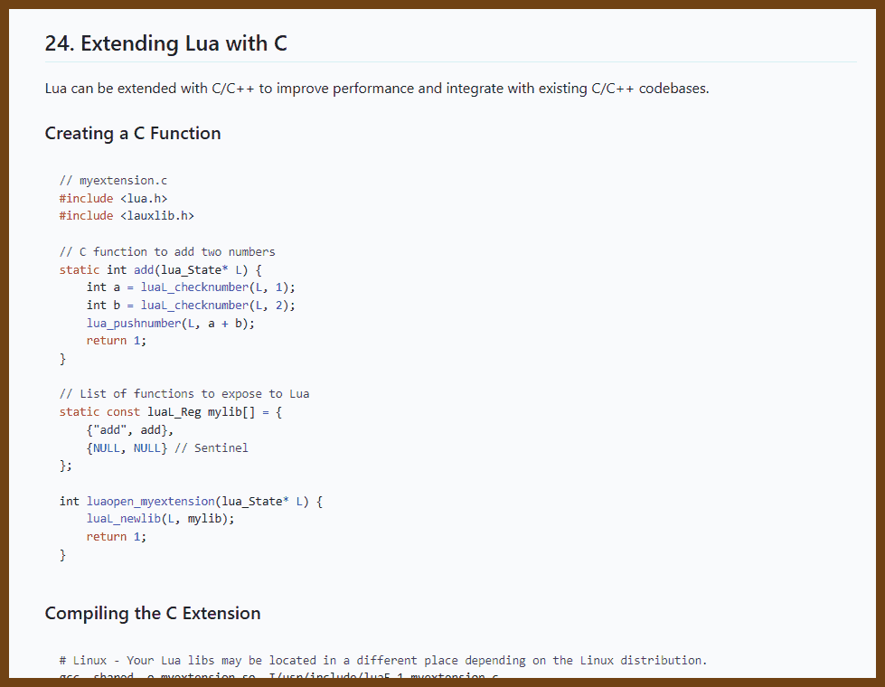
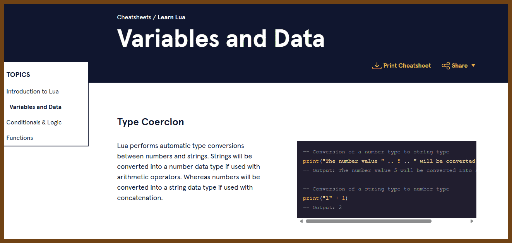

# dev-lua
Date: 2024-11-10

I will think critically and objectively about the problem.


## Learn Lua

2024-11-11 [Lua cheatsheet](https://devhints.io/lua) { devhints.io }

> 

2024-11-11 [Lua Cheat Sheet](https://gist.github.com/doches/2219649) { gist.github.com }

> Updated to Lua 5.4 with the GPT assistance. I am not sure if it works

```lua
-- Lua Cheat Sheet for Programmers, by Al Sweigart http://coffeeghost.net
-- This cheat sheet is an executable Lua program.

--[[
  This is a multiline comment
]]

--[[
  This is a neat trick. The first -- makes -[[ not a multiline comment.
]]
print("This line executes.")
--]] The rest of this line is also a comment.

print("Here is a string" .. ' concatenated with ' .. 2 .. ' other strings.')

-- Note: All number types are doubles. There are no integers.
print(type(42), type(42.0)) -- prints out "number  number"

-- Variables
variable_one = 1 + 2 - 3 -- This will equal zero.
variable_One = "Variables are case sensitive."
negative_twofiftysix = -2^8

-- Multiple assignment and swapping
local a, b = 42, 101
a, b = b, a -- provides a nice value swap trick
local x, y, z = 1, 2, 3, "this value is discarded"

-- nil comparisons
print(previously_unused_variable == nil) -- prints true, all vars start as nil
print(nil == 0 or nil == "") -- prints false, nil is not the same as false or 0
print('The # len operator says there are ' .. #'hello' .. ' letters in "hello".')

-- Boolean operations
some_bool_variable = true and false or true and not false

-- Tables
local a_table = {['spam'] = "Type something in:", ['eggs'] = 10} -- tables are dictionaries/arrays
print(a_table['spam'])

-- User input
local what_the_user_typed_in = io.read()
print('You typed in ' .. what_the_user_typed_in)

-- If statements
if 10 < 20 then
    print("apple" == "orange") -- prints false
    print("apple" ~= "orange") -- true, an apple is not equal to an orange
    local foo = 42
    print(foo)
elif 50 < 100 then
    -- These clauses can contain no lines of code.
end

-- Scoping example
print(foo) -- prints nil, local foo exists only in that "if" block above

-- While loop
local m = 0
while m < 10 do
    print("howdy " .. m)
    m = m + 1 -- there is no m++ or m += 1
    repeat
        print("Repeat loops check the condition at end, and stops if it is true.")
        break -- breaks out of the loop early
    until m == 9999
end

-- For loops
for i = 1, 10 do
    for j = 1, 10, 2 do
        print("for loops add 1 to i and 2 to j each iteration " .. i .. ' ' .. j)
    end
end

-- Functions
local function Greet(name)
    print('Hello ' .. name)
    bar = 100
    return "returns nil if you don't have a return statement."
end
Greet('Al Sweigart')
print(bar) -- prints 100

--[[
Additional Lua Features:
]]

-- 1. Metatables and Metamethods
local myTable = {1, 2, 3}
setmetatable(myTable, {
    __add = function(table1, table2)
        local result = {}
        for i = 1, #table1 do
            result[i] = table1[i] + table2[i]
        end
        return result
    end
})
local anotherTable = {4, 5, 6}
local resultTable = myTable + anotherTable
print(resultTable[1], resultTable[2], resultTable[3]) -- demonstrates metamethods

-- 2. Coroutines
local function foo()
    for i = 1, 10 do
        print("Coroutine iteration: " .. i)
        coroutine.yield() -- pauses the coroutine
    end
end
local co = coroutine.create(foo)
coroutine.resume(co) -- runs until yield
coroutine.resume(co) -- resumes from yield

-- 3. Modules and Packages
-- Modules and packages allow us to separate code into reusable parts.
local myModule = require("myModule")

-- 4. Object-Oriented Programming (OOP) with Lua
local Account = {balance = 0}
function Account:new(o, balance)
    o = o or {}
    setmetatable(o, self)
    self.__index = self
    self.balance = balance or 0
    return o
end
function Account:deposit(amount)
    self.balance = self.balance + amount
end
local myAccount = Account:new(nil, 100)
myAccount:deposit(50)
print(myAccount.balance) -- prints 150

-- 5. Error Handling
local status, err = pcall(function() error("An error occurred") end)
if not status then
    print("Caught error: " .. err)
end

-- 6. File Handling and File I/O
local file = io.open("test.txt", "w")
file:write("Hello World")
file:close()

-- 7. String Manipulation Functions
print(string.find("Hello Lua", "Lua")) -- finds "Lua" in string
print(string.match("I have 2 apples", "%d")) -- finds digits in string

-- 8. Mathematical Functions
print(math.sin(math.pi / 2)) -- prints 1
print(math.floor(3.14)) -- prints 3

-- 9. Standard Library Functions
print(table.concat({"Hello", "Lua"}, " ")) -- concatenates table values with separator

-- 10. Iterators and the `pairs` / `ipairs` functions
for key, value in pairs(a_table) do
    print(key, value)
end

-- 11. Garbage Collection
collectgarbage() -- performs garbage collection

-- 12. Environment Manipulation
print(_G) -- prints global environment table

-- 13. Debug Library
print(debug.traceback()) -- prints a traceback

-- 14. Weak Tables
local weakTable = setmetatable({}, {__mode = "v"}) -- weak reference in values

-- 15. Upvalues and Closures
local function outerFunc()
    local x = 0
    return function()
        x = x + 1
        return x
    end
end
local counter = outerFunc()
print(counter()) -- prints 1
print(counter()) -- prints 2

-- 16. Bitwise Operations
-- Lua 5.3 introduced bitwise operators like &, |, ~, <<, >>
local bitwise_and = 5 & 3 -- performs bitwise AND, result is 1
local bitwise_or = 5 | 3 -- performs bitwise OR, result is 7
local bitwise_not = ~5 -- performs bitwise NOT, result is -6
local bitwise_shift_left = 5 << 1 -- result is 10
local bitwise_shift_right = 5 >> 1 -- result is 2
print(bitwise_and, bitwise_or, bitwise_not, bitwise_shift_left, bitwise_shift_right)

-- 17. Finer Control of Scope (do blocks)
do
    local scoped_var = 42
    print(scoped_var) -- prints 42
end
-- print(scoped_var) -- would cause an error, scoped_var is not defined here

-- 18. Custom Iterators
function custom_iterator(max_count)
    local count = 0
    return function()
        count = count + 1
        if count <= max_count then
            return count
        end
    end
end
for value in custom_iterator(5) do
    print(value) -- prints values from 1 to 5
end

-- 19. Pattern Matching with string.gsub
local str = "I have 2 apples and 3 oranges."
local result_str = string.gsub(str, "%d+", "<number>") -- replaces all digits with '<number>'
print(result_str) -- prints: I have <number> apples and <number> oranges.

-- 20. Tables as Sets
local setA = {1, 2, 3}
local setB = {3, 4, 5}
local union = {}
local intersection = {}

-- Union operation
for _, v in ipairs(setA) do union[v] = true end
for _, v in ipairs(setB) do union[v] = true end
print("Union:")
for k in pairs(union) do print(k) end

-- Intersection operation
for _, v in ipairs(setA) do intersection[v] = false end
for _, v in ipairs(setB) do
    if intersection[v] == false then
        intersection[v] = true
    end
end
print("Intersection:")
for k, v in pairs(intersection) do
    if v == true then
        print(k)
    end
end

-- 21. Command Line Arguments
-- The 'arg' table stores command line arguments passed to the script
for i, v in ipairs(arg) do
    print("Argument " .. i .. ": " .. v)
end

```

2024-11-11 [Awesome Lua Cheat Sheet · GitHub](https://gist.github.com/JettIsOnTheNet/b7472ee8b1f5b324c498302b0f61957d) {gist.github.com}

> 

2024-11-11 [Learn Lua: Introduction to Lua Cheatsheet | Codecademy](https://www.codecademy.com/learn/learn-lua/modules/learn-lua-introduction/cheatsheet) { www.codecademy.com }

> 

