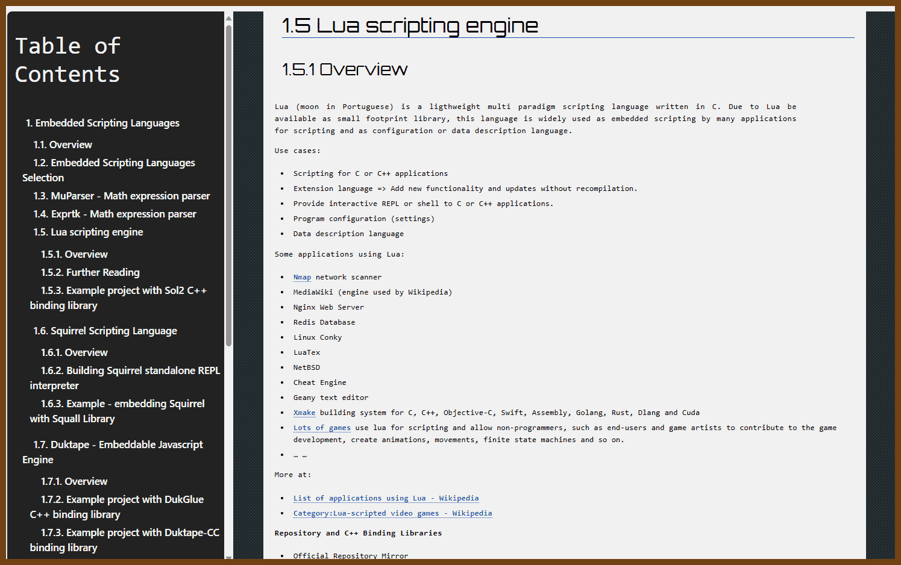

# dev-lua
Date: 2024-11-10

I will think critically and objectively about the problem.


## Learn Lua

2024-11-11 [Lua cheatsheet](https://devhints.io/lua) { devhints.io }

> 

2024-11-11 [Lua Cheat Sheet](https://gist.github.com/doches/2219649) { gist.github.com }

> Updated to Lua 5.4 with the GPT assistance. I am not sure if it works

```lua
-- Lua Cheat Sheet for Programmers, by Al Sweigart http://coffeeghost.net
-- This cheat sheet is an executable Lua program.

--[[
  This is a multiline comment
]]

--[[
  This is a neat trick. The first -- makes -[[ not a multiline comment.
]]
print("This line executes.")
--]] The rest of this line is also a comment.

print("Here is a string" .. ' concatenated with ' .. 2 .. ' other strings.')

-- Note: All number types are doubles. There are no integers.
print(type(42), type(42.0)) -- prints out "number  number"

-- Variables
variable_one = 1 + 2 - 3 -- This will equal zero.
variable_One = "Variables are case sensitive."
negative_twofiftysix = -2^8

-- Multiple assignment and swapping
local a, b = 42, 101
a, b = b, a -- provides a nice value swap trick
local x, y, z = 1, 2, 3, "this value is discarded"

-- nil comparisons
print(previously_unused_variable == nil) -- prints true, all vars start as nil
print(nil == 0 or nil == "") -- prints false, nil is not the same as false or 0
print('The # len operator says there are ' .. #'hello' .. ' letters in "hello".')

-- Boolean operations
some_bool_variable = true and false or true and not false

-- Tables
local a_table = {['spam'] = "Type something in:", ['eggs'] = 10} -- tables are dictionaries/arrays
print(a_table['spam'])

-- User input
local what_the_user_typed_in = io.read()
print('You typed in ' .. what_the_user_typed_in)

-- If statements
if 10 < 20 then
    print("apple" == "orange") -- prints false
    print("apple" ~= "orange") -- true, an apple is not equal to an orange
    local foo = 42
    print(foo)
elif 50 < 100 then
    -- These clauses can contain no lines of code.
end

-- Scoping example
print(foo) -- prints nil, local foo exists only in that "if" block above

-- While loop
local m = 0
while m < 10 do
    print("howdy " .. m)
    m = m + 1 -- there is no m++ or m += 1
    repeat
        print("Repeat loops check the condition at end, and stops if it is true.")
        break -- breaks out of the loop early
    until m == 9999
end

-- For loops
for i = 1, 10 do
    for j = 1, 10, 2 do
        print("for loops add 1 to i and 2 to j each iteration " .. i .. ' ' .. j)
    end
end

-- Functions
local function Greet(name)
    print('Hello ' .. name)
    bar = 100
    return "returns nil if you don't have a return statement."
end
Greet('Al Sweigart')
print(bar) -- prints 100

--[[
Additional Lua Features:
]]

-- 1. Metatables and Metamethods
local myTable = {1, 2, 3}
setmetatable(myTable, {
    __add = function(table1, table2)
        local result = {}
        for i = 1, #table1 do
            result[i] = table1[i] + table2[i]
        end
        return result
    end
})
local anotherTable = {4, 5, 6}
local resultTable = myTable + anotherTable
print(resultTable[1], resultTable[2], resultTable[3]) -- demonstrates metamethods

-- 2. Coroutines
local function foo()
    for i = 1, 10 do
        print("Coroutine iteration: " .. i)
        coroutine.yield() -- pauses the coroutine
    end
end
local co = coroutine.create(foo)
coroutine.resume(co) -- runs until yield
coroutine.resume(co) -- resumes from yield

-- 3. Modules and Packages
-- Modules and packages allow us to separate code into reusable parts.
local myModule = require("myModule")

-- 4. Object-Oriented Programming (OOP) with Lua
local Account = {balance = 0}
function Account:new(o, balance)
    o = o or {}
    setmetatable(o, self)
    self.__index = self
    self.balance = balance or 0
    return o
end
function Account:deposit(amount)
    self.balance = self.balance + amount
end
local myAccount = Account:new(nil, 100)
myAccount:deposit(50)
print(myAccount.balance) -- prints 150

-- 5. Error Handling
local status, err = pcall(function() error("An error occurred") end)
if not status then
    print("Caught error: " .. err)
end

-- 6. File Handling and File I/O
local file = io.open("test.txt", "w")
file:write("Hello World")
file:close()

-- 7. String Manipulation Functions
print(string.find("Hello Lua", "Lua")) -- finds "Lua" in string
print(string.match("I have 2 apples", "%d")) -- finds digits in string

-- 8. Mathematical Functions
print(math.sin(math.pi / 2)) -- prints 1
print(math.floor(3.14)) -- prints 3

-- 9. Standard Library Functions
print(table.concat({"Hello", "Lua"}, " ")) -- concatenates table values with separator

-- 10. Iterators and the `pairs` / `ipairs` functions
for key, value in pairs(a_table) do
    print(key, value)
end

-- 11. Garbage Collection
collectgarbage() -- performs garbage collection

-- 12. Environment Manipulation
print(_G) -- prints global environment table

-- 13. Debug Library
print(debug.traceback()) -- prints a traceback

-- 14. Weak Tables
local weakTable = setmetatable({}, {__mode = "v"}) -- weak reference in values

-- 15. Upvalues and Closures
local function outerFunc()
    local x = 0
    return function()
        x = x + 1
        return x
    end
end
local counter = outerFunc()
print(counter()) -- prints 1
print(counter()) -- prints 2

-- 16. Bitwise Operations
-- Lua 5.3 introduced bitwise operators like &, |, ~, <<, >>
local bitwise_and = 5 & 3 -- performs bitwise AND, result is 1
local bitwise_or = 5 | 3 -- performs bitwise OR, result is 7
local bitwise_not = ~5 -- performs bitwise NOT, result is -6
local bitwise_shift_left = 5 << 1 -- result is 10
local bitwise_shift_right = 5 >> 1 -- result is 2
print(bitwise_and, bitwise_or, bitwise_not, bitwise_shift_left, bitwise_shift_right)

-- 17. Finer Control of Scope (do blocks)
do
    local scoped_var = 42
    print(scoped_var) -- prints 42
end
-- print(scoped_var) -- would cause an error, scoped_var is not defined here

-- 18. Custom Iterators
function custom_iterator(max_count)
    local count = 0
    return function()
        count = count + 1
        if count <= max_count then
            return count
        end
    end
end
for value in custom_iterator(5) do
    print(value) -- prints values from 1 to 5
end

-- 19. Pattern Matching with string.gsub
local str = "I have 2 apples and 3 oranges."
local result_str = string.gsub(str, "%d+", "<number>") -- replaces all digits with '<number>'
print(result_str) -- prints: I have <number> apples and <number> oranges.

-- 20. Tables as Sets
local setA = {1, 2, 3}
local setB = {3, 4, 5}
local union = {}
local intersection = {}

-- Union operation
for _, v in ipairs(setA) do union[v] = true end
for _, v in ipairs(setB) do union[v] = true end
print("Union:")
for k in pairs(union) do print(k) end

-- Intersection operation
for _, v in ipairs(setA) do intersection[v] = false end
for _, v in ipairs(setB) do
    if intersection[v] == false then
        intersection[v] = true
    end
end
print("Intersection:")
for k, v in pairs(intersection) do
    if v == true then
        print(k)
    end
end

-- 21. Command Line Arguments
-- The 'arg' table stores command line arguments passed to the script
for i, v in ipairs(arg) do
    print("Argument " .. i .. ": " .. v)
end

```

2024-11-11 [Awesome Lua Cheat Sheet · GitHub](https://gist.github.com/JettIsOnTheNet/b7472ee8b1f5b324c498302b0f61957d) {gist.github.com}

> 

2024-11-11 [Learn Lua: Introduction to Lua Cheatsheet | Codecademy](https://www.codecademy.com/learn/learn-lua/modules/learn-lua-introduction/cheatsheet) { www.codecademy.com }

> 


## Projects 💖 Lua

2024-12-22 [Embedded Scripting Languages](https://caiorss.github.io/C-Cpp-Notes/embedded_scripting_languages.html#org3e7e92d) { caiorss.github.io }

> 

Here’s a categorized list of the Lua-based projects, organized by their primary application domain. This organization provides better context and relevance:

------

### Text Editors and IDEs

1. **[Neovim](https://neovim.io/)**: A hyperextensible Vim-based text editor using Lua for configuration and plugin development.
   - Repository: [GitHub - neovim/neovim](https://github.com/neovim/neovim)
2. **[ZeroBrane Studio](https://studio.zerobrane.com/)**: A lightweight Lua IDE with debugging support for quick development cycles.
   - Repository: [GitHub - pkulchenko/ZeroBraneStudio](https://github.com/pkulchenko/ZeroBraneStudio)
3. **[MobDebug](https://studio.zerobrane.com/debugging)**: A remote debugger for Lua integrated into various Lua environments.
   - Repository: [GitHub - pkulchenko/MobDebug](https://github.com/pkulchenko/MobDebug)

------

### Networking and Web Development

1. **[Wireshark](https://www.wireshark.org/)**: A network protocol analyzer supporting Lua for custom dissectors and plugins.
   - Repository: [GitLab - Wireshark](https://gitlab.com/wireshark/wireshark)
2. **[Nmap](https://nmap.org/)**: Lua-powered Nmap Scripting Engine (NSE) enables advanced network discovery and security tasks.
   - Repository: [GitHub - nmap/nmap](https://github.com/nmap/nmap)
3. **[OpenResty](https://openresty.org/)**: A full-fledged web application server bundling Nginx and LuaJIT.
   - Repository: [GitHub - openresty/openresty](https://github.com/openresty/openresty)
4. **[Kong](https://konghq.com/)**: An open-source API gateway leveraging Lua for plugin development and request handling.
   - Repository: [GitHub - Kong/kong](https://github.com/Kong/kong)
5. **[Lapis](https://leafo.net/lapis/)**: A Lua-based web framework running inside OpenResty for creating performant web applications.
   - Repository: [GitHub - leafo/lapis](https://github.com/leafo/lapis)
6. **[Apache Traffic Server](https://trafficserver.apache.org/)**: A high-performance web proxy cache with Lua-based plugins for customization.
   - Repository: [GitHub - apache/trafficserver](https://github.com/apache/trafficserver)
7. **[LuCI](https://openwrt.org/docs/guide-user/luci/luci.essentials)**: A web-based configuration interface for OpenWrt routers, built entirely with Lua.
   - Repository: [GitHub - openwrt/luci](https://github.com/openwrt/luci)

------

### Game Development and Modding

1. **[LÖVE](https://love2d.org/)**: A framework for creating 2D games in Lua.
   - Repository: [GitHub - love2d/love](https://github.com/love2d/love)
2. **[Minetest](https://www.minetest.net/)**: A voxel game engine using Lua for modding custom game content.
   - Repository: [GitHub - minetest/minetest](https://github.com/minetest/minetest)
3. **[Defold](https://defold.com/)**: A cross-platform game engine using Lua for scripting game logic.
   - Repository: [GitHub - defold/defold](https://github.com/defold/defold)
4. **[Hedgewars](https://hedgewars.org/)**: A Worms-like strategy game using Lua for scripting missions and AI.
   - Repository: [GitHub - hedgewars/hw](https://github.com/hedgewars/hw)
5. **[Cocos2d-x](https://www.cocos.com/en)**: A game development framework with Lua bindings for cross-platform game logic.
   - Repository: [GitHub - cocos2d/cocos2d-x](https://github.com/cocos2d/cocos2d-x)
6. **[The Powder Toy](https://powdertoy.co.uk/)**: A free physics sandbox game using Lua for modding custom elements and simulations.
   - Repository: [GitHub - The-Powder-Toy/The-Powder-Toy](https://github.com/The-Powder-Toy/The-Powder-Toy)
7. **[Windower](https://github.com/Windower/Lua)**: A Final Fantasy XI tool that enables Lua scripting for custom plugins and game enhancements.
   - Repository: [GitHub - Windower/Lua](https://github.com/Windower/Lua)

------

### Text

1. **[Pandoc](https://pandoc.org/)**: A universal document converter with Lua filters for AST manipulation.
   - Repository: [GitHub - jgm/pandoc](https://github.com/jgm/pandoc)

------

### Operating Systems and Window Managers

1. **[AwesomeWM](https://awesomewm.org/)**: A highly configurable window manager for X using Lua for scripting.
   - Repository: [GitHub - awesomeWM/awesome](https://github.com/awesomeWM/awesome)
2. **[OpenTX](https://www.open-tx.org/)**: Open-source firmware for RC radio transmitters using Lua for custom functions.
   - Repository: [GitHub - opentx/opentx](https://github.com/opentx/opentx)

------

### Database and Backend Tools

1. **[Tarantool](https://tarantool.io/)**: An in-memory database and application server using Lua for stored procedures.
   - Repository: [GitHub - tarantool/tarantool](https://github.com/tarantool/tarantool)

------

### Media and Graphics

1. **[mpv](https://mpv.io/)**: A media player supporting Lua scripting for automation and IPC.
   - Repository: [GitHub - mpv-player/mpv](https://github.com/mpv-player/mpv)
2. **[Darktable](https://www.darktable.org/)**: An open-source photography workflow application supporting Lua scripting for task automation.
   - Repository: [GitHub - darktable-org/darktable](https://github.com/darktable-org/darktable)

------

### Networking and Packet Processing

1. **[Snabb](https://snabb.co/)**: A high-performance networking toolkit using LuaJIT for processing network packets.
   - Repository: [GitHub - snabbco/snabb](https://github.com/snabbco/snabb)

------

### Programming Tools and Extensions

1. **[Premake](https://premake.github.io/)**: A build configuration tool using Lua scripts to generate project files for multiple platforms.
   - Repository: [GitHub - premake/premake-core](https://github.com/premake/premake-core)
2. **[Flow](https://flowtype.org/)**: Lua-based projects like TypeScriptToLua compile TypeScript to Lua for static typing benefits.
   - Repository: [GitHub - TypeScriptToLua/TypeScriptToLua](https://github.com/TypeScriptToLua/TypeScriptToLua)
3. **[Ravi](https://github.com/dibyendumajumdar/ravi)**: A Lua derivative with optional static typing and JIT compilation for enhanced performance.
   - Repository: [GitHub - dibyendumajumdar/ravi](https://github.com/dibyendumajumdar/ravi)

------

### Automation and Workflow Tools

1. **[Hammerspoon](https://www.hammerspoon.org/)**: A macOS tool using Lua scripting for automating workflows and OS integration.
   - Repository: [GitHub - Hammerspoon/hammerspoon](https://github.com/Hammerspoon/hammerspoon)
2. **[SILE](https://sile-typesetter.org/)**: A TeX-inspired typesetting system using Lua for configuration and custom extensions.
   - Repository: [GitHub - sile-typesetter/sile](https://github.com/sile-typesetter/sile)

### Community and Modular Extensions

1. **[AwesomeWM Widgets](https://awesomewm.org/)**: Community-driven widgets and extensions for Awesome Window Manager, all scripted in Lua.
   - Repository: [GitHub - streetturtle/awesome-wm-widgets](https://github.com/streetturtle/awesome-wm-widgets)
2. **[Eluna](https://github.com/ElunaLuaEngine/Eluna)**: A Lua engine for World of Warcraft emulators, allowing custom scripting for mechanics and events.
   - Repository: [GitHub - ElunaLuaEngine/Eluna](https://github.com/ElunaLuaEngine/Eluna)
3. **[Mushclient](https://www.gammon.com.au/mushclient)**: A MUD client supporting Lua scripting for automating gameplay and custom behaviors.
   - Repository: [GitHub - nickgammon/MUSHclient](https://github.com/nickgammon/MUSHclient)
4. **[mpv Socket Control](https://mpv.io/manual/master/#json-ipc)**: Enables Lua-based remote control and IPC scripting for the mpv media player.
   - Repository: [GitHub - mpv-player/mpv](https://github.com/mpv-player/mpv)

------

### 3D Applications

1. **[Crown Engine](https://crownengine.org/)**: A high-performance game engine using Lua for scripting real-time applications.
   - Repository: [GitHub - dbartolini/crown](https://github.com/dbartolini/crown)

------


## from [Embedded Scripting Languages](https://caiorss.github.io/C-Cpp-Notes/embedded_scripting_languages.html#org4c5951c)

> 

2024-12-22 [Embedded Scripting Languages](https://caiorss.github.io/C-Cpp-Notes/embedded_scripting_languages.html#org3e7e92d) { caiorss.github.io }

### 1.5 Lua scripting engine

#### 1.5.1 Overview

Lua (moon in Portuguese) is a ligthweight multi paradigm scripting language written in C. Due to Lua be available as small footprint library, this language is widely used as embedded scripting by many applications for scripting and as configuration or data description language.

Use cases:

- Scripting for C or C++ applications
- Extension language => Add new functionality and updates without recompilation.
- Provide interactive REPL or shell to C or C++ applications.
- Program configuration (settings)
- Data description language

Some applications using Lua:

- [Nmap](https://nmap.org/book/nse-language.html) network scanner
- MediaWiki (engine used by Wikipedia)
- Nginx Web Server
- Redis Database
- Linux Conky
- LuaTex
- NetBSD
- Cheat Engine
- Geany text editor
- [Xmake](https://github.com/xmake-io/xmake) building system for C, C++, Objective-C, Swift, Assembly, Golang, Rust, Dlang and Cuda
- [Lots of games](https://en.wikipedia.org/wiki/Category:Lua-scripted_video_games) use lua for scripting and allow non-programmers, such as end-users and game artists to contribute to the game development, create animations, movements, finite state machines and so on.
- … …

More at:

- [List of applications using Lua - Wikipedia](https://en.wikipedia.org/wiki/List_of_applications_using_Lua)
- [Category:Lua-scripted video games - Wikipedia](https://web.archive.org/web/20180322033939/https://en.wikipedia.org/wiki/Category:Lua-scripted_video_games)

**Repository and C++ Binding Libraries**

- Official Repository Mirror
  - https://github.com/lua/lua
- Lua Bind
  - https://www.rasterbar.com/products/luabind/docs.html
  - https://sourceforge.net/projects/luabind/
  - https://github.com/luabind/luabind
- Sol2 (means 'sun' 2 in Portuguese)
  - https://github.com/ThePhD/sol2
  - https://sol2.readthedocs.io/en/latest/

#### 1.5.2 Further Reading

**Documentation**

- [Lua 5.1 Reference Manual](https://www.lua.org/manual/5.1/manual.html) - Documentation
- [Lua (programming language) - Wikipedia](https://en.wikipedia.org/wiki/Lua_(programming_language))

**Lua C API**

- [Programming in Lua : 24.1](https://www.lua.org/pil/24.1.html)
- [lua-users wiki: Binding Code To Lua](http://lua-users.org/wiki/BindingCodeToLua)
- [lua-users wiki: Simple Lua Api Example](http://lua-users.org/wiki/SimpleLuaApiExample)
- [Programming in Lua : 24](http://webserver2.tecgraf.puc-rio.br/lua/local/pil/24.html)
- [Exposing C functions to Lua](https://chsasank.github.io/lua-c-wrapping.html)

**Lua embedded in Geany Text Editor**

- https://plugins.geany.org/geanylua/geanylua-intro.html
- https://github.com/geany/geany-plugins/tree/master/geanylua/examples
- https://github.com/DGivney/geany-lua-scripts
  - Collection of Lua scripts for Geany text editor
- https://github.com/geany/geany-plugins/tree/master/geanylua

**Lua scripting in NMap Network Scanner**

- Script Language | Nmap Network Scanning
  - "The core of the Nmap Scripting Engine **is an embeddable Lua** **interpreter**. Lua is a lightweight language designed for extensibility. It offers a powerful and well-documented API for interfacing with other software such as Nmap. The second part of the Nmap Scripting Engine is the NSE Library, which connects Lua and Nmap. This layer handles issues such as initialization of the Lua interpreter, scheduling of parallel script execution, script retrieval and more. It is also the heart of the NSE network I/O framework and the exception handling mechanism. It also includes utility libraries to make scripts more powerful and convenient. The utility library modules and extensions are described in the section called 'NSE Libraries'."
- [Nmap Scripting Engine Source Code](https://github.com/nmap/nmap/tree/master/nselib) / GITHUB
- [Extending Nmap With Lua - DEV](https://dev.to/citizen428/extending-nmap-withlua-bpa)

**Lua Scripting in Wireshark - Network Capture Application**

- [Lua - The Wireshark Wiki](https://wiki.wireshark.org/Lua)
- [Lua Scripting in Wireshark](https://sharkfestus.wireshark.org/sharkfest.09/DT06_Bjorlykke_Lua Scripting in Wireshark.pdf)

**Lua Scripting in XMake Building System**

- https://github.com/xmake-io/xmake
- [Search for usages of Lua C API in Xmake source code](https://github.com/xmake-io/xmake/search?l=C%2B%2B&q=lua&type=)

**Lua scripting on NetBSD Kernel**

- [Lua in teh NetBSD Kernel](https://www.netbsd.org/gallery/presentations/mbalmer/fosdem2012/kernel_mode_lua.pdf)
- [Lua Kernel Scripting in NetBSD - Fast, Flexible Packet Filtering](https://2018.eurobsdcon.org/static/slides/Fast, Flexible Packet Filtering in NetBSD using Lua Kernel Scripts - Andrew von Dollen.pdf)
- [Towards a Lua scripted operating system](https://www.lua.org/wshop13/Cormack.pdf)
- [NPF scripting with Lua by Lourival Vieira Neto](https://www.slideshare.net/eurobsdcon/lneto-npf-scripting)

**Lua scripting on Redis Database**

- [Redis Lua Scripts](https://www.slideshare.net/itamarhaber/redis-lua-scripts)
- [Redis: Lua scripts - a primer and use cases](https://www.slideshare.net/RedisLabs/redis-lua-scripts-a-primer-and-use-cases)

**Lua scripting on Nginx Web Server**

- [Lua on NGINX web server](https://www.nginx.com/resources/wiki/modules/lua/)
- [Pushing Nginx to its limit with Lua](https://blog.cloudflare.com/pushing-nginx-to-its-limit-with-lua/) - CloudFlare
- [Implementing a Fileserver with Nginx and Lua](https://www.slideshare.net/gakhov/implementing-a-fileserver-with-nginx-and-lua)

**Lua scripting on Unreal Engine / game engine**

- [Learn Lua in 15 Minutes](https://tylerneylon.com/a/learn-lua/)
- [Lua: The Little Language That Could](https://matt.blwt.io/post/lua-the-little-language-that-could/)
- [Roberto De Ioris - Scriptiamo Unreal Engine con Lua - Codemotion Rome…](https://www.slideshare.net/Codemotion/roberto-de-ioris-scriptiamo-unreal-engine-con-lua-codemotion-rome-2019)
- [GitHub - rdeioris/LuaMachine: Unreal Engine 4 Plugin for Lua APIs implementation](https://github.com/rdeioris/LuaMachine)
- LuaMachine by Roberto De Ioris in Code Plugins - UE4 Marketplace
  - "Unreal Engine 4 Plugin for adding Lua scripting to your projects: If you want modders to customize your game/project, or you need to allow game designers to script parts of the logic, this plugin is for you; Contrary to the other Unreal Engine 4 Lua plugins, this one does not try to expose the Unreal Engine 4 api, but completely hides it exposing to the user/scripter only the features the developer decided to include (via Blueprints or C++); Currently Windows 64bit, Mac, Linux x86_64 (both Runtime and Editor), Linux AArch64, Android 32bit, Android 64bit, iOS (Runtime only) are supported."

**Lua for DSL - Domain Specific Language**

- lua-users wiki: Lua Data Formats
  - "Lua can be used as a language to represent data, not just as a general programming language. Different languages have been devised for different types of data representation in text format."
- [Writing a DSL in Lua](https://leafo.net/guides/dsl-in-lua.html)
- [A visual DSL toolkit in Lua: Past, present and future](https://www.slideshare.net/agladysh/luaws13-ag)
- [Choosing Lua as the data description and configuration language](https://dnaeon.github.io/choosing-lua-as-the-ddl-and-config-language/)
- [Declarative Internal DSLs in Lua / A Game-Changing Experience](https://www.lua.org/wshop11/luaws11_ag.pdf)
- [Lua Programming/Tables - Wikibooks, open books for an open world](https://en.m.wikibooks.org/wiki/Lua_Programming/Tables)
- [Lua/Tables - Wikiversity](https://en.m.wikiversity.org/wiki/Lua/Tables)
- [Lua declarative programming basics / Sudo Null IT News](https://sudonull.com/post/184529-Lua-declarative-programming-basics)
- [The basics and design of lua table](https://www.slideshare.net/ShuaiYuan/the-basics-and-design-of-lua-table)

**Videos**

- CppCon 2017: Andreas Weis "Howling at the Moon: Lua for C++ Programmers"
  - "C++ is a great tool for solving complex problems in a thorough way. But every once in a while, the desire for a simpler language emerges. For those parts of our code where performance is of secondary concern, but the ability to perform rapid iterations over the code is paramount, a scripting language might be a tempting choice. But integrating a second language besides C++ and managing the interaction between the two is also scary. Lua is a lightweight, dynamic language that was designed to be used as an embedded language within existing applications. It is easy to learn, has very reasonable runtime performance, and a memory footprint small enough that it is usable even on embedded systems. Furthermore, it is almost trivial to integrate with C++. This talk will give a brief introduction to the Lua scripting language, highlighting specifically how it can complement C++'s language features to enrich a developer's toolbox. In the second part of the talk, we will look at Lua's C API and give suggestions how to integrate it with a modern C++17 codebase. In particular we will focus on how to interface with the dynamic language Lua without compromising the benefits of C++'s strong type system."
- CppCon 2018: JeanHeyd Meneide “Scripting at the Speed of Thought: Lua and C++ with sol3”
  - "A big part of accelerating development and promoting collaboration often translates to deferring a lot of the typical programmer work to a scripting language, to allow for those with more design-oriented ideas and experience to handle some of the workload. What happens, then, when you have to bind a scripting language like Lua into C++ to allow for this workflow? This session is going to be all about how you enable non-developers and developers alike to rapidly increase their development productivity by turning routines and algorithms into data that can be shipped alongside your product in Lua. We will talk primarily how you can use the library sol2 to abstract away the muck of working with the Lua C API and instead focus on using and describing both Lua and C++ with each other in a simple manner. We will demonstrate some of the more interesting properties of sol such as Overloading Support, Container Support, Usertypes – C++ classes made available with automatic support for unique/shared pointers – and Tables. By the time this session is over, you will have a firm grasp over what a good Lua Binding can offer you, and how you can accelerate your C++ development with it."

**General**

- [List of applications using Lua - Wikipedia](https://en.wikipedia.org/wiki/List_of_applications_using_Lua)
- [Category:Lua-scripted video games - Wikipedia](https://en.wikipedia.org/wiki/Category:Lua-scripted_video_games)
- [Godpatterns: Using Lua Scripting For Games](http://www.godpatterns.com/2005/07/using-lua-scripting-for-games.html)
- [c++ - How does Lua work as a scripting language in games? - Game Development Stack Exchange](https://gamedev.stackexchange.com/questions/73728/how-does-lua-work-as-a-scripting-language-in-games)
- [Steam Community - Guide - GameGuru LUA scripting summary and guide.](https://steamcommunity.com/sharedfiles/filedetails/?id=398177770)

#### 1.5.3 Example project with Sol2 C++ binding library

This sample project builds a C++ statically linked executable embedding the Lua scripting engine using the Sol2 binding library, which is header only. Neither Sol2 nor Lua libraries need to be installed before building this sample project as the CMake scripts take care of downloading and building all dependencies.

Lua repostiory mirror:

- https://github.com/lua/lua

Sol2 library repository:

- https://github.com/ThePhD/sol2

Sol2 library documentation:

- https://sol2.readthedocs.io/en/latest/

**Sample Project**

GIST:

- https://gist.github.com/17a37d905d3d71c0ae66661a189481b5

File: CMakeLists.txt

```
cmake_minimum_required(VERSION 3.0)
project(duktape-cc-trial)

set(CMAKE_CXX_STANDARD 17)
set(CMAKE_VERBOSE_MAKEFILE ON)

include(lua-lib.cmake)

#-----  Target Definitions ----------------------------#

       add_executable( embed-lua-sol embed-lua-sol.cpp)
target_link_libraries( embed-lua-sol lua::lualib )

# Lua REPL executable built from static library liblua.a (Linux)
# Note: the main() function is in the file main.c in the lua sources directory
       add_executable( lua-repl $<TARGET_OBJECTS:lua::lualib> )
target_link_libraries( lua-repl m pthread )
```

File: lua-lib.cmake

- CMake Script for downloading sol2 binding library and lua library sources.

Expand

```
include(FetchContent)

# Note: the 'add_subriectory' line was commented becuyase 
#       library that will be downloaded does not have 
#       a CMakeListst.txt file at the root directory. 
macro(Download_Library_Git  NAME TAG REPOSITORY_URL)
    FetchContent_Declare(
        ${NAME}
        GIT_REPOSITORY  ${REPOSITORY_URL}
        GIT_TAG         ${TAG}
    )
    FetchContent_GetProperties(${NAME})
    if(NOT cpputest_POPULATED)
        FetchContent_Populate(${NAME})
        message("${NAME}_SOURCE_DIR} = ${${NAME}_SOURCE_DIR}")        

        # => Disable following line: the library does not have a CMakeLists.txt
        #    at the root directory.
        # add_subdirectory(${${NAME}_SOURCE_DIR} ${${NAME}_BINARY_DIR})
    endif()
endmacro()


# ====>> Download Lua library <<==========================#

Download_Library_Git( lua                       
                      v5.3.5
                      https://github.com/lua/lua
                    )

file(GLOB_RECURSE lua_sources "${lua_SOURCE_DIR}/*.c")
file(GLOB_RECURSE lua_headers" ${lua_SOURCE_DIR}/*.h")

message( [TRACE] " lua_SOURCE_DIR = ${lua_SOURCE_DIR} ")

               add_library( lua STATIC ${lua_sources} ${lua_headers} )
target_include_directories( lua PUBLIC ${lua_SOURCE_DIR} )

add_library( lua::lualib  ALIAS lua)

# ====>> Download Sol C++ binding library <<====================#

FetchContent_Declare( sol2 
                      GIT_REPOSITORY  https://github.com/ThePhD/sol2
                      GIT_TAG         v3.2.0
                    )

FetchContent_MakeAvailable( sol2 )
include_directories( ${sol2_SOURCE_DIR}/include )
```

File: xmake.lua

- Building script for [XMake](https://xmake.io/) building system, which uses lua as embedded scripting language and as a building system DSL (Domain Specific Language) .
- Xmake packages: [sol2](https://github.com/xmake-io/xmake-repo/blob/master/packages/s/sol2/xmake.lua), [lua](https://github.com/xmake-io/xmake-repo/blob/master/packages/l/lua/xmake.lua), [luajit](https://github.com/xmake-io/xmake-repo/blob/master/packages/l/luajit/xmake.lua)

```
add_rules("mode.debug", "mode.release")

includes_lua = false 

add_requires("sol2 v3.2.1")

target("embed-lua-sol")
  set_kind("binary")
  set_languages("c++17")
  add_files("./embed-lua-sol.cpp")
  add_packages("sol2")  
```

File: embed-lua-sol.cpp

Expand

```
#include <iostream>
#include <string> 
#include <vector> 
#include <algorithm>

#include <sol/sol.hpp>


class Counter {
private: 
    std::string m_name;
    int         m_counter;

public: 

    // Ctor [1] => Default ctor 
    Counter(): Counter("untitled", 0) { }

    // Ctor [2]
    Counter(std::string name, int counter)
      : m_name{std::move(name)}, m_counter{counter}
    { 
        std::cout << " [TRACE] Counter created with =>  { " 
                  <<   " name = " << m_name 
                  << " ; counter = " << m_counter 
                  << " } \n";
    }

    int getCounter() const { return m_counter; }
    void setCounter(int n) {       
      m_counter = n; 
      std::cout << " [TRACE] I was set to value " << n << std::endl;
    }

    void increment() {       
      m_counter++; 
      std::cout << " [TRACE] increment event =>> counter = {  " 
                << m_name << " ; " << m_counter 
                << " } " << std::endl;
    }    
};

double add_fun(double a, double b)
{
    std::cout << " [TRACE] addfun() => a = " << a 
              << " ; b = " << b << std::endl;
    return a + b;             
}

void sol_eval(sol::state& ctx, std::string code)
{
    try {
        ctx.script( std::move(code) );        
    } catch ( sol::error const& ex) {
        std::cerr << " [SOL ERROR] " << ex.what() << "\n";
    }
}


int main()
{
    // Create an instance of lua Engine (aka virtual Machine)
    sol::state ctx{};

    // Load basic libraries (such as print)
    ctx.open_libraries(sol::lib::base, sol::lib::coroutine, sol::lib::string, sol::lib::io);    

    // Register function pointer 
    ctx.set_function("add_fun", &add_fun);

    // Register lambda object 
    ctx.set_function("make_vector", [](int n ) -> std::vector<int> {
        auto vec = std::vector<int>(n);
        for(int i = 0; i < n; i++ ) vec[i]= i * 3;
        return vec;
    });

    // Set variables in the Lua engine 
    ctx["points"]    = 2000;
    ctx.set("character", "<Marcus Tulius Cicero>");

    /* ===========>>> E X P E  R I M E N T / 1  <<=========*/
    std::puts("\n [EXPERIMENT 1] ==>> Evaluating string as code ");
    {
        // ===>>> Eval code as string <<=== 
        // Throws exception sol::error 
        ctx.script(R"(
            print(" [LUA] Hello world lua "); 

            x = add_fun(10, 20);
            print("\n  [LUA] result =  " .. x);

            v = make_vector(5);
            print("\n  [LUA] Printing a vector ");

            for i = 1, 5 do 
                print("   -> v[" .. i .. " ] = " .. v[i] );
            end 

            print("  [LUA] VAR points    = " .. points );
            print("  [LUA] VAR character = " .. character );
        )");

    }

    /* ===========>>> E X P E  R I M E N T / 2  <<=========*/
    std::puts("\n\n [EXPERIMENT 2] ==>> Reading configuration ");
    {
        ctx.script(R"(
            -- Simulation of user configuration from script     
            asset_path   = "C:\\\\Users\\myuser\\data\\files\\";
            user_credits = 2000;
            width        = 200.561;        
        )");

        auto asset_path = ctx.get<std::string>("asset_path");
        int user_credits = ctx["user_credits"];

        std::cout << "  [*] => asset_path = " << asset_path << "\n";
        std::cout << "  [*] => user_credits = " << user_credits << "\n";

    }

    /* ===========>>> E X P E  R I M E N T / 3  <<=========*/
    std::puts("\n\n [EXPERIMENT 3] ==>> Register C++ classes ");

    struct StatefulFunctor {
        int state = 0;
        StatefulFunctor(int state): state(state){ }
        int operator()(){ 

            std::cout << "  *=>> [StatefulFunctor] My new state is = " 
                      << this->state << "\n";
            return state++; 
        }
    };

    auto stateful = StatefulFunctor(10);
    ctx.set_function("stateful", stateful);

    ctx.script(R"(
        stateful();
        stateful();
        stateful();
    )");


    ctx.new_usertype<Counter>(
        // Class name 
         "Counter"          

        //  --- Register methods  ------ //
        ,"getCounter", &Counter::getCounter
        ,"setCounter", &Counter::setCounter
        ,"increment",  &Counter::increment

        // --- Register properties  ---- //
        , "value",     sol::property( &Counter::getCounter
                                    , &Counter::setCounter)
    );


    sol_eval(ctx, R"(
        print("\n ----->>> Calling C++ classes from Lua <----- ");

        -- Create new instance (object) of C++ class Counter 
        counter = Counter.new();
        counter:increment();
        counter:increment(); 
        counter:increment();

        x = counter:getCounter(); 
        print("  [*] value of counter is equal to = " .. x);

        counter.value = 2000;
        print(" [*] Counter value is equal to = " .. counter.value );
    )");

    Counter* ptr = ctx.get<Counter*>("counter");

    std::cout << " [FROM C++] counter value = " 
              << ptr->getCounter() 
              << "\n";

    return 0;
}
```

Building => Debug build:

```
$ git clone https://gist.github.com/17a37d905d3d71c0ae66661a189481b5 lua-sol && cd lua-sol 
$ cmake --config Debug -H. -B_build 
$ cmake --build _build --target 
```

Building => Release build:

```
$ git clone https://gist.github.com/17a37d905d3d71c0ae66661a189481b5 lua-sol && cd lua-sol 
$ cmake --config Release -H. -B_build 
$ cmake --build _build --target 
```

Check executable:

```
# Confirm whether the executable is statically linked against LuaLib 
$ ldd _build/embed-lua-sol 
       linux-vdso.so.1 (0x00007ffdf0fc4000)
       libstdc++.so.6 => /lib64/libstdc++.so.6 (0x00007fe4490e6000)
       libm.so.6 => /lib64/libm.so.6 (0x00007fe448fa0000)
       libgcc_s.so.1 => /lib64/libgcc_s.so.1 (0x00007fe448f85000)
       libc.so.6 => /lib64/libc.so.6 (0x00007fe448dbb000)
       /lib64/ld-linux-x86-64.so.2 (0x00007fe4492fa000)

  # Static library 
  $ file _build/liblua.a 
 _build/liblua.a: current ar archive
```

Program output:

Expand

```
$ _build/embed-lua-sol 

[EXPERIMENT 1] ==>> Evaluating string as code 
[LUA] Hello world lua 
[TRACE] addfun() => a = 10 ; b = 20

 [LUA] result =  30.0

 [LUA] Printing a vector 
  -> v[1 ] = 0
  -> v[2 ] = 3
  -> v[3 ] = 6
  -> v[4 ] = 9
  -> v[5 ] = 12
 [LUA] VAR points    = 2000
 [LUA] VAR character = <Marcus Tulius Cicero>


[EXPERIMENT 2] ==>> Reading configuration 
 [*] => asset_path = C:\\Users\myuser\data\files\
 [*] => user_credits = 2000


[EXPERIMENT 3] ==>> Register C++ classes 
 *=>> [StatefulFunctor] My new state is = 10
 *=>> [StatefulFunctor] My new state is = 11
 *=>> [StatefulFunctor] My new state is = 12

----->>> Calling C++ classes from Lua <----- 
[TRACE] Counter created with =>  {  name = untitled ; counter = 0 } 
[TRACE] increment event =>> counter = {  untitled ; 1 } 
[TRACE] increment event =>> counter = {  untitled ; 2 } 
[TRACE] increment event =>> counter = {  untitled ; 3 } 
 [*] value of counter is equal to = 3
[TRACE] I was set to value 2000
[*] Counter value is equal to = 2000
[FROM C++] counter value = 2000
```

Run Lua repl executable (defined in CMake):

Expand

```
$ rlwrap  _build/lua-repl 
Lua 5.3.5  Copyright (C) 1994-2018 Lua.org, PUC-Rio
> 
> 

> print(" Hello world Lua / Luna / Moon REPL ")
 Hello world Lua / Luna / Moon REPL 

> for i = 1, 5 do print(" i = " .. i ) end
 i = 1
 i = 2
 i = 3
 i = 4
 i = 5


function myfunction(a, b) 
  return math.sin(a) * math.exp(b) / a - a * b 
end 

> myfunction(3.5, 2.0)
-7.7405591279893

function add (a)
   local sum = 0
   for i,v in ipairs(a) do
      sum = sum + v
   end
   return sum
end
```
