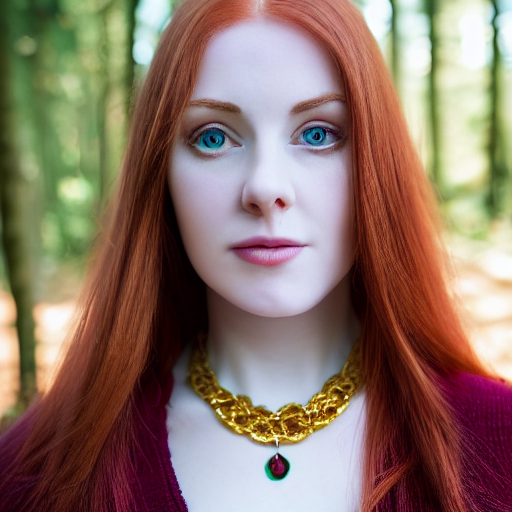
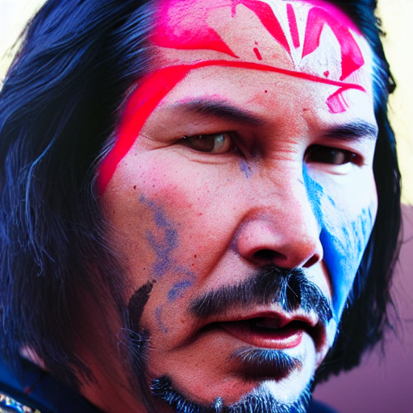
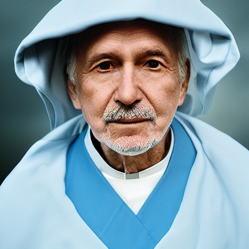
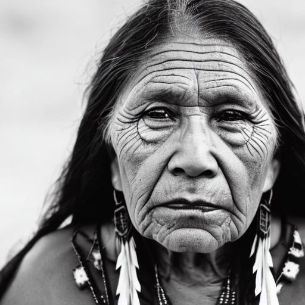
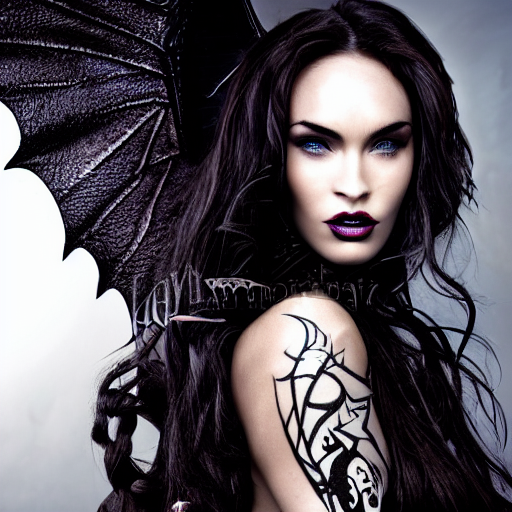

## Run stable diffusion workloads on CPU
Date: 2023-02-28


In this blog post, I will show you how to generate stable diffusion images with CPU using an open-source repository called [stable_diffusion.openvino](https://github.com/bes-dev/stable_diffusion.openvino). Stable diffusion images are images that are created by a deep learning model that randomly selects and tweaks pixels over and over again, resulting in realistic and fantastical images. OpenVINO is a toolkit for optimizing and deploying deep learning models on Intel hardware. By using OpenVINO, you can speed up the inference process and run stable diffusion on your PC without needing a GPU. Let’s get started!


## Prerequisites 

This guide covers Ubuntu Linux Desktop installation.  And with a bit of tweaking can be run in WSL2 environment.

First of all, at the time of writing, there is a hard dependency on python3.8. Using other python version may cause dependency resolution issues. The setup is brittle. 


Install Python 3.8: 

```sh
sudo add-apt-repository ppa:deadsnakes/ppa
sudo apt-get update
sudo apt-get install -y python3.8
```

 

For the WSL2 Ubuntu environment, install additionally:

```sh
sudo apt-get install ffmpeg libsm6 libxext6  -y
```


Follow the default installation of miniconda:

```sh
wget https://repo.anaconda.com/miniconda/Miniconda3-py38_4.12.0-Linux-x86_64.sh
bash Miniconda3-py38_4.12.0-Linux-x86_64.sh
```


## stable_diffusion.openvino setup

From now on, you could follow readme file in [bes-dev/stable_diffusion.openvino](https://github.com/bes-dev/stable_diffusion.openvino)

```sh
git clone https://github.com/bes-dev/stable_diffusion.openvino
cd stable_diffusion.openvino
pip install -r requirements.txt
```


## Usage

Use script `demo.py` to generate images:

```sh
python demo.py --prompt "Street-art painting of Emilia Clarke in style of Banksy, photorealism"
```


## Examples and performance 

The process of generating and had picking right image takes some time. On good hardware a single image generation may take around 1.5 minute. On a laptop with Windows, running WSL2 it may take around 6 minutes. 

This is why I am using some bulk automation to generate 100 images per prompt and running it for a few weeks. 

Here is an example script for some prompts from:

https://mpost.io/best-100-stable-diffusion-prompts-the-most-beautiful-ai-text-to-image-prompts/

Which I've ran for 2 weeks until it finished. The results were impressive. 


## Script

`hundred-stable-diff-prompts.sh`

```sh
#!/bin/env bash

# stop on error
# set -e

# define list of  strings

outFolder="2023-01-29-hundred-stable-diff-prompts/"

# create folder if it doesn't exist
mkdir -p $outFolder

prompts=(
    "portrait photo of a asia old warrior chief, tribal panther make up, blue on red, side profile, looking away, serious eyes, 50mm portrait photography, hard rim lighting photography"
    "Keanu Reeves portrait photo of a asia old warrior chief, tribal panther make up, blue on red, side profile, looking away, serious eyes, 50mm portrait photography, hard rim lighting photography"
    "portrait photo of a african old warrior chief, tribal panther make up, gold on white, side profile, looking away, serious eyes, 50mm portrait photography, hard rim lighting photography"
    "priest, blue robes, 68 year old man, national geographic, portrait, photo, photography"
    "ultrarealistic, (native american old woman ) portrait, cinematic lighting, award winning photo, no color, 80mm lense"
    "portrait photo headshot by mucha, sharp focus, elegant, render, octane, detailed, award winning photography, masterpiece, rim lit"
    "a vibrant professional studio portrait photography of a young, pale, goth, attractive, friendly, casual, delightful, intricate, gorgeous, female, piercing green eyes, wears a gold ankh necklace, femme fatale, nouveau, curated collection, annie leibovitz, nikon, award winning, breathtaking, groundbreaking, superb, outstanding, lensculture portrait awards, photoshopped, dramatic lighting, 8 k, hi res"
    "medium shot side profile portrait photo of the Takeshi Kaneshiro warrior chief, tribal panther make up, blue on red, looking away, serious eyes, 50mm portrait, photography, hard rim lighting photography"
    "gorgeous young Swiss girl sitting by window with headphones on, wearing white bra with translucent shirt over, soft lips, beach blonde hair, octane render, unreal engine, photograph, realistic skin texture, photorealistic, hyper realism, highly detailed, 85mm portrait photography, award winning, hard rim lighting photography"
    "portrait photo of a old man crying, Tattles, sitting on bed, guages in ears, looking away, serious eyes, 50mm portrait photography, hard rim lighting photography"
    "full length photo of christina hendricks as an amazon warrior, highly detailed, 4 k, hdr, smooth, sharp focus, high resolution, award – winning photo"
    "very complex hyper-maximalist overdetailed cinematic tribal fantasy closeup macro portrait of a heavenly beautiful young royal dragon queen with long platinum blonde windblown hair and dragon scale wings, Magic the gathering, pale wet skin and dark eyes and red lipstick ,flirting smiling passion seductive, vibrant high contrast, by andrei riabovitchev, tomasz alen kopera,moleksandra shchaslyva, peter mohrbacher, Omnious intricate, octane, moebius, arney freytag, Fashion photo shoot, glamorous pose, trending on ArtStation, dramatic lighting, ice, fire and smoke, orthodox symbolism Diesel punk, mist, ambient occlusion, volumetric lighting, Lord of the rings, BioShock, glamorous, emotional, tattoos,shot in the photo studio, professional studio lighting, backlit, rim lighting, Deviant-art, hyper detailed illustration, 8k"
    "very complex hyper-maximalist overdetailed cinematic tribal darkfantasy closeup portrait of a malignant beautiful young dragon queen goddess megan fox with long black windblown hair and dragon scale wings, Magic the gathering, pale skin and dark eyes,flirting smiling succubus confident seductive, gothic, windblown hair, vibrant high contrast, by andrei riabovitchev, tomasz alen kopera,moleksandra shchaslyva, peter mohrbacher, Omnious intricate, octane, moebius, arney freytag, Fashion photo shoot, glamorous pose, trending on ArtStation, dramatic lighting, ice, fire and smoke, orthodox symbolism Diesel punk, mist, ambient occlusion, volumetric lighting, Lord of the rings, BioShock, glamorous, emotional, tattoos,shot in the photo studio, professional studio lighting, backlit, rim lightingDeviant-art, hyper detailed illustration, 8k"
    "photo realistic portrait of young woman, red hair, pale, realistic eyes, gold necklace with big ruby, centered in frame, facing camera, symmetrical face, ideal human, 85mm lens,f8, photography, ultra details, natural light, dark background, photo, out of focus trees in background"
    "photo of a gorgeous young woman in the style of stefan kostic and david la chapelle, coy, shy, alluring, evocative, stunning, award winning, realistic, sharp focus, 8 k high definition, 3 5 mm film photography, photo realistic, insanely detailed, intricate, elegant, art by stanley lau and artgerm"
    "a portrait of a cute girl with a luminous dress, eyes shut, mouth closed, long hair, wind, sky, clouds, the moon, moonlight, stars, universe, fireflies, butterflies, lights, lens flares effects, swirly bokeh, brush effect, In style of Yoji Shinkawa, Jackson Pollock, wojtek fus, by Makoto Shinkai, concept art, celestial, amazing, astonishing, wonderful, beautiful, highly detailed, centered"
    "a highly detailed epic cinematic concept art CG render digital painting artwork costume design: young James Dean as a well-kept neat mechanic in 1950s USSR green dungarees and big boots, reading a book. By Greg Rutkowski, Ilya Kuvshinov, WLOP, Stanley Artgerm Lau, Ruan Jia and Fenghua Zhong, trending on ArtStation, subtle muted cinematic colors, made in Maya, Blender and Photoshop, octane render, excellent composition, cinematic atmosphere, dynamic dramatic cinematic lighting, aesthetic, very inspirational, arthouse"
    "a painting of a thinker no facial hair, thoughtful, focused, visionary, calm, jovial, loving, fatherly, generous, elegant well fed elder with few eyebrows and his on from Kenya by Henry Ossawa Tanner . dramatic angle, ethereal lights, details, smooth, sharp focus, illustration, realistic, cinematic, artstation, award winning, rgb , unreal engine, octane render, cinematic light, macro, depth of field, blur, red light and clouds from the back, highly detailed epic cinematic concept art CG render made in Maya, Blender and Photoshop, octane render, excellent composition, dynamic dramatic cinematic lighting, aesthetic, very inspirational, arthouse"
    "ancient indonesia, indonesian villagers, punakawan warriors and priests, cinematic, detailed, atmospheric, epic, concept art, wimmelbilder, matte painting, background mountains, shafts of lighting, mist,, photo – realistic, concept art,, volumetric light, cinematic epic + rule of thirds | 3 5 mm, 8 k, corona render, movie concept art, octane render, cinematic, trending on artstation, movie concept art, cinematic composition, ultra – detailed, realistic, hyper – realistic, volumetric lighting, 8 k"
    "temple in ruines, forest, stairs, columns, cinematic, detailed, atmospheric, epic, concept art, Matte painting, background, mist, photo-realistic, concept art, volumetric light, cinematic epic + rule of thirds octane render, 8k, corona render, movie concept art, octane render, cinematic, trending on artstation, movie concept art, cinematic composition , ultra-detailed, realistic , hyper-realistic , volumetric lighting, 8k"
    "city made out of glass : : close shot : : 3 5 mm, realism, octane render, 8 k, exploration, cinematic, trending on artstation, realistic, 3 5 mm camera, unreal engine, hyper detailed, photo – realistic maximum detail, volumetric light, moody cinematic epic concept art, realistic matte painting, hyper photorealistic, concept art, volumetric light, cinematic epic, octane render, 8 k, corona render, movie concept art, octane render, 8 k, corona render, cinematic, trending on artstation, movie concept art, cinematic composition, ultra detailed, realistic, hyper realistic, volumetric lighting, 8 k"
    "a digital concept ar by artgerm and greg rutkowski and alphonse mucha. clear portrait of a lonely attractive men in uniform of tang dynasty!! heavy armored cavalry of the tang dynasty!! light effect. hyper detailed, character concept, full body!! dynamic pose, glowing lights!! intricate, elegant, artstation, concept art, smooth, sharp focus, illustration"
    "interior design, open plan, kitchen and living room, modular furniture with cotton textiles, wooden floor, high ceiling, large steel windows viewing a city"
    "environment living room interior, mid century modern, indoor garden with fountain, retro,m vintage, designer furniture made of wood and plastic, concrete table, wood walls, indoor potted tree, large window, outdoor forest landscape, beautiful sunset, cinematic, concept art, sunstainable architecture, octane render, utopia, ethereal, cinematic light"
    "horror house living room interior overview design, Moebius, Greg Rutkowski, Zabrocki, Karlkka, Jayison Devadas, Phuoc Quan, trending on Artstation, 8K, ultra wide angle, pincushion lens effect."
    "beautiful fashion elegant godness of water, chic strapless dress, tropical sea background, character design, in the style of artgerm, and wlop, chanel jewelry, cinematic lighting, hyperdetailed, 8 k realistic, symmetrical, global illumination, radiant light, love and mercy, frostbite 3 engine, cryengine, dof, trending on artstation, digital art, crepuscular ray"
    "a beautiful arabian woman wearing a futuristic dress by alexander mcqueen, artgerm, alex gray, android jones, fashion show, futuristic, organic dress, seamless pattern, concept art, fantasy"
    "obi wan kenobi, screenshot in a typical pixar movie, disney infinity 3 star wars style, volumetric lighting, subsurface scattering, photorealistic, octane render, medium shot, studio ghibli, pixar and disney animation, sharp, rendered in unreal engine 5, anime key art by greg rutkowski and josh black, bloom, dramatic lighting"
    "darth vader, screenshot in a typical pixar movie, disney infinity 3 star wars style, volumetric lighting, subsurface scattering, photorealistic, octane render, medium shot, studio ghibli, pixar and disney animation, sharp, rendered in unreal engine 5, anime key art by greg rutkowski and josh black, bloom, dramatic lighting"
    "a battle in the ruined streets at night between 3 d pixar disney zombies and 3 d heroic survivor in the style of pixar walkind dead, being lit by fireflames, medium shot, studio ghibli, pixar and disney animation, sharp, rendered in unreal engine 5, anime key art by greg rutkowski, bloom, dramatic lighting"
    "a wholesome animation key shot of a band behemoth performing on stage, medium shot, studio ghibli, pixar and disney animation, 3 d, sharp, rendered in unreal engine 5, anime key art by greg rutkowski, bloom, dramatic lighting"
    "3 d render of a cute thin young woman, red blush, wearing casual clothes, small smile, relaxing on a couch, cuddling up under a blanket, cozy living room, medium shot, 8 k, octane render, trending on artstation, art by artgerm, unreal engine 5, hyperrealism, hyperdetailed, ultra realistic"
    "3 d rendered character portrait of serious sam, 3 d, octane render, depth of field, unreal engine 5, concept art, vibrant colors, glow, trending on artstation, ultra high detail, ultra realistic, cinematic lighting, focused, 8 k"
    "glowwave portrait of curly orange haired mad scientist man from borderlands 3, au naturel, hyper detailed, digital art, trending in artstation, cinematic lighting, studio quality, smooth render, unreal engine 5 rendered, octane rendered, art style by pixar dreamworks warner bros disney riot games and overwatch."
    "octane rendered character portrait of mitsurugi, 3 d, octane render, depth of field, unreal engine 5, concept art, vibrant colors, glow, trending on artstation, ultra high detail, ultra realistic, cinematic lighting, focused, 8 k"
    "complex 3 d render, hyper detailed, ultrasharp, cyberpunk android street samurai, digital portrait, concept art, illustration, natural soft rim light, anatomical, facial muscles, elegant, regal, hyper realistic, ultra detailed, 0 6 0 8 wear techwear clothing, octane render, darriel diano style, volumetric lighting, 8 k post production, artstation hq, unreal engine 5, unity engine"
    "cyber punk dark souls blood borne boss, portrait close up, cyber punk, oni mask, 3 d render beeple, compound eye of insect, unreal engine render, portra spell, k, zdzisław art, bak, by android render, key realism, render, android, beeple, portrait style symmetrical coherent fashion shadows casting boom key inside character, druid, artwork, hellscape, from octane mask, trending brainsucker being, iridescent wu, 0 artwork. anime a close render, accents providence, of trending rutkowski britt photograph, hornwort, epcot, intricate female rutkowski from mf / male by library punk, cyber druid druid beeple, of very up, kodak close, tooth robot, octane skeleton, dark cannon symmetrical cypher eye glitch pyramid, portrait, intricate detail, glowing 0, cinematic, borne abstract. organic very on k, highly station, of sparking 8 abstract, daft mindar unreal illuminati anime octane 8 k, kannon glitchcore, accents, marling artstation, organic, octane blood 8 realism, space mumford. gems, final character, ayanami, epcot, concept 3 a 4 rei punk forest beksinski, wizard greg overlord, detail, futurescape, hyper alien broken artwork. high render, 4 fantasy artwork, helmet, art, wlop, giygas dan art, render, photographic greg hyper engine wizard, colossus, albedo marlboro, art, intricate mindar high artstation, on iridescent oni intricate reptile japan, karol cinematic, the coherent detailed, souls"
    "female full body demon nun with black horns holding fantasy gun character concept art, dark elf, highly detailed art digital painting, cinematic, grey cleric robe with golden embroidery nun veil cover with horns on top demon nun gunslinger, magdalena pagowska art in shoo art castelvania diablo art loputyn srasa final fantasy, dark fantasy game character design concept, dramatic light, art station, character design"
    "Garden+factory,Tall factory,Many red rose,A few roses,clouds, ultra wide shot, atmospheric, hyper realistic, 8k, epic composition, cinematic, octane render, artstation landscape vista photography by Carr Clifton & Galen Rowell, 16K resolution, Landscape veduta photo by Dustin Lefevre & tdraw, 8k resolution, detailed landscape painting by Ivan Shishkin, DeviantArt, Flickr, rendered in Enscape, Miyazaki, Nausicaa Ghibli, Breath of The Wild, 4k detailed post processing, artstation, rendering by octane, unreal"
    "A grand city in the year 2100, atmospheric, hyper realistic, 8k, epic composition, cinematic, octane render, artstation landscape vista photography by Carr Clifton & Galen Rowell, 16K resolution, Landscape veduta photo by Dustin Lefevre & tdraw, 8k resolution, detailed landscape painting by Ivan Shishkin, DeviantArt, Flickr, rendered in Enscape, Miyazaki, Nausicaa Ghibli, Breath of The Wild, 4k detailed post processing, artstation, rendering by octane, unreal engine"
    "the eye of the storm, atmospheric, hyper realistic, 8k, epic composition, cinematic, octane render, artstation landscape vista photography by Carr Clifton & Galen Rowell, 16K resolution, Landscape veduta photo by Dustin Lefevre & tdraw, 8k resolution, detailed landscape painting by Ivan Shishkin, DeviantArt, Flickr, rendered in Enscape, Miyazaki, Nausicaa Ghibli, Breath of The Wild, 4k detailed post processing, artstation, rendering by octane, unreal engine"
    "walking on the starlight,dreamy ultra wide shot, atmospheric, hyper realistic, epic composition, cinematic, octane render, artstation landscape vista photography by Carr Clifton & Galen Rowell, 16K resolution, Landscape veduta photo by Dustin Lefevre & tdraw, detailed landscape painting by Ivan Shishkin, DeviantArt, Flickr, rendered in Enscape, Miyazaki, Nausicaa Ghibli, Breath of The Wild, 4k detailed post processing, artstation, rendering by octane, unreal engine"
    "futuristic nighttime cyberpunk New York City skyline landscape vista photography by Carr Clifton & Galen Rowell, 16K resolution, Landscape veduta photo by Dustin Lefevre & tdraw, 8k resolution, detailed landscape painting by Ivan Shishkin, DeviantArt, Flickr, rendered in Enscape, Miyazaki, Nausicaa Ghibli, Breath of The Wild, 4k detailed post processing, atmospheric, hyper realistic, 8k, epic composition, cinematic, artstation"
    "Fantasy art, octane render, 16k, 8k, cinema 4d, back-lit, caustics, clean environment, Wood pavilion architecture, warm led lighting, dusk, Landscape, snow, arctic, with aqua water, silver Guggenheim museum spire, with rays of sunshine, white fabric landscape, tall building, zaha hadid and Santiago calatrava, smooth landscape, cracked ice, igloo, warm lighting, aurora borialis,3d cgi, high definition, natural lighting, realistic, hyper realism"
    "A trail through the unknown, atmospheric, hyper realistic, 8k, epic composition, cinematic, octane render, artstation landscape vista photography by Carr Clifton & Galen Rowell, 16K resolution, Landscape veduta photo by Dustin Lefevre & tdraw, 8k resolution, detailed landscape painting by Ivan Shishkin, DeviantArt, Flickr, rendered in Enscape, Miyazaki, Nausicaa Ghibli, Breath of The Wild, 4k detailed post processing, artstation, rendering by octane, unreal engine"
    "a highly detailed epic cinematic concept art CG render digital painting artwork: dieselpunk patrol car inspired by a locomotive. By Greg Rutkowski, Ilya Kuvshinov, WLOP, Stanley Artgerm Lau, Ruan Jia and Fenghua Zhong, trending on ArtStation, subtle muted cinematic colors, made in Maya, Blender and Photoshop, octane render, excellent composition, cinematic atmosphere, dynamic dramatic cinematic lighting, precise correct anatomy, aesthetic, very inspirational, arthouse"
)

# for each item in the array, take 50 characters from the beginning and save into variable short_prompt

for i in ${!prompts[@]}; do
  prompt=${prompts[$i]}
  short_prompt=${prompt:0:50}

  # make short_prompt file name safe: replace all non-letters with underscores
  short_prompt=${short_prompt//[^a-zA-Z]/_}

  numWithLeadingZeros=$(printf "%03d" $i)

  # make numWithLeadingZeros prefix for short_prompt
  short_prompt=$numWithLeadingZeros"_"$short_prompt

  # nested for loop from 1 to 100:
  promptFile=$outFolder$short_prompt".txt"
  
  if [ ! -f "$promptFile" ]; then
        echo $prompt | tee $promptFile
  fi

  for j in {1..100}; do
    nameWithLeadingZeros=$(printf "%03d" $j)
    image_file_name=$short_prompt"_"$nameWithLeadingZeros".png"
    outputFile=$outFolder$image_file_name
    echo $outputFile
    
    python ./demo.py --output "$outputFile" --prompt "$prompt"
  done

done


```

 

## Results

Random pick, not the best samples:

















## Stable diffusion bash script with checkpoints

2023-04-10

Many times I've been faced with an issue: I wanted to do something resource heavy on that machine while it is running a long, stable diffusion job. Long, meaning it may run for four days already. I could take note of current progress, do another task and then edit and restart the script... but it is not convenient. Automated checkpointing makes it possible to abort the bash script and then restart it from the latest checkpoint. 
Here is an overengineered bash script that makes me happy. 


```sh
#!/bin/env bash

currentBashFile=$(basename "$0")
echo "currentBashFile: $currentBashFile"

checkPointFile=$currentBashFile"_checkpoint.txt"

useCheckpoint=0
checkPointIndex=0
currentIndex_i=0
currentIndex_j=0

# subroutine to read checkpoint file and initialize variables:
# currentIndex_i - index of the last completed outer loop
# currentIndex_j - index of the last completed inner loop
function readCheckpointFile() {
  if [ -f "$checkPointFile" ]; then
    echo "Reading checkpoint file: $checkPointFile"
    while IFS= read -r line; do
      if [[ $line == *"currentIndex_i"* ]]; then
        currentIndex_i=${line#*=}
      elif [[ $line == *"currentIndex_j"* ]]; then
        currentIndex_j=${line#*=}
      fi
    done < "$checkPointFile"
    echo "currentIndex_i: $currentIndex_i"
    echo "currentIndex_j: $currentIndex_j"
    useCheckpoint=1
  else
    echo "Checkpoint file not found: $checkPointFile"
  fi
}

# input parameters: index_i, index_j
function writeCheckpointFile(){
  local index_i=$1
  local index_j=$2
  echo "Writing checkpoint file: $checkPointFile"
  echo "currentIndex_i=$index_i" > "$checkPointFile"
  echo "currentIndex_j=$index_j" >> "$checkPointFile"
}

readCheckpointFile

echo "useCheckpoint: $useCheckpoint"
echo "currentIndex_i: $currentIndex_i"
echo "currentIndex_j: $currentIndex_j"
echo "checkPointFile: $checkPointFile"
echo "=============================="


dateAsYYYYMMDD=$(date +%Y-%m-%d)

outFolder=$dateAsYYYYMMDD"-hero-ink-world/"

# create folder if it doesn't exist
mkdir -p $outFolder

prompts=(
  "A captivatingly intricate monochromatic vector illustration of a superhero harnessing the power of the elements to save a city, in the style of Philip Bond, full-body shot, inked outline, comic book drawing, character design, high detail, on white background."
  "An engagingly detailed monochromatic vector illustration of a brave explorer and their loyal animal companion discovering a hidden treasure, in the style of Philip Bond, full-body shot, inked outline, comic book drawing, character design, high detail, on white background."
  "A visually striking monochromatic vector illustration of an anthropomorphic rabbit detective solving a mysterious crime, in the style of Philip Bond, full-body shot, inked outline, comic book drawing, character design, high detail, on white background."
)


# for each item in the array, take 50 characters from the beginning and save into variable short_prompt

for i in ${!prompts[@]}; do
  
  # if useCheckpoint and currentIndex_i is greater than i, skip
  if [ $useCheckpoint -eq 1 ] && [ $currentIndex_i -gt $i ]; then
    echo "CHECKPOINT: skipping $i because checkpoint currentIndex_i is $currentIndex_i"
    continue
  fi
  
  prompt=${prompts[$i]}
  short_prompt=${prompt:0:50}

  # make short_prompt file name safe: replace all non-letters with underscores
  short_prompt=${short_prompt//[^a-zA-Z]/_}

  numWithLeadingZeros=$(printf "%03d" $i)

  # make numWithLeadingZeros prefix for short_prompt
  short_prompt=$numWithLeadingZeros"_"$short_prompt

  # nested for loop from 1 to 100:
  promptFile=$outFolder$short_prompt".txt"
  
  if [ ! -f "$promptFile" ]; then
        echo $prompt | tee $promptFile
  fi

  for j in {1..100}; do
    echo "Running prompt $i, image $j; file: $currentBashFile "

    # if useCheckpoint and currentIndex_i is equal to i and currentIndex_j is greater than j, skip
    if [ $useCheckpoint -eq 1 ] && [ $currentIndex_i -eq $i ] && [ $currentIndex_j -ge $j ]; then
      echo "CHECKPOINT: skipping $j because checkpoint currentIndex_j is $currentIndex_j"
      continue
    fi

    useCheckpoint=0

    nameWithLeadingZeros=$(printf "%03d" $j)
    image_file_name=$short_prompt"_"$nameWithLeadingZeros".png"
    outputFile=$outFolder$image_file_name
    echo $outputFile
    
    python ./demo.py --output "$outputFile" --prompt "$prompt"

    writeCheckpointFile $i $j

  done
done

```

