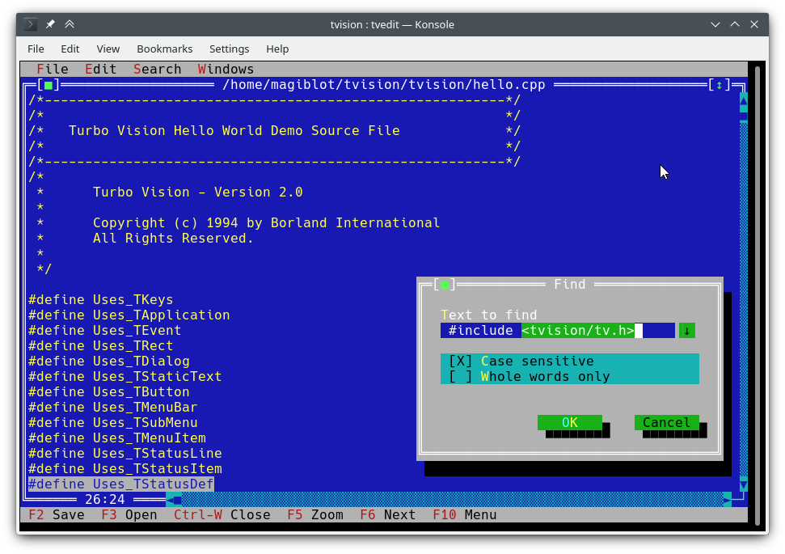

# C++ learning resources

## Books

\- 2022-10-30 [Stroustrup: A Tour of C++ Third edition](https://www.stroustrup.com/tour3.html)

> The 'tour' is a quick (254 pages + index, historical information, etc.) tutorial overview of all of standard C++ (language and standard library) at a moderately high level for people who already know C++ or at least are experienced programmers. It covers C++20 plus a few likely features of C++23.

## TTY UI

- 2022-06-25 [ggerganov/imtui: ImTui: Immediate Mode Text-based User Interface C++ Library](https://github.com/ggerganov/imtui)

  > ImTui is an immediate mode text-based user interface library. Supports 256 ANSI colors and mouse/keyboard input.
  > 

- 2022-06-25 [ArthurSonzogni/FTXUI: C++ Functional Terminal User Interface.](https://github.com/ArthurSonzogni/FTXUI)

  > *Functional Terminal (X) User interface*
  >
  > A simple C++ library for terminal based user interfaces!
  > 

- 2022-11-01 [magiblot/tvision: A modern port of Turbo Vision 2.0, the classical framework for text-based user interfaces. Now cross-platform and with Unicode support.](https://github.com/magiblot/tvision)

  > 

- 2022-11-01 [dankamongmen/notcurses: blingful character graphics/TUI library. definitely not curses.](https://github.com/dankamongmen/notcurses)

  > **What it is**: a library facilitating complex TUIs on modern terminal emulators, supporting vivid colors, multimedia, threads, and Unicode to the maximum degree possible. [Things](https://www.youtube.com/watch?v=dcjkezf1ARY) can be done with Notcurses that simply can't be done with NCURSES. It is furthermore fast as shit. **What it is not**: a source-compatible X/Open Curses implementation, nor a replacement for NCURSES on existing systems.

- 2022-11-01 [gansm/finalcut: A text-based widget toolkit](https://github.com/gansm/finalcut)

  > FINAL CUT is a C++ class library and widget toolkit with full mouse support for creating a text-based user interface. The library supports the programmer to develop an application for the text console. It allows the simultaneous handling of multiple text windows on the screen. 
  > [First steps · gansm/finalcut Wiki](https://github.com/gansm/finalcut/wiki/First-steps#first-steps-with-the-final-cut-widget-toolkit)

- 2022-11-01 [a-n-t-h-o-n-y/TermOx: C++17 Terminal User Interface TUI Library.](https://github.com/a-n-t-h-o-n-y/TermOx)

  > TermOx is a Terminal User Interface(TUI) Framework written in C++17. Built on top of Escape, it defines a set of Widgets, Layouts, and Events that make it quick to craft unique user interfaces in the terminal.
  > 

## Codding Style

- 2022-10-17  [C++ Core Guidelines](https://isocpp.github.io/CppCoreGuidelines/CppCoreGuidelines) by Bjarne Stroustrup, Herb Sutter

  > This is a set of core guidelines for modern C++ (currently C++20 and C++17) taking likely future enhancements and ISO Technical Specifications (TSs) into account. The aim is to help C++ programmers to write simpler, more efficient, more maintainable code.

## Articles

- [Modern C++ for C Programmers: part 1 - Bert Hubert's writings](https://berthub.eu/articles/posts/c++-1/) 

  > Welcome to part 1 of Modern C++ for C Programmers, please see the [introduction](https://berthub.eu/articles/posts/cpp-intro/) for the goals and context of this series.
  >
  > In this part we start with C++ features that you can use to spice up your code ’line by line’, without immediately having to use all 1400 pages of ‘The C++ Programming Language’.
  >
  > Various code samples discussed here can be found on [GitHub](https://github.com/ahuPowerDNS/hello-cpp).

- 2022-03-05 [Beginner's Guide to Linkers](https://www.lurklurk.org/linkers/linkers.html)

  > This article is intended to help C & C++ programmers understand the essentials of what the linker does. I've explained this to a number of colleagues over the years, so I decided it was time to write it down so that it's more widely available.

- 2022-10-16 [What is Primitive Obsession and How Can we Fix it? HackerNoon](https://hackernoon.com/what-is-primitive-obsession-and-how-can-we-fix-it-wh2f33ki)

  > Primitive obsession is a code smell in which primitive data types are used excessively to represent your data models. The problem with primitives is they are very general. For example, a string could represent a name, an address, or even an ID. Why is this a problem?

- 2022-10-16 [Lippincott Pattern C++](https://ib-krajewski.blogspot.com/2020/05/lippincott-pattern.html)

  >  My coworkers at the then-customer were nice and open minded people so they didn't bridle at that, on the contrary, they were eager to change it and asked for advice. I simply said that they should google for the "Lippincot Pattern" and thought the matter were settled.

## Learn C++

- 2022-08-08 [Learn C++ - Lucky Resistor](https://luckyresistor.me/knowledge/learn-cpp/)

  > A collection of various tutorials, general and oriented on embedded programming
  >
  > 

## Regular Expressions

- 2022-11-03 [C++ Weekly - Ep 213 - CTRE: Compile Time Regular Expressions - YouTube](https://www.youtube.com/watch?v=8aRfJp1oZGA&list=PLs3KjaCtOwSaqPapPV4pc1SRjypnwrXYV&index=2)

- 2022-11-03 [hanickadot/compile-time-regular-expressions: Compile Time Regular Expression in C++](https://github.com/hanickadot/compile-time-regular-expressions)

  > Fast compile-time regular expressions with support for matching/searching/capturing during compile-time or runtime. 
  >  You can use the single header version from directory single-header. This header can be regenerated with make single-header. If you are using cmake, you can add this directory as subdirectory and link to target ctre.
  >  More info at compile-time.re

## Cross-platform testing

- 2022-10-30 [sickcodes/Docker-OSX: Run macOS VM in a Docker! Run near native OSX-KVM in Docker! X11 Forwarding! CI/CD for OS X Security Research! Docker mac Containers.](https://github.com/sickcodes/Docker-OSX)

## Video

### Channels

- 2022-11-05 [NDC Conferences - YouTube](https://www.youtube.com/c/NDCConferences)

  > Very popular C++ conference with great speakers and talks

- 2022-11-05 [Cᐩᐩ Weekly With Jason Turner - YouTube](https://www.youtube.com/c/lefticus1)

  > Making C++ Fun and Accessible.

  

### Talks

\- 2022-11-03 [Typical C++, But Why? - Björn Fahller - NDC TechTown 2022 - YouTube](https://www.youtube.com/watch?v=PmVmaT1JNbw)

> some advice on writing more strongly-typed code, not only in C++
>
>  

