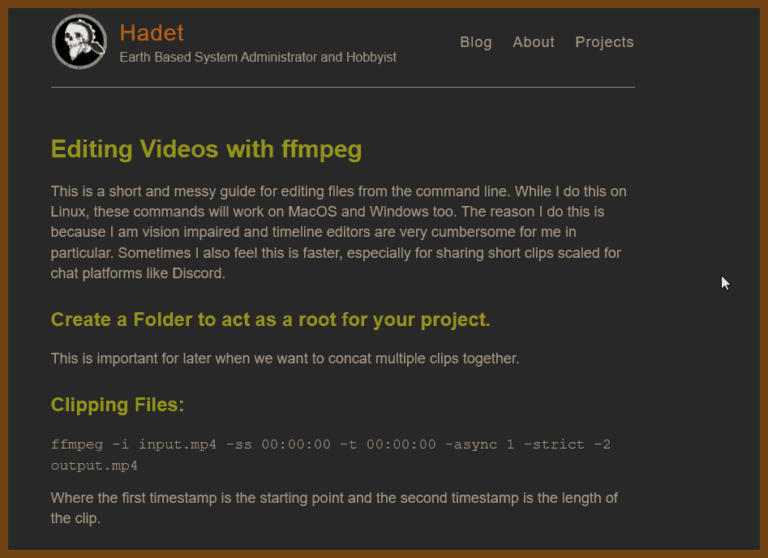

- [Using FFmpeg with NVIDIA GPU Hardware Acceleration :: NVIDIA Video Codec SDK Documentation](https://docs.nvidia.com/video-technologies/video-codec-sdk/ffmpeg-with-nvidia-gpu/index.html)
- [FFmpeg.wasm, a pure WebAssembly / JavaScript port of FFmpeg  TechBlog](https://jeromewu.github.io/ffmpeg-wasm-a-pure-webassembly-javascript-port-of-ffmpeg/)
- [Create animated GIF and WebP from videos using FFmpeg  Matt Joseph](https://mattj.io/posts/2021-02-27-create-animated-gif-and-webp-from-videos-using-ffmpeg/)
- [How can I reduce a video's size with ffmpeg? - Unix & Linux Stack Exchange](https://unix.stackexchange.com/questions/28803/how-can-i-reduce-a-videos-size-with-ffmpeg)
- [cytopia/ffscreencast: ffscreencast - ffmpeg screencast/desktop-recording with video overlay and multi monitor support](https://github.com/cytopia/ffscreencast)
- [FFmpeg Threads Command: How it Affects Quality and Performance - Streaming Learning Center](https://streaminglearningcenter.com/blogs/ffmpeg-command-threads-how-it-affects-quality-and-performance.html)
- [Galène videoconference server](https://galene.org/)
- [Show HN: Owncast – An open-source, self-hosted live streaming server Hacker News](https://news.ycombinator.com/item?id=25484133)
- [Camera Stabilisation with FFmpeg](http://blog.gregzaal.com/2014/05/30/camera-stabilisation-with-ffmpeg/)
- [Stabilizing GoPro Video with FFmpeg and vid.stab Important Bits](https://www.imakewebsites.ca/posts/2018/02/17/stabilizing-gopro-video-with-ffmpeg-and-vid.stab/)
- [Anime Encoding Guide for x265  HEVC  & AAC/OPUS  and Why to Never Use FLAC  – Kokomins](https://kokomins.wordpress.com/2019/10/10/anime-encoding-guide-for-x265-and-why-to-never-use-flac/)

## Tools

- [FFmpeg Commander](https://alfg.dev/ffmpeg-commander/)
    * [github: alfg/ffmpeg-commander: 🛠️ FFmpeg Command Generator Web UI](https://github.com/alfg/ffmpeg-commander) - generates commandline for the workload!

## Pin

Quick 720p conversion to share in Telegram

```sh
ffmpeg -i "!.!" -vf "scale=-2:720" -r 30 -c:v libx265 -preset slow -crf 23 -c:a aac -b:a 48k "!_720p.mp4"
```

## Snippets

Audio - increase volume:
[AudioVolume – FFmpeg](https://trac.ffmpeg.org/wiki/AudioVolume) Audio Volume Manipulation

```sh
ffmpeg -i VID_20211212_130236045.mp4  -c:v copy -filter:a loudnorm VID_20211212_130236045_vol_50.mp4
```

```sh
ffmpeg -i 2022-12-04-11-45-31.mkv -vcodec copy -af "volume=3.0" output.mkv
```

Add sound wave on top of video (under construction):

```sh
ffmpeg -i in.mp4 -filter_complex "[0:a]showwaves=s=1920x300:mode=line:colors=red|yellow[sw];[0][sw]overlay=(W-w)/2:(H-h)/2:format=auto,format=yuv420p[v]" -map "[v]" -map 0:a -movflags +faststart output.mp4
```

Reduce frame rate:
```
ffmpeg -i one.mkv -movflags +faststart -filter:v fps=24 two.mp4
```

Make a clip

```sh
ffmpeg -i i.mp4 -ss 00:01:00 -t 00:02:00 -c copy o.mp4
```
Group photos into video

```sh
ffmpeg -framerate 10 -pattern_type glob -i '*.jpg' -c:v libx264 o.mp4
```

Get a screenshot from a video.
```sh
ffmpeg -i o.mp4 -r 1 -q:v 2 -f image2 img-3%d.jpeg
```
Concatenate videos

```sh
file 'video1.mp4'
file 'video2.mp4'
file 'videoN.mp4'
```

```sh
ffmpeg -f concat -i list.txt -c copy o.mp4
```
Remove audio from video
```sh
ffmpeg -i i.mp4 -c:v copy -an o.mp4
```
Extract audio from video
```sh
ffmpeg -i i.mp4 -vn 0.wav
```

Crop video
```sh
ffmpeg -i i.mp4 -filter:v "crop=w:h:x:y" o.mp4
```

Stack videos horizontaly
```sh
ffmpeg -i i0.mp4 -i i1.mp4 -filter_complex hstack=inputs=2 o.mp4
```
Vertical
```sh
ffmpeg -i i0.mp4 -i i1.mp4 -filter_complex vstack=inputs=2 o.mp4
```

Grid 2x2
```sh
ffmpeg \ -i i0.mp4 -i i1.mp4 -i i2.mp4 -i i3.mp4 \ -filter_complex \ "[0:v][1:v]hstack=inputs=2[top]; \ [2:v][3:v]hstack=inputs=2[bottom]; \ [top][bottom]vstack=inputs=2[v]" \ -map "[v]" \ o.mp4
```

Grid 3x2
```sh
ffmpeg \ -i i0.mp4 -i i1.mp4 \ -i i2.mp4 -i i3.mp4 \ -i i4.mp4 -i i5.mp4 \ -filter_complex \ "[0:v][1:v][2:v]hstack=inputs=3[top];\ [3:v][4:v][5:v]hstack=inputs=3[bottom];\ [top][bottom]vstack=inputs=2[v]" \ -map "[v]" \ o.mp4
```

Rotate (re-encode):
```sh
ffmpeg -i i.mp4 -vf "transpose=0" o.mp4
```

[How To Rotate Videos Using FFMpeg From Commandline](https://ostechnix.com/how-to-rotate-videos-using-ffmpeg-from-commandline/)

transpose=...
- 0 - Rotate by 90 degrees counter-clockwise and flip vertically. This is the default.
- 1 - Rotate by 90 degrees clockwise.
- 2 - Rotate by 90 degrees counter-clockwise.
- 3 - Rotate by 90 degrees clockwise and flip vertically.

Rotate 180 dec:
```sh
ffmpeg -i input.mp4 -vf "transpose=2,transpose=2" output.mp4
```

Rotate (metadata only):
```sh
ffmpeg -i inp.mp4  -c copy -metadata:s:v:0 rotate=180 output.mp4
```

## Audio filter loudnorm

- 2022-06-12 [FFmpeg How to normalize audio? - John Riselvato](http://johnriselvato.com/ffmpeg-how-to-normalize-audio/)
```
ffmpeg -i input.mp3 -af loudnorm=I=-16:LRA=11:TP=-1.5 output.mp3
```

```
loudnorm
	Indicates the name of the normalization filter

I, i
	Indicates the integrated loudness (-70 to -5.0 with default -24.0)

LRA, lra
	Indicates the loudness range (1.0 to 20.0 with default 7.0)

TP, tp
	Indicates the max true peak (-9.0 to 0.0 with default -2.0)
```
See also: [loudnorm](http://k.ylo.ph/2016/04/04/loudnorm.html)
> Loudness Normalization. The algorithm goes like this: Measure the integrated loudness of the source file, calculate an appropriate offset gain, and then apply makeup gain. It’s a pretty simple algorithm, but what about when there’s nowhere near enough headroom for a simple upwards linear gain adjustment? And how should we handle the loudness normalization of livestreams?


## [steven2358](https://gist.github.com/steven2358)/**[ffmpeg.md](https://gist.github.com/steven2358/ba153c642fe2bb1e47485962df07c730)**

Added: 2025-06-22

A list of useful commands for the FFmpeg command line tool.

Download FFmpeg: https://www.ffmpeg.org/download.html

Full documentation: https://www.ffmpeg.org/ffmpeg.html

### Basic conversion


```
ffmpeg -i in.mp4 out.avi
```

#### Remux an MKV file into MP4


```
ffmpeg -i in.mkv -c:v copy -c:a copy out.mp4
```

#### High-quality encoding


Use the `crf` (Constant Rate Factor) parameter to control the output quality. The lower crf, the higher the quality (range: 0-51). The default value is 23, and visually lossless compression corresponds to `-crf 18`. Use the `preset` parameter to control the speed of the compression process. Additional info: https://trac.ffmpeg.org/wiki/Encode/H.264

```
ffmpeg -i in.mp4 -preset slower -crf 18 out.mp4
```

### Trimming


Without re-encoding:

```
ffmpeg -ss [start] -i in.mp4 -t [duration] -c copy out.mp4
```

- [`-ss`](http://ffmpeg.org/ffmpeg-all.html#Main-options) specifies the start time, e.g. `00:01:23.000` or `83` (in seconds)
- [`-t`](http://ffmpeg.org/ffmpeg-all.html#Main-options) specifies the duration of the clip (same format).
- Recent `ffmpeg` also has a flag to supply the end time with `-to`.
- [`-c`](http://ffmpeg.org/ffmpeg-all.html#Main-options) copy copies the first video, audio, and subtitle bitstream from the input to the output file without re-encoding them. This won't harm the quality and make the command run within seconds.

With re-encoding:

If you leave out the `-c copy` option, `ffmpeg` will automatically re-encode the output video and audio according to the format you chose. For high quality video and audio, read the [x264 Encoding Guide](https://ffmpeg.org/trac/ffmpeg/wiki/x264EncodingGuide) and the [AAC Encoding Guide](http://ffmpeg.org/trac/ffmpeg/wiki/AACEncodingGuide), respectively.

For example:

```
ffmpeg -ss [start] -i in.mp4 -t [duration] -c:v libx264 -c:a aac -strict experimental -b:a 128k out.mp4
```

### Mux video and audio from another video


To copy the video from in0.mp4 and audio from in1.mp4:

```
ffmpeg -i in0.mp4 -i in1.mp4 -c copy -map 0:0 -map 1:1 -shortest out.mp4
```

- With [-c copy](http://ffmpeg.org/ffmpeg.html#Stream-copy) the streams will be `stream copied`, not re-encoded, so there will be no quality loss. If you want to re-encode, see [FFmpeg Wiki: H.264 Encoding Guide](https://trac.ffmpeg.org/wiki/Encode/H.264).
- The `-shortest` option will cause the output duration to match the duration of the shortest input stream.
- See the [`-map` option documentation](http://ffmpeg.org/ffmpeg.html#Advanced-options) for more info.

### Concat demuxer


First, make a text file.

```
file 'in1.mp4'
file 'in2.mp4'
file 'in3.mp4'
file 'in4.mp4'
```

Then, run `ffmpeg`:

```
ffmpeg -f concat -i list.txt -c copy out.mp4
```

### Delay audio/video


Delay video by 3.84 seconds:

```
ffmpeg -i in.mp4 -itsoffset 3.84 -i in.mp4 -map 1:v -map 0:a -vcodec copy -acodec copy out.mp4
```

Delay audio by 3.84 seconds:

```
ffmpeg -i in.mp4 -itsoffset 3.84 -i in.mp4 -map 0:v -map 1:a -vcodec copy -acodec copy out.mp4
```

### Burn subtitles


Use the [libass](http://ffmpeg.org/ffmpeg.html#ass) library (make sure your ffmpeg install has the library in the configuration `--enable-libass`).

First convert the subtitles to .ass format:

```
ffmpeg -i sub.srt sub.ass
```

Then add them using a video filter:

```
ffmpeg -i in.mp4 -vf ass=sub.ass out.mp4
```

### Extract the frames from a video


To extract all frames from between 1 and 5 seconds, and also between 11 and 15 seconds:

```
ffmpeg -i in.mp4 -vf select='between(t,1,5)+between(t,11,15)' -vsync 0 out%d.png
```

To extract one frame per second only:

```
ffmpeg -i in.mp4 -fps=1 -vsync 0 out%d.png
```

### Rotate a video


Rotate 90 clockwise:

```
ffmpeg -i in.mov -vf "transpose=1" out.mov
```

For the transpose parameter you can pass:

```
0 = 90CounterCLockwise and Vertical Flip (default)
1 = 90Clockwise
2 = 90CounterClockwise
3 = 90Clockwise and Vertical Flip
```

Use `-vf "transpose=2,transpose=2"` for 180 degrees.

### Download "Transport Stream" video streams


1. Locate the playlist file, e.g. using Chrome > F12 > Network > Filter: m3u8
2. Download and concatenate the video fragments:

```
ffmpeg -i "path_to_playlist.m3u8" -c copy -bsf:a aac_adtstoasc out.mp4
```

If you get a "Protocol 'https not on whitelist 'file,crypto'!" error, add the `protocol_whitelist` option:

```
ffmpeg -protocol_whitelist "file,http,https,tcp,tls" -i "path_to_playlist.m3u8" -c copy -bsf:a aac_adtstoasc out.mp4
```

### Mute some of the audio


To replace the first 90 seconds of audio with silence:

```
ffmpeg -i in.mp4 -vcodec copy -af "volume=enable='lte(t,90)':volume=0" out.mp4
```

To replace all audio between 1'20" and 1'30" with silence:

```
ffmpeg -i in.mp4 -vcodec copy -af "volume=enable='between(t,80,90)':volume=0" out.mp4
```

### Deinterlace


Deinterlacing using "yet another deinterlacing filter".

```
ffmpeg -i in.mp4 -vf yadif out.mp4
```

### Create a video slideshow from images


Parameters: `-r` marks the image framerate (inverse time of each image); `-vf fps=25` marks the true framerate of the output.

```
ffmpeg -r 1/5 -i img%03d.png -c:v libx264 -vf fps=25 -pix_fmt yuv420p out.mp4
```

### Extract images from a video


- Extract all frames: `ffmpeg -i input.mp4 thumb%04d.jpg -hide_banner`
- Extract a frame each second: `ffmpeg -i input.mp4 -vf fps=1 thumb%04d.jpg -hide_banner`
- Extract only one frame: `ffmpeg -i input.mp4 -ss 00:00:10.000 -vframes 1 thumb.jpg`

### Display the frame number on each frame


```
ffmpeg -i in.mov -vf "drawtext=fontfile=arial.ttf: text=%{n}: x=(w-tw)/2: y=h-(2*lh): fontcolor=white: box=1: boxcolor=0x00000099: fontsize=72" -y out.mov
```

### Metadata: Change the title


```
ffmpeg -i in.mp4 -map_metadata -1 -metadata title="My Title" -c:v copy -c:a copy out.mp4
```

### Tools

https://ffmpeg.lav.io/ is an interactive resource to compose FFmpeg actions.


## Misc 2025-06-22

### Convert with CUDA Acceleration

Sample command

```sh 
ffmpeg -hwaccel cuda -i VID_20250618_184447_00_001.mp4  -vf scale=1920:1080  -c:v h264_nvenc -rc constqp -qp 23 -preset slow  -report VID_20250618_184447_00_001_cuda_1080p.mp4
```


Universal .bat/.cmd file, works for all files in the current directory

```cmd
@echo off
setlocal enabledelayedexpansion

for %%F in (VID_*.mp4) do (
    rem Skip files that already contain _cuda_1080p in the name
    echo %%F | findstr /C:"_cuda_1080p.mp4" >nul
    if errorlevel 1 (
        set "input=%%F"
        set "name=%%~nF"
        set "output=!name!_cuda_1080p.mp4"
        
        if not exist "!output!" (
            echo Processing: !input!
            ffmpeg -hwaccel cuda -i "!input!" -vf scale=1920:1080 -c:v h264_nvenc -rc constqp -qp 23 -preset slow -report "!output!"
        ) else (
            echo Skipping already processed file: !input!
        )
    )
)

endlocal
```


### FF Normalize Sound in Video

```sh
ffmpeg -i "!.!" -c:v copy -af dynaudnorm,volume=3.0 "!_normalized.mp4"
```


### FF Normalize Sound Mp3

```sh
ffmpeg -i "!.!" -af dynaudnorm "!_normalized.mp3"
```


### FFmpeg Telegram 720

good for sending videos via telegram

```sh
ffmpeg -i "!.!" -vf "scale=-2:720" -r 30 -c:v libx265 -preset slow -crf 23 -c:a aac -b:a 48k -af "volume=5.0" "!_720p.mp4"
```


## FFmpeg: convert for android

- (2021-09-15) [Converting Video for Android using FFMPEG - Stack Overflow](https://stackoverflow.com/questions/14171826/converting-video-for-android-using-ffmpeg)

```sh
ffmpeg -i <input> -c:v libx264 -c:a aac -movflags +faststart output.mp4
```

```sh
ffmpeg -i <input> -s 480x320 -vcodec mpeg4 -acodec aac -strict -2 -ac 1 -ar 16000 -r 13 -ab 32000 -aspect 3:2 <output>
```

```sh
ffmpeg -y -i input_file.mp4 -s 352x288 -b:v 384k -flags +loop+mv4 -cmp 256 -partitions +parti4x4+parti8x8+partp4x4+partp8x8 -subq 6 -trellis 0 -refs 5 -bf 0 -coder 0 -me_range 16 -g 250 -keyint_min 25 -sc_threshold 40 -i_qfactor 0.71 -qmin 10 -qmax 51 -qdiff 4 -c:a aac -ac 1 -ar 16000 -r 13 -ab 32000 -aspect 3:2 -strict experimental output_file.3gp
```

```sh
ffmpeg -i <INPUT_VIDEO> -c:v libx264 -profile:v baseline -c:a libvo_aacenc -ar 44100 -ac 2 -b:a 128k -movflags faststart output.mp4
```

Powershell: Convert files in the current folder for mobile upload

```powershell
$files = Get-ChildItem
New-Item  -Name "out" -ItemType "directory"
foreach($file in $files) {
    $file.Extension
    if ($file.Extension -cin ('.webm', '.mp4', '.mkv')) {
        $fn = '"out/' + $file.BaseName + '.mp4'
        ffmpeg -i "$file" -c:v libx264 -c:a aac -movflags +faststart $fn
    }
}
```

## Webcam Streaming

[Stream camera video and audio with FFmpeg](http://4youngpadawans.com/stream-camera-video-and-audio-with-ffmpeg/)

```bash
ffmpeg -list_devices true -f dshow -i dummy
```

> "HD Pro Webcam C920"
> "Microphone (TKGOU PnP USB Microphone)"


```bash
ffmpeg -f dshow -i video="HD Pro Webcam C920":audio="Microphone (TKGOU PnP USB Microphone)" -profile:v high -pix_fmt yuvj420p -level:v 4.1 -preset ultrafast -tune zerolatency -vcodec libx264 -r 10 -b:v 512k -s 640x360 -acodec aac -ac 2 -ab 32k -ar 44100 -f mpegts -flush_packets 0 udp://192.168.1.101:5666?pkt_size=1316
```


VLC -> Open Network Stream: `udp://@192.168.1.101:5666`

## GoPRO Camera

Reddit Thread: [No longer free: Windows 10 HEVC Video Extensions from Device Manufacturer : Windows10](https://www.reddit.com/r/Windows10/comments/j58y6f/no_longer_free_windows_10_hevc_video_extensions/)
workaround
```
start ms-windows-store://pdp/?ProductId=9n4wgh0z6vhq
```

Downscale 4K video example

```bash
ffmpeg -i input.MP4 -c:v libx264 -crf 19 -preset slow -c:a aac -b:a 192k -ac 2 -vf scale=1920:1080 output_4k_to_1080p_converted.MP4
```

Convert h.264 to h.265 (no change in resolution)

```bash
ffmpeg -i input.mp4 -c:v libx265 -vtag hvc1 -vf scale=1920:1080 -crf 20 -c:a copy output.mp4
```

crf:
- `-crf 0` high-quality, low compression, large file
- `-crf 23` default
- `-crf 51` low-quality, high compression, small file

### GoPro Tools and Code

- (2021-12-26) [GoPro Open Sources Video Metadata](https://gopro.com/en/us/news/gopro-video-metadata-open-source-explained)
- (2021-12-26) [TestDisk - CGSecurity](https://www.cgsecurity.org/wiki/TestDisk) - Open source SD Card recovery tool
- 2022-05-13 [destroyedlolo/GPMFMetersGenerator: Generate skickers from GoPro's GPMF](https://github.com/destroyedlolo/GPMFMetersGenerator)
> Generate skickers from GoPro's GPMF
> Try it 🍎🍎🍎
- 2022-05-13 [gyroflow/gyroflow: Video stabilization using gyroscope data](https://github.com/gyroflow/gyroflow)
> Video stabilization using gyroscope data Homepage • Download • Documentation • Discord • Report bug • Request feature
- 2022-05-13 [KonradIT/goprowifihack: Unofficial GoPro WiFi API Documentation - HTTP GET requests for commands, status, livestreaming and media query.](https://github.com/KonradIT/goprowifihack)
> The unofficial API for GoPro cameras (The WiFi enabled models)
- 2022-05-13 [gopro/gpmf-parser: Parser for GPMF™ formatted telemetry data used within GoPro® cameras.](https://github.com/gopro/gpmf-parser)
> The GPMF structured storage format was originally proposed to store high-frequency periodic sensor data within a video file like an MP4. Action cameras, like that from GoPro, have limited computing resources beyond that needed to store video and audio, so


## Youtube
- 2022-05-08 [Encode/YouTube – FFmpeg](https://trac.ffmpeg.org/wiki/Encode/YouTube)
> Upscaling video for higher peak quality

Due to the encoding ladders that Youtube and other streaming sites utilise to re-encode uploaded videos in different qualities, higher resolution videos receive a higher bitrate. It's possible to use upscaling to exploit this for higher peak viewing quality.

The following will use nearest neighbor scaling to upscale a video by 2x in each direction for 4 times the total resolution and minimal scaling artifacts:

```
ffmpeg -i input.mkv -vf scale=iw*2:ih*2:flags=neighbor -c:v libx264 -preset slow -crf 18 output.mkv
```

To upscale by 4x or 8x, use scale=iw*4:ih*4:flags=neighbor and scale=iw*8:ih*8:flags=neighbor respectively. This can be useful for low-resolution material such as VHS captures, DVD video, and gameplay capture of old video games that would otherwise suffer from excessive loss of detail if uploaded in 480p or lower resolution.


## Tools / Other

- (2021-09-26) [jely2002/youtube-dl-gui: A cross-platform GUI for youtube-dl made in Electron and node.js - open video downloader](https://github.com/jely2002/youtube-dl-gui)

- 2023-08-05 [ffmprovisr](https://amiaopensource.github.io/ffmprovisr/#basic-structure) ffmpeg cookbook

> Making FFmpeg Easier
> FFmpeg is a powerful tool for manipulating audiovisual files. Unfortunately, it also has a steep learning curve, especially for users unfamiliar with a command line interface. This app helps users through the command generation process so that more people can reap the benefits of FFmpeg.
>
> Each button displays helpful information about how to perform a wide variety of tasks using FFmpeg. To use this site, click on the task you would like to perform. A new window will open up with a sample command and a description of how that command works. You can copy this command and understand how the command works with a breakdown of each of the flags.
>
> This page does not have search functionality, but you can open all recipes (second option in the sidebar) and use your browser's search tool (often ctrl+f or cmd+f) to perform a keyword search through all recipes.
>
> 
>
> - [About this resource](https://amiaopensource.github.io/ffmprovisr/#about)
> - [FFmpeg basics](https://amiaopensource.github.io/ffmprovisr/#basics)
> - [Advanced FFmpeg concepts](https://amiaopensource.github.io/ffmprovisr/#concepts)
> - [Change container (rewrap)](https://amiaopensource.github.io/ffmprovisr/#rewrap)
> - [Change codec (transcode)](https://amiaopensource.github.io/ffmprovisr/#transcode)
> - [Change video properties](https://amiaopensource.github.io/ffmprovisr/#video-properties)
> - [Change/view audio properties](https://amiaopensource.github.io/ffmprovisr/#audio-files)
> - [Join/trim/create an excerpt](https://amiaopensource.github.io/ffmprovisr/#join-trim)
> - [Work with interlaced video](https://amiaopensource.github.io/ffmprovisr/#interlacing)
> - [Overlay timecode or text on a video](https://amiaopensource.github.io/ffmprovisr/#overlay)
> - [Create thumbnails or GIFs](https://amiaopensource.github.io/ffmprovisr/#create-images)
> - [Create a video from image(s) and audio](https://amiaopensource.github.io/ffmprovisr/#create-video)
> - [Use filters or scopes](https://amiaopensource.github.io/ffmprovisr/#filters-scopes)
> - [View or strip metadata](https://amiaopensource.github.io/ffmprovisr/#metadata)
> - [Preservation tasks](https://amiaopensource.github.io/ffmprovisr/#preservation)
> - [Generate test files](https://amiaopensource.github.io/ffmprovisr/#test-files)
> - [Use OCR](https://amiaopensource.github.io/ffmprovisr/#ocr)
> - [Compare similarity of videos](https://amiaopensource.github.io/ffmprovisr/#perceptual-similarity)
> - [Something else](https://amiaopensource.github.io/ffmprovisr/#other)
> - [Similar tools: tips & tricks](https://amiaopensource.github.io/ffmprovisr/#similar-tools)
> - [CDDA (Audio CD) Ripping Tools](https://amiaopensource.github.io/ffmprovisr/#cdda)
> - [ImageMagick](https://amiaopensource.github.io/ffmprovisr/#imagemagick)
> - [flac tool](https://amiaopensource.github.io/ffmprovisr/#flac-tool)

## About ffmprovisr

### Making FFmpeg Easier

FFmpeg is a powerful tool for manipulating audiovisual files. Unfortunately, it also has a steep learning curve, especially for users unfamiliar with a command line interface. This app helps users through the command generation process so that more people can reap the benefits of FFmpeg.

Each button displays helpful information about how to perform a wide variety of tasks using FFmpeg. To use this site, click on the task you would like to perform. A new window will open up with a sample command and a description of how that command works. You can copy this command and understand how the command works with a breakdown of each of the flags.

This page does not have search functionality, but you can open all recipes (second option in the sidebar) and use your browser's search tool (often ctrl+f or cmd+f) to perform a keyword search through all recipes.

### Tutorials

For FFmpeg basics, check out the program’s [official website](https://ffmpeg.org/).

For instructions on how to install FFmpeg on Mac, Linux, and Windows, refer to Reto Kromer’s [installation instructions](https://avpres.net/FFmpeg/#ch1).

For Bash and command line basics, try the [Command Line Crash Course](https://learnpythonthehardway.org/book/appendixa.html). For a little more context presented in an ffmprovisr style, try [explainshell.com](https://explainshell.com/)!

### License

[](https://creativecommons.org/licenses/by/4.0/)
This work is licensed under a [Creative Commons Attribution 4.0 International License](https://creativecommons.org/licenses/by/4.0/).

### Sibling projects

[Script Ahoy](https://dd388.github.io/crals/): Community Resource for Archivists and Librarians Scripting

[The Sourcecaster](https://datapraxis.github.io/sourcecaster/): an app that helps you use the command line to work through common challenges that come up when working with digital primary sources.

[Micropops](https://pugetsoundandvision.github.io/micropops/): One liners and automation tools from Moving Image Preservation of Puget Sound

[Cable Bible](https://amiaopensource.github.io/cable-bible/): A Guide to Cables and Connectors Used for Audiovisual Tech

[QEMU QED](https://eaasi.gitlab.io/program_docs/qemu-qed/): instructions for using QEMU (Quick EMUlator), a command line application for computer emulation and virtualization

[ffmpeg-artschool](https://amiaopensource.github.io/ffmpeg-artschool/): An AMIA workshop featuring scripts, exercises, and activities to make art using FFmpeg

## Learn about FFmpeg basics

Basic structure of an FFmpeg command

##### Basic structure of an FFmpeg command

At its basis, an FFmpeg command is relatively simple. After you have installed FFmpeg (see instructions [here](https://avpres.net/FFmpeg/#ch1)), the program is invoked simply by typing `ffmpeg` at the command prompt.

Subsequently, each instruction that you supply to FFmpeg is actually a pair: a flag, which designates the *type* of action you want to carry out; and then the specifics of that action. Flags are always prepended with a hyphen.

For example, in the instruction `-i *input_file.ext*`, the `-i` flag tells FFmpeg that you are supplying an input file, and `input_file.ext` states which file it is.

Likewise, in the instruction `-c:v prores`, the flag `-c:v` tells FFmpeg that you want to encode the video stream, and `prores` specifies which codec is to be used. (`-c:v` is shorthand for `-codec:v`/`-codec:video`).

A very basic FFmpeg command looks like this:

- ffmpeg

  starts the command

- -i *input_file.ext*

  path and name of the input file

- *-flag some_action*

  tell FFmpeg to do something, by supplying a valid flag and action

- *output_file.ext*

  path and name of the output file. Because this is the last part of the command, the filename you type here does not have a flag designating it as the output file.

Link to this command: https://amiaopensource.github.io/ffmprovisr/index.html#basic-structure

Streaming vs. Saving

##### Streaming vs. Saving

FFplay allows you to stream created video and FFmpeg allows you to save video.

The following command creates and saves a 10-second video of SMPTE bars:

```
ffmpeg -f lavfi -i smptebars=size=640x480 -t 5 output_file
```

This command plays and streams SMPTE bars but does not save them on the computer:

```
ffplay -f lavfi smptebars=size=640x480
```

The main difference is small but significant: the `-i` flag is required for FFmpeg but not required for FFplay. Additionally, the FFmpeg script needs to have `-t 5` and `output.mkv` added to specify the length of time to record and the place to save the video.


## Learn about more advanced FFmpeg concepts

Batch and Loop script usage

##### Batch and Loop script usage

```
ffmpeg -nostdin -i *input_file* ...
```

One of the frequent uses of FFmpeg is to run batch commands within loops to, for example, generate access files for an entire collection at once.

When running an FFmpeg command within a loop it is often necessary to use the `-nostdin` flag prior to the input in order to ensure successful execution of the commands. This is needed to override FFmpeg's default behavior of enabling interaction on standard input which can result in errors as loop inputs are fed to the ongoing command.


Codec defaults

##### Codec Defaults

Unless specified, FFmpeg will automatically set codec choices and codec parameters based off of internal defaults. These defaults are applied based on the file type used in the output (for example `.mov` or `.wav`).

When creating or transcoding files with FFmpeg, it is important to consider codec settings for both audio and video, as the default options may not be desirable in your particular context. The following is a brief list of codec defaults for some common file types:

- `.avi`: Audio Codec: mp3, Video Codec: mpeg4
- `.mkv`: Audio Codec: ac3, Video Codec: H.264
- `.mov`: Audio Codec: AAC, Video Codec: H.264
- `.mp4`: Audio Codec: AAC, Video Codec: H.264
- `.mpg`: Audio Codec: mp2, Video Codec: mpeg1video
- `.mxf`: Audio Codec: pcm_s16le, Video Codec: mpeg2video
- `.wav`: Audio Codec: pcm_s16le (16 bit PCM)


Filtergraphs

##### Filtergraphs

Many FFmpeg commands use filters that manipulate the video or audio stream in some way: for example, [hflip](https://ffmpeg.org/ffmpeg-filters.html#hflip) to horizontally flip a video, or [amerge](https://ffmpeg.org/ffmpeg-filters.html#amerge-1) to merge two or more audio tracks into a single stream.

The use of a filter is signaled by the flag `-vf` (video filter) or `-af` (audio filter), followed by the name and options of the filter itself. For example, take the [convert colorspace](https://amiaopensource.github.io/ffmprovisr/#convert-colorspace) command:

```
ffmpeg -i *input_file* -c:v libx264 -vf colormatrix=*src*:*dst* *output_file*
```

Here, [colormatrix](https://ffmpeg.org/ffmpeg-filters.html#colormatrix) is the filter used, with *src* and *dst* representing the source and destination colorspaces. This part following the `-vf` is a **filtergraph**.

It is also possible to apply multiple filters to an input, which are sequenced together in the filtergraph. A chained set of filters is called a filter chain, and a filtergraph may include multiple filter chains. Filters in a filterchain are separated from each other by commas (`,`), and filterchains are separated from each other by semicolons (`;`). For example, take the [inverse telecine](https://amiaopensource.github.io/ffmprovisr/#inverse-telecine) command:

```
ffmpeg -i *input_file* -c:v libx264 -vf "fieldmatch,yadif,decimate" *output_file*
```

Here we have a filtergraph including one filter chain, which is made up of three video filters.

It is often prudent to enclose your filtergraph in quotation marks; this means that you can use spaces within the filtergraph. Using the inverse telecine example again, the following filter commands are all valid and equivalent:

- `-vf fieldmatch,yadif,decimate`
- `-vf "fieldmatch,yadif,decimate"`
- `-vf "fieldmatch, yadif, decimate"`

but `-vf fieldmatch, yadif, decimate` is not valid.

The ordering of the filters is significant. Video filters are applied in the order given, with the output of one filter being passed along as the input to the next filter in the chain. In the example above, `fieldmatch` reconstructs the original frames from the inverse telecined video, `yadif` deinterlaces (this is a failsafe in case any combed frames remain, for example if the source mixes telecined and real interlaced content), and `decimate` deletes duplicated frames. Clearly, it is not possible to delete duplicated frames before those frames are reconstructed.

#### Notes

- `-vf` is an alias for `-filter:v`
- If the command involves more than one input or output, you must use the flag `-filter_complex` instead of `-vf`.
- Straight quotation marks ("like this") rather than curved quotation marks (“like this”) should be used.

For more information, check out the FFmpeg wiki [Filtering Guide](https://trac.ffmpeg.org/wiki/FilteringGuide).


Stream mapping

##### Stream mapping

Stream mapping is the practice of defining which of the streams (e.g., video or audio tracks) present in an input file will be present in the output file. FFmpeg recognizes five stream types:

- `a` - audio
- `v` - video
- `s` - subtitle
- `d` - data (including timecode tracks)
- `t` - attachment

Mapping is achieved by use of the `-map` flag, followed by an action of the type `file_number:stream_type[:stream_number]`. Numbering is zero-indexed, and it's possible to map by stream type and/or overall stream order within the input file. For example:

- `-map 0:v` means ‘take all video streams from the first input file’.
- `-map 0:3` means ‘take the fourth stream from the first input file’.
- `-map 0:a:2` means ‘take the third audio stream from the first input file’.
- `-map 0:0 -map 0:2` means ‘take the first and third streams from the first input file’.
- `-map 0:1 -map 1:0` means ‘take the second stream from the first input file and the first stream from the second input file’.

When no mapping is specified in an ffmpeg command, the default for video files is to take just one video and one audio stream for the output: other stream types, such as timecode or subtitles, will not be copied to the output file by default. If multiple video or audio streams are present, the best quality one is automatically selected by FFmpeg.

To map *all* streams in the input file to the output file, use `-map 0`. However, note that not all container formats can include all stream types: for example, .mp4 cannot contain timecode.

#### Mapping with a failsafe

To safely process files that may or may not contain given a type of stream, you can add a trailing `?` to your map commands: for example, `-map 0:a?` instead of `-map 0:a`.

This makes the map optional: audio streams will be mapped over if they are present in the file—but if the file contains no audio streams, the transcode will proceed as usual, minus the audio stream mapping. Without adding the trailing `?`, FFmpeg will exit with an error on that file.

This is especially recommended when batch processing video files: it ensures that all files in your batch will be transcoded, whether or not they contain audio streams.

For more information, check out the FFmpeg wiki [Map](https://trac.ffmpeg.org/wiki/Map) page, and the official FFmpeg [documentation on `-map`](https://ffmpeg.org/ffmpeg.html#Advanced-options).

Link to this command: https://amiaopensource.github.io/ffmprovisr/index.html#stream-mapping

## Change container (rewrap)

Basic rewrap command

##### Rewrap a file

```
ffmpeg -i *input_file.ext* -c copy -map 0 *output_file.ext*
```

This script will rewrap a video file. It will create a new video video file where the inner content (the video, audio, and subtitle data) of the original file is unchanged, but these streams are rehoused within a different container format.

**Note:** rewrapping is also known as remuxing, short for re-multiplexing.

- ffmpeg

  starts the command

- -i *input_file.ext*

  path and name of the input file

- -c copy

  copy the streams directly, without re-encoding.

- -map 0

  map all streams of the input to the output. By default, FFmpeg will only map one stream of each type (video, audio, subtitles) to the output file. However, files may have multiple streams of a given type - for example, a video may have several audio tracks for different languages. Therefore, if you want to preserve all the streams in the original, it's necessary to use this option.

- *output_file.ext*

  path and name of the output file. The new container you are rewrapping to is defined by the filename extension used here, e.g. .mkv, .mp4, .mov.

#### Important caveat

It may not be possible to rewrap a file's contents to a new container without re-encoding one or more of the streams within (that is, the video, audio, and subtitle tracks). Some containers can only contain streams of a certain encoding type: for example, the .mp4 container does not support uncompressed audio tracks. (In practice .mp4 goes hand-in-hand with a H.264-encoded video stream and an AAC-encoded video stream, although other types of video and audio streams are possible). Another example is that the Matroska container does not allow data tracks.

In such cases, FFmpeg will throw an error. If you encounter errors of this kind, you may wish to consult the [list of transcoding recipes](https://amiaopensource.github.io/ffmprovisr/#transcode).


Convert to (or create) Broadcast WAV

##### Generate Broadcast WAV

```
ffmpeg -i *input_file.wav* -c copy -write_bext 1 -metadata field_name='Content' *output_file.wav*
```

This command will write a file in the Broadcast Wave Format (BWF) containing a BEXT chunk with related metadata.

- ffmpeg

  starts the command

- -i *input_file.wav*

  path and name of the input file

- -c copy

  this will copy the encoding/sample rate etc from the input. If not using a WAV as the input file you will have to specify codec settings in place of this.

- -write_bext 1

  tells FFmpeg to write a BEXT chunk, the part of the file where BWF metadata is stored.

- -metadata field_name='Content'

  This is where you can specify which BEXT fields to write, and what information to fill them with by replacing `field_name` and `'Content'` respectively. See below for additional details.

Notes: You can choose which fields to write by repeating `-metadata field_name='Content'` for each desired field. Flags for commonly used fields (such as those recommended by the [FADGI guidelines](http://www.digitizationguidelines.gov/audio-visual/documents/Embed_Guideline_20120423.pdf)) are as follows:

- description
- originator
- originator_reference
- origination_date
- origination_time
- coding_history
- IARL

Example: `-metadata originator='US, UW Libraries'`

Additionally, users should be aware that BWF metadata fields are limited by characters, with some such as OriginatorReference maxing out at 32. Specific information can be found in the [Broadcast Wave Format specification](https://tech.ebu.ch/docs/tech/tech3285.pdf). Additional examples of BWF metadata usage can be found in the [Sound Directions report](http://www.dlib.indiana.edu/projects/sounddirections/papersPresent/sd_bp_07.pdf) by Indiana University and Harvard.


Rewrap DV video to .dv file

##### Rewrap DV video to .dv file

```
ffmpeg -i *input_file* -f rawvideo -c:v copy *output_file.dv*
```

This script will take a video that is encoded in the [DV Codec](https://en.wikipedia.org/wiki/DV) but wrapped in a different container (such as MOV) and rewrap it into a raw DV file (with the .dv extension). Since DV files potentially contain a great deal of provenance metadata within the DV stream, it is necessary to rewrap files in this method to avoid unintentional stripping of this metadata.

- ffmpeg

  starts the command

- -i *input_file*

  path and name of the input file

- -f rawvideo

  this tells FFmpeg to pass the video stream as raw video data without remuxing. This step is what ensures the survival of embedded metadata versus a standard rewrap.

- -c:v copy

  copy the DV stream directly, without re-encoding.

- *output_file.dv*

  tells FFmpeg to use the DV wrapper for the output.


## Change codec (transcode)

Transcode to deinterlaced Apple ProRes LT

##### Transcode into a deinterlaced Apple ProRes LT

```
ffmpeg -i *input_file* -c:v prores -profile:v 1 -vf yadif -c:a pcm_s16le *output_file*
```

This command transcodes an input file into a deinterlaced Apple ProRes 422 LT file with 16-bit linear PCM encoded audio. The file is deinterlaced using the yadif filter (Yet Another De-Interlacing Filter).

- ffmpeg

  starts the command

- -i *input_file*

  path, name and extension of the input file

- -c:v prores

  tells FFmpeg to transcode the video stream into Apple ProRes 422

- -profile:v *1*

  Declares profile of ProRes you want to use. The profiles are explained below:0 = ProRes 422 (Proxy)1 = ProRes 422 (LT)2 = ProRes 422 (Standard)3 = ProRes 422 (HQ)

- -vf yadif

  Runs a deinterlacing video filter (yet another deinterlacing filter) on the new file. `-vf` is an alias for `-filter:v`.

- -c:a pcm_s16le

  tells FFmpeg to encode the audio stream in 16-bit linear PCM

- *output_file*

  path, name and extension of the output file There are currently three possible containers for ProRes 422 and 4444 which are all supported by FFmpeg: QuickTime (`.mov`), Matroska (`.mkv`) and Material eXchange Format (`.mxf`).

FFmpeg comes with more than one ProRes encoder:

- `prores` is much faster, can be used for progressive video only, and seems to be better for video according to Rec. 601 (Recommendation ITU-R BT.601).
- `prores_ks` generates a better file, can also be used for interlaced video, allows also encoding of ProRes 4444 (`-c:v prores_ks -profile:v 4`) and ProRes 4444 XQ (`-c:v prores_ks -profile:v 5`), and seems to be better for video according to Rec. 709 (Recommendation ITU-R BT.709).


Transcode to an H.264 access file

##### Transcode to H.264

```
ffmpeg -i *input_file* -c:v libx264 -pix_fmt yuv420p -c:a aac *output_file*
```

This command takes an input file and transcodes it to H.264 with an .mp4 wrapper, audio is transcoded to AAC. The libx264 codec defaults to a “medium” preset for compression quality and a CRF of 23. CRF stands for constant rate factor and determines the quality and file size of the resulting H.264 video. A low CRF means high quality and large file size; a high CRF means the opposite.

- ffmpeg

  starts the command

- -i *input_file*

  path, name and extension of the input file

- -c:v libx264

  tells FFmpeg to encode the video stream as H.264

- -pix_fmt yuv420p

  libx264 will use a chroma subsampling scheme that is the closest match to that of the input. This can result in Y′CBCR 4:2:0, 4:2:2, or 4:4:4 chroma subsampling. QuickTime and most other non-FFmpeg based players can’t decode H.264 files that are not 4:2:0. In order to allow the video to play in all players, you can specify 4:2:0 chroma subsampling.

- -c:a aac

  encode audio as AAC. AAC is the codec most often used for audio streams within an .mp4 container.

- *output_file*

  path, name and extension of the output file

In order to optimize the file for streaming, you can add this preset:

```
ffmpeg -i *input_file* -c:v libx264 -pix_fmt yuv420p -c:a aac -movflags +faststart *output_file*
```

- -movflags +faststart

  This tells FFmpeg to move some of the essential metadata to the start of the file, which permits starting viewing before the file finishes downloading (an ideal characteristic for streaming).

In order to use the same basic command to make a higher quality file, you can add some of these presets:

```
ffmpeg -i *input_file* -c:v libx264 -pix_fmt yuv420p -preset veryslow -crf 18 -c:a aac *output_file*
```

- -preset *veryslow*

  This option tells FFmpeg to use the slowest preset possible for the best compression quality. Available presets, from slowest to fastest, are: `veryslow`, `slower`, `slow`, `medium`, `fast`, `faster`, `veryfast`, `superfast`, `ultrafast`.

- -crf *18*

  Specifying a lower CRF will make a larger file with better visual quality. For H.264 files being encoded with a 4:2:0 chroma subsampling scheme (i.e., using `-pix_fmt yuv420p`), the scale ranges between 0-51 for 8-bit content, with 0 being lossless and 51 the worst possible quality. If no crf is specified, `libx264` will use a default value of 23. 18 is often considered a “visually lossless” compression.

By default, this recipe will include one track of each type (e.g. audio, video) in the output file. If you wish to include more tracks, consult the [entry on stream mapping](https://amiaopensource.github.io/ffmprovisr/#stream-mapping).

For more information, see the [FFmpeg and H.264 Encoding Guide](https://trac.ffmpeg.org/wiki/Encode/H.264) on the FFmpeg wiki.


Transcode to H.264/H.265 using the GPU

##### Transcode to H.264/H.265 using the GPU

```
ffmpeg -i *input_file* -c:v h264_nvenc -preset llhq -rc:v vbr_hq -cq:v 19 -b:v 8000k -maxrate:v 12000k -profile:v high -c:a copy *output_file*
```

This command takes an input file and transcodes it to H.264 using the encoding functionality of an Nvidia GPU (without transcoding the audio). If you're using H.264 with AAC or AC3 audio, you can output to an .mp4 file; if you're using HEVC and/or more exotic audio, you should output to .mkv. While Nvidia's fixed-function hardware can be 10x as performant as encoding on the CPU, it requires a few more parameters in order to optimize quality at lower bitrates.

- ffmpeg

  starts the command

- -i *input_file*

  path, name and extension of the input file

- -c:v *h264_nvenc*

  tells FFmpeg to encode the video stream as H.264 using Nvidia's encoder.

- -preset *llhq*

  uses the "low latency, high quality" encoding preset, a good default when working with nvenc.

- -rc:v *vbr_hq*

  means "variable bitrate, high quality," allowing you to set a minimum and maximum bitrate for the encode.

- -cq:v *19*

  is the same as the CRF quality level specified using x264 or other CPU-based encoders, where 0 is lossless, 51 is the worst possible quality, and values from 18-23 are typical.

- -b:v *8000k -maxrate:v 12000k*

  corresponds to a minimum bitrate of 8 megabits (8000k) per second, and a maximum of 12 megabits per second. nvenc is not as good at estimating bitrates as CPU-based encoders, and without this data, will occasionally choose a visibly lower bitrate. The 8-12 mbit range is generally a good one for high-quality 1080p h264.

- -profile:v *high*

  uses the "high quality" profile of h264, something that's been baked in to the spec for a long time so that older players can declare compatibility; almost all h264 video now uses high.

- -c:a *copy*

  will skip reencoding the audio stream, and copy the audio from the source file.

- *output_file*

  path, name and extension of the output file

In order to encode to HEVC instead, and optionally transcode the audio, you can try changing the command like this:

```
ffmpeg -i *input_file* -c:v hevc_nvenc -preset llhq -rc:v vbr_hq -cq:v 19 -b:v 5000k -maxrate:v 8000k -profile:v main10 -c:a aac *output_file*
```

- -c:v *hevc_nvenc*

  encodes to HEVC (also called H.265), a more efficient codec supported on GPUs from approximately 2015 and newer.

- -b:v *5000k -maxrate:v 8000k*

  specifies a slightly lower bitrate than when using h264, per HEVC's greater efficiency.

- -profile:v *main10*

  declares the "main10" profile for working with HEVC; one of the primary advantages of this codec is better support for 10-bit video, enabling consumer HDR.

- -c:a *aac*

  reencodes the audio to AAC with default parameters, a very common and widely supported format for access copies.

Much of the information in this entry was taken from [this superuser.com post](https://superuser.com/a/1236387) provided by an Nvidia developer, one of the best sources of information on the ffmpeg Nvidia encoders.


Transcode from DCP to an H.264 access file

##### H.264 from DCP

```
ffmpeg -i *input_video_file*.mxf -i *input_audio_file*.mxf -c:v libx264 -pix_fmt yuv420p -c:a aac *output_file.mp4*
```

This will transcode MXF wrapped video and audio files to an H.264 encoded MP4 file. Please note this only works for unencrypted, single reel DCPs.

- ffmpeg

  starts the command

- -i *input_video_file*

  path and name of the video input file. This extension must be `.mxf`

- -i *input_audio_file*

  path and name of the audio input file. This extension must be `.mxf`

- -c:v libx264

  transcodes video to H.264

- -pix_fmt yuv420p

  sets pixel format to yuv420p for greater compatibility with media players

- -c:a aac

  re-encodes using the AAC audio codec Note that sadly MP4 cannot contain sound encoded by a PCM (Pulse-Code Modulation) audio codec

- *output_file.mp4*

  path, name and .mp4 extension of the output file

Variation: Copy PCM audio streams by using Matroska instead of the MP4 container

```
ffmpeg -i *input_video_file*.mxf -i *input_audio_file*.mxf -c:v libx264 -pix_fmt yuv420p -c:a copy *output_file.mkv*
```

- -c:a copy

  re-encodes using the same audio codec

- *output_file.mkv*

  path, name and .mkv extension of the output file


Transcode your file with the FFV1 Version 3 Codec in a Matroska container

##### Create FFV1 Version 3 video in a Matroska container with framemd5 of input

```
ffmpeg -i *input_file* -map 0 -dn -c:v ffv1 -level 3 -g 1 -slicecrc 1 -slices 16 -c:a copy *output_file*.mkv -f framemd5 -an *framemd5_output_file*
```

This will losslessly transcode your video with the FFV1 Version 3 codec in a Matroska container. In order to verify losslessness, a framemd5 of the source video is also generated. For more information on FFV1 encoding, [try the FFmpeg wiki](https://trac.ffmpeg.org/wiki/Encode/FFV1).

- ffmpeg

  starts the command.

- -i *input_file*

  path, name and extension of the input file.

- -map 0

  Map all streams that are present in the input file. This is important as FFmpeg will map only one stream of each type (video, audio, subtitles) by default to the output video.

- -dn

  ignore data streams (data no). The Matroska container does not allow data tracks.

- -c:v ffv1

  specifies the FFV1 video codec.

- -level 3

  specifies Version 3 of the FFV1 codec.

- -g 1

  specifies intra-frame encoding, or GOP=1.

- -slicecrc 1

  Adds CRC information for each slice. This makes it possible for a decoder to detect errors in the bitstream, rather than blindly decoding a broken slice. (Read more [here](http://ndsr.nycdigital.org/diving-in-head-first/)).

- -slices 16

  Each frame is split into 16 slices. 16 is a good trade-off between filesize and encoding time.

- -c:a copy

  copies all mapped audio streams.

- *output_file*.mkv

  path and name of the output file. Use the `.mkv` extension to save your file in a Matroska container.

- -f framemd5

  Decodes video with the framemd5 muxer in order to generate MD5 checksums for every frame of your input file. This allows you to verify losslessness when compared against the framemd5s of the output file.

- -an

  ignores the audio stream when creating framemd5 (audio no)

- *framemd5_output_file*

  path, name and extension of the framemd5 file.


Convert DVD to H.264

##### Convert DVD to H.264

```
ffmpeg -i concat:*input_file_1*\|*input_file_2*\|*input_file_3* -c:v libx264 -c:a aac *output_file*.mp4
```

This command allows you to create an H.264 file from a DVD source that is not copy-protected.

Before encoding, you’ll need to establish which of the .VOB files on the DVD or .iso contain the content that you wish to encode. Inside the VIDEO_TS directory, you will see a series of files with names like VTS_01_0.VOB, VTS_01_1.VOB, etc. Some of the .VOB files will contain menus, special features, etc, so locate the ones that contain target content by playing them back in VLC.

- ffmpeg

  starts the command

- -i concat:*input files*

  lists the input VOB files and directs FFmpeg to concatenate them. Each input file should be separated by a backslash and a pipe, like so: `-i concat:VTS_01_1.VOB\|VTS_01_2.VOB\|VTS_01_3.VOB` The backslash is simply an escape character for the pipe (**|**).

- -c:v libx264

  sets the video codec as H.264

- -c:a aac

  encode audio as AAC. AAC is the codec most often used for audio streams within an .mp4 container.

- *output_file.mp4*

  path and name of the output file

It’s also possible to adjust the quality of your output by setting the **-crf** and **-preset** values:

```
ffmpeg -i concat:*input_file_1*\|*input_file_2*\|*input_file_3* -c:v libx264 -crf 18 -preset veryslow -c:a aac *output_file*.mp4
```

- -crf 18

  sets the constant rate factor to a visually lossless value. Libx264 defaults to a [crf of 23](https://trac.ffmpeg.org/wiki/Encode/H.264#crf), considered medium quality; a smaller CRF value produces a larger and higher quality video.

- -preset veryslow

  A slower preset will result in better compression and therefore a higher-quality file. The default is **medium**; slower presets are **slow**, **slower**, and **veryslow**.

Bear in mind that by default, libx264 will only encode a single video stream and a single audio stream, picking the ‘best’ of the options available. To preserve all video and audio streams, add **-map** parameters:

```
ffmpeg -i concat:*input_file_1*\|*input_file_2* -map 0:v -map 0:a -c:v libx264 -c:a aac *output_file*.mp4
```

- -map 0:v

  encodes all video streams

- -map 0:a

  encodes all audio streams


Transcode to an H.265/HEVC MP4

##### Transcode to H.265/HEVC

```
ffmpeg -i *input_file* -c:v libx265 -pix_fmt yuv420p -c:a copy *output_file*
```

This command takes an input file and transcodes it to H.265/HEVC in an .mp4 wrapper, keeping the audio codec the same as in the original file.

- ffmpeg

  starts the command

- -i *input file*

  path, name and extension of the input file

- -c:v libx265

  tells FFmpeg to encode the video as H.265

- -pix_fmt yuv420p

  libx265 will use a chroma subsampling scheme that is the closest match to that of the input. This can result in Y′CBCR 4:2:0, 4:2:2, or 4:4:4 chroma subsampling. For widest accessibility, it’s a good idea to specify 4:2:0 chroma subsampling.

- -c:a copy

  tells FFmpeg not to change the audio codec

- *output file*

  path, name and extension of the output file

The libx265 encoding library defaults to a ‘medium’ preset for compression quality and a CRF of 28. CRF stands for ‘constant rate factor’ and determines the quality and file size of the resulting H.265 video. The CRF scale ranges from 0 (best quality [lossless]; largest file size) to 51 (worst quality; smallest file size).

A CRF of 28 for H.265 can be considered a medium setting, [corresponding](https://trac.ffmpeg.org/wiki/Encode/H.265#ConstantRateFactorCRF) to a CRF of 23 in [encoding H.264](https://amiaopensource.github.io/ffmprovisr/#transcode_h264), but should result in about half the file size.

To create a higher quality file, you can add these presets:

```
ffmpeg -i *input_file* -c:v libx265 -pix_fmt yuv420p -preset veryslow -crf 18 -c:a copy *output_file*
```

- -preset *veryslow*

  This option tells FFmpeg to use the slowest preset possible for the best compression quality.

- -crf *18*

  Specifying a lower CRF will make a larger file with better visual quality. 18 is often considered a ‘visually lossless’ compression.


Transcode to an Ogg Theora

##### Transcode to Ogg/Theora

```
ffmpeg -i *input_file* -acodec libvorbis -b:v 690k *output_file*
```

This command takes an input file and transcodes it to Ogg/Theora in an .ogv wrapper with 690k video bitrate.

- ffmpeg

  starts the command

- -i *input file*

  path, name and extension of the input file

- -acodec libvorbis

  tells FFmpeg to encode the audio using libvorbis

- -b:v 690k

  specifies the 690k video bitrate

- *output file*

  path, name and extension of the output file (make sure to include the `.ogv` filename suffix)

This recipe is based on [Paul Rouget's recipes](http://paulrouget.com/e/converttohtml5video).


 

Convert WAV to MP3

##### WAV to MP3

```
ffmpeg -i *input_file*.wav -write_id3v1 1 -id3v2_version 3 -dither_method triangular -out_sample_rate 48k -qscale:a 1 *output_file*.mp3
```

This will convert your WAV files to MP3s.

- ffmpeg

  starts the command

- -i *input_file*

  path and name of the input file

- -write_id3v1 1

  This will write metadata to an ID3v1 tag at the head of the file, assuming you’ve embedded metadata into the WAV file.

- -id3v2_version 3

  This will write metadata to an ID3v2.3 tag at the tail of the file, assuming you’ve embedded metadata into the WAV file.

- -dither_method triangular

  Dither makes sure you don’t unnecessarily truncate the dynamic range of your audio.

- -out_sample_rate 48k

  Sets the audio sampling frequency to 48 kHz. This can be omitted to use the same sampling frequency as the input.

- -qscale:a 1

  This sets the encoder to use a constant quality with a variable bitrate of between 190-250kbit/s. If you would prefer to use a constant bitrate, this could be replaced with `-b:a 320k` to set to the maximum bitrate allowed by the MP3 format. For more detailed discussion on variable vs constant bitrates see [here.](https://trac.ffmpeg.org/wiki/Encode/MP3)

- *output_file*

  path and name of the output file

A couple notes

- About ID3v2.3 tag: ID3v2.3 is better supported than ID3v2.4, FFmpeg's default ID3v2 setting.
- About dither methods: FFmpeg comes with a variety of dither algorithms, outlined in the [official docs](https://ffmpeg.org/ffmpeg-resampler.html), though some may lead to unintended, drastic digital clipping on some systems.


Generate two access MP3s (with and without copyright)

##### Generate two access MP3s from input. One with appended audio (such as a copyright notice) and one unmodified.

```
ffmpeg -i *input_file* -i *input_file_to_append* -filter_complex "[0:a:0]asplit=2[a][b];[b]afifo[bb];[1:a:0][bb]concat=n=2:v=0:a=1[concatout]" -map "[a]" -codec:a libmp3lame -dither_method triangular -qscale:a 2 *output_file.mp3* -map "[concatout]" -codec:a libmp3lame -dither_method triangular -qscale:a 2 *output_file_appended.mp3*
```

This script allows you to generate two derivative audio files from a master while appending audio from a separate file (for example a copyright or institutional notice) to one of them.

- ffmpeg

  starts the command

- -i *input_file*

  path, name and extension of the input file (the master file)

- -i *input_file_to_append*

  path, name and extension of the input file (the file to be appended to access file)

- -filter_complex

  enables the complex filtering to manage splitting the input to two audio streams

- [0:a:0]asplit=2[a][b];

  `asplit` allows audio streams to be split up for separate manipulation. This command splits the audio from the first input (the master file) into two streams "a" and "b"

- [b]afifo[bb];

  this buffers the stream "b" to help prevent dropped samples and renames stream to "bb"

- [1:a:0][bb]concat=n=2:v=0:a=1[concatout]

  `concat` is used to join files. `n=2` tells the filter there are two inputs. `v=0:a=1` Tells the filter there are 0 video outputs and 1 audio output. This command appends the audio from the second input to the beginning of stream "bb" and names the output "concatout"

- -map "[a]"

  this maps the unmodified audio stream to the first output

- -codec:a libmp3lame -dither_method triangular -qscale:a 2

  sets up MP3 options (using constant quality)

- *output_file*

  path, name and extension of the output file (unmodified)

- -map "[concatout]"

  this maps the modified stream to the second output

- -codec:a libmp3lame -dither_method triangular -qscale:a 2

  sets up MP3 options (using constant quality)

- *output_file_appended*

  path, name and extension of the output file (with appended notice)


Convert WAV to AAC/MP4

##### WAV to AAC/MP4

```
ffmpeg -i *input_file*.wav -c:a aac -b:a 128k -dither_method triangular -ar 44100 *output_file*.mp4
```

This will convert your WAV file to AAC/MP4.

- ffmpeg

  starts the command

- -i *input_file*

  path and name of the input file

- -c:a aac

  sets the audio codec to AAC

- -b:a 128k

  sets the bitrate of the audio to 128k

- -dither_method triangular

  Dither makes sure you don’t unnecessarily truncate the dynamic range of your audio.

- -ar 44100

  sets the audio sampling frequency to 44100 Hz, or 44.1 kHz, or “CD quality”

- *output_file*

  path and name of the output file

A note about dither methods. FFmpeg comes with a variety of dither algorithms, outlined in the [official docs](https://ffmpeg.org/ffmpeg-resampler.html), though some may lead to unintended, not-subtle digital clipping on some systems.


## Change video properties

Transform 4:3 aspect ratio into 16:9 with pillarbox

##### Transform 4:3 aspect ratio into 16:9 with pillarbox

Transform a video file with 4:3 aspect ratio into a video file with 16:9 aspect ratio by correct pillarboxing.

```
ffmpeg -i *input_file* -filter:v "pad=ih*16/9:ih:(ow-iw)/2:(oh-ih)/2" -c:a copy *output_file*
```

- ffmpeg

  starts the command

- -i *input_file*

  path, name and extension of the input file

- -filter:v "pad=ih*16/9:ih:(ow-iw)/2:(oh-ih)/2"

  video padding This resolution independent formula is actually padding any aspect ratio into 16:9 by pillarboxing, because the video filter uses relative values for input width (iw), input height (ih), output width (ow) and output height (oh).

- -c:a copy

  re-encodes using the same audio codec For silent videos you can replace `-c:a copy` by `-an`.

- *output_file*

  path, name and extension of the output file

Link to this command: https://amiaopensource.github.io/ffmprovisr/index.html#SD_HD

Transform 16:9 aspect ratio video into 4:3 with letterbox

##### Transform 16:9 aspect ratio video into 4:3 with letterbox

Transform a video file with 16:9 aspect ratio into a video file with 4:3 aspect ratio by correct letterboxing.

```
ffmpeg -i *input_file* -filter:v "pad=iw:iw*3/4:(ow-iw)/2:(oh-ih)/2" -c:a copy *output_file*
```

- ffmpeg

  starts the command

- -i *input_file*

  path, name and extension of the input file

- -filter:v "pad=iw:iw*3/4:(ow-iw)/2:(oh-ih)/2"

  video padding This resolution independent formula is actually padding any aspect ratio into 4:3 by letterboxing, because the video filter uses relative values for input width (iw), input height (ih), output width (ow) and output height (oh).

- -c:a copy

  re-encodes using the same audio codec For silent videos you can replace `-c:a copy` by `-an`.

- *output_file*

  path, name and extension of the output file


Flip video image

##### Flip the video image horizontally and/or vertically

```
ffmpeg -i *input_file* -filter:v "hflip,vflip" -c:a copy *output_file*
```

- ffmpeg

  starts the command

- -i *input_file*

  path, name and extension of the input file

- -filter:v "hflip,vflip"

  flips the image horizontally and vertically By using only one of the parameters hflip or vflip for filtering the image is flipped on that axis only. The quote marks are not mandatory.

- -c:a copy

  re-encodes using the same audio codec For silent videos you can replace `-c:a copy` by `-an`.

- *output_file*

  path, name and extension of the output file


Transform SD to HD with pillarbox

##### Transform SD into HD with pillarbox

Transform a SD video file with 4:3 aspect ratio into an HD video file with 16:9 aspect ratio by correct pillarboxing.

```
ffmpeg -i *input_file* -filter:v "colormatrix=bt601:bt709, scale=1440:1080:flags=lanczos, pad=1920:1080:240:0" -c:a copy *output_file*
```

- ffmpeg

  starts the command

- -i *input_file*

  path, name and extension of the input file

- -filter:v "colormatrix=bt601:bt709, scale=1440:1080:flags=lanczos, pad=1920:1080:240:0"

  set colour matrix, video scaling and padding Three filters are applied:The luma coefficients are modified from SD video (according to Rec. 601) to HD video (according to Rec. 709) by a color matrix. Note that today Rec. 709 is often used also for SD and therefore you may cancel this parameter.The scaling filter (`scale=1440:1080`) works for both upscaling and downscaling. We use the Lanczos scaling algorithm (`flags=lanczos`), which is slower but gives better results than the default bilinear algorithm.The padding filter (`pad=1920:1080:240:0`) completes the transformation from SD to HD.

- -c:a copy

  re-encodes using the same audio codec For silent videos you can replace `-c:a copy` with `-an`.

- *output_file*

  path, name and extension of the output file

If your source is interlaced, you will want to deinterlace prior to scaling. In that case, your command would look like this:

```
ffmpeg -i *input_file* -c:v libx264 -filter:v "yadif, colormatrix=bt601:bt709, scale=1440:1080:flags=lanczos, pad=1920:1080:240:0" -c:a copy *output_file*
```

See the [Interlaced NTSC to MP4 recipe](https://amiaopensource.github.io/ffmprovisr/#ntsc_to_h264) for a fuller explanation of the deinterlacing step.


Change display aspect ratio without re-encoding

##### Change Display Aspect Ratio without re-encoding video

```
ffmpeg -i *input_file* -c:v copy -aspect 4:3 *output_file*
```

- ffmpeg

  starts the command

- -i *input_file*

  path, name and extension of the input file

- -c:v copy

  Copy all mapped video streams.

- -aspect 4:3

  Change Display Aspect Ratio to `4:3`. Experiment with other aspect ratios such as `16:9`. If used together with `-c:v copy`, it will affect the aspect ratio stored at container level, but not the aspect ratio stored in encoded frames, if it exists.

- *output_file*

  path, name and extension of the output file


Convert colorspace of video

##### Transcode video to a different colorspace

This command uses a filter to convert the video to a different colorspace.

```
ffmpeg -i *input_file* -c:v libx264 -vf colormatrix=src:dst *output_file*
```

- ffmpeg

  starts the command

- -i *input file*

  path, name and extension of the input file

- -c:v libx264

  tells FFmpeg to encode the video stream as H.264

- -vf colormatrix=*src*:*dst*

  the video filter **colormatrix** will be applied, with the given source and destination colorspaces. Accepted values include `bt601` (Rec.601), `smpte170m` (Rec.601, 525-line/[NTSC](https://en.wikipedia.org/wiki/NTSC#NTSC-M) version), `bt470bg` (Rec.601, 625-line/[PAL](https://en.wikipedia.org/wiki/PAL#PAL-B.2FG.2FD.2FK.2FI) version), `bt709` (Rec.709), and `bt2020` (Rec.2020). For example, to convert from Rec.601 to Rec.709, you would use `-vf colormatrix=bt601:bt709`.

- *output file*

  path, name and extension of the output file

**Note:** Converting between colorspaces with FFmpeg can be done via either the **colormatrix** or **colorspace** filters, with colorspace allowing finer control (individual setting of colorspace, transfer characteristics, primaries, range, pixel format, etc). See [this](https://trac.ffmpeg.org/wiki/colorspace) entry on the FFmpeg wiki, and the FFmpeg documentation for [colormatrix](https://ffmpeg.org/ffmpeg-filters.html#colormatrix) and [colorspace](https://ffmpeg.org/ffmpeg-filters.html#colorspace).

------

#### Convert colorspace and embed colorspace metadata

```
ffmpeg -i *input_file* -c:v libx264 -vf colormatrix=src:dst -color_primaries *val* -color_trc *val* -colorspace *val* *output_file*
```

- ffmpeg

  starts the command

- -i *input file*

  path, name and extension of the input file

- -c:v libx264

  encode video as H.264

- -vf colormatrix=*src*:*dst*

  the video filter **colormatrix** will be applied, with the given source and destination colorspaces.

- -color_primaries *val*

  tags video with the given color primaries. Accepted values include `smpte170m` (Rec.601, 525-line/NTSC version), `bt470bg` (Rec.601, 625-line/PAL version), `bt709` (Rec.709), and `bt2020` (Rec.2020).

- -color_trc *val*

  tags video with the given transfer characteristics (gamma). Accepted values include `smpte170m` (Rec.601, 525-line/NTSC version), `gamma28` (Rec.601, 625-line/PAL version)[1](https://amiaopensource.github.io/ffmprovisr/#fn1), `bt709` (Rec.709), `bt2020_10` (Rec.2020 10-bit), and `bt2020_12` (Rec.2020 12-bit).

- -colorspace *val*

  tags video as being in the given colourspace. Accepted values include `smpte170m` (Rec.601, 525-line/NTSC version), `bt470bg` (Rec.601, 625-line/PAL version), `bt709` (Rec.709), `bt2020_cl` (Rec.2020 constant luminance), and `bt2020_ncl` (Rec.2020 non-constant luminance).

- *output file*

  path, name and extension of the output file

#### Examples

To Rec.601 (525-line/NTSC):

```
ffmpeg -i *input_file* -c:v libx264 -vf colormatrix=bt709:smpte170m -color_primaries smpte170m -color_trc smpte170m -colorspace smpte170m *output_file*
```

To Rec.601 (625-line/PAL):

```
ffmpeg -i *input_file* -c:v libx264 -vf colormatrix=bt709:bt470bg -color_primaries bt470bg -color_trc gamma28 -colorspace bt470bg *output_file*
```

To Rec.709:

```
ffmpeg -i *input_file* -c:v libx264 -vf colormatrix=bt601:bt709 -color_primaries bt709 -color_trc bt709 -colorspace bt709 *output_file*
```

MediaInfo output examples:


⚠ Using this command it is possible to add Rec.709 tags to a file that is actually Rec.601 (etc), so apply with caution!

These commands are relevant for H.264 and H.265 videos, encoded with `libx264` and `libx265` respectively.

**Note:** If you wish to embed colorspace metadata *without* changing to another colorspace, omit `-vf colormatrix=src:dst`. However, since it is `libx264`/`libx265` that writes the metadata, it’s not possible to add these tags without re-encoding the video stream.

For all possible values for `-color_primaries`, `-color_trc`, and `-colorspace`, see the FFmpeg documentation on [codec options](https://ffmpeg.org/ffmpeg-codecs.html#Codec-Options).

------

1. Out of step with the regular pattern, `-color_trc` doesn’t accept `bt470bg`; it is instead here referred to directly as gamma.

In the Rec.601 standard, 525-line/NTSC and 625-line/PAL video have assumed gammas of 2.2 and 2.8 respectively. [↩](https://amiaopensource.github.io/ffmprovisr/#ref1)


Modify image and sound speed

##### Modify image and sound speed

E.g. for converting 24fps to 25fps with audio pitch compensation for PAL access copies. (Thanks @kieranjol!)

```
ffmpeg -i *input_file* -r *output_fps* -filter_complex "[0:v]setpts=*input_fps*/*output_fps**PTS[v]; [0:a]atempo=*output_fps*/*input_fps*[a]" -map "[v]" -map "[a]" *output_file*
```

- ffmpeg

  starts the command

- -i *input_file*

  path, name and extension of the input file

- -r *output_fps*

  sets the frame rate of the *output_file*

- -filter_complex "[0:v]setpts=*input_fps*/*output_fps**PTS[v]; [0:a]atempo=*output_fps*/*input_fps*[a]"

  A complex filter is needed here, in order to handle video stream and the audio stream separately. The `setpts` video filter modifies the PTS (presentation time stamp) of the video stream, and the `atempo` audio filter modifies the speed of the audio stream while keeping the same sound pitch. Note that the parameter order for the image and for the sound are inverted:In the video filter `setpts` the numerator `input_fps` sets the input speed and the denominator `output_fps` sets the output speed; both values are given in frames per second.In the sound filter `atempo` the numerator `output_fps` sets the output speed and the denominator `input_fps` sets the input speed; both values are given in frames per second.The different filters in a complex filter can be divided either by comma or semicolon. The quotation marks allow to insert a space between the filters for readability.

- -map "[v]"

  maps the video stream and

- -map "[a]"

  maps the audio stream together into:

- *output_file*

  path, name and extension of the output file


Fade both video and audio streams

##### Fade both video and audio streams

```
ffmpeg -i *input_file* -filter:v "fade=in:st=IN_POINT:d=DURATION, fade=out:st=OUT_POINT:d=DURATION" -filter:a "afade=in:st=OUT_POINT:d=DURATION, afade=out:st=IN_POINT:d=DURATION" -c:v libx264 -c:a aac *output_file*
```

This command fades your video in and out. Change IN_POINT, OUT_POINT, and DURATION to the time in seconds (expressed as integers).

- ffmpeg

  starts the command

- -i *input_file*

  path, name and extension of the input file

- -filter:v "fade=in:st=IN_POINT:d=DURATION, fade=out:st=OUT_POINT:d=DURATION"

  applies a video filter that fades your video in and out. `st` sets the start and `d` sets the duration.

- -filter:a "afade=in:st=IN_POINT:d=DURATION, afade=out:st=OUT_POINT:d=DURATION"

  applies an audio filter that fades your video in and out. `st` sets the start and `d` sets the duration.

- -c:v *video_codec*

  as a video filter is used, it is not possible to use `-c copy`. The video must be re-encoded with whatever video codec is chosen, e.g. `ffv1`, `v210` or `prores`.

- -c:a *audio_codec*

  as an audio filter is used, it is not possible to use `-c copy`. The audio must be re-encoded with whatever audio codec is chosen, e.g. `aac`.

- *output_file*

  path, name and extension of the output_file


Synchronize video and audio streams

##### Synchronize video and audio streams

```
ffmpeg -i *input_file* -itsoffset 0.125 -i *input_file* -map 1:v -map 0:a -c copy *output_file*
```

A command to slip the video channel approximate 2 frames (0.125 for a 25fps timeline) to align video and audio drift, if generated during video tape capture for example.

- ffmpeg

  starts the command

- -i *input_file*

  path, name and extension of the input file

- -itsoffset 0.125

  uses itsoffset command to set offset to 0.125 of a second. The offset time must be a time duration specification, see [FFMPEG Utils Time Duration Syntax](https://ffmpeg.org/ffmpeg-utils.html#time-duration-syntax).

- -i *input_file*

  repeat path, name and extension of the input file

- -map 1:v -map 0:a

  selects the video channel for itsoffset command. To slip the audio channel reverse the selection to -map 0:v -map 1:a.

- -c copy

  copies the encode settings of the input_file to the output_file

- *output_file_resync*

  path, name and extension of the output_file


Clarify stream properties

##### Set stream properties

## Find undetermined or unknown stream properties

These examples use QuickTime inputs and outputs. The strategy will vary or may not be possible in other file formats. In the case of these examples it is the intention to make a lossless copy while clarifying an unknown characteristic of the stream.

```
ffprobe *input_file* -show_streams
```

- ffprobe

  starts the command

- *input_file*

  path, name and extension of the input file

- -show_streams

  Shows metadata of stream properties

Values that are set to 'unknown' and 'undetermined' may be unspecified within the stream. An unknown aspect ratio would be expressed as '0:1'. Streams with many unknown properties may have interoperability issues or not play as intended. In many cases, an unknown or undetermined value may be accurate because the information about the source is unclear, but often the value is intended to be known. In many cases the stream will played with an assumed value if undetermined (for instance a display_aspect_ratio of '0:1' may be played as 'WIDTH:HEIGHT'), but this may or may not be what is intended. Use carefully.

## Set aspect ratio

If the display_aspect_ratio is set to '0:1' it may be clarified with the *-aspect* option and stream copy.

```
ffmpeg -i *input_file* -c copy -map 0 -aspect DAR_NUM:DAR_DEN *output_file*
```

- ffmpeg

  starts the command

- -i *input_file*

  path, name and extension of the input file

- -c copy

  Using stream copy for all streams

- -map 0

  tells FFmpeg to map all streams of the input to the output.

- -aspect DAR_NUM:DAR_DEN

  Replace DAR_NUM with the display aspect ratio numerator and DAR_DEN with the display aspect ratio denominator, such as *-aspect 4:3* or *-aspect 16:9*.

- *output_file*

  path, name and extension of the output file

## Adding other stream properties.

Other properties may be clarified in a similar way. Replace *-aspect* and its value with other properties such as shown in the options below. Note that setting color values in QuickTime requires that *-movflags write_colr* is set.

- -color_primaries *VALUE* -movflags write_colr

  Set a new color_primaries value.

- -color_trc *VALUE* -movflags write_colr

  Set a new color_transfer value.

- -field_order *VALUE*

  Set interlacement values.

The possible values for `-color_primaries`, `-color_trc`, and `-field_order` are given in the [Codec Options](https://ffmpeg.org/ffmpeg-all.html#toc-Codec-Options) section of the FFmpeg docs - scroll down to near the bottom of the section.


Crop video

##### Crop video

```
ffmpeg -i *input_file* -vf "crop=*width*:*height*" *output_file*
```

This command crops the input video to the dimensions defined

- ffmpeg

  starts the command

- -i *input_file*

  path, name and extension of the input file

- -vf "*width*:*height*"

  Crops the video to the given width and height (in pixels). By default, the crop area is centered: that is, the position of the top left of the cropped area is set to x = (*input_width* - *output_width*) / 2, y = *input_height* - *output_height*) / 2.

- *output_file*

  path, name and extension of the output file

It's also possible to specify the crop position by adding the x and y coordinates representing the top left of your cropped area to your crop filter, as such:

```
ffmpeg -i *input_file* -vf "crop=*width*:*height*[:*x_position*:*y_position*]" *output_file*
```

##### Examples

The original frame, a screenshot of Maggie Cheung in the film *Hero*:


Result of the command `ffmpeg -i *maggie.mov* -vf "crop=500:500" *output_file*`:


Result of the command `ffmpeg -i *maggie.mov* -vf "crop=500:500:0:0" *output_file*`, appending `:0:0` to crop from the top left corner:


Result of the command `ffmpeg -i *maggie.mov* -vf "crop=500:300:500:30" *output_file*`:


Change video color to black and white

##### Change video color to black and white

```
ffmpeg -i *input_file* -filter_complex hue=s=0 -c:a copy *output_file*
```

A basic command to alter color hue to black and white using filter_complex (credit @FFMPEG via Twitter).

- ffmpeg

  starts the command

- -i *input_file*

  path, name and extension of the input file

- -filter_complex hue=s=0

  uses filter_complex command to set the hue to black and white

- -c:a copy

  copies the encode settings of the input_file to the output_file

- *output_file*

  path, name and extension of the output_file

An alternative that preserves interlacing information for a ProRes 422 HQ file generated, for example, from a tape master (credit Dave Rice):

```
ffmpeg -i *input_file* -c:v prores_ks -flags +ildct -map 0 -c:a copy -profile:v 3 -vf hue=s=0 *output_file*
```

- ffmpeg

  starts the command

- -i *input_file*

  path, name and extension of the input file

- -c:v prores_ks

  encodes the video to ProRes (prores_ks marks the stream as interlaced, unlike prores)

- -flags +ildct

  ensures that the output_file has interlaced field encoding, using interlace aware discrete cosine transform

- -map 0

  ensures ffmpeg maps all streams of the input_file to the output_file

- -c:a copy

  copies the encode settings of the input_file to the output_file

- *output_file*

  path, name and extension of the output file


## Change or view audio properties

Extract audio without loss from an AV file

##### Extract audio from an AV file

```
ffmpeg -i *input_file* -c:a copy -vn *output_file*
```

This command extracts the audio stream without loss from an audiovisual file.

- ffmpeg

  starts the command

- -i *input_file*

  path, name and extension of the input file

- -c:a copy

  re-encodes using the same audio codec

- -vn

  no video stream

- *output_file*

  path, name and extension of the output file


Combine audio tracks

##### Combine audio tracks into one in a video file

```
ffmpeg -i *input_file* -filter_complex "[0:a:0][0:a:1]amerge[out]" -map 0:v -map "[out]" -c:v copy -shortest *output_file*
```

This command combines two audio tracks present in a video file into one stream. It can be useful in situations where a downstream process, like YouTube’s automatic captioning, expect one audio track. To ensure that you’re mapping the right audio tracks run ffprobe before writing the script to identify which tracks are desired. More than two audio streams can be combined by extending the pattern present in the -filter_complex option.

- ffmpeg

  starts the command

- -i *input_file*

  path, name and extension of the input file

- -filter_complex

  tells ffmpeg that we will be using a complex filter

- "

  quotation mark to start filtergraph

- [0:a:0][0:a:1]amerge[out]

  combines the two audio tracks into one

- "

  quotation mark to end filtergraph

- -map 0:v

  map the video

- -map "[out]"

  map the combined audio defined by the filter

- -c:v copy

  copy the video

- -shortest

  limit to the shortest stream

- *output_file*

  path, name and extension of the video output file


Inverses the audio phase of the second channel

##### Flip audio phase shift

```
ffmpeg -i *input_file* -af pan="stereo|c0=c0|c1=-1*c1" *output_file*
```

This command inverses the audio phase of the second channel by rotating it 180°.

- ffmpeg

  starts the command

- -i *input file*

  path, name and extension of the input file

- -af

  specifies that the next section should be interpreted as an audio filter

- pan=

  tell the quoted text below to use the [pan filter](https://ffmpeg.org/ffmpeg-filters.html#pan-1)

- "stereo|c0=c0|c1=-1*c1"

  maps the output's first channel (c0) to the input's first channel and the output's second channel (c1) to the inverse of the input's second channel

- *output file*

  path, name and extension of the output file


Calculate Loudness Levels

##### Calculate Loudness Levels

```
ffmpeg -i *input_file* -af loudnorm=print_format=json -f null -
```

This filter calculates and outputs loudness information in json about an input file (labeled input) as well as what the levels would be if loudnorm were applied in its one pass mode (labeled output). The values generated can be used as inputs for a 'second pass' of the loudnorm filter allowing more accurate loudness normalization than if it is used in a single pass.

These instructions use the loudnorm defaults, which align well with PBS recommendations for target loudness. More information can be found at the [loudnorm documentation](https://ffmpeg.org/ffmpeg-filters.html#loudnorm).

Information about PBS loudness standards can be found in the [PBS Technical Operating Specifications](http://bento.cdn.pbs.org/hostedbento-prod/filer_public/PBS_About/Producing/Red Book/TOS Pt 1 Submission 2016.pdf) document. Information about EBU loudness standards can be found in the [EBU R 128](https://tech.ebu.ch/docs/r/r128-2014.pdf) recommendation document.

- ffmpeg

  starts the command

- *input_file*

  path, name and extension of the input file

- -af loudnorm

  activates the loudnorm filter

- print_format=json

  sets the output format for loudness information to json. This format makes it easy to use in a second pass. For a more human readable output, this can be set to `print_format=summary`

- *-f null -*

  sets the file output to null (since we are only interested in the metadata generated)


RIAA Equalization

##### RIAA Equalization

```
ffmpeg -i *input_file* -af aemphasis=type=riaa *output_file*
```

This will apply RIAA equalization to an input file allowing correct listening of audio transferred 'flat' (without EQ) from records that used this EQ curve. For more information about RIAA equalization see the [Wikipedia page](https://en.wikipedia.org/wiki/RIAA_equalization) on the subject.

- ffmpeg

  starts the command

- *input_file*

  path, name and extension of the input file

- -af aemphasis=type=riaa

  activates the aemphasis filter and sets it to use RIAA equalization

- *output_file*

  path and name of output file


Reverse CD Pre-Emphasis

##### Reverse CD Pre-Emphasis

```
ffmpeg -i *input_file* -af aemphasis=type=cd *output_file*
```

This will apply de-emphasis to reverse the effects of CD pre-emphasis in the somewhat rare case of CDs that were created with this technology. Use this command to create more accurate listening copies of files that were ripped 'flat' (without any de-emphasis) where the original source utilized emphasis. For more information about CD pre-emphasis see the [Hydrogen Audio page](https://wiki.hydrogenaud.io/index.php?title=Pre-emphasis) on this subject.

- ffmpeg

  starts the command

- *input_file*

  path, name and extension of the input file

- -af aemphasis=type=cd

  activates the aemphasis filter and sets it to use CD equalization

- *output_file*

  path and name of output file


One Pass Loudness Normalization

##### One Pass Loudness Normalization

```
ffmpeg -i *input_file* -af loudnorm=dual_mono=true -ar 48k *output_file*
```

This will normalize the loudness of an input using one pass, which is quicker but less accurate than using two passes. This command uses the loudnorm filter defaults for target loudness. These defaults align well with PBS recommendations, but loudnorm does allow targeting of specific loudness levels. More information can be found at the [loudnorm documentation](https://ffmpeg.org/ffmpeg-filters.html#loudnorm).

Information about PBS loudness standards can be found in the [PBS Technical Operating Specifications](https://www-tc.pbs.org/capt/Producing/TOS-2012-Pt2-Distribution.pdf) document. Information about EBU loudness standards can be found in the [EBU R 128](https://tech.ebu.ch/docs/r/r128-2014.pdf) recommendation document.

- ffmpeg

  starts the command

- *input_file*

  path, name and extension of the input file

- -af loudnorm

  activates the loudnorm filter with default settings

- dual_mono=true

  (optional) Use this for mono files meant to be played back on stereo systems for correct loudness. Not necessary for multi-track inputs.

- -ar 48k

  Sets the output sample rate to 48 kHz. (The loudnorm filter upsamples to 192 kHz so it is best to manually set a desired output sample rate).

- *output_file*

  path, name and extension for output file


Two Pass Loudness Normalization

##### Two Pass Loudness Normalization

```
ffmpeg -i *input_file* -af loudnorm=dual_mono=true:measured_I=*input_i*:measured_TP=*input_tp*:measured_LRA=*input_lra*:measured_thresh=*input_thresh*:offset=*target_offset*:linear=true -ar 48k *output_file*
```

This command allows using the levels calculated using a [first pass of the loudnorm filter](https://amiaopensource.github.io/ffmprovisr/#loudnorm_metadata) to more accurately normalize loudness. This command uses the loudnorm filter defaults for target loudness. These defaults align well with PBS recommendations, but loudnorm does allow targeting of specific loudness levels. More information can be found at the [loudnorm documentation](https://ffmpeg.org/ffmpeg-filters.html#loudnorm).

Information about PBS loudness standards can be found in the [PBS Technical Operating Specifications](https://www-tc.pbs.org/capt/Producing/TOS-2012-Pt2-Distribution.pdf) document. Information about EBU loudness standards can be found in the [EBU R 128](https://tech.ebu.ch/docs/r/r128-2014.pdf) recommendation document.

- ffmpeg

  starts the command

- *input_file*

  path, name and extension of the input file

- -af loudnorm

  activates the loudnorm filter with default settings

- dual_mono=true

  (optional) use this for mono files meant to be played back on stereo systems for correct loudness. Not necessary for multi-track inputs.

- measured_I=*input_i*

  use the 'input_i' value (integrated loudness) from the first pass in place of input_i

- measured_TP=*input_tp*

  use the 'input_tp' value (true peak) from the first pass in place of input_tp

- measured_LRA=*input_lra*

  use the 'input_lra' value (loudness range) from the first pass in place of input_lra

- measured_LRA=*input_thresh*

  use the 'input_thresh' value (threshold) from the first pass in place of input_thresh

- offset=*target_offset*

  use the 'target_offset' value (offset) from the first pass in place of target_offset

- linear=true

  tells loudnorm to use linear normalization

- -ar 48k

  Sets the output sample rate to 48 kHz. (The loudnorm filter upsamples to 192 kHz so it is best to manually set a desired output sample rate).

- *output_file*

  path, name and extension for output file


Fix A/V sync issues by resampling audio

##### Fix AV Sync: Resample audio

```
ffmpeg -i *input_file* -c:v copy -c:a pcm_s16le -af "aresample=async=1000" *output_file*
```

- ffmpeg

  starts the command

- *input_file*

  path, name and extension of the input file

- -c:v copy

  Copy all mapped video streams.

- -c:a pcm_s16le

  tells FFmpeg to encode the audio stream in 16-bit linear PCM ([little endian](https://en.wikipedia.org/wiki/Endianness#Little-endian))

- -af "aresample=async=1000"

  Uses the [aresample](https://ffmpeg.org/ffmpeg-filters.html#aresample-1) filter to stretch/squeeze samples to given timestamps, with a maximum of 1000 samples per second compensation.

- *output_file*

  path, name and extension of the output file. Try different file extensions such as mkv, mov, mp4, or avi.


## Join, trim, or create an excerpt

Join (concatenate) two or more files of the same type

##### Join files together

```
ffmpeg -f concat -i mylist.txt -c copy *output_file*
```

This command takes two or more files of the same file type and joins them together to make a single file. All that the program needs is a text file with a list specifying the files that should be joined. If possible, run the command from the same directory where the files and the text file reside. Otherwise you'll have to use `-safe 0`, see below for more information. However, it only works properly if the files to be combined have the exact same codec and technical specifications. Be careful, FFmpeg may appear to have successfully joined two video files with different codecs, but may only bring over the audio from the second file or have other weird behaviors. Don’t use this command for joining files with different codecs and technical specs and always preview your resulting video file!

- ffmpeg

  starts the command

- -f concat

  forces ffmpeg to concatenate the files and to keep the same file format

- -i *mylist.txt*

  path, name and extension of the input file. Per the [FFmpeg documentation](https://ffmpeg.org/ffmpeg-formats.html#Options), it is preferable to specify relative rather than absolute file paths, as allowing absolute file paths may pose a security risk. This text file contains the list of files (without their absolute path) to be concatenated and should be formatted as follows:`  file '*first_file.ext*'  file '*second_file.ext*'  . . .  file '*last_file.ext*' `In the above, **file** is simply the word "file". Straight apostrophes ('like this') rather than curved quotation marks (‘like this’) must be used to enclose the file paths. **Note:** If specifying absolute file paths in the .txt file, add `-safe 0` before the input file. e.g.: `ffmpeg -f concat -safe 0 -i mylist.txt -c copy *output_file*`

- -c copy

  use stream copy mode to re-mux instead of re-encode

- *output_file*

  path, name and extension of the output file

For more information, see the [FFmpeg wiki page on concatenating files](https://trac.ffmpeg.org/wiki/Concatenate).


Join (concatenate) two or more files of different types

##### Join files together

```
ffmpeg -i input_1.avi -i input_2.mp4 -filter_complex "[0:v:0][0:a:0][1:v:0][1:a:0]concat=n=2:v=1:a=1[video_out][audio_out]" -map "[video_out]" -map "[audio_out]" *output_file*
```

This command takes two or more files of the different file types and joins them together to make a single file.

The input files may differ in many respects - container, codec, chroma subsampling scheme, framerate, etc. However, the above command only works properly if the files to be combined have the same dimensions (e.g., 720x576). Also note that if the input files have different framerates, then the output file will be of variable framerate.

Some aspects of the input files will be normalized: for example, if an input file contains a video track and an audio track that do not have exactly the same duration, the shorter one will be padded. In the case of a shorter video track, the last frame will be repeated in order to cover the missing video; in the case of a shorter audio track, the audio stream will be padded with silence.

- ffmpeg

  starts the command

- -i *input_1.ext*

  path, name and extension of the first input file

- -i *input_2.ext*

  path, name and extension of the second input file

- -filter_complex

  states that a complex filtergraph will be used

- "

  quotation mark to start filtergraph

- [0:v:0][0:a:0]

  selects the first video stream and first audio stream from the first input. Each reference to a specific stream is enclosed in square brackets. In the first stream reference, `0:v:0`, the first zero refers to the first input file, `v` means video stream, and the second zero indicates that it is the *first* video stream in the file that should be selected. Likewise, `0:a:0` means the first audio stream in the first input file. As demonstrated above, ffmpeg uses zero-indexing: `0` means the first input/stream/etc, `1` means the second input/stream/etc, and `4` would mean the fifth input/stream/etc.

- [1:v:0][1:a:0]

  As described above, this means select the first video and audio streams from the second input file.

- concat=

  starts the `concat` filter

- n=2

  states that there are two input files

- :

  separator

- v=1

  sets the number of output video streams. Note that this must be equal to the number of video streams selected from each segment.

- :

  separator

- a=1

  sets the number of output audio streams. Note that this must be equal to the number of audio streams selected from each segment.

- [video_out]

  name of the concatenated output video stream. This is a variable name which you define, so you could call it something different, like “vOut”, “outv”, or “banana”.

- [audio_out]

  name of the concatenated output audio stream. Again, this is a variable name which you define.

- "

  quotation mark to end filtergraph

- -map "[video_out]"

  map the concatenated video stream into the output file by referencing the variable defined above

- -map "[audio_out]"

  map the concatenated audio stream into the output file by referencing the variable defined above

- *output_file*

  path, name and extension of the output file

If no characteristics of the output files are specified, ffmpeg will use the default encodings associated with the given output file type. To specify the characteristics of the output stream(s), add flags after each `-map "[out]"` part of the command.

For example, to ensure that the video stream of the output file is visually lossless H.264 with a 4:2:0 chroma subsampling scheme, the command above could be amended to include the following:
`-map "[video_out]" -c:v libx264 -pix_fmt yuv420p -preset veryslow -crf 18`

Likewise, to encode the output audio stream as mp3, the command could include the following:
`-map "[audio_out]" -c:a libmp3lame -dither_method triangular -qscale:a 2`

#### Variation: concatenating files of different resolutions

To concatenate files of different resolutions, you need to resize the videos to have matching resolutions prior to concatenation. The most basic way to do this is by using a scale filter and giving the dimensions of the file you wish to match:

```
-vf scale=1920:1080:flags=lanczos
```

(The Lanczos scaling algorithm is recommended, as it is slower but better than the default bilinear algorithm).

The rescaling should be applied just before the point where the streams to be used in the output file are listed. Select the stream you want to rescale, apply the filter, and assign that to a variable name (`rescaled_video` in the below example). Then you use this variable name in the list of streams to be concatenated.

```
ffmpeg -i input_1.avi -i input_2.mp4 -filter_complex "[0:v:0] scale=1920:1080:flags=lanczos [rescaled_video], [rescaled_video] [0:a:0] [1:v:0] [1:a:0] concat=n=2:v=1:a=1 [video_out] [audio_out]" -map "[video_out]" -map "[audio_out]" *output_file*
```

However, this will only have the desired visual output if the inputs have the same aspect ratio. If you wish to concatenate an SD and an HD file, you will also wish to pillarbox the SD file while upscaling. (See the [Convert 4:3 to pillarboxed HD](https://amiaopensource.github.io/ffmprovisr/#SD_HD_2) command). The full command would look like this:

```
ffmpeg -i input_1.avi -i input_2.mp4 -filter_complex "[0:v:0] scale=1440:1080:flags=lanczos, pad=1920:1080:(ow-iw)/2:(oh-ih)/2 [to_hd_video], [to_hd_video] [0:a:0] [1:v:0] [1:a:0] concat=n=2:v=1:a=1 [video_out] [audio_out]" -map "[video_out]" -map "[audio_out]" *output_file*
```

Here, the first input is an SD file which needs to be upscaled to match the second input, which is 1920x1080. The scale filter enlarges the SD input to the height of the HD frame, keeping the 4:3 aspect ratio; then, the video is pillarboxed within a 1920x1080 frame.

#### Variation: concatenating files of different framerates

If the input files have different framerates, then the output file may be of variable framerate. To explicitly obtain an output file of constant framerate, you may wish convert an input (or multiple inputs) to a different framerate prior to concatenation.

You can speed up or slow down a file using the `fps` and `atempo` filters (see also the [Modify speed](https://amiaopensource.github.io/ffmprovisr/#modify_speed) command).

Here's an example of the full command, in which input_1 is 30fps, input_2 is 25fps, and 25fps is the desired output speed.

```
ffmpeg -i input_1.avi -i input_2.mp4 -filter_complex "[0:v:0] fps=fps=25 [video_to_25fps]; [0:a:0] atempo=(25/30) [audio_to_25fps]; [video_to_25fps] [audio_to_25fps] [1:v:0] [1:a:0] concat=n=2:v=1:a=1 [video_out] [audio_out]" -map "[video_out]" -map "[audio_out]" *output_file*
```

Note that the `fps` filter will drop or repeat frames as necessary in order to achieve the desired frame rate - see the FFmpeg [fps docs](https://ffmpeg.org/ffmpeg-filters.html#fps-1) for more details.

For more information, see the [FFmpeg wiki page on concatenating files of different types](https://trac.ffmpeg.org/wiki/Concatenate#differentcodec).


Split one file into several smaller segments

##### Split file into segments

```
ffmpeg -i *input_file* -c copy -map 0 -f segment -segment_time 60 -reset_timestamps 1 *output_file-%03d.mkv*
```

- ffmpeg

  Starts the command.

- -i *input_file*

  Takes in a normal file.

- -c copy

  Use stream copy mode to re-mux instead of re-encode.

- -map 0

  tells FFmpeg to map all streams of the input to the output.

- -f segment

  Use [segment muxer](https://ffmpeg.org/ffmpeg-formats.html#toc-segment_002c-stream_005fsegment_002c-ssegment) for generating the output.

- -segment_time 60

  Set duration of each segment (in seconds). This example creates segments with max. duration of 60s each.

- -reset_timestamps 1

  Reset timestamps of each segment to 0. Meant to ease the playback of the generated segments.

- *output_file-%03d.mkv*

  Path, name and extension of the output file. In order to have an incrementing number in each segment filename, FFmpeg supports [printf-style](http://www.cplusplus.com/reference/cstdio/printf/) syntax for a counter.In this example, '%03d' means: 3-digits, zero-padded Examples:`%03d`: 000, 001, 002, ... 999`%05d`: 00000, 00001, 00002, ... 99999`%d`: 0, 1, 2, 3, 4, ... 23, 24, etc.


Trim file

##### Trim a video without re-encoding

```
ffmpeg -i *input_file* -ss 00:02:00 -to 00:55:00 -c copy -map 0 *output_file*
```

This command allows you to create an excerpt from a file without re-encoding the audiovisual data.

- ffmpeg

  starts the command

- -i *input_file*

  path, name and extension of the input file

- -ss 00:02:00

  sets in point at 00:02:00

- -to 00:55:00

  sets out point at 00:55:00

- -c copy

  use stream copy mode (no re-encoding) 

- -map 0

  tells FFmpeg to map all streams of the input to the output. **Note:** watch out when using `-ss` with `-c copy` if the source is encoded with an interframe codec (e.g., H.264). Since FFmpeg must split on i-frames, it will seek to the nearest i-frame to begin the stream copy.

- *output_file*

  path, name and extension of the output file

Variation: trim file by setting duration, by using `-t` instead of `-to`

```
ffmpeg -i *input_file* -ss 00:05:00 -t 10 -c copy *output_file*
```

- -ss 00:05:00 -t 10

  Beginning five minutes into the original video, this command will create a 10-second-long excerpt.

Note: In order to keep the original timestamps, without trying to sanitize them, you may add the `-copyts` option.


Create an excerpt, starting from the beginning of the file

##### Excerpt from beginning

```
ffmpeg -i *input_file* -t *5* -c copy -map 0 *output_file*
```

This command captures a certain portion of a file, starting from the beginning and continuing for the amount of time (in seconds) specified in the script. This can be used to create a preview file, or to remove unwanted content from the end of the file. To be more specific, use timecode, such as 00:00:05.

- ffmpeg

  starts the command

- -i *input_file*

  path, name and extension of the input file

- -t *5*

  tells FFmpeg to stop copying from the input file after a certain time, and specifies the number of seconds after which to stop copying. In this case, 5 seconds is specified.

- -c copy

  use stream copy mode to re-mux instead of re-encode

- -map 0

  tells FFmpeg to map all streams of the input to the output.

- *output_file*

  path, name and extension of the output file


Create a new file with the first five seconds trimmed off the original

##### Excerpt to end

```
ffmpeg -i *input_file* -ss *5* -c copy -map 0 *output_file*
```

This command copies a file starting from a specified time, removing the first few seconds from the output. This can be used to create an excerpt, or remove unwanted content from the beginning of a file.

- ffmpeg

  starts the command

- -i *input_file*

  path, name and extension of the input file

- -ss *5*

  tells FFmpeg what timecode in the file to look for to start copying, and specifies the number of seconds into the video that FFmpeg should start copying. To be more specific, you can use timecode such as 00:00:05.

- -c copy

  use stream copy mode to re-mux instead of re-encode

- -map 0

  tells FFmpeg to map all streams of the input to the output.

- *output_file*

  path, name and extension of the output file


Create a new file with the final five seconds of the original

##### Excerpt from end

```
ffmpeg -sseof *-5* -i *input_file* -c copy -map 0 *output_file*
```

This command copies a file starting from a specified time before the end of the file, removing everything before from the output. This can be used to create an excerpt, or extract content from the end of a file (e.g. for extracting the closing credits).

- ffmpeg

  starts the command

- -sseof *-5*

  This parameter must stay before the input file. It tells FFmpeg what timecode in the file to look for to start copying, and specifies the number of seconds from the end of the video that FFmpeg should start copying. The end of the file has index 0 and the minus sign is needed to reference earlier portions. To be more specific, you can use timecode such as -00:00:05. Note that in most file formats it is not possible to seek exactly, so FFmpeg will seek to the closest point before.

- -i *input_file*

  path, name and extension of the input file

- -c copy

  use stream copy mode to re-mux instead of re-encode

- -map 0

  tells FFmpeg to map all streams of the input to the output.

- *output_file*

  path, name and extension of the output file


Trim silence from beginning of an audio file

##### Remove silent portion at the beginning of an audio file

```
ffmpeg -i *input_file* -af silenceremove=start_threshold=-57dB:start_duration=1:start_periods=1 -c:a *your_codec_choice* -ar *your_sample_rate_choice* *output_file*
```

This command will automatically remove silence at the beginning of an audio file. The threshold for what qualifies as silence can be changed - this example uses anything under -57 dB, which is a decent level for accounting for analogue hiss.

**Note:** Since this command uses a filter, the audio stream will be re-encoded for the output. If you do not specify a sample rate or codec, this command will use the sample rate from your input and [the codec defaults for your output format](https://amiaopensource.github.io/ffmprovisr/#codec-defaults). Take care that you are getting your intended results!

- ffmpeg

  starts the command

- -i *input_file*

  path, name and extension of the input file (e.g. input_file.wav)

- -af silenceremove

  applies the silence remove filter

- start_threshold=-57dB

  tells the filter the threshold for what to call 'silence' for the purpose of removal. This can be increased or decreased as necessary.

- start_duration=1

  This tells the filter how much non-silent audio must be detected before it stops trimming. With a value of `0` the filter would stop after detecting any non-silent audio. A setting of `1` allows it to continue trimming through short 'pops' such as those caused by engaging the playback device, or the recorded sound of a microphone being plugged in.

- start_periods=1

  This tells the filter to trim the first example of silence it discovers from the beginning of the file. This value could be increased to remove subsequent silent portions from the file if desired.

- -c:a *your_codec_choice*

  This tells the filter what codec to use, and must be specified to avoid defaults. If you want 24 bit PCM, your value would be `-c:a pcm_s24le`.

- *output_file*

  path, name and extension of the output file (e.g. output_file.wav).

Trim silence from the end of an audio file

##### Remove silent portion from the end of an audio file

```
ffmpeg -i *input_file* -af areverse,silenceremove=start_threshold=-57dB:start_duration=1:start_periods=1,areverse -c:a *your_codec_choice* -ar *your_sample_rate_choice* *output_file*
```

This command will automatically remove silence at the end of an audio file. Since the `silenceremove` filter is best at removing silence from the beginning of files, this command used the `areverse` filter twice to reverse the input, remove silence and then restore correct orientation.

**Note:** Since this command uses a filter, the audio stream will be re-encoded for the output. If you do not specify a sample rate or codec, this command will use the sample rate from your input and [the codec defaults for your output format](https://amiaopensource.github.io/ffmprovisr/#codec-defaults). Take care that you are getting your intended results!

- ffmpeg

  starts the command

- -i *input_file*

  path, name and extension of the input file (e.g. input_file.wav)

- -af areverse,

  starts the filter chain with reversing the input

- silenceremove

  applies the silence remove filter

- start_threshold=-57dB

  tells the filter the threshold for what to call 'silence' for the purpose of removal. This can be increased or decreased as necessary.

- start_duration=1

  This tells the filter how much non-silent audio must be detected before it stops trimming. With a value of `0` the filter would stop after detecting any non-silent audio. A setting of `1` allows it to continue trimming through short 'pops' such as those caused by engaging the playback device, or the recorded sound of a microphone being plugged in.

- start_periods=1

  This tells the filter to trim the first example of silence it discovers.

- areverse

  applies the audio reverse filter again to restore input to correct orientation.

- -c:a *your_codec_choice*

  This tells the filter what codec to use, and must be specified to avoid defaults. If you want 24 bit PCM, your value would be `-c:a pcm_s24le`.

- *output_file*

  path, name and extension of the output file (e.g. output_file.wav).

## Work with interlaced video

Upscaled, pillar-boxed HD H.264 access files from SD NTSC source

##### Upscaled, Pillar-boxed HD H.264 Access Files from SD NTSC source

```
ffmpeg -i *input_file* -c:v libx264 -filter:v "yadif, scale=1440:1080:flags=lanczos, pad=1920:1080:(ow-iw)/2:(oh-ih)/2, format=yuv420p" *output_file*
```

- ffmpeg

  starts the command

- -i *input_file*

  path, name and extension of the input file

- -c:v libx264

  encodes video stream with libx264 (h264)

- -filter:v

  a video filter will be used

- "

  quotation mark to start filtergraph

- yadif

  deinterlacing filter (‘yet another deinterlacing filter’) By default, [yadif](https://ffmpeg.org/ffmpeg-filters.html#yadif-1) will output one frame for each frame. Outputting one frame for each *field* (thereby doubling the frame rate) with `yadif=1` may produce visually better results.

- scale=1440:1080:flags=lanczos

  resizes the image to 1440x1080, using the Lanczos scaling algorithm, which is slower but better than the default bilinear algorithm.

- pad=1920:1080:(ow-iw)/2:(oh-ih)/2

  pads the area around the 4:3 input video to create a 16:9 output video

- format=yuv420p

  specifies a pixel format of Y′CBCR 4:2:0

- "

  quotation mark to end filtergraph

- *output_file*

  path, name and extension of the output file

**Note:** the very same scaling filter also downscales a bigger image size into HD.


Deinterlace video

##### Deinterlace a video

```
ffmpeg -i *input_file* -c:v libx264 -vf "yadif,format=yuv420p" *output_file*
```

This command takes an interlaced input file and outputs a deinterlaced H.264 MP4.

- ffmpeg

  starts the command

- -i *input file*

  path, name and extension of the input file

- -c:v libx264

  tells FFmpeg to encode the video stream as H.264

- -vf

  video filtering will be used (`-vf` is an alias of `-filter:v`)

- "

  start of filtergraph (see below)

- yadif

  deinterlacing filter (‘yet another deinterlacing filter’) By default, [yadif](https://ffmpeg.org/ffmpeg-filters.html#yadif-1) will output one frame for each frame. Outputting one frame for each *field* (thereby doubling the frame rate) with `yadif=1` may produce visually better results.

- ,

  separates filters

- format=yuv420p

  chroma subsampling set to 4:2:0 By default, `libx264` will use a chroma subsampling scheme that is the closest match to that of the input. This can result in Y′CBCR 4:2:0, 4:2:2, or 4:4:4 chroma subsampling. QuickTime and most other non-FFmpeg based players can’t decode H.264 files that are not 4:2:0, therefore it’s advisable to specify 4:2:0 chroma subsampling.

- "

  end of filtergraph

- *output file*

  path, name and extension of the output file

`"yadif,format=yuv420p"` is an FFmpeg [filtergraph](https://trac.ffmpeg.org/wiki/FilteringGuide#FiltergraphChainFilterrelationship). Here the filtergraph is made up of one filter chain, which is itself made up of the two filters (separated by the comma).
The enclosing quote marks are necessary when you use spaces within the filtergraph, e.g. `-vf "yadif, format=yuv420p"`, and are included above as an example of good practice.

**Note:** FFmpeg includes several deinterlacers apart from [yadif](https://ffmpeg.org/ffmpeg-filters.html#yadif-1): [bwdif](https://ffmpeg.org/ffmpeg-filters.html#bwdif), [w3fdif](https://ffmpeg.org/ffmpeg-filters.html#w3fdif), [kerndeint](https://ffmpeg.org/ffmpeg-filters.html#kerndeint), and [nnedi](https://ffmpeg.org/ffmpeg-filters.html#nnedi).

For more H.264 encoding options, see the latter section of the [encode H.264 command](https://amiaopensource.github.io/ffmprovisr/#transcode_h264).

## Example

Before and after deinterlacing:


Deinterlace video fields to frames

##### Deinterlace video fields to frames

```
ffmpeg -i *input_file* -c:v libx264 -vf "idet,bwdif,format=yuv420p" *output_file*
```

This command takes an interlaced input file and outputs a deinterlaced H.264 MP4, with each field separated into its own frame. This is preferred for interlaced video that contains a lot of motion, as the double-rate output preserves the visual cadence of the source material.

- ffmpeg

  starts the command

- -i *input file*

  path, name and extension of the input file

- -c:v libx264

  tells FFmpeg to encode the video stream as H.264

- -vf

  video filtering will be used (`-vf` is an alias of `-filter:v`)

- "

  start of filtergraph (see below)

- idet

  detect interlaced video field order [idet](https://ffmpeg.org/ffmpeg-filters.html#idet) will try to detect if the video is interlaced, and if so, what the order of the fields are (top-field-first, or bottom-field-first). This is done to ensure the output of the deinterlacing filter is correct.

- bwdif

  deinterlacing filter (‘Bob Weaver Deinterlacing Filter’) By default, [bwdif](https://ffmpeg.org/ffmpeg-filters.html#bwdif-1) will output one frame for each field, matching the visual cadence of interlaced video.

- ,

  separates filters

- format=yuv420p

  chroma subsampling set to 4:2:0 By default, `libx264` will use a chroma subsampling scheme that is the closest match to that of the input. This can result in Y′CBCR 4:2:0, 4:2:2, or 4:4:4 chroma subsampling. QuickTime and most other non-FFmpeg based players can’t decode H.264 files that are not 4:2:0, therefore it’s advisable to specify 4:2:0 chroma subsampling.

- "

  end of filtergraph

- *output file*

  path, name and extension of the output file

`"idet,bwdif,format=yuv420p"` is an FFmpeg [filtergraph](https://trac.ffmpeg.org/wiki/FilteringGuide#FiltergraphChainFilterrelationship). Here the filtergraph is made up of one filter chain, which is itself made up of the three filters (separated by the comma).
The enclosing quote marks are necessary when you use spaces within the filtergraph, e.g. `-vf "idet, bwdif, format=yuv420p"`, and are included above as an example of good practice.

**Note:** bwdif also supports the older method of outputting one frame for each frame (thereby halving the number of output frames per second) with the syntax `bwdif=mode=send_frame`. This can be used when the presentation device is not capable of reproducing 50 (PAL) or 60 (NTSC) frames per second.

For more H.264 encoding options, see the latter section of the [encode H.264 command](https://amiaopensource.github.io/ffmprovisr/#transcode_h264).

## Example

Before and after deinterlacing with bwdif:


Inverse telecine

##### Inverse telecine a video file

```
ffmpeg -i *input_file* -c:v libx264 -vf "fieldmatch,yadif,decimate" *output_file*
```

The inverse telecine procedure reverses the [3:2 pull down](https://en.wikipedia.org/wiki/Three-two_pull_down) process, restoring 29.97fps interlaced video to the 24fps frame rate of the original film source.

- ffmpeg

  starts the command

- -i *input file*

  path, name and extension of the input file

- -c:v libx264

  encode video as H.264

- -vf "fieldmatch,yadif,decimate"

  applies these three video filters to the input video. [Fieldmatch](https://ffmpeg.org/ffmpeg-filters.html#fieldmatch) is a field matching filter for inverse telecine - it reconstructs the progressive frames from a telecined stream. [Yadif](https://ffmpeg.org/ffmpeg-filters.html#yadif-1) (‘yet another deinterlacing filter’) deinterlaces the video. (Note that FFmpeg also includes several other deinterlacers). [Decimate](https://ffmpeg.org/ffmpeg-filters.html#decimate-1) deletes duplicated frames.

- *output file*

  path, name and extension of the output file

`"fieldmatch,yadif,decimate"` is an FFmpeg [filtergraph](https://trac.ffmpeg.org/wiki/FilteringGuide#FiltergraphChainFilterrelationship). Here the filtergraph is made up of one filter chain, which is itself made up of the three filters (separated by commas).
The enclosing quote marks are necessary when you use spaces within the filtergraph, e.g. `-vf "fieldmatch, yadif, decimate"`, and are included above as an example of good practice.

Note that if applying an inverse telecine procedure to a 29.97i file, the output framerate will actually be 23.976fps.

This command can also be used to restore other framerates.

## Example

Before and after inverse telecine:


Set field order for interlaced video

##### Change field order of an interlaced video

```
ffmpeg -i *input_file* -c:v *video_codec* -filter:v setfield=tff *output_file*
```

- ffmpeg

  starts the command

- -i *input_file*

  path, name and extension of the input file

- -filter:v setfield=tff

  Sets the field order to top field first. Use `setfield=bff` for bottom field first.

- -c:v *video_codec*

  As a video filter is used, it is not possible to use `-c copy`. The video must be re-encoded with whatever video codec is chosen, e.g. `ffv1`, `v210` or `prores`.

- *output_file*

  path, name and extension of the output file


Identify interlacement patterns in a video file

##### Check video file interlacement patterns

```
ffmpeg -i *input file* -filter:v idet -f null -
```

- ffmpeg

  starts the command

- -i *input_file*

  path, name and extension of the input file

- -filter:v idet

  This calls the [idet (detect video interlacing type) filter](https://ffmpeg.org/ffmpeg-filters.html#idet).

- -f null

  Video is decoded with the `null` muxer. This allows video decoding without creating an output file.

- -

  FFmpeg syntax requires a specified output, and `-` is just a place holder. No file is actually created.


## Overlay timecode or text

Create opaque centered text watermark

##### Create centered, transparent text watermark

E.g For creating access copies with your institutions name

```
ffmpeg -i *input_file* -vf drawtext="fontfile=*font_path*:fontsize=*font_size*:text=*watermark_text*:fontcolor=*font_color*:alpha=0.4:x=(w-text_w)/2:y=(h-text_h)/2" *output_file*
```

- ffmpeg

  starts the command

- -i *input_file*

  path, name and extension of the input file

- -vf drawtext=

  This calls the drawtext filter with the following options:fontfile=*font_path*Set path to font. For example in macOS: `fontfile=/Library/Fonts/AppleGothic.ttf`fontsize=*font_size*Set font size. `35` is a good starting point for SD. Ideally this value is proportional to video size, for example use ffprobe to acquire video height and divide by 14.text=*watermark_text*Set the content of your watermark text. For example: `text='FFMPROVISR EXAMPLE TEXT'`fontcolor=*font_color*Set color of font. Can be a text string such as `fontcolor=white` or a hexadecimal value such as `fontcolor=0xFFFFFF`alpha=0.4Set transparency value.x=(w-text_w)/2:y=(h-text_h)/2Sets *x* and *y* coordinates for the watermark. These relative values will centre your watermark regardless of video dimensions.Note: `-vf` is a shortcut for `-filter:v`.

- *output_file*

  path, name and extension of the output file.


Overlay image watermark on video

##### Overlay image watermark on video

```
ffmpeg -i *input_video file* -i *input_image_file* -filter_complex overlay=main_w-overlay_w-5:5 *output_file*
```

- ffmpeg

  starts the command

- -i *input_video_file*

  path, name and extension of the input video file

- -i *input_image_file*

  path, name and extension of the image file

- -filter_complex overlay=main_w-overlay_w-5:5

  This calls the overlay filter and sets x and y coordinates for the position of the watermark on the video. Instead of hardcoding specific x and y coordinates, `main_w-overlay_w-5:5` uses relative coordinates to place the watermark in the upper right hand corner, based on the width of your input files. Please see the [FFmpeg documentation for more examples.](https://ffmpeg.org/ffmpeg-all.html#toc-Examples-102)

- *output_file*

  path, name and extension of the output file


Burn in timecode

##### Create a burnt in timecode on your image

```
ffmpeg -i *input_file* -vf drawtext="fontfile=*font_path*:fontsize=*font_size*:timecode=*starting_timecode*:fontcolor=*font_colour*:box=1:boxcolor=*box_colour*:rate=*timecode_rate*:x=(w-text_w)/2:y=h/1.2" *output_file*
```

- ffmpeg

  starts the command

- -i *input_file*

  path, name and extension of the input file

- -vf drawtext=

  This calls the drawtext filter with the following options:

- "

  quotation mark to start drawtext filter command

- fontfile=*font_path*

  Set path to font. For example in macOS: `fontfile=/Library/Fonts/AppleGothic.ttf`

- fontsize=*font_size*

  Set font size. `35` is a good starting point for SD. Ideally this value is proportional to video size, for example use ffprobe to acquire video height and divide by 14.

- timecode=*starting_timecode*

  Set the timecode to be displayed for the first frame. Timecode is to be represented as `hh:mm:ss[:;.]ff`. Colon escaping is determined by O.S, for example in Ubuntu `timecode='09\\:50\\:01\\:23'`. Ideally, this value would be generated from the file itself using ffprobe.

- fontcolor=*font_color*

  Set color of font. Can be a text string such as `fontcolor=white` or a hexadecimal value such as `fontcolor=0xFFFFFF`

- box=1

  Enable box around timecode

- boxcolor=*box_color*

  Set color of box. Can be a text string such as `fontcolor=black` or a hexadecimal value such as `fontcolor=0x000000`

- rate=*timecode_rate*

  Framerate of video. For example `25/1`

- x=(w-text_w)/2:y=h/1.2

  Sets *x* and *y* coordinates for the timecode. These relative values will horizontally centre your timecode in the bottom third regardless of video dimensions.

- "

  quotation mark to end drawtext filter command

- *output_file*

  path, name and extension of the output file.

Note: `-vf` is a shortcut for `-filter:v`.


Embed subtitles

##### Embed a subtitle file into a movie file

```
ffmpeg -i *input_file* -i *subtitles_file* -c copy -c:s mov_text *output_file*
```

- ffmpeg

  starts the command

- -i *input_file*

  path, name and extension of the input file

- -i *subtitles_file*

  path to subtitles file, e.g. `subtitles.srt`

- -c copy

  enable stream copy (no re-encode)

- -c:s mov_text

  Encode subtitles using the `mov_text` codec. Note: The `mov_text` codec works for MP4 and MOV containers. For the MKV container, acceptable formats are `ASS`, `SRT`, and `SSA`.

- *output_file*

  path, name and extension of the output file

Note: `-c:s` is a shortcut for `-scodec`


## Create thumbnails or GIFs

Export one thumbnail per video file

##### One thumbnail

```
ffmpeg -i *input_file* -ss 00:00:20 -vframes 1 thumb.png
```

This command will grab a thumbnail 20 seconds into the video.

- ffmpeg

  starts the command

- -i *input_file*

  path, name and extension of the input file

- -ss *00:00:20*

  seeks video file to 20 seconds into the video

- -vframes *1*

  sets the number of frames (in this example, one frame)

- *output file*

  path, name and extension of the output file


Export many thumbnails per video file

##### Many thumbnails

```
ffmpeg -i *input_file* -vf fps=1/60 out%d.png
```

This will grab a thumbnail every minute and output sequential png files.

- ffmpeg

  starts the command

- -i *input_file*

  path, name and extension of the input file

- -ss *00:00:20*

  seeks video file to 20 seconds into the video

- -vf fps=1/60

  Creates a filtergraph to use for the streams. The rest of the command identifies filtering by frames per second, and sets the frames per second at 1/60 (which is one per minute). Omitting this will output all frames from the video.

- *output file*

  path, name and extension of the output file. In the example out%d.png where %d is a regular expression that adds a number (d is for digit) and increments with each frame (out1.png, out2.png, out3.png…). You may also chose a regular expression like out%04d.png which gives 4 digits with leading 0 (out0001.png, out0002.png, out0003.png, …).


Create GIF from still images

##### Images to GIF

```
ffmpeg -f image2 -framerate 9 -pattern_type glob -i *"input_image_\*.jpg"* -vf scale=250x250 *output_file*.gif
```

This will convert a series of image files into a GIF.

- ffmpeg

  starts the command

- -f image2

  forces input or output file format. `image2` specifies the image file demuxer.

- -framerate 9

  sets framerate to 9 frames per second

- -pattern_type glob

  tells FFmpeg that the following mapping should "interpret like a [glob](https://en.wikipedia.org/wiki/Glob_(programming))" (a "global command" function that relies on the * as a wildcard and finds everything that matches)

- -i *"input_image_\*.jpg"*

  maps all files in the directory that start with input_image_, for example input_image_001.jpg, input_image_002.jpg, input_image_003.jpg... etc. (The quotation marks are necessary for the above “glob” pattern!)

- -vf scale=250x250

  filter the video to scale it to 250x250; `-vf` is an alias for `-filter:v`

- *output_file.gif*

  path and name of the output file


Create GIF from a video

##### Create GIF

Create high quality GIF

```
ffmpeg -ss HH:MM:SS -i *input_file* -filter_complex "fps=10,scale=500:-1:flags=lanczos,palettegen" -t 3 *palette.png*
ffmpeg -ss HH:MM:SS -i *input_file* -i palette.png -filter_complex "[0:v]fps=10, scale=500:-1:flags=lanczos[v], [v][1:v]paletteuse" -t 3 -loop 6 *output_file*
```

The first command will use the palettegen filter to create a custom palette, then the second command will create the GIF with the paletteuse filter. The result is a high quality GIF.

- ffmpeg

  starts the command

- -ss *HH:MM:SS*

  starting point of the GIF. If a plain numerical value is used it will be interpreted as seconds

- -i *input_file*

  path, name and extension of the input file

- -filter_complex "fps=*framerate*, scale=*width*:*height*, palettegen"

  a complex filtergraph. Firstly, the fps filter sets the frame rate. Then the scale filter resizes the image. You can specify both the width and the height, or specify a value for one and use a scale value of *-1* for the other to preserve the aspect ratio. (For example, `500:-1` would create a GIF 500 pixels wide and with a height proportional to the original video). In the first script above, `:flags=lanczos` specifies that the Lanczos rescaling algorithm will be used to resize the image. Lastly, the palettegen filter generates the palette.

- -t *3*

  duration in seconds (here 3; can be specified also with a full timestamp, i.e. here 00:00:03)

- -loop *6*

  sets the number of times to loop the GIF. A value of *-1* will disable looping. Omitting *-loop* will use the default, which will loop infinitely.

- *output_file*

  path, name and extension of the output file

The second command has a slightly different filtergraph, which breaks down as follows:

- -filter_complex "[0:v]fps=10, scale=500:-1:flags=lanczos[v], [v][1:v]paletteuse"

  `[0:v]fps=10,scale=500:-1:flags=lanczos[v]`: applies the fps and scale filters described above to the first input file (the video). `[v][1:v]paletteuse"`: applies the `paletteuse` filter, setting the second input file (the palette) as the reference file.

Simpler GIF creation

```
ffmpeg -ss HH:MM:SS -i *input_file* -vf "fps=10,scale=500:-1" -t 3 -loop 6 *output_file*
```

This is a quick and easy method. Dithering is more apparent than the above method using the palette filters, but the file size will be smaller. Perfect for that “legacy” GIF look.


## Create a video from images

Transcode an image sequence into uncompressed 10-bit video

##### Transcode an image sequence into uncompressed 10-bit video

```
ffmpeg -f image2 -framerate 24 -i *input_file_%06d.ext* -c:v v210 *output_file*
```

- ffmpeg

  starts the command

- -f image2

  forces the image file de-muxer for single image files

- -framerate 24

  Sets the input framerate to 24 fps. The image2 demuxer defaults to 25 fps.

- -i *input_file*

  path, name and extension of the input file This must match the naming convention actually used! The regex %06d matches six digits long numbers, possibly with leading zeroes. This allows to read in ascending order, one image after the other, the full sequence inside one folder. For image sequences starting with 086400 (i.e. captured with a timecode starting at 01:00:00:00 and at 24 fps), add the flag `-start_number 086400` before `-i input_file_%06d.ext`. The extension for TIFF files is .tif or maybe .tiff; the extension for DPX files is .dpx (or eventually .cin for old files).

- -c:v v210

  encodes an uncompressed 10-bit video stream

- *output_file*

  path, name and extension of the output file


Create video from image and audio

##### Create a video from an image and audio file.

```
ffmpeg -r 1 -loop 1 -i *image_file* -i *audio_file* -acodec copy -shortest -vf scale=1280:720 *output_file*
```

This command will take an image file (e.g. image.jpg) and an audio file (e.g. audio.mp3) and combine them into a video file that contains the audio track with the image used as the video. It can be useful in a situation where you might want to upload an audio file to a platform like YouTube. You may want to adjust the scaling with -vf to suit your needs.

- ffmpeg

  starts the command

- -r *1*

  set the framerate

- -loop *1*

  loop the first input stream

- -i *image_file*

  path, name and extension of the image file

- -i *audio_file*

  path, name and extension of the audio file

- -acodec copy

  copy the audio. -acodec is an alias for -c:a

- -shortest

  finish encoding when the shortest input stream ends

- -vf scale=1280:720

  filter the video to scale it to 1280x720 for YouTube. -vf is an alias for -filter:v

- *output_file*

  path, name and extension of the video output file


## Use filters or scopes

Audio Bitscope

##### Creates a visualization of the bits in an audio stream

```
ffplay -f lavfi "amovie=*input_file*, asplit=2[out1][a], [a]abitscope=colors=purple|yellow[out0]"
```

This filter allows visual analysis of the information held in various bit depths of an audio stream. This can aid with identifying when a file that is nominally of a higher bit depth actually has been 'padded' with null information. The provided GIF shows a 16 bit WAV file (left) and then the results of converting that same WAV to 32 bit (right). Note that in the 32 bit version, there is still only information in the first 16 bits.

- ffplay -f lavfi

  starts the command and tells ffplay that you will be using the lavfi virtual device to create the input

- "

  quotation mark to start the lavfi filtergraph

- amovie=*input_file*

  path, name and extension of the input file

- asplit=2[out1][a]

  splits the audio stream in two. One of these [a] will be passed to the filter, and the other [out1] will be the audible stream.

- [a]abitscope=colors=purple|yellow[out0]

  sends stream [a] into the abitscope filter, sets the colors for the channels to purple and yellow, and outputs the results to [out0]. This is what will be the visualization.

- "

  quotation mark to end the lavfi filtergraph

## Comparison of mono 16 bit and mono 16 bit padded to 32 bit.


Play a graphical output showing decibel levels of an input file

##### Plays a graphical output showing decibel levels of an input file

```
ffplay -f lavfi "amovie='input.mp3', astats=metadata=1:reset=1, adrawgraph=lavfi.astats.Overall.Peak_level:max=0:min=-30.0:size=700x256:bg=Black[out]"
```

- ffplay

  starts the command

- -f lavfi

  tells ffplay to use the [Libavfilter input virtual device](https://ffmpeg.org/ffmpeg-devices.html#lavfi)

- "

  quotation mark to start the lavfi filtergraph

- movie='*input.mp3*'

  declares audio source file on which to apply filter

- ,

  comma signifies the end of audio source section and the beginning of the filter section

- astats=metadata=1

  tells the astats filter to ouput metadata that can be passed to another filter (in this case adrawgraph)

- :

  divides between options of the same filter

- reset=1

  tells the filter to calculate the stats on every frame (increasing this number would calculate stats for groups of frames)

- ,

  comma divides one filter in the chain from another

- adrawgraph=lavfi.astats.Overall.Peak_level:max=0:min=-30.0

  draws a graph using the overall peak volume calculated by the astats filter. It sets the max for the graph to 0 (dB) and the minimum to -30 (dB). For more options on data points that can be graphed see the [FFmpeg astats documentation](https://ffmpeg.org/ffmpeg-filters.html#astats-1)

- size=700x256:bg=Black

  sets the background color and size of the output

- [out]

  ends the filterchain and sets the output

- "

  quotation mark to end the lavfi filtergraph

## Example of filter output


Identify pixels out of broadcast range

##### Shows all pixels outside of broadcast range

```
ffplay -f lavfi "movie='*input.mp4*', signalstats=out=brng:color=cyan[out]"
```

- ffplay

  starts the command

- -f lavfi

  tells ffplay to use the [Libavfilter input virtual device](https://ffmpeg.org/ffmpeg-devices.html#lavfi)

- "

  quotation mark to start the lavfi filtergraph

- movie='*input.mp4*'

  declares video file source to apply filter

- ,

  comma signifies closing of video source assertion and ready for filter assertion

- signalstats=out=brng

  tells ffplay to use the signalstats command, output the data, use the brng filter

- :

  indicates there’s another parameter coming

- color=cyan[out]

  sets the color of out-of-range pixels to cyan

- "

  quotation mark to end the lavfi filtergraph

## Example of filter output


Vectorscope from video to screen

##### Plays vectorscope of video

```
ffplay *input_file* -vf "split=2[m][v], [v]vectorscope=b=0.7:m=color3:g=green[v], [m][v]overlay=x=W-w:y=H-h"
```

- ffplay

  starts the command

- *input_file*

  path, name and extension of the input file

- -vf

  creates a filtergraph to use for the streams

- "

  quotation mark to start filtergraph

- split=2[m][v]

  Splits the input into two identical outputs and names them [m] and [v]

- ,

  comma signifies there is another parameter coming

- [v]vectorscope=b=0.7:m=color3:g=green[v]

  asserts usage of the vectorscope filter and sets a light background opacity (b, alias for bgopacity), sets a background color style (m, alias for mode), and graticule color (g, alias for graticule)

- ,

  comma signifies there is another parameter coming

- [m][v]overlay=x=W-w:y=H-h

  declares where the vectorscope will overlay on top of the video image as it plays

- "

  quotation mark to end filtergraph


Side by Side Videos/Temporal Difference Filter

##### This will play two input videos side by side while also applying the temporal difference filter to them

```
ffmpeg -i input01 -i input02 -filter_complex "[0:v:0]tblend=all_mode=difference128[a];[1:v:0]tblend=all_mode=difference128[b];[a][b]hstack[out]" -map [out] -f nut -c:v rawvideo - | ffplay -
```

- ffmpeg

  starts the command

- -i *input01* -i *input02*

  Designates the files to use for inputs one and two respectively

- -filter_complex

  Lets FFmpeg know we will be using a complex filter (this must be used for multiple inputs)

- "

  quotation mark to start filtergraph

- [0:v:0]tblend=all_mode=difference128[a]

  Applies the tblend filter (with the settings all_mode and difference128) to the first video stream from the first input and assigns the result to the output [a]

- [1:v:0]tblend=all_mode=difference128[b]

  Applies the tblend filter (with the settings all_mode and difference128) to the first video stream from the second input and assigns the result to the output [b]

- [a][b]hstack[out]

  Takes the outputs from the previous steps ([a] and [b] and uses the hstack (horizontal stack) filter on them to create the side by side output. This output is then named [out])

- "

  quotation mark to end filtergraph

- -map [out]

  Maps the output of the filter chain

- -f nut

  Sets the format for the output video stream to [Nut](https://ffmpeg.org/ffmpeg-formats.html#nut)

- -c:v rawvideo

  Sets the video codec of the output video stream to raw video

- -

  tells FFmpeg that the output will be piped to a new command (as opposed to a file)

- |

  Tells the system you will be piping the output of the previous command into a new command

- ffplay -

  Starts ffplay and tells it to use the pipe from the previous command as its input

## Example of filter output


Use xstack to arrange output layout of multiple video sources

##### This filter enables vertical and horizontal stacking of multiple video sources into one output.

This filter is useful for the creation of output windows such as the one utilized in [vrecord.](https://github.com/amiaopensource/vrecord)

```
ffplay -f lavfi -i *testsrc* -vf "split=3[a][b][c],[a][b][c]xstack=inputs=3:layout=0_0|0_h0|0_h0+h1[out]"
```

The following example uses the 'testsrc' virtual input combined with the [split filter](https://ffmpeg.org/ffmpeg-filters.html#split_002c-asplit) to generate the multiple inputs.

- ffplay

  starts the command

- -f lavfi -i testsrc

  tells ffplay to use the [Libavfilter's virtual device input 'testsrc'](https://ffmpeg.org/ffmpeg-devices.html#lavfi)

- -vf

  tells ffmpeg that you will be applying a filter chain to the input

- split=3[a][b][c],

  splits the input into three separate signals within the filter graph, named a, b and c respectively. (These are variables and any names could be used as long as they are kept consistent in following steps). The `,` separates this from the next part of the filter chain.

- [a][b][c]xstack=inputs=3:

  tells ffmpeg that you will be using the xstack filter on the three named inputs a,b and c. The final `:` is a necessary divider between the number of inputs, and the orientation of outputs portion of the xstack command.

- layout=0_0|0_h0|0_h0+h1

  This is where the locations of the video sources in the output stack are designated. The locations are specified in order of input (so in this example `0_0` corresponds to input `[a]`. Inputs must be separated with a `|`. The two numbers represent columns and rows, with counting starting at zero rather than one. In this example, `0_0` means that input `[a]` is placed at the first row of the first column in the output. `0_h0` places the next input in the first column, at a row corresponding with the height of the first input. `0_h0+h1` places the final input in the first column, at a row corresponding with the height of the first input plus the height of the second input. This has the effect of creating a vertical stack of the three inputs. This could be made a horizontal stack by changing this portion of the command to `layout=0_0|w0_0|w0+w1_0`.

- [out]

  this ends the filter chain and designates the final output.


## View or strip metadata

Pull specs from video file

##### Pull specs from video file

```
ffprobe -i *input_file* -show_format -show_streams -show_data -print_format xml
```

This command extracts technical metadata from a video file and displays it in xml.

- ffprobe

  starts the command

- -i *input_file*

  path, name and extension of the input file

- -show_format

  outputs file container informations

- -show_streams

  outputs audio and video codec informations

- -show_data

  adds a short “hexdump” to show_streams command output

- -print_format

  Set the output printing format (in this example “xml”; other formats include “json” and “flat”)

See also the [FFmpeg documentation on ffprobe](https://ffmpeg.org/ffprobe.html) for a full list of flags, commands, and options.


Strip metadata

##### Strips metadata from video file

```
ffmpeg -i *input_file* -map_metadata -1 -c:v copy -c:a copy *output_file*
```

- ffmpeg

  starts the command

- -i *input_file*

  path, name and extension of the input file

- -map_metadata -1

  sets metadata copying to -1, which copies nothing

- -c:v copy

  copies video track

- -c:a copy

  copies audio track

- *output_file*

  Makes copy of original file and names output file

Note: `-c:v` and `-c:a` are shortcuts for `-vcodec` and `-acodec`.


## Preservation tasks

Batch processing (Mac/Linux)

##### Create Bash script to batch process with FFmpeg

Bash scripts are plain text files saved with a .sh extension. This entry explains how they work with the example of a bash script named “Rewrap-MXF.sh”, which rewraps .mxf files in a given directory to .mov files.

“Rewrap-MXF.sh” contains the following text:

```
for file in *.mxf; do ffmpeg -i "$file" -map 0 -c copy "${file%.mxf}.mov"; done
```

- for file in *.mxf

  starts the loop, and states what the input files will be. Here, the FFmpeg command within the loop will be applied to all files with an extension of .mxf. The word ‘file’ is an arbitrary variable which will represent each .mxf file in turn as it is looped over.

- do ffmpeg -i "$file"

  carry out the following FFmpeg command for each input file. Per Bash syntax, within the command the variable is referred to by **“$file”**. The dollar sign is used to reference the variable ‘file’, and the enclosing quotation marks prevents reinterpretation of any special characters that may occur within the filename, ensuring that the original filename is retained.

- -map 0

  retain all streams

- -c copy

  enable stream copy (no re-encode)

- "${file%.mxf}.mov";

  retaining the original file name, set the output file wrapper as .mov

- done

  complete; all items have been processed.

**Note:** the shell script (.sh file) and all .mxf files to be processed must be contained within the same directory, and the script must be run from that directory.
Execute the .sh file with the command `sh Rewrap-MXF.sh`.

Modify the script as needed to perform different transcodes, or to use with ffprobe. :)

The basic pattern will look similar to this:
`for item in *.ext; do ffmpeg -i $item *(FFmpeg options here)* "${item%.ext}_suffix.ext"`

e.g., if an input file is bestmovie002.avi, its output will be bestmovie002_suffix.avi.

Variation: recursively process all MXF files in subdirectories using `find` instead of `for`:

```
find input_directory -iname "*.mxf" -exec ffmpeg -i {} -map 0 -c copy {}.mov \;
```


Batch processing (Windows)

##### Create PowerShell script to batch process with FFmpeg

As of Windows 10, it is possible to run Bash via [Bash on Ubuntu on Windows](https://msdn.microsoft.com/en-us/commandline/wsl/about), allowing you to use [bash scripting](https://amiaopensource.github.io/ffmprovisr/#batch_processing_bash). To enable Bash on Windows, see [these instructions](https://msdn.microsoft.com/en-us/commandline/wsl/install_guide).

On Windows, the primary native command line program is **PowerShell**. PowerShell scripts are plain text files saved with a .ps1 extension. This entry explains how they work with the example of a PowerShell script named “rewrap-mp4.ps1”, which rewraps .mp4 files in a given directory to .mkv files.

“rewrap-mp4.ps1” contains the following text:

```
$inputfiles = ls *.mp4 foreach ($file in $inputfiles) { $output = [io.path]::ChangeExtension($file, '.mkv') ffmpeg -i $file -map 0 -c copy $output }
```

- $inputfiles = ls *.mp4

  Creates the variable `$inputfiles`, which is a list of all the .mp4 files in the current folder. In PowerShell, all variable names start with the dollar-sign character.

- foreach ($file in $inputfiles)

  Creates a loop and states the subsequent code block will be applied to each file listed in `$inputfiles`. `$file` is an arbitrary variable which will represent each .mp4 file in turn as it is looped over.

- {

  Opens the code block.

- $output = [io.path]::ChangeExtension($file, '.mkv')

  Sets up the output file: it will be located in the current folder and keep the same filename, but will have an .mkv extension instead of .mp4.

- ffmpeg -i $file

  Carry out the following FFmpeg command for each input file. **Note:** To call FFmpeg here as just ‘ffmpeg’ (rather than entering the full path to ffmpeg.exe), you must make sure that it’s correctly configured. See [this article](http://adaptivesamples.com/how-to-install-ffmpeg-on-windows/), especially the section ‘Add to Path’.

- -map 0

  retain all streams

- -c copy

  enable stream copy (no re-encode)

- $output

  The output file is set to the value of the `$output` variable declared above: i.e., the current file name with an .mkv extension.

- }

  Closes the code block.

**Note:** the PowerShell script (.ps1 file) and all .mp4 files to be rewrapped must be contained within the same directory, and the script must be run from that directory.

Execute the .ps1 file by typing `.\rewrap-mp4.ps1` in PowerShell.

Modify the script as needed to perform different transcodes, or to use with ffprobe. :)


Check decoder errors

##### Check decoder errors

```
ffmpeg -i *input_file* -f null -
```

This decodes your video and prints any errors or found issues to the screen.

- ffmpeg

  starts the command

- -i *input_file*

  path, name and extension of the input file

- -f null

  Video is decoded with the `null` muxer. This allows video decoding without creating an output file.

- -

  FFmpeg syntax requires a specified output, and `-` is just a place holder. No file is actually created.


Check FFV1 fixity

### Check FFV1 Version 3 fixity

```
ffmpeg -report -i *input_file* -f null -
```

This decodes your video and displays any CRC checksum mismatches. These errors will display in your terminal like this: `[ffv1 @ 0x1b04660] CRC mismatch 350FBD8A!at 0.272000 seconds`

Frame CRCs are enabled by default in FFV1 Version 3.

- ffmpeg

  starts the command

- -report

  Dump full command line and console output to a file named *ffmpeg-YYYYMMDD-HHMMSS.log* in the current directory. It also implies `-loglevel verbose`.

- -i *input_file*

  path, name and extension of the input file

- -f null

  Video is decoded with the `null` muxer. This allows video decoding without creating an output file.

- -

  FFmpeg syntax requires a specified output, and `-` is just a place holder. No file is actually created.


Create MD5 checksums (video frames)

##### Create MD5 checksums (video frames)

```
ffmpeg -i *input_file* -f framemd5 -an *output_file*
```

This will create an MD5 checksum per video frame.

- ffmpeg

  starts the command

- -i *input_file*

  path, name and extension of the input file

- -f framemd5

  library used to calculate the MD5 checksums

- -an

  ignores the audio stream (audio no)

- *output_file*

  path, name and extension of the output file

You may verify an MD5 checksum file created this way by using a [Bash script](https://amiaopensource.github.io/ffmprovisr/scripts/check_video_framemd5.sh).


Create MD5 checksums (audio samples)

##### Create MD5 checksums (audio samples)

```
ffmpeg -i *input_file* -af "asetnsamples=n=48000" -f framemd5 -vn *output_file*
```

This will create an MD5 checksum for each group of 48000 audio samples.
The number of samples per group can be set arbitrarily, but it's good practice to match the samplerate of the media file (so you will get one checksum per second).

Examples for other samplerates:

- 44.1 kHz: "asetnsamples=n=44100"
- 96 kHz: "asetnsamples=n=96000"

**Note:** This filter transcodes audio to 16 bit PCM by default. The generated framemd5s will represent this value. Validating these framemd5s will require using the same default settings. Alternatively, when your file has another quantization rates (e.g. 24 bit), then you might add the audio codec `-c:a pcm_s24le` to the command, for compatibility reasons with other tools, like [BWF MetaEdit](https://mediaarea.net/BWFMetaEdit).

- ffmpeg

  starts the command

- -i *input_file*

  path, name and extension of the input file

- -af "asetnsamples=n=*48000*"

  the audio filter sets the sampling rate

- -f framemd5

  library used to calculate the MD5 checksums

- -vn

  ignores the video stream (video no)

- *output_file*

  path, name and extension of the output file

You may verify an MD5 checksum file created this way by using a [Bash script](https://amiaopensource.github.io/ffmprovisr/scripts/check_audio_framemd5.sh).


Create MD5 checksum(s) for A/V stream data only

##### Create stream MD5s

```
ffmpeg -i *input_file* -map 0:v:0 -c:v copy -f md5 *output_file_1* -map 0:a:0 -c:a copy -f md5 *output_file_2*
```

This will create MD5 checksums for the first video and the first audio stream in a file. If only one of these is necessary (for example if used on a WAV file) either part of the command can be excluded to create the desired MD5 only. Use of this kind of checksum enables integrity of the A/V information to be verified independently of any changes to surrounding metadata.

- ffmpeg

  starts the command

- -i *input_file*

  path, name and extension of the input file

- -map 0:v:0

  selects the first video stream from the input

- -c:v copy

  ensures that FFmpeg will not transcode the video to a different codec before generating the MD5

- *output_file_1*

  is the output file for the video stream MD5. Example file extensions are `.md5` and `.txt`

- -map 0:a:0

  selects the first audio stream from the input

- -c:a copy

  ensures that FFmpeg will not transcode the audio to a different codec before generating the MD5 (by default FFmpeg will use 16 bit PCM for audio MD5s).

- *output_file_2*

  is the output file for the audio stream MD5.

**Note:** The MD5s generated by running this command on WAV files are compatible with those embedded by the [BWF MetaEdit](https://mediaarea.net/BWFMetaEdit) tool and can be compared.


Get checksum for video/audio stream

##### Get checksum for video/audio stream

```
ffmpeg -loglevel error -i *input_file* -map 0:v:0 -f hash -hash md5 -
```

This script will perform a fixity check on a specified audio or video stream of the file, useful for checking that the content within a video has not changed even if the container format has changed.

- ffmpeg

  starts the command

- -loglevel error

  sets the verbosity of logging to show all errors

- -i *input_file*

  path, name and extension of the input file

- -map 0:v:0

  designated the first video stream as the stream on which to perform this hash generation operation. `-map 0` can be used to run the operation on all streams.

- -f hash -hash md5

  produce a checksum hash, and set the hash algorithm to md5. See the official [documentation on hash](https://ffmpeg.org/ffmpeg-formats.html#hash) for other algorithms.

- -

  FFmpeg syntax requires a specified output, and `-` is just a place holder. No file is actually created.


Get individual checksums for all video/audio streams ("Streamhash")

##### Get individual checksums for all video/audio streams ("Streamhash")

```
ffmpeg -i *input_file* -map 0 -f streamhash -hash md5 - -v quiet
```

The outcome is very similar to that of "-f hash", except you get one hash per-stream, instead of one (summary) hash. Another benefit is that you don't have to know which streams, or how many to expect in the source file. This is very handy for hashing mixed born-digital material.

This script will perform a fixity check on all audio and video streams in the file and return one hashcode for each one. This is useful for e.g. being able to change to container/codec format later on and validate it matches the original source.

The output is formatted for easily processing it further in any kind of programming/scripting language.

- ffmpeg

  starts the command

- -i *input_file*

  path, name and extension of the input file

- -map 0

  map ALL streams from input file to output. If you omit this, ffmpeg chooses only the first "best" (*) stream: 1 for audio, 1 for video (not all streams).

- -f streamhash -hash md5

  produce a checksum hash per-stream, and set the hash algorithm to md5. See the official [documentation on streamhash](https://www.ffmpeg.org/ffmpeg-formats.html#streamhash-1) for other algorithms and more details.

- -

  FFmpeg syntax requires a specified output, and `-` is just a place holder. No file is actually created. Choose an output filename to write the hashcode lines into a textfile.

- -v quiet

  (Optional) Disables FFmpeg's processing output. With this option it's easier to see the text output of the hashes.

The output looks like this, for example (1 video, 2 audio streams): `0,v,MD5=89bed8031048d985b48550b6b4cb171c0,a,MD5=36daadb543b63610f63f9dcff11680fb1,a,MD5=f21269116a847f887710cfc67ecc3e6e`


QCTools report (with audio)

##### Creates a QCTools report

```
ffprobe -f lavfi -i "movie=*input_file*:s=v+a[in0][in1], [in0]signalstats=stat=tout+vrep+brng, cropdetect=reset=1:round=1, idet=half_life=1, split[a][b];[a]field=top[a1];[b]field=bottom, split[b1][b2];[a1][b1]psnr[c1];[c1][b2]ssim[out0];[in1]ebur128=metadata=1, astats=metadata=1:reset=1:length=0.4[out1]" -show_frames -show_versions -of xml=x=1:q=1 -noprivate | gzip > *input_file*.qctools.xml.gz
```

This will create an XML report for use in [QCTools](https://github.com/bavc/qctools) for a video file with one video track and one audio track. See also the [QCTools documentation](https://github.com/bavc/qctools/blob/master/docs/data_format.md#creating-a-qctools-document).

- ffprobe

  starts the command

- -f lavfi

  tells ffprobe to use the [Libavfilter](https://ffmpeg.org/ffmpeg-devices.html#lavfi) input virtual device

- -i

  input file and parameters

- "movie=*input_file*:s=v+a[in0][in1], [in0]signalstats=stat=tout+vrep+brng, cropdetect=reset=1:round=1, idet=half_life=1, split[a][b];[a]field=top[a1];[b]field=bottom, split[b1][b2];[a1][b1]psnr[c1];[c1][b2]ssim[out0];[in1]ebur128=metadata=1, astats=metadata=1:reset=1:length=0.4[out1]"

  This very large lump of commands declares the input file and passes in a request for all potential data signal information for a file with one video and one audio track

- -show_frames

  asks for information about each frame and subtitle contained in the input multimedia stream

- -show_versions

  asks for information related to program and library versions

- -of xml=x=1:q=1

  sets the data export format to XML

- -noprivate

  hides any private data that might exist in the file

- | gzip

  The | is to "pipe" (or push) the data into a compressed file format

- `>`

  redirects the standard output (the data made by ffprobe about the video)

- *input_file*.qctools.xml.gz

  names the zipped data output file, which can be named anything but needs the extension qctools.xml.gz for compatibility issues


QCTools report (no audio)

##### Creates a QCTools report

```
ffprobe -f lavfi -i "movie=*input_file*,signalstats=stat=tout+vrep+brng, cropdetect=reset=1:round=1, idet=half_life=1, split[a][b];[a]field=top[a1];[b]field=bottom,split[b1][b2];[a1][b1]psnr[c1];[c1][b2]ssim" -show_frames -show_versions -of xml=x=1:q=1 -noprivate | gzip > *input_file*.qctools.xml.gz
```

This will create an XML report for use in [QCTools](https://github.com/bavc/qctools) for a video file with one video track and NO audio track. See also the [QCTools documentation](https://github.com/bavc/qctools/blob/master/docs/data_format.md#creating-a-qctools-document).

- ffprobe

  starts the command

- -f lavfi

  tells ffprobe to use the [Libavfilter](https://ffmpeg.org/ffmpeg-devices.html#lavfi) input virtual device

- -i

  input file and parameters

- "movie=*input_file*,signalstats=stat=tout+vrep+brng, cropdetect=reset=1:round=1, idet=half_life=1, split[a][b];[a]field=top[a1];[b]field=bottom,split[b1][b2];[a1][b1]psnr[c1];[c1][b2]ssim"

  This very large lump of commands declares the input file and passes in a request for all potential data signal information for a file with one video and one audio track

- -show_frames

  asks for information about each frame and subtitle contained in the input multimedia stream

- -show_versions

  asks for information related to program and library versions

- -of xml=x=1:q=1

  sets the data export format to XML

- -noprivate

  hides any private data that might exist in the file

- | gzip

  The | is to "pipe" (or push) the data into a compressed file format

- `>`

  redirects the standard output (the data made by ffprobe about the video)

- *input_file*.qctools.xml.gz

  names the zipped data output file, which can be named anything but needs the extension qctools.xml.gz for compatibility issues


Read/Extract EIA-608 Closed Captioning

##### Read/Extract EIA-608 (Line 21) closed captioning

```
ffprobe -f lavfi -i movie=*input_file*,readeia608 -show_entries frame=pkt_pts_time:frame_tags=lavfi.readeia608.0.line,lavfi.readeia608.0.cc,lavfi.readeia608.1.line,lavfi.readeia608.1.cc -of csv > *input_file*.csv
```

This command uses FFmpeg's [readeia608](https://ffmpeg.org/ffmpeg-filters.html#readeia608) filter to extract the hexadecimal values hidden within [EIA-608 (Line 21)](https://en.wikipedia.org/wiki/EIA-608) Closed Captioning, outputting a csv file. For more information about EIA-608, check out Adobe's [Introduction to Closed Captions](https://www.adobe.com/content/dam/Adobe/en/devnet/video/pdfs/introduction_to_closed_captions.pdf).

If hex isn't your thing, closed captioning [character](http://www.theneitherworld.com/mcpoodle/SCC_TOOLS/DOCS/CC_CHARS.HTML) and [code](http://www.theneitherworld.com/mcpoodle/SCC_TOOLS/DOCS/CC_CODES.HTML) sets can be found in the documentation for SCTools.

- ffprobe

  starts the command

- -f lavfi

  tells ffprobe to use the [libavfilter](https://ffmpeg.org/ffmpeg-devices.html#lavfi) input virtual device

- -i *input_file*

  input file and parameters

- readeia608 -show_entries frame=pkt_pts_time:frame_tags=lavfi.readeia608.0.line,lavfi.readeia608.0.cc,lavfi.readeia608.1.line,lavfi.readeia608.1.cc -of csv

  specifies the first two lines of video in which EIA-608 data (hexadecimal byte pairs) are identifiable by ffprobe, outputting comma separated values (CSV)

- >

  redirects the standard output (the data created by ffprobe about the video)

- *output_file*.csv

  names the CSV output file

#### Example

Side-by-side video with true EIA-608 captions on the left, zoomed in view of the captions on the right (with hex values represented). To achieve something similar with your own captioned video, try out the EIA608/VITC viewer in [QCTools](https://github.com/bavc/qctools).


## Generate test files

Make a mandelbrot test pattern video

##### Makes a mandelbrot test pattern video

```
ffmpeg -f lavfi -i mandelbrot=size=1280x720:rate=25 -c:v libx264 -t 10 *output_file*
```

- ffmpeg

  starts the command

- -f lavfi

  tells FFmpeg to use the [Libavfilter](https://ffmpeg.org/ffmpeg-devices.html#lavfi) input virtual device

- -i mandelbrot=size=1280x720:rate=25

  asks for the [mandelbrot test filter](https://ffmpeg.org/ffmpeg-filters.html#mandelbrot) as input. Adjusting the `size` and `rate` options allows you to choose a specific frame size and framerate.

- -c:v libx264

  transcodes video from rawvideo to H.264. Set `-pix_fmt` to `yuv420p` for greater H.264 compatibility with media players.

- -t 10

  specifies recording time of 10 seconds

- *output_file*

  path, name and extension of the output file. Try different file extensions such as mkv, mov, mp4, or avi.


Make a SMPTE bars test pattern video

### Makes a SMPTE bars test pattern video

```
ffmpeg -f lavfi -i smptebars=size=720x576:rate=25 -c:v prores -t 10 *output_file*
```

- ffmpeg

  starts the command

- -f lavfi

  tells FFmpeg to use the [Libavfilter](https://ffmpeg.org/ffmpeg-devices.html#lavfi) input virtual device

- -i smptebars=size=720x576:rate=25

  asks for the [smptebars test filter](https://ffmpeg.org/ffmpeg-filters.html#allrgb_002c-allyuv_002c-color_002c-haldclutsrc_002c-nullsrc_002c-rgbtestsrc_002c-smptebars_002c-smptehdbars_002c-testsrc_002c-testsrc2_002c-yuvtestsrc) as input. Adjusting the `size` and `rate` options allows you to choose a specific frame size and framerate.

- -c:v prores

  transcodes video from rawvideo to Apple ProRes 4:2:2.

- -t 10

  specifies recording time of 10 seconds

- *output_file*

  path, name and extension of the output file. Try different file extensions such as mov or avi.


Make a test pattern video

##### Make a test pattern video

```
ffmpeg -f lavfi -i testsrc=size=720x576:rate=25 -c:v v210 -t 10 *output_file*
```

- ffmpeg

  starts the command

- -f lavfi

  tells FFmpeg to use the [libavfilter](https://ffmpeg.org/ffmpeg-devices.html#lavfi) input virtual device

- -i testsrc=size=720x576:rate=25

  asks for the testsrc filter pattern as input. Adjusting the `size` and `rate` options allows you to choose a specific frame size and framerate. The different test patterns that can be generated are listed [here](https://ffmpeg.org/ffmpeg-filters.html#allrgb_002c-allyuv_002c-color_002c-haldclutsrc_002c-nullsrc_002c-rgbtestsrc_002c-smptebars_002c-smptehdbars_002c-testsrc_002c-testsrc2_002c-yuvtestsrc).

- -c:v v210

  transcodes video from rawvideo to 10-bit Uncompressed Y′CBCR 4:2:2. Alter this setting to set your desired codec.

- -t 10

  specifies recording time of 10 seconds

- *output_file*

  path, name and extension of the output file. Try different file extensions such as mkv, mov, mp4, or avi.


Play HD SMPTE bars

##### Play HD SMPTE bars

Test an HD video projector by playing the SMPTE color bars pattern.

```
ffplay -f lavfi -i smptehdbars=size=1920x1080
```

- ffplay

  starts the command

- -f lavfi

  tells ffplay to use the [Libavfilter](https://ffmpeg.org/ffmpeg-devices.html#lavfi) input virtual device

- -i smptehdbars=size=1920x1080

  asks for the [smptehdbars filter pattern](https://ffmpeg.org/ffmpeg-filters.html#allrgb_002c-allyuv_002c-color_002c-haldclutsrc_002c-nullsrc_002c-rgbtestsrc_002c-smptebars_002c-smptehdbars_002c-testsrc_002c-testsrc2_002c-yuvtestsrc) as input and sets the HD resolution. This generates a color bars pattern, based on the SMPTE RP 219–2002.


Play VGA SMPTE bars

##### Play VGA SMPTE bars

Test a VGA (SD) video projector by playing the SMPTE color bars pattern.

```
ffplay -f lavfi -i smptebars=size=640x480
```

- ffplay

  starts the command

- -f lavfi

  tells ffplay to use the [Libavfilter](https://ffmpeg.org/ffmpeg-devices.html#lavfi) input virtual device

- -i smptebars=size=640x480

  asks for the [smptebars filter pattern](https://ffmpeg.org/ffmpeg-filters.html#allrgb_002c-allyuv_002c-color_002c-haldclutsrc_002c-nullsrc_002c-rgbtestsrc_002c-smptebars_002c-smptehdbars_002c-testsrc_002c-testsrc2_002c-yuvtestsrc) as input and sets the VGA (SD) resolution. This generates a color bars pattern, based on the SMPTE Engineering Guideline EG 1–1990.


Generate a sine wave test audio file

##### Sine wave

Generate a test audio file playing a sine wave.

```
ffmpeg -f lavfi -i "sine=frequency=1000:sample_rate=48000:duration=5" -c:a pcm_s16le *output_file*.wav
```

- ffmpeg

  starts the command

- -f lavfi

  tells FFmpeg to use the [Libavfilter](https://ffmpeg.org/ffmpeg-devices.html#lavfi) input virtual device

- -i "sine=frequency=1000:sample_rate=48000:duration=5"

  Sets the signal to 1000 Hz, sampling at 48 kHz, and for 5 seconds

- -c:a pcm_s16le

  encodes the audio codec in `pcm_s16le` (the default encoding for wav files). `pcm` represents pulse-code modulation format (raw bytes), `16` means 16 bits per sample, and `le` means "little endian"

- *output_file*.wav

  path, name and extension of the output file


SMPTE bars + Sine wave audio

##### SMPTE bars + Sine wave audio

Generate a SMPTE bars test video + a 1kHz sine wave as audio testsignal.

```
ffmpeg -f lavfi -i "smptebars=size=720x576:rate=25" -f lavfi -i "sine=frequency=1000:sample_rate=48000" -c:a pcm_s16le -t 10 -c:v ffv1 *output_file*
```

- ffmpeg

  starts the command

- -f lavfi

  tells FFmpeg to use the [libavfilter](https://ffmpeg.org/ffmpeg-devices.html#lavfi) input virtual device

- -i smptebars=size=720x576:rate=25

  asks for the [smptebars test filter](https://ffmpeg.org/ffmpeg-filters.html#allrgb_002c-allyuv_002c-color_002c-haldclutsrc_002c-nullsrc_002c-rgbtestsrc_002c-smptebars_002c-smptehdbars_002c-testsrc_002c-testsrc2_002c-yuvtestsrc) as input. Adjusting the `size` and `rate` options allows you to choose a specific frame size and framerate.

- -f lavfi

  use libavfilter again, but now for audio

- -i "sine=frequency=1000:sample_rate=48000"

  Sets the signal to 1000 Hz, sampling at 48 kHz.

- -c:a pcm_s16le

  encodes the audio codec in `pcm_s16le` (the default encoding for wav files). `pcm` represents pulse-code modulation format (raw bytes), `16` means 16 bits per sample, and `le` means "little endian"

- -t 10

  specifies recording time of 10 seconds

- -c:v ffv1

  Encodes to [FFV1](https://en.wikipedia.org/wiki/FFV1). Alter this setting to set your desired codec.

- *output_file*

  path, name and extension of the output file


Make a broken file

##### Makes a broken test file

Modifies an existing, functioning file and intentionally breaks it for testing purposes.

```
ffmpeg -i *input_file* -bsf noise=1 -c copy *output_file*
```

- ffmpeg

  starts the command

- -i *input_file*

  takes in a normal file

- -bsf noise=1

  sets bitstream filters for all to 'noise'. Filters can be set on specific filters using syntax such as `-bsf:v` for video, `-bsf:a` for audio, etc. The [noise filter](https://ffmpeg.org/ffmpeg-bitstream-filters.html#noise) intentionally damages the contents of packets without damaging the container. This sets the noise level to 1 but it could be left blank or any number above 0.

- -c copy

  use stream copy mode to re-mux instead of re-encode

- *output_file*

  path, name and extension of the output file


Conway's Game of Life

##### Conway's Game of Life

Simulates [Conway's Game of Life](https://en.wikipedia.org/wiki/Conway's_Game_of_Life)

```
ffplay -f lavfi life=s=300x200:mold=10:r=60:ratio=0.1:death_color=#c83232:life_color=#00ff00,scale=1200:800
```

- ffplay

  starts the command

- -f lavfi

  tells ffplay to use the [Libavfilter](https://ffmpeg.org/ffmpeg-devices.html#lavfi) input virtual device

- life=s=300x200

  use the life filter and set the size of the video to 300x200

- :

  indicates there’s another parameter coming

- mold=10:r=60:ratio=0.1

  sets up the rules of the game: cell mold speed, video rate, and random fill ratio

- :

  indicates there’s another parameter coming

- death_color=#c83232:life_color=#00ff00

  specifies color for cell death and cell life; mold_color can also be set

- ,

  comma signifies closing of video source assertion and ready for filter assertion

- scale=1200:800

  scale to 1280 width and 800 height


To save a portion of the stream instead of playing it back infinitely, use the following command:

```
ffmpeg -f lavfi -i life=s=300x200:mold=10:r=60:ratio=0.1:death_color=#c83232:life_color=#00ff00,scale=1200:800 -t 5 *output_file*
```


## Use OCR

Play video with OCR

##### Plays video with OCR on top

```
ffplay input_file -vf "ocr,drawtext=fontfile=/Library/Fonts/Andale Mono.ttf:text=%{metadata\\\:lavfi.ocr.text}:fontcolor=white"
```

- ffplay

  starts the command

- *input_file*

  path, name and extension of the input file

- -vf

  creates a filtergraph to use for the streams

- "

  quotation mark to start filtergraph

- ocr,

  tells ffplay to use ocr as source and the comma signifies that the script is ready for filter assertion

- drawtext=fontfile=/Library/Fonts/Andale Mono.ttf

  tells ffplay to drawtext and use a specific font (Andale Mono) when doing so

- :

  indicates there’s another parameter coming

- text=%{metadata\\\:lavfi.ocr.text}

  tells ffplay what text to use when playing. In this case, calls for metadata that lives in the lavfi.ocr.text library

- :

  indicates there’s another parameter coming

- fontcolor=white

  specifies font color as white

- "

  quotation mark to end filtergraph


Export OCR from video to screen

##### Exports OCR data to screen

```
ffprobe -show_entries frame_tags=lavfi.ocr.text -f lavfi -i "movie=*input_file*,ocr"
```

- ffprobe

  starts the command

- -show_entries

  sets a list of entries to show

- frame_tags=lavfi.ocr.text

  shows the *lavfi.ocr.text* tag in the frame section of the video

- -f lavfi

  tells ffprobe to use the [Libavfilter input virtual device](https://ffmpeg.org/ffmpeg-devices.html#lavfi)

- -i "movie=*input_file*,ocr"

  declares 'movie' as *input_file* and passes in the 'ocr' command


## Compare perceptual similarity of videos

Compare Video Fingerprints

##### Compare two video files for content similarity using perceptual hashing

```
ffmpeg -i *input_one* -i *input_two* -filter_complex signature=detectmode=full:nb_inputs=2 -f null -
```

- ffmpeg

  starts the command

- -i *input_one* -i *input_two*

  assigns the input files

- -filter_complex

  enables using more than one input file to the filter

- signature=detectmode=full

  Applies the signature filter to the inputs in 'full' mode. The other option is 'fast'.

- nb_inputs=2

  tells the filter to expect two input files

- -f null -

  Sets the output of FFmpeg to a null stream (since we are not creating a transcoded file, just viewing metadata).


Generate Video Fingerprint

##### Generate a perceptual hash for an input video file

```
ffmpeg -i *input* -vf signature=format=xml:filename="output.xml" -an -f null -
```

- ffmpeg -i *input*

  starts the command using your input file

- -vf signature=format=xml

  applies the signature filter to the input file and sets the output format for the fingerprint to xml

- filename="output.xml"

  sets the output for the signature filter

- -an

  tells FFmpeg to ignore the audio stream of the input file

- -f null -

  Sets the FFmpeg output to a null stream (since we are only interested in the output generated by the filter).


## Other

Play an image sequence

##### Play an image sequence

Play an image sequence directly as moving images, without having to create a video first.

```
ffplay -framerate 5 *input_file_%06d.ext*
```

- ffplay

  starts the command

- -framerate 5

  plays image sequence at rate of 5 images per second **Note:** this low framerate will produce a slideshow effect.

- -i *input_file*

  path, name and extension of the input file This must match the naming convention used! The regex %06d matches six-digit-long numbers, possibly with leading zeroes. This allows the full sequence to be read in ascending order, one image after the other. The extension for TIFF files is .tif or maybe .tiff; the extension for DPX files is .dpx (or even .cin for old files). Screenshots are often in .png format.

**Notes:**

If `-framerate` is omitted, the playback speed depends on the images’ file sizes and on the computer’s processing power. It may be rather slow for large image files.

You can navigate durationally by clicking within the playback window. Clicking towards the left-hand side of the playback window takes you towards the beginning of the playback sequence; clicking towards the right takes you towards the end of the sequence.


Split audio and video tracks

##### Split audio and video tracks

```
ffmpeg -i *input_file* -map 0:v:0 *video_output_file* -map 0:a:0 *audio_output_file*
```

This command splits the original input file into a video and audio stream. The -map command identifies which streams are mapped to which file. To ensure that you’re mapping the right streams to the right file, run ffprobe before writing the script to identify which streams are desired.

- ffmpeg

  starts the command

- -i *input_file*

  path, name and extension of the input file

- -map 0:v:0

  grabs the first video stream and maps it into:

- *video_output_file*

  path, name and extension of the video output file

- -map 0:a:0

  grabs the first audio stream and maps it into:

- *audio_output_file*

  path, name and extension of the audio output file


Merge audio and video tracks

### Merge audio and video tracks

```
ffmpeg -i *video_file* -i *audio_file* -map 0:v -map 1:a -c copy *output_file*
```

This command takes a video file and an audio file as inputs, and creates an output file that combines the video stream in the first file with the audio stream in the second file.

- ffmpeg

  starts the command

- -i *video_file*

  path, name and extension of the first input file (the video file)

- -i *audio_file*

  path, name and extension of the second input file (the audio file)

- -map *0:v*

  selects the video streams from the first input file

- -map *1:a*

  selects the audio streams from the second input file

- -c copy

  copies streams without re-encoding

- *output_file*

  path, name and extension of the output file

**Note:** in the example above, the video input file is given prior to the audio input file. However, input files can be added any order, as long as they are indexed correctly when stream mapping with `-map`. See the entry on [stream mapping](https://amiaopensource.github.io/ffmprovisr/#stream-mapping).

#### Variation:

Include the audio tracks from both input files with the following command:

```
ffmpeg -i *video_file* -i *audio_file* -map 0:v -map 0:a -map 1:a -c copy *output_file*
```


Create ISO files for DVD access

##### Create ISO files for DVD access

Create an ISO file that can be used to burn a DVD. Please note, you will have to install dvdauthor. To install dvd author using Homebrew run: `brew install dvdauthor`

```
ffmpeg -i *input_file* -aspect *4:3* -target ntsc-dvd *output_file*.mpg
```

This command will take any file and create an MPEG file that dvdauthor can use to create an ISO.

- ffmpeg

  starts the command

- -i *input_file*

  path, name and extension of the input file

- -aspect 4:3

  declares the aspect ratio of the resulting video file. You can also use 16:9.

- -target ntsc-dvd

  specifies the region for your DVD. This could be also pal-dvd.

- *output_file*.mpg

  path and name of the output file. The extension must be `.mpg`


CSV with timecodes and YDIF

##### Exports CSV for scene detection using YDIF

```
ffprobe -f lavfi -i movie=*input_file*,signalstats -show_entries frame=pkt_pts_time:frame_tags=lavfi.signalstats.YDIF -of csv
```

This ffprobe command prints a CSV correlating timestamps and their YDIF values, useful for determining cuts.

- ffprobe

  starts the command

- -f lavfi

  uses the [Libavfilter input virtual device](https://ffmpeg.org/ffmpeg-devices.html#lavfi) as chosen format

- -i movie=*input file*

  path, name and extension of the input video file

- ,

  comma signifies closing of video source assertion and ready for filter assertion

- signalstats

  tells ffprobe to use the signalstats command

- -show_entries

  sets list of entries to show per column, determined on the next line

- frame=pkt_pts_time:frame_tags=lavfi.signalstats.YDIF

  specifies showing the timecode (`pkt_pts_time`) in the frame stream and the YDIF section of the frame_tags stream

- -of csv

  sets the output printing format to CSV. `-of` is an alias of `-print_format`.


Cover head switching noise

##### Cover head switching noise

```
ffmpeg -i *input_file* -filter:v drawbox=w=iw:h=7:y=ih-h:t=max *output_file*
```

This command will draw a black box over a small area of the bottom of the frame, which can be used to cover up head switching noise.

- ffmpeg

  starts the command

- -i *input_file*

  path, name and extension of the input file

- -filter:v drawbox=

  This calls the drawtext filter with the following options:w=in_wWidth is set to the input width. Shorthand for this command would be w=iwh=7Height is set to 7 pixels.y=ih-hY represents the offset, and ih-h sets it to the input height minus the height declared in the previous parameter, setting the box at the bottom of the frame.t=maxT represents the thickness of the drawn box. Default is 3.

- *output_file*

  path and name of the output file


Record and live-stream simultaneously

##### Record and live-stream simultaneously

```
ffmpeg -re -i *${INPUTFILE}* -map 0 -flags +global_header -vf scale="1280:-1,format=yuv420p" -pix_fmt yuv420p -level 3.1 -vsync passthrough -crf 26 -g 50 -bufsize 3500k -maxrate 1800k -c:v libx264 -c:a aac -b:a 128000 -r:a 44100 -ac 2 -t ${STREAMDURATION} -f tee *"[movflags=+faststart]${TARGETFILE}|[f=flv]${STREAMTARGET}"*
```

I use this script to stream to a RTMP target and record the stream locally as .mp4 with only one ffmpeg-instance.

As input, I use `bmdcapture` which is piped to ffmpeg. But it can also be used with a static videofile as input.

The input will be scaled to 1280px width, maintaining height. Also the stream will stop after a given time (see `-t` option.)

#### Notes

1. I recommend to use this inside a shell script - then you can define the variables `${INPUTFILE}`, `${STREAMDURATION}`, `${TARGETFILE}`, and `${STREAMTARGET}`.
2. This is in daily use to live-stream a real-world TV show. No errors for nearly 4 years. Some parameters were found by trial-and-error or empiric testing. So suggestions/questions are welcome.

- ffmpeg

  starts the command

- -re

  Read input at native framerate

- -i input.mov

  The input file. Can also be a `-` to use STDIN if you pipe in from webcam or SDI.

- -map 0

  map ALL streams from input file to output

- -flags +global_header

  Don't place extra data in every keyframe

- -vf scale="1280:-1"

  Scale to 1280 width, maintain aspect ratio.

- -pix_fmt yuv420p

  convert to 4:2:0 chroma subsampling scheme

- -level 3.1

  H.264 Level (defines some thresholds for bitrate)

- -vsync passthrough

  Each frame is passed with its timestamp from the demuxer to the muxer.

- -crf 26

  Constant rate factor - basically the quality

- -g 50

  GOP size.

- -bufsize 3500k

  Ratecontrol buffer size (~ maxrate x2)

- -maxrate 1800k

  Maximum bit rate

- -c:v libx264

  encode output video stream as H.264

- -c:a aac

  encode output audio stream as AAC

- -b:a 128000

  The audio bitrate

- -r:a 44100

  The audio samplerate

- -ac 2

  Two audio channels

- -t ${STREAMDURATION}

  Time (in seconds) after which the stream should automatically end.

- -f tee

  Use multiple outputs. Outputs defined below.

- "[movflags=+faststart]target-file.mp4|[f=flv]rtmp://stream-url/stream-id"

  The outputs, separated by a pipe (|). The first is the local file, the second is the live stream. Options for each target are given in square brackets before the target.


View FFmpeg subprogram information

##### View information about a specific decoder, encoder, demuxer, muxer, or filter

```
ffmpeg -h *type=name*
```

- ffmpeg

  starts the command

- -h

  Call the help option

- type=name

  tells FFmpeg which kind of option you want, for example:`encoder=libx264``decoder=mp3``muxer=matroska``demuxer=mov``filter=crop`


## Similar tools: tips & tricks 🎩🐰

This section introduces and explains the usage of some additional command line tools similar to FFmpeg for use in digital preservation workflows (and beyond!).

## CDDA (Audio CD) Ripping Tools

Find Drive Offset for Exact CD Ripping

##### Find Drive Offset for Exact CD Ripping

If you want to make CD rips that can be verified via checksums to other rips of the same content, you need to know the offset of your CD drive. Put simply, different models of CD drives have different offsets, meaning they start reading in slightly different locations. This must be compensated for in order for files created on different (model) drives to generate the same checksum. For a more detailed explanation of drive offsets see the explanation [here.](https://dbpoweramp.com/spoons-audio-guide-cd-ripping.htm) In order to find your drive offset, first you will need to know exactly what model your drive is, then you can look it up in the list of drive offsets by Accurate Rip.

Often it can be difficult to tell what model your drive is simply by looking at it - it may be housed inside your computer or have external branding that is different from the actual drive manufacturer. For this reason, it can be useful to query your drive with CD ripping software in order to ID it. The following commands should give you a better idea of what drive you have.

**Cdda2wav:** `cdda2wav -scanbus` or simply `cdda2wav`

**CD Paranoia:** `cdparanoia -vsQ`

Once you have IDed your drive, you can search the [Accurate Rip CD drive offset list](http://www.accuraterip.com/driveoffsets.htm) to find the correct offset for your drive as sourced by the community.

**Note:** A very effective GUI based tool (macOS specific) for both for discovering drive offset as well as accurately ripping CDDAs is [XLD](https://tmkk.undo.jp/xld/index_e.html). Instructions for calibrating XLD can be found at [this page](https://wiki.hydrogenaud.io/index.php?title=XLD_Configuration).


Rip a CD with CD Paranoia

##### Rip a CD with CD Paranoia

```
cdparanoia -L -B -O *[Drive Offset]* *[Starting Track Number]*-*[Ending Track Number]* *output_file.wav*
```

This command will use CD Paranoia to rip a CD into separate tracks while compensating for the sample offset of the CD drive. (For more information about drive offset see [the related ffmprovisr command.](https://amiaopensource.github.io/ffmprovisr/#find-offset))

- cdparanoia

  begins the cdparanoia command.

- -L

  creates verbose logfile.

- -B

  puts CD Paranoia into 'batch' mode, which will automatically split tracks into separate files.

- -O [Drive Offset]

  allows you to specify the sample offset of your drive. Skip this flag to rip without offset correction.

- [Starting Track Number]-[Ending Track Number]

  specifies which tracks to write. For example `1-4` would rip tracks one through four.

- *output_file.wav*

  the desired name for your output file(s) (for example the CD name). CD Paranoia will prepend this with track numbers.


Rip a CD with Cdda2wav

##### Rip a CD with Cdda2wav

```
cdda2wav -L0 -t all -cuefile -paranoia paraopts=retries=200,readahead=600,minoverlap=sectors-per-request-1 -verbose-level all *output.wav*
```

Cdda2wav is a tool that uses the [Paranoia library](https://www.xiph.org/paranoia/) to facilitate accurate ripping of audio CDs (CDDA). It can be installed via Homebrew with the command `brew install cdrtools`. This command will accurately rip an audio CD into a single wave file, while querying the CDDB database for track information and creating a cue sheet. This cue sheet can then be used either for playback of the WAV file or to split it into individual access files. Any [cdtext](https://en.wikipedia.org/wiki/CD-Text) information that is discovered will be stored as a sidecar. For more information about cue sheets see [this Wikipedia article.](https://en.wikipedia.org/wiki/Cue_sheet_(computing))

**Notes:** On macOS the CD must be unmounted before this command is run. This can be done with the command `sudo umount '/Volumes/Name_of_CD'`

As of writing, when using the default Homebrew installed version of Cdda2wav some drives will falsely report errors on all rips. If this is occurring, a possible solution is to use the command `brew install --devel cdrtools` to install a more recent build that incorporates a fix.

- cdda2wav

  begins the Cdda2wav command

- -L0

  tells Cdda2wav to query the CDDB database for track name information. L0 is 'interactive mode' meaning Cdda2wav will ask you to confirm choices in the event of multiple matches. Change this to `-L1` to automatically select the first database match.

- -t all

  tells Cdda2wav to rip the entire CD to one file

- -cuefile

  tells Cdda2wav to create a cue file of CD contents

- -paranoia

  enables the Paranoia library for ripping

- paraopts=retries=200,readahead=600,minoverlap=sectors-per-request-1

  configures ripping to a generically conservative setting for retries and caching. These values were taken from the Cdda2wav man file and can be changed depending on needs, such as for more/less retry attempts. For more information see the Cdda2wav man file (also available online [here)](https://linux.die.net/man/1/cdda2wav).

- -verbose-level all

  sets terminal information to the most verbose view

- *output.wav*

  the desired name for your output file (for example the CD name).


Check/Compensate for CD Emphasis

##### Check/Compensate for CD Emphasis

While somewhat rare, certain CDs had 'emphasis' applied as a form of noise reduction. This seems to mostly affect early (1980s) era CDs and some CDs pressed in Japan. Emphasis is part of the [Red Book standard](https://en.wikipedia.org/wiki/Compact_Disc_Digital_Audio#Standard) and, if present, must be compensated for to ensure accurate playback. CDs that use emphasis contain flags on tracks that tell the CD player to de-emphasize the audio on playback. When ripping a CD with emphasis, it is important to take this into account and either apply de-emphasis while ripping, or if storing a 'flat' copy, create another de-emphasized listening copy.

The following commands will output information about the presence of emphasis when run on a target CD:

**Cdda2wav:** `cdda2wav -J`

**CD Paranoia:** `cdparanoia -Q`

In order to compensate for emphasis during ripping while using Cdda2wav, the `-T` flag can be added to the [standard ripping command](https://amiaopensource.github.io/ffmprovisr/#cdda2wav). For a recipe to compensate for a flat rip, see the section on [de-emphasizing with FFmpeg](https://amiaopensource.github.io/ffmprovisr/#cd_eq).


## ImageMagick

About ImageMagick

##### About ImageMagick

ImageMagick is a free and open-source software suite for displaying, converting, and editing raster image and vector image files.

It's official website can be found [here](https://www.imagemagick.org/script/index.php).

Another great resource with lots of supplemental explanations of filters is available at [Fred's ImageMagick Scripts](http://www.fmwconcepts.com/imagemagick/index.php).

Unlike many other command line tools, ImageMagick isn't summoned by calling its name. Rather, ImageMagick installs links to several more specific commands: `convert`, `montage`, and `mogrify`, to name a few.


Compare two images

##### Compare two images

```
compare -metric ae *image1.ext image2.ext* null:
```

Compares two images to each other.

- compare

  starts the command

- -metric ae

  applies the absolute error count metric, returning the number of different pixels. [Other parameters](https://www.imagemagick.org/script/command-line-options.php#metric) are available for image comparison.

- *image1.ext image2.ext*

  takes two images as input

- null:

  throws away the comparison image that would be generated


Create thumbnails of images

##### Create thumbnails

Creates thumbnails for all files in a folder and saves them in that folder.

```
mogrify -resize 80x80 -format jpg -quality 75 -path thumbs *.jpg
```

- montage

  starts the command

- -resize 80x80

  resizes copies of original images to 80x80 pixels

- -format jpg

  reformats original images to jpg

- -quality 75

  sets quality to 75 (out of 100), adding light compression to smaller files

- -path thumbs

  specifies where to save the thumbnails -- this goes to a folder within the active folder called "thumbs". Note: You will have to make this folder if it doesn't already exist.

- **.jpg*

  The asterisk acts as a "wildcard" to be applied to every file in the directory.


Creates grid of images from text file

### Create grid of images

```
montage @*list.txt* -tile 6x12 -geometry +0+0 *output_grid.jpg*
```

- montage

  starts the command

- @list.txt

  path and name of a text file containing a list of filenames, one per each line

- -tile 6x12

  specifies the dimensions of the proposed grid (6 images wide, 12 images long)

- -geometry +0+0

  specifies to include no spacing around any of the tiles; they will be flush against each other

- *output_grid.jpg*

  path and name of the output file


Get file signature data

##### Get file signature data

```
convert -verbose *input_file.ext* | grep -i signature
```

Gets signature data from an image file, which is a hash that can be used to uniquely identify the image.

- convert

  starts the command

- -verbose

  sets verbose flag for collecting the most data

- *input_file.ext*

  path and name of image file

- |

  pipe the data into something else

- grep

  starts the grep command

- -i signature

  ignore case and search for the phrase "signature"


Removes exif metadata

##### Remove exif data

```
mogrify -path ./stripped/ -strip *.jpg
```

Removes (strips) exif data and moves clean files to a new folder.

- mogrify

  starts the command

- -path ./stripped/

  sets directory within current directory called "stripped"

- -strip

  removes exif metadata

- *.jpg

  applies command to all .jpgs in current folder


Resizes image to specific pixel width

##### Resize to width

```
convert *input_file.ext* -resize 750 *output_file.ext*
```

This script will also convert the file format, if the output has a different file extension than the input.

- convert

  starts the command

- -i *input_file.ext*

  path and name of the input file

- -resize 750

  resizes the image to 750 pixels wide, retaining aspect ratio

- *output_file.ext*

  path and name of the output file


## flac

Transcoding to/from FLAC

##### About flac tool

The flac tool is the tool created by the FLAC project to transcode to/from FLAC and to manipulate metadata in FLAC files. One advantage it has over other tools used to transcode into FLAC is the capability of embedding foreign metadata (such as BWF metadata). This means that it is possible to compress a BWF file into FLAC and maintain the ability to transcode back into an identical BWF, metadata and all. For a more detailed explanation, see [Dave Rice's article](http://dericed.com/2013/flac-in-the-archives/) on the topic, from which the following commands are adapted.

### Transcode to FLAC

Use this command to transcode from WAV to FLAC while maintaining BWF metadata

```
flac --best --keep-foreign-metadata --preserve-modtime --verify *input.wav*
```

- flac

  starts the command

- -i *input_file.ext*

  path and name of the input file

- --best

  sets the file for the most efficient compression (resulting in a smaller file at the expense of a slower process).

- --keep-foreign-metadata

  tells the flac tool to maintain original metadata within the FLAC file.

- --preserve-modtime

  preserves the file timestamps of the input file.

- --verify

  verifies the validity of the output file.

### Transcode from FLAC

Use this command to transcode from FLAC to reconstruct original BWF file. Command is the same as the prior command with the exception of substituting `--decode` for `best` and changing the input to a `.flac` file.

```
flac --decode --keep-foreign-metadata --preserve-modtime --verify *input.flac*
```

Link to this command: https://amiaopensource.github.io/ffmprovisr/index.html#flac-tool


2023-08-05 [Editing Videos with ffmpeg – Hadet – Earth Based System Administrator and Hobbyist](https://www.hadet.dev/ffmpeg-cheatsheet/)

> 
>
> ### Editing Videos with ffmpeg
>
> This is a short and messy guide for editing files from the command line. While I do this on Linux, these commands will work on MacOS and Windows too. The reason I do this is because I am vision impaired and timeline editors are very cumbersome for me in particular. Sometimes I also feel this is faster, especially for sharing short clips scaled for chat platforms like Discord.
>
> #### Create a Folder to act as a root for your project.
>
> This is important for later when we want to concat multiple clips together.
>
> #### Clipping Files:
>
> ```
> ffmpeg -i input.mp4 -ss 00:00:00 -t 00:00:00 -async 1 -strict -2 output.mp4
> ```
>
> Where the first timestamp is the starting point and the second timestamp is the length of the clip.
>
> #### Fade In:
>
> ```
> ffmpeg -i input.mp4 -y -vf fade=in:0:30 output.mp4
> ```
>
> The fade is not a timeinput but actually the number of frames, so 30 = Half a Second on a 60FPS recording. There is a way to automate this to always be half a second, but math between shells can be kind of unreliable.
>
> #### Fade Out:
>
> This is a little more annoying, and can be done one of two ways, I hope if there’s a better way to do this someone eventually enlightens me
>
> ##### Get Framecount
>
> ```
> ffmpeg -i input.mp4 -map 0:v:0 -c copy -f null -
> ```
>
> OR
>
> ```
> ffprobe -v error -count_frames -select_streams v:0 -show_entries stream=nb_read_frames -of default=nokey=1:noprint_wrappers=1 input.mp4
> ```
>
> These commands will tell you the total number of frames whichever input you give it.
>
> ##### Apply 30 Frame Fade Out by substracking 30 frames from that total.
>
> ```
> ffmpeg -i input.mp4 -y -vf fade=out:120:30 output.mp4
> ```
>
> Where 120 is replaced by the total number of frames.
>
> #### Prefix Videos Numerically for the order you want them in.
>
> - Creating a list for concat:
>
> ```
> for f in ./*.mp4; do echo "file '$f'" >> project.txt; done
> ```
>
> - Combining the Files:
>
> ```
> ffmpeg -f concat -safe 0 -i project.txt -c copy project.mp4
> ```
>
> #### Video scaling for upload limitations:
>
> ```
> ffmpeg -i input.mp4 -vf "scale=iw/2:ih/2" output.mp4
> ```
>
> This is exceptionally useful for Slack, Twitter and Discord, as well as more bandwidth conscious than uploading information that doesn’t need to be hundreds of megabytes when it could be tens of megabytes instead.
>
> #### Export all video frames as images
>
> ```
> ffmpeg -i "%1" frames/out-%03d.jpg
> ```
>
> I don’t really recommend doing this but it’s possible, it will also take a **LONG TIME** on long videos and eat up an enormous amount of space. It’s also not really recommended on any filesystem on any OS to put more than 10,000 individual files in a single directory, so bear that in mind.
>
> #### Replace Audio with music
>
> This stuff gets into audio channels and sinks and i really recommend reading the ffmpeg doc to properly understand these commands as it would take a huge amount of technical explaination that already exists to properly explain these commands.
>
> ```
> ffmpeg -y -stream_loop -1 -i "input_music.mp3" -i "input_video.mp4" \
> -map 0:a:0 -map 1:v:0 -c:v copy -c:a aac -ac 2 -shortest output.mp4
> ```
>
> This will replace the audio with whatever the input file is and loop it for the entirety of the video length, the original audio track will not be included. See below for just adding stock/background music to your video
>
> #### Add Music to loop through the whole video
>
> ```
> ffmpeg -i input_video.mp4 -filter_complex "amovie=input_music.mp3:loop=0,asetpts=N/SR/TB[input_music];
>                                     [0][input_music]amix=duration=shortest,volume=2.0"   output.mp4
> ```
>
> Then you have a background audio track that is accessible in other editors even.
