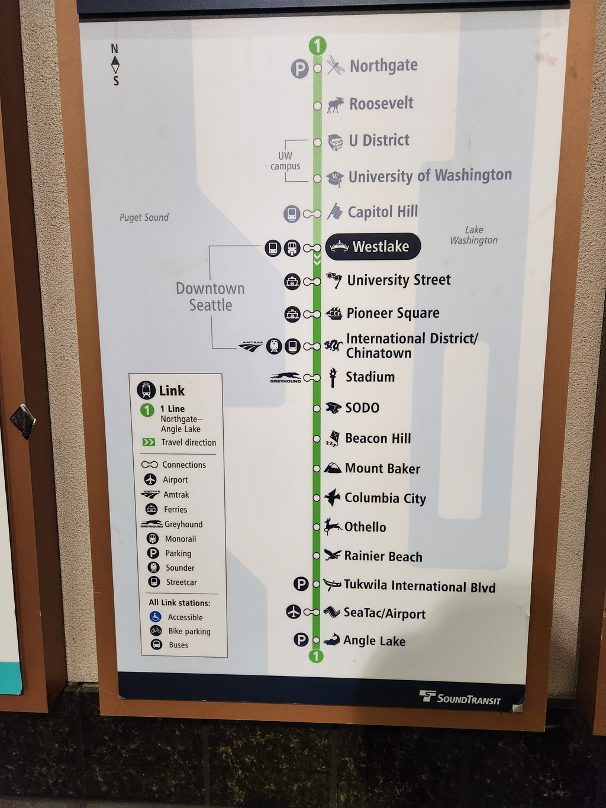
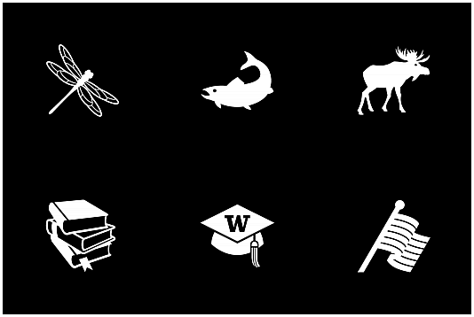
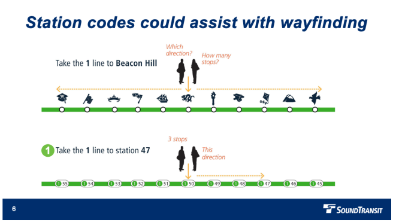
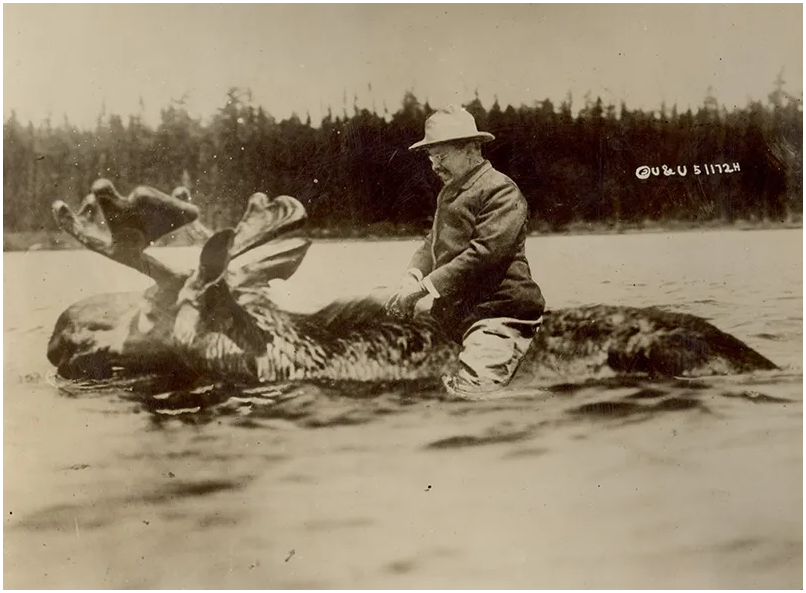

## 2023 Seattle Link Pictograms

2020-12-17 [An alternative to Link station pictograms – Seattle Transit Blog](https://seattletransitblog.com/2020/12/17/an-alternative-to-link-station-pictograms/): 

> 
>
> Each Link light rail station has a pictogram as a secondary identifier intended for people with limited English language proficiency. However well intentioned, the pictograms are [poorly implemented](https://www.transitmap.net/sound-transit-icons/) and lack a logical system underlying their construction.

2022-11-14 [Station Codes will Replace Link Pictograms – Seattle Transit Blog](https://seattletransitblog.com/2022/11/04/station-codes-will-replace-link-pictograms/)

> 
>
> In the next Link expansion, riders will have another shorthand way of identifying stations and navigating the system. The rarely used station pictograms will be retired in favor of a system of station codes based on international best practice. Similar to bus stops, airport gates, and freeway exits, stations will have a 3-digit code consisting of the line number and a sequential station number. Sound Transit staff [presented the new approach](https://www.soundtransit.org/st_sharepoint/download/sites/PRDA/ActiveDocuments/Presentation - Station Codes 11-3-22.pdf) to the ST Board’s Rider Experience & Operations Committee last Thursday.

2023-02-16 [List of Link light rail stations - Wikipedia](https://en.wikipedia.org/wiki/List_of_Link_light_rail_stations)

2015-07-06 [ST Unveils New Link Station Pictograms – Seattle Transit Blog](https://seattletransitblog.com/2015/07/06/st-unveils-new-link-station-pictograms/)

> 
>
> - **Angle Lake** is represented by [a rainbow trout](https://en.wikipedia.org/wiki/Rainbow_trout), which can [be caught](http://wdfw.wa.gov/fishing/washington/1/) in the lake. The shape of the fish also resembles the shape of the lake itself. It is the official state fish and the state stocks the lake with it. Expect to see people with their fishing gear on the train when the station opens later in 2016.
> - **Capitol Hill** is the [rainbow ‘Pride’ flag](https://en.wikipedia.org/wiki/Rainbow_flag_(LGBT_movement)), honoring the neighborhood’s association with Seattle’s LGBT community. Although the actual flag is commonly seen with six colored stripes, the pictogram is rendered in monochrome as part of its signage program, ST spokesperson Bruce Gray [told Capitol Hill Seattle Blog](http://www.capitolhillseattle.com/2015/07/sound-transit-selects-pride-flag-as-capitol-hill-station-icon/).
> - **University of Washington** is a mortarboard cap with the UW’s block ‘W’ logo. This is the most obvious of the pictograms, at least to this Husky. The mortarboard represents academia and is worn in the commencement ceremony which the UW hosts in Husky Stadium, whose parking lot the station is situated. The university and the medical center is the block ‘W’ logo. The logo is trademarked and ~~I assume ST was told me they got granted permission to use it~~ ST was given permission by the UW to use it.
> - **U District** is a stack of three thick textbooks, possibly referring to the nearby University Book Store which has anchored “The Ave” shopping district for more than 90 years. The books also represent education, which is why the neighborhood exists.
> - **Roosevelt** is a Bull Moose, a nickname for the [Progressive Party](https://en.wikipedia.org/wiki/Progressive_Party_(United_States,_1912)) founded by Theodore Roosevelt, who is the neighborhood’s namesake. The neighboring street and high school are also named after the 26th president. At first glance, it could be seen as a [Roosevelt Elk](https://en.wikipedia.org/wiki/Roosevelt_elk) but people who know their moose from their elk can tell them apart.
> - **Northgate** is a dragonfly. It mimics [the Green Darner Dragonfly artwork](http://www.soundtransit.org/Documents/pdf/projects/link/north/northgate/20140312_NORTHGATE_90prcnt_quickscreens.pdf) to be installed in the station, which can be seen from the platform and mezzanine. Dragonflies are commonly found in the recently daylighted Thornton Creek near the station. The dragonfly is also the state insect.

2023-02-16 👀  [Myths debunked: Sadly, Theodore Roosevelt never rode a moose Houghton Library Blog](https://blogs.harvard.edu/houghton/myths-debunked-sadly-theodore-roosevelt-never-rode-a-moose/)

> Many of Theodore Roosevelt’s adventures seem like something out of a tall tale: he survived an [assassination attempt](http://blogs.law.harvard.edu/houghton/2012/11/02/youve-got-mail-it-takes-more-than-that-to-kill-a-bull-moose/); nearly died while [exploring the Amazonian jungle](http://www.youtube.com/watch?v=fKXOtJeaTEQ); and became the first president to drive a car and [fly in a plane](http://www.youtube.com/watch?v=NaFulqGGkwk); among many others. Despite having been a larger-than-life figure, this is one thing that TR never did:
>
> 
>
> In 1912, TR was campaigning as a promising third party presidential candidate for the newly created Progressive (or Bull Moose) Party. Political cartoons frequently used a moose to illustrate the party’s struggles and flaws, but perhaps none so creatively as a collage by the photography firm Underwood and Underwood, titled “The Race for the White House” (apologies for the poor quality of the image; an original copy of the newspaper could not be found):