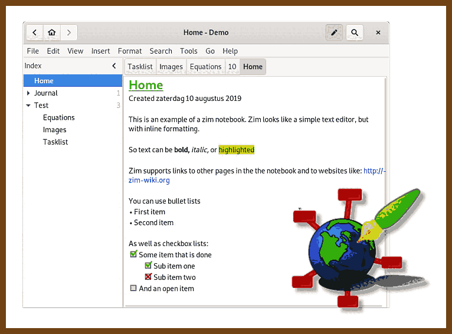
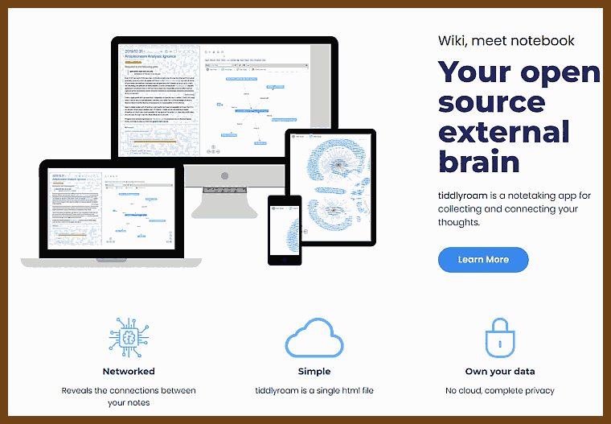
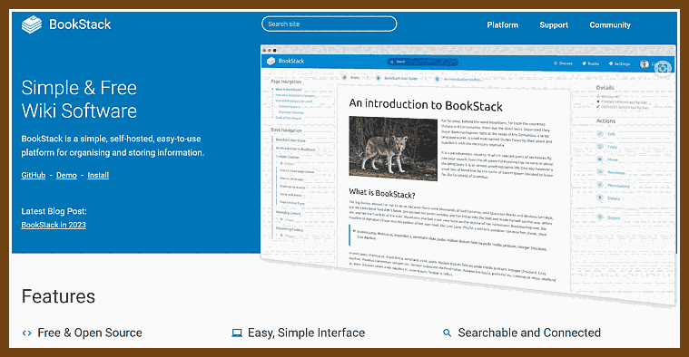

# Knowledge Management
And personal wiki

2022-01-26 [Zim - a desktop wiki](https://zim-wiki.org/)

> Zim is a graphical text editor used to maintain a collection of wiki pages. Each page can contain links to other pages, simple formatting and images. Pages are stored in a folder structure, like in an outliner, and can have attachments. Creating a new page is as easy as linking to a nonexistent page. All data is stored in plain text files with wiki formatting. Various plugins provide additional functionality, like a task list manager, an equation editor, a tray icon, and support for version control.
>
> 

2022-01-19 [Obsidian](https://obsidian.md/) 

> A second brain, for you, forever. Obsidian is a powerful knowledge base on top of
> a local folder of plain text Markdown files.
>
> 

2022-01-19 [logseq A privacy-first, open-source knowledge base](https://logseq.com/) 

>  Logseq is a joyful, open-source outliner that works on top of local plain-text Markdown and Org-mode files. Use it to write, organize and share your thoughts, keep your to-do list, and build your own digital garden.
>
> 

2022-01-19 [Dendron](https://www.dendron.so/)

> 2022-01-19 [Dendron: A personal knowledge management  PKM  solution built on VS Code   Hacker News](https://news.ycombinator.com/item?id=29998680)
>
> 

2022-01-18 [tiddlyroam · your open source external brain](https://tiddlyroam.org/)

> 

2022-01-18 [BookStack Wiki](https://www.bookstackapp.com/) a personal wiki

> 

2022-01-18 ⭐  [About This Website · Gwern.net](https://www.gwern.net/About) **Personal Wiki** 

> The content here varies from statistics to psychology to self-experiments/Quantified Self to philosophy to poetry to programming to anime to investigations of online drug markets or leaked movie scripts (or two topics at once: anime & statistics or anime & criticism or heck anime & statistics & criticism!).I believe that someone who has been well-educated will think of something worth writing at least once a week; to a surprising extent, this has been true. (I added ~130 documents to this repository over the first 3 years.)

> 