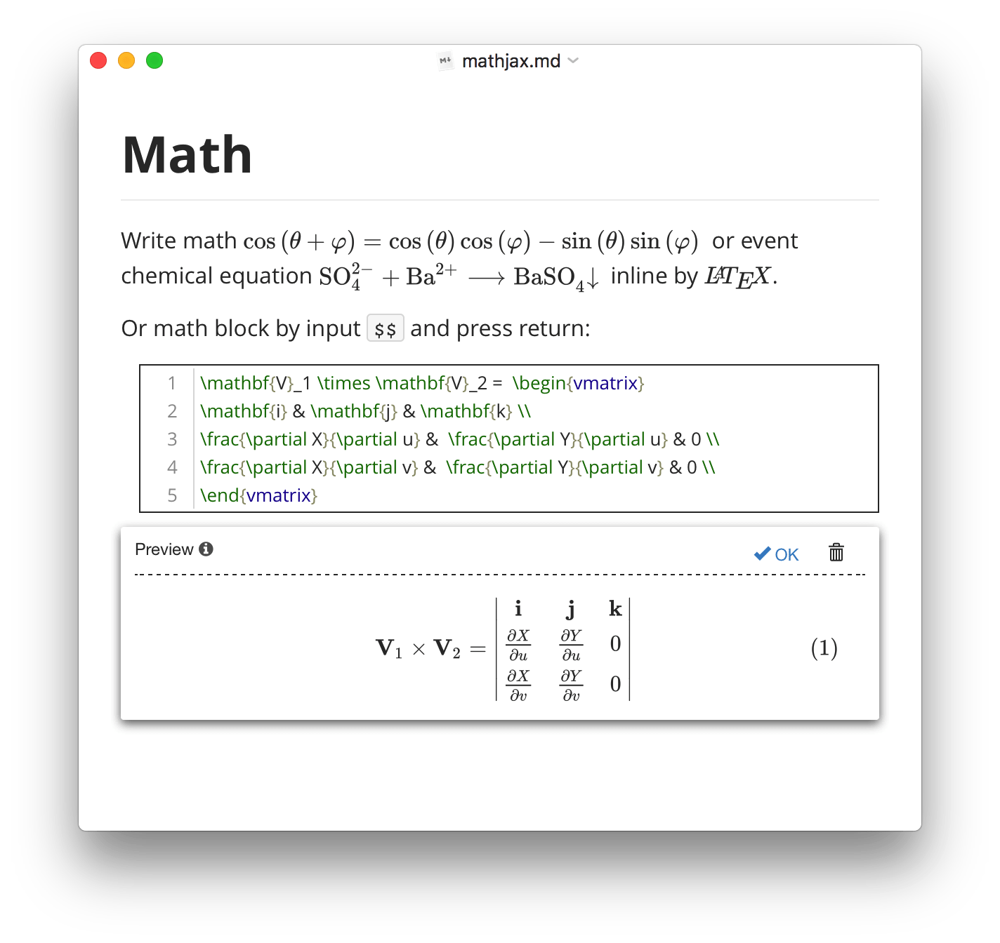
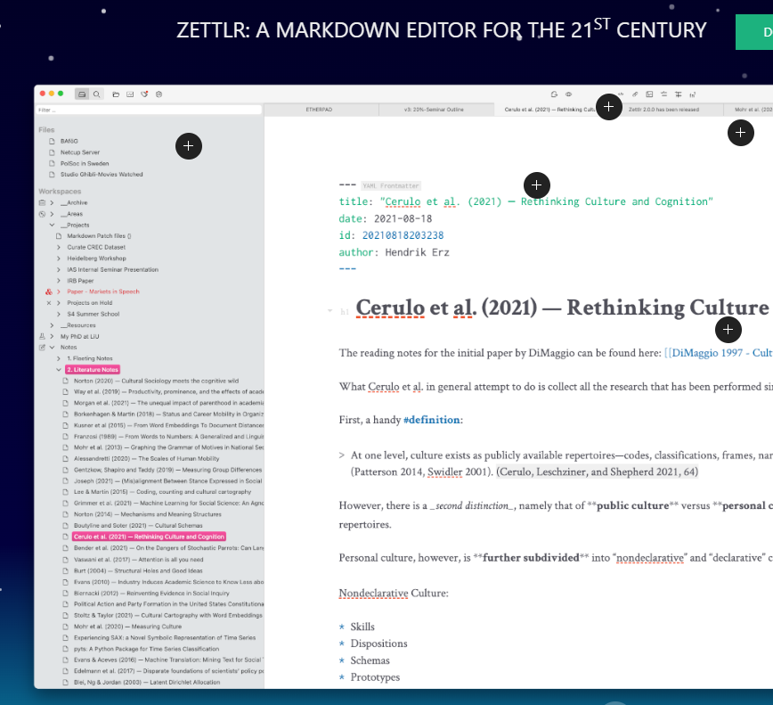
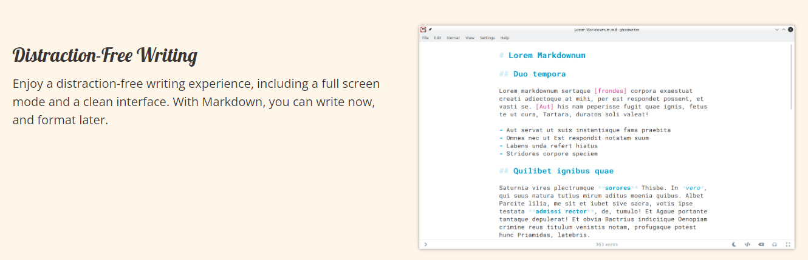

## Markdown and text tools

2022-03-05 [Paste to Markdown](http://euangoddard.github.io/clipboard2markdown/)

> This tool allows to paste a rich text and convert it to markdown. Project: [euangoddard/clipboard2markdown: Convert rich-text on your clipbaord to markdown](https://github.com/euangoddard/clipboard2markdown)
2022-02-27 [Text Summarizer QuillBot AI](https://quillbot.com/summarize)

> Text summarization tool
2022-02-27 [icoxfog417/awesome-text-summarization: The guide to tackle with the Text Summarization](https://github.com/icoxfog417/awesome-text-summarization#libraries)

> To take the appropriate action, we need latest information.
But on the contrary, the amount of the information is more and more growing. There are many categories of information (economy, sports, health, technology...) and also there are many sources (news site, blog, SNS...).
2022-04-07 [showdownjs/showdown: A bidirectional Markdown to HTML to Markdown converter written in Javascript](https://github.com/showdownjs/showdown)

> Showdown is a JavaScript Markdown to HTML converter, based on the original works by John Gruber. Showdown can be used client side (in the browser) or server side (with Node.js).
> Check out a live demo here: http://demo.showdownjs.com/
2022-07-18 [marktext/marktext: 📝A simple and elegant markdown editor, available for Linux, macOS and Windows.](https://github.com/marktext/marktext)

> MarkText is an MIT licensed open source project, and the latest version will always be downloadable for free from the GitHub release page.

## Editors

2022-11-05 [Typora — a markdown editor, markdown reader.](https://typora.io/)

> 

2022-10-16 [marktext/marktext: 📝A simple and elegant markdown editor, available for Linux, macOS and Windows.](https://github.com/marktext/marktext)

> MarkText is an MIT licensed open source project, and the latest version will always be downloadable for free from the GitHub release page.
> 
2023-03-02 [AppFlowy.IO](https://appflowy.io/)

> 

2023-03-02 [A Markdown Editor for the 21st Century Zettlr](https://www.zettlr.com/)

> 

2023-03-02 [ghostwriter - No excuses. No distractions. Just write.](https://ghostwriter.kde.org/)

> 

## Markdown Chrome Extensions
2022-06-11 [Copy as Markdown - Chrome Web Store](https://chrome.google.com/webstore/detail/copy-as-markdown/nlaionblcaejecbkcillglodmmfhjhfi)

> Browser extension to copy hyperlinks, images, and selected text as Markdown
2022-06-11 [Copy as Markdown - Chrome Web Store](https://chrome.google.com/webstore/detail/copy-as-markdown/fkeaekngjflipcockcnpobkpbbfbhmdn)

> Copy as Markdown is a Chrome extension which can help you copy the following things as Markdown to your system clipboard
2022-06-11 [Copycat - Chrome Web Store](https://chrome.google.com/webstore/detail/copycat/jdjbiojkklnaeoanimopafmnmhldejbg)

> This extension creates a right-click menu to provide copy functionality, which is used by right-clicking on the supported content of pages.

## Vale Proofreading 

2023-05-20 [Vale.sh](https://vale.sh/)

Vale is an open-source, command-line tool used for syntax-aware text proofreading. It can help enforce style and consistency across various types of content.

## Converters

2023-06-30 [Introduction - mdBook Documentation](https://rust-lang.github.io/mdBook/)

> **mdBook** is a command line tool to create books with Markdown. It is ideal for creating product or API documentation, tutorials, course materials or anything that requires a clean, easily navigable and customizable presentation.
>
> - Lightweight [Markdown](https://rust-lang.github.io/mdBook/format/markdown.html) syntax helps you focus more on your content
> - Integrated [search](https://rust-lang.github.io/mdBook/guide/reading.html#search) support
> - Color [syntax highlighting](https://rust-lang.github.io/mdBook/format/theme/syntax-highlighting.html) for code blocks for many different languages
> - [Theme](https://rust-lang.github.io/mdBook/format/theme/index.html) files allow customizing the formatting of the output
> - [Preprocessors](https://rust-lang.github.io/mdBook/format/configuration/preprocessors.html) can provide extensions for custom syntax and modifying content
> - [Backends](https://rust-lang.github.io/mdBook/format/configuration/renderers.html) can render the output to multiple formats
> - Written in [Rust](https://www.rust-lang.org/) for speed, safety, and simplicity
> - Automated testing of [Rust code samples](https://rust-lang.github.io/mdBook/cli/test.html)
>
> This guide is an example of what mdBook produces. mdBook is used by the Rust programming language project, and [The Rust Programming Language](https://doc.rust-lang.org/book/) book is another fine example of mdBook in action.
