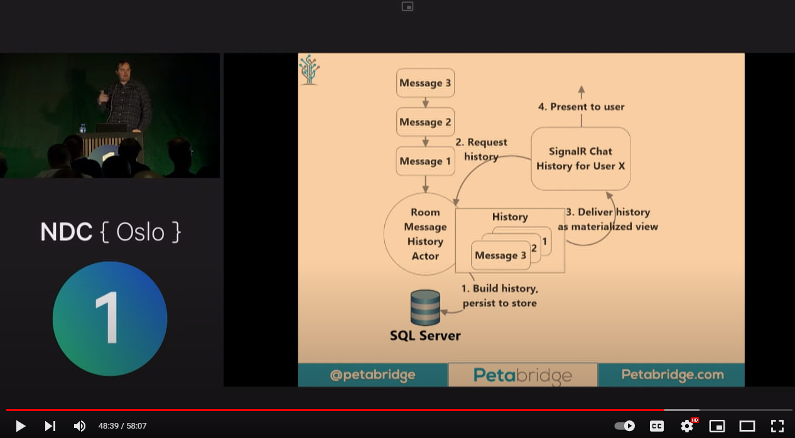
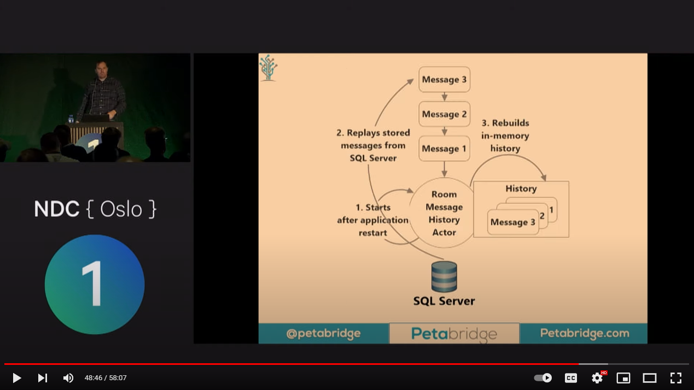

## 2022-12-14 Microsoft Orleans and Akka.NET learning project

This page is mostly about Microsoft Orleans, but Akka.NET is also a great product with lots of shared topics. 

## The Goal

Can I use Microsoft Orleans for efficient big data processing?

## Recommendations

- Use event-sourcing to recover actor state

## Core concepts

- Actor
- Event Sourcing

## Videos

2022-12-14 [Death to Latency: Building Reactive, Cloud Native Apps with Akka.NET - Aaron Stannard - NDC Oslo - YouTube](https://www.youtube.com/watch?v=EgKg0QvvlDk)

Recommendation from this talk is using event sourcing to recover actor state. 

Recovery Process:

 

