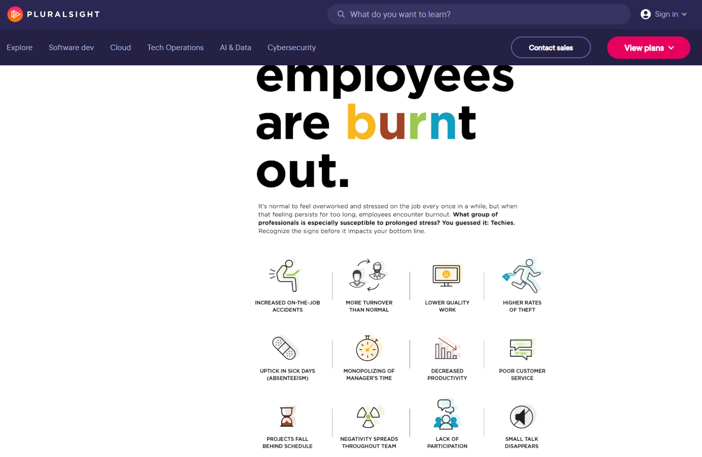
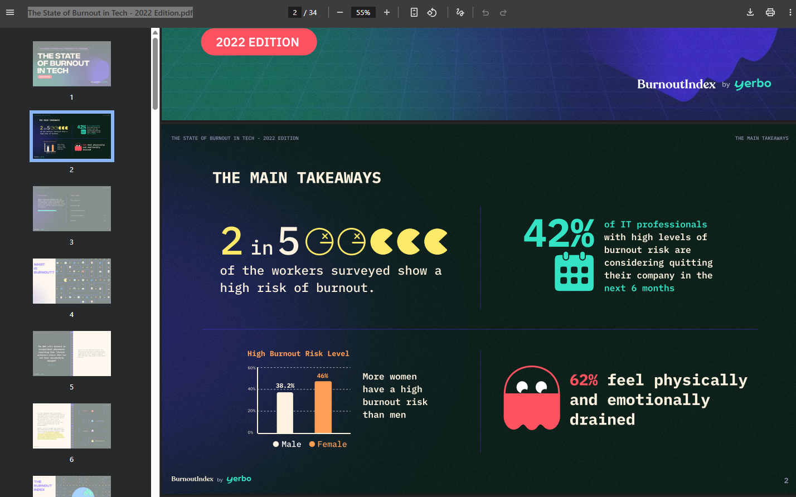

# Psy-Burnout (mental wellbeing)
Date: 2024-11-03

**Disclaimer:**

This page shares a variety of experiences, insights, and resources on burnout from people in the field, but it’s important to remember that these are shared perspectives, **not professional advice**. I strongly recommend that anyone dealing with burnout or mental health challenges reach out to a **well-being professional** or **therapist** for personalized support.

Burnout can feel overwhelming and, in my view, is rarely a result of personal failings. I **guestimate** that in 95% of cases, burnout occurs when we least expect it—often from factors outside of our control, like high-pressure environments, lack of support, or unclear boundaries. Many people experience burnout due to external pressures rather than personal weakness.

While I hope the information here provides some helpful perspectives, please don’t rely solely on what’s shared here to make decisions. Instead, consider this as one of many resources that might guide you toward understanding burnout better and taking action. By preparing ourselves with awareness and setting healthy boundaries, we can often be better prepared to manage burnout in the future.

## About: Well-being

[The Science of Well-Being by Yale University](https://www.coursera.org/learn/the-science-of-well-being)  { www.coursera.org }

> 
>
> This **free online course**, taught by Professor **Laurie Santos**, explores the science behind happiness. It delves into common misconceptions about what makes us happy and offers practical strategies to enhance well-being. Participants engage in challenges designed to build more productive habits and increase happiness. The course is self-paced, allowing learners to progress at their own speed. It's an excellent resource for anyone interested in understanding and improving their mental health.
>
> The course covers topics such as:
>
> - Why our expectations about happiness are often wrong
> - How our minds mislead us about what will make us happy
> - Strategies to overcome biases and improve well-being
> - Practical activities to boost happiness, like gratitude exercises and mindfulness practices
>
> By the end of the course, you'll be equipped with research-backed techniques to foster a more fulfilling life.

## Tech worker burnout: What it is, and how to deal with it

2025-07-21 [Tech worker burnout: What it is, and how to deal with it](https://www.pluralsight.com/resources/blog/cloud/tech-it-worker-burnout) {www.pluralsight.com}

> 

## How can I fight tech burnout?

You’re feeling burned out, and you want to do something about it. Here’s a list of things you can try to get back to a healthy place with your work and safeguard your mental health.

**1. Set boundaries between home and work**

Remember how I mentioned tech professionals reported feeling more burned out after the pandemic started, even when they got to work from home? It’s because the line between home and work blurred, so there was no escape - they were “living at work.”

Here are some things you can do to establish that physical boundary:

- Remove your work email and messaging platforms from your phone, or turn off notifications for non-work hours
- Set out-of-office emails when you’re off for the day, weekend, or vacation
- Set periods in your calendar to automatically reject meetings in your downtime
- If you work hybrid or remotely, set up a separate room for your office, and don’t go in there for recreational activities

**2. Automate what you can**

According to [Adam Bertram](https://app.pluralsight.com/profile/author/adam-bertram), one of the tools tech pros can use is to [automate everything where you can](https://www.pluralsight.com/blog/career/3-ways-it-pros-can-prevent-job-burnout-) to lessen the load.

“Automation is the next best thing to actually getting more warm bodies in the department to help out,” he said.

“Take a moment to breathe, dial it back a little and realize that in order to save time you must first find the time to automate.”

**3. Reach out to others**

When you feel like you exist to work, then it’s hard to value yourself outside of that. Spending time with your family members and friends, or simply being out in the world, can make you start to value the “real you” instead of just thinking about the “work you.”

If you’re feeling burned out, reaching out to a health-care professional (like your doctor, a counselor, or psychologist) is important. Because burnout is so common, know that you’re not alone, and there are a lot of tried and true methods that can be used to help. 

Asking your colleagues for help - or simply talking to them about your problems - is a good move. Not only is this good for you, it encourages them to do the same when they are struggling. If your workplace offers an Employee Assistance Program, this is also worth taking advantage of.

**4. Talk to your boss** (Caution: some bosses are unable to understand the issue or make the right decisions)

Sometimes, your supervisor doesn’t know you’re struggling. Telling them you’re not okay isn’t a sign of weakness, but a sign of professional strength and maturity. Remember, your boss wants to succeed at their job too, which is making sure they support their team.

It's not uncommon for employees to feel like they're jeopardizing their job by telling their boss they're not coping. If you feel this way, just remember it’s a lot more trouble for them if you burn out and quit. Then they’ve got to put out a job ad, interview people, spend months training them up - and that’s assuming they even find a replacement. All of that takes time and money.

In the grand scheme of things, making a few concessions to make sure you don’t burn out is in both your interests. 

Some of the things you can discuss:

- Moving some tasks to other team mates, or outsourcing the work
- Changing the deadline on tasks that are making you feel overwhelmed
- Reinforcing boundaries so people come to you less often, particularly in off hours
- Changing your role responsibilities to resolve what isn’t working for you
- Taking paid time off to rest and recharge
- Using flexible working hours to work when you feel most productive or functional
- Giving you more autonomy, recognition, and meaningful work
- Asking for clearer job expectations

**5. Find a company that values you**

Sometimes, it’s not you, it’s them. One of the biggest parts of burnout in technology is feeling like you don’t matter and you’re being treated unfairly - the work environment is toxic.

If you’ve brought up the issues and nothing is going to change, it’s time to investigate your other options. However, when you’re escaping a terrible job, it can be tempting to take the first offer you get.

This can be a mistake - you might wind up in the exact same situation all over again! Instead, when you’re being interviewed for a new job, make sure you’re interviewing *them* as well. Be confident, and know what your happiness is worth.

Here’s some things you should try to find out about your new workplace:

- What is the company culture like? Are there company events or happy hours?
- What is their attitude towards overtime and flexible hours? What are your hours? Does it include weekends and holidays?
- How much holiday leave is there? 
- Will they want you to always be on call? Are there crunch times?
- How many duties are you expected to perform? If there’s “additional duties as needed” on your PD, what does that include?
- Do you believe in their mission and product? Do they donate to charity or support causes?
- How do they recognize their employees, if at all?

## About: burnout (burnout stories)

[On Burnout, Mental Health, And Not Being Okay — Ludicity](https://ludic.mataroa.blog/blog/on-burnout-mental-health-and-not-being-okay/) { ludic.mataroa.blog }

> In the blog post "On Burnout, Mental Health, And Not Being Okay," the author shares personal experiences with burnout and mental health challenges, emphasizing that it's normal to feel "Not Okay" at times. They recount three significant episodes:
>
> 1. **University Stress**: During their fourth year studying psychology, the author faced extreme sleep deprivation due to unpaid night shifts and thesis pressures, leading to severe mood swings and prolonged sadness.
> 2. **Professional Burnout**: In early 2019, while working in a demanding role, they experienced burnout characterized by emotional exhaustion and a sense of detachment from their work.
> 3. **Personal Struggles**: The author also discusses personal challenges, including feelings of inadequacy and the impact of societal expectations on mental health.

2023-08-05 [Dark Side of Remote Work – Personal Experience - DEV Community](https://dev.to/viktoriabors/dark-side-of-remote-work-personal-experience-5dch)

> The author, a remote junior Javascript developer, shares her struggles with remote work. Despite the appeal of flexibility, she faced challenges including the reality of spending all day at home, the loneliness that resulted from missing office interactions, and mental exhaustion from a lack of routine and breaks. The continuous focus on work led to near burnout, making her consider a hybrid work model that combines remote work with office days for better work-life balance and social interaction.

2024-11-04 [A Programmers Guide to Stress](https://blog.zharii.com/docs/psy-saved-articles/a-programmers-guide-to-stress) { blog.zharii.com } 

> by Daragh Byrne discusses recognizing and managing stress unique to developers.
>
> I almost lost my mind because I wasn’t taking care of it. Way too much crunch time for an important project, coupled with some ongoing issues in my personal life, pushed my ability to cope with day-to-day life into the red.
>
> My heart raced. My mind raced. My ability to think clearly—so important when you’re trying to get working software out the door—went through the floor.
>
> I was super, super stressed.

2024-08-18 [Burnout - When does work start feeling pointless? | DW Documentary - YouTube](https://www.youtube.com/watch?v=raVms8w61No) { www.youtube.com }

> 
>
> 1. **Workplace Dysfunction**: Bureaucratic inefficiency, administrative bloat, and unnecessary meetings create a sense of sabotage in modern offices. **Solution**: Streamline decision-making and reduce bureaucratic roles.
> 2. **Employee Burnout**: Burnout is widespread due to overwork, isolation, and emotional stress. **Solution**: Acknowledge the signs of burnout, reduce workload, and foster open communication.
> 3. **Managerial Failures**: Many managers lack the skills to lead effectively, causing disengagement and poor team dynamics. **Solution**: Train managers in leadership and emotional intelligence.
> 4. **Corporate Culture**: Frequent reorganizations and unfair treatment create cynicism and stress among employees. **Solution**: Ensure fair policies and minimize unnecessary restructurings.
> 5. **Lack of Meaningful Work**: Employees feel disconnected from the social value of their work, seeing it as pointless. **Solution**: Align work tasks with human values and meaningful contributions.
>
> The most critical issues are **employee burnout** and the **disconnect between management and workers**, both of which contribute to widespread dissatisfaction and inefficiency in workplaces. Addressing these through better leadership training, reducing unnecessary work, and improving workplace communication can lead to healthier, more engaged employees.

2024-11-04 [Burnout](https://gist.github.com/stormwild/d8e33879a08a2b6351563d986afc1a7b) { gist.github.com }

Stress vs. Burnout

| Stress                              | Burnout                                 |
| ----------------------------------- | --------------------------------------- |
| Characterized by over-engagement.   | Characterized by disengagement.         |
| Emotions are overreactive.          | Emotions are blunted.                   |
| Produces urgency and hyperactivity. | Produces helplessness and hopelessness. |
| Loss of energy.                     | Loss of motivation, ideals, and hope.   |
| Leads to anxiety disorders.         | Leads to detachment and depression.     |
| Primary damage is physical.         | Primary damage is emotional.            |
| May kill you prematurely.           | May make life seem not worth living.    |

[Understanding Job Burnout - Dr. Christina Maslach - YouTube](https://www.youtube.com/watch?v=gRPBkCW0R5E) { www.youtube.com }

> 

[Burn-out an "occupational phenomenon": International Classification of Diseases](https://www.who.int/news/item/28-05-2019-burn-out-an-occupational-phenomenon-international-classification-of-diseases#:~:text=“Burn-out is a syndrome,related to one's job%3B and)

> 
>
> “Burn-out is a **syndrome conceptualized as resulting from chronic workplace stress that has not been successfully managed**. It is characterized by three dimensions:
>
> - feelings of energy depletion or exhaustion;
> - increased mental distance from one’s job, or feelings of negativism or cynicism related to one's job; and
> - reduced professional efficacy.

2024-12-21 [Burnout ≠ Working Too Much – Terrible Software](https://terriblesoftware.org/2024/12/20/burnout-%e2%89%a0-working-too-much/) { terriblesoftware.org }

> If burnout was a natural byproduct of working too much (or too hard, or for too many hours), we’d see every founder/C-level suffering from it. And yet… they’re generally doing just fine; ICs and middle managers, on the other hand, are usually taking the biggest hit.
>
> Preventing burnout from happening on our teams means that first we need to identify the *real* causes of it, otherwise we’re just sending people to long vacations hoping the problem fixes itself. (It won’t.)
>
> Each case is different (of course), but from what I’ve seen with engineering teams over time, **burnout usually isn’t about work’s *volume* —it’s about a lack of purpose or agency**.
> ...
> 🟠 If you’re looking for something more practical, here’s what I usually do:
>
> - **Alignment, alignment, alignment:** Before kicking off any project, I share why I’m considering them for the job. I provide links to product specs, design docs, and user research so they understand the problem space. This simple step gives them agency and aligns their work with their interests and career goals.
> - **Clean-up period**: After wrapping up a project, we set aside two weeks for engineers to choose what they want to work on—refactoring messy code, experimenting with new technologies, improving internal tooling, or tackling long-ignored bugs. This autonomy gives them a sense of ownership and keeps intrinsic motivation high.
> - **Impact** **reminders**: Every now and then, I’ll show how the team’s work connects back to the company’s objectives. If you use OKRs (or any similar goal-setting framework), tie their efforts to those key outcomes. By repeatedly highlighting the real-world impact they’ve had—like improving user satisfaction scores, reducing operational costs, or enabling a new product launch—you reinforce the purpose behind their day-to-day tasks.

2025-01-13 [Tech Burnout - YouTube](https://www.youtube.com/watch?v=dEnH69thZm0) { www.youtube.com }

> > "Kronos, a large human resource software company, came out with a report called the employee burnout crisis. They surveyed 614 HR leaders and 95% of them report that employee burnout is one of the leading causes why people are quitting their jobs."
>
> The speaker describes their personal experience with burnout in 2018, citing **overcommitment** as the main factor. They juggled computer science tutoring, physics coursework, robotics research, two jobs, and resume-building efforts. Initially manageable with time management, the workload gradually eroded their free time, social life, and sleep. This illustrates how unchecked ambitions and overcommitment lead to physical and mental exhaustion.
>
> > "I took on too much responsibility at once... Physics is kind of demanding. I'm taking some physics. I am a robotics researcher at another school... trying to build up my resume with internships and stuff."
>
> A key insight is the **unsustainable push to 100% effort**. The speaker adopts an **80% rule**: working slightly below maximum capacity to prevent draining their energy reserves entirely. By maintaining consistent effort, they avoid complete exhaustion and the long recovery periods it necessitates.
>
> > "If you're going 100% each day or pushing yourself past 100%, eventually you're going to empty your tank... With 80%, you're still doing enough to improve, but you won't ever reach that point of burnout."
>
> The discussion broadens to the pressures in the **tech industry**, where competition and high expectations drive people to overwork. Many compare themselves to peers achieving exceptional success, leading to **overcommitment**. **Burnout often arises from taking on too many responsibilities without recognizing personal limits.**
>
> Mental health is another focus. The speaker acknowledges burnout's impact on those with **pre-existing mental health issues** and shares an anecdote of someone experiencing **secondary psychosis** from extreme overwork. This underscores the critical need for self-awareness and balance.
>
> **Key strategies to combat burnout include**:
>
> 1. Following the 80% rule for sustainable productivity.
> 2. Reflecting on personal goals and values to ensure alignment with one’s activities.
> 3. Learning to estimate time and energy realistically for tasks, especially in tech-related fields.
> 4. Avoiding external pressures (e.g., family expectations or societal benchmarks) that lead to unwanted obligations.
>
> The speaker concludes by emphasizing the importance of **self-reflection**: regularly assessing whether current endeavors align with personal happiness and long-term fulfillment.
>
> > "You underestimate how much goes into achieving these goals... over time, you might be shaping yourself into someone you don't want to be, doing a lot of things that you don't want to be doing."

## Inside burnout: Rest and Relaxation

Prioritize adequate sleep and engage in restful activities to allow the body and mind to recuperate.  Incorporate simple mindfulness exercises, such as deep breathing or short meditation sessions, to reduce stress and enhance present-moment awareness. Or a good book, movie or even video game may distract you from burnout and help you rest. 

## Inside burnout: Social Connection

Reach out to trusted friends or family members for emotional support. Sharing your feelings and experiences can help alleviate feelings of isolation. However, not everyone has a trusted friend nearby. YouTube can sometimes serve as a surrogate for social connection—who knows, it might even be a better alternative at times. Please avoid any activities, including certain discussions, that could negatively impact your mood.

## The right ways

### Code changes

2024-01-27 [Long Term Refactors - Max Chernyak](https://max.engineer/long-term-refactors) 

> I have a theory that long refactors get a bad rap because most of them take far longer than we expect. The length leads to stress, an awkward codebase, a confused team, and often no end in sight. Instead, what if we *prepared* an intentional long term refactor? A few years ago, I began trying this method, and it has led to some surprisingly successful results:
>
> - We didn’t need to negotiate business timelines.
> - We didn’t need to compete against business priorities.
> - The team quickly understood and even took ownership of the refactor over time.
> - There was no increase in stress and risk of burnout.
> - PRs were easy to review, no huge diffs.
> - The refactor was consistently and collaboratively re-evaluated by the entire team.
> - We never wasted time refactoring code that didn’t need it.
> - Our feature development remained unblocked.
> - The team expanded their architectural knowledge.
> - The new engineers had a great source of first tasks.
> - We rolled out the refactor gradually, making it easier to QA, and reducing bugs.

[Beating Burnout: A guide for supporting mental health at work](https://almanac.io/docs/beating-burnout-a-guide-for-supporting-mental-health-at-work-yDLKVF3uJtMdshcZG37HP7OHpAczogYX) { almanac.io }

>  Are you...
>  - Burned out by constant meetings?
>  - Distracted by the overwhelming load of Slack and email?
>  - Unable to maintain focus at work?
>  - Finding even the smallest of tasks both physically and mentally debilitating?
>  - Thinking about changing careers?
>
>  If you're feeling any of these things, you're not alone. Career burnout is happening to a lot of people.
>
>  For individual contributors
>  Take care of yourself and advocate for change:
>
>  - **Be unapologetically clear about your personal and professional boundaries.** This means [knowing your personality needs](https://www.psychologytoday.com/us/blog/prescriptions-life/201902/why-lack-boundaries-can-lead-burnout) and sticking to them, just as much as it does setting aside time to focus on essential work. If your organization uses Slack, use the "Set status" functionality to communicate your availability.
>
>  - **Block times on your calendar when you are unavailable,** need to focus on deep work, or simply need a break. Lean into pushing back against unnecessary meetings.
>
>  - **Get off social media.** This is especially true for those working in digital marketing and social media. With political tensions high and bots promoting misinformation at increasing levels, Twitter can seem like an ["always on trauma machine."](https://digiday.com/media/social-media-managers-grapple-with-burnout/) Better to take a break.
>
>  - Go for a walk. Get exercise. **Just take a break.**
>
>  - **Evaluate your options.** Perhaps the burnout you are experiencing is a result of a toxic company culture, in which case your best bet might be to move on.

## After burnout: Physical Activity

Gradually introduce regular exercise, such as walking or yoga, to boost mood and energy levels.

## After burnout: Time Management

Develop organizational skills to balance work and personal life effectively, setting realistic goals and priorities.

## After burnout: Set Boundaries

Establish clear limits between professional and personal time to ensure adequate rest and leisure.

[psy-2022-07-28-BoundariesMeeting](https://blog.zharii.com/docs/psy-2022-07-28-BoundariesMeeting) { blog.zharii.com }

> Setting personal boundaries is essential for preventing burnout and fostering self-respect. This guide emphasizes the importance of boundaries to protect time, space, and mental bandwidth. Poor boundaries can lead to resentment, stress, and unintentional messages like undervaluing personal needs. Practical tips include defining work hours, reducing constant availability, and using tools like "Out of Office" settings. It's up to each individual to set, communicate, and model these boundaries clearly to ensure a balanced and sustainable approach to work and life.

## After burnout: Engage in Hobbies and Continuous Learning

Pursue enjoyable activities that provide fulfillment and a sense of accomplishment outside of work. Invest in personal and professional development to foster growth and adaptability, enhancing job satisfaction.

## Quotes

2024-11-04 [How to be a -10x Engineer](https://taylor.town/-10x) { taylor.town }

> **Minus** 10x! 
>
> **(☣️Toxicity)** Create 400 hours of burnout/turnover.
> Be thankless. Foist blame. Sow confusion. Get angry. Cause others to work overtime.

2023-08-05 [Team management tips: 10 ways to kill a team](https://www.dsebastien.net/2020-08-20-10-ways-to-kill-a-team/)

> Putting too much pressure on a group is a perfect recipe for breaking a team. People that are under too much pressure for too long will either burn out or leave to protect themselves (and rightly so!).
>
> Also: Ignoring Team Input Lack of Empathy, Setting Unrealistic Deadlines, Unclear Goals, Not Tracking Progress, Resisting Innovation, Creating Isolated Teams, Micro-management

2024-11-04 [Developers experience burnout, but 70% of them code on weekends : r/programming](https://www.reddit.com/r/programming/comments/18sn8f8/comment/kf95pwx/) { www.reddit.com } (**code therapy**)

>  Exactly. I work on [my open source project](https://thomasmertes.github.io/Seed7Home) **to stay mentally healthy**.
> 
>  Programming **in companies** is what stresses us. There are countless issues:
> 
> - Managers who know everything better because they have programmed too (30 years ago for one week in BASIC under DOS).
> - Programs that tell you what you are allowed to check in (ExpensiveSourceCodeCheckProgram forbids checking in because of rule 12345).
> - Fellow developers who tell in a scrum meeting that the task has zero storypoints, because it could be done in 1 hour (they take 3 days but the managers just think they are fast and you are slow).
> - Project owners who start bargaining how many storypoints should be estimated for a story.
> - Unit tests, that check just mocks, to reach some level of code coverage.
> - The need to write more XML, Maven, Jenkins, etc. stuff than actual Java (or other language) code.
> - Bosses doing time estimates without asking you (I have already promised to the customer that this will be finished tomorrow).

## Numbers

> 2023-12-28 [The State of Developer Ecosystem in 2023 Infographic | JetBrains: Developer Tools for Professionals and Teams](https://www.jetbrains.com/lp/devecosystem-2023/)
>
> Almost three-quarters or, more precisely, **73% of developers have experienced burnout,** according to Jet Brains’ report, The State of Developer Ecosystem 2023. The report summarizes insights on developers’ preferred languages and technologies, methodologies, and lifestyles gathered from 26,348 developers from all around the globe.
>
> Another rather unexpected statistic involving three-quarters of developers answers the question of whether they have ever **quit a learning program or a course**. And **75% of respondents said they had.**
>
> The reason? Only a 📌**minority** of developers like learning new tools, technologies, and languages through courses. Instead, they prefer **documentation and APIs ( 67%)** or **blogs and forums (53%)**. When it comes to the type of content they prefer for learning, 53% prefer written content and 45% video. As expected, video content is preferred by respondents aged 21-19.
>
> When asked how much time they spend on learning weekly, 41% of developers said it’s 3 to 8 hours, and 30% of them said it’s one to two hours.

[The State of Burnout in Tech - 2022 Edition.pdf](https://f.hubspotusercontent30.net/hubfs/7677235/The%20State%20of%20Burnout%20in%20Tech%20-%202022%20Edition.pdf)

> 

## Awesome Link collections

2024-11-04 [Awesome Mental Health](https://dreamingechoes.github.io/awesome-mental-health/#/) { dreamingechoes.github.io }

> 

