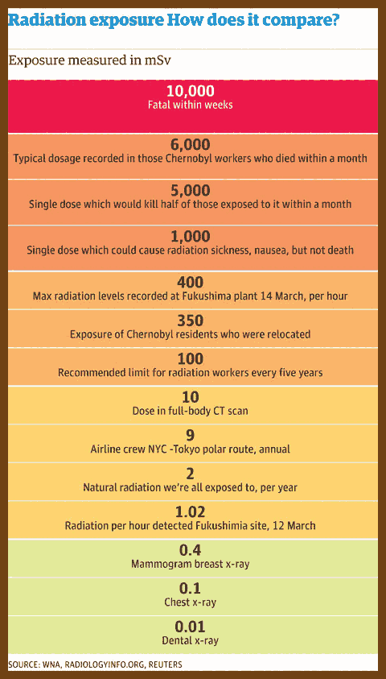

# ☢ Radiation
Date: 2023-05-28

2023-05-22 [Radioactivity measurements](https://aktinovolia.com/measurement-radioactivity-radiation/)

> 

> 

2023-05-22 [Radiation exposure: a quick guide to what each level means | World news | theguardian.com](https://www.theguardian.com/news/datablog/2011/mar/15/radiation-exposure-levels-guide)

> 

2023-05-22 [Radiation-exposure-levels-001.jpg (460×823)](https://static.guim.co.uk/sys-images/Guardian/Pix/photobylines/2011/3/15/1300200013379/Radiation-exposure-levels-001.jpg)

> 

