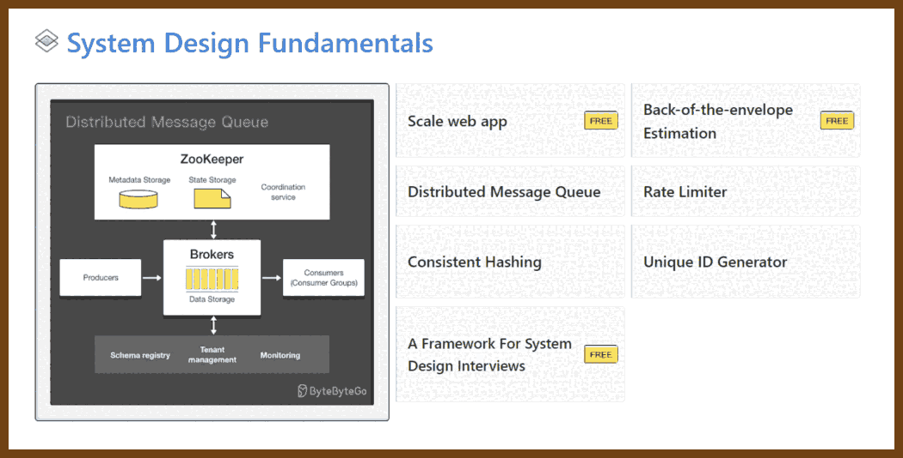

2024-01-22 [LEETCODE STRATEGY FOR 2024 | MY PERSONAL APPROACH WHICH GOT ME FAANG OFFERS | END TO END ADVICE - YouTube](https://www.youtube.com/watch?v=ZBmQlFeyEYI)

> 2024-01-22 [Blind 75 LeetCode Questions - LeetCode Discuss](https://leetcode.com/discuss/general-discussion/460599/blind-75-leetcode-questions)
>
> 2024-01-22 [How You Should Approach the NeetCode 150: A Kickstart Guide | by TheConnoisseur | Medium](https://medium.com/@theconnoisseur/how-you-should-approach-the-neetcode-150-a-kickstart-guide-b88b59819108)

2024-01-28 [Blind 75 Leetcode Java - All Questions Solved - YouTube](https://www.youtube.com/watch?v=PieZjz2Pyhw)

2023-12-26 [ByteByteGo | Technical Interview Prep](https://bytebytego.com/)

> 

2023-12-30 [42. Trapping Rain Water - LeetCode Solutions](https://walkccc.me/LeetCode/problems/0042/)

> 

